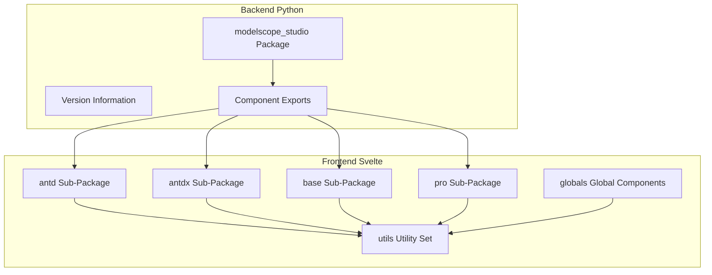
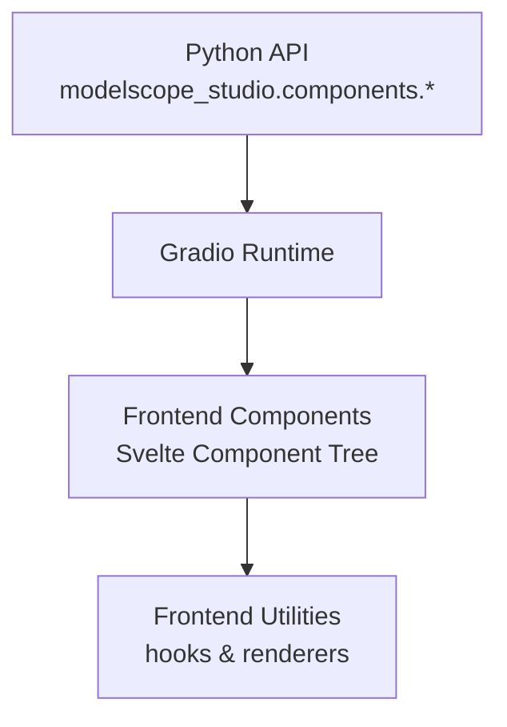
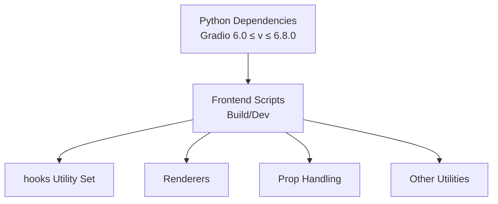

# API Reference

<cite>
**Files Referenced in This Document**
- [backend/modelscope_studio/__init__.py](file://backend/modelscope_studio/__init__.py)
- [backend/modelscope_studio/version.py](file://backend/modelscope_studio/version.py)
- [backend/modelscope_studio/components/__init__.py](file://backend/modelscope_studio/components/__init__.py)
- [backend/modelscope_studio/components/antd/__init__.py](file://backend/modelscope_studio/components/antd/__init__.py)
- [backend/modelscope_studio/components/antd/components.py](file://backend/modelscope_studio/components/antd/components.py)
- [backend/modelscope_studio/components/antdx/__init__.py](file://backend/modelscope_studio/components/antdx/__init__.py)
- [backend/modelscope_studio/components/antdx/components.py](file://backend/modelscope_studio/components/antdx/components.py)
- [frontend/antd/button/button.tsx](file://frontend/antd/button/button.tsx)
- [frontend/antd/form/form.tsx](file://frontend/antd/form/form.tsx)
- [frontend/antd/table/table.tsx](file://frontend/antd/table/table.tsx)
- [frontend/antdx/bubble/bubble.tsx](file://frontend/antdx/bubble/bubble.tsx)
- [frontend/base/application/application.ts](file://frontend/base/application/application.ts)
- [frontend/pro/chatbot/chatbot.ts](file://frontend/pro/chatbot/chatbot.ts)
- [frontend/pro/monaco-editor/monaco-editor.ts](file://frontend/pro/monaco-editor/monaco-editor.ts)
- [frontend/pro/multimodal-input/multimodal-input.ts](file://frontend/pro/multimodal-input/multimodal-input.ts)
- [frontend/pro/web-sandbox/web-sandbox.ts](file://frontend/pro/web-sandbox/web-sandbox.ts)
- [frontend/utils/hooks/useAsyncEffect.ts](file://frontend/utils/hooks/useAsyncEffect.ts)
- [frontend/utils/hooks/useAsyncMemo.ts](file://frontend/utils/hooks/useAsyncMemo.ts)
- [frontend/utils/hooks/useDeepCompareEffect.ts](file://frontend/utils/hooks/useDeepCompareEffect.ts)
- [frontend/utils/hooks/useEvent.ts](file://frontend/utils/hooks/useEvent.ts)
- [frontend/utils/hooks/useMount.ts](file://frontend/utils/hooks/useMount.ts)
- [frontend/utils/hooks/useUnmount.ts](file://frontend/utils/hooks/useUnmount.ts)
- [frontend/utils/hooks/useUpdateEffect.ts](file://frontend/utils/hooks/useUpdateEffect.ts)
- [frontend/utils/createFunction.ts](file://frontend/utils/createFunction.ts)
- [frontend/utils/renderSlot.tsx](file://frontend/utils/renderSlot.tsx)
- [frontend/utils/renderParamsSlot.tsx](file://frontend/utils/renderParamsSlot.tsx)
- [frontend/utils/renderItems.tsx](file://frontend/utils/renderItems.tsx)
- [frontend/utils/patchProps.tsx](file://frontend/utils/patchProps.tsx)
- [frontend/utils/omitUndefinedProps.ts](file://frontend/utils/omitUndefinedProps.ts)
- [frontend/utils/tick.ts](file://frontend/utils/tick.ts)
- [frontend/utils/upload.ts](file://frontend/utils/upload.ts)
- [frontend/globals/components/index.ts](file://frontend/globals/components/index.ts)
- [pyproject.toml](file://pyproject.toml)
- [package.json](file://package.json)
</cite>

## Table of Contents

1. [Introduction](#introduction)
2. [Project Structure](#project-structure)
3. [Core Components](#core-components)
4. [Architecture Overview](#architecture-overview)
5. [Detailed Component Analysis](#detailed-component-analysis)
6. [Dependency Analysis](#dependency-analysis)
7. [Performance Considerations](#performance-considerations)
8. [Troubleshooting Guide](#troubleshooting-guide)
9. [Conclusion](#conclusion)
10. [Appendix](#appendix)

## Introduction

This document is the complete API reference for ModelScope Studio, covering both the Python backend component system and the frontend JavaScript/Svelte component system. The Python API provides a third-party component library wrapper based on Gradio, the frontend is implemented in Svelte, and the two work together through Gradio's custom component mechanism. This document is intended for developers and covers component import methods, class definitions, method signatures, parameter descriptions, return value types (Python), component props and events (JavaScript/Svelte), lifecycle hooks, public methods, usage examples, and notes, along with supplementary parameter validation rules, error handling mechanisms, and version compatibility information.

## Project Structure

ModelScope Studio adopts a multi-package structure with frontend-backend separation:

- Backend Python Package: `modelscope_studio`, providing component exports and version information
- Frontend Svelte Packages: Multiple sub-packages organized by functional domain (antd, antdx, base, pro), with utility functions and a global component entry
- Build and Release: Custom component builds via the Gradio CLI, with support for disabling auto-generated documentation

Diagram Sources

- [backend/modelscope_studio/components/**init**.py:1-5](file://backend/modelscope_studio/components/__init__.py#L1-L5)
- [backend/modelscope_studio/components/antd/**init**.py:1-150](file://backend/modelscope_studio/components/antd/__init__.py#L1-L150)
- [backend/modelscope_studio/components/antdx/**init**.py:1-42](file://backend/modelscope_studio/components/antdx/__init__.py#L1-L42)
- [frontend/globals/components/index.ts:1-2](file://frontend/globals/components/index.ts#L1-L2)

Section Sources

- [backend/modelscope_studio/**init**.py:1-3](file://backend/modelscope_studio/__init__.py#L1-L3)
- [backend/modelscope_studio/version.py:1-2](file://backend/modelscope_studio/version.py#L1-L2)
- [backend/modelscope_studio/components/**init**.py:1-5](file://backend/modelscope_studio/components/__init__.py#L1-L5)
- [backend/modelscope_studio/components/antd/**init**.py:1-150](file://backend/modelscope_studio/components/antd/__init__.py#L1-L150)
- [backend/modelscope_studio/components/antdx/**init**.py:1-42](file://backend/modelscope_studio/components/antdx/__init__.py#L1-L42)
- [frontend/globals/components/index.ts:1-2](file://frontend/globals/components/index.ts#L1-L2)

## Core Components

This section provides an overview of the export and organization of Python and frontend components, helping developers quickly locate target components.

- Python Imports and Exports
  - Root package export: Imports all components from the `components` module and exposes the version number
  - Component aggregation: Grouped exports by domain (antd, antdx, base, pro)
  - antd sub-package: Exports numerous UI component aliases for direct use
  - antdx sub-package: Exports conversation and content-related components
- Frontend Component Organization
  - Each component typically corresponds to a Svelte file (e.g., `button.tsx`, `form.tsx`, `table.tsx`)
  - Utility functions are centralized in `utils`, including hooks, renderers, prop patching, etc.
  - `globals` provides the global component entry point, currently exporting the `markdown` sub-module

Section Sources

- [backend/modelscope_studio/**init**.py:1-3](file://backend/modelscope_studio/__init__.py#L1-L3)
- [backend/modelscope_studio/components/**init**.py:1-5](file://backend/modelscope_studio/components/__init__.py#L1-L5)
- [backend/modelscope_studio/components/antd/**init**.py:1-150](file://backend/modelscope_studio/components/antd/__init__.py#L1-L150)
- [backend/modelscope_studio/components/antd/components.py:1-144](file://backend/modelscope_studio/components/antd/components.py#L1-L144)
- [backend/modelscope_studio/components/antdx/**init**.py:1-42](file://backend/modelscope_studio/components/antdx/__init__.py#L1-L42)
- [backend/modelscope_studio/components/antdx/components.py:1-40](file://backend/modelscope_studio/components/antdx/components.py#L1-L40)
- [frontend/globals/components/index.ts:1-2](file://frontend/globals/components/index.ts#L1-L2)

## Architecture Overview

The diagram below shows the interaction and data flow between the Python backend and frontend components:

Diagram Sources

- [backend/modelscope_studio/components/antd/**init**.py:1-150](file://backend/modelscope_studio/components/antd/__init__.py#L1-L150)
- [backend/modelscope_studio/components/antdx/**init**.py:1-42](file://backend/modelscope_studio/components/antdx/__init__.py#L1-L42)
- [frontend/antd/button/button.tsx](file://frontend/antd/button/button.tsx)
- [frontend/antd/form/form.tsx](file://frontend/antd/form/form.tsx)
- [frontend/antd/table/table.tsx](file://frontend/antd/table/table.tsx)
- [frontend/antdx/bubble/bubble.tsx](file://frontend/antdx/bubble/bubble.tsx)

## Detailed Component Analysis

### Python API Reference (Overview)

- Version and Dependencies
  - Version: 2.0.0
  - Dependencies: Gradio 6.0 ≤ v ≤ 6.8.0
- Import Methods
  - `from modelscope_studio import ComponentName`
  - Or `from modelscope_studio.components.antd import ComponentName`
  - Or `from modelscope_studio.components.antdx import ComponentName`
  - Or `from modelscope_studio.components.pro import Chatbot, MonacoEditor, MultimodalInput, WebSandbox`
- Classes and Aliases
  - The antd sub-package exports numerous component aliases such as Button, Form, Table, etc.
  - The antdx sub-package exports conversation and content-related components such as Bubble, Chatbot, Sender, etc.
  - The pro sub-package exports professional capability components: Chatbot, MonacoEditor (including sub-component MonacoEditorDiffEditor), MultimodalInput, WebSandbox
- Example Paths
  - Refer to component examples under `docs/demos` (e.g., the chatbot example)
- Notes
  - Ensure the Gradio version meets the range requirements
  - Some components may require additional frontend templates or assets (bundled by the build system)

Section Sources

- [pyproject.toml:26-26](file://pyproject.toml#L26-L26)
- [backend/modelscope_studio/version.py:1-2](file://backend/modelscope_studio/version.py#L1-L2)
- [backend/modelscope_studio/components/antd/**init**.py:1-150](file://backend/modelscope_studio/components/antd/__init__.py#L1-L150)
- [backend/modelscope_studio/components/antdx/**init**.py:1-42](file://backend/modelscope_studio/components/antdx/__init__.py#L1-L42)

### JavaScript/Svelte API Reference (Overview)

- Component Organization
  - antd: General UI components such as Button, Form, Table, etc.
  - antdx: Conversation and content extension components such as Bubble, Sender, ThoughtChain, etc.
  - base: Base container and logic components such as Application, Each, Filter, etc.
  - pro: Professional capability components such as Chatbot, MonacoEditor, MultimodalInput, WebSandbox
- Props, Events, and Lifecycle
  - Props: Passed via `props`, following Svelte conventions
  - Events: Via `$on`/`$off` or Svelte event binding
  - Lifecycle: mount/unmount/update and other hooks provided by the hooks utilities
- Public Methods
  - Callable methods created via tools like `createFunction`
  - Upload, slot rendering, prop patching, etc. provided by `utils`

Section Sources

- [frontend/antd/button/button.tsx](file://frontend/antd/button/button.tsx)
- [frontend/antd/form/form.tsx](file://frontend/antd/form/form.tsx)
- [frontend/antd/table/table.tsx](file://frontend/antd/table/table.tsx)
- [frontend/antdx/bubble/bubble.tsx](file://frontend/antdx/bubble/bubble.tsx)
- [frontend/base/application/application.ts](file://frontend/base/application/application.ts)
- [frontend/pro/chatbot/chatbot.ts](file://frontend/pro/chatbot/chatbot.ts)
- [frontend/pro/monaco-editor/monaco-editor.ts](file://frontend/pro/monaco-editor/monaco-editor.ts)
- [frontend/pro/multimodal-input/multimodal-input.ts](file://frontend/pro/multimodal-input/multimodal-input.ts)
- [frontend/pro/web-sandbox/web-sandbox.ts](file://frontend/pro/web-sandbox/web-sandbox.ts)

### Component A: Button

- Python Import and Alias
  - `from modelscope_studio.components.antd import Button`
- Frontend Component
  - Path: `frontend/antd/button/button.tsx`
  - Props: Refer to the props definition in the component file
  - Events: Refer to the event bindings in the component file
  - Lifecycle: Managed via hooks (e.g., `useMount`, `useUnmount`)
- Usage Examples
  - Refer to example files under `docs/components/antd/button`
- Notes
  - Ensure consistency with Gradio interaction patterns
  - Use Ant Design icons when icons are required

Section Sources

- [backend/modelscope_studio/components/antd/**init**.py:14-14](file://backend/modelscope_studio/components/antd/__init__.py#L14-L14)
- [frontend/antd/button/button.tsx](file://frontend/antd/button/button.tsx)

### Component B: Form

- Python Import and Aliases
  - `from modelscope_studio.components.antd import Form, FormItem, FormProvider`
- Frontend Component
  - Path: `frontend/antd/form/form.tsx`
  - Props: Refer to the props definition in the component file
  - Events: Refer to the event bindings in the component file
  - Form Validation: `FormItem.Rule` supports rule configuration
- Usage Examples
  - Refer to example files under `docs/components/antd/form`
- Notes
  - Form state must be kept in sync with Gradio data flow
  - Rule configuration must conform to Ant Design specifications

Section Sources

- [backend/modelscope_studio/components/antd/**init**.py:48-51](file://backend/modelscope_studio/components/antd/__init__.py#L48-L51)
- [frontend/antd/form/form.tsx](file://frontend/antd/form/form.tsx)

### Component C: Table

- Python Import and Aliases
  - `from modelscope_studio.components.antd import Table, TableColumn, TableRowSelection`
- Frontend Component
  - Path: `frontend/antd/table/table.tsx`
  - Props: Refer to the props definition in the component file
  - Events: Refer to the event bindings in the component file
  - Selection Column: `TableRowSelection` provides selection capability
- Usage Examples
  - Refer to example files under `docs/components/antd/table`
- Notes
  - Column configuration must match the data structure
  - Selection behavior must align with Gradio output format

Section Sources

- [backend/modelscope_studio/components/antd/**init**.py:116-122](file://backend/modelscope_studio/components/antd/__init__.py#L116-L122)
- [frontend/antd/table/table.tsx](file://frontend/antd/table/table.tsx)

### Component D: Bubble

- Python Import and Alias
  - `from modelscope_studio.components.antdx import Bubble`
- Frontend Component
  - Path: `frontend/antdx/bubble/bubble.tsx`
  - Props: Refer to the props definition in the component file
  - Events: Refer to the event bindings in the component file
- Usage Examples
  - Refer to example files under `docs/components/antdx/bubble`
- Notes
  - Message content and styles should be adapted for conversation scenarios

Section Sources

- [backend/modelscope_studio/components/antdx/**init**.py:8-13](file://backend/modelscope_studio/components/antdx/__init__.py#L8-L13)
- [frontend/antdx/bubble/bubble.tsx](file://frontend/antdx/bubble/bubble.tsx)

### Component E: Application

- Frontend Component
  - Path: `frontend/base/application/application.ts`
  - Purpose: Serves as the application root container, managing context and layout
- Usage Examples
  - Refer to example files under `docs/components/base/application`
- Notes
  - Used in conjunction with other base components (e.g., Each, Filter)

Section Sources

- [frontend/base/application/application.ts](file://frontend/base/application/application.ts)

### Component F: Chatbot

- Python Import and Alias
  - `from modelscope_studio.components.pro import Chatbot`
- Frontend Component
  - Path: `frontend/pro/chatbot/chatbot.ts`
  - Props: Refer to the props definition in the component file
  - Events: Refer to the event bindings in the component file
- Usage Examples
  - Refer to example files under `docs/components/pro/chatbot`
- Notes
  - Pay attention to data formats when integrating with backend model services

Section Sources

- [backend/modelscope_studio/components/pro/components.py:1-20](file://backend/modelscope_studio/components/pro/components.py#L1-L20)
- [frontend/pro/chatbot/chatbot.ts](file://frontend/pro/chatbot/chatbot.ts)

### Component G: MonacoEditor

- Python Import and Alias
  - `from modelscope_studio.components.pro import MonacoEditor`
- Frontend Component
  - Path: `frontend/pro/monaco-editor/monaco-editor.ts`
  - Props: Refer to the props definition in the component file
  - Events: Refer to the event bindings in the component file
- Usage Examples
  - Refer to example files under `docs/components/pro/monaco_editor`
- Notes
  - Editor theme and language configuration must be consistent with Gradio interaction

Section Sources

- [backend/modelscope_studio/components/pro/components.py:1-20](file://backend/modelscope_studio/components/pro/components.py#L1-L20)
- [frontend/pro/monaco-editor/monaco-editor.ts](file://frontend/pro/monaco-editor/monaco-editor.ts)

### Component H: MultimodalInput

- Python Import and Alias
  - `from modelscope_studio.components.pro import MultimodalInput`
- Frontend Component
  - Path: `frontend/pro/multimodal-input/multimodal-input.ts`
  - Props: Refer to the props definition in the component file
  - Events: Refer to the event bindings in the component file
- Usage Examples
  - Refer to example files under `docs/components/pro/multimodal_input`
- Notes
  - Input types must match the backend model interface

Section Sources

- [backend/modelscope_studio/components/pro/components.py:1-20](file://backend/modelscope_studio/components/pro/components.py#L1-L20)
- [frontend/pro/multimodal-input/multimodal-input.ts](file://frontend/pro/multimodal-input/multimodal-input.ts)

### Component I: WebSandbox

- Python Import and Alias
  - `from modelscope_studio.components.pro import WebSandbox`
- Frontend Component
  - Path: `frontend/pro/web-sandbox/web-sandbox.ts`
  - Props: Refer to the props definition in the component file
  - Events: Refer to the event bindings in the component file
- Usage Examples
  - Refer to example files under `docs/components/pro/web_sandbox`
- Notes
  - Security policies and cross-origin restrictions must be configured during deployment

Section Sources

- [backend/modelscope_studio/components/pro/components.py:1-20](file://backend/modelscope_studio/components/pro/components.py#L1-L20)
- [frontend/pro/web-sandbox/web-sandbox.ts](file://frontend/pro/web-sandbox/web-sandbox.ts)

### Component J: Global Components (Markdown)

- Frontend Component
  - Path: `frontend/globals/components/index.ts`
  - Currently exports the `markdown` sub-module
- Usage Examples
  - Refer to example files under `docs/components/base/markdown`
- Notes
  - Global components must be uniformly registered at the application entry point

Section Sources

- [frontend/globals/components/index.ts:1-2](file://frontend/globals/components/index.ts#L1-L2)

## Dependency Analysis

- Python Side
  - Dependencies: Gradio 6.0 ≤ v ≤ 6.8.0
  - Version: 2.0.0
- Frontend Side
  - Build scripts: Component builds executed via Gradio CLI
  - Dev scripts: Start the documentation site dev server
- Tools and Rendering
  - hooks: `useMount`, `useUnmount`, `useUpdateEffect`, `useAsyncEffect`, `useAsyncMemo`, `useDeepCompareEffect`, `useEvent`
  - Renderers: `renderSlot`, `renderParamsSlot`, `renderItems`
  - Prop handling: `patchProps`, `omitUndefinedProps`
  - Others: `createFunction`, `tick`, `upload`

Diagram Sources

- [pyproject.toml:26-26](file://pyproject.toml#L26-L26)
- [package.json:8-24](file://package.json#L8-L24)
- [frontend/utils/hooks/useMount.ts](file://frontend/utils/hooks/useMount.ts)
- [frontend/utils/hooks/useUnmount.ts](file://frontend/utils/hooks/useUnmount.ts)
- [frontend/utils/hooks/useUpdateEffect.ts](file://frontend/utils/hooks/useUpdateEffect.ts)
- [frontend/utils/hooks/useAsyncEffect.ts](file://frontend/utils/hooks/useAsyncEffect.ts)
- [frontend/utils/hooks/useAsyncMemo.ts](file://frontend/utils/hooks/useAsyncMemo.ts)
- [frontend/utils/hooks/useDeepCompareEffect.ts](file://frontend/utils/hooks/useDeepCompareEffect.ts)
- [frontend/utils/hooks/useEvent.ts](file://frontend/utils/hooks/useEvent.ts)
- [frontend/utils/renderSlot.tsx](file://frontend/utils/renderSlot.tsx)
- [frontend/utils/renderParamsSlot.tsx](file://frontend/utils/renderParamsSlot.tsx)
- [frontend/utils/renderItems.tsx](file://frontend/utils/renderItems.tsx)
- [frontend/utils/patchProps.tsx](file://frontend/utils/patchProps.tsx)
- [frontend/utils/omitUndefinedProps.ts](file://frontend/utils/omitUndefinedProps.ts)
- [frontend/utils/createFunction.ts](file://frontend/utils/createFunction.ts)
- [frontend/utils/tick.ts](file://frontend/utils/tick.ts)
- [frontend/utils/upload.ts](file://frontend/utils/upload.ts)

Section Sources

- [pyproject.toml:26-26](file://pyproject.toml#L26-L26)
- [package.json:8-24](file://package.json#L8-L24)
- [frontend/utils/hooks/useMount.ts](file://frontend/utils/hooks/useMount.ts)
- [frontend/utils/hooks/useUnmount.ts](file://frontend/utils/hooks/useUnmount.ts)
- [frontend/utils/hooks/useUpdateEffect.ts](file://frontend/utils/hooks/useUpdateEffect.ts)
- [frontend/utils/hooks/useAsyncEffect.ts](file://frontend/utils/hooks/useAsyncEffect.ts)
- [frontend/utils/hooks/useAsyncMemo.ts](file://frontend/utils/hooks/useAsyncMemo.ts)
- [frontend/utils/hooks/useDeepCompareEffect.ts](file://frontend/utils/hooks/useDeepCompareEffect.ts)
- [frontend/utils/hooks/useEvent.ts](file://frontend/utils/hooks/useEvent.ts)
- [frontend/utils/renderSlot.tsx](file://frontend/utils/renderSlot.tsx)
- [frontend/utils/renderParamsSlot.tsx](file://frontend/utils/renderParamsSlot.tsx)
- [frontend/utils/renderItems.tsx](file://frontend/utils/renderItems.tsx)
- [frontend/utils/patchProps.tsx](file://frontend/utils/patchProps.tsx)
- [frontend/utils/omitUndefinedProps.ts](file://frontend/utils/omitUndefinedProps.ts)
- [frontend/utils/createFunction.ts](file://frontend/utils/createFunction.ts)
- [frontend/utils/tick.ts](file://frontend/utils/tick.ts)
- [frontend/utils/upload.ts](file://frontend/utils/upload.ts)

## Performance Considerations

- Component Lazy Loading and On-Demand Import: Prefer importing specific components to avoid importing too many modules at once
- Rendering Optimization: Use tools like `renderItems` and `renderParamsSlot` to reduce redundant rendering
- Async Processing: Use `useAsyncEffect`/`useAsyncMemo` to handle async side effects, avoiding blocking the main thread
- Prop Patching: Use `patchProps` to merge props appropriately, reducing unnecessary re-renders
- Upload and Resources: The `upload` utility should be combined with Gradio's upload flow to avoid blocking with large files

## Troubleshooting Guide

- Version Incompatibility
  - Symptom: Runtime errors or functional anomalies
  - Diagnosis: Confirm the Gradio version is within the 6.0 ≤ v ≤ 6.8.0 range
- Component Not Taking Effect
  - Symptom: Frontend component not displaying or unresponsive
  - Diagnosis: Check that the component is correctly imported; confirm that the build artifacts have been generated; verify props being passed
- Form Validation Failure
  - Symptom: Error on submit or no feedback
  - Diagnosis: Check `FormItem.Rule` configuration; confirm field names match the data structure
- Upload Anomaly
  - Symptom: File upload failure or progress anomaly
  - Diagnosis: Check `upload` utility calls; confirm backend interface is consistent with Gradio's upload protocol
- Lifecycle Issues
  - Symptom: Side effects persist after component unmount
  - Diagnosis: Ensure `useUnmount` is used to register cleanup logic; use `useUpdateEffect` to monitor changes when necessary

Section Sources

- [pyproject.toml:26-26](file://pyproject.toml#L26-L26)
- [frontend/utils/hooks/useUnmount.ts](file://frontend/utils/hooks/useUnmount.ts)
- [frontend/utils/hooks/useUpdateEffect.ts](file://frontend/utils/hooks/useUpdateEffect.ts)
- [frontend/utils/upload.ts](file://frontend/utils/upload.ts)

## Conclusion

This API reference document outlines ModelScope Studio's Python and frontend component systems, clarifying import methods, component structure, props and events, lifecycle hooks, and utility function usage. It is recommended that developers adhere to version constraints, import components on demand, use utility functions appropriately, and integrate quickly by referencing the example files.

## Appendix

- Quick Index
  - Python Components: Refer to the export lists of the antd and antdx sub-packages
  - Frontend Components: Refer to the Svelte files under each sub-package
  - Utility Functions: Refer to hooks and renderers in the `utils` directory
- Version and Compatibility
  - Python: 2.0.0
  - Gradio: 6.0 ≤ v ≤ 6.8.0
- Build and Development
  - Build command: `pnpm run build`
  - Dev command: `pnpm run dev`

Section Sources

- [backend/modelscope_studio/version.py:1-2](file://backend/modelscope_studio/version.py#L1-L2)
- [pyproject.toml:26-26](file://pyproject.toml#L26-L26)
- [package.json:8-24](file://package.json#L8-L24)
