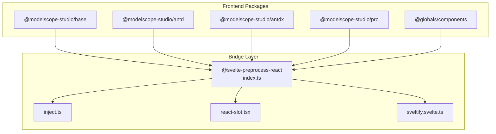
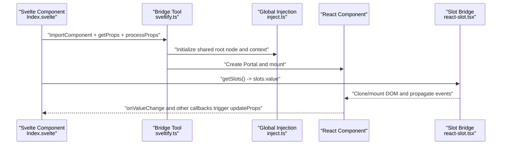
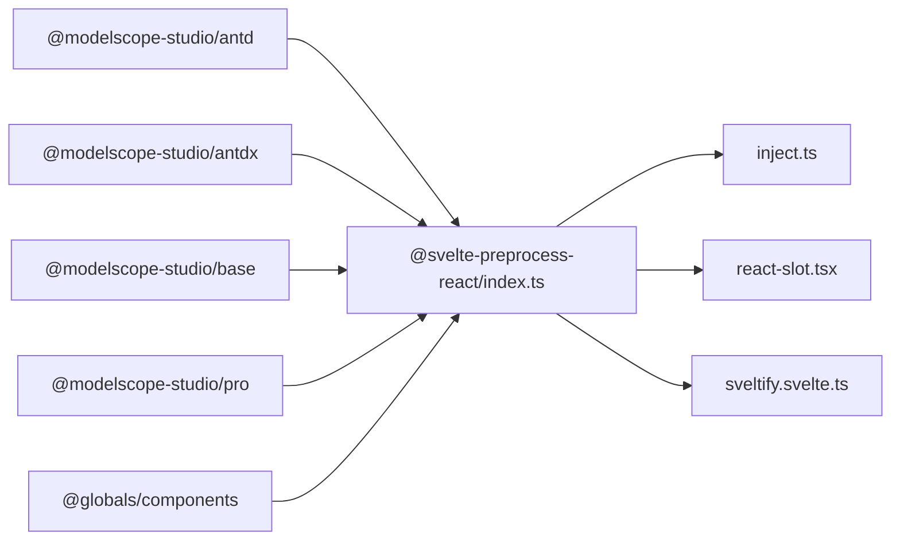

# JavaScript API

<cite>
**Files referenced in this document**
- [frontend/package.json](file://frontend/package.json)
- [frontend/tsconfig.json](file://frontend/tsconfig.json)
- [frontend/antd/package.json](file://frontend/antd/package.json)
- [frontend/antdx/package.json](file://frontend/antdx/package.json)
- [frontend/base/package.json](file://frontend/base/package.json)
- [frontend/pro/package.json](file://frontend/pro/package.json)
- [frontend/globals/components/index.ts](file://frontend/globals/components/index.ts)
- [frontend/antd/button/Index.svelte](file://frontend/antd/button/Index.svelte)
- [frontend/antd/form/Index.svelte](file://frontend/antd/form/Index.svelte)
- [frontend/antd/layout/Index.svelte](file://frontend/antd/layout/Index.svelte)
- [frontend/antd/modal/Index.svelte](file://frontend/antd/modal/Index.svelte)
- [frontend/antd/table/Index.svelte](file://frontend/antd/table/Index.svelte)
- [frontend/svelte-preprocess-react/index.ts](file://frontend/svelte-preprocess-react/index.ts)
- [frontend/svelte-preprocess-react/sveltify.svelte.ts](file://frontend/svelte-preprocess-react/sveltify.svelte.ts)
- [frontend/svelte-preprocess-react/inject.ts](file://frontend/svelte-preprocess-react/inject.ts)
- [frontend/svelte-preprocess-react/react-slot.tsx](file://frontend/svelte-preprocess-react/react-slot.tsx)
</cite>

## Table of Contents

1. [Introduction](#introduction)
2. [Project Structure](#project-structure)
3. [Core Components](#core-components)
4. [Architecture Overview](#architecture-overview)
5. [Component Details](#component-details)
6. [Dependency Analysis](#dependency-analysis)
7. [Performance and Memory Management](#performance-and-memory-management)
8. [Troubleshooting Guide](#troubleshooting-guide)
9. [Conclusion](#conclusion)
10. [Appendix: API Index and Navigation](#appendix-api-index-and-navigation)

## Introduction

This document is the JavaScript API reference for ModelScope Studio, focusing on the Svelte component layer and the React component bridging solution. It covers the following topics:

- Property definitions, event handling, lifecycle, and public methods of Svelte components
- Inter-component communication (props passing, event bubbling, slot system)
- React component bridge implementation (property conversion, event binding, state synchronization)
- Standard instantiation and configuration examples (basic and complex scenarios)
- Style customization, theme configuration, and responsive design support
- TypeScript type definitions, interface specifications, and generic usage
- Performance optimization, memory management, and best practices
- Complete API index and navigation

## Project Structure

The frontend adopts a multi-package structure, split by functional domain:

- Base component library: base
- Ant Design component library: antd
- Ant Design extended component library: antdx
- Pro advanced component library: pro
- Global component entry: globals/components

All packages use Svelte 5 as the core runtime, and inject React components into Svelte through the in-house `svelte-preprocess-react` bridging solution.

Diagram sources

- [frontend/antd/package.json:1-6](file://frontend/antd/package.json#L1-L6)
- [frontend/antdx/package.json:1-6](file://frontend/antdx/package.json#L1-L6)
- [frontend/base/package.json:1-6](file://frontend/base/package.json#L1-L6)
- [frontend/pro/package.json:1-6](file://frontend/pro/package.json#L1-L6)
- [frontend/svelte-preprocess-react/index.ts:1-8](file://frontend/svelte-preprocess-react/index.ts#L1-L8)
- [frontend/svelte-preprocess-react/inject.ts:1-103](file://frontend/svelte-preprocess-react/inject.ts#L1-L103)
- [frontend/svelte-preprocess-react/react-slot.tsx:1-224](file://frontend/svelte-preprocess-react/react-slot.tsx#L1-L224)
- [frontend/svelte-preprocess-react/sveltify.svelte.ts:1-119](file://frontend/svelte-preprocess-react/sveltify.svelte.ts#L1-L119)

Section sources

- [frontend/package.json:1-59](file://frontend/package.json#L1-L59)
- [frontend/tsconfig.json:1-8](file://frontend/tsconfig.json#L1-L8)

## Core Components

This section provides an overview of common patterns and capability boundaries of Svelte components in the bridge layer, making it easier to quickly locate and reuse them.

- Property passthrough and filtering
  - Props are uniformly retrieved via `getProps`, with visibility flags, internal markers, and element identifiers being filtered or preserved
  - `processProps` is used to merge name mappings (e.g., `fields_change` → `fieldsChange`) with additional properties
- Slot system
  - Svelte slot content is collected via `getSlots` and injected into the `slots` field of React components
  - `ReactSlot` is responsible for cloning or mounting DOM nodes into React components, with support for attribute observation and event cloning
- Async loading and rendering
  - `importComponent` dynamically imports React components, combined with Svelte `await` fragments for async rendering
- Event and state synchronization
  - Callbacks such as `onValueChange` and `onResetFormAction` are used to write back to parent state
  - `updateProps` is used to update mutable properties (e.g., `value`)

Section sources

- [frontend/antd/button/Index.svelte:1-74](file://frontend/antd/button/Index.svelte#L1-L74)
- [frontend/antd/form/Index.svelte:1-99](file://frontend/antd/form/Index.svelte#L1-L99)
- [frontend/antd/modal/Index.svelte:1-63](file://frontend/antd/modal/Index.svelte#L1-L63)
- [frontend/antd/table/Index.svelte:1-61](file://frontend/antd/table/Index.svelte#L1-L61)
- [frontend/svelte-preprocess-react/react-slot.tsx:1-224](file://frontend/svelte-preprocess-react/react-slot.tsx#L1-L224)

## Architecture Overview

The following diagram shows the bridge path from Svelte to React and key nodes:

Diagram sources

- [frontend/svelte-preprocess-react/sveltify.svelte.ts:1-119](file://frontend/svelte-preprocess-react/sveltify.svelte.ts#L1-L119)
- [frontend/svelte-preprocess-react/inject.ts:1-103](file://frontend/svelte-preprocess-react/inject.ts#L1-L103)
- [frontend/svelte-preprocess-react/react-slot.tsx:1-224](file://frontend/svelte-preprocess-react/react-slot.tsx#L1-L224)
- [frontend/antd/button/Index.svelte:1-74](file://frontend/antd/button/Index.svelte#L1-L74)

## Component Details

### Button

- Property definitions
  - `additional_props?: Record<string, any>`
  - `value?: string | undefined`
  - `as_item?: string | undefined`
  - `_internal: { layout?: boolean }`
  - `href_target?: string`
  - Visibility and style: `visible`, `elem_id`, `elem_classes`, `elem_style`
- Events and methods
  - Default slot content is injected via `slots`
  - Appearance is controlled via `className`, `style`, `id`
- Lifecycle
  - After `$props()` initialization, enters async rendering flow immediately
- Complexity and performance
  - Dynamic import and derived computation to avoid unnecessary re-renders

Section sources

- [frontend/antd/button/Index.svelte:1-74](file://frontend/antd/button/Index.svelte#L1-L74)

### Form

- Property definitions
  - `value?: Record<string, any>`
  - `form_action?: FormProps['formAction'] | null`
  - `form_name?: string`
  - `fields_change?: any`
  - `finish_failed?: any`
  - `values_change?: any`
  - Internal and style: `_internal`, `elem_id`, `elem_classes`, `elem_style`
- Events and methods
  - `onValueChange` writes back `value`
  - `onResetFormAction` clears `form_action`
- Lifecycle
  - Async rendering; only displayed when `visible` is true
- Complexity and performance
  - Uses derived properties to reduce props computation overhead

Section sources

- [frontend/antd/form/Index.svelte:1-99](file://frontend/antd/form/Index.svelte#L1-L99)

### Modal

- Property definitions
  - `as_item?: string | undefined`
  - `_internal: { layout?: boolean }`
  - Visibility and style: `visible`, `elem_id`, `elem_classes`, `elem_style`
- Events and methods
  - Content is injected via `slots`
- Lifecycle
  - Conditional rendering; React components are loaded asynchronously

Section sources

- [frontend/antd/modal/Index.svelte:1-63](file://frontend/antd/modal/Index.svelte#L1-L63)

### Table

- Property definitions
  - `as_item?: string | undefined`
  - `_internal: {}`
  - Visibility and style: `visible`, `elem_id`, `elem_classes`, `elem_style`
- Events and methods
  - Column/row content is injected via `slots`
- Lifecycle
  - Async rendering with conditional display

Section sources

- [frontend/antd/table/Index.svelte:1-61](file://frontend/antd/table/Index.svelte#L1-L61)

### Layout

- Property definitions
  - `children: Snippet`
  - Other properties are handled by the Base component
- Events and methods
  - No explicit event bindings; primarily responsible for structural rendering
- Lifecycle
  - Props are passed through directly to the Base component

Section sources

- [frontend/antd/layout/Index.svelte:1-18](file://frontend/antd/layout/Index.svelte#L1-L18)

### React Slot Bridge (ReactSlot)

- Functionality
  - Clones and mounts Svelte slots into React components
  - Supports event listener cloning, attribute change observation, and application of class names and inline styles
- Key parameters
  - `slot: HTMLElement`
  - `clone?: boolean`
  - `style?: React.CSSProperties`
  - `className?: string`
  - `observeAttributes?: boolean`
- Behavior
  - `MutationObserver` observes subtree changes of the slot and dynamically rebuilds cloned nodes
  - React subtrees are mounted to target containers via `createPortal`

Section sources

- [frontend/svelte-preprocess-react/react-slot.tsx:1-224](file://frontend/svelte-preprocess-react/react-slot.tsx#L1-L224)

### Bridge Core (sveltify)

- Functionality
  - Wraps React components as Svelte components with support for slots, styles, class names, and id passthrough
  - Maintains shared root nodes and node trees to enable rendering and updates across component trees
- Key points
  - Initializes Promise and global shared root node
  - Recursively builds node tree and triggers rerender
  - Provides the `Sveltified` factory function

Section sources

- [frontend/svelte-preprocess-react/sveltify.svelte.ts:1-119](file://frontend/svelte-preprocess-react/sveltify.svelte.ts#L1-L119)

### Global Injection (inject)

- Functionality
  - Injects global objects required by React ecosystem and the bridge into `window`
  - Defines custom elements (`react-portal-target`, `react-child`, `svelte-slot`)
  - Initializes global state (`initializePromise`, `sharedRoot`, `autokey`, etc.)
- Impact
  - Provides a unified runtime environment for the bridge layer

Section sources

- [frontend/svelte-preprocess-react/inject.ts:1-103](file://frontend/svelte-preprocess-react/inject.ts#L1-L103)

## Dependency Analysis

Diagram sources

- [frontend/antd/package.json:1-6](file://frontend/antd/package.json#L1-L6)
- [frontend/antdx/package.json:1-6](file://frontend/antdx/package.json#L1-L6)
- [frontend/base/package.json:1-6](file://frontend/base/package.json#L1-L6)
- [frontend/pro/package.json:1-6](file://frontend/pro/package.json#L1-L6)
- [frontend/globals/components/index.ts:1-2](file://frontend/globals/components/index.ts#L1-L2)
- [frontend/svelte-preprocess-react/index.ts:1-8](file://frontend/svelte-preprocess-react/index.ts#L1-L8)
- [frontend/svelte-preprocess-react/inject.ts:1-103](file://frontend/svelte-preprocess-react/inject.ts#L1-L103)
- [frontend/svelte-preprocess-react/react-slot.tsx:1-224](file://frontend/svelte-preprocess-react/react-slot.tsx#L1-L224)
- [frontend/svelte-preprocess-react/sveltify.svelte.ts:1-119](file://frontend/svelte-preprocess-react/sveltify.svelte.ts#L1-L119)

Section sources

- [frontend/package.json:1-59](file://frontend/package.json#L1-L59)
- [frontend/tsconfig.json:1-8](file://frontend/tsconfig.json#L1-L8)

## Performance and Memory Management

- Async component loading
  - Use `importComponent` for dynamic imports to avoid blocking the initial render
- Derived computation and minimized re-renders
  - Use `$derived` and `processProps` to reduce redundant renders
- Slot cloning strategy
  - `ReactSlot` enables cloning and `MutationObserver` by default to ensure stability during DOM changes; disabling cloning can reduce overhead in high-frequency update scenarios
- Portal management
  - `inject.ts` centrally creates and destroys root nodes to avoid memory leaks from repeated mounting
- Styles and themes
  - Styles are controlled via `elem_style`, `elem_classes`, and `className`; Ant Design theme variables are injected by `antdCssinjs` to ensure a consistent theme experience

[This section provides general guidance and does not require specific file sources]

## Troubleshooting Guide

- Slot not taking effect
  - Check whether `getSlots` is called correctly and `slots.value` is passed to the React component
  - Confirm that the `slot` parameter of `ReactSlot` points to a valid DOM element
- Event not triggered
  - Ensure event name mapping is correct (e.g., `fields_change` → `fieldsChange`)
  - Check the `observeAttributes` and `clone` settings of `ReactSlot`
- Style not applied
  - Confirm whether `elem_style` and `elem_classes` are properly passed through
  - Check whether theme injection is complete (`inject.ts` initialization)
- Performance issues
  - Reduce unnecessary `visible` toggling
  - Disable `ReactSlot` cloning or lower observation granularity for high-frequency update scenarios

Section sources

- [frontend/antd/form/Index.svelte:60-99](file://frontend/antd/form/Index.svelte#L60-L99)
- [frontend/svelte-preprocess-react/react-slot.tsx:158-224](file://frontend/svelte-preprocess-react/react-slot.tsx#L158-L224)
- [frontend/svelte-preprocess-react/inject.ts:95-103](file://frontend/svelte-preprocess-react/inject.ts#L95-L103)

## Conclusion

This API uses Svelte as its core, seamlessly integrating React components through an in-house bridge layer to form a unified component ecosystem. Through standardized property passthrough, event mapping, and slot bridging, developers can use both types of components in a consistent manner. Combined with comprehensive type definitions and performance optimization recommendations, this enables a good development experience and runtime efficiency in complex scenarios.

[This section is a summary and does not require specific file sources]

## Appendix: API Index and Navigation

### Component Categories and Entry Points

- Base components: base
- Ant Design components: antd
- Ant Design extensions: antdx
- Pro advanced components: pro
- Global component entry: globals/components

Section sources

- [frontend/antd/package.json:1-6](file://frontend/antd/package.json#L1-L6)
- [frontend/antdx/package.json:1-6](file://frontend/antdx/package.json#L1-L6)
- [frontend/base/package.json:1-6](file://frontend/base/package.json#L1-L6)
- [frontend/pro/package.json:1-6](file://frontend/pro/package.json#L1-L6)
- [frontend/globals/components/index.ts:1-2](file://frontend/globals/components/index.ts#L1-L2)

### Svelte Component Common Patterns

- Property retrieval and filtering: `getProps`
- Property mapping and merging: `processProps`
- Slot collection: `getSlots`
- Async rendering: `importComponent` + `{#await ...}`
- Event writeback: `updateProps`

Section sources

- [frontend/antd/button/Index.svelte:12-56](file://frontend/antd/button/Index.svelte#L12-L56)
- [frontend/antd/form/Index.svelte:14-71](file://frontend/antd/form/Index.svelte#L14-L71)
- [frontend/antd/modal/Index.svelte:12-47](file://frontend/antd/modal/Index.svelte#L12-L47)
- [frontend/antd/table/Index.svelte:12-45](file://frontend/antd/table/Index.svelte#L12-L45)

### React Component Bridge

- `sveltify`: Wraps React components as Svelte components
- `inject`: Global runtime injection and initialization
- `react-slot`: Slot DOM cloning and mounting

Section sources

- [frontend/svelte-preprocess-react/sveltify.svelte.ts:30-119](file://frontend/svelte-preprocess-react/sveltify.svelte.ts#L30-L119)
- [frontend/svelte-preprocess-react/inject.ts:20-103](file://frontend/svelte-preprocess-react/inject.ts#L20-L103)
- [frontend/svelte-preprocess-react/react-slot.tsx:109-224](file://frontend/svelte-preprocess-react/react-slot.tsx#L109-L224)

### TypeScript and Type Definitions

- The top-level `tsconfig` extends the global tsconfig, enabling ESNext modules and browser types
- Components extensively use generics and read-only array constraints for slot key names

Section sources

- [frontend/tsconfig.json:1-8](file://frontend/tsconfig.json#L1-L8)
- [frontend/svelte-preprocess-react/sveltify.svelte.ts:9-39](file://frontend/svelte-preprocess-react/sveltify.svelte.ts#L9-L39)
