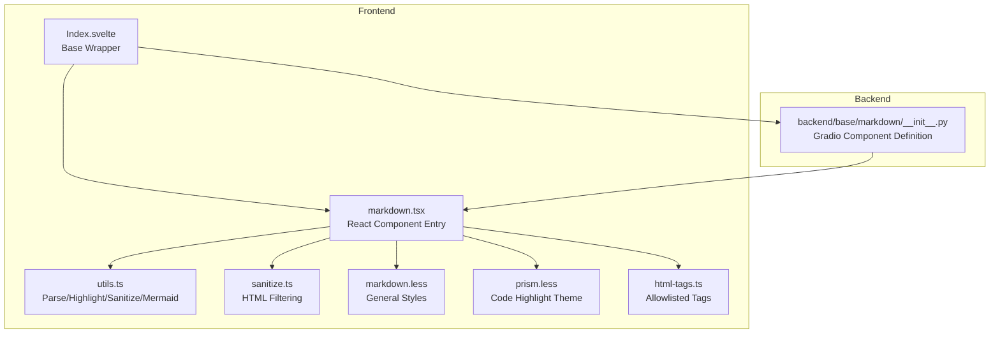
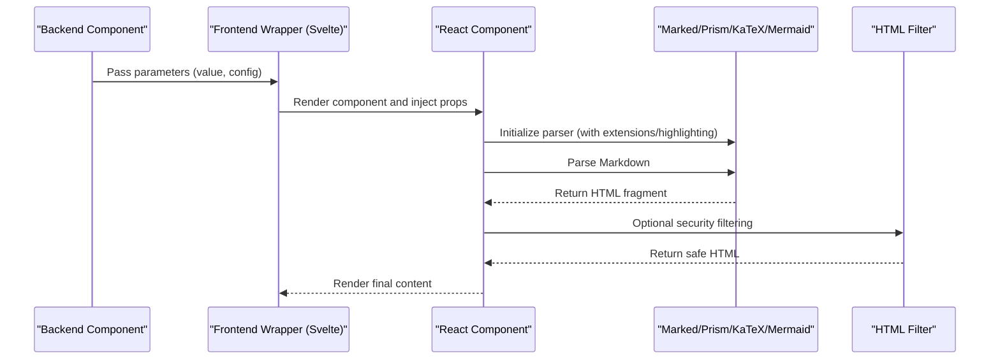
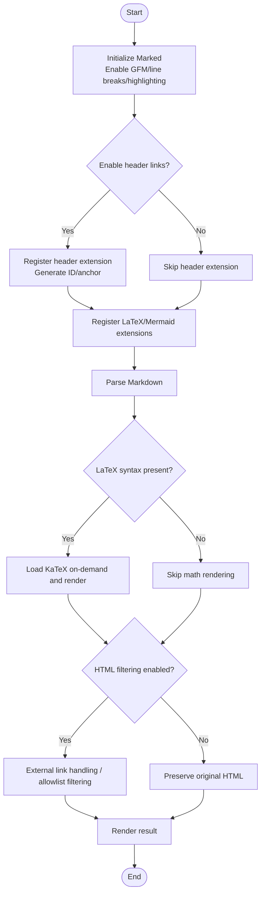
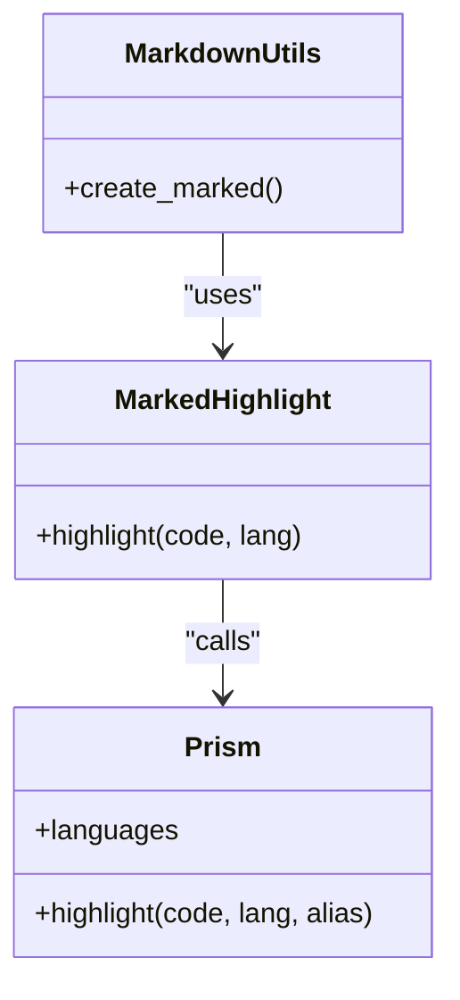
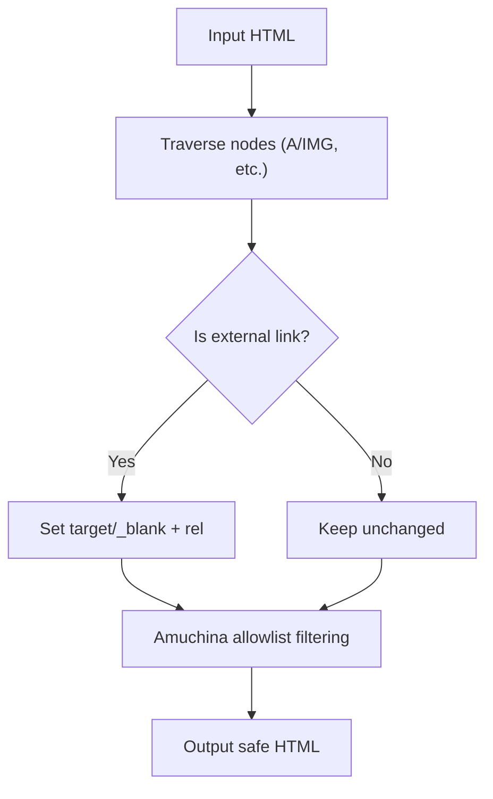
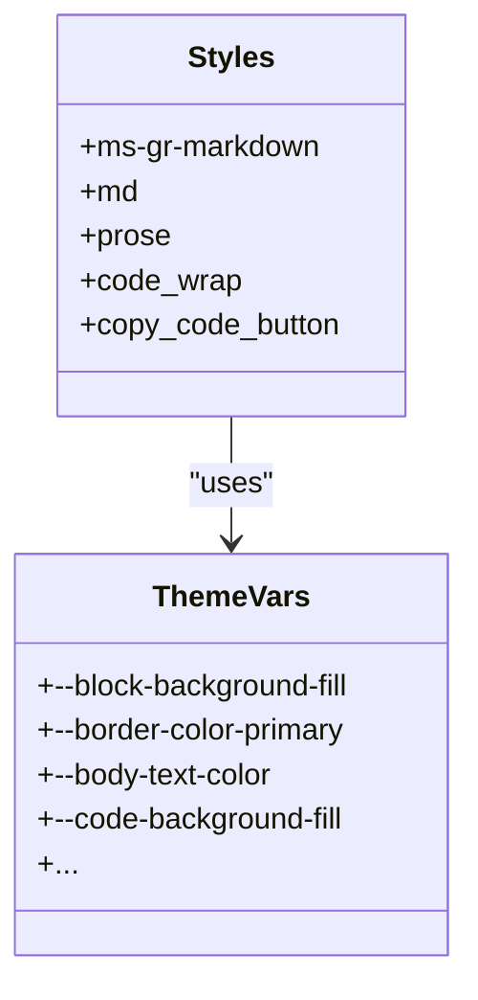
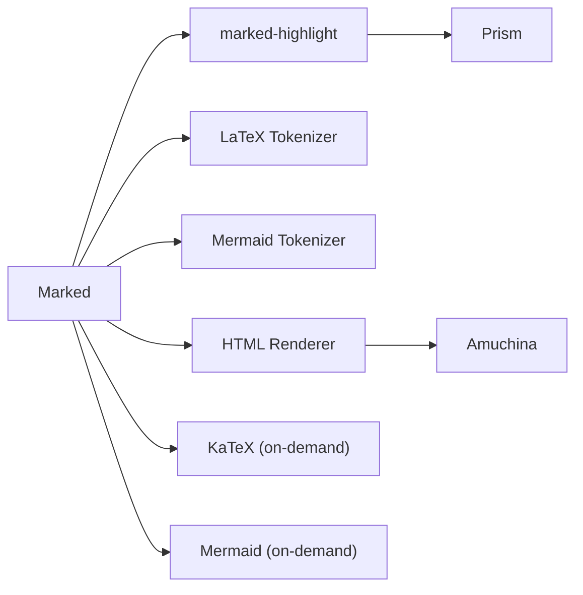

# Markdown Component API

<cite>
**Files referenced in this document**
- [frontend/globals/components/markdown/index.tsx](file://frontend/globals/components/markdown/index.tsx)
- [frontend/globals/components/markdown/utils.ts](file://frontend/globals/components/markdown/utils.ts)
- [frontend/globals/components/markdown/sanitize.ts](file://frontend/globals/components/markdown/sanitize.ts)
- [frontend/globals/components/markdown/markdown.less](file://frontend/globals/components/markdown/markdown.less)
- [frontend/globals/components/markdown/prism.less](file://frontend/globals/components/markdown/prism.less)
- [frontend/globals/components/markdown/html-tags.ts](file://frontend/globals/components/markdown/html-tags.ts)
- [frontend/base/markdown/Index.svelte](file://frontend/base/markdown/Index.svelte)
- [frontend/base/markdown/markdown.tsx](file://frontend/base/markdown/markdown.tsx)
- [backend/modelscope_studio/components/base/markdown/__init__.py](file://backend/modelscope_studio/components/base/markdown/__init__.py)
- [docs/components/base/markdown/README.md](file://docs/components/base/markdown/README.md)
- [docs/components/base/markdown/demos/basic.py](file://docs/components/base/markdown/demos/basic.py)
- [docs/components/base/markdown/demos/custom_copy_buttons.py](file://docs/components/base/markdown/demos/custom_copy_buttons.py)
</cite>

## Table of Contents

1. [Introduction](#introduction)
2. [Project Structure](#project-structure)
3. [Core Components](#core-components)
4. [Architecture Overview](#architecture-overview)
5. [Detailed Component Analysis](#detailed-component-analysis)
6. [Dependency Analysis](#dependency-analysis)
7. [Performance Considerations](#performance-considerations)
8. [Troubleshooting Guide](#troubleshooting-guide)
9. [Conclusion](#conclusion)
10. [Appendix](#appendix)

## Introduction

This document provides detailed API documentation for the Markdown component in the ModelScope Studio base components, covering the following aspects:

- Property definitions and default values
- Rendering options (line breaks, header links, math formulas, Mermaid diagrams)
- Code highlighting (Prism.js integration and language support)
- Security filtering (HTML allowlist and external link handling)
- Style customization (CSS class names, inline styles, theme variables)
- Usage examples (basic rendering, copy button, custom buttons)
- Performance optimization recommendations (lazy loading, caching strategies)
- Common issues and debugging methods

## Project Structure

The Markdown component is implemented collaboratively by a frontend React component and a backend Gradio component, bridged through a Svelte wrapper. The frontend parsing and rendering logic is centralized in the global components directory, while the backend handles parameter passthrough and event binding.

**Diagram sources**

- [frontend/base/markdown/Index.svelte:1-63](file://frontend/base/markdown/Index.svelte#L1-L63)
- [frontend/base/markdown/markdown.tsx:1-34](file://frontend/base/markdown/markdown.tsx#L1-L34)
- [frontend/globals/components/markdown/index.tsx:1-272](file://frontend/globals/components/markdown/index.tsx#L1-L272)
- [frontend/globals/components/markdown/utils.ts:1-411](file://frontend/globals/components/markdown/utils.ts#L1-L411)
- [frontend/globals/components/markdown/sanitize.ts:1-26](file://frontend/globals/components/markdown/sanitize.ts#L1-L26)
- [frontend/globals/components/markdown/markdown.less:1-140](file://frontend/globals/components/markdown/markdown.less#L1-L140)
- [frontend/globals/components/markdown/prism.less:1-185](file://frontend/globals/components/markdown/prism.less#L1-L185)
- [frontend/globals/components/markdown/html-tags.ts:1-210](file://frontend/globals/components/markdown/html-tags.ts#L1-L210)
- [backend/modelscope_studio/components/base/markdown/**init**.py:1-174](file://backend/modelscope_studio/components/base/markdown/__init__.py#L1-L174)

**Section sources**

- [frontend/base/markdown/Index.svelte:1-63](file://frontend/base/markdown/Index.svelte#L1-L63)
- [frontend/base/markdown/markdown.tsx:1-34](file://frontend/base/markdown/markdown.tsx#L1-L34)
- [frontend/globals/components/markdown/index.tsx:1-272](file://frontend/globals/components/markdown/index.tsx#L1-L272)
- [backend/modelscope_studio/components/base/markdown/**init**.py:1-174](file://backend/modelscope_studio/components/base/markdown/__init__.py#L1-L174)

## Core Components

- Frontend React component: Responsible for Markdown parsing, code highlighting, math formula rendering, Mermaid diagram rendering, HTML security filtering, and copy button interactions.
- Backend Gradio component: Responsible for parameter passthrough, event binding (such as copy/change/mouse events), default values, and example data.

Key responsibility division:

- Parsing and rendering: Marked + marked-highlight (Prism) + custom extensions (LaTeX, Mermaid)
- Security filtering: Amuchina + external link handling
- Math formulas: KaTeX loaded on-demand with auto-rendering
- Diagrams: Mermaid loaded on-demand with error fallback
- Styles: General styles + Prism theme variables

**Section sources**

- [frontend/globals/components/markdown/index.tsx:27-48](file://frontend/globals/components/markdown/index.tsx#L27-L48)
- [frontend/globals/components/markdown/utils.ts:286-344](file://frontend/globals/components/markdown/utils.ts#L286-L344)
- [backend/modelscope_studio/components/base/markdown/**init**.py:11-174](file://backend/modelscope_studio/components/base/markdown/__init__.py#L11-L174)

## Architecture Overview

The Markdown component receives parameters from the backend, and after being wrapped by the frontend, performs parsing and rendering. The parsing phase can enable line breaks, header links, LaTeX, and Mermaid extensions; the rendering phase integrates Prism for code highlighting, KaTeX/Mermaid for math and diagram rendering, and applies security filtering to the output HTML.

**Diagram sources**

- [frontend/base/markdown/Index.svelte:19-62](file://frontend/base/markdown/Index.svelte#L19-L62)
- [frontend/globals/components/markdown/index.tsx:86-92](file://frontend/globals/components/markdown/index.tsx#L86-L92)
- [frontend/globals/components/markdown/utils.ts:286-344](file://frontend/globals/components/markdown/utils.ts#L286-L344)
- [frontend/globals/components/markdown/sanitize.ts:12-25](file://frontend/globals/components/markdown/sanitize.ts#L12-L25)

## Detailed Component Analysis

### Property Definitions and Default Values

- `value`: String, Markdown content
- `sanitizeHtml`: Boolean, whether to enable HTML security filtering, enabled by default
- `latexDelimiters`: Array, custom LaTeX delimiters, containing left/right/display triplets
- `lineBreaks`: Boolean, whether to convert newlines to ` `, enabled by default
- `headerLinks`: Boolean, whether to generate header anchors and link icons, disabled by default
- `showCopyButton`: Boolean, whether to show the overall copy button
- `rtl`: Boolean, whether to enable right-to-left layout
- `themeMode`: String, theme mode (`light`/`dark`), used for styles and Mermaid theme
- `rootUrl`: String, root path, used for external link detection and resource location
- `allowTags`: Boolean or string array, controls the allowed HTML/SVG tags
- `onCopy`: Callback, triggered on successful copy
- `onChange`: Callback, triggered when rendering is complete
- `copyButtons`: Custom copy button collection (via slots)

The default LaTeX delimiter set contains multiple common expression groups (inline/block, parenthesis variants, etc.).

**Section sources**

- [frontend/globals/components/markdown/index.tsx:27-48](file://frontend/globals/components/markdown/index.tsx#L27-L48)
- [frontend/globals/components/markdown/index.tsx:50-60](file://frontend/globals/components/markdown/index.tsx#L50-L60)
- [backend/modelscope_studio/components/base/markdown/**init**.py:54-141](file://backend/modelscope_studio/components/base/markdown/__init__.py#L54-L141)

### Rendering Options and Parser Configuration

- Line breaks: Controlled by the `breaks` option of Marked
- Header links: When `headerLinks` is enabled, IDs are generated for headers and anchor link icons are inserted
- LaTeX: Custom tokenizer supports multiple delimiter groups, rendered as block-level containers
- Mermaid: Custom tokenizer supports marking code blocks as `mermaid`, rendered as diagrams
- Code highlighting: Integrates Prism via `marked-highlight`, renders by language class name
- HTML sanitization: External links get `target`/`rel` attributes, and Amuchina allowlist filtering is applied

**Diagram sources**

- [frontend/globals/components/markdown/utils.ts:286-344](file://frontend/globals/components/markdown/utils.ts#L286-L344)
- [frontend/globals/components/markdown/index.tsx:107-138](file://frontend/globals/components/markdown/index.tsx#L107-L138)
- [frontend/globals/components/markdown/sanitize.ts:12-25](file://frontend/globals/components/markdown/sanitize.ts#L12-L25)

**Section sources**

- [frontend/globals/components/markdown/utils.ts:286-344](file://frontend/globals/components/markdown/utils.ts#L286-L344)
- [frontend/globals/components/markdown/index.tsx:107-138](file://frontend/globals/components/markdown/index.tsx#L107-L138)

### Code Highlighting and Language Support

- Highlighting library: Prism.js (integrated via `marked-highlight`)
- Language support: Built-in loading of commonly used languages including Python, LaTeX, Bash, JSX, TypeScript, and TSX
- Rendering method: Dynamically selects Prism language based on code block language; unrecognized languages are kept as-is
- Theme: Applied via `prism.less` theme variables, with dark color scheme in dark mode

**Diagram sources**

- [frontend/globals/components/markdown/utils.ts:9-16](file://frontend/globals/components/markdown/utils.ts#L9-L16)
- [frontend/globals/components/markdown/utils.ts:303-310](file://frontend/globals/components/markdown/utils.ts#L303-L310)

**Section sources**

- [frontend/globals/components/markdown/utils.ts:9-16](file://frontend/globals/components/markdown/utils.ts#L9-L16)
- [frontend/globals/components/markdown/utils.ts:303-310](file://frontend/globals/components/markdown/utils.ts#L303-L310)

### HTML Security Filtering and Allowlist

- External link handling: Automatically sets `target="_blank"` and `rel="noopener noreferrer"` for external links
- Allowlist filtering: Uses Amuchina to sanitize HTML, retaining only standard HTML and SVG tags
- Allowed tags: Supports boolean toggle or explicit array; tags not in the allowlist are escaped

**Diagram sources**

- [frontend/globals/components/markdown/sanitize.ts:12-25](file://frontend/globals/components/markdown/sanitize.ts#L12-L25)
- [frontend/globals/components/markdown/html-tags.ts:206-210](file://frontend/globals/components/markdown/html-tags.ts#L206-L210)

**Section sources**

- [frontend/globals/components/markdown/sanitize.ts:1-26](file://frontend/globals/components/markdown/sanitize.ts#L1-L26)
- [frontend/globals/components/markdown/html-tags.ts:1-210](file://frontend/globals/components/markdown/html-tags.ts#L1-L210)

### Style Customization and Theme Variables

- CSS class names: The component root element includes classes such as `ms-gr-markdown`, `md`, and `prose`, making overrides easy
- Theme variables: CSS variables control colors, spacing, border radius, shadows, etc.
- Code highlighting theme: `prism.less` provides light and dark color schemes, switching with `themeMode`
- Copy button: Absolutely positioned with support for custom button collections (copy/copied states)

**Diagram sources**

- [frontend/globals/components/markdown/markdown.less:1-140](file://frontend/globals/components/markdown/markdown.less#L1-L140)
- [frontend/globals/components/markdown/prism.less:1-185](file://frontend/globals/components/markdown/prism.less#L1-L185)

**Section sources**

- [frontend/globals/components/markdown/markdown.less:1-140](file://frontend/globals/components/markdown/markdown.less#L1-L140)
- [frontend/globals/components/markdown/prism.less:1-185](file://frontend/globals/components/markdown/prism.less#L1-L185)

### Usage Examples

- Basic text rendering: Pass a Markdown string directly
- Show copy button: Enable `showCopyButton` or provide custom buttons via slots
- Custom buttons: Use Slot to inject two buttons (e.g., copy/copied states)

Reference example scripts and documentation:

- Basic example: [basic.py:1-10](file://docs/components/base/markdown/demos/basic.py#L1-L10)
- Custom copy buttons: [custom_copy_buttons.py:1-21](file://docs/components/base/markdown/demos/custom_copy_buttons.py#L1-L21)
- Component description: [README.md:1-13](file://docs/components/base/markdown/README.md#L1-L13)

**Section sources**

- [docs/components/base/markdown/demos/basic.py:1-10](file://docs/components/base/markdown/demos/basic.py#L1-L10)
- [docs/components/base/markdown/demos/custom_copy_buttons.py:1-21](file://docs/components/base/markdown/demos/custom_copy_buttons.py#L1-L21)
- [docs/components/base/markdown/README.md:1-13](file://docs/components/base/markdown/README.md#L1-L13)

## Dependency Analysis

- Frontend dependencies
  - Marked: Markdown parsing and rendering
  - marked-highlight + Prism: Code highlighting
  - KaTeX: Math formula rendering (loaded on-demand)
  - Mermaid: Diagram rendering (loaded on-demand)
  - Amuchina: HTML allowlist filtering
  - github-slugger: Header ID generation
- Backend dependencies
  - Gradio event listeners: copy/change/mouse series
  - Frontend directory resolution: `resolve_frontend_dir("markdown")`

**Diagram sources**

- [frontend/globals/components/markdown/utils.ts:6-18](file://frontend/globals/components/markdown/utils.ts#L6-L18)
- [frontend/globals/components/markdown/utils.ts:286-344](file://frontend/globals/components/markdown/utils.ts#L286-L344)

**Section sources**

- [frontend/globals/components/markdown/utils.ts:6-18](file://frontend/globals/components/markdown/utils.ts#L6-L18)
- [backend/modelscope_studio/components/base/markdown/**init**.py:15-46](file://backend/modelscope_studio/components/base/markdown/__init__.py#L15-L46)

## Performance Considerations

- Lazy loading
  - KaTeX: Styles and auto-render module are only loaded when math formulas first appear
  - Mermaid: Loaded asynchronously and executed on the next frame before rendering
  - Prism: Highlights on-demand during the parsing phase to avoid unnecessary overhead
- Caching strategy
  - Loaded KaTeX modules are globally flagged to avoid duplicate imports
  - Mermaid initialization parameters are fixed to reduce repeated initialization costs
- Rendering timing
  - `requestAnimationFrame` is used to defer rendering to the browser's idle frame
  - Re-parsing and re-rendering only occur when content changes
- Security filtering
  - Filtering is only performed when `sanitizeHtml` is enabled, avoiding unnecessary DOM parsing

**Section sources**

- [frontend/globals/components/markdown/index.tsx:140-173](file://frontend/globals/components/markdown/index.tsx#L140-L173)
- [frontend/globals/components/markdown/utils.ts:177-223](file://frontend/globals/components/markdown/utils.ts#L177-L223)

## Troubleshooting Guide

- Copy button not working
  - Check whether the container correctly binds the click event (`bind_copy_event`)
  - Confirm whether the `copyButtons` slot is properly injected
- Math formulas not rendering
  - Confirm whether `latexDelimiters` is correctly configured
  - Check if `sanitizeHtml` is enabled and causing scripts to be removed
- Mermaid diagram errors
  - Check the console error log
  - Confirm that the mermaid code block is properly closed with correct syntax
  - Check whether `themeMode` matches the page theme
- External links not opening in new window
  - Confirm that `rootUrl` matches the link's origin
  - Check whether `target`/`rel` is correctly set in the sanitize flow
- Code highlighting not working
  - Confirm whether the language identifier is in the Prism supported list
  - Check whether `prism.less` is correctly imported and theme variables are taking effect

**Section sources**

- [frontend/globals/components/markdown/utils.ts:346-380](file://frontend/globals/components/markdown/utils.ts#L346-L380)
- [frontend/globals/components/markdown/sanitize.ts:12-25](file://frontend/globals/components/markdown/sanitize.ts#L12-L25)
- [frontend/globals/components/markdown/utils.ts:177-223](file://frontend/globals/components/markdown/utils.ts#L177-L223)

## Conclusion

The Markdown component of ModelScope Studio provides rich rendering capabilities and a flexible customization interface while ensuring security and accessibility. Through the combination of Marked + Prism + KaTeX + Mermaid, it meets diverse needs from basic text to complex formulas and diagrams; allowlist filtering and external link handling ensure safe output; theme variables and style class names achieve consistent visual style and good customizability.

## Appendix

### Backend Component Parameter Overview

- Parameter names: `value`, `rtl`, `latex_delimiters`, `sanitize_html`, `line_breaks`, `header_links`, `allow_tags`, `show_copy_button`, `copy_buttons`
- Events: `change`, `copy`, `click`, `dblclick`, `mousedown`, `mouseup`, `mouseover`, `mouseout`, `mousemove`, `scroll`
- Examples: `example_payload`/`example_value` returns a simple Markdown string

**Section sources**

- [backend/modelscope_studio/components/base/markdown/**init**.py:54-174](file://backend/modelscope_studio/components/base/markdown/__init__.py#L54-L174)

### Frontend Component Property Overview

- `value`, `sanitizeHtml`, `latexDelimiters`, `lineBreaks`, `headerLinks`, `showCopyButton`, `rtl`, `themeMode`, `rootUrl`, `allowTags`, `onCopy`, `onChange`, `copyButtons`
- Default LaTeX delimiter set, copy button icons and feedback, Mermaid error fallback

**Section sources**

- [frontend/globals/components/markdown/index.tsx:27-48](file://frontend/globals/components/markdown/index.tsx#L27-L48)
- [frontend/globals/components/markdown/index.tsx:50-60](file://frontend/globals/components/markdown/index.tsx#L50-L60)
