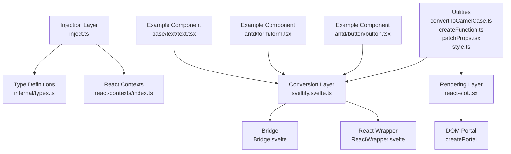
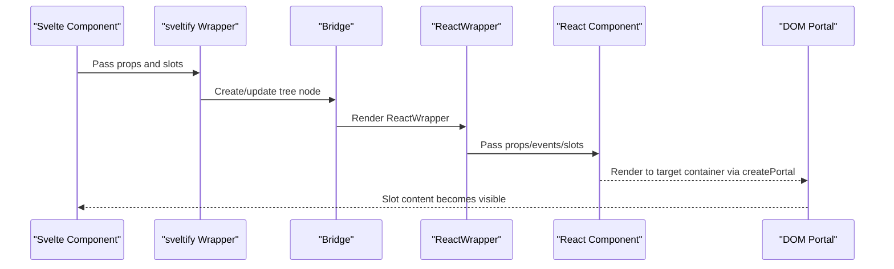
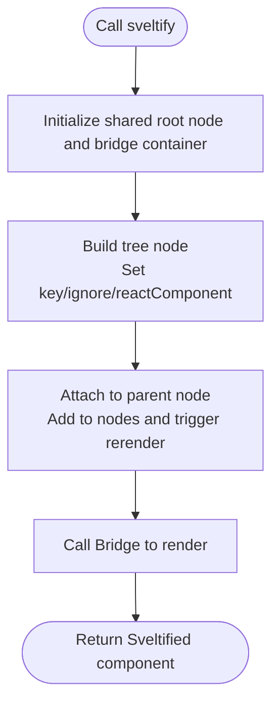
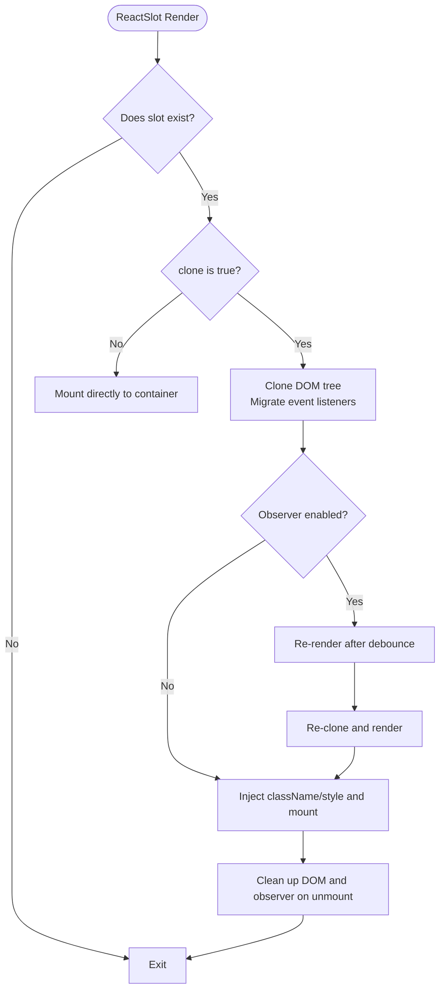
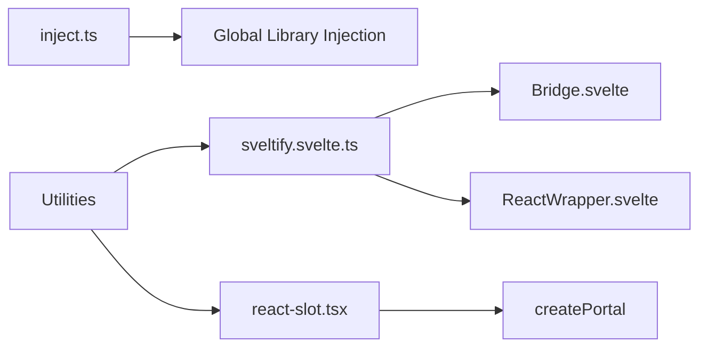

# React Component Bridge API

<cite>
**Files referenced in this document**
- [frontend/svelte-preprocess-react/index.ts](file://frontend/svelte-preprocess-react/index.ts)
- [frontend/svelte-preprocess-react/sveltify.svelte.ts](file://frontend/svelte-preprocess-react/sveltify.svelte.ts)
- [frontend/svelte-preprocess-react/inject.ts](file://frontend/svelte-preprocess-react/inject.ts)
- [frontend/svelte-preprocess-react/react-slot.tsx](file://frontend/svelte-preprocess-react/reactSlot.tsx)
- [frontend/svelte-preprocess-react/internal/types.ts](file://frontend/svelte-preprocess-react/internal/types.ts)
- [frontend/svelte-preprocess-react/react-contexts/index.ts](file://frontend/svelte-preprocess-react/react-contexts/index.ts)
- [frontend/utils/convertToCamelCase.ts](file://frontend/utils/convertToCamelCase.ts)
- [frontend/utils/createFunction.ts](file://frontend/utils/createFunction.ts)
- [frontend/utils/patchProps.tsx](file://frontend/utils/patchProps.tsx)
- [frontend/utils/hooks/useMemoizedEqualValue.ts](file://frontend/utils/hooks/useMemoizedEqualValue.ts)
- [frontend/utils/style.ts](file://frontend/utils/style.ts)
- [frontend/antd/button/button.tsx](file://frontend/antd/button/button.tsx)
- [frontend/antd/form/form.tsx](file://frontend/antd/form/form.tsx)
- [frontend/base/text/text.tsx](file://frontend/base/text/text.tsx)
</cite>

## Table of Contents

1. [Introduction](#introduction)
2. [Project Structure](#project-structure)
3. [Core Components](#core-components)
4. [Architecture Overview](#architecture-overview)
5. [Detailed Component Analysis](#detailed-component-analysis)
6. [Dependency Analysis](#dependency-analysis)
7. [Performance Considerations](#performance-considerations)
8. [Troubleshooting Guide](#troubleshooting-guide)
9. [Conclusion](#conclusion)
10. [Appendix: Standard Usage and Example Paths](#appendix-standard-usage-and-example-paths)

## Introduction

This document provides comprehensive API documentation for the React component bridge system in ModelScope Studio, focusing on the following aspects:

- Conversion mechanism from React components to Svelte components (sveltify)
- Property mapping, event binding, and state synchronization
- Event handling (bubbling, delegation, custom events)
- Corresponding lifecycle hook implementations in Svelte
- Property conversion rules (camelCase, booleans, function properties)
- Context system (React Context and Svelte Context interoperability)
- Performance optimization (lazy loading, caching, memory management)
- Error handling and debugging techniques

## Project Structure

The bridge system consists of three main parts:

- Injection layer: Initializes the global runtime environment and library bridging
- Conversion layer: `sveltify` wraps React components as Svelte components
- Rendering layer: `ReactSlot` renders Svelte slot content as React elements, with support for cloning and property injection

Diagram sources

- [frontend/svelte-preprocess-react/inject.ts:1-103](file://frontend/svelte-preprocess-react/inject.ts#L1-L103)
- [frontend/svelte-preprocess-react/sveltify.svelte.ts:1-119](file://frontend/svelte-preprocess-react/sveltify.svelte.ts#L1-L119)
- [frontend/svelte-preprocess-react/react-slot.tsx:1-224](file://frontend/svelte-preprocess-react/react-slot.tsx#L1-L224)
- [frontend/svelte-preprocess-react/internal/types.ts:1-79](file://frontend/svelte-preprocess-react/internal/types.ts#L1-L79)
- [frontend/svelte-preprocess-react/react-contexts/index.ts:1-123](file://frontend/svelte-preprocess-react/react-contexts/index.ts#L1-L123)
- [frontend/utils/convertToCamelCase.ts:1-22](file://frontend/utils/convertToCamelCase.ts#L1-L22)
- [frontend/utils/createFunction.ts:1-38](file://frontend/utils/createFunction.ts#L1-L38)
- [frontend/utils/patchProps.tsx:1-39](file://frontend/utils/patchProps.tsx#L1-L39)
- [frontend/utils/style.ts:1-77](file://frontend/utils/style.ts#L1-L77)
- [frontend/antd/button/button.tsx:1-39](file://frontend/antd/button/button.tsx#L1-L39)
- [frontend/antd/form/form.tsx:1-79](file://frontend/antd/form/form.tsx#L1-L79)
- [frontend/base/text/text.tsx:1-11](file://frontend/base/text/text.tsx#L1-L11)

Section sources

- [frontend/svelte-preprocess-react/index.ts:1-8](file://frontend/svelte-preprocess-react/index.ts#L1-L8)
- [frontend/svelte-preprocess-react/inject.ts:1-103](file://frontend/svelte-preprocess-react/inject.ts#L1-L103)

## Core Components

- `sveltify`: Wraps any React component as a Svelte component; responsible for property passthrough, slot mapping, event bridging, and tree node construction.
- `ReactSlot`: Renders Svelte slot content as React elements, supporting DOM cloning, event listener migration, and style/class name injection.
- Type system: Unified event naming, property exclusion, and Svelte/SvelteKit type adaptation.
- Context system: Bridge and merge strategy between React Context and Svelte.

Section sources

- [frontend/svelte-preprocess-react/sveltify.svelte.ts:27-119](file://frontend/svelte-preprocess-react/sveltify.svelte.ts#L27-L119)
- [frontend/svelte-preprocess-react/react-slot.tsx:8-224](file://frontend/svelte-preprocess-react/react-slot.tsx#L8-L224)
- [frontend/svelte-preprocess-react/internal/types.ts:4-79](file://frontend/svelte-preprocess-react/internal/types.ts#L4-L79)
- [frontend/svelte-preprocess-react/react-contexts/index.ts:1-123](file://frontend/svelte-preprocess-react/react-contexts/index.ts#L1-L123)

## Architecture Overview

The following diagram shows the complete call chain and data flow from the Svelte consumer to the React component:

Diagram sources

- [frontend/svelte-preprocess-react/sveltify.svelte.ts:40-104](file://frontend/svelte-preprocess-react/sveltify.svelte.ts#L40-L104)
- [frontend/svelte-preprocess-react/react-slot.tsx:109-224](file://frontend/svelte-preprocess-react/react-slot.tsx#L109-L224)

## Detailed Component Analysis

### sveltify Function and Conversion Mechanism

- Functional overview
  - Wraps React components as Svelte components, automatically handling property passthrough, slot mapping, event bridging, and tree rendering.
  - Supports an optional ignore-render option (`ignore`) to control whether a node participates in rendering.
- Key points
  - Initializes shared root node and bridge container to ensure the React root is mounted at the document head.
  - Generates a unique key for each Svelte instance and establishes parent-child node relationships.
  - Completes rendering and updates through cooperation between `Bridge` and `ReactWrapper`.
  - Provides a Promise-based return; can only be used after global initialization is complete.
- Parameters and return value
  - First parameter: React component type (can include generic slot declarations).
  - Second parameter: Optional configuration object, currently supporting the `ignore` field.
  - Returns: `Sveltified` type Svelte component (Promise or already-initialized version).

Diagram sources

- [frontend/svelte-preprocess-react/sveltify.svelte.ts:40-104](file://frontend/svelte-preprocess-react/sveltify.svelte.ts#L40-L104)

Section sources

- [frontend/svelte-preprocess-react/sveltify.svelte.ts:27-119](file://frontend/svelte-preprocess-react/sveltify.svelte.ts#L27-L119)
- [frontend/svelte-preprocess-react/index.ts:6-8](file://frontend/svelte-preprocess-react/index.ts#L6-L8)

### ReactSlot Slot Rendering and Event Handling

- Functional overview
  - Renders Svelte slot content as React elements, supporting DOM cloning, event listener migration, and style/class name injection.
  - Optionally observes attribute changes to accommodate dynamic rendering scenarios (such as table column rendering).
- Key points
  - Cloning strategy: Traverses child nodes, copies text nodes and element nodes; deep-clones React elements and migrates internally registered side effects.
  - Event migration: Reads the event listener list on elements and re-binds them to cloned nodes.
  - Property injection: Supports injection of `className` and `style`, converting React style objects to inline styles.
  - Observer: Uses a debounced `MutationObserver` to monitor slot changes, ensuring dynamic content is reflected in a timely manner.
- Parameters
  - `slot`: The `HTMLElement` corresponding to the slot.
  - `clone`: Whether to clone the DOM (default: `false`).
  - `className`/`style`: Injected class name and style object.
  - `observeAttributes`: Whether to observe attribute changes (default: `false`).

Diagram sources

- [frontend/svelte-preprocess-react/react-slot.tsx:16-224](file://frontend/svelte-preprocess-react/react-slot.tsx#L16-L224)

Section sources

- [frontend/svelte-preprocess-react/react-slot.tsx:8-224](file://frontend/svelte-preprocess-react/react-slot.tsx#L8-L224)

### Type System and Event Mapping

- Event naming and mapping
  - React-side event properties start with uppercase (e.g., `onClick`); Svelte-side event handlers use the `on` prefix (e.g., `onClick` corresponds to `on-click`).
  - Type utilities map React event properties to Svelte event handler signatures.
- Property exclusion
  - React event properties are excluded from regular properties to avoid conflicts when passed to Svelte components.
- Svelte Props adaptation
  - The `children` property is adapted to Svelte's `Snippet` type to support slots and fragments.

Section sources

- [frontend/svelte-preprocess-react/internal/types.ts:4-79](file://frontend/svelte-preprocess-react/internal/types.ts#L4-L79)

### Context System (React Context and Svelte Interoperability)

- React Context
  - Provides contexts such as `IconFont`, `FormItem`, `AutoComplete`, `Suggestion`, and `SuggestionOpen` for sharing state and callbacks between components.
- Svelte-side bridging
  - `ContextPropsContext` reads context values inside `ReactSlot`, supporting force-clone and parameter change detection.
  - Supports context merge strategy to prevent state loss caused by duplicate Providers.
- Usage recommendations
  - In scenarios requiring dynamic rendering or DOM cloning, combine `forceClone` with `observeAttributes` for improved stability.

Section sources

- [frontend/svelte-preprocess-react/react-contexts/index.ts:1-123](file://frontend/svelte-preprocess-react/react-contexts/index.ts#L1-L123)

### Property Conversion Rules and Utilities

- CamelCase conversion
  - Converts underscore-style keys to lowerCamelCase or UpperCamelCase to maintain consistency with React properties.
- Boolean value handling
  - Utility functions correctly map boolean values to React properties.
- Function property binding
  - Supports function definitions in string form, automatically parsed into executable functions, making it convenient to pass callback logic from the outside.
- Slot property patching
  - Special properties like `key` are internally stashed and restored to avoid conflicts with Svelte's internal mechanisms.

Section sources

- [frontend/utils/convertToCamelCase.ts:1-22](file://frontend/utils/convertToCamelCase.ts#L1-L22)
- [frontend/utils/createFunction.ts:1-38](file://frontend/utils/createFunction.ts#L1-L38)
- [frontend/utils/patchProps.tsx:1-39](file://frontend/utils/patchProps.tsx#L1-L39)

### Event Handling Mechanism

- Event bubbling and delegation
  - `ReactSlot` migrates event listeners during cloning to ensure cloned elements can still respond to events.
- Custom events
  - Custom callbacks are injected into React components as stable functions through `ContextPropsContext` and the `useFunction` hook.
- Styles and units
  - React style objects are converted to inline style strings or objects, with pixel units automatically added (except for unitless properties).

Section sources

- [frontend/svelte-preprocess-react/react-slot.tsx:67-96](file://frontend/svelte-preprocess-react/react-slot.tsx#L67-L96)
- [frontend/utils/hooks/useMemoizedEqualValue.ts:1-15](file://frontend/utils/hooks/useMemoizedEqualValue.ts#L1-L15)
- [frontend/utils/style.ts:1-77](file://frontend/utils/style.ts#L1-L77)

### Lifecycle Hook Implementations in Svelte

- Initialization
  - A global initialization Promise ensures the runtime environment is ready before rendering.
- Update
  - Each node change triggers a rerender; Bridge re-renders `ReactWrapper` and the subtree.
- Destruction
  - Cleans up DOM nodes and observers, releasing resources.

Section sources

- [frontend/svelte-preprocess-react/inject.ts:95-103](file://frontend/svelte-preprocess-react/inject.ts#L95-L103)
- [frontend/svelte-preprocess-react/sveltify.svelte.ts:75-82](file://frontend/svelte-preprocess-react/sveltify.svelte.ts#L75-L82)
- [frontend/svelte-preprocess-react/react-slot.tsx:204-212](file://frontend/svelte-preprocess-react/react-slot.tsx#L204-L212)

## Dependency Analysis

- Runtime dependencies
  - Libraries such as React, ReactDOM, `@ant-design/cssinjs`, `@ant-design/icons`, `@ant-design/x`, and `dayjs` are provided via global injection.
- Utility dependencies
  - `lodash-es` provides utilities such as `isEqual`, `debounce`, and `noop`.
- Component dependencies
  - `sveltify` depends on `Bridge` and `ReactWrapper` to complete rendering; `ReactSlot` depends on `createPortal` and style utilities.

Diagram sources

- [frontend/svelte-preprocess-react/inject.ts:20-85](file://frontend/svelte-preprocess-react/inject.ts#L20-L85)
- [frontend/svelte-preprocess-react/sveltify.svelte.ts:1-7](file://frontend/svelte-preprocess-react/sveltify.svelte.ts#L1-L7)
- [frontend/svelte-preprocess-react/react-slot.tsx:1-6](file://frontend/svelte-preprocess-react/react-slot.tsx#L1-L6)

Section sources

- [frontend/svelte-preprocess-react/inject.ts:1-103](file://frontend/svelte-preprocess-react/inject.ts#L1-L103)

## Performance Considerations

- Lazy loading and deferred initialization
  - The global initialization Promise and shared root node prevent repeated mounting and multiple initializations.
- Caching and deduplication
  - `useMemoizedEqualValue` and `ContextPropsContext` change detection reduce unnecessary re-renders.
- Memory management
  - On unmount, disconnects `MutationObserver`, removes DOM nodes and bridge containers to prevent memory leaks.
- Rendering optimization
  - `ReactSlot`'s cloning and observation use a debounce strategy to reduce performance pressure from frequent changes.

Section sources

- [frontend/svelte-preprocess-react/react-slot.tsx:180-198](file://frontend/svelte-preprocess-react/react-slot.tsx#L180-L198)
- [frontend/utils/hooks/useMemoizedEqualValue.ts:1-15](file://frontend/utils/hooks/useMemoizedEqualValue.ts#L1-L15)
- [frontend/svelte-preprocess-react/sveltify.svelte.ts:67-82](file://frontend/svelte-preprocess-react/sveltify.svelte.ts#L67-L82)

## Troubleshooting Guide

- Slot not displaying
  - Check whether the slot exists and has not been destroyed; confirm `clone` mode and `observeAttributes` settings.
- Events not working
  - Confirm whether event listeners are migrated along with cloning; check if event listeners are overwritten or removed.
- Style anomalies
  - Check whether style objects are correctly converted to inline styles; confirm that units are as expected.
- Performance issues
  - Use `forceClone` and debounced observers judiciously; avoid re-renders caused by frequent changes.
- Context conflicts
  - Use the merge strategy and parameter change detection of `ContextPropsProvider` to prevent state loss from duplicate Providers.

Section sources

- [frontend/svelte-preprocess-react/react-slot.tsx:156-212](file://frontend/svelte-preprocess-react/react-slot.tsx#L156-L212)
- [frontend/utils/style.ts:39-77](file://frontend/utils/style.ts#L39-L77)
- [frontend/svelte-preprocess-react/react-contexts/index.ts:67-123](file://frontend/svelte-preprocess-react/react-contexts/index.ts#L67-L123)

## Conclusion

ModelScope Studio's React component bridge system achieves seamless collaboration between React and Svelte through `sveltify` and `ReactSlot`. Its design emphasizes:

- Clear type constraints and event mapping
- Robust slot rendering and event migration
- Extensible context system and performance optimization strategies
- Clear lifecycle management and resource reclamation

This system provides a unified component bridging solution for complex frontend applications, ensuring both a good development experience and runtime performance and stability.

## Appendix: Standard Usage and Example Paths

- Simple component bridging
  - Example: Basic text component bridge
  - Path: [frontend/base/text/text.tsx:1-11](file://frontend/base/text/text.tsx#L1-L11)
- Complex component bridging (with slots and events)
  - Example: Button component bridge (icon and loading state slots)
  - Path: [frontend/antd/button/button.tsx:1-39](file://frontend/antd/button/button.tsx#L1-L39)
- Form component bridging (with state synchronization and action dispatch)
  - Example: Form component bridge (value synchronization, action reset, event forwarding)
  - Path: [frontend/antd/form/form.tsx:1-79](file://frontend/antd/form/form.tsx#L1-L79)
- Key points for using sveltify
  - Path: [frontend/svelte-preprocess-react/sveltify.svelte.ts:27-119](file://frontend/svelte-preprocess-react/sveltify.svelte.ts#L27-L119)
- Key points for using ReactSlot
  - Path: [frontend/svelte-preprocess-react/react-slot.tsx:8-224](file://frontend/svelte-preprocess-react/react-slot.tsx#L8-L224)
- Type and event mapping
  - Path: [frontend/svelte-preprocess-react/internal/types.ts:4-79](file://frontend/svelte-preprocess-react/internal/types.ts#L4-L79)
- Context system
  - Path: [frontend/svelte-preprocess-react/react-contexts/index.ts:1-123](file://frontend/svelte-preprocess-react/react-contexts/index.ts#L1-L123)
- Property conversion and function binding
  - Path: [frontend/utils/convertToCamelCase.ts:1-22](file://frontend/utils/convertToCamelCase.ts#L1-L22)
  - Path: [frontend/utils/createFunction.ts:1-38](file://frontend/utils/createFunction.ts#L1-L38)
  - Path: [frontend/utils/patchProps.tsx:1-39](file://frontend/utils/patchProps.tsx#L1-L39)
- Style utilities
  - Path: [frontend/utils/style.ts:1-77](file://frontend/utils/style.ts#L1-L77)
