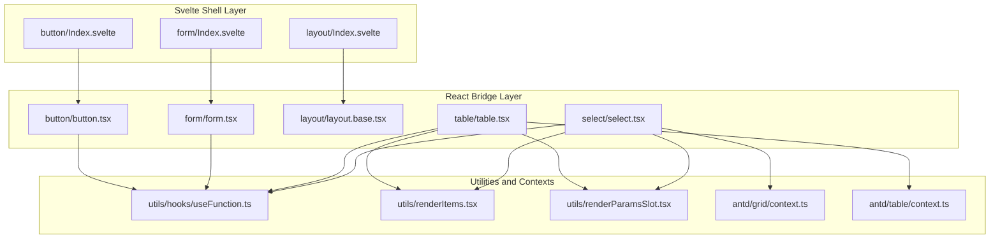
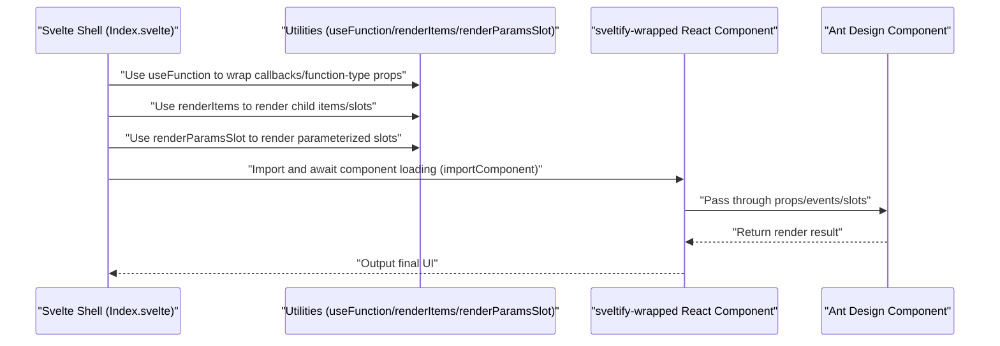
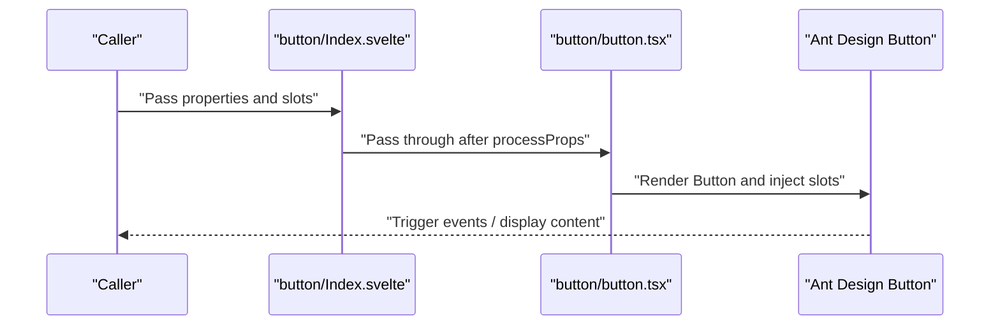
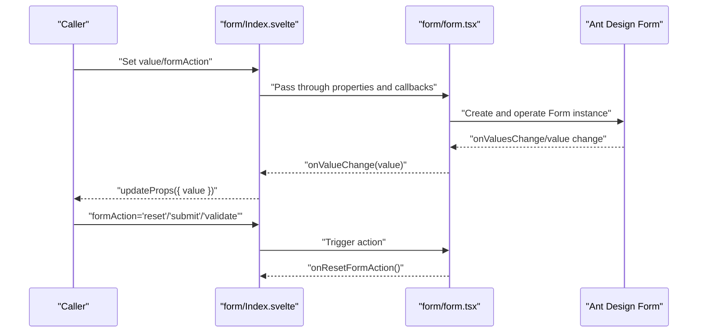
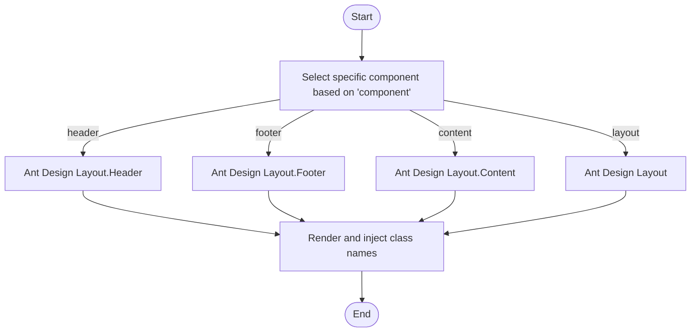
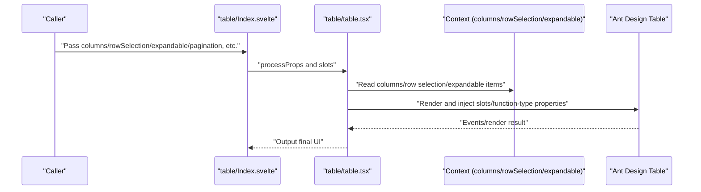
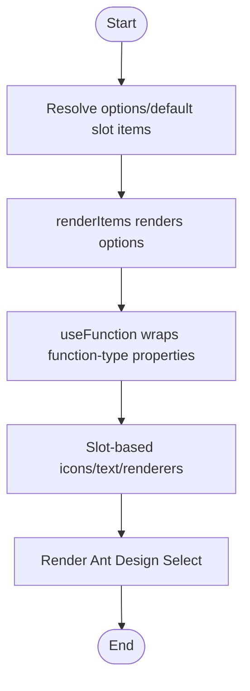
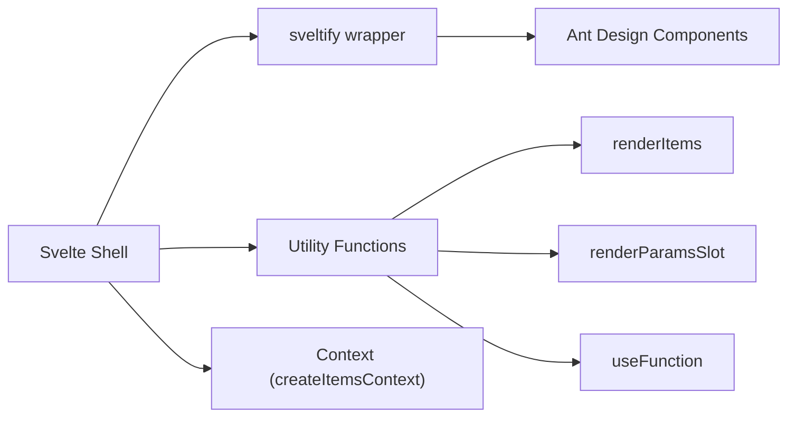

# Ant Design Components API

<cite>
**Files referenced in this document**
- [frontend/antd/package.json](file://frontend/antd/package.json)
- [backend/modelscope_studio/components/antd/components.py](file://backend/modelscope_studio/components/antd/components.py)
- [frontend/antd/button/Index.svelte](file://frontend/antd/button/Index.svelte)
- [frontend/antd/button/button.tsx](file://frontend/antd/button/button.tsx)
- [frontend/antd/form/Index.svelte](file://frontend/antd/form/Index.svelte)
- [frontend/antd/form/form.tsx](file://frontend/antd/form/form.tsx)
- [frontend/antd/layout/Index.svelte](file://frontend/antd/layout/Index.svelte)
- [frontend/antd/layout/layout.base.tsx](file://frontend/antd/layout/layout.base.tsx)
- [frontend/antd/table/table.tsx](file://frontend/antd/table/table.tsx)
- [frontend/antd/select/select.tsx](file://frontend/antd/select/select.tsx)
- [frontend/utils/hooks/useFunction.ts](file://frontend/utils/hooks/useFunction.ts)
- [frontend/utils/renderItems.tsx](file://frontend/utils/renderItems.tsx)
- [frontend/utils/renderParamsSlot.tsx](file://frontend/utils/renderParamsSlot.tsx)
- [frontend/antd/grid/context.ts](file://frontend/antd/grid/context.ts)
- [frontend/antd/table/context.ts](file://frontend/antd/table/context.ts)
</cite>

## Table of Contents

1. [Introduction](#introduction)
2. [Project Structure](#project-structure)
3. [Core Components](#core-components)
4. [Architecture Overview](#architecture-overview)
5. [Detailed Component Analysis](#detailed-component-analysis)
6. [Dependency Analysis](#dependency-analysis)
7. [Performance Considerations](#performance-considerations)
8. [Troubleshooting Guide](#troubleshooting-guide)
9. [Conclusion](#conclusion)
10. [Appendix](#appendix)

## Introduction

This document is the API reference for Ant Design Svelte-based components in ModelScope Studio. It systematically covers the encapsulation approach of Ant Design components at the frontend layer, spanning general components, layout components, navigation components, data entry components, data display components, feedback components, and more. It clarifies property definitions, event handling, slot system, style customization, state management, and data binding mechanisms for each component, providing correspondence with native Ant Design components and TypeScript type specifications. It also provides reference paths for instantiation and configuration, as well as performance optimization and best practice recommendations.

## Project Structure

ModelScope Studio's Ant Design Svelte components adopt a "Svelte shell + React component bridge" architecture: the Svelte layer handles property passthrough, slots, and visibility control; the React layer bridges Ant Design components into the Svelte ecosystem via `sveltify`. The utility layer provides unified function wrapping, slot rendering, and context injection capabilities.

Diagram sources

- [frontend/antd/button/Index.svelte:1-74](file://frontend/antd/button/Index.svelte#L1-L74)
- [frontend/antd/button/button.tsx:1-39](file://frontend/antd/button/button.tsx#L1-L39)
- [frontend/antd/form/Index.svelte:1-99](file://frontend/antd/form/Index.svelte#L1-L99)
- [frontend/antd/form/form.tsx:1-79](file://frontend/antd/form/form.tsx#L1-L79)
- [frontend/antd/layout/Index.svelte:1-18](file://frontend/antd/layout/Index.svelte#L1-L18)
- [frontend/antd/layout/layout.base.tsx:1-40](file://frontend/antd/layout/layout.base.tsx#L1-L40)
- [frontend/antd/table/table.tsx:1-279](file://frontend/antd/table/table.tsx#L1-L279)
- [frontend/antd/select/select.tsx:1-181](file://frontend/antd/select/select.tsx#L1-L181)
- [frontend/utils/hooks/useFunction.ts:1-13](file://frontend/utils/hooks/useFunction.ts#L1-L13)
- [frontend/utils/renderItems.tsx:1-114](file://frontend/utils/renderItems.tsx#L1-L114)
- [frontend/utils/renderParamsSlot.tsx:1-51](file://frontend/utils/renderParamsSlot.tsx#L1-L51)
- [frontend/antd/grid/context.ts:1-7](file://frontend/antd/grid/context.ts#L1-L7)
- [frontend/antd/table/context.ts:1-29](file://frontend/antd/table/context.ts#L1-L29)

Section sources

- [frontend/antd/package.json:1-6](file://frontend/antd/package.json#L1-L6)

## Core Components

This section provides an overview of responsibilities and typical usage highlights for each component layer:

- General components: Such as Button, responsible for property passthrough, slots (icon, loading state icon), and visibility control.
- Form components: Such as Form, responsible for two-way form value binding, action triggers (reset/submit/validate), and callback merging.
- Layout components: Such as Layout, selecting specific Header/Footer/Content/Layout components on-demand via the Base component and injecting style class names.
- Data display components: Such as Table, supporting complex scenarios including columns, expand, row selection, pagination, sticky headers, summary, title/footer slots, etc.
- Selector components: Such as Select, supporting option lists, filtering, dropdown/popup rendering, tag/tag-item rendering, and other slots.

Section sources

- [frontend/antd/button/Index.svelte:1-74](file://frontend/antd/button/Index.svelte#L1-L74)
- [frontend/antd/button/button.tsx:1-39](file://frontend/antd/button/button.tsx#L1-L39)
- [frontend/antd/form/Index.svelte:1-99](file://frontend/antd/form/Index.svelte#L1-L99)
- [frontend/antd/form/form.tsx:1-79](file://frontend/antd/form/form.tsx#L1-L79)
- [frontend/antd/layout/Index.svelte:1-18](file://frontend/antd/layout/Index.svelte#L1-L18)
- [frontend/antd/layout/layout.base.tsx:1-40](file://frontend/antd/layout/layout.base.tsx#L1-L40)
- [frontend/antd/table/table.tsx:1-279](file://frontend/antd/table/table.tsx#L1-L279)
- [frontend/antd/select/select.tsx:1-181](file://frontend/antd/select/select.tsx#L1-L181)

## Architecture Overview

The Svelte shell collects and transforms properties via `getProps`/`processProps`/`importComponent`, and then the `sveltify`-wrapped React components carry the actual UI logic. The slot system implements parameterized rendering and context injection via `ReactSlot` and `renderItems`/`renderParamsSlot`.

Diagram sources

- [frontend/antd/button/Index.svelte:1-74](file://frontend/antd/button/Index.svelte#L1-L74)
- [frontend/antd/button/button.tsx:1-39](file://frontend/antd/button/button.tsx#L1-L39)
- [frontend/antd/form/Index.svelte:1-99](file://frontend/antd/form/Index.svelte#L1-L99)
- [frontend/antd/form/form.tsx:1-79](file://frontend/antd/form/form.tsx#L1-L79)
- [frontend/antd/table/table.tsx:1-279](file://frontend/antd/table/table.tsx#L1-L279)
- [frontend/antd/select/select.tsx:1-181](file://frontend/antd/select/select.tsx#L1-L181)
- [frontend/utils/hooks/useFunction.ts:1-13](file://frontend/utils/hooks/useFunction.ts#L1-L13)
- [frontend/utils/renderItems.tsx:1-114](file://frontend/utils/renderItems.tsx#L1-L114)
- [frontend/utils/renderParamsSlot.tsx:1-51](file://frontend/utils/renderParamsSlot.tsx#L1-L51)

## Detailed Component Analysis

### Button Component

- Property definitions
  - Common properties: Inherits all properties of Ant Design Button.
  - Slots: `icon`, `loading.icon`.
  - Meta info: `elem_id`, `elem_classes`, `elem_style`, `visible` for visibility and style control.
  - Link behavior: `href_target` maps to `target`.
- Event handling
  - Passes through events such as `onClick` from Ant Design Button.
- Slot system
  - Supports passing icons or loading state icons as slots, rendered internally via `ReactSlot`.
- Style customization
  - Injects class names and inline styles via `elem_classes` and `elem_style`.
- State management and data binding
  - No two-way binding; visibility can be controlled by updating props externally.
- TypeScript types
  - Uses Ant Design Button's `GetProps` type alias for constraints.
- Correspondence
  - React component: Ant Design Button.
- Example reference paths
  - [frontend/antd/button/Index.svelte:1-74](file://frontend/antd/button/Index.svelte#L1-L74)
  - [frontend/antd/button/button.tsx:1-39](file://frontend/antd/button/button.tsx#L1-L39)

Diagram sources

- [frontend/antd/button/Index.svelte:1-74](file://frontend/antd/button/Index.svelte#L1-L74)
- [frontend/antd/button/button.tsx:1-39](file://frontend/antd/button/button.tsx#L1-L39)

Section sources

- [frontend/antd/button/Index.svelte:1-74](file://frontend/antd/button/Index.svelte#L1-L74)
- [frontend/antd/button/button.tsx:1-39](file://frontend/antd/button/button.tsx#L1-L39)

### Form Component

- Property definitions
  - `value`: Form initial or controlled value.
  - `formAction`: `'reset'` | `'submit'` | `'validate'` | `null`, used to trigger actions.
  - Callbacks: `onValueChange`, `onResetFormAction`.
  - Others: `requiredMark`, `feedbackIcons`, `as_item`, `visible`, etc.
- Event handling
  - `onValuesChange` merges `onValueChange` to implement value change notifications.
  - Action execution: Calls `form.resetFields`/`form.submit`/`form.validateFields` based on `formAction`.
- Slot system
  - `requiredMark` can be rendered via a slot.
- Style and visibility
  - `elem_id`, `elem_classes`, `elem_style`, `visible` control appearance and display.
- State management and data binding
  - Two-way binding: `onValueChange` updates the external `value`; external `value` changes sync back to the form.
  - Action decoupling: `onResetFormAction` resets `formAction` after an action completes.
- TypeScript types
  - `FormProps` extends Ant Design Form's `GetProps`, adding `value`, `onValueChange`, `formAction`, etc.
- Correspondence
  - React component: Ant Design Form.
- Example reference paths
  - [frontend/antd/form/Index.svelte:1-99](file://frontend/antd/form/Index.svelte#L1-L99)
  - [frontend/antd/form/form.tsx:1-79](file://frontend/antd/form/form.tsx#L1-L79)

Diagram sources

- [frontend/antd/form/Index.svelte:1-99](file://frontend/antd/form/Index.svelte#L1-L99)
- [frontend/antd/form/form.tsx:1-79](file://frontend/antd/form/form.tsx#L1-L79)

Section sources

- [frontend/antd/form/Index.svelte:1-99](file://frontend/antd/form/Index.svelte#L1-L99)
- [frontend/antd/form/form.tsx:1-79](file://frontend/antd/form/form.tsx#L1-L79)

### Layout Component

- Property definitions
  - `component`: `'header'` | `'footer'` | `'content'` | `'layout'`, determines the specific Ant Design component to render.
  - Others: `className`, `id`, `style`, etc. are passed through.
- Slot system
  - Receives `children` via the Base component and renders them.
- Style customization
  - Base injects different class name prefixes for different `component` values to facilitate theming.
- Correspondence
  - React component: Ant Design Layout and its Content/Header/Footer.
- Example reference paths
  - [frontend/antd/layout/Index.svelte:1-18](file://frontend/antd/layout/Index.svelte#L1-L18)
  - [frontend/antd/layout/layout.base.tsx:1-40](file://frontend/antd/layout/layout.base.tsx#L1-L40)

Diagram sources

- [frontend/antd/layout/layout.base.tsx:1-40](file://frontend/antd/layout/layout.base.tsx#L1-L40)

Section sources

- [frontend/antd/layout/Index.svelte:1-18](file://frontend/antd/layout/Index.svelte#L1-L18)
- [frontend/antd/layout/layout.base.tsx:1-40](file://frontend/antd/layout/layout.base.tsx#L1-L40)

### Table Component

- Property definitions
  - `columns`: Column definitions, supporting default columns and extended column constants.
  - `rowSelection`, `expandable`: Row selection and expandable configuration, supporting slot injection.
  - `pagination`: Pagination configuration, supporting slot injection for quick-jump buttons and page number rendering.
  - `loading`: Supports `tip` and `indicator` slots.
  - `sticky`, `showSorterTooltip`, `footer`, `title`, `summary`, etc.
- Slot system
  - Injects column, row selection, and expandable items via `withColumnItemsContextProvider`/`withRowSelectionItemsContextProvider`/`withExpandableItemsContextProvider`.
  - `renderItems` renders columns and child items; `renderParamsSlot` renders parameterized slots (such as pagination buttons, page number rendering, sorter tooltips, etc.).
- Function-type properties
  - `useFunction` wraps function-type properties such as `getPopupContainer`, `rowClassName`, `rowKey`, `summary`, and `footer`.
- Performance notes
  - Configurations such as columns and row selection are optimized with `useMemo`.
- Correspondence
  - React component: Ant Design Table.
- Example reference paths
  - [frontend/antd/table/table.tsx:1-279](file://frontend/antd/table/table.tsx#L1-L279)
  - [frontend/antd/table/context.ts:1-29](file://frontend/antd/table/context.ts#L1-L29)
  - [frontend/utils/renderItems.tsx:1-114](file://frontend/utils/renderItems.tsx#L1-L114)
  - [frontend/utils/renderParamsSlot.tsx:1-51](file://frontend/utils/renderParamsSlot.tsx#L1-L51)

Diagram sources

- [frontend/antd/table/table.tsx:1-279](file://frontend/antd/table/table.tsx#L1-L279)
- [frontend/antd/table/context.ts:1-29](file://frontend/antd/table/context.ts#L1-L29)

Section sources

- [frontend/antd/table/table.tsx:1-279](file://frontend/antd/table/table.tsx#L1-L279)
- [frontend/antd/table/context.ts:1-29](file://frontend/antd/table/context.ts#L1-L29)

### Select Component

- Property definitions
  - `options`: Option list, supporting injection via slots.
  - `onChange`/`onValueChange`: Value change callbacks.
  - `filterOption`/`filterSort`: Filtering and sorting functions.
  - `dropdownRender`/`popupRender`/`optionRender`/`tagRender`/`labelRender`: Slot-based rendering.
  - `allowClear.prefix`/`removeIcon`/`suffixIcon`/`notFoundContent`/`menuItemSelectedIcon`: Slot-based icons and text.
- Slot system
  - `withItemsContextProvider` injects `options`/`default` child items; `renderItems` renders options.
  - `renderParamsSlot` renders parameterized slots (such as `maxTagPlaceholder`).
- Function-type properties
  - `useFunction` wraps `getPopupContainer`, `dropdownRender`, `popupRender`, `optionRender`, `tagRender`, `labelRender`, `filterOption`, `filterSort`.
- Correspondence
  - React component: Ant Design Select.
- Example reference paths
  - [frontend/antd/select/select.tsx:1-181](file://frontend/antd/select/select.tsx#L1-L181)
  - [frontend/antd/grid/context.ts:1-7](file://frontend/antd/grid/context.ts#L1-L7)
  - [frontend/utils/renderItems.tsx:1-114](file://frontend/utils/renderItems.tsx#L1-L114)
  - [frontend/utils/renderParamsSlot.tsx:1-51](file://frontend/utils/renderParamsSlot.tsx#L1-L51)

Diagram sources

- [frontend/antd/select/select.tsx:1-181](file://frontend/antd/select/select.tsx#L1-L181)
- [frontend/antd/grid/context.ts:1-7](file://frontend/antd/grid/context.ts#L1-L7)

Section sources

- [frontend/antd/select/select.tsx:1-181](file://frontend/antd/select/select.tsx#L1-L181)
- [frontend/antd/grid/context.ts:1-7](file://frontend/antd/grid/context.ts#L1-L7)

## Dependency Analysis

- Inter-component dependencies
  - Button/Form/Layout/Table/Select all depend on `sveltify` to bridge Ant Design components to Svelte.
  - Slots and contexts depend on `renderItems`/`renderParamsSlot` and `createItemsContext`.
  - Function-type properties depend on `useFunction` to be wrapped as executable functions.
- External dependencies
  - Ant Design: Provides UI foundation capabilities as a React component library.
  - Utility libraries: `classnames`, `lodash-es`, etc. assist with styles and object handling.
- Circular dependencies
  - No direct circular dependencies found; context injection is exported through independent modules.

Diagram sources

- [frontend/antd/button/button.tsx:1-39](file://frontend/antd/button/button.tsx#L1-L39)
- [frontend/antd/form/form.tsx:1-79](file://frontend/antd/form/form.tsx#L1-L79)
- [frontend/antd/table/table.tsx:1-279](file://frontend/antd/table/table.tsx#L1-L279)
- [frontend/antd/select/select.tsx:1-181](file://frontend/antd/select/select.tsx#L1-L181)
- [frontend/utils/hooks/useFunction.ts:1-13](file://frontend/utils/hooks/useFunction.ts#L1-L13)
- [frontend/utils/renderItems.tsx:1-114](file://frontend/utils/renderItems.tsx#L1-L114)
- [frontend/utils/renderParamsSlot.tsx:1-51](file://frontend/utils/renderParamsSlot.tsx#L1-L51)

Section sources

- [frontend/antd/button/button.tsx:1-39](file://frontend/antd/button/button.tsx#L1-L39)
- [frontend/antd/form/form.tsx:1-79](file://frontend/antd/form/form.tsx#L1-L79)
- [frontend/antd/table/table.tsx:1-279](file://frontend/antd/table/table.tsx#L1-L279)
- [frontend/antd/select/select.tsx:1-181](file://frontend/antd/select/select.tsx#L1-L181)
- [frontend/utils/hooks/useFunction.ts:1-13](file://frontend/utils/hooks/useFunction.ts#L1-L13)
- [frontend/utils/renderItems.tsx:1-114](file://frontend/utils/renderItems.tsx#L1-L114)
- [frontend/utils/renderParamsSlot.tsx:1-51](file://frontend/utils/renderParamsSlot.tsx#L1-L51)

## Performance Considerations

- Function-type property wrapping
  - Use `useFunction` to wrap incoming strings/functions as executable functions, avoiding recreation of closures on each render.
- Slots and contexts
  - `renderItems` and `renderParamsSlot` support cloning and parameterized rendering to reduce redundant rendering overhead.
- Computation caching
  - Table/Select extensively use `useMemo` to cache computation results (such as columns, row keys, container functions, etc.).
- Async loading
  - The Svelte shell asynchronously loads React components via `importComponent` to reduce initial render pressure.
- Best practices
  - Prefer using slots over inline JSX to improve reusability and maintainability.
  - Use `$derived` or `useMemo` wrappers for frequently changing props to avoid unnecessary re-renders.
  - Properly split components to avoid a single component taking on too many responsibilities.

## Troubleshooting Guide

- Slot not taking effect
  - Check that the slot key is correct (e.g., `'loading.icon'`, `'pagination.showQuickJumper.goButton'`) and ensure the passed value is an `HTMLElement` or an object with `withParams`.
  - Confirm the `forceClone` and `clone` settings for `renderParamsSlot`/`renderItems`.
- Function-type properties not working
  - Ensure that the passed string expression is correctly wrapped by `useFunction`; pass `plainText=true` when necessary.
- Form action not triggered
  - Confirm the `formAction` value is `'reset'` | `'submit'` | `'validate'` | `null`, and reset `formAction` after the action completes.
- Style anomalies
  - Check that `elem_classes` and `elem_style` are correctly injected; for Layout components, ensure the `component` parameter matches the actual layout element.

Section sources

- [frontend/antd/button/button.tsx:1-39](file://frontend/antd/button/button.tsx#L1-L39)
- [frontend/antd/form/form.tsx:1-79](file://frontend/antd/form/form.tsx#L1-L79)
- [frontend/antd/table/table.tsx:1-279](file://frontend/antd/table/table.tsx#L1-L279)
- [frontend/antd/select/select.tsx:1-181](file://frontend/antd/select/select.tsx#L1-L181)
- [frontend/utils/hooks/useFunction.ts:1-13](file://frontend/utils/hooks/useFunction.ts#L1-L13)
- [frontend/utils/renderItems.tsx:1-114](file://frontend/utils/renderItems.tsx#L1-L114)
- [frontend/utils/renderParamsSlot.tsx:1-51](file://frontend/utils/renderParamsSlot.tsx#L1-L51)

## Conclusion

ModelScope Studio's Ant Design Svelte components achieve high-fidelity encapsulation of Ant Design components through clear layered design and a powerful slot/context system. Developers can use Ant Design's rich capabilities in Svelte at minimal cost while maintaining good maintainability and performance. It is recommended to prioritize slots and contexts in complex scenarios, combined with function-type property wrapping and `useMemo` caching, for a better development experience and runtime efficiency.

## Appendix

- Component inventory (categorized by module)
  - General components: Button, Icon, Spin, Space, Typography, etc.
  - Layout components: Layout (Header/Footer/Content/Layout), Grid (Row/Col), etc.
  - Navigation components: Anchor, Breadcrumb, Dropdown, Menu, Pagination, Steps, Tabs, Tour, etc.
  - Data entry components: AutoComplete, Cascader, Checkbox, ColorPicker, DatePicker, Mentions, Radio, Rate, Select, Slider, Switch, TimePicker, TreeSelect, Upload, Input/InputNumber/TextArea/Search/Password/OTP, etc.
  - Data display components: Avatar, Badge, Calendar, Card/Card.Grid/Card.Meta, Carousel, Descriptions, Divider, Empty, Image/Image.PreviewGroup, List/List.Item/List.Item.Meta, Masonry/Masonry.Item, Result, Statistical/Countdown/Timer, Table/Table.Column/Table.ColumnGroup/Table.Expandable/Table.RowSelection, etc.
  - Feedback components: Alert, Drawer, FloatButton/BackTop/Group, Modal/Static, Message, Notification, Popconfirm, Popover, Progress, QRCode, Result, Tour, Tooltip, Tour/Step, etc.
- Correspondence with native Ant Design
  - Each Svelte component wraps the corresponding Ant Design React component via `sveltify`, with consistent properties and events.
- TypeScript type specifications
  - Component types are all extended from Ant Design's `GetProps` type alias to ensure type safety.
- Example reference paths
  - General components: [frontend/antd/button/Index.svelte:1-74](file://frontend/antd/button/Index.svelte#L1-L74)
  - Form components: [frontend/antd/form/Index.svelte:1-99](file://frontend/antd/form/Index.svelte#L1-L99)
  - Layout components: [frontend/antd/layout/Index.svelte:1-18](file://frontend/antd/layout/Index.svelte#L1-L18)
  - Data display components: [frontend/antd/table/table.tsx:1-279](file://frontend/antd/table/table.tsx#L1-L279)
  - Selector components: [frontend/antd/select/select.tsx:1-181](file://frontend/antd/select/select.tsx#L1-L181)
