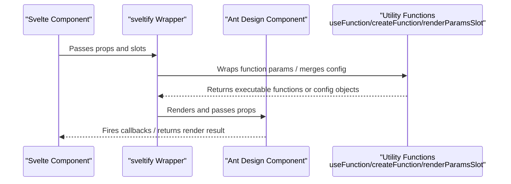
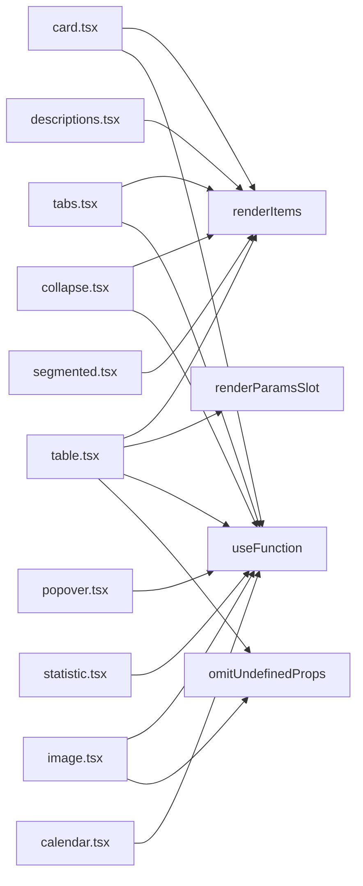

# Data Display Components API

<cite>
**Files referenced in this document**
- [avatar.tsx](file://frontend/antd/avatar/avatar.tsx)
- [badge.tsx](file://frontend/antd/badge/badge.tsx)
- [calendar.tsx](file://frontend/antd/calendar/calendar.tsx)
- [card.tsx](file://frontend/antd/card/card.tsx)
- [carousel.tsx](file://frontend/antd/carousel/carousel.tsx)
- [collapse.tsx](file://frontend/antd/collapse/collapse.tsx)
- [descriptions.tsx](file://frontend/antd/descriptions/descriptions.tsx)
- [empty.tsx](file://frontend/antd/empty/empty.tsx)
- [image.tsx](file://frontend/antd/image/image.tsx)
- [list.tsx](file://frontend/antd/list/list.tsx)
- [popover.tsx](file://frontend/antd/popover/popover.tsx)
- [qr-code.tsx](file://frontend/antd/qr-code/qr-code.tsx)
- [segmented.tsx](file://frontend/antd/segmented/segmented.tsx)
- [statistic.tsx](file://frontend/antd/statistic/statistic.tsx)
- [table.tsx](file://frontend/antd/table/table.tsx)
- [tabs.tsx](file://frontend/antd/tabs/tabs.tsx)
- [tag.tsx](file://frontend/antd/tag/tag.tsx)
- [timeline.tsx](file://frontend/antd/timeline/timeline.tsx)
- [tooltip.tsx](file://frontend/antd/tooltip/tooltip.tsx)
- [tour.tsx](file://frontend/antd/tour/tour.tsx)
- [tree.tsx](file://frontend/antd/tree/tree.tsx)
</cite>

## Table of Contents

1. [Introduction](#introduction)
2. [Project Structure](#project-structure)
3. [Core Components](#core-components)
4. [Architecture Overview](#architecture-overview)
5. [Component Details](#component-details)
6. [Dependency Analysis](#dependency-analysis)
7. [Performance Considerations](#performance-considerations)
8. [Troubleshooting Guide](#troubleshooting-guide)
9. [Conclusion](#conclusion)
10. [Appendix](#appendix)

## Introduction

This document is the API reference for Ant Design-based data display components in ModelScope Studio, covering: Avatar, Badge, Calendar, Card, Carousel, Collapse, Descriptions, Empty, Image, List, Popover, QRCode, Segmented, Statistic, Table, Tabs, Tag, Timeline, Tooltip, Tour, and Tree. It includes:

- Property definitions and data format requirements
- Display logic and interaction behaviors
- Standard instantiation and configuration examples (provided as paths)
- Data binding, virtual scrolling, lazy loading, and performance optimization mechanisms
- Key TypeScript type definitions, data transformation, and chart library integration ideas
- Visual design principles and user experience optimization recommendations

## Project Structure

These components reside in the `antd` submodule of the frontend directory and follow a unified wrapping pattern: bridging Ant Design components into the Svelte ecosystem via `sveltify`, and implementing flexible content slots and function parameter rendering using `slots` and `renderParamsSlot`.

```mermaid
graph TB
subgraph "Ant Design Component Layer"
AD_Avatar["Avatar"]
AD_Badge["Badge"]
AD_Calendar["Calendar"]
AD_Card["Card"]
AD_Carousel["Carousel"]
AD_Collapse["Collapse"]
AD_Descriptions["Descriptions"]
AD_Empty["Empty"]
AD_Image["Image"]
AD_List["List"]
AD_Popover["Popover"]
AD_QRCode["QRCode"]
AD_Segmented["Segmented"]
AD_Statistic["Statistic"]
AD_Table["Table"]
AD_Tabs["Tabs"]
AD_Tag["Tag"]
AD_Timeline["Timeline"]
AD_Tooltip["Tooltip"]
AD_Tour["Tour"]
AD_Tree["Tree"]
end
subgraph "sveltify Wrapper Layer"
S_Avatar["avatar.tsx"]
S_Badge["badge.tsx"]
S_Calendar["calendar.tsx"]
S_Card["card.tsx"]
S_Carousel["carousel.tsx"]
S_Collapse["collapse.tsx"]
S_Descriptions["descriptions.tsx"]
S_Empty["empty.tsx"]
S_Image["image.tsx"]
S_List["list.tsx"]
S_Popover["popover.tsx"]
S_QRCode["qr-code.tsx"]
S_Segmented["segmented.tsx"]
S_Statistic["statistic.tsx"]
S_Table["table.tsx"]
S_Tabs["tabs.tsx"]
S_Tag["tag.tsx"]
S_Timeline["timeline.tsx"]
S_Tooltip["tooltip.tsx"]
S_Tour["tour.tsx"]
S_Tree["tree.tsx"]
end
S_Avatar --> AD_Avatar
S_Badge --> AD_Badge
S_Calendar --> AD_Calendar
S_Card --> AD_Card
S_Carousel --> AD_Carousel
S_Collapse --> AD_Collapse
S_Descriptions --> AD_Descriptions
S_Empty --> AD_Empty
S_Image --> AD_Image
S_List --> AD_List
S_Popover --> AD_Popover
S_QRCode --> AD_QRCode
S_Segmented --> AD_Segmented
S_Statistic --> AD_Statistic
S_Table --> AD_Table
S_Tabs --> AD_Tabs
S_Tag --> AD_Tag
S_Timeline --> AD_Timeline
S_Tooltip --> AD_Tooltip
S_Tour --> AD_Tour
S_Tree --> AD_Tree
```

Diagram sources

- [avatar.tsx:1-28](file://frontend/antd/avatar/avatar.tsx#L1-L28)
- [badge.tsx:1-21](file://frontend/antd/badge/badge.tsx#L1-L21)
- [calendar.tsx:1-102](file://frontend/antd/calendar/calendar.tsx#L1-L102)
- [card.tsx:1-150](file://frontend/antd/card/card.tsx#L1-L150)
- [carousel.tsx:1-32](file://frontend/antd/carousel/carousel.tsx#L1-L32)
- [collapse.tsx:1-53](file://frontend/antd/collapse/collapse.tsx#L1-L53)
- [descriptions.tsx:1-41](file://frontend/antd/descriptions/descriptions.tsx#L1-L41)
- [empty.tsx:1-52](file://frontend/antd/empty/empty.tsx#L1-L52)
- [image.tsx:1-89](file://frontend/antd/image/image.tsx#L1-L89)
- [list.tsx:1-36](file://frontend/antd/list/list.tsx#L1-L36)
- [popover.tsx:1-37](file://frontend/antd/popover/popover.tsx#L1-L37)
- [qr-code.tsx:1-200](file://frontend/antd/qr-code/qr-code.tsx#L1-L200)
- [segmented.tsx:1-47](file://frontend/antd/segmented/segmented.tsx#L1-L47)
- [statistic.tsx:1-34](file://frontend/antd/statistic/statistic.tsx#L1-L34)
- [table.tsx:1-279](file://frontend/antd/table/table.tsx#L1-L279)
- [tabs.tsx:1-121](file://frontend/antd/tabs/tabs.tsx#L1-L121)
- [tag.tsx:1-200](file://frontend/antd/tag/tag.tsx#L1-L200)
- [timeline.tsx:1-200](file://frontend/antd/timeline/timeline.tsx#L1-L200)
- [tooltip.tsx:1-200](file://frontend/antd/tooltip/tooltip.tsx#L1-L200)
- [tour.tsx:1-200](file://frontend/antd/tour/tour.tsx#L1-L200)
- [tree.tsx:1-200](file://frontend/antd/tree/tree.tsx#L1-L200)

Section sources

- [avatar.tsx:1-28](file://frontend/antd/avatar/avatar.tsx#L1-L28)
- [badge.tsx:1-21](file://frontend/antd/badge/badge.tsx#L1-L21)
- [calendar.tsx:1-102](file://frontend/antd/calendar/calendar.tsx#L1-L102)
- [card.tsx:1-150](file://frontend/antd/card/card.tsx#L1-L150)
- [carousel.tsx:1-32](file://frontend/antd/carousel/carousel.tsx#L1-L32)
- [collapse.tsx:1-53](file://frontend/antd/collapse/collapse.tsx#L1-L53)
- [descriptions.tsx:1-41](file://frontend/antd/descriptions/descriptions.tsx#L1-L41)
- [empty.tsx:1-52](file://frontend/antd/empty/empty.tsx#L1-L52)
- [image.tsx:1-89](file://frontend/antd/image/image.tsx#L1-L89)
- [list.tsx:1-36](file://frontend/antd/list/list.tsx#L1-L36)
- [popover.tsx:1-37](file://frontend/antd/popover/popover.tsx#L1-L37)
- [segmented.tsx:1-47](file://frontend/antd/segmented/segmented.tsx#L1-L47)
- [statistic.tsx:1-34](file://frontend/antd/statistic/statistic.tsx#L1-L34)
- [table.tsx:1-279](file://frontend/antd/table/table.tsx#L1-L279)
- [tabs.tsx:1-121](file://frontend/antd/tabs/tabs.tsx#L1-L121)

## Core Components

This section provides an overview of each component's responsibility and common wrapping strategy:

- All components use `sveltify` to wrap Ant Design components, supporting `slots` and `renderParamsSlot` render function parameters.
- Most components support `children` forwarding and various named slots (e.g., `title`, `extra`, `footer`, `header`, `content`, `image`, `description`, `placeholder`, `mask`, `toolbarRender`, `imageRender`, `tabBarExtraContent`, `tabProps.*`, etc.) for flexible appearance and behavior customization.
- Some components wrap event callbacks to ensure correct execution in the Svelte environment.

Section sources

- [avatar.tsx:6-25](file://frontend/antd/avatar/avatar.tsx#L6-L25)
- [badge.tsx:6-18](file://frontend/antd/badge/badge.tsx#L6-L18)
- [card.tsx:37-146](file://frontend/antd/card/card.tsx#L37-L146)
- [carousel.tsx:8-28](file://frontend/antd/carousel/carousel.tsx#L8-L28)
- [collapse.tsx:11-49](file://frontend/antd/collapse/collapse.tsx#L11-L49)
- [descriptions.tsx:10-37](file://frontend/antd/descriptions/descriptions.tsx#L10-L37)
- [empty.tsx:6-49](file://frontend/antd/empty/empty.tsx#L6-L49)
- [image.tsx:15-85](file://frontend/antd/image/image.tsx#L15-L85)
- [list.tsx:8-33](file://frontend/antd/list/list.tsx#L8-L33)
- [popover.tsx:7-34](file://frontend/antd/popover/popover.tsx#L7-L34)
- [segmented.tsx:10-43](file://frontend/antd/segmented/segmented.tsx#L10-L43)
- [statistic.tsx:8-31](file://frontend/antd/statistic/statistic.tsx#L8-L31)
- [table.tsx:28-275](file://frontend/antd/table/table.tsx#L28-L275)
- [tabs.tsx:12-117](file://frontend/antd/tabs/tabs.tsx#L12-L117)

## Architecture Overview

The following sequence diagram illustrates the key flow from component wrapping to rendering: Svelte converts props and slots into Ant Design component props via `sveltify`; functional parameters are wrapped with `useFunction` or `createFunction`; complex configuration objects are merged with `omitUndefinedProps` and slots are injected.

Diagram sources

- [table.tsx:76-134](file://frontend/antd/table/table.tsx#L76-L134)
- [card.tsx:40-49](file://frontend/antd/card/card.tsx#L40-L49)
- [image.tsx:32-34](file://frontend/antd/image/image.tsx#L32-L34)
- [popover.tsx:10-12](file://frontend/antd/popover/popover.tsx#L10-L12)

## Component Details

### Avatar

- **Purpose**: Displays user avatars or icons; supports `icon` and `src` slots.
- **Key Points**:
  - Supports `slots.icon` and `slots.src`; slot content takes priority if present, otherwise falls back to props.
  - Slots are rendered via `ReactSlot`.
- **Typical usage path**:
  - [Avatar basic usage:6-25](file://frontend/antd/avatar/avatar.tsx#L6-L25)

Section sources

- [avatar.tsx:6-25](file://frontend/antd/avatar/avatar.tsx#L6-L25)

### Badge

- **Purpose**: Displays a badge count or text on avatars, buttons, and other elements.
- **Key Points**:
  - Supports `slots.count` and `slots.text` for dynamic badge content rendering.
- **Typical usage path**:
  - [Badge count and text:6-18](file://frontend/antd/badge/badge.tsx#L6-L18)

Section sources

- [badge.tsx:6-18](file://frontend/antd/badge/badge.tsx#L6-L18)

### Calendar

- **Purpose**: Date selection and schedule display.
- **Key Points**:
  - `value`/`defaultValue`/`validRange` are processed with `dayjs` formatting.
  - `onChange`/`onPanelChange`/`onSelect` callbacks are uniformly converted to second-level timestamps.
  - Supports `slots.cellRender`/`fullCellRender`/`headerRender` function slots.
- **Typical usage path**:
  - [Calendar date formatting and callbacks:17-98](file://frontend/antd/calendar/calendar.tsx#L17-L98)

Section sources

- [calendar.tsx:17-98](file://frontend/antd/calendar/calendar.tsx#L17-L98)

### Card

- **Purpose**: Container component supporting title, extra actions, cover image, action area, and tab pages.
- **Key Points**:
  - Supports `slots.title`/`extra`/`cover`/`tabBarExtraContent`/`left`/`right`, etc.
  - `actions` are automatically collected from child nodes via `useTargets`.
  - `tabList` is resolved from context via `renderItems`.
  - `tabProps.indicator.size`, `more.icon`, `tabProps.renderTabBar`, `tabProps.tabBarExtraContent.*`, etc. can all be slotted.
- **Typical usage path**:
  - [Card with tab pages and action area:37-146](file://frontend/antd/card/card.tsx#L37-L146)

Section sources

- [card.tsx:37-146](file://frontend/antd/card/card.tsx#L37-L146)

### Carousel

- **Purpose**: Carousel display of multiple images or content panels.
- **Key Points**:
  - Uses `useTargets` to extract child nodes as carousel items.
  - `afterChange`/`beforeChange` are wrapped via `useFunction`.
- **Typical usage path**:
  - [Carousel item rendering:8-28](file://frontend/antd/carousel/carousel.tsx#L8-L28)

Section sources

- [carousel.tsx:8-28](file://frontend/antd/carousel/carousel.tsx#L8-L28)

### Collapse

- **Purpose**: Grouping content with collapse/expand behavior.
- **Key Points**:
  - Supports `slots.expandIcon` function slot.
  - `items` are resolved from context via `renderItems`, supporting `label`/`extra`/`children` structure.
- **Typical usage path**:
  - [Collapse items and expand icon:11-49](file://frontend/antd/collapse/collapse.tsx#L11-L49)

Section sources

- [collapse.tsx:11-49](file://frontend/antd/collapse/collapse.tsx#L11-L49)

### Descriptions

- **Purpose**: Displays information in key-value pairs.
- **Key Points**:
  - Supports `slots.title`/`extra`; `items` are resolved via `renderItems` with `label`/`children` fields.
- **Typical usage path**:
  - [Descriptions item rendering:10-37](file://frontend/antd/descriptions/descriptions.tsx#L10-L37)

Section sources

- [descriptions.tsx:10-37](file://frontend/antd/descriptions/descriptions.tsx#L10-L37)

### Empty

- **Purpose**: Placeholder displayed when there is no data.
- **Key Points**:
  - Supports `slots.description`/`image`; `image` supports default constant mapping.
  - `styles` supports a function that returns a style object.
- **Typical usage path**:
  - [Empty with custom image and description:6-49](file://frontend/antd/empty/empty.tsx#L6-L49)

Section sources

- [empty.tsx:6-49](file://frontend/antd/empty/empty.tsx#L6-L49)

### Image

- **Purpose**: Image display and preview.
- **Key Points**:
  - Supports `slots.placeholder`, `preview.mask`, `preview.closeIcon`, `preview.toolbarRender`, `preview.imageRender`.
  - `preview` configuration is merged via `getConfig`/`omitUndefinedProps`; `getContainer`/`toolbarRender`/`imageRender` are wrapped via `useFunction`.
- **Typical usage path**:
  - [Image preview and toolbar rendering:15-85](file://frontend/antd/image/image.tsx#L15-L85)

Section sources

- [image.tsx:15-85](file://frontend/antd/image/image.tsx#L15-L85)

### List

- **Purpose**: Long list display with load-more support.
- **Key Points**:
  - Supports `slots.footer`/`header`/`loadMore`/`renderItem`; `renderItem` is rendered via `renderParamsSlot` with forced cloning.
- **Typical usage path**:
  - [List header, footer, and load more:8-33](file://frontend/antd/list/list.tsx#L8-L33)

Section sources

- [list.tsx:8-33](file://frontend/antd/list/list.tsx#L8-L33)

### Popover

- **Purpose**: Floating bubble card displaying a title and content.
- **Key Points**:
  - Supports `slots.title`/`content`; `title`/`content` are cloned via `ReactSlot`.
  - `afterOpenChange`/`getPopupContainer` are wrapped via `useFunction`.
- **Typical usage path**:
  - [Popover title and content:7-34](file://frontend/antd/popover/popover.tsx#L7-L34)

Section sources

- [popover.tsx:7-34](file://frontend/antd/popover/popover.tsx#L7-L34)

### QRCode

- **Purpose**: Generate and display QR codes.
- **Typical usage path**:
  - [QRCode component:1-200](file://frontend/antd/qr-code/qr-code.tsx#L1-L200)

Section sources

- [qr-code.tsx:1-200](file://frontend/antd/qr-code/qr-code.tsx#L1-L200)

### Segmented

- **Purpose**: Switching between multiple options.
- **Key Points**:
  - Supports resolving `options`/`default` from context; `onChange` exposes the selected value via `onValueChange`.
- **Typical usage path**:
  - [Segmented option rendering:10-43](file://frontend/antd/segmented/segmented.tsx#L10-L43)

Section sources

- [segmented.tsx:10-43](file://frontend/antd/segmented/segmented.tsx#L10-L43)

### Statistic

- **Purpose**: Displays numeric values with units, prefix, and suffix.
- **Key Points**:
  - Supports `slots.prefix`/`suffix`/`title`/`formatter`; `formatter` is rendered via `renderParamsSlot`.
- **Typical usage path**:
  - [Statistic value formatting:8-31](file://frontend/antd/statistic/statistic.tsx#L8-L31)

Section sources

- [statistic.tsx:8-31](file://frontend/antd/statistic/statistic.tsx#L8-L31)

### Table

- **Purpose**: Data table display and interaction.
- **Key Points**:
  - Supports complex configurations including `columns`, `rowSelection`, `expandable`, `sticky`, `pagination`, `loading`, `footer`, `title`, `summary`, `showSorterTooltip`, etc.
  - Injects column, expand, and row-selection contexts via multiple `with*ContextProvider` layers.
  - Uses `renderItems` and `renderParamsSlot` to dynamically resolve items and function parameters; uses `createFunction`/`omitUndefinedProps` to wrap and merge configuration.
- **Typical usage path**:
  - [Table columns and pagination slots:28-275](file://frontend/antd/table/table.tsx#L28-L275)

Section sources

- [table.tsx:28-275](file://frontend/antd/table/table.tsx#L28-L275)

### Tabs

- **Purpose**: Tab container and switching.
- **Key Points**:
  - Supports `slots.addIcon`/`removeIcon`/`renderTabBar`/`tabBarExtraContent`/`left`/`right`/`more.icon`.
  - `indicator.size`, `more.getPopupContainer`, `renderTabBar` are wrapped via `useFunction`; `items` are resolved via `renderItems`.
- **Typical usage path**:
  - [Tabs with extra content:12-117](file://frontend/antd/tabs/tabs.tsx#L12-L117)

Section sources

- [tabs.tsx:12-117](file://frontend/antd/tabs/tabs.tsx#L12-L117)

### Tag

- **Purpose**: Marking and categorization.
- **Typical usage path**:
  - [Tag component:1-200](file://frontend/antd/tag/tag.tsx#L1-L200)

Section sources

- [tag.tsx:1-200](file://frontend/antd/tag/tag.tsx#L1-L200)

### Timeline

- **Purpose**: Displays events in chronological order.
- **Typical usage path**:
  - [Timeline component:1-200](file://frontend/antd/timeline/timeline.tsx#L1-L200)

Section sources

- [timeline.tsx:1-200](file://frontend/antd/timeline/timeline.tsx#L1-L200)

### Tooltip

- **Purpose**: Concise hint text.
- **Typical usage path**:
  - [Tooltip component:1-200](file://frontend/antd/tooltip/tooltip.tsx#L1-L200)

Section sources

- [tooltip.tsx:1-200](file://frontend/antd/tooltip/tooltip.tsx#L1-L200)

### Tour

- **Purpose**: Guided tutorial.
- **Typical usage path**:
  - [Tour component:1-200](file://frontend/antd/tour/tour.tsx#L1-L200)

Section sources

- [tour.tsx:1-200](file://frontend/antd/tour/tour.tsx#L1-L200)

### Tree

- **Purpose**: Hierarchical data display and selection.
- **Typical usage path**:
  - [Tree component:1-200](file://frontend/antd/tree/tree.tsx#L1-L200)

Section sources

- [tree.tsx:1-200](file://frontend/antd/tree/tree.tsx#L1-L200)

## Dependency Analysis

- **Inter-component Coupling**:
  - Card and Tabs share context (the `tabList` context is reused when Card embeds Tabs).
  - Table injects column, expand, and row-selection contexts via multiple context providers.
  - Most components share utilities such as `renderItems`, `renderParamsSlot`, `useFunction`, and `omitUndefinedProps`.
- **External Dependencies**:
  - Ant Design component library and `dayjs` (for the Calendar component).
  - `lodash-es` (for type checking in the Empty component).

Diagram sources

- [card.tsx:10-14](file://frontend/antd/card/card.tsx#L10-L14)
- [tabs.tsx:6-10](file://frontend/antd/tabs/tabs.tsx#L6-L10)
- [collapse.tsx:4-8](file://frontend/antd/collapse/collapse.tsx#L4-L8)
- [descriptions.tsx:4-7](file://frontend/antd/descriptions/descriptions.tsx#L4-L7)
- [table.tsx:7-18](file://frontend/antd/table/table.tsx#L7-L18)
- [image.tsx:3-6](file://frontend/antd/image/image.tsx#L3-L6)
- [popover.tsx:4-5](file://frontend/antd/popover/popover.tsx#L4-L5)
- [statistic.tsx:4-6](file://frontend/antd/statistic/statistic.tsx#L4-L6)
- [segmented.tsx:3-6](file://frontend/antd/segmented/segmented.tsx#L3-L6)
- [calendar.tsx:3-4](file://frontend/antd/calendar/calendar.tsx#L3-L4)

Section sources

- [card.tsx:10-14](file://frontend/antd/card/card.tsx#L10-L14)
- [tabs.tsx:6-10](file://frontend/antd/tabs/tabs.tsx#L6-L10)
- [table.tsx:7-18](file://frontend/antd/table/table.tsx#L7-L18)

## Performance Considerations

- **Virtual Scrolling and Lazy Loading**
  - List-type components (List, Table) can enable virtual scrolling and lazy loading via external configuration to reduce DOM count and reflow overhead.
  - It is recommended to enable virtualization and paginated loading for large data sets.
- **Render Optimization**
  - Use `useMemo` to cache computed results (e.g., Table's `columns`, `rowSelection`, `expandable`).
  - Split slot rendering appropriately to avoid unnecessary repeated rendering.
- **Event and Function Wrapping**
  - Use `useFunction`/`createFunction` to wrap callbacks, ensuring stable execution within the Svelte lifecycle and avoiding closure pitfalls.
- **Image and Preview**
  - The Image component supports `placeholder` and preview toolbar customization; set dimensions and lazy loading strategies appropriately to reduce initial page load pressure.

## Troubleshooting Guide

- **Slot Not Working**
  - Confirm that the slot name is correct (e.g., `preview.mask`, `tabProps.renderTabBar`, `loading.tip`, etc.).
  - Check for missing combinations of `slots.*` and props.
- **Callback Not Firing**
  - Ensure callbacks are wrapped via `useFunction`; verify event naming and parameter signatures.
- **Date Format Issues (Calendar)**
  - The Calendar component internally converts time to second-level timestamps; confirm the input value type and range.
- **Table Columns and Expand Configuration**
  - When `columns` is empty, the component attempts to resolve from context; confirm that the context correctly provides `default`/`items`.
- **Style Overrides**
  - Empty's `styles` supports functional returns; pay attention to the return object structure and key names.

Section sources

- [image.tsx:32-34](file://frontend/antd/image/image.tsx#L32-L34)
- [popover.tsx:10-12](file://frontend/antd/popover/popover.tsx#L10-L12)
- [calendar.tsx:85-94](file://frontend/antd/calendar/calendar.tsx#L85-L94)
- [table.tsx:67-75](file://frontend/antd/table/table.tsx#L67-L75)
- [empty.tsx:34-45](file://frontend/antd/empty/empty.tsx#L34-L45)

## Conclusion

ModelScope Studio's data display components achieve seamless integration with Ant Design through a unified `sveltify` wrapper, providing powerful slot and function parameter extension capabilities. With context resolution and utility functions, developers can quickly build card layouts, carousels, collapse panels, description lists, image previews, data tables, tag clouds, and other common data display scenarios. It is recommended to combine virtual scrolling, lazy loading, and style optimization strategies in real-world projects to further improve performance and user experience.

## Appendix

- **TypeScript Type Definition Key Points**
  - Most components obtain types via `GetProps<typeof AntD>`, then extend props as needed (e.g., `onValueChange`, `containsGrid`, etc.).
  - For complex configuration objects (e.g., `preview`, `loading`, `pagination`, `sticky`, `showSorterTooltip`, `components`), use `getConfig`/`omitUndefinedProps` to merge and inject slots.
- **Data Transformation and Chart Integration**
  - The Calendar component internally converts time to `dayjs` and outputs second-level timestamps in callbacks, making it easy to interface with backends or chart libraries.
  - The Table component supports mapping business data to columns and rows via `slots` and `renderItems`, making it easy to integrate with visualization libraries (e.g., ECharts, AntV).
- **Visual Design and Experience Optimization**
  - Use `Empty` to improve readability in no-data scenarios.
  - Use `Tooltip`/`Popover` to provide contextual help information.
  - Use `Statistic`/`Segmented`/`Tag` and other components to enhance information density and interaction feedback.
