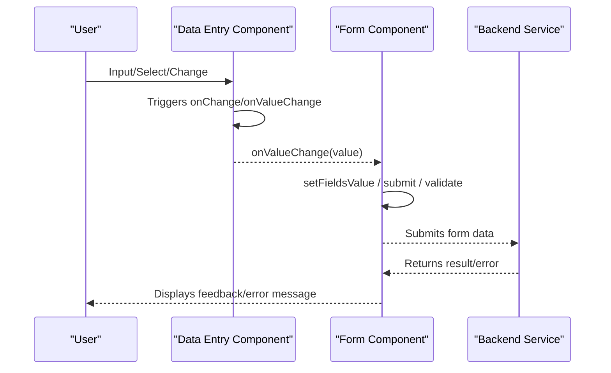
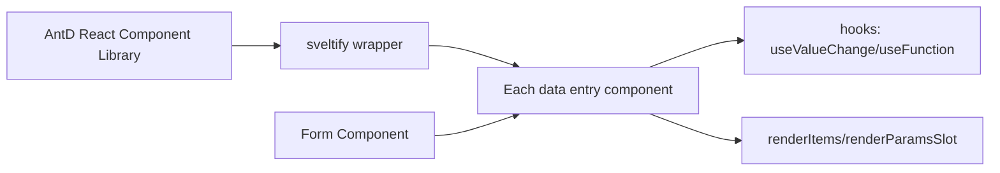

# Data Entry Components API

<cite>
**Files referenced in this document**
- [backend/modelscope_studio/components/antd/components.py](file://backend/modelscope_studio/components/antd/components.py)
- [frontend/antd/form/form.tsx](file://frontend/antd/form/form.tsx)
- [frontend/antd/auto-complete/auto-complete.tsx](file://frontend/antd/auto-complete/auto-complete.tsx)
- [frontend/antd/cascader/cascader.tsx](file://frontend/antd/cascader/cascader.tsx)
- [frontend/antd/checkbox/checkbox.tsx](file://frontend/antd/checkbox/checkbox.tsx)
- [frontend/antd/color-picker/color-picker.tsx](file://frontend/antd/color-picker/color-picker.tsx)
- [frontend/antd/date-picker/date-picker.tsx](file://frontend/antd/date-picker/date-picker.tsx)
- [frontend/antd/input/input.tsx](file://frontend/antd/input/input.tsx)
- [frontend/antd/input-number/input-number.tsx](file://frontend/antd/input-number/input-number.tsx)
- [frontend/antd/mentions/mentions.tsx](file://frontend/antd/mentions/mentions.tsx)
- [frontend/antd/radio/radio.tsx](file://frontend/antd/radio/radio.tsx)
- [frontend/antd/rate/rate.tsx](file://frontend/antd/rate/rate.tsx)
- [frontend/antd/select/select.tsx](file://frontend/antd/select/select.tsx)
- [frontend/antd/slider/slider.tsx](file://frontend/antd/slider/slider.tsx)
- [frontend/antd/switch/switch.tsx](file://frontend/antd/switch/switch.tsx)
- [frontend/antd/time-picker/time-picker.tsx](file://frontend/antd/time-picker/time-picker.tsx)
- [frontend/antd/transfer/transfer.tsx](file://frontend/antd/transfer/transfer.tsx)
- [frontend/antd/tree-select/tree-select.tsx](file://frontend/antd/tree-select/tree-select.tsx)
</cite>

## Table of Contents

1. [Introduction](#introduction)
2. [Project Structure](#project-structure)
3. [Core Components](#core-components)
4. [Architecture Overview](#architecture-overview)
5. [Component Details](#component-details)
6. [Dependency Analysis](#dependency-analysis)
7. [Performance Considerations](#performance-considerations)
8. [Troubleshooting Guide](#troubleshooting-guide)
9. [Conclusion](#conclusion)
10. [Appendix](#appendix)

## Introduction

This document is the API reference for Ant Design-based data entry components in ModelScope Studio, covering: AutoComplete, Cascader, Checkbox, ColorPicker, DatePicker, Form, Input, InputNumber, Mentions, Radio, Rate, Select, Slider, Switch, TimePicker, Transfer, TreeSelect, Upload (to be added). It includes:

- Property definitions and type constraints
- Data validation and formatting strategies
- Event callbacks and data binding mechanisms
- Standard usage example paths (using source code paths instead of inline code)
- Recommendations for interfacing with backend APIs
- Key points for user experience and performance optimization

## Project Structure

ModelScope Studio wraps Ant Design components as Svelte components, uniformly using `sveltify` to wrap the React AntD components, and providing a unified `onValueChange` callback, slot rendering, and value change hooks at the frontend layer for two-way data binding with the Python backend.

```mermaid
graph TB
subgraph "Backend Component Export"
PY["components.py<br/>Exports each AntD component"]
end
subgraph "Frontend Wrapper Layer"
F_FORM["form/form.tsx"]
F_AUTO["auto-complete/auto-complete.tsx"]
F_CASCADE["cascader/cascader.tsx"]
F_CHECK["checkbox/checkbox.tsx"]
F_COLOR["color-picker/color-picker.tsx"]
F_DATE["date-picker/date-picker.tsx"]
F_INPUT["input/input.tsx"]
F_NUM["input-number/input-number.tsx"]
F_MENTIONS["mentions/mentions.tsx"]
F_RADIO["radio/radio.tsx"]
F_RATE["rate/rate.tsx"]
F_SELECT["select/select.tsx"]
F_SLIDER["slider/slider.tsx"]
F_SWITCH["switch/switch.tsx"]
F_TIME["time-picker/time-picker.tsx"]
F_TRANS["transfer/transfer.tsx"]
F_TSELECT["tree-select/tree-select.tsx"]
end
PY --> F_FORM
PY --> F_AUTO
PY --> F_CASCADE
PY --> F_CHECK
PY --> F_COLOR
PY --> F_DATE
PY --> F_INPUT
PY --> F_NUM
PY --> F_MENTIONS
PY --> F_RADIO
PY --> F_RATE
PY --> F_SELECT
PY --> F_SLIDER
PY --> F_SWITCH
PY --> F_TIME
PY --> F_TRANS
PY --> F_TSELECT
```

Diagram sources

- [backend/modelscope_studio/components/antd/components.py:1-145](file://backend/modelscope_studio/components/antd/components.py#L1-L145)
- [frontend/antd/form/form.tsx:1-79](file://frontend/antd/form/form.tsx#L1-L79)
- [frontend/antd/auto-complete/auto-complete.tsx:1-151](file://frontend/antd/auto-complete/auto-complete.tsx#L1-L151)
- [frontend/antd/cascader/cascader.tsx:1-207](file://frontend/antd/cascader/cascader.tsx#L1-L207)
- [frontend/antd/checkbox/checkbox.tsx:1-22](file://frontend/antd/checkbox/checkbox.tsx#L1-L22)
- [frontend/antd/color-picker/color-picker.tsx:1-106](file://frontend/antd/color-picker/color-picker.tsx#L1-L106)
- [frontend/antd/date-picker/date-picker.tsx:1-234](file://frontend/antd/date-picker/date-picker.tsx#L1-L234)
- [frontend/antd/input/input.tsx:1-119](file://frontend/antd/input/input.tsx#L1-L119)
- [frontend/antd/input-number/input-number.tsx:1-92](file://frontend/antd/input-number/input-number.tsx#L1-L92)
- [frontend/antd/mentions/mentions.tsx:1-80](file://frontend/antd/mentions/mentions.tsx#L1-L80)
- [frontend/antd/radio/radio.tsx:1-32](file://frontend/antd/radio/radio.tsx#L1-L32)
- [frontend/antd/rate/rate.tsx:1-45](file://frontend/antd/rate/rate.tsx#L1-L45)
- [frontend/antd/select/select.tsx:1-181](file://frontend/antd/select/select.tsx#L1-L181)
- [frontend/antd/slider/slider.tsx:1-97](file://frontend/antd/slider/slider.tsx#L1-L97)
- [frontend/antd/switch/switch.tsx:1-42](file://frontend/antd/switch/switch.tsx#L1-L42)
- [frontend/antd/time-picker/time-picker.tsx:1-201](file://frontend/antd/time-picker/time-picker.tsx#L1-L201)
- [frontend/antd/transfer/transfer.tsx:1-112](file://frontend/antd/transfer/transfer.tsx#L1-L112)
- [frontend/antd/tree-select/tree-select.tsx:1-163](file://frontend/antd/tree-select/tree-select.tsx#L1-L163)

Section sources

- [backend/modelscope_studio/components/antd/components.py:1-145](file://backend/modelscope_studio/components/antd/components.py#L1-L145)

## Core Components

This section provides an overview of the common patterns and key interfaces for all data entry components:

- **Value binding**: All support `value` and `onValueChange` for controlled/uncontrolled switching and two-way binding.
- **Slot system**: Many components support `slots` (e.g., `allowClear.clearIcon`, `prefix`, `suffix`, `popupRender`, etc.) for custom rendering.
- **Functional props**: Some props support function values (e.g., `formatter`, `parser`, `disabledDate`, etc.), wrapped via `useFunction`.
- **Options/tree data**: Select, Cascader, TreeSelect, AutoComplete, Mentions, etc. support rendering items via `children` or `options`/`treeData`.
- **Form integration**: Form provides global form state management, reset, submit, validate actions, and `requiredMark`/`feedbackIcons` support.

Section sources

- [frontend/antd/form/form.tsx:8-76](file://frontend/antd/form/form.tsx#L8-L76)
- [frontend/antd/select/select.tsx:11-178](file://frontend/antd/select/select.tsx#L11-L178)
- [frontend/antd/cascader/cascader.tsx:19-204](file://frontend/antd/cascader/cascader.tsx#L19-L204)
- [frontend/antd/tree-select/tree-select.tsx:14-161](file://frontend/antd/tree-select/tree-select.tsx#L14-L161)
- [frontend/antd/auto-complete/auto-complete.tsx:32-148](file://frontend/antd/auto-complete/auto-complete.tsx#L32-L148)
- [frontend/antd/mentions/mentions.tsx:11-77](file://frontend/antd/mentions/mentions.tsx#L11-L77)

## Architecture Overview

The following diagram shows the common call chain for data entry components: frontend components pass values upstream via the `onValueChange` callback; the Form component handles form-level actions (reset/submit/validate) and global `requiredMark`/`feedbackIcons`; some components format values internally (e.g., date/time components).

Diagram sources

- [frontend/antd/form/form.tsx:27-76](file://frontend/antd/form/form.tsx#L27-L76)
- [frontend/antd/date-picker/date-picker.tsx:162-170](file://frontend/antd/date-picker/date-picker.tsx#L162-L170)
- [frontend/antd/time-picker/time-picker.tsx:131-143](file://frontend/antd/time-picker/time-picker.tsx#L131-L143)

## Component Details

### Form

- **Responsibility**: Wraps AntD Form, providing `value`, `onValueChange`, `formAction` (reset/submit/validate), `requiredMark`, and `feedbackIcons` capabilities.
- **Key Points**:
  - Creates a form instance via `AForm.useForm`.
  - Executes reset/submit/validate when `formAction` changes.
  - Syncs upstream value via `onValuesChange` and triggers `onValueChange`.
- **Typical usage path**
  - [Form container implementation:15-76](file://frontend/antd/form/form.tsx#L15-L76)

Section sources

- [frontend/antd/form/form.tsx:8-76](file://frontend/antd/form/form.tsx#L8-L76)

### AutoComplete

- **Capabilities**: Supports options list, filtering, popup rendering, clear icon, empty placeholder, etc.
- **Key Points**:
  - Uses `useValueChange` for controlled `value`.
  - Supports slots: `allowClear.clearIcon`, `dropdownRender`, `popupRender`, `notFoundContent`.
  - Supports `filterOption` function and `getPopupContainer`.
- **Typical usage path**
  - [AutoComplete component:32-148](file://frontend/antd/auto-complete/auto-complete.tsx#L32-L148)

Section sources

- [frontend/antd/auto-complete/auto-complete.tsx:32-148](file://frontend/antd/auto-complete/auto-complete.tsx#L32-L148)

### Cascader

- **Capabilities**: Multi-level cascading selection; supports dynamic loading, search, tag rendering, and custom dropdown panel.
- **Key Points**:
  - Supports two data sources: `options` and `children`.
  - `showSearch` supports object configuration and `slots['showSearch.render']`.
  - Supports `onLoadData` for dynamic loading.
- **Typical usage path**
  - [Cascader component:19-204](file://frontend/antd/cascader/cascader.tsx#L19-L204)

Section sources

- [frontend/antd/cascader/cascader.tsx:19-204](file://frontend/antd/cascader/cascader.tsx#L19-L204)

### Checkbox

- **Capabilities**: Boolean selection; supports `onValueChange`.
- **Key Points**:
  - Forwards the native event in `onChange` and triggers `onValueChange(value)`.
- **Typical usage path**
  - [Checkbox component:4-19](file://frontend/antd/checkbox/checkbox.tsx#L4-L19)

Section sources

- [frontend/antd/checkbox/checkbox.tsx:4-19](file://frontend/antd/checkbox/checkbox.tsx#L4-L19)

### ColorPicker

- **Capabilities**: Supports solid color/gradient, preset colors, and multiple output formats (rgb/hex/hsb).
- **Key Points**:
  - `onChange` returns different format arrays or a single string depending on whether gradient mode is active.
  - Supports `presets` slot and `panelRender`/`showText` customization.
- **Typical usage path**
  - [ColorPicker component:11-103](file://frontend/antd/color-picker/color-picker.tsx#L11-L103)

Section sources

- [frontend/antd/color-picker/color-picker.tsx:11-103](file://frontend/antd/color-picker/color-picker.tsx#L11-L103)

### DatePicker

- **Capabilities**: Single-date/range selection, time selection, preset shortcuts, disabled dates/times, custom cell/panel rendering.
- **Key Points**:
  - Internally formats input values as `dayjs` and outputs second-level timestamps in `onChange`/`onPanelChange`.
  - Supports `defaultValue` formatting within the `showTime` object.
  - Supports slots: `presets`, `cellRender`, `panelRender`, `renderExtraFooter`, etc.
- **Typical usage path**
  - [DatePicker component:40-231](file://frontend/antd/date-picker/date-picker.tsx#L40-L231)

Section sources

- [frontend/antd/date-picker/date-picker.tsx:40-231](file://frontend/antd/date-picker/date-picker.tsx#L40-L231)

### Input

- **Capabilities**: Basic text input; supports prefix/suffix, character counter, clear icon, and slot extensions.
- **Key Points**:
  - `useValueChange` for controlled `value`.
  - Supports `showCount.formatter` slot and `count`-series functions.
  - Supports `addonBefore`/`addonAfter`, `prefix`/`suffix`, `allowClear.clearIcon`.
- **Typical usage path**
  - [Input component:10-116](file://frontend/antd/input/input.tsx#L10-L116)

Section sources

- [frontend/antd/input/input.tsx:10-116](file://frontend/antd/input/input.tsx#L10-L116)

### InputNumber

- **Capabilities**: Numeric input; supports custom step buttons, prefix/suffix, `formatter`/`parser`.
- **Key Points**:
  - `useValueChange` for controlled `value`.
  - Supports `controls.upIcon`/`downIcon` slots and `addonBefore`/`addonAfter`, `prefix`/`suffix`.
- **Typical usage path**
  - [InputNumber component:7-91](file://frontend/antd/input-number/input-number.tsx#L7-L91)

Section sources

- [frontend/antd/input-number/input-number.tsx:7-91](file://frontend/antd/input-number/input-number.tsx#L7-L91)

### Mentions

- **Capabilities**: `@` mention functionality; supports options list, filtering, and popup rendering.
- **Key Points**:
  - `useValueChange` for controlled `value`.
  - Supports `options`, `filterOption`, `validateSearch`, `getPopupContainer`.
- **Typical usage path**
  - [Mentions component:11-77](file://frontend/antd/mentions/mentions.tsx#L11-L77)

Section sources

- [frontend/antd/mentions/mentions.tsx:11-77](file://frontend/antd/mentions/mentions.tsx#L11-L77)

### Radio

- **Capabilities**: Single-choice selection; supports `onValueChange`.
- **Key Points**:
  - Forwards the native event in `onChange` and triggers `onValueChange(value)`.
  - Injects theme tokens to adapt to style variables.
- **Typical usage path**
  - [Radio component:6-29](file://frontend/antd/radio/radio.tsx#L6-L29)

Section sources

- [frontend/antd/radio/radio.tsx:6-29](file://frontend/antd/radio/radio.tsx#L6-L29)

### Rate

- **Capabilities**: Star rating; supports custom characters.
- **Key Points**:
  - Supports `character` slot and functional configuration.
  - `onChange` triggers `onValueChange`.
- **Typical usage path**
  - [Rate component:6-42](file://frontend/antd/rate/rate.tsx#L6-L42)

Section sources

- [frontend/antd/rate/rate.tsx:6-42](file://frontend/antd/rate/rate.tsx#L6-L42)

### Select

- **Capabilities**: Single/multi-select; supports tag rendering, custom dropdown panel, filtering and sorting.
- **Key Points**:
  - Supports two data sources: `options` and `children`.
  - Supports `allowClear.clearIcon`, `prefix`/`removeIcon`/`suffixIcon`, `notFoundContent`, `menuItemSelectedIcon`.
  - Supports `dropdownRender`/`popupRender`/`optionRender`/`tagRender`/`labelRender`.
  - Supports `filterOption`/`filterSort`.
- **Typical usage path**
  - [Select component:11-178](file://frontend/antd/select/select.tsx#L11-L178)

Section sources

- [frontend/antd/select/select.tsx:11-178](file://frontend/antd/select/select.tsx#L11-L178)

### Slider

- **Capabilities**: Single/double sliders; supports tick mark labels and tooltip formatting.
- **Key Points**:
  - `marks` are rendered via `children`, supporting a `label` child slot.
  - `tooltip` supports a `formatter` slot and function.
- **Typical usage path**
  - [Slider component:37-94](file://frontend/antd/slider/slider.tsx#L37-L94)

Section sources

- [frontend/antd/slider/slider.tsx:37-94](file://frontend/antd/slider/slider.tsx#L37-L94)

### Switch

- **Capabilities**: Boolean toggle; supports custom label slots.
- **Key Points**:
  - Supports `checkedChildren`/`unCheckedChildren` slots.
  - `onChange` triggers `onValueChange`.
- **Typical usage path**
  - [Switch component:6-39](file://frontend/antd/switch/switch.tsx#L6-L39)

Section sources

- [frontend/antd/switch/switch.tsx:6-39](file://frontend/antd/switch/switch.tsx#L6-L39)

### TimePicker

- **Capabilities**: Time selection, range selection, custom panel, disabled times.
- **Key Points**:
  - Internally formats input values as `dayjs` and outputs second-level timestamps in `onChange`/`onPanelChange`/`onCalendarChange`.
  - Supports slots: `cellRender`, `panelRender`, `renderExtraFooter`, etc.
- **Typical usage path**
  - [TimePicker component:37-198](file://frontend/antd/time-picker/time-picker.tsx#L37-L198)

Section sources

- [frontend/antd/time-picker/time-picker.tsx:37-198](file://frontend/antd/time-picker/time-picker.tsx#L37-L198)

### Transfer

- **Capabilities**: Left-right list transfer; supports titles, select-all labels, action buttons, custom rendering and filtering.
- **Key Points**:
  - `onChange` returns `targetKeys`.
  - Supports `titles`/`selectAllLabels`/`actions` slots.
  - Supports `render`/`footer`/`locale.notFoundContent`.
- **Typical usage path**
  - [Transfer component:9-110](file://frontend/antd/transfer/transfer.tsx#L9-L110)

Section sources

- [frontend/antd/transfer/transfer.tsx:9-110](file://frontend/antd/transfer/transfer.tsx#L9-L110)

### TreeSelect

- **Capabilities**: Tree-structured selection; supports dynamic loading, filtering, tag rendering, and custom dropdown panel.
- **Key Points**:
  - Supports two data sources: `treeData` and `children`.
  - Supports `dropdownRender`/`popupRender`/`tagRender`/`treeTitleRender`.
  - Supports `allowClear.clearIcon`, `prefix`/`suffix`, `switcherIcon`, `maxTagPlaceholder`, `notFoundContent`.
  - `onLoadData` is integrated via a wrapper function.
- **Typical usage path**
  - [TreeSelect component:14-161](file://frontend/antd/tree-select/tree-select.tsx#L14-L161)

Section sources

- [frontend/antd/tree-select/tree-select.tsx:14-161](file://frontend/antd/tree-select/tree-select.tsx#L14-L161)

### Upload (pending)

- The current repository does not provide a frontend wrapper implementation for Upload; API details and example paths are not available.
- It is recommended to refer to the official Ant Design Upload component and add `onValueChange` and slot support following the existing wrapper pattern.

[No file analysis for this section; no section sources]

## Dependency Analysis

- **Inter-component Coupling**: Most components are decoupled via the unified `sveltify` wrapper and hooks (`useValueChange`, `useFunction`, `renderItems`, `renderParamsSlot`).
- **External Dependencies**: Ant Design React component library, `dayjs` (date/time formatting), React Slot/Svelte Preprocess (slot system).
- **Form Integration**: The Form component centrally manages form state and actions; other components collaborate with it via `onValueChange`.

Diagram sources

- [frontend/antd/form/form.tsx:1-79](file://frontend/antd/form/form.tsx#L1-L79)
- [frontend/antd/input/input.tsx:3-42](file://frontend/antd/input/input.tsx#L3-L42)
- [frontend/antd/select/select.tsx:49-56](file://frontend/antd/select/select.tsx#L49-L56)

Section sources

- [frontend/antd/form/form.tsx:1-79](file://frontend/antd/form/form.tsx#L1-L79)
- [frontend/antd/input/input.tsx:3-42](file://frontend/antd/input/input.tsx#L3-L42)
- [frontend/antd/select/select.tsx:49-56](file://frontend/antd/select/select.tsx#L49-L56)

## Performance Considerations

- **Controlled vs. Uncontrolled**: Prefer controlled components (`value` + `onValueChange`) to avoid redundant rendering and state drift.
- **Slots and Functions**: Externalize complex slot logic as functions where possible to reduce unnecessary re-renders.
- **Option Rendering**: For Select/Cascader/TreeSelect/Mentions etc., it is recommended to pass static `options` to avoid generating new arrays on every render.
- **Date/Time**: DatePicker/TimePicker internally format `dayjs`; avoid redundant conversions in the parent component.
- **Slider and Rate**: Custom characters/labels in Rate/Slider should be kept lightweight to avoid heavy DOM structures.

[This section provides general guidance; no specific file analysis]

## Troubleshooting Guide

- **Form Action Not Working**
  - Confirm that Form's `formAction` is set to `reset`/`submit`/`validate` and reset the value after the action completes.
  - Reference path: [Form action handling:32-45](file://frontend/antd/form/form.tsx#L32-L45)
- **Value Not Updating**
  - Ensure `onValueChange` has been correctly set and triggered.
  - Reference path: [Input value change:49-54](file://frontend/antd/input/input.tsx#L49-L54)
- **Date/Time Format Abnormality**
  - DatePicker/TimePicker output second-level timestamps; ensure the backend converts them as needed.
  - Reference path: [Date formatting:26-38](file://frontend/antd/date-picker/date-picker.tsx#L26-L38)
- **Options Not Displaying or Filter Not Working**
  - Check that `options` have been passed or that `children` are rendering correctly.
  - Reference path: [Select option rendering:64-77](file://frontend/antd/select/select.tsx#L64-L77)
- **Inconsistent Color Format**
  - ColorPicker supports rgb/hex/hsb output; confirm the `value_format` configuration.
  - Reference path: [Color formatting:71-95](file://frontend/antd/color-picker/color-picker.tsx#L71-L95)

Section sources

- [frontend/antd/form/form.tsx:32-45](file://frontend/antd/form/form.tsx#L32-L45)
- [frontend/antd/input/input.tsx:49-54](file://frontend/antd/input/input.tsx#L49-L54)
- [frontend/antd/date-picker/date-picker.tsx:26-38](file://frontend/antd/date-picker/date-picker.tsx#L26-L38)
- [frontend/antd/select/select.tsx:64-77](file://frontend/antd/select/select.tsx#L64-L77)
- [frontend/antd/color-picker/color-picker.tsx:71-95](file://frontend/antd/color-picker/color-picker.tsx#L71-L95)

## Conclusion

ModelScope Studio's data entry components achieve seamless integration with Ant Design through a unified wrapper pattern, providing rich slots and functional props to meet diverse business requirements. In practice, it is recommended to follow the controlled component principle, make good use of slots and functions, pay attention to date/time and color format conversion, and use the Form component to complete the full form interaction loop.

[This section provides summary content; no specific file analysis]

## Appendix

### Component API Overview (by theme)

- **Text Input**
  - **Input**: Supports `value`, `onValueChange`, `addonBefore`/`addonAfter`, `prefix`/`suffix`, `allowClear.clearIcon`, `showCount.formatter`
    - Reference path: [Input component:10-116](file://frontend/antd/input/input.tsx#L10-L116)
  - **InputNumber**: Supports `value`, `onValueChange`, `formatter`, `parser`, `controls.upIcon`/`downIcon`, `addonBefore`/`addonAfter`, `prefix`/`suffix`
    - Reference path: [InputNumber component:7-91](file://frontend/antd/input-number/input-number.tsx#L7-L91)
  - **AutoComplete**: Supports `value`, `onValueChange`, `options`, `filterOption`, `dropdownRender`, `popupRender`, `allowClear.clearIcon`, `notFoundContent`
    - Reference path: [AutoComplete component:32-148](file://frontend/antd/auto-complete/auto-complete.tsx#L32-L148)
  - **Mentions**: Supports `value`, `onValueChange`, `options`, `filterOption`, `validateSearch`, `getPopupContainer`, `notFoundContent`
    - Reference path: [Mentions component:11-77](file://frontend/antd/mentions/mentions.tsx#L11-L77)

- **Selectors**
  - **Select**: Supports `value`, `onValueChange`, `options`, `filterOption`, `filterSort`, `allowClear.clearIcon`, `prefix`/`removeIcon`/`suffixIcon`, `notFoundContent`, `menuItemSelectedIcon`, `dropdownRender`/`popupRender`/`optionRender`/`tagRender`/`labelRender`
    - Reference path: [Select component:11-178](file://frontend/antd/select/select.tsx#L11-L178)
  - **Cascader**: Supports `value`, `onValueChange`, `options`, `showSearch`, `loadData`, `displayRender`/`tagRender`/`optionRender`, `dropdownRender`/`popupRender`, `allowClear.clearIcon`, `prefix`/`suffixIcon`, `expandIcon`, `removeIcon`, `notFoundContent`, `maxTagPlaceholder`
    - Reference path: [Cascader component:19-204](file://frontend/antd/cascader/cascader.tsx#L19-L204)
  - **TreeSelect**: Supports `value`, `onValueChange`, `treeData`, `filterTreeNode`, `loadData`, `dropdownRender`/`popupRender`/`tagRender`/`treeTitleRender`, `allowClear.clearIcon`, `prefix`/`suffix`, `switcherIcon`, `notFoundContent`, `maxTagPlaceholder`
    - Reference path: [TreeSelect component:14-161](file://frontend/antd/tree-select/tree-select.tsx#L14-L161)

- **Date and Time**
  - **DatePicker**: Supports `value`, `onChange`/`onPanelChange`, `pickerValue`/`defaultPickerValue`, `showTime`, `disabledDate`/`disabledTime`, `cellRender`/`panelRender`, `presets`, `renderExtraFooter`, `prevIcon`/`nextIcon`/`suffixIcon`/`superNextIcon`/`superPrevIcon`, `allowClear.clearIcon`
    - Reference path: [DatePicker component:40-231](file://frontend/antd/date-picker/date-picker.tsx#L40-L231)
  - **TimePicker**: Supports `value`, `onChange`/`onPanelChange`/`onCalendarChange`, `pickerValue`/`defaultPickerValue`, `disabledDate`/`disabledTime`, `cellRender`/`panelRender`, `renderExtraFooter`, `prevIcon`/`nextIcon`/`suffixIcon`/`superNextIcon`/`superPrevIcon`, `allowClear.clearIcon`
    - Reference path: [TimePicker component:37-198](file://frontend/antd/time-picker/time-picker.tsx#L37-L198)

- **Interaction and Rating**
  - **Checkbox**: Supports `value`, `onValueChange`, `onChange`
    - Reference path: [Checkbox component:4-19](file://frontend/antd/checkbox/checkbox.tsx#L4-L19)
  - **Radio**: Supports `value`, `onValueChange`, `onChange`, theme token injection
    - Reference path: [Radio component:6-29](file://frontend/antd/radio/radio.tsx#L6-L29)
  - **Rate**: Supports `value`, `onValueChange`, `onChange`, `character` slot/function
    - Reference path: [Rate component:6-42](file://frontend/antd/rate/rate.tsx#L6-L42)
  - **Switch**: Supports `value`, `onChange`, `checkedChildren`/`unCheckedChildren` slots
    - Reference path: [Switch component:6-39](file://frontend/antd/switch/switch.tsx#L6-L39)
  - **Slider**: Supports `value`, `onChange`, `marks` (children rendering), `tooltip.formatter` slot
    - Reference path: [Slider component:37-94](file://frontend/antd/slider/slider.tsx#L37-L94)

- **Color and Form**
  - **ColorPicker**: Supports `value`, `onValueChange`, `onChange`, `value_format` (rgb/hex/hsb), `presets`, `panelRender`, `showText`
    - Reference path: [ColorPicker component:11-103](file://frontend/antd/color-picker/color-picker.tsx#L11-L103)
  - **Form**: Supports `value`, `onValueChange`, `formAction` (reset/submit/validate), `requiredMark`, `feedbackIcons`
    - Reference path: [Form component:8-76](file://frontend/antd/form/form.tsx#L8-L76)

- **Transfer**
  - **Transfer**: Supports `value` (targetKeys), `onChange`, `titles`/`selectAllLabels`/`actions` slots, `render`/`footer`/`locale.notFoundContent`, `selectionsIcon`
    - Reference path: [Transfer component:9-110](file://frontend/antd/transfer/transfer.tsx#L9-L110)

[This section provides a summary overview; no specific file analysis]
