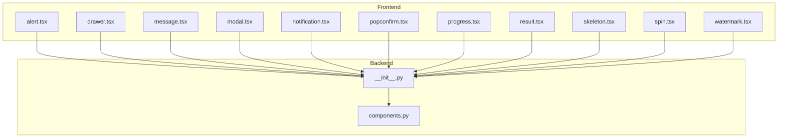
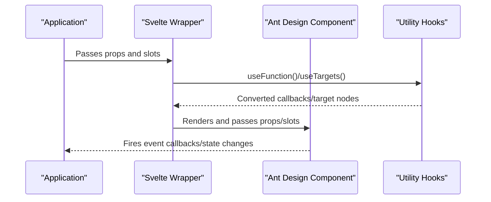
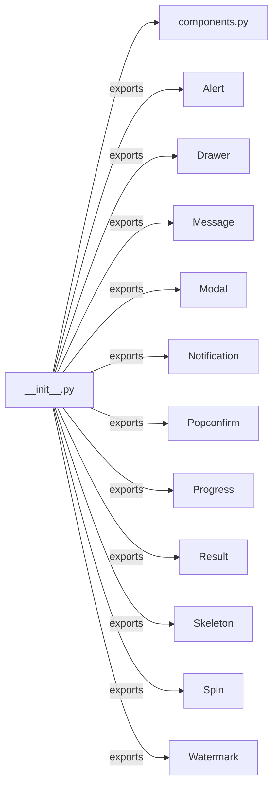

# Feedback Components API

<cite>
**Files referenced in this document**
- [frontend/antd/alert/alert.tsx](file://frontend/antd/alert/alert.tsx)
- [frontend/antd/drawer/drawer.tsx](file://frontend/antd/drawer/drawer.tsx)
- [frontend/antd/message/message.tsx](file://frontend/antd/message/message.tsx)
- [frontend/antd/modal/modal.tsx](file://frontend/antd/modal/modal.tsx)
- [frontend/antd/notification/notification.tsx](file://frontend/antd/notification/notification.tsx)
- [frontend/antd/popconfirm/popconfirm.tsx](file://frontend/antd/popconfirm/popconfirm.tsx)
- [frontend/antd/progress/progress.tsx](file://frontend/antd/progress/progress.tsx)
- [frontend/antd/result/result.tsx](file://frontend/antd/result/result.tsx)
- [frontend/antd/skeleton/skeleton.tsx](file://frontend/antd/skeleton/skeleton.tsx)
- [frontend/antd/spin/spin.tsx](file://frontend/antd/spin/spin.tsx)
- [frontend/antd/watermark/watermark.tsx](file://frontend/antd/watermark/watermark.tsx)
- [backend/modelscope_studio/components/antd/__init__.py](file://backend/modelscope_studio/components/antd/__init__.py)
- [backend/modelscope_studio/components/antd/components.py](file://backend/modelscope_studio/components/antd/components.py)
- [docs/components/antd/alert/README.md](file://docs/components/antd/alert/README.md)
- [docs/components/antd/drawer/README.md](file://docs/components/antd/drawer/README.md)
</cite>

## Table of Contents

1. [Introduction](#introduction)
2. [Project Structure](#project-structure)
3. [Core Components](#core-components)
4. [Architecture Overview](#architecture-overview)
5. [Component Details](#component-details)
6. [Dependency Analysis](#dependency-analysis)
7. [Performance Considerations](#performance-considerations)
8. [Troubleshooting Guide](#troubleshooting-guide)
9. [Conclusion](#conclusion)
10. [Appendix](#appendix)

## Introduction

This document is the API reference for Ant Design-based feedback components in ModelScope Studio, covering: Alert, Drawer, Message, Modal, Notification, Popconfirm, Progress, Result, Skeleton, Spin, and Watermark. It includes:

- Property definitions and type constraints
- State management and lifecycle
- Animation and interaction logic
- Standard instantiation and configuration example paths
- Event callbacks and asynchronous handling
- Accessibility and user experience design principles

## Project Structure

Feedback components are implemented on the frontend as Svelte wrappers that bridge Ant Design React components, and are uniformly exported via backend Python modules for on-demand use in applications.

Diagram sources

- [frontend/antd/alert/alert.tsx:1-46](file://frontend/antd/alert/alert.tsx#L1-L46)
- [frontend/antd/drawer/drawer.tsx:1-60](file://frontend/antd/drawer/drawer.tsx#L1-L60)
- [frontend/antd/message/message.tsx:1-79](file://frontend/antd/message/message.tsx#L1-L79)
- [frontend/antd/modal/modal.tsx:1-107](file://frontend/antd/modal/modal.tsx#L1-L107)
- [frontend/antd/notification/notification.tsx:1-106](file://frontend/antd/notification/notification.tsx#L1-L106)
- [frontend/antd/popconfirm/popconfirm.tsx:1-65](file://frontend/antd/popconfirm/popconfirm.tsx#L1-L65)
- [frontend/antd/progress/progress.tsx:1-24](file://frontend/antd/progress/progress.tsx#L1-L24)
- [frontend/antd/result/result.tsx:1-33](file://frontend/antd/result/result.tsx#L1-L33)
- [frontend/antd/skeleton/skeleton.tsx:1-7](file://frontend/antd/skeleton/skeleton.tsx#L1-L7)
- [frontend/antd/spin/spin.tsx:1-38](file://frontend/antd/spin/spin.tsx#L1-L38)
- [frontend/antd/watermark/watermark.tsx:1-6](file://frontend/antd/watermark/watermark.tsx#L1-L6)
- [backend/modelscope_studio/components/antd/**init**.py:1-151](file://backend/modelscope_studio/components/antd/__init__.py#L1-L151)
- [backend/modelscope_studio/components/antd/components.py:1-145](file://backend/modelscope_studio/components/antd/components.py#L1-L145)

Section sources

- [backend/modelscope_studio/components/antd/**init**.py:1-151](file://backend/modelscope_studio/components/antd/__init__.py#L1-L151)
- [backend/modelscope_studio/components/antd/components.py:1-145](file://backend/modelscope_studio/components/antd/components.py#L1-L145)

## Core Components

- **Alert**: Displays warning information requiring user attention; supports slots for `description`, `icon`, `action`, `closable.closeIcon`, etc.
- **Drawer**: A drawer panel that slides in from the screen edge; supports `title`, `footer`, `extra`, `closeIcon`, and render hooks.
- **Message**: Global hint message; supports visibility control, custom content and icons, and destroy/open operations.
- **Modal**: Modal dialog; supports `title`, `footer`, button icons, render hooks, and container mounting.
- **Notification**: Global notification alert; supports position, actions, close icon, description, and message.
- **Popconfirm**: Bubble confirmation; supports confirm/cancel text and icons, and popup container.
- **Progress**: Progress bar; supports `format` and `rounding` function handling.
- **Result**: Result page; supports `title`, `subTitle`, `icon`, and `extra` slots.
- **Skeleton**: Skeleton screen placeholder.
- **Spin**: Loading indicator; supports `tip` text and `indicator` slots.
- **Watermark**: Watermark overlay.

Section sources

- [frontend/antd/alert/alert.tsx:1-46](file://frontend/antd/alert/alert.tsx#L1-L46)
- [frontend/antd/drawer/drawer.tsx:1-60](file://frontend/antd/drawer/drawer.tsx#L1-L60)
- [frontend/antd/message/message.tsx:1-79](file://frontend/antd/message/message.tsx#L1-L79)
- [frontend/antd/modal/modal.tsx:1-107](file://frontend/antd/modal/modal.tsx#L1-L107)
- [frontend/antd/notification/notification.tsx:1-106](file://frontend/antd/notification/notification.tsx#L1-L106)
- [frontend/antd/popconfirm/popconfirm.tsx:1-65](file://frontend/antd/popconfirm/popconfirm.tsx#L1-L65)
- [frontend/antd/progress/progress.tsx:1-24](file://frontend/antd/progress/progress.tsx#L1-L24)
- [frontend/antd/result/result.tsx:1-33](file://frontend/antd/result/result.tsx#L1-L33)
- [frontend/antd/skeleton/skeleton.tsx:1-7](file://frontend/antd/skeleton/skeleton.tsx#L1-L7)
- [frontend/antd/spin/spin.tsx:1-38](file://frontend/antd/spin/spin.tsx#L1-L38)
- [frontend/antd/watermark/watermark.tsx:1-6](file://frontend/antd/watermark/watermark.tsx#L1-L6)

## Architecture Overview

Feedback components follow a layered architecture of "Svelte wrapper + Ant Design React component + unified backend export":

- **Frontend layer**: Each component wraps an Ant Design component with `sveltify`, supporting `slots` and function callback conversion.
- **Interaction layer**: Bridges callbacks and child nodes via utilities like `useFunction`/`useTargets`.
- **Export layer**: Python modules centrally export each component for unified import and aliasing in applications.

Diagram sources

- [frontend/antd/alert/alert.tsx:12-43](file://frontend/antd/alert/alert.tsx#L12-L43)
- [frontend/antd/drawer/drawer.tsx:24-57](file://frontend/antd/drawer/drawer.tsx#L24-L57)
- [frontend/antd/message/message.tsx:18-76](file://frontend/antd/message/message.tsx#L18-L76)
- [frontend/antd/modal/modal.tsx:22-104](file://frontend/antd/modal/modal.tsx#L22-L104)
- [frontend/antd/notification/notification.tsx:17-103](file://frontend/antd/notification/notification.tsx#L17-L103)

## Component Details

### Alert

- **Key Capabilities**
  - Supports slots: `message`, `description`, `icon`, `action`, `closable.closeIcon`
  - The `afterClose` callback is converted via `useFunction`
- **Lifecycle**
  - Renders based on props after mounting; fires `afterClose` upon dismissal
- **Interaction and Animation**
  - Controlled by Ant Design's built-in animation and transitions
- **Example path**
  - [docs/components/antd/alert/README.md:1-8](file://docs/components/antd/alert/README.md#L1-L8)

Section sources

- [frontend/antd/alert/alert.tsx:7-43](file://frontend/antd/alert/alert.tsx#L7-L43)

### Drawer

- **Key Capabilities**
  - Supports slots: `title`, `footer`, `extra`, `closeIcon`, `closable.closeIcon`, `drawerRender`
  - `afterOpenChange`, `getContainer`, `drawerRender` are handled via `useFunction`/`renderParamsSlot`
- **Lifecycle**
  - Fires `afterOpenChange` when open/close state changes
- **Interaction and Animation**
  - Ant Design drawer slide-in/slide-out animation
- **Example path**
  - [docs/components/antd/drawer/README.md:1-9](file://docs/components/antd/drawer/README.md#L1-L9)

Section sources

- [frontend/antd/drawer/drawer.tsx:8-57](file://frontend/antd/drawer/drawer.tsx#L8-L57)

### Message

- **Key Capabilities**
  - Obtains the API via `message.useMessage`
  - Supports `visible` to control show/hide, with `onVisible` callback
  - `content` and `icon` slots support customization
  - `getContainer` is handled functionally
- **Lifecycle**
  - Opens when `visible=true`; destroys when `visible=false` or on unmount
- **Async and Events**
  - `onClose` simultaneously triggers `onVisible(false)` and the original `onClose`
- **Example path**
  - Refer to demo examples in each component's README

Section sources

- [frontend/antd/message/message.tsx:9-76](file://frontend/antd/message/message.tsx#L9-L76)

### Modal

- **Key Capabilities**
  - Supports `okText`, `okButtonProps.icon`, `cancelText`, `cancelButtonProps.icon`, `footer`, `title`, `modalRender`, `closable.closeIcon`, `closeIcon`, etc.
  - `afterOpenChange`, `afterClose`, `getContainer`, `footer`, `modalRender` are handled via `useFunction`/`renderParamsSlot`
- **Lifecycle**
  - Fires `afterOpenChange`/`afterClose` when open/close state changes
- **Interaction and Animation**
  - Ant Design dialog open/close animation and overlay behavior

Section sources

- [frontend/antd/modal/modal.tsx:8-104](file://frontend/antd/modal/modal.tsx#L8-L104)

### Notification

- **Key Capabilities**
  - Obtains the API via `notification.useNotification`
  - Supports `visible` to control show/hide, with `onVisible` callback
  - Supports slots: `btn`, `actions`, `closeIcon`, `description`, `icon`, `message`
  - Position parameters: `top`, `bottom`, `rtl`, `stack`
- **Lifecycle**
  - Opens when `visible=true`; destroys when `visible=false` or on unmount
- **Async and Events**
  - `onClose` simultaneously triggers `onVisible(false)` and the original `onClose`

Section sources

- [frontend/antd/notification/notification.tsx:8-103](file://frontend/antd/notification/notification.tsx#L8-L103)

### Popconfirm

- **Key Capabilities**
  - Supports `okText`, `okButtonProps.icon`, `cancelText`, `cancelButtonProps.icon`, `title`, `description`
  - `afterOpenChange`, `getPopupContainer` are handled via `useFunction`
- **Lifecycle**
  - Fires `afterOpenChange` when the popup opens/closes
- **Interaction and Animation**
  - Ant Design bubble confirmation popup behavior

Section sources

- [frontend/antd/popconfirm/popconfirm.tsx:7-62](file://frontend/antd/popconfirm/popconfirm.tsx#L7-L62)

### Progress

- **Key Capabilities**
  - Supports `format` and `rounding` function handling
- **Performance and Complexity**
  - Pure display component with no complex computation

Section sources

- [frontend/antd/progress/progress.tsx:5-21](file://frontend/antd/progress/progress.tsx#L5-L21)

### Result

- **Key Capabilities**
  - Supports slots: `title`, `subTitle`, `icon`, `extra`
  - Uses `useTargets` to manage child node rendering strategy
- **Lifecycle**
  - Renders child nodes when slots are present; hides default children otherwise

Section sources

- [frontend/antd/result/result.tsx:7-30](file://frontend/antd/result/result.tsx#L7-L30)

### Skeleton

- **Key Capabilities**
  - Directly wraps Ant Design Skeleton
- **Usage Recommendations**
  - Use as a placeholder display before data loads

Section sources

- [frontend/antd/skeleton/skeleton.tsx:1-7](file://frontend/antd/skeleton/skeleton.tsx#L1-L7)

### Spin

- **Key Capabilities**
  - Supports `tip` and `indicator` slots
  - Uses `useTargets` to control child node visibility
- **Lifecycle**
  - Shows children when no slots are present; hides children and delegates rendering to Spin when slots exist

Section sources

- [frontend/antd/spin/spin.tsx:7-35](file://frontend/antd/spin/spin.tsx#L7-L35)

### Watermark

- **Key Capabilities**
  - Directly wraps Ant Design Watermark
- **Usage Recommendations**
  - Use for content protection and copyright marking

Section sources

- [frontend/antd/watermark/watermark.tsx:1-6](file://frontend/antd/watermark/watermark.tsx#L1-L6)

## Dependency Analysis

- **Unified Export**
  - Backend modules centrally export each component for unified import and alias management on the application side
- **Inter-component Coupling**
  - Components are relatively independent; collaboration primarily occurs through the Ant Design ecosystem and common utility hooks

Diagram sources

- [backend/modelscope_studio/components/antd/**init**.py:1-151](file://backend/modelscope_studio/components/antd/__init__.py#L1-L151)
- [backend/modelscope_studio/components/antd/components.py:1-145](file://backend/modelscope_studio/components/antd/components.py#L1-L145)

Section sources

- [backend/modelscope_studio/components/antd/**init**.py:1-151](file://backend/modelscope_studio/components/antd/__init__.py#L1-L151)
- [backend/modelscope_studio/components/antd/components.py:1-145](file://backend/modelscope_studio/components/antd/components.py#L1-L145)

## Performance Considerations

- **Slot and Function Conversion**
  - Use `useFunction` to bridge callback functions to the React environment, avoiding re-renders caused by redundant function creation
- **Conditional Rendering**
  - Result/Spin precisely control child node rendering via `useTargets`, reducing unnecessary DOM structures
- **Destroy and Cleanup**
  - Message/Notification actively `destroy` on unmount or when `visible=false`, preventing memory leaks and duplicate notifications

## Troubleshooting Guide

- **Slot Not Working**
  - Confirm that the slot name matches the component definition (e.g., `closable.closeIcon`, `okButtonProps.icon`, etc.)
- **Callback Not Firing**
  - Check that callbacks are wrapped via `useFunction`; ensure the function signature matches what Ant Design expects
- **Container Mounting Issues**
  - `getContainer` supports string selectors or functions; if a string is passed, it is internally converted to a function
- **Notification/Message Not Dismissing**
  - Ensure `destroy` is triggered when `visible=false` or the component unmounts; inspect the `onClose` callback chain

Section sources

- [frontend/antd/alert/alert.tsx:12-43](file://frontend/antd/alert/alert.tsx#L12-L43)
- [frontend/antd/drawer/drawer.tsx:24-57](file://frontend/antd/drawer/drawer.tsx#L24-L57)
- [frontend/antd/message/message.tsx:35-68](file://frontend/antd/message/message.tsx#L35-L68)
- [frontend/antd/notification/notification.tsx:38-95](file://frontend/antd/notification/notification.tsx#L38-L95)

## Conclusion

ModelScope Studio's feedback components achieve flexible extension of Ant Design components and a consistent usage experience through unified Svelte wrappers and utility hooks. Developers can quickly customize interaction and visual presentation via slots and functional callbacks, while simplified module management is enabled by unified backend exports. It is recommended to make appropriate use of each feedback component in real-world scenarios, combining loading strategies, visibility control, and accessibility requirements to enhance the user experience.

## Appendix

- **Examples and Demos**
  - Refer to the demo examples in each component's README for a quick start:
    - [docs/components/antd/alert/README.md:1-8](file://docs/components/antd/alert/README.md#L1-L8)
    - [docs/components/antd/drawer/README.md:1-9](file://docs/components/antd/drawer/README.md#L1-L9)
