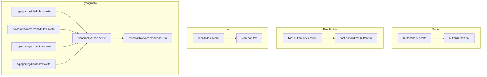
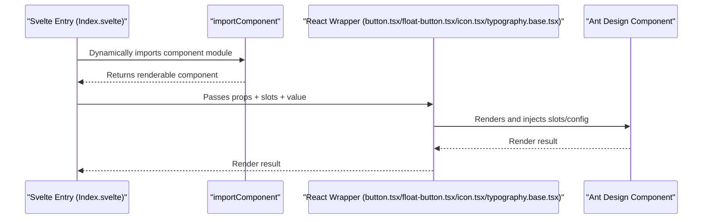
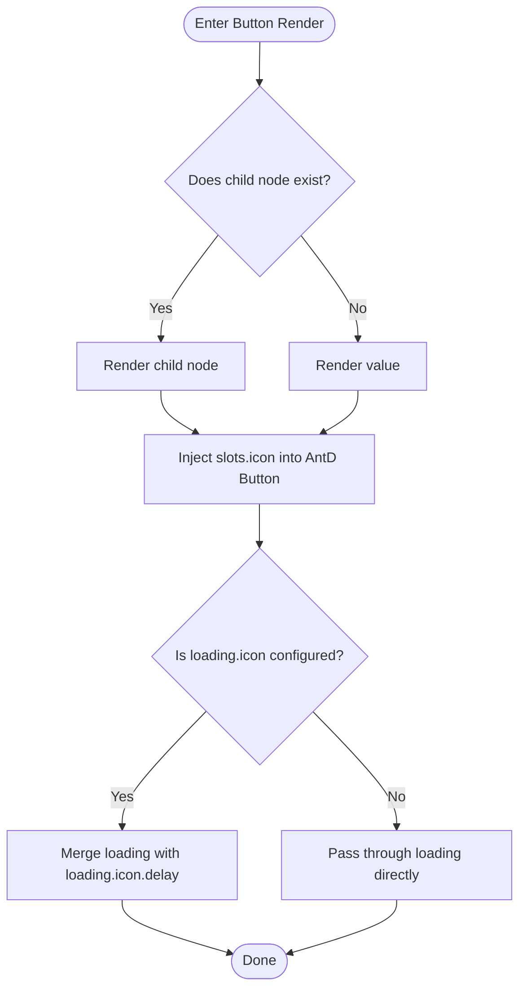
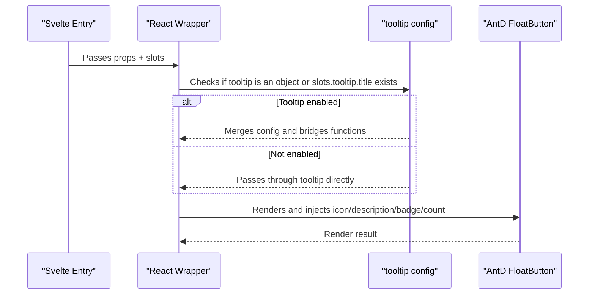
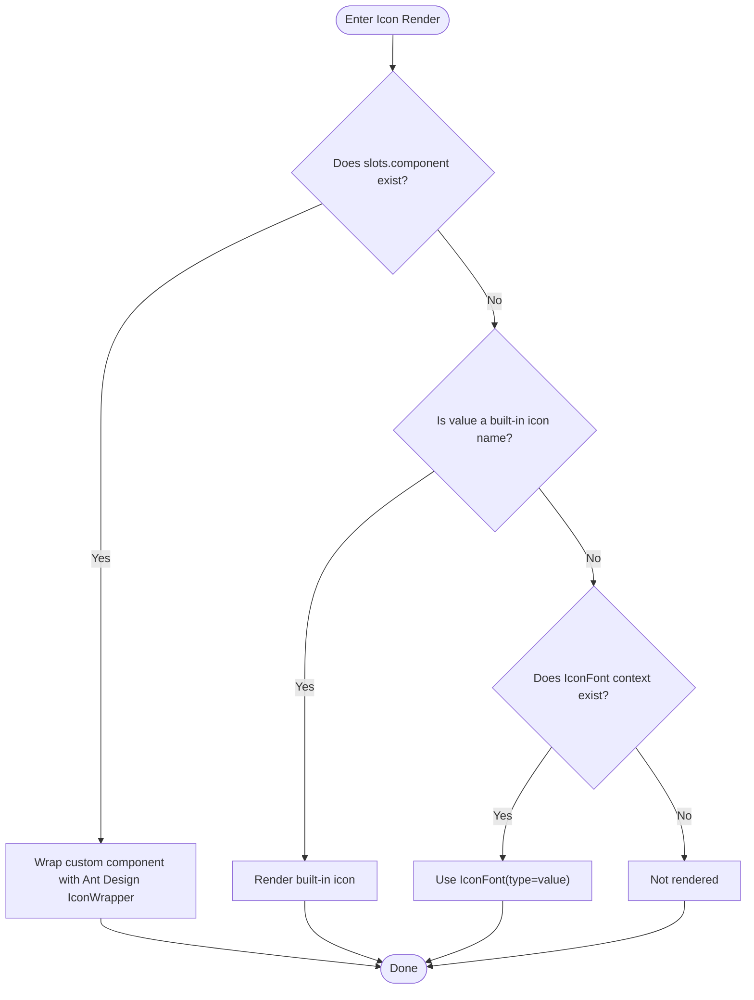
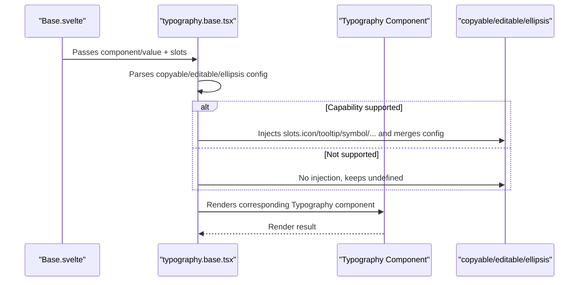
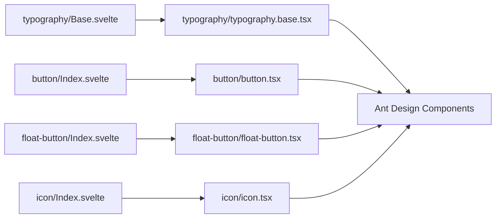

# General Components API

<cite>
**Files referenced in this document**
- [frontend/antd/button/button.tsx](file://frontend/antd/button/button.tsx)
- [frontend/antd/button/Index.svelte](file://frontend/antd/button/Index.svelte)
- [frontend/antd/float-button/float-button.tsx](file://frontend/antd/float-button/float-button.tsx)
- [frontend/antd/float-button/Index.svelte](file://frontend/antd/float-button/Index.svelte)
- [frontend/antd/icon/icon.tsx](file://frontend/antd/icon/icon.tsx)
- [frontend/antd/icon/Index.svelte](file://frontend/antd/icon/Index.svelte)
- [frontend/antd/typography/typography.base.tsx](file://frontend/antd/typography/typography.base.tsx)
- [frontend/antd/typography/Base.svelte](file://frontend/antd/typography/Base.svelte)
- [frontend/antd/typography/title/Index.svelte](file://frontend/antd/typography/title/Index.svelte)
- [frontend/antd/typography/paragraph/Index.svelte](file://frontend/antd/typography/paragraph/Index.svelte)
- [frontend/antd/typography/text/Index.svelte](file://frontend/antd/typography/text/Index.svelte)
- [frontend/antd/typography/link/Index.svelte](file://frontend/antd/typography/link/Index.svelte)
</cite>

## Table of Contents

1. [Introduction](#introduction)
2. [Project Structure](#project-structure)
3. [Core Components](#core-components)
4. [Architecture Overview](#architecture-overview)
5. [Component Details](#component-details)
6. [Dependency Analysis](#dependency-analysis)
7. [Performance Considerations](#performance-considerations)
8. [Troubleshooting Guide](#troubleshooting-guide)
9. [Conclusion](#conclusion)
10. [Appendix](#appendix)

## Introduction

This document is the API reference for general Ant Design-based components in ModelScope Studio, covering Button, FloatButton, Icon, and Typography. It includes:

- Property definitions and event handling
- Slots and style customization
- Use cases and best practices
- TypeScript types and their correspondence to native Ant Design
- Responsive design, accessibility, and performance optimization recommendations

## Project Structure

These components follow a unified "Svelte entry + React wrapper" pattern: the Svelte entry handles prop forwarding, class name composition, and visibility control; the React wrapper interfaces with Ant Design components to implement slot rendering and complex interactions.

Diagram sources

- [frontend/antd/button/Index.svelte:1-74](file://frontend/antd/button/Index.svelte#L1-L74)
- [frontend/antd/button/button.tsx:1-39](file://frontend/antd/button/button.tsx#L1-L39)
- [frontend/antd/float-button/Index.svelte:1-70](file://frontend/antd/float-button/Index.svelte#L1-L70)
- [frontend/antd/float-button/float-button.tsx:1-75](file://frontend/antd/float-button/float-button.tsx#L1-L75)
- [frontend/antd/icon/Index.svelte:1-67](file://frontend/antd/icon/Index.svelte#L1-L67)
- [frontend/antd/icon/icon.tsx:1-55](file://frontend/antd/icon/icon.tsx#L1-L55)
- [frontend/antd/typography/Base.svelte:1-85](file://frontend/antd/typography/Base.svelte#L1-L85)
- [frontend/antd/typography/typography.base.tsx:1-170](file://frontend/antd/typography/typography.base.tsx#L1-L170)
- [frontend/antd/typography/title/Index.svelte:1-12](file://frontend/antd/typography/title/Index.svelte#L1-L12)
- [frontend/antd/typography/paragraph/Index.svelte:1-12](file://frontend/antd/typography/paragraph/Index.svelte#L1-L12)
- [frontend/antd/typography/text/Index.svelte:1-12](file://frontend/antd/typography/text/Index.svelte#L1-L12)
- [frontend/antd/typography/link/Index.svelte:1-12](file://frontend/antd/typography/link/Index.svelte#L1-L12)

Section sources

- [frontend/antd/button/Index.svelte:1-74](file://frontend/antd/button/Index.svelte#L1-L74)
- [frontend/antd/float-button/Index.svelte:1-70](file://frontend/antd/float-button/Index.svelte#L1-L70)
- [frontend/antd/icon/Index.svelte:1-67](file://frontend/antd/icon/Index.svelte#L1-L67)
- [frontend/antd/typography/Base.svelte:1-85](file://frontend/antd/typography/Base.svelte#L1-L85)

## Core Components

- **Button**: Aligned with Ant Design Button; supports `icon` and `loading.icon` slots, with priority logic between `value` and child nodes.
- **FloatButton**: Aligned with Ant Design FloatButton; supports `icon`, `description`, `tooltip`, `tooltip.title`, and `badge.count` slots, with function bridging for tooltip configuration.
- **Icon**: Supports built-in Ant Design icon name mapping and IconFont; supports a custom `component` slot.
- **Typography**: A unified typography base supporting `title`, `paragraph`, `text`, and `link` variants, with slot-based configuration for `copyable`, `editable`, and `ellipsis`.

Section sources

- [frontend/antd/button/button.tsx:1-39](file://frontend/antd/button/button.tsx#L1-L39)
- [frontend/antd/float-button/float-button.tsx:1-75](file://frontend/antd/float-button/float-button.tsx#L1-L75)
- [frontend/antd/icon/icon.tsx:1-55](file://frontend/antd/icon/icon.tsx#L1-L55)
- [frontend/antd/typography/typography.base.tsx:1-170](file://frontend/antd/typography/typography.base.tsx#L1-L170)

## Architecture Overview

All components are unified through the Svelte entry, which handles:

- Prop forwarding and extra prop merging
- Visibility control and class name composition
- Slot context injection
- Lazy loading and async component rendering

The React wrapper layer handles:

- Interfacing with Ant Design components
- Mapping slots to ReactSlot
- Conditional rendering and function bridging for complex configuration objects (e.g., `tooltip`, `ellipsis`)

Diagram sources

- [frontend/antd/button/Index.svelte:10-73](file://frontend/antd/button/Index.svelte#L10-L73)
- [frontend/antd/button/button.tsx:8-36](file://frontend/antd/button/button.tsx#L8-L36)
- [frontend/antd/float-button/Index.svelte:10-69](file://frontend/antd/float-button/Index.svelte#L10-L69)
- [frontend/antd/float-button/float-button.tsx:14-72](file://frontend/antd/float-button/float-button.tsx#L14-L72)
- [frontend/antd/icon/Index.svelte:10-66](file://frontend/antd/icon/Index.svelte#L10-L66)
- [frontend/antd/icon/icon.tsx:12-52](file://frontend/antd/icon/icon.tsx#L12-L52)
- [frontend/antd/typography/Base.svelte:11-83](file://frontend/antd/typography/Base.svelte#L11-L83)
- [frontend/antd/typography/typography.base.tsx:19-167](file://frontend/antd/typography/typography.base.tsx#L19-L167)

## Component Details

### Button

- **Capability Overview**
  - Supports all Ant Design Button props and events
  - Slots: `icon`, `loading.icon`
  - Content priority: renders child nodes when present, otherwise falls back to `value`
- **Key Behaviors**
  - Injects `slots.icon` into Ant Design Button's `icon`
  - Injects `slots.loading.icon` into `loading.icon`, preserving `loading.delay` if `loading` is an object
- **Use Cases**
  - Basic buttons, buttons with icons, loading buttons
- **Examples (paths)**
  - Basic usage: [frontend/antd/button/Index.svelte:59-73](file://frontend/antd/button/Index.svelte#L59-L73)
  - Slot icons: [frontend/antd/button/button.tsx:18-30](file://frontend/antd/button/button.tsx#L18-L30)
- **Types and Native Correspondence**
  - Wraps Ant Design Button's `GetProps` type via `sveltify`, maintaining a consistent prop signature
- **Styles and Accessibility**
  - Controlled via `elem_classes`/`elem_id`/`elem_style`; accessibility provided by Ant Design
- **Performance**
  - Child node detection with conditional rendering avoids unnecessary DOM updates

Diagram sources

- [frontend/antd/button/button.tsx:11-36](file://frontend/antd/button/button.tsx#L11-L36)

Section sources

- [frontend/antd/button/button.tsx:1-39](file://frontend/antd/button/button.tsx#L1-L39)
- [frontend/antd/button/Index.svelte:1-74](file://frontend/antd/button/Index.svelte#L1-L74)

### FloatButton

- **Capability Overview**
  - Supports all Ant Design FloatButton props and events
  - Slots: `icon`, `description`, `tooltip`, `tooltip.title`, `badge.count`
  - `tooltip` supports object configuration; internally bridges `afterOpenChange`, `getPopupContainer`, and other functions via `useFunction`
- **Key Behaviors**
  - Enables tooltip configuration when `slots.tooltip` exists or `tooltip` is an object
  - Maps `slots.icon`/`description`/`badge.count` to their corresponding props
- **Use Cases**
  - Back-to-top, floating action panels, floating entry points with description and badge
- **Examples (paths)**
  - Basic usage: [frontend/antd/float-button/Index.svelte:56-69](file://frontend/antd/float-button/Index.svelte#L56-L69)
  - Slots and tooltip configuration: [frontend/antd/float-button/float-button.tsx:19-72](file://frontend/antd/float-button/float-button.tsx#L19-L72)
- **Types and Native Correspondence**
  - Wraps Ant Design FloatButton's `GetProps` type via `sveltify`, with an additional `id` field
- **Styles and Accessibility**
  - Controlled via `elem_classes`/`elem_id`/`elem_style`; accessibility provided by Ant Design
- **Performance**
  - Conditional rendering of tooltip and slots reduces unnecessary overhead

Diagram sources

- [frontend/antd/float-button/float-button.tsx:14-72](file://frontend/antd/float-button/float-button.tsx#L14-L72)
- [frontend/antd/float-button/Index.svelte:1-70](file://frontend/antd/float-button/Index.svelte#L1-L70)

Section sources

- [frontend/antd/float-button/float-button.tsx:1-75](file://frontend/antd/float-button/float-button.tsx#L1-L75)
- [frontend/antd/float-button/Index.svelte:1-70](file://frontend/antd/float-button/Index.svelte#L1-L70)

### Icon

- **Capability Overview**
  - Supports Ant Design built-in icon name mapping
  - Supports font icons provided by `IconFontProvider`
  - Slot: `component` (for custom SVG components)
- **Key Behaviors**
  - If `slots.component` is provided, renders the custom component with Ant Design `IconWrapper`
  - Otherwise, looks up the built-in icon by `value` or uses `IconFont.type`
- **Use Cases**
  - Inline text icons, button icons, custom vector icons
- **Examples (paths)**
  - Basic usage: [frontend/antd/icon/Index.svelte:52-66](file://frontend/antd/icon/Index.svelte#L52-L66)
  - Custom component and IconFont: [frontend/antd/icon/icon.tsx:12-52](file://frontend/antd/icon/icon.tsx#L12-L52)
- **Types and Native Correspondence**
  - Wraps Ant Design Icons' `GetProps` type via `sveltify`, with an additional `value` field
- **Styles and Accessibility**
  - Controlled via `elem_classes`/`elem_id`/`elem_style`; accessibility provided by Ant Design
- **Performance**
  - `useMemo` caches custom components to avoid redundant creation

Diagram sources

- [frontend/antd/icon/icon.tsx:12-52](file://frontend/antd/icon/icon.tsx#L12-L52)
- [frontend/antd/icon/Index.svelte:1-67](file://frontend/antd/icon/Index.svelte#L1-L67)

Section sources

- [frontend/antd/icon/icon.tsx:1-55](file://frontend/antd/icon/icon.tsx#L1-L55)
- [frontend/antd/icon/Index.svelte:1-67](file://frontend/antd/icon/Index.svelte#L1-L67)

### Typography

- **Capability Overview**
  - Unified base: four variants — `title`, `paragraph`, `text`, `link`
  - Supports slot-based configuration for `copyable`, `editable`, and `ellipsis`
  - Slots: `copyable.icon`, `copyable.tooltips`, `editable.icon`, `editable.tooltip`, `editable.enterIcon`, `ellipsis.symbol`, `ellipsis.tooltip`, `ellipsis.tooltip.title`
- **Key Behaviors**
  - Selects the corresponding Ant Design Typography component based on `component`
  - Conditionally injects `copyable`, `editable`, and `ellipsis` configuration
  - `ellipsis` enablement conditions differ for the `link` component
- **Use Cases**
  - Unified typography and interaction for headings, paragraphs, text, and links
- **Examples (paths)**
  - Basic usage: [frontend/antd/typography/Base.svelte:65-84](file://frontend/antd/typography/Base.svelte#L65-L84)
  - Sub-component aliases: [frontend/antd/typography/title/Index.svelte:9-11](file://frontend/antd/typography/title/Index.svelte#L9-L11)
  - Slot and config merging: [frontend/antd/typography/typography.base.tsx:19-167](file://frontend/antd/typography/typography.base.tsx#L19-L167)
- **Types and Native Correspondence**
  - Wraps multiple Ant Design Typography types via `sveltify`, with additional `component` and `value` fields
- **Styles and Accessibility**
  - Controlled via `elem_classes`/`elem_id`/`elem_style`; accessibility provided by Ant Design
- **Performance**
  - Conditional rendering with slot target collection reduces unnecessary overhead

Diagram sources

- [frontend/antd/typography/Base.svelte:11-83](file://frontend/antd/typography/Base.svelte#L11-L83)
- [frontend/antd/typography/typography.base.tsx:19-167](file://frontend/antd/typography/typography.base.tsx#L19-L167)

Section sources

- [frontend/antd/typography/typography.base.tsx:1-170](file://frontend/antd/typography/typography.base.tsx#L1-L170)
- [frontend/antd/typography/Base.svelte:1-85](file://frontend/antd/typography/Base.svelte#L1-L85)
- [frontend/antd/typography/title/Index.svelte:1-12](file://frontend/antd/typography/title/Index.svelte#L1-L12)
- [frontend/antd/typography/paragraph/Index.svelte:1-12](file://frontend/antd/typography/paragraph/Index.svelte#L1-L12)
- [frontend/antd/typography/text/Index.svelte:1-12](file://frontend/antd/typography/text/Index.svelte#L1-L12)
- [frontend/antd/typography/link/Index.svelte:1-12](file://frontend/antd/typography/link/Index.svelte#L1-L12)

## Dependency Analysis

- **Inter-component Coupling**
  - The four Typography sub-components are merely aliases for Base, reducing duplication and coupling
  - Button/FloatButton/Icon separate entry from implementation for ease of maintenance and extension
- **External Dependencies**
  - Ant Design component library (Button, FloatButton, Typography, Icon, etc.)
  - `@svelte-preprocess-react` (sveltify, ReactSlot, useFunction, etc.)
  - Utility functions: `useTargets`, `useSlotsChildren`, `omitUndefinedProps`, `renderParamsSlot`, etc.
- **Potential Circular Dependencies**
  - No direct circular dependencies found; all components follow a unidirectional dependency: entry → implementation → Ant Design

Diagram sources

- [frontend/antd/button/Index.svelte:1-74](file://frontend/antd/button/Index.svelte#L1-L74)
- [frontend/antd/button/button.tsx:1-39](file://frontend/antd/button/button.tsx#L1-L39)
- [frontend/antd/float-button/Index.svelte:1-70](file://frontend/antd/float-button/Index.svelte#L1-L70)
- [frontend/antd/float-button/float-button.tsx:1-75](file://frontend/antd/float-button/float-button.tsx#L1-L75)
- [frontend/antd/icon/Index.svelte:1-67](file://frontend/antd/icon/Index.svelte#L1-L67)
- [frontend/antd/icon/icon.tsx:1-55](file://frontend/antd/icon/icon.tsx#L1-L55)
- [frontend/antd/typography/Base.svelte:1-85](file://frontend/antd/typography/Base.svelte#L1-L85)
- [frontend/antd/typography/typography.base.tsx:1-170](file://frontend/antd/typography/typography.base.tsx#L1-L170)

Section sources

- [frontend/antd/button/Index.svelte:1-74](file://frontend/antd/button/Index.svelte#L1-L74)
- [frontend/antd/float-button/Index.svelte:1-70](file://frontend/antd/float-button/Index.svelte#L1-L70)
- [frontend/antd/icon/Index.svelte:1-67](file://frontend/antd/icon/Index.svelte#L1-L67)
- [frontend/antd/typography/Base.svelte:1-85](file://frontend/antd/typography/Base.svelte#L1-L85)

## Performance Considerations

- **On-demand Rendering**
  - Conditional checks and slot detection inject configuration and slots only when needed, reducing rendering cost
- **Function Bridging**
  - Callbacks in configurations like `tooltip` are bridged via `useFunction`, avoiding new function creation on every render
- **Computed Caching**
  - `Icon` uses `useMemo` to cache custom components, avoiding redundant creation
- **Async Loading**
  - Lazy loading via `importComponent` reduces initial page load pressure

## Troubleshooting Guide

- **Slot Not Working**
  - Verify that the slot name matches the component's supported list (e.g., Button: `icon`, `loading.icon`; FloatButton: `icon`/`description`/`tooltip`/`badge.count`; Typography: `copyable.*`, `editable.*`, `ellipsis.*`)
- **Tooltip Callback Not Working**
  - When `tooltip` is an object, ensure related callbacks have been bridged via `useFunction`
- **Custom Icon Not Displayed**
  - Ensure `value` is a valid icon name or that the IconFont context is available
- **`ellipsis` Not Working on `link`**
  - Ensure `ellipsis` configuration is present or the slot has been provided
- **Visibility Issues**
  - Ensure the `visible` prop is correctly passed to the entry component

Section sources

- [frontend/antd/button/button.tsx:11-36](file://frontend/antd/button/button.tsx#L11-L36)
- [frontend/antd/float-button/float-button.tsx:19-72](file://frontend/antd/float-button/float-button.tsx#L19-L72)
- [frontend/antd/icon/icon.tsx:12-52](file://frontend/antd/icon/icon.tsx#L12-L52)
- [frontend/antd/typography/typography.base.tsx:19-167](file://frontend/antd/typography/typography.base.tsx#L19-L167)
- [frontend/antd/button/Index.svelte:59-73](file://frontend/antd/button/Index.svelte#L59-L73)
- [frontend/antd/float-button/Index.svelte:56-69](file://frontend/antd/float-button/Index.svelte#L56-L69)
- [frontend/antd/icon/Index.svelte:52-66](file://frontend/antd/icon/Index.svelte#L52-L66)
- [frontend/antd/typography/Base.svelte:65-84](file://frontend/antd/typography/Base.svelte#L65-L84)

## Conclusion

The above components implement deep alignment with and flexible extension of Ant Design through a unified Svelte + React wrapper pattern. Using the slot system and utility functions, developers can achieve rich interaction and style customization while maintaining type safety. It is recommended to follow the prop and slot conventions documented here, combined with the performance and accessibility recommendations, to achieve a more stable and maintainable user experience.

## Appendix

- **Props and Slots Summary**
  - **Button**
    - Props: inherits all Ant Design Button props
    - Slots: `icon`, `loading.icon`
  - **FloatButton**
    - Props: inherits all Ant Design FloatButton props
    - Slots: `icon`, `description`, `tooltip`, `tooltip.title`, `badge.count`
  - **Icon**
    - Props: `value` (string), inherits all Ant Design Icon props
    - Slots: `component` (custom SVG component)
  - **Typography**
    - Props: `component` (`'title'|'paragraph'|'text'|'link'`), `value` (string)
    - Slots: `copyable.icon`, `copyable.tooltips`; `editable.icon`, `editable.tooltip`, `editable.enterIcon`; `ellipsis.symbol`, `ellipsis.tooltip`, `ellipsis.tooltip.title`
