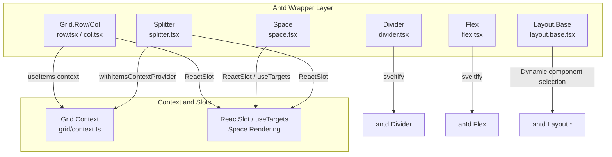
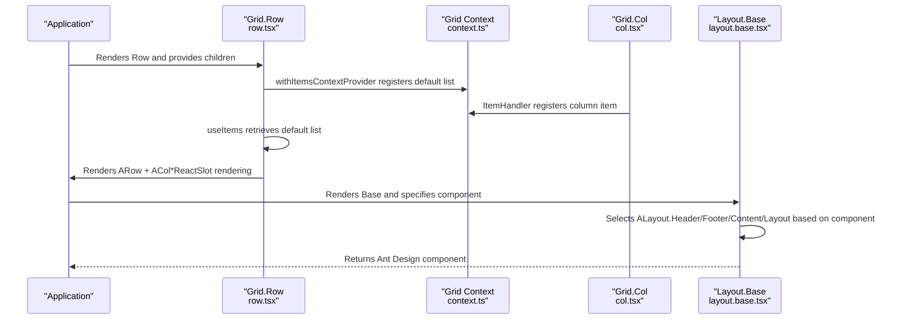
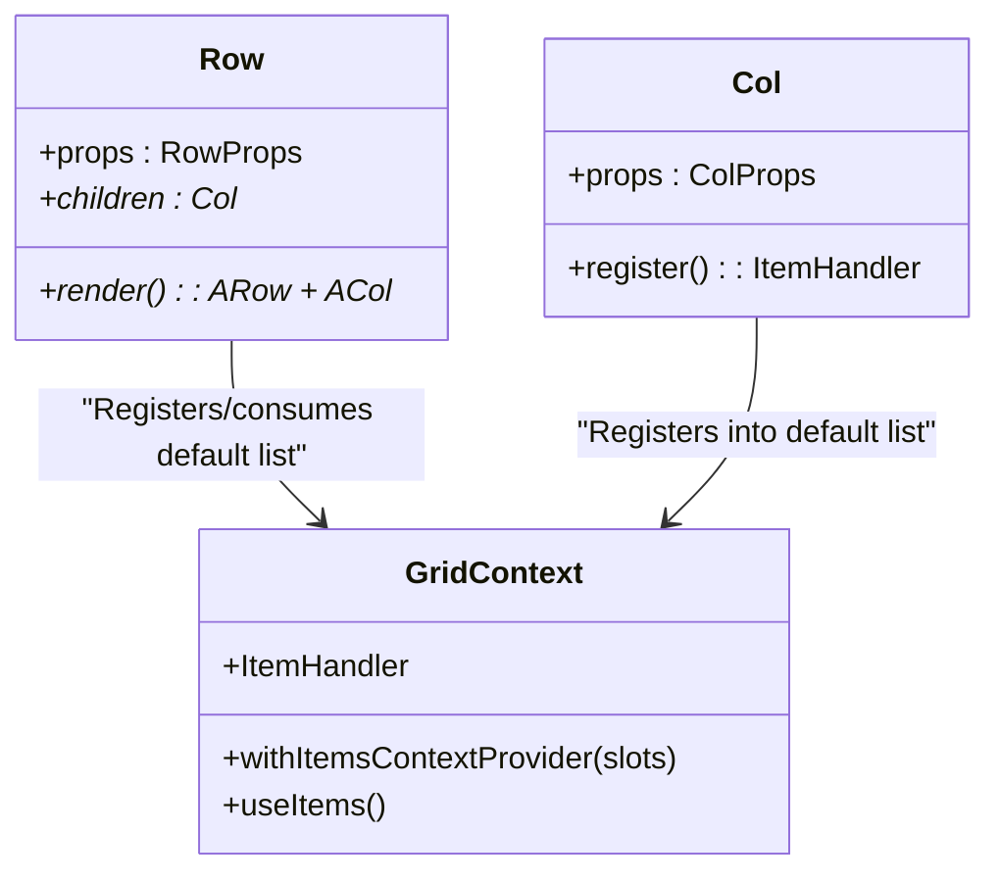
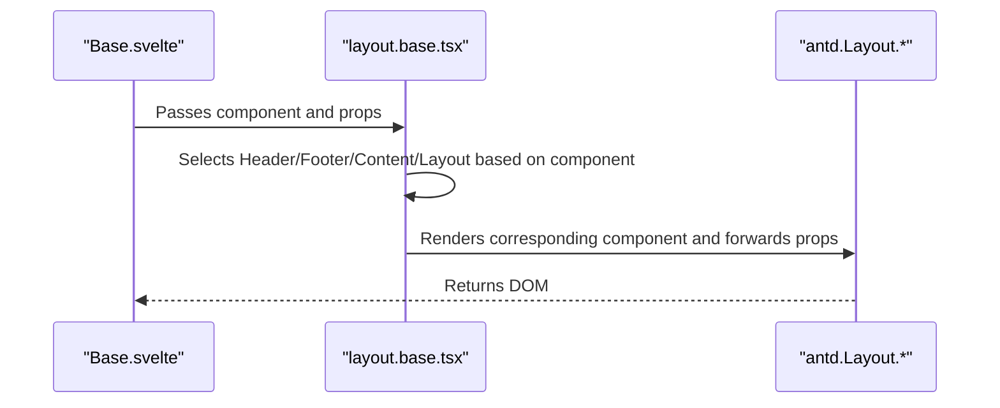
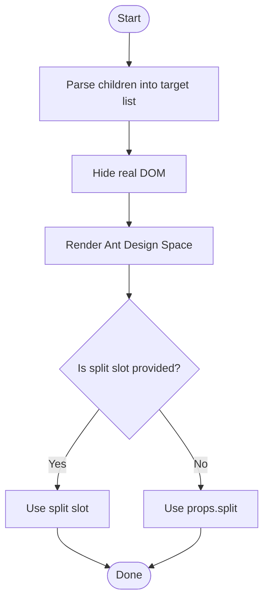
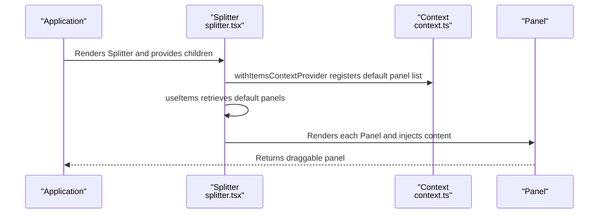
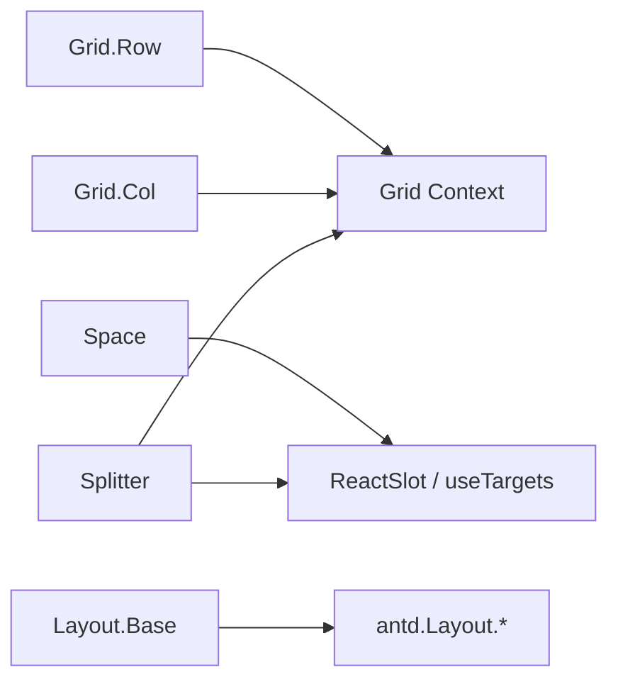

# Layout Components API

<cite>
**Files referenced in this document**
- [divider.tsx](file://frontend/antd/divider/divider.tsx)
- [flex.tsx](file://frontend/antd/flex/flex.tsx)
- [grid/context.ts](file://frontend/antd/grid/context.ts)
- [grid/row/row.tsx](file://frontend/antd/grid/row/row.tsx)
- [grid/col/col.tsx](file://frontend/antd/grid/col/col.tsx)
- [layout/layout.base.tsx](file://frontend/antd/layout/layout.base.tsx)
- [layout/Base.svelte](file://frontend/antd/layout/Base.svelte)
- [layout.sider/layout.sider.tsx](file://frontend/antd/layout/sider/layout.sider.tsx)
- [space/space.tsx](file://frontend/antd/space/space.tsx)
- [splitter/splitter.tsx](file://frontend/antd/splitter/splitter.tsx)
</cite>

## Table of Contents

1. [Introduction](#introduction)
2. [Project Structure](#project-structure)
3. [Core Components](#core-components)
4. [Architecture Overview](#architecture-overview)
5. [Component Details](#component-details)
6. [Dependency Analysis](#dependency-analysis)
7. [Performance Considerations](#performance-considerations)
8. [Troubleshooting Guide](#troubleshooting-guide)
9. [Conclusion](#conclusion)
10. [Appendix](#appendix)

## Introduction

This document is the API reference for Ant Design-based layout components in ModelScope Studio, covering Divider, Flex, Grid (Row/Col), Layout (Header/Footer/Sider/Content), Space, and Splitter. It includes:

- Property definitions and type sources for each component
- Layout algorithms and nesting rules
- Responsive behavior and key points of size calculation
- Correspondence with CSS Grid/Flexbox
- Standard usage paths and best practices
- Performance optimization and mobile adaptation recommendations

## Project Structure

These layout components expose Ant Design's React components as Svelte components through a unified Svelte preprocessing bridge. The core patterns are:

- Using `sveltify` to wrap Ant Design components as Svelte components
- Collecting and rendering child items via context and Slot mechanisms
- Dynamically selecting specific Ant Design sub-components (e.g., Header/Footer/Content/Layout) via a Base component as needed

Diagram sources

- [divider.tsx:1-15](file://frontend/antd/divider/divider.tsx#L1-L15)
- [flex.tsx:1-11](file://frontend/antd/flex/flex.tsx#L1-L11)
- [grid/context.ts:1-7](file://frontend/antd/grid/context.ts#L1-L7)
- [grid/row/row.tsx:1-34](file://frontend/antd/grid/row/row.tsx#L1-L34)
- [grid/col/col.tsx:1-14](file://frontend/antd/grid/col/col.tsx#L1-L14)
- [layout/layout.base.tsx:1-40](file://frontend/antd/layout/layout.base.tsx#L1-L40)
- [space/space.tsx:1-29](file://frontend/antd/space/space.tsx#L1-L29)
- [splitter/splitter.tsx:1-38](file://frontend/antd/splitter/splitter.tsx#L1-L38)

Section sources

- [divider.tsx:1-15](file://frontend/antd/divider/divider.tsx#L1-L15)
- [flex.tsx:1-11](file://frontend/antd/flex/flex.tsx#L1-L11)
- [grid/context.ts:1-7](file://frontend/antd/grid/context.ts#L1-L7)
- [grid/row/row.tsx:1-34](file://frontend/antd/grid/row/row.tsx#L1-L34)
- [grid/col/col.tsx:1-14](file://frontend/antd/grid/col/col.tsx#L1-L14)
- [layout/layout.base.tsx:1-40](file://frontend/antd/layout/layout.base.tsx#L1-L40)
- [space/space.tsx:1-29](file://frontend/antd/space/space.tsx#L1-L29)
- [splitter/splitter.tsx:1-38](file://frontend/antd/splitter/splitter.tsx#L1-L38)

## Core Components

- **Divider**: A dividing line supporting child nodes as custom content or empty content.
- **Flex**: A flexbox layout container that forwards all Ant Design Flex props.
- **Grid**: A Row/Col combination implementing a grid system; Col registers itself to Row via context.
- **Layout**: The Base component dynamically maps to Header/Footer/Content/Layout based on the `component` prop.
- **Space**: Enhances slot rendering and separator slots on top of Ant Design Space.
- **Splitter**: A split-panel container that collects Panel children via context and renders them.

Section sources

- [divider.tsx:1-15](file://frontend/antd/divider/divider.tsx#L1-L15)
- [flex.tsx:1-11](file://frontend/antd/flex/flex.tsx#L1-L11)
- [grid/context.ts:1-7](file://frontend/antd/grid/context.ts#L1-L7)
- [grid/row/row.tsx:1-34](file://frontend/antd/grid/row/row.tsx#L1-L34)
- [grid/col/col.tsx:1-14](file://frontend/antd/grid/col/col.tsx#L1-L14)
- [layout/layout.base.tsx:1-40](file://frontend/antd/layout/layout.base.tsx#L1-L40)
- [space/space.tsx:1-29](file://frontend/antd/space/space.tsx#L1-L29)
- [splitter/splitter.tsx:1-38](file://frontend/antd/splitter/splitter.tsx#L1-L38)

## Architecture Overview

The following diagram shows how layout components organize child items through context and Slot mechanisms, ultimately rendering as an Ant Design component tree.

Diagram sources

- [grid/row/row.tsx:7-31](file://frontend/antd/grid/row/row.tsx#L7-L31)
- [grid/context.ts:1-7](file://frontend/antd/grid/context.ts#L1-L7)
- [grid/col/col.tsx:7-11](file://frontend/antd/grid/col/col.tsx#L7-L11)
- [layout/layout.base.tsx:13-37](file://frontend/antd/layout/layout.base.tsx#L13-L37)

## Component Details

### Divider

- **Function**: Provides horizontal or vertical dividing lines, with optional custom child nodes (e.g., icons, text).
- **Key Points**:
  - When child nodes are present, they are passed to Ant Design Divider; otherwise, an empty divider is rendered.
  - Types come from Ant Design Divider Props.
- **Typical usage path**
  - [divider.tsx:5-12](file://frontend/antd/divider/divider.tsx#L5-L12)

Section sources

- [divider.tsx:1-15](file://frontend/antd/divider/divider.tsx#L1-L15)

### Flex

- **Function**: An Ant Design Flex container supporting main-axis/cross-axis alignment, wrapping, and other layout props.
- **Key Points**:
  - Directly forwards all Ant Design Flex Props.
  - Suitable for complex flexbox layout scenarios.
- **Typical usage path**
  - [flex.tsx:4-8](file://frontend/antd/flex/flex.tsx#L4-L8)

Section sources

- [flex.tsx:1-11](file://frontend/antd/flex/flex.tsx#L1-L11)

### Grid

- **Row/Col Combination**
  - **Row**: Collects Col children via context, renders as Ant Design Row, and renders Col content via Slot.
  - **Col**: Registers itself into Row's context via `ItemHandler`.
- **Context**
  - Provides `withItemsContextProvider`, `useItems`, and `ItemHandler` for collecting and distributing child items.
- **Responsive and Nesting**
  - Supports responsive breakpoint props (controlled by Ant Design Row/Col Props); Col can be nested within Row.
- **Typical usage paths**
  - [grid/row/row.tsx:7-31](file://frontend/antd/grid/row/row.tsx#L7-L31)
  - [grid/col/col.tsx:7-11](file://frontend/antd/grid/col/col.tsx#L7-L11)
  - [grid/context.ts:3-4](file://frontend/antd/grid/context.ts#L3-L4)

Diagram sources

- [grid/context.ts:3-4](file://frontend/antd/grid/context.ts#L3-L4)
- [grid/row/row.tsx:7-31](file://frontend/antd/grid/row/row.tsx#L7-L31)
- [grid/col/col.tsx:7-11](file://frontend/antd/grid/col/col.tsx#L7-L11)

Section sources

- [grid/row/row.tsx:1-34](file://frontend/antd/grid/row/row.tsx#L1-L34)
- [grid/col/col.tsx:1-14](file://frontend/antd/grid/col/col.tsx#L1-L14)
- [grid/context.ts:1-7](file://frontend/antd/grid/context.ts#L1-L7)

### Layout

- **Base Component**
  - Dynamically maps to Header/Footer/Content/Layout based on the `component` prop.
  - Supports extra class names and style forwarding.
- **Sider Sub-component**
  - Exported via a separate file; used with Layout to implement sidebars.
- **Typical usage paths**
  - [layout/layout.base.tsx:13-37](file://frontend/antd/layout/layout.base.tsx#L13-L37)
  - [layout/Base.svelte:53-67](file://frontend/antd/layout/Base.svelte#L53-L67)
  - [layout.sider/layout.sider.tsx](file://frontend/antd/layout/sider/layout.sider.tsx)

Diagram sources

- [layout/Base.svelte:53-67](file://frontend/antd/layout/Base.svelte#L53-L67)
- [layout/layout.base.tsx:13-37](file://frontend/antd/layout/layout.base.tsx#L13-L37)

Section sources

- [layout/layout.base.tsx:1-40](file://frontend/antd/layout/layout.base.tsx#L1-L40)
- [layout/Base.svelte:1-71](file://frontend/antd/layout/Base.svelte#L1-L71)
- [layout.sider/layout.sider.tsx](file://frontend/antd/layout/sider/layout.sider.tsx)

### Space

- **Function**: Inserts spacing between elements, supporting a custom separator slot.
- **Key Points**:
  - Uses `useTargets` to parse children, hides the real DOM, and renders via Ant Design Space.
  - Supports a `split` slot for custom separators.
- **Typical usage path**
  - [space/space.tsx:7-26](file://frontend/antd/space/space.tsx#L7-L26)

Diagram sources

- [space/space.tsx:8-26](file://frontend/antd/space/space.tsx#L8-L26)

Section sources

- [space/space.tsx:1-29](file://frontend/antd/space/space.tsx#L1-L29)

### Splitter

- **Function**: Splits an area into multiple panels with draggable size adjustment.
- **Key Points**:
  - Collects Panel children from the default slot via `withItemsContextProvider`.
  - Uses `ReactSlot` to render each Panel's content.
- **Typical usage path**
  - [splitter/splitter.tsx:7-35](file://frontend/antd/splitter/splitter.tsx#L7-L35)

Diagram sources

- [splitter/splitter.tsx:7-35](file://frontend/antd/splitter/splitter.tsx#L7-L35)
- [grid/context.ts:3-4](file://frontend/antd/grid/context.ts#L3-L4)

Section sources

- [splitter/splitter.tsx:1-38](file://frontend/antd/splitter/splitter.tsx#L1-L38)
- [grid/context.ts:1-7](file://frontend/antd/grid/context.ts#L1-L7)

## Dependency Analysis

- **Inter-component Coupling**
  - Grid.Row/Col depends on Grid context for child item collection and distribution.
  - Space/Splitter depends on the common Slot mechanism and target resolution utilities.
  - Layout.Base implements multi-form layouts through dynamic component selection.
- **External Dependencies**
  - Ant Design component library (Divider, Flex, Grid, Layout, Space, Splitter).
  - Svelte preprocessing toolchain (sveltify, ReactSlot, useTargets).
  - Style utilities (classnames) for conditional class name composition.

Diagram sources

- [grid/row/row.tsx:7-31](file://frontend/antd/grid/row/row.tsx#L7-L31)
- [grid/col/col.tsx:7-11](file://frontend/antd/grid/col/col.tsx#L7-L11)
- [grid/context.ts:3-4](file://frontend/antd/grid/context.ts#L3-L4)
- [space/space.tsx:8-26](file://frontend/antd/space/space.tsx#L8-L26)
- [splitter/splitter.tsx:7-35](file://frontend/antd/splitter/splitter.tsx#L7-L35)
- [layout/layout.base.tsx:13-37](file://frontend/antd/layout/layout.base.tsx#L13-L37)

Section sources

- [grid/row/row.tsx:1-34](file://frontend/antd/grid/row/row.tsx#L1-L34)
- [grid/col/col.tsx:1-14](file://frontend/antd/grid/col/col.tsx#L1-L14)
- [grid/context.ts:1-7](file://frontend/antd/grid/context.ts#L1-L7)
- [space/space.tsx:1-29](file://frontend/antd/space/space.tsx#L1-L29)
- [splitter/splitter.tsx:1-38](file://frontend/antd/splitter/splitter.tsx#L1-L38)
- [layout/layout.base.tsx:1-40](file://frontend/antd/layout/layout.base.tsx#L1-L40)

## Performance Considerations

- **Virtualization and Lazy Loading**
  - For Grid/Space/Splitter with long lists or many children, prefer virtualization or pagination strategies to reduce upfront rendering overhead.
- **Slot Rendering Optimization**
  - Space hides the real DOM and only renders Ant Design Space, avoiding redundant rendering and style jitter.
- **Conditional Rendering**
  - Layout.Base dynamically selects components based on `component`, avoiding unnecessary DOM structure.
- **Responsive Breakpoints**
  - Grid uses Ant Design breakpoint params; set responsive thresholds appropriately to avoid frequent reflows.
- **Mobile Adaptation**
  - On small screens, prefer Flex or Space's compact mode to reduce overflow issues from fixed-width layouts.
  - For Splitter on mobile, it is recommended to limit minimum panel size and disable dragging to improve interaction stability.

## Troubleshooting Guide

- **Grid Children Not Displayed**
  - Check that Row correctly wraps Col and that Col has registered to the context via `ItemHandler`.
  - Confirm that Row's children include Col and that Col's `el` is valid.
- **Space Separator Not Working**
  - Confirm that the `split` slot or `props.split` has been provided, and that the slot content can be correctly rendered by ReactSlot.
- **Splitter Panel Empty**
  - Confirm that Panel has been registered in the default slot and that Panel's `el` is valid.
- **Layout Style Abnormalities**
  - Check that the `component` passed to the Base component matches expectations, and confirm that the class name composition logic has not been overridden.

Section sources

- [grid/row/row.tsx:12-29](file://frontend/antd/grid/row/row.tsx#L12-L29)
- [grid/col/col.tsx:7-11](file://frontend/antd/grid/col/col.tsx#L7-L11)
- [space/space.tsx:13-22](file://frontend/antd/space/space.tsx#L13-L22)
- [splitter/splitter.tsx:9-31](file://frontend/antd/splitter/splitter.tsx#L9-L31)
- [layout/layout.base.tsx:31-35](file://frontend/antd/layout/layout.base.tsx#L31-L35)

## Conclusion

ModelScope Studio's layout components present Ant Design's layout capabilities in a more ergonomic way through a unified Svelte preprocessing bridge. Grid, Layout, Space, Splitter, and other components maintain consistency with the Ant Design API while enhancing slot and context capabilities, making them suitable for composing and reusing complex layout scenarios. Following the property definitions, nesting rules, and performance recommendations in this document will deliver a stable and efficient layout experience on both desktop and mobile.

## Appendix

- **Correspondence with CSS Grid/Flexbox**
  - Grid.Row/Col corresponds to row/column division in CSS Grid; Flex corresponds to CSS Flexbox.
  - Space corresponds to flex gap distribution; Splitter corresponds to draggable area partitioning.
- **Common Layout Scenarios**
  - **Grid system**: Row + Col combination, controlling column width and wrapping by breakpoint.
  - **Flexbox layout**: Flex container with multiple children, controlling main-axis and cross-axis alignment.
  - **Split panels**: Splitter with multiple Panels, supporting draggable size adjustment.
  - **Page layout**: Layout.Base selecting Header/Footer/Content/Sider combinations as needed.
