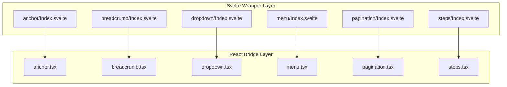
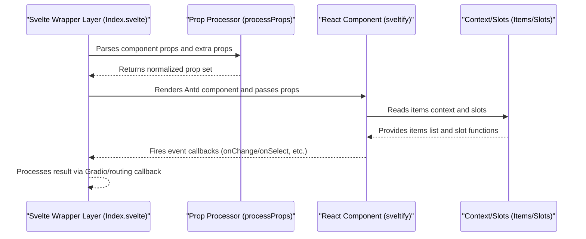
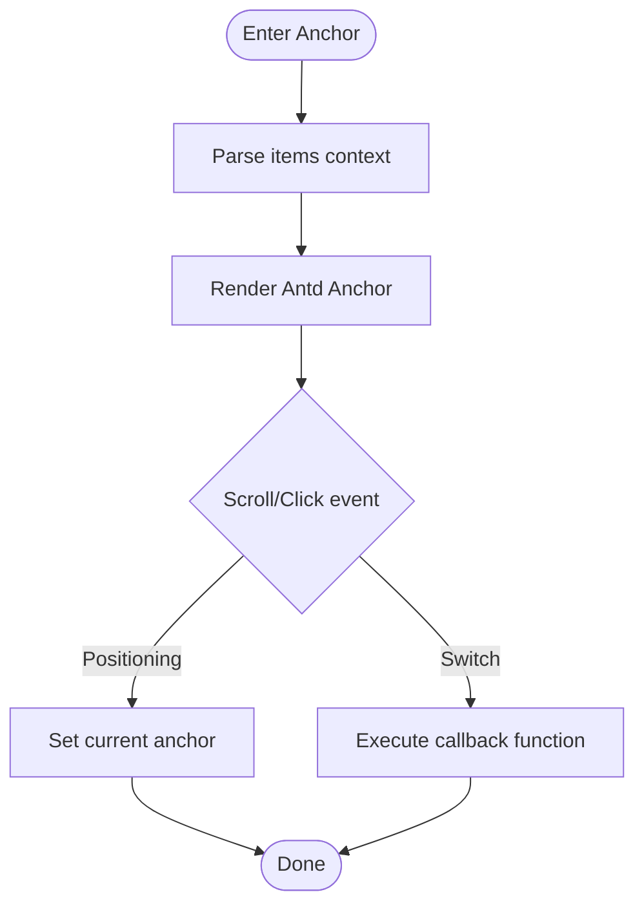
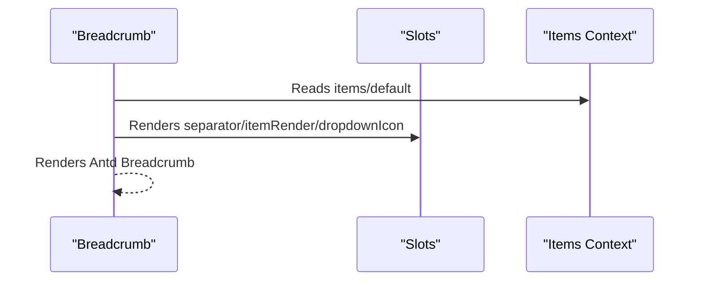
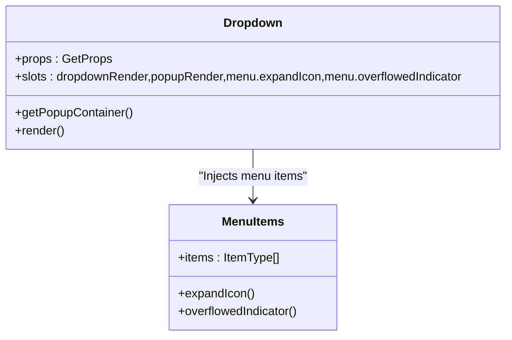
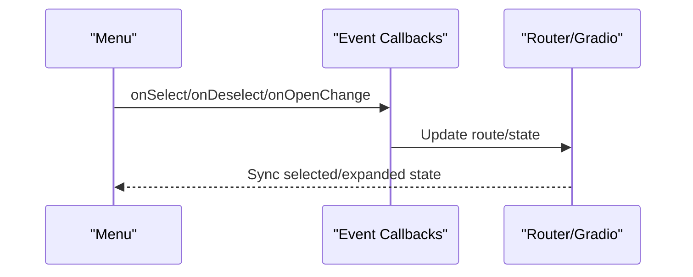
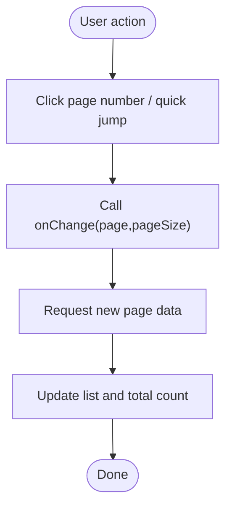
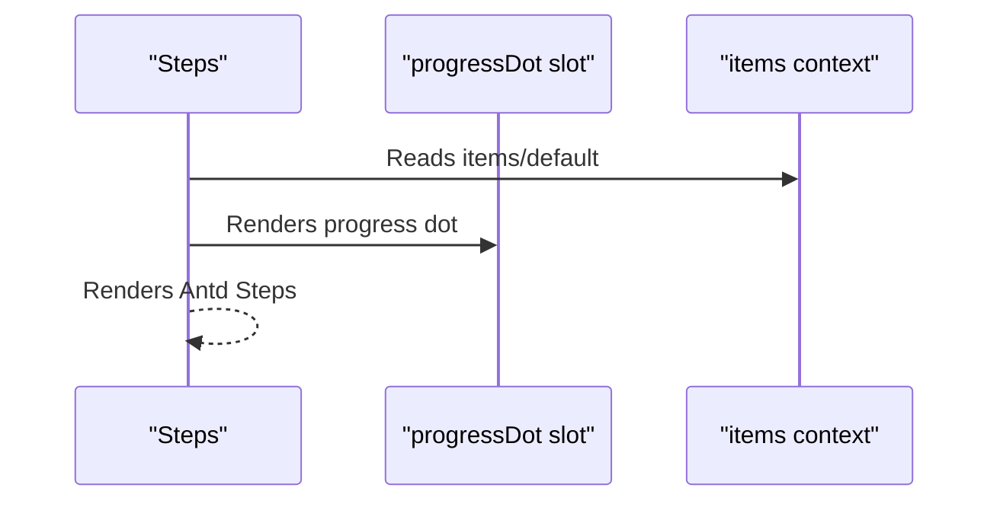
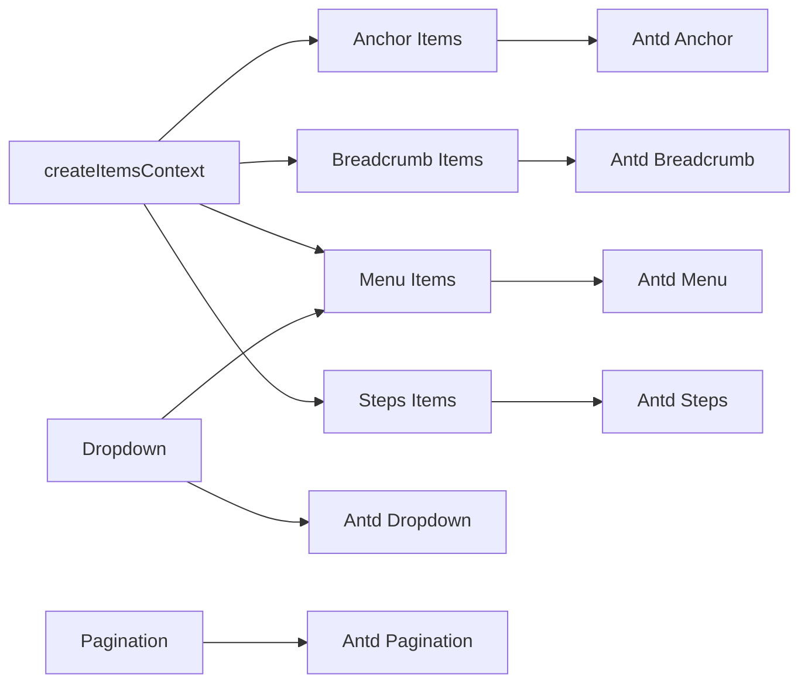

# Navigation Components API

<cite>
**Files referenced in this document**
- [frontend/antd/anchor/Index.svelte](file://frontend/antd/anchor/Index.svelte)
- [frontend/antd/anchor/anchor.tsx](file://frontend/antd/anchor/anchor.tsx)
- [frontend/antd/anchor/context.ts](file://frontend/antd/anchor/context.ts)
- [frontend/antd/breadcrumb/Index.svelte](file://frontend/antd/breadcrumb/Index.svelte)
- [frontend/antd/breadcrumb/breadcrumb.tsx](file://frontend/antd/breadcrumb/breadcrumb.tsx)
- [frontend/antd/breadcrumb/context.ts](file://frontend/antd/breadcrumb/context.ts)
- [frontend/antd/breadcrumb/item/Index.svelte](file://frontend/antd/breadcrumb/item/Index.svelte)
- [frontend/antd/dropdown/Index.svelte](file://frontend/antd/dropdown/Index.svelte)
- [frontend/antd/dropdown/dropdown.tsx](file://frontend/antd/dropdown/dropdown.tsx)
- [frontend/antd/menu/Index.svelte](file://frontend/antd/menu/Index.svelte)
- [frontend/antd/menu/menu.tsx](file://frontend/antd/menu/menu.tsx)
- [frontend/antd/menu/context.ts](file://frontend/antd/menu/context.ts)
- [frontend/antd/menu/item/Index.svelte](file://frontend/antd/menu/item/Index.svelte)
- [frontend/antd/pagination/Index.svelte](file://frontend/antd/pagination/Index.svelte)
- [frontend/antd/pagination/pagination.tsx](file://frontend/antd/pagination/pagination.tsx)
- [frontend/antd/steps/Index.svelte](file://frontend/antd/steps/Index.svelte)
- [frontend/antd/steps/steps.tsx](file://frontend/antd/steps/steps.tsx)
- [frontend/antd/steps/context.ts](file://frontend/antd/steps/context.ts)
</cite>

## Table of Contents

1. [Introduction](#introduction)
2. [Project Structure](#project-structure)
3. [Core Components](#core-components)
4. [Architecture Overview](#architecture-overview)
5. [Component Details](#component-details)
6. [Dependency Analysis](#dependency-analysis)
7. [Performance Considerations](#performance-considerations)
8. [Troubleshooting Guide](#troubleshooting-guide)
9. [Conclusion](#conclusion)
10. [Appendix](#appendix)

## Introduction

This document is the API reference for Ant Design-based navigation components in ModelScope Studio, covering: Anchor, Breadcrumb, Dropdown, Menu, Pagination, and Steps. It provides a systematic overview of architecture design, data flow, processing logic, type definitions, event binding, routing integration, permission control, and dynamic loading, along with reusable usage patterns and best practices.

## Project Structure

Navigation components use a unified "Svelte wrapper layer + React component bridge" pattern on the frontend:

- The Svelte layer handles prop forwarding, visibility control, style injection, slot rendering, and lazy loading.
- The React layer bridges native Ant Design components into the Svelte ecosystem via `sveltify`, while providing slot rendering, function hooks, and context injection capabilities.

Diagram sources

- [frontend/antd/anchor/Index.svelte:1-66](file://frontend/antd/anchor/Index.svelte#L1-L66)
- [frontend/antd/anchor/anchor.tsx:1-46](file://frontend/antd/anchor/anchor.tsx#L1-L46)
- [frontend/antd/breadcrumb/Index.svelte:1-78](file://frontend/antd/breadcrumb/Index.svelte#L1-L78)
- [frontend/antd/breadcrumb/breadcrumb.tsx:1-67](file://frontend/antd/breadcrumb/breadcrumb.tsx#L1-L67)
- [frontend/antd/dropdown/Index.svelte:1-70](file://frontend/antd/dropdown/Index.svelte#L1-L70)
- [frontend/antd/dropdown/dropdown.tsx:1-111](file://frontend/antd/dropdown/dropdown.tsx#L1-L111)
- [frontend/antd/menu/Index.svelte:1-75](file://frontend/antd/menu/Index.svelte#L1-L75)
- [frontend/antd/menu/menu.tsx:1-96](file://frontend/antd/menu/menu.tsx#L1-L96)
- [frontend/antd/pagination/Index.svelte:1-68](file://frontend/antd/pagination/Index.svelte#L1-L68)
- [frontend/antd/pagination/pagination.tsx:1-55](file://frontend/antd/pagination/pagination.tsx#L1-L55)
- [frontend/antd/steps/Index.svelte:1-63](file://frontend/antd/steps/Index.svelte#L1-L63)
- [frontend/antd/steps/steps.tsx:1-52](file://frontend/antd/steps/steps.tsx#L1-L52)

Section sources

- [frontend/antd/anchor/Index.svelte:1-66](file://frontend/antd/anchor/Index.svelte#L1-L66)
- [frontend/antd/breadcrumb/Index.svelte:1-78](file://frontend/antd/breadcrumb/Index.svelte#L1-L78)
- [frontend/antd/dropdown/Index.svelte:1-70](file://frontend/antd/dropdown/Index.svelte#L1-L70)
- [frontend/antd/menu/Index.svelte:1-75](file://frontend/antd/menu/Index.svelte#L1-L75)
- [frontend/antd/pagination/Index.svelte:1-68](file://frontend/antd/pagination/Index.svelte#L1-L68)
- [frontend/antd/steps/Index.svelte:1-63](file://frontend/antd/steps/Index.svelte#L1-L63)

## Core Components

This section provides an overview of the responsibilities and common characteristics of the six navigation components:

- **Anchor**: In-page anchor navigation supporting container selection and current anchor callbacks.
- **Breadcrumb**: Displays the current page's position in the hierarchy; supports custom separators, item rendering, and dropdown icons.
- **Dropdown**: Wraps a trigger element and renders a dropdown menu; supports custom popup rendering and menu item injection.
- **Menu**: Side or top navigation menu; supports themes, expand icons, overflow indicators, and select/expand events.
- **Pagination**: Data pagination control; supports quick-jump buttons and custom page item rendering.
- **Steps**: Step flow indicator; supports step item lists and custom progress dot rendering.

Section sources

- [frontend/antd/anchor/anchor.tsx:1-46](file://frontend/antd/anchor/anchor.tsx#L1-L46)
- [frontend/antd/breadcrumb/breadcrumb.tsx:1-67](file://frontend/antd/breadcrumb/breadcrumb.tsx#L1-L67)
- [frontend/antd/dropdown/dropdown.tsx:1-111](file://frontend/antd/dropdown/dropdown.tsx#L1-L111)
- [frontend/antd/menu/menu.tsx:1-96](file://frontend/antd/menu/menu.tsx#L1-L96)
- [frontend/antd/pagination/pagination.tsx:1-55](file://frontend/antd/pagination/pagination.tsx#L1-L55)
- [frontend/antd/steps/steps.tsx:1-52](file://frontend/antd/steps/steps.tsx#L1-L52)

## Architecture Overview

Component bridging follows a unified pattern of "lazy loading + slot rendering + function hooks":

- **Prop forwarding**: The wrapper layer forwards common props such as `visible`, `elem_id`, `elem_classes`, `elem_style`, `_internal`, and `as_item` to the React component.
- **Slot rendering**: Slot name mapping and parameterized rendering are supported via `ReactSlot` and `renderParamsSlot`.
- **Dynamic injection**: `items` lists are injected via `withItemsContextProvider`, supporting both default slots and explicit `items` params.
- **Event binding**: Events such as `onOpenChange`, `onSelect`, `onDeselect`, and `onChange` are ensured to be reactive through the `useFunction` hook.

Diagram sources

- [frontend/antd/anchor/Index.svelte:22-44](file://frontend/antd/anchor/Index.svelte#L22-L44)
- [frontend/antd/anchor/anchor.tsx:10-43](file://frontend/antd/anchor/anchor.tsx#L10-L43)
- [frontend/antd/breadcrumb/breadcrumb.tsx:15-63](file://frontend/antd/breadcrumb/breadcrumb.tsx#L15-L63)
- [frontend/antd/dropdown/dropdown.tsx:26-108](file://frontend/antd/dropdown/dropdown.tsx#L26-L108)
- [frontend/antd/menu/menu.tsx:18-92](file://frontend/antd/menu/menu.tsx#L18-L92)
- [frontend/antd/pagination/pagination.tsx:14-52](file://frontend/antd/pagination/pagination.tsx#L14-L52)
- [frontend/antd/steps/steps.tsx:16-49](file://frontend/antd/steps/steps.tsx#L16-L49)

## Component Details

### Anchor

- **Responsibility**: Provides in-page anchor navigation; supports container selection and current anchor callbacks.
- **Key Props and Behaviors**
  - Container selection: `getContainer` specifies the scroll container.
  - Current anchor: `getCurrentAnchor` retrieves the currently active anchor.
  - Items injection: `items` are injected via context, supporting default slot and explicit `items`.
- **Events and State**
  - No explicit event callbacks; scroll positioning and highlight sync are achieved via callback functions.
- **Usage Notes**
  - Use with anchor items on long pages; ensure the container is set correctly.
  - Use slots to render custom anchor titles.

Diagram sources

- [frontend/antd/anchor/anchor.tsx:10-43](file://frontend/antd/anchor/anchor.tsx#L10-L43)
- [frontend/antd/anchor/context.ts:1-7](file://frontend/antd/anchor/context.ts#L1-L7)

Section sources

- [frontend/antd/anchor/Index.svelte:1-66](file://frontend/antd/anchor/Index.svelte#L1-L66)
- [frontend/antd/anchor/anchor.tsx:1-46](file://frontend/antd/anchor/anchor.tsx#L1-L46)
- [frontend/antd/anchor/context.ts:1-7](file://frontend/antd/anchor/context.ts#L1-L7)

### Breadcrumb

- **Responsibility**: Displays the current page's path in the hierarchy; supports custom separators, item rendering, and dropdown icons.
- **Key Props and Behaviors**
  - Separator: `separator` supports slots and functions.
  - Item rendering: `itemRender` supports slots and functions.
  - Dropdown icon: `dropdownIcon` supports slots.
  - Items injection: supports `default` and `items` slots.
- **Events and State**
  - Rendering is controlled via props and slots; no direct event callbacks.
- **Usage Notes**
  - Generate a hierarchical structure in combination with a routing system; use `itemRender` to customize link styles when necessary.

Diagram sources

- [frontend/antd/breadcrumb/breadcrumb.tsx:15-63](file://frontend/antd/breadcrumb/breadcrumb.tsx#L15-L63)
- [frontend/antd/breadcrumb/context.ts:1-7](file://frontend/antd/breadcrumb/context.ts#L1-L7)

Section sources

- [frontend/antd/breadcrumb/Index.svelte:1-78](file://frontend/antd/breadcrumb/Index.svelte#L1-L78)
- [frontend/antd/breadcrumb/breadcrumb.tsx:1-67](file://frontend/antd/breadcrumb/breadcrumb.tsx#L1-L67)
- [frontend/antd/breadcrumb/context.ts:1-7](file://frontend/antd/breadcrumb/context.ts#L1-L7)
- [frontend/antd/breadcrumb/item/Index.svelte:1-72](file://frontend/antd/breadcrumb/item/Index.svelte#L1-L72)

### Dropdown

- **Responsibility**: Wraps a trigger element and renders a dropdown menu; supports custom popup rendering and menu item injection.
- **Key Props and Behaviors**
  - Popup container: `getPopupContainer`.
  - Dropdown rendering: `dropdownRender`, `popupRender` support slots and functions.
  - Menu expand icon: `menu.expandIcon` supports slots.
  - Overflow indicator: `menu.overflowedIndicator` supports slots.
  - Menu item injection: items are injected via the menu context.
- **Events and State**
  - Rendering is controlled via props and slots; no direct event callbacks.
- **Usage Notes**
  - Place the trigger element inside the component to avoid style occlusion.
  - Use slots to implement complex dropdown panel layouts.

Diagram sources

- [frontend/antd/dropdown/dropdown.tsx:15-108](file://frontend/antd/dropdown/dropdown.tsx#L15-L108)
- [frontend/antd/menu/context.ts:1-7](file://frontend/antd/menu/context.ts#L1-L7)

Section sources

- [frontend/antd/dropdown/Index.svelte:1-70](file://frontend/antd/dropdown/Index.svelte#L1-L70)
- [frontend/antd/dropdown/dropdown.tsx:1-111](file://frontend/antd/dropdown/dropdown.tsx#L1-L111)
- [frontend/antd/menu/context.ts:1-7](file://frontend/antd/menu/context.ts#L1-L7)

### Menu

- **Responsibility**: Side or top navigation menu; supports themes, expand icons, overflow indicators, and select/expand events.
- **Key Props and Behaviors**
  - Theme: `theme` supports external injection.
  - Expand icon: `expandIcon` supports slots.
  - Overflow indicator: `overflowedIndicator` supports slots.
  - Popup rendering: `popupRender` supports slots.
  - Events: `onOpenChange`, `onSelect`, `onDeselect`.
  - Items injection: supports `default` and `items` slots.
- **Events and State**
  - State management and routing integration are achieved via `onOpenChange`, `onSelect`, and `onDeselect`.
- **Usage Notes**
  - When integrating with a routing library, handle routing navigation and selection state sync inside `onSelect`.

Diagram sources

- [frontend/antd/menu/menu.tsx:18-92](file://frontend/antd/menu/menu.tsx#L18-L92)
- [frontend/antd/menu/context.ts:1-7](file://frontend/antd/menu/context.ts#L1-L7)

Section sources

- [frontend/antd/menu/Index.svelte:1-75](file://frontend/antd/menu/Index.svelte#L1-L75)
- [frontend/antd/menu/menu.tsx:1-96](file://frontend/antd/menu/menu.tsx#L1-L96)
- [frontend/antd/menu/context.ts:1-7](file://frontend/antd/menu/context.ts#L1-L7)
- [frontend/antd/menu/item/Index.svelte:1-84](file://frontend/antd/menu/item/Index.svelte#L1-L84)

### Pagination

- **Responsibility**: Data pagination control; supports quick-jump buttons and custom page item rendering.
- **Key Props and Behaviors**
  - Quick jump: `showQuickJumper` supports the `goButton` slot.
  - Total display: `showTotal` supports functions.
  - Page item rendering: `itemRender` supports slots and functions.
  - Events: `onChange(page, pageSize)`.
- **Events and State**
  - Handle pagination logic and data refresh inside `onChange`.
- **Usage Notes**
  - When interfacing with backend pagination APIs, pay attention to `page`/`pageSize` conversion and boundary handling.

Diagram sources

- [frontend/antd/pagination/pagination.tsx:14-52](file://frontend/antd/pagination/pagination.tsx#L14-L52)

Section sources

- [frontend/antd/pagination/Index.svelte:1-68](file://frontend/antd/pagination/Index.svelte#L1-L68)
- [frontend/antd/pagination/pagination.tsx:1-55](file://frontend/antd/pagination/pagination.tsx#L1-L55)

### Steps

- **Responsibility**: Step flow indicator; supports step item lists and custom progress dot rendering.
- **Key Props and Behaviors**
  - Step items: `items` injection, supporting `default` and `items` slots.
  - Progress dot: `progressDot` supports slots and functions.
  - Events: step switching is implemented via callback functions.
- **Events and State**
  - No direct event callbacks; step state management is achieved via function hooks.
- **Usage Notes**
  - When combined with form wizards, control the availability of the next step based on the current step.

Diagram sources

- [frontend/antd/steps/steps.tsx:16-49](file://frontend/antd/steps/steps.tsx#L16-L49)
- [frontend/antd/steps/context.ts:1-7](file://frontend/antd/steps/context.ts#L1-L7)

Section sources

- [frontend/antd/steps/Index.svelte:1-63](file://frontend/antd/steps/Index.svelte#L1-L63)
- [frontend/antd/steps/steps.tsx:1-52](file://frontend/antd/steps/steps.tsx#L1-L52)
- [frontend/antd/steps/context.ts:1-7](file://frontend/antd/steps/context.ts#L1-L7)

## Dependency Analysis

- **Inter-component Coupling**
  - Dropdown depends on Menu's context injection for unified menu item management.
  - All components with `items` depend on the context and rendering utilities provided by `createItemsContext`.
- **External Dependencies**
  - Native Ant Design components as the rendering foundation.
  - `@svelte-preprocess-react` provides tools such as `sveltify`, `ReactSlot`, `renderItems`, and `renderParamsSlot`.
- **Potential Circular Dependencies**
  - Direct circular imports are avoided via context injection; each component independently maintains its own context.

Diagram sources

- [frontend/antd/anchor/context.ts:1-7](file://frontend/antd/anchor/context.ts#L1-L7)
- [frontend/antd/breadcrumb/context.ts:1-7](file://frontend/antd/breadcrumb/context.ts#L1-L7)
- [frontend/antd/menu/context.ts:1-7](file://frontend/antd/menu/context.ts#L1-L7)
- [frontend/antd/steps/context.ts:1-7](file://frontend/antd/steps/context.ts#L1-L7)
- [frontend/antd/dropdown/dropdown.tsx:10-13](file://frontend/antd/dropdown/dropdown.tsx#L10-L13)

Section sources

- [frontend/antd/anchor/context.ts:1-7](file://frontend/antd/anchor/context.ts#L1-L7)
- [frontend/antd/breadcrumb/context.ts:1-7](file://frontend/antd/breadcrumb/context.ts#L1-L7)
- [frontend/antd/menu/context.ts:1-7](file://frontend/antd/menu/context.ts#L1-L7)
- [frontend/antd/steps/context.ts:1-7](file://frontend/antd/steps/context.ts#L1-L7)
- [frontend/antd/dropdown/dropdown.tsx:10-13](file://frontend/antd/dropdown/dropdown.tsx#L10-L13)

## Performance Considerations

- **Lazy Loading**: The Svelte wrapper layer lazy-loads React components to reduce the initial page load burden.
- **Computed Caching**: The React layer uses `useMemo` to stabilize `items`, avoiding unnecessary re-renders.
- **Slot Cloning**: Slot rendering enables cloning by default to ensure independence, but be mindful of cloning overhead.
- **Event Hooks**: The `useFunction` hook ensures stable callback references, preventing re-renders caused by function reference changes.

## Troubleshooting Guide

- **Event Not Triggered**
  - Check that `onOpenChange`/`onSelect`/`onDeselect`/`onChange` callbacks have been correctly passed.
  - Confirm that the callback functions are wrapped with the `useFunction` hook.
- **Slot Not Working**
  - Confirm that the slot name matches the mapping (e.g., `menu.expandIcon`, `itemRender`, etc.).
  - Check that the slot has cloning enabled (`clone: true`).
- **Items Not Displayed**
  - Confirm that `items` have been injected via context or passed explicitly.
  - Check the priority and naming of the default slot vs. the `items` slot.
- **Style Conflicts**
  - Check whether `elem_id`/`elem_classes` conflict with global styles.
  - Ensure the component style class prefix `ms-gr-antd-*` has not been overridden.

Section sources

- [frontend/antd/anchor/anchor.tsx:10-43](file://frontend/antd/anchor/anchor.tsx#L10-L43)
- [frontend/antd/breadcrumb/breadcrumb.tsx:15-63](file://frontend/antd/breadcrumb/breadcrumb.tsx#L15-L63)
- [frontend/antd/dropdown/dropdown.tsx:26-108](file://frontend/antd/dropdown/dropdown.tsx#L26-L108)
- [frontend/antd/menu/menu.tsx:18-92](file://frontend/antd/menu/menu.tsx#L18-L92)
- [frontend/antd/pagination/pagination.tsx:14-52](file://frontend/antd/pagination/pagination.tsx#L14-L52)
- [frontend/antd/steps/steps.tsx:16-49](file://frontend/antd/steps/steps.tsx#L16-L49)

## Conclusion

ModelScope Studio's navigation components achieve seamless integration of Ant Design components in the frontend ecosystem through a unified Svelte wrapper layer and React bridge layer. The design emphasizes:

- **Ease of use**: Unified prop forwarding and slot mapping.
- **Extensibility**: Context injection and function hooks for greater flexibility.
- **Maintainability**: Clear separation of responsibilities and dependencies.

It is recommended to normalize event callbacks and state management in combination with routing systems and permission frameworks in real-world projects to achieve a better user experience and development efficiency.

## Appendix

- **Routing Integration Recommendations**
  - Handle routing navigation and state sync uniformly in Menu/Pagination/Steps callbacks.
  - Handle scroll positioning and highlight sync uniformly in Anchor and Steps callbacks.
- **Permission Control Recommendations**
  - Filter invisible items at the items injection stage, or hide them based on permission conditions at the rendering layer.
- **Dynamic Loading Recommendations**
  - Use lazy loading and `useMemo` caching strategies to avoid frequent re-renders.
- **Accessibility Recommendations**
  - Provide keyboard accessibility and screen-reader-friendly labels for clickable items.
  - Provide clear ARIA attributes and state hints for step indicators and pagination controls.
