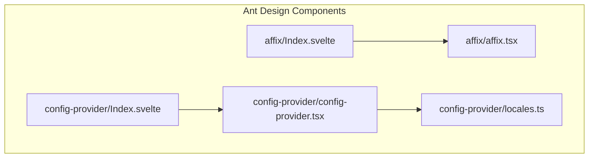
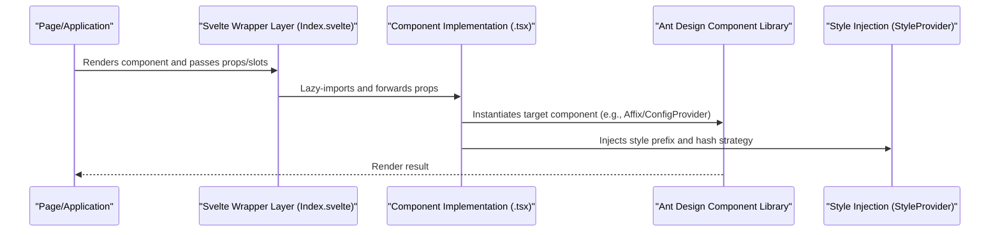
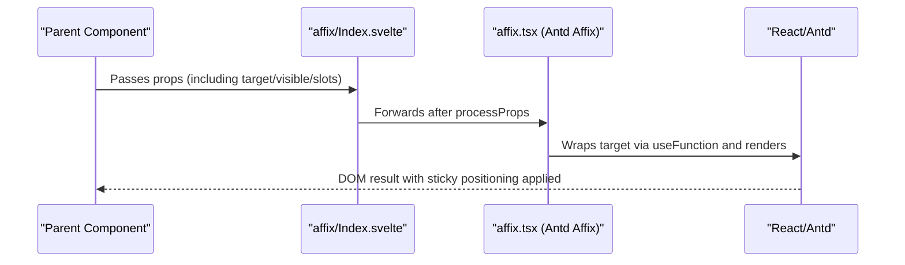
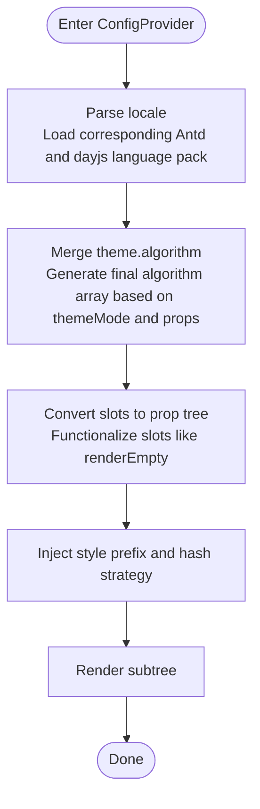
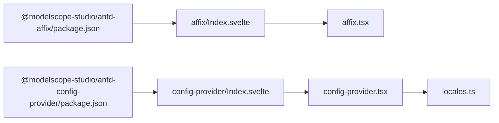

# Other Components API

<cite>
**Files referenced in this document**
- [frontend/antd/affix/Index.svelte](file://frontend/antd/affix/Index.svelte)
- [frontend/antd/affix/affix.tsx](file://frontend/antd/affix/affix.tsx)
- [frontend/antd/affix/package.json](file://frontend/antd/affix/package.json)
- [frontend/antd/config-provider/Index.svelte](file://frontend/antd/config-provider/Index.svelte)
- [frontend/antd/config-provider/config-provider.tsx](file://frontend/antd/config-provider/config-provider.tsx)
- [frontend/antd/config-provider/locales.ts](file://frontend/antd/config-provider/locales.ts)
- [frontend/antd/config-provider/package.json](file://frontend/antd/config-provider/package.json)
- [docs/components/antd/affix/README.md](file://docs/components/antd/affix/README.md)
- [docs/components/antd/config_provider/README.md](file://docs/components/antd/config_provider/README.md)
</cite>

## Table of Contents

1. [Introduction](#introduction)
2. [Project Structure](#project-structure)
3. [Core Components](#core-components)
4. [Architecture Overview](#architecture-overview)
5. [Component Details](#component-details)
6. [Dependency Analysis](#dependency-analysis)
7. [Performance Considerations](#performance-considerations)
8. [Troubleshooting Guide](#troubleshooting-guide)
9. [Conclusion](#conclusion)
10. [Appendix](#appendix)

## Introduction

This document provides a systematic overview of special-function Ant Design components in ModelScope Studio: Affix (sticky positioning) and ConfigProvider (global configuration). It covers their APIs, type definitions, context provision, theme and internationalization mechanisms, and how they integrate into the component system. The document also presents standard usage workflows, typical scenarios, and best practices to help developers quickly understand and correctly use these components.

## Project Structure

- Components are organized as Svelte packages; each component directory contains:
  - `Index.svelte`: The Gradio/Svelte wrapper layer, responsible for prop forwarding, slot rendering, visibility control, and lazy loading.
  - Component implementation files (e.g., `affix.tsx`, `config-provider.tsx`): Bridge React components into a Svelte-usable form via `@svelte-preprocess-react`, extending necessary types and behaviors.
  - `package.json`: The export entry, supporting both Gradio and default modes.
- Documentation is located under `docs/components/antd`, providing examples and explanations.

Diagram sources

- [frontend/antd/affix/Index.svelte:1-72](file://frontend/antd/affix/Index.svelte#L1-L72)
- [frontend/antd/affix/affix.tsx:1-14](file://frontend/antd/affix/affix.tsx#L1-L14)
- [frontend/antd/config-provider/Index.svelte:1-72](file://frontend/antd/config-provider/Index.svelte#L1-L72)
- [frontend/antd/config-provider/config-provider.tsx:1-154](file://frontend/antd/config-provider/config-provider.tsx#L1-L154)
- [frontend/antd/config-provider/locales.ts:1-863](file://frontend/antd/config-provider/locales.ts#L1-L863)

Section sources

- [frontend/antd/affix/Index.svelte:1-72](file://frontend/antd/affix/Index.svelte#L1-L72)
- [frontend/antd/affix/affix.tsx:1-14](file://frontend/antd/affix/affix.tsx#L1-L14)
- [frontend/antd/config-provider/Index.svelte:1-72](file://frontend/antd/config-provider/Index.svelte#L1-L72)
- [frontend/antd/config-provider/config-provider.tsx:1-154](file://frontend/antd/config-provider/config-provider.tsx#L1-L154)
- [frontend/antd/config-provider/locales.ts:1-863](file://frontend/antd/config-provider/locales.ts#L1-L863)
- [frontend/antd/affix/package.json:1-15](file://frontend/antd/affix/package.json#L1-L15)
- [frontend/antd/config-provider/package.json:1-15](file://frontend/antd/config-provider/package.json#L1-L15)
- [docs/components/antd/affix/README.md:1-9](file://docs/components/antd/affix/README.md#L1-L9)
- [docs/components/antd/config_provider/README.md:1-8](file://docs/components/antd/config_provider/README.md#L1-L8)

## Core Components

- **Affix**
  - **Responsibility**: Fixes child elements to the viewport or container boundaries; commonly used for sidebars, back-to-top buttons, etc.
  - **Key Points**: Dynamically determines the scroll container via the `target` function; supports `visible` to control rendering; supports extra prop forwarding and slot rendering.
- **ConfigProvider**
  - **Responsibility**: Provides unified global configuration for Ant Design components, including themes, locales, popup containers, and empty state rendering.
  - **Key Points**: Supports theme algorithm toggles (dark/compact), internationalization locale switching, style injection, and container function callbacks; can be used as the context root node.

Section sources

- [frontend/antd/affix/Index.svelte:1-72](file://frontend/antd/affix/Index.svelte#L1-L72)
- [frontend/antd/affix/affix.tsx:1-14](file://frontend/antd/affix/affix.tsx#L1-L14)
- [frontend/antd/config-provider/Index.svelte:1-72](file://frontend/antd/config-provider/Index.svelte#L1-L72)
- [frontend/antd/config-provider/config-provider.tsx:1-154](file://frontend/antd/config-provider/config-provider.tsx#L1-L154)

## Architecture Overview

The following diagram illustrates the call chain from the Svelte wrapper layer to React components, as well as the theme and internationalization processing flow for ConfigProvider.

Diagram sources

- [frontend/antd/affix/Index.svelte:55-68](file://frontend/antd/affix/Index.svelte#L55-L68)
- [frontend/antd/affix/affix.tsx:6-11](file://frontend/antd/affix/affix.tsx#L6-L11)
- [frontend/antd/config-provider/Index.svelte:54-71](file://frontend/antd/config-provider/Index.svelte#L54-L71)
- [frontend/antd/config-provider/config-provider.tsx:108-149](file://frontend/antd/config-provider/config-provider.tsx#L108-L149)

## Component Details

### Affix

- **Responsibility**
  - Fixes child content to the viewport or a specified container boundary, showing/hiding as the user scrolls.
- **Props and Behaviors**
  - Supports a `target` container function for dynamically selecting the scroll container.
  - Supports `visible` to control whether to render.
  - Supports extra prop forwarding and slot rendering.
- **Use Cases**
  - Sidebar toolbars, back-to-top buttons, floating action areas, etc.
- **Types and Implementation Notes**
  - Bridges Ant Design's `Affix` as a Svelte component via `sveltify` from `@svelte-preprocess-react`.
  - `target` is wrapped via `useFunction` to ensure reactive updates.
- **Examples and Documentation**
  - Documentation provides two examples: "Basic" and "Container scroll" for quick onboarding.

Diagram sources

- [frontend/antd/affix/Index.svelte:23-49](file://frontend/antd/affix/Index.svelte#L23-L49)
- [frontend/antd/affix/affix.tsx:6-11](file://frontend/antd/affix/affix.tsx#L6-L11)

Section sources

- [frontend/antd/affix/Index.svelte:1-72](file://frontend/antd/affix/Index.svelte#L1-L72)
- [frontend/antd/affix/affix.tsx:1-14](file://frontend/antd/affix/affix.tsx#L1-L14)
- [docs/components/antd/affix/README.md:1-9](file://docs/components/antd/affix/README.md#L1-L9)

### ConfigProvider

- **Responsibility**
  - Provides unified global configuration covering theme, locale, popup container, empty state rendering, and more.
- **Theme and Algorithms**
  - `theme.algorithm` supports automatic detection: dark/compact algorithms can be enabled based on `themeMode` or explicit configuration.
- **Internationalization**
  - `locale` supports multi-language mapping, switching based on browser language or explicit input; also synchronizes `dayjs` locale settings.
- **Slots and Prop Composition**
  - Supports converting slots into a prop tree for declarative passing of complex configuration items.
- **Context and Containers**
  - Marks the context as `antd` type via `setConfigType`, affecting behaviors like shared theming.
  - Supports `getPopupContainer`/`getTargetContainer` for customizing popup and mount containers.

Diagram sources

- [frontend/antd/config-provider/config-provider.tsx:85-105](file://frontend/antd/config-provider/config-provider.tsx#L85-L105)
- [frontend/antd/config-provider/config-provider.tsx:127-143](file://frontend/antd/config-provider/config-provider.tsx#L127-L143)
- [frontend/antd/config-provider/config-provider.tsx:29-49](file://frontend/antd/config-provider/config-provider.tsx#L29-L49)
- [frontend/antd/config-provider/locales.ts:15-27](file://frontend/antd/config-provider/locales.ts#L15-L27)

Section sources

- [frontend/antd/config-provider/Index.svelte:1-72](file://frontend/antd/config-provider/Index.svelte#L1-L72)
- [frontend/antd/config-provider/config-provider.tsx:1-154](file://frontend/antd/config-provider/config-provider.tsx#L1-L154)
- [frontend/antd/config-provider/locales.ts:1-863](file://frontend/antd/config-provider/locales.ts#L1-L863)
- [docs/components/antd/config_provider/README.md:1-8](file://docs/components/antd/config_provider/README.md#L1-L8)

## Dependency Analysis

- **Component Export**
  - Both components provide Gradio and default entry points via the `exports` field in `package.json`, making them usable across different runtime environments.
- **Runtime Dependencies**
  - ConfigProvider depends on Ant Design's `ConfigProvider`, theme algorithms, and style injection; it also depends on `dayjs` and the locales mapping.
  - Affix depends on Ant Design's `Affix` and the `useFunction` utility to wrap callback functions.
- **Wrapper Layer Coupling**
  - Both components use lazy imports and prop forwarding to reduce initial load pressure and improve rendering controllability.

Diagram sources

- [frontend/antd/affix/package.json:1-15](file://frontend/antd/affix/package.json#L1-L15)
- [frontend/antd/config-provider/package.json:1-15](file://frontend/antd/config-provider/package.json#L1-L15)
- [frontend/antd/affix/Index.svelte:10-13](file://frontend/antd/affix/Index.svelte#L10-L13)
- [frontend/antd/config-provider/Index.svelte:11-13](file://frontend/antd/config-provider/Index.svelte#L11-L13)

Section sources

- [frontend/antd/affix/package.json:1-15](file://frontend/antd/affix/package.json#L1-L15)
- [frontend/antd/config-provider/package.json:1-15](file://frontend/antd/config-provider/package.json#L1-L15)

## Performance Considerations

- **Lazy Loading**
  - Components are loaded on demand via `importComponent` and the `{#await}` pattern, avoiding initial page blocking.
- **Prop Forwarding and Derived Computation**
  - Using `processProps` and `$derived` avoids unnecessary re-renders, only updating when essential props change.
- **Style Injection Strategy**
  - Using `StyleProvider` with a high-priority hash reduces style conflicts and repaint costs.
- **Callback Function Wrapping**
  - Using `useFunction` to wrap callbacks like `target`/`getPopupContainer` ensures stable function references, reducing unnecessary updates.

## Troubleshooting Guide

- **Sticky Positioning Not Working**
  - Check that `target` returns the correct scroll container; confirm that `visible` is `true` and the container has a scrollbar.
  - Reference paths: [frontend/antd/affix/Index.svelte:47-49](file://frontend/antd/affix/Index.svelte#L47-L49), [frontend/antd/affix/affix.tsx:7-10](file://frontend/antd/affix/affix.tsx#L7-L10)
- **Popup/Float Position Abnormal**
  - Check that `getPopupContainer` returns the correct container; confirm the `getTargetContainer` setting in ConfigProvider.
  - Reference path: [frontend/antd/config-provider/config-provider.tsx:93-95](file://frontend/antd/config-provider/config-provider.tsx#L93-L95)
- **Theme Not Switching or Algorithm Not Taking Effect**
  - Confirm the combination of `themeMode` and `theme.algorithm`; note that the algorithm array is composed of multiple algorithm functions.
  - Reference paths: [frontend/antd/config-provider/config-provider.tsx:88-91](file://frontend/antd/config-provider/config-provider.tsx#L88-L91), [frontend/antd/config-provider/config-provider.tsx:127-143](file://frontend/antd/config-provider/config-provider.tsx#L127-L143)
- **Locale Not Taking Effect**
  - Check the `locale` parameter format and the locales mapping; confirm that the `dayjs` locale has been synchronized.
  - Reference paths: [frontend/antd/config-provider/config-provider.tsx:85-105](file://frontend/antd/config-provider/config-provider.tsx#L85-L105), [frontend/antd/config-provider/locales.ts:15-27](file://frontend/antd/config-provider/locales.ts#L15-L27)

Section sources

- [frontend/antd/affix/Index.svelte:47-49](file://frontend/antd/affix/Index.svelte#L47-L49)
- [frontend/antd/affix/affix.tsx:7-10](file://frontend/antd/affix/affix.tsx#L7-L10)
- [frontend/antd/config-provider/config-provider.tsx:85-105](file://frontend/antd/config-provider/config-provider.tsx#L85-L105)
- [frontend/antd/config-provider/config-provider.tsx:88-91](file://frontend/antd/config-provider/config-provider.tsx#L88-L91)
- [frontend/antd/config-provider/config-provider.tsx:127-143](file://frontend/antd/config-provider/config-provider.tsx#L127-L143)
- [frontend/antd/config-provider/locales.ts:15-27](file://frontend/antd/config-provider/locales.ts#L15-L27)

## Conclusion

- Affix and ConfigProvider in ModelScope Studio are seamlessly integrated with the Ant Design component library through a unified Svelte wrapper layer and `@svelte-preprocess-react` bridging.
- ConfigProvider provides powerful global configuration capabilities covering themes, internationalization, and container strategies; Affix focuses on sticky positioning scenarios with good configurability and performance.
- It is recommended to place ConfigProvider at the application root to unify style and locale; use Affix for areas requiring sticky positioning, and set `target` and `visible` appropriately.

## Appendix

- **Examples and Demos**
  - Affix examples: Basic, Container scroll
  - ConfigProvider examples: Basic
- **Reference Documentation**
  - Ant Design official Affix and ConfigProvider documentation links are in each component's README.

Section sources

- [docs/components/antd/affix/README.md:1-9](file://docs/components/antd/affix/README.md#L1-L9)
- [docs/components/antd/config_provider/README.md:1-8](file://docs/components/antd/config_provider/README.md#L1-L8)
