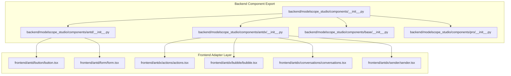
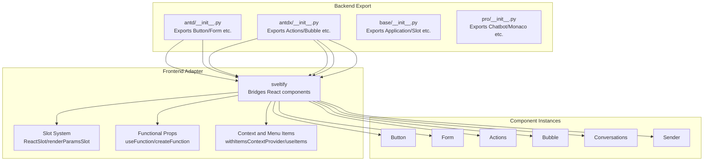
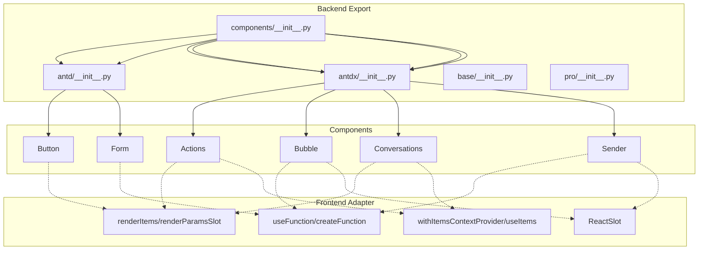

# Ant Design X Components API

<cite>
**Files referenced in this document**
- [backend/modelscope_studio/components/__init__.py](file://backend/modelscope_studio/components/__init__.py)
- [backend/modelscope_studio/components/antd/__init__.py](file://backend/modelscope_studio/components/antd/__init__.py)
- [backend/modelscope_studio/components/antdx/__init__.py](file://backend/modelscope_studio/components/antdx/__init__.py)
- [backend/modelscope_studio/components/base/__init__.py](file://backend/modelscope_studio/components/base/__init__.py)
- [backend/modelscope_studio/components/pro/__init__.py](file://backend/modelscope_studio/components/pro/__init__.py)
- [frontend/antd/button/button.tsx](file://frontend/antd/button/button.tsx)
- [frontend/antd/form/form.tsx](file://frontend/antd/form/form.tsx)
- [frontend/antdx/actions/actions.tsx](file://frontend/antdx/actions/actions.tsx)
- [frontend/antdx/bubble/bubble.tsx](file://frontend/antdx/bubble/bubble.tsx)
- [frontend/antdx/conversations/conversations.tsx](file://frontend/antdx/conversations/conversations.tsx)
- [frontend/antdx/sender/sender.tsx](file://frontend/antdx/sender/sender.tsx)
</cite>

## Table of Contents

1. [Introduction](#introduction)
2. [Project Structure](#project-structure)
3. [Core Components](#core-components)
4. [Architecture Overview](#architecture-overview)
5. [Component Details](#component-details)
6. [Dependency Analysis](#dependency-analysis)
7. [Performance Considerations](#performance-considerations)
8. [Troubleshooting Guide](#troubleshooting-guide)
9. [Conclusion](#conclusion)
10. [Appendix](#appendix)

## Introduction

This document is the API reference for Ant Design X-based Svelte components in ModelScope Studio, covering the following component families:

- **General Components**: Common UI component wrappers from Ant Design (antd)
- **Awakening Components**: Components for guiding user interaction, hints, or triggering flows
- **Expression Components**: Components for content display, rich text, chat bubbles, and other expressive uses
- **Confirmation Components**: Interaction components for secondary confirmation and popup confirmation
- **Feedback Components**: Feedback components for messages, notifications, progress, and results
- **Tool Components**: Auxiliary capabilities including forms, layouts, toolbars, and contexts

The document focuses on property definitions, event handlers, slot systems, state management, message passing, conversation flow control mechanisms, and provides usage patterns and best practices for AI/ML scenarios.

## Project Structure

ModelScope Studio's frontend uses a combination of Svelte + Ant Design X, bridging React components into the Svelte ecosystem through a unified adapter layer. The backend Python layer is responsible for exporting component collections for on-demand use in applications.

**Diagram sources**

- [backend/modelscope_studio/components/**init**.py:1-5](file://backend/modelscope_studio/components/__init__.py#L1-L5)
- [backend/modelscope_studio/components/antd/**init**.py:1-151](file://backend/modelscope_studio/components/antd/__init__.py#L1-L151)
- [backend/modelscope_studio/components/antdx/**init**.py:1-42](file://backend/modelscope_studio/components/antdx/__init__.py#L1-L42)
- [frontend/antd/button/button.tsx:1-39](file://frontend/antd/button/button.tsx#L1-L39)
- [frontend/antd/form/form.tsx:1-79](file://frontend/antd/form/form.tsx#L1-L79)
- [frontend/antdx/actions/actions.tsx:1-123](file://frontend/antdx/actions/actions.tsx#L1-L123)
- [frontend/antdx/bubble/bubble.tsx:1-119](file://frontend/antdx/bubble/bubble.tsx#L1-L119)
- [frontend/antdx/conversations/conversations.tsx:1-178](file://frontend/antdx/conversations/conversations.tsx#L1-L178)
- [frontend/antdx/sender/sender.tsx:1-174](file://frontend/antdx/sender/sender.tsx#L1-L174)

**Section sources**

- [backend/modelscope_studio/components/**init**.py:1-5](file://backend/modelscope_studio/components/__init__.py#L1-L5)
- [backend/modelscope_studio/components/antd/**init**.py:1-151](file://backend/modelscope_studio/components/antd/__init__.py#L1-L151)
- [backend/modelscope_studio/components/antdx/**init**.py:1-42](file://backend/modelscope_studio/components/antdx/__init__.py#L1-L42)
- [backend/modelscope_studio/components/base/**init**.py:1-11](file://backend/modelscope_studio/components/base/__init__.py#L1-L11)
- [backend/modelscope_studio/components/pro/**init**.py:1-7](file://backend/modelscope_studio/components/pro/__init__.py#L1-L7)

## Core Components

This section provides a quick overview of each component family's key responsibilities and typical use cases for rapid identification and selection.

- **General Components (Antd)**
  - Responsibility: Provide basic UI capabilities such as buttons, inputs, forms, layouts, messages, notifications, etc.
  - Typical components: Button, Form, Input, Modal, Message, Notification, etc.
  - Feature: Bridges Ant Design's React components as Svelte components via an adapter; supports slots and functional props.

- **Awakening Components (AntdX)**
  - Responsibility: Guide users to their next action, such as action menus, hints, skill toggles, etc.
  - Typical components: Actions, Sender, Suggestion, Welcome, etc.
  - Feature: Supports complex slots, context injection, event forwarding, and value change integration.

- **Expression Components (AntdX)**
  - Responsibility: For content expression and conversational display, such as bubbles, thought chains, file cards, attachments, etc.
  - Typical components: Bubble, ThoughtChain, FileCard, Attachments, Prompts, etc.
  - Feature: Supports render functions, editable configuration, header/footer, and extra area slots.

- **Confirmation Components (AntdX)**
  - Responsibility: For secondary confirmation, popup confirmation, and similar interactions.
  - Typical components: Popconfirm, Modal (static), Tour, etc.
  - Feature: Consistent interaction semantics with AntdX, maintaining a uniform slot and event model.

- **Feedback Components (AntdX)**
  - Responsibility: Messages, notifications, progress, results, and other feedback.
  - Typical components: Message, Notification, Progress, Result, etc.
  - Feature: Supports slot-based rendering, functional callbacks, and state-driven updates.

- **Tool Components (AntdX)**
  - Responsibility: Auxiliary capabilities for forms, layouts, contexts, and application containers.
  - Typical components: Form, Layout, XProvider, Markdown, Slot, etc.
  - Feature: Provides contexts, rendering utility functions, and the slot system.

**Section sources**

- [frontend/antd/button/button.tsx:1-39](file://frontend/antd/button/button.tsx#L1-L39)
- [frontend/antd/form/form.tsx:1-79](file://frontend/antd/form/form.tsx#L1-L79)
- [frontend/antdx/actions/actions.tsx:1-123](file://frontend/antdx/actions/actions.tsx#L1-L123)
- [frontend/antdx/bubble/bubble.tsx:1-119](file://frontend/antdx/bubble/bubble.tsx#L1-L119)
- [frontend/antdx/conversations/conversations.tsx:1-178](file://frontend/antdx/conversations/conversations.tsx#L1-L178)
- [frontend/antdx/sender/sender.tsx:1-174](file://frontend/antdx/sender/sender.tsx#L1-L174)

## Architecture Overview

The following diagram shows the mapping from backend component exports to the frontend adapter layer to specific components, as well as the processing paths for slots and functional props.

**Diagram sources**

- [backend/modelscope_studio/components/antd/**init**.py:1-151](file://backend/modelscope_studio/components/antd/__init__.py#L1-L151)
- [backend/modelscope_studio/components/antdx/**init**.py:1-42](file://backend/modelscope_studio/components/antdx/__init__.py#L1-L42)
- [backend/modelscope_studio/components/base/**init**.py:1-11](file://backend/modelscope_studio/components/base/__init__.py#L1-L11)
- [backend/modelscope_studio/components/pro/**init**.py:1-7](file://backend/modelscope_studio/components/pro/__init__.py#L1-L7)
- [frontend/antd/button/button.tsx:1-39](file://frontend/antd/button/button.tsx#L1-L39)
- [frontend/antd/form/form.tsx:1-79](file://frontend/antd/form/form.tsx#L1-L79)
- [frontend/antdx/actions/actions.tsx:1-123](file://frontend/antdx/actions/actions.tsx#L1-L123)
- [frontend/antdx/bubble/bubble.tsx:1-119](file://frontend/antdx/bubble/bubble.tsx#L1-L119)
- [frontend/antdx/conversations/conversations.tsx:1-178](file://frontend/antdx/conversations/conversations.tsx#L1-L178)
- [frontend/antdx/sender/sender.tsx:1-174](file://frontend/antdx/sender/sender.tsx#L1-L174)

## Component Details

### General Components API (Antd)

#### Button

- **Purpose**: Bridges Ant Design's Button as a Svelte component; supports slots and loading icon slots.
- **Key Points**
  - Slots: `icon`, `loading.icon`
  - Value binding: Intelligent selection between `value` and `children`
  - Loading state: `loading` supports object input with configurable delay
- **Usage Notes**
  - When slots exist, slot rendering takes priority; otherwise falls back to prop values.
  - Uses `useTargets` to handle target nodes in `children`.

**Section sources**

- [frontend/antd/button/button.tsx:1-39](file://frontend/antd/button/button.tsx#L1-L39)

#### Form

- **Purpose**: Bridges Ant Design's Form as a Svelte component; provides controlled value and action sync.
- **Key Points**
  - Controlled value: `value` and `onValueChange`
  - Action sync: `formAction` (reset/submit/validate) and `onResetFormAction`
  - Slots: `requiredMark`
  - Callbacks: `onValuesChange`
- **Usage Notes**
  - Uses `useEffect` to execute reset/submit/validate based on `formAction`.
  - Syncs external `value` to the internal form instance.

**Section sources**

- [frontend/antd/form/form.tsx:1-79](file://frontend/antd/form/form.tsx#L1-L79)

### Awakening Components API (AntdX)

#### Actions

- **Purpose**: Bridges AntdX's Actions as a Svelte component; supports menu items and dropdown render slots.
- **Key Points**
  - Slots: `dropdownProps.menu.items`, `dropdownProps.menu.expandIcon`, `dropdownProps.menu.overflowedIndicator`, `dropdownProps.dropdownRender`, `dropdownProps.popupRender`
  - Context: Integrates with menu item context, supporting `items`/`default` slots
  - Rendering: `renderItems`, `renderParamsSlot`, `createFunction`
- **Usage Notes**
  - Prioritizes `items` from slots; falls back to prop `items` if absent.
  - Conditionally replaces dropdown render and menu items.

**Section sources**

- [frontend/antdx/actions/actions.tsx:1-123](file://frontend/antdx/actions/actions.tsx#L1-L123)

#### Sender

- **Purpose**: Svelte adapter for AntdX Sender; supports file upload, paste, suggestion context, and slotted header/footer.
- **Key Points**
  - Slots: `suffix`, `header`, `prefix`, `footer`, `skill.*` series
  - Events: `onSubmit` (fires when suggestion is not open), `onChange`, `onPasteFile`
  - Value change: `onValueChange` and `useValueChange`
  - Upload: The `upload` function returns an array of file data
- **Usage Notes**
  - Calls `upload` when pasting files and returns the path.
  - Formats results and customizes rendering via `slotConfig`.

**Section sources**

- [frontend/antdx/sender/sender.tsx:1-174](file://frontend/antdx/sender/sender.tsx#L1-L174)

### Expression Components API (AntdX)

#### Bubble

- **Purpose**: Svelte adapter for AntdX Bubble; supports header/body/footer/extra areas and editable configuration.
- **Key Points**
  - Slots: `avatar`, `editable.okText`, `editable.cancelText`, `content`, `footer`, `header`, `extra`, `loadingRender`, `contentRender`
  - Functions: `typing`, `contentRender`, `header`/`footer`/`avatar`/`extra`, `editable`
- **Usage Notes**
  - Supports boolean `editable` or object configuration; slot content takes priority when slots exist.
  - Converts props to functional rendering via `useFunction`.

**Section sources**

- [frontend/antdx/bubble/bubble.tsx:1-119](file://frontend/antdx/bubble/bubble.tsx#L1-L119)

#### Conversations

- **Purpose**: Svelte adapter for AntdX Conversations; supports grouping, menus, and slotted labels.
- **Key Points**
  - Slots: `menu.trigger`, `menu.expandIcon`, `menu.overflowedIndicator`, `groupable.label`
  - Context: Menu item context and conversation item context
  - Rendering: `renderItems`, `patchMenuEvents` (event forwarding)
- **Usage Notes**
  - Supports string or object form for `menu` configuration; auto-falls back when no `items`.
  - Injects style class names via `classNames`.

**Section sources**

- [frontend/antdx/conversations/conversations.tsx:1-178](file://frontend/antdx/conversations/conversations.tsx#L1-L178)

### Confirmation Components API (AntdX)

- **Popconfirm**: Secondary confirmation popup; supports slotted title and description.
- **Modal (static)**: Static modal dialog; suitable for fixed content display.
- **Tour**: Guided tour; supports steps and slotted rendering.

[This section is conceptual; no specific file analysis]

### Feedback Components API (AntdX)

- **Message**: Message hint; supports slotted content and functional rendering.
- **Notification**: Notification alert; supports slotted rendering and close callbacks.
- **Progress**: Progress bar; supports slotted formatting.
- **Result**: Result page; supports slotted action areas.

[This section is conceptual; no specific file analysis]

### Tool Components API (AntdX)

- **Form**: See "General Components" section.
- **Layout**: Layout container supporting Content/Footer/Header/Sider.
- **XProvider**: Context provider supplying global configuration for AntdX components.
- **Markdown**: Markdown rendering component.
- **Slot**: Slot container for dynamic content mounting.

**Section sources**

- [backend/modelscope_studio/components/antdx/**init**.py:1-42](file://backend/modelscope_studio/components/antdx/__init__.py#L1-L42)
- [backend/modelscope_studio/components/base/**init**.py:1-11](file://backend/modelscope_studio/components/base/__init__.py#L1-L11)

## Dependency Analysis

**Diagram sources**

- [backend/modelscope_studio/components/**init**.py:1-5](file://backend/modelscope_studio/components/__init__.py#L1-L5)
- [backend/modelscope_studio/components/antd/**init**.py:1-151](file://backend/modelscope_studio/components/antd/__init__.py#L1-L151)
- [backend/modelscope_studio/components/antdx/**init**.py:1-42](file://backend/modelscope_studio/components/antdx/__init__.py#L1-L42)
- [frontend/antd/button/button.tsx:1-39](file://frontend/antd/button/button.tsx#L1-L39)
- [frontend/antd/form/form.tsx:1-79](file://frontend/antd/form/form.tsx#L1-L79)
- [frontend/antdx/actions/actions.tsx:1-123](file://frontend/antdx/actions/actions.tsx#L1-L123)
- [frontend/antdx/bubble/bubble.tsx:1-119](file://frontend/antdx/bubble/bubble.tsx#L1-L119)
- [frontend/antdx/conversations/conversations.tsx:1-178](file://frontend/antdx/conversations/conversations.tsx#L1-L178)
- [frontend/antdx/sender/sender.tsx:1-174](file://frontend/antdx/sender/sender.tsx#L1-L174)

**Section sources**

- [backend/modelscope_studio/components/**init**.py:1-5](file://backend/modelscope_studio/components/__init__.py#L1-L5)
- [frontend/antd/button/button.tsx:1-39](file://frontend/antd/button/button.tsx#L1-L39)
- [frontend/antd/form/form.tsx:1-79](file://frontend/antd/form/form.tsx#L1-L79)
- [frontend/antdx/actions/actions.tsx:1-123](file://frontend/antdx/actions/actions.tsx#L1-L123)
- [frontend/antdx/bubble/bubble.tsx:1-119](file://frontend/antdx/bubble/bubble.tsx#L1-L119)
- [frontend/antdx/conversations/conversations.tsx:1-178](file://frontend/antdx/conversations/conversations.tsx#L1-L178)
- [frontend/antdx/sender/sender.tsx:1-174](file://frontend/antdx/sender/sender.tsx#L1-L174)

## Performance Considerations

- **Lazy Rendering of Slots and Functional Props**
  - Corresponding content is only rendered when slots exist, avoiding unnecessary computation.
  - `useMemo` wraps menu and rendering logic to reduce repeated renders.
- **Controlled Value and Action Sync**
  - Uses `useEffect` to trigger reset/submit/validate based on `formAction`, avoiding frequent redraws.
  - Uses `useValueChange` to manage input value changes, reducing upstream jitter.
- **Event Forwarding and Debouncing**
  - Stops DOM event bubbling on `onClick` in menu events to avoid unexpected triggers.
  - Uses `useMemoizedFn` to cache callbacks for functional props.

[This section provides general guidance; no specific file analysis]

## Troubleshooting Guide

- **Slot Not Working**
  - Check that slot key names match the component's convention (e.g., `menu.items`, `dropdownRender`, etc.).
  - Confirm that the slot is not hidden by `children` or not passed correctly.
- **Value Not Synced**
  - For Form: Confirm that `value` is correctly passed in and `onValueChange` is being fired.
  - For Sender: Confirm the binding of `onValueChange` and `useValueChange`.
- **Dropdown Menu Not Showing**
  - Check that `dropdownProps` and `menu.items` are correctly configured.
  - Confirm that `withItemsContextProvider` wraps the component.
- **Upload Failing**
  - Confirm that the return value of the `upload` function contains a `path` field.
  - Check that the path returned by `onPasteFile` is correct.

**Section sources**

- [frontend/antd/form/form.tsx:32-53](file://frontend/antd/form/form.tsx#L32-L53)
- [frontend/antdx/sender/sender.tsx:135-138](file://frontend/antdx/sender/sender.tsx#L135-L138)
- [frontend/antdx/actions/actions.tsx:39-96](file://frontend/antdx/actions/actions.tsx#L39-L96)

## Conclusion

This document covers the APIs and usage patterns of Ant Design X Svelte components in ModelScope Studio, focusing on key mechanisms such as the slot system, functional props, context and menu item integration, value change and action sync. For AI/ML scenarios, it is recommended to prioritize Sender, Bubble, Conversations, and Actions for building conversation and expression flows, using slots and functional props to achieve highly customized content rendering and interaction behaviors.

## Appendix

### Component Instantiation and Configuration (AI/ML Scenario Recommendations)

- **Conversation Flow**
  - Use Sender as the input entry; configure `upload` to support multimodal input.
  - Use Bubble to render response content; enable `editable` when secondary editing is needed.
  - Use Conversations to manage the conversation list; combine `menu` and `groupable` for grouping and operations.
- **Form and Validation**
  - Use Form for controlled value and action sync; combine reset/submit/validate for flow control.
- **Actions and Guidance**
  - Use Actions for context menus and guidance items; combine slots for custom rendering.

[This section is conceptual; no specific file analysis]
