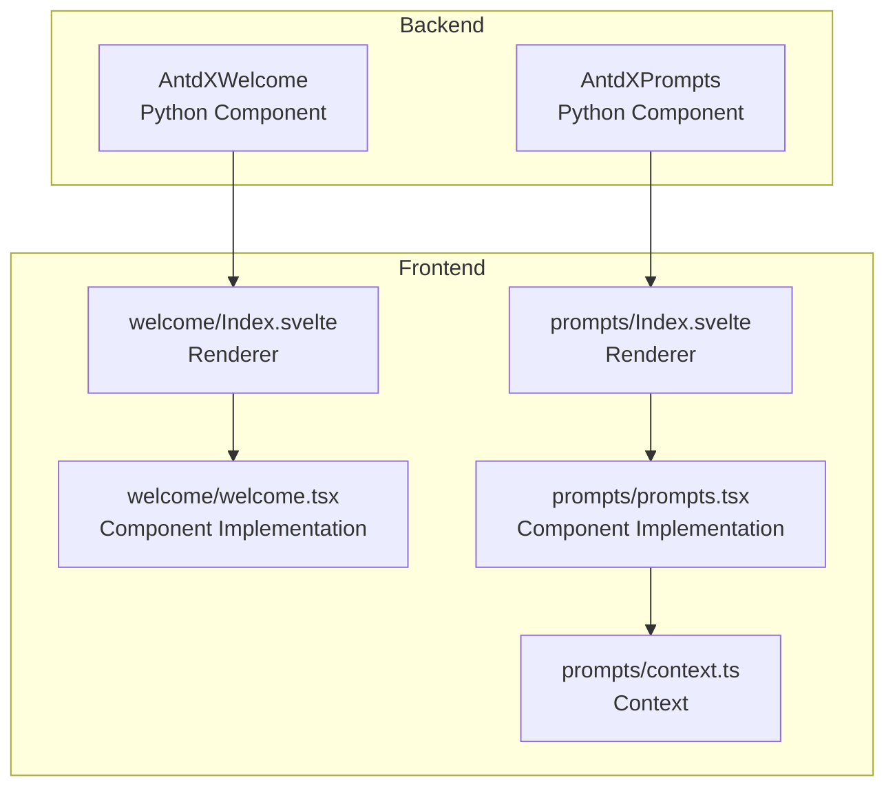
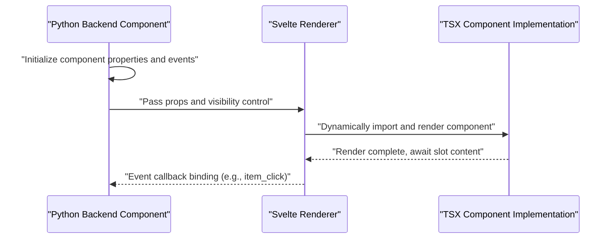
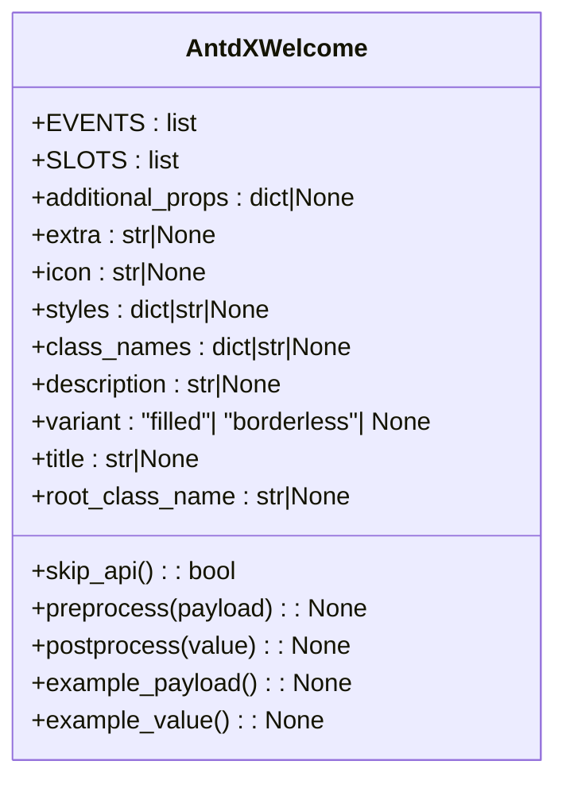
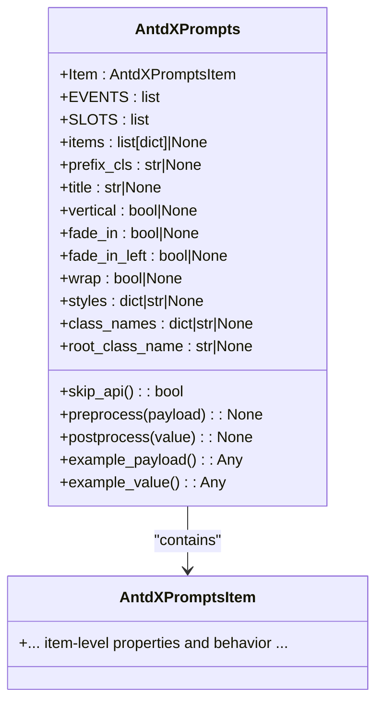
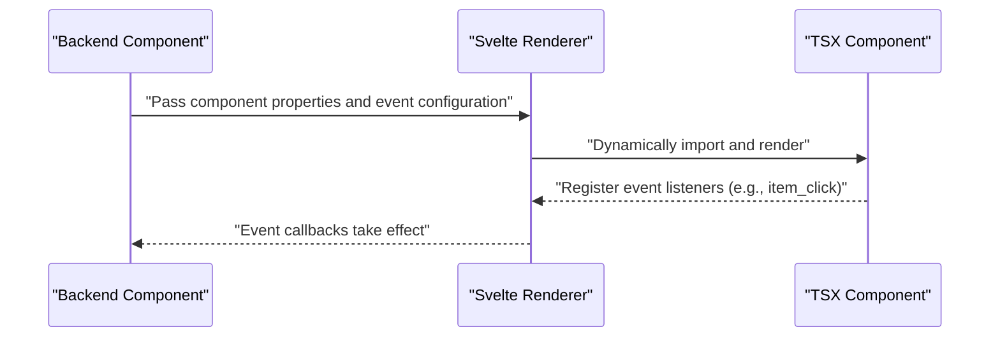
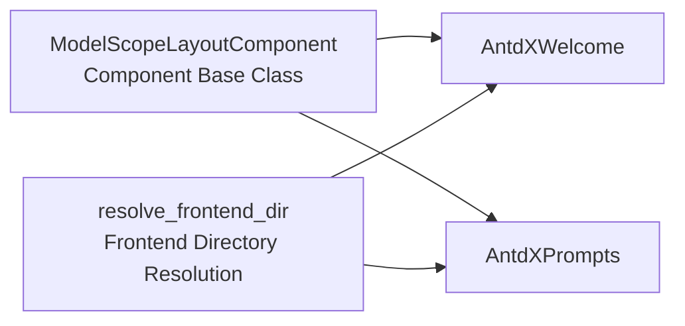

# Awakening Components API

<cite>
**Files Referenced in This Document**
- [backend/modelscope_studio/components/antdx/welcome/__init__.py](file://backend/modelscope_studio/components/antdx/welcome/__init__.py)
- [backend/modelscope_studio/components/antdx/prompts/__init__.py](file://backend/modelscope_studio/components/antdx/prompts/__init__.py)
- [frontend/antdx/welcome/Index.svelte](file://frontend/antdx/welcome/Index.svelte)
- [frontend/antdx/welcome/welcome.tsx](file://frontend/antdx/welcome/welcome.tsx)
- [frontend/antdx/prompts/Index.svelte](file://frontend/antdx/prompts/Index.svelte)
- [frontend/antdx/prompts/prompts.tsx](file://frontend/antdx/prompts/prompts.tsx)
- [frontend/antdx/prompts/context.ts](file://frontend/antdx/prompts/context.ts)
- [backend/modelscope_studio/utils/dev/component.py](file://backend/modelscope_studio/utils/dev/component.py)
- [backend/modelscope_studio/utils/dev/resolve_frontend_dir.py](file://backend/modelscope_studio/utils/dev/resolve_frontend_dir.py)
</cite>

## Table of Contents

1. [Introduction](#introduction)
2. [Project Structure](#project-structure)
3. [Core Components](#core-components)
4. [Architecture Overview](#architecture-overview)
5. [Detailed Component Analysis](#detailed-component-analysis)
6. [Dependency Analysis](#dependency-analysis)
7. [Performance Considerations](#performance-considerations)
8. [Troubleshooting Guide](#troubleshooting-guide)
9. [Conclusion](#conclusion)
10. [Appendix](#appendix)

## Introduction

This document is the Ant Design X Awakening Components API reference for ModelScope Studio, focusing on the following two components:

- Welcome Component (AntdXWelcome): Used to display welcome messages on the first load or in specific scenarios, supporting slot-based configuration for title, description, icon, and extra content.
- Prompts Component (AntdXPrompts): Used to display a set of clickable prompt cards, supporting configuration for title, vertical layout, fade-in animation, line wrapping, etc., and providing an item click event callback.

This document provides an in-depth analysis of system architecture, component relationships, data flow, processing logic, integration points, error handling, and performance characteristics, as well as lifecycle hooks, event handling, state management mechanisms, TypeScript type definitions, and interface specifications, helping developers build smooth first-time experiences and prompt guidance in AI applications.

## Project Structure

ModelScope Studio's frontend adopts the Svelte + Ant Design X component system, with the backend bridging frontend components via Python components. The Welcome and Prompts components are located in the `antdx` module; backend components handle property passing and event binding, while frontend components handle rendering and interaction.

**Chart Sources**

- [backend/modelscope_studio/components/antdx/welcome/**init**.py:8-73](file://backend/modelscope_studio/components/antdx/welcome/__init__.py#L8-L73)
- [backend/modelscope_studio/components/antdx/prompts/**init**.py:11-88](file://backend/modelscope_studio/components/antdx/prompts/__init__.py#L11-L88)
- [frontend/antdx/welcome/Index.svelte:1-72](file://frontend/antdx/welcome/Index.svelte#L1-L72)
- [frontend/antdx/welcome/welcome.tsx](file://frontend/antdx/welcome/welcome.tsx)
- [frontend/antdx/prompts/Index.svelte:1-71](file://frontend/antdx/prompts/Index.svelte#L1-L71)
- [frontend/antdx/prompts/prompts.tsx](file://frontend/antdx/prompts/prompts.tsx)
- [frontend/antdx/prompts/context.ts](file://frontend/antdx/prompts/context.ts)

**Section Sources**

- [backend/modelscope_studio/components/antdx/welcome/**init**.py:1-73](file://backend/modelscope_studio/components/antdx/welcome/__init__.py#L1-L73)
- [backend/modelscope_studio/components/antdx/prompts/**init**.py:1-88](file://backend/modelscope_studio/components/antdx/prompts/__init__.py#L1-L88)
- [frontend/antdx/welcome/Index.svelte:1-72](file://frontend/antdx/welcome/Index.svelte#L1-L72)
- [frontend/antdx/prompts/Index.svelte:1-71](file://frontend/antdx/prompts/Index.svelte#L1-L71)

## Core Components

This section provides an overview of the key responsibilities and capability boundaries of the two components:

- Welcome Component (AntdXWelcome)
  - Responsibility: Display welcome messages, supporting multiple slots (title, description, icon, extra content) with optional styles and variants.
  - Key Points: Does not expose standard API (`skip_api` is true); implemented via slots and static resource path injection.
- Prompts Component (AntdXPrompts)
  - Responsibility: Display a set of prompt cards, supporting title, vertical layout, fade-in animation, line wrapping, etc.; provides an item click event callback.
  - Key Points: Internally nested item components; event binding is configured via `EventListener`.

**Section Sources**

- [backend/modelscope_studio/components/antdx/welcome/**init**.py:8-73](file://backend/modelscope_studio/components/antdx/welcome/__init__.py#L8-L73)
- [backend/modelscope_studio/components/antdx/prompts/**init**.py:11-88](file://backend/modelscope_studio/components/antdx/prompts/__init__.py#L11-L88)

## Architecture Overview

The diagram below shows the call chain from backend components to frontend renderers to specific component implementations, as well as the event binding and slot passing mechanism.

**Chart Sources**

- [backend/modelscope_studio/components/antdx/welcome/**init**.py:55-73](file://backend/modelscope_studio/components/antdx/welcome/__init__.py#L55-L73)
- [backend/modelscope_studio/components/antdx/prompts/**init**.py:70-88](file://backend/modelscope_studio/components/antdx/prompts/__init__.py#L70-L88)
- [frontend/antdx/welcome/Index.svelte:10-72](file://frontend/antdx/welcome/Index.svelte#L10-L72)
- [frontend/antdx/prompts/Index.svelte:10-71](file://frontend/antdx/prompts/Index.svelte#L10-L71)

## Detailed Component Analysis

### Welcome Component (AntdXWelcome)

- Component Purpose: Used for first-time experience or onboarding scenarios, carrying title, description, icon, and extra content.
- Slot Support: `extra`, `icon`, `description`, `title`.
- Properties and Behavior:
  - Supports additional properties `additional_props`, styles `styles`/`class_names`, and root class name `root_class_name`.
  - The `icon` parameter is processed through static asset service (`serve_static_file`).
  - Does not expose standard API (`skip_api` is true); suitable for use through slot and static resource combinations.
- Lifecycle and Hooks:
  - `preprocess`/`postprocess`/`example_payload`/`example_value` all return null, indicating this component does not participate in regular data flow transformation.
- Typical Use Cases:
  - Welcome pages after app startup, new user onboarding, feature entry hints, etc.

**Chart Sources**

- [backend/modelscope_studio/components/antdx/welcome/**init**.py:8-73](file://backend/modelscope_studio/components/antdx/welcome/__init__.py#L8-L73)

**Section Sources**

- [backend/modelscope_studio/components/antdx/welcome/**init**.py:8-73](file://backend/modelscope_studio/components/antdx/welcome/__init__.py#L8-L73)
- [frontend/antdx/welcome/Index.svelte:1-72](file://frontend/antdx/welcome/Index.svelte#L1-L72)
- [frontend/antdx/welcome/welcome.tsx](file://frontend/antdx/welcome/welcome.tsx)

### Prompts Component (AntdXPrompts)

- Component Purpose: Display a set of prompt cards, supporting title, vertical layout, fade-in animation, line wrapping, etc.
- Internal Structure:
  - Nested item component: `AntdXPrompts.Item`.
  - Events: `item_click` (triggered when a prompt item is clicked).
- Properties and Behavior:
  - `items`: List of prompt items (array of dicts).
  - Styles and layout: `prefix_cls`, `vertical`, `fade_in`, `fade_in_left`, `wrap`.
  - Supports `additional_props`, `styles`, `class_names`, `root_class_name`.
  - Does not expose standard API (`skip_api` is true).
- Event Handling:
  - Maps click events to internal state updates (`bind_itemClick_event`) via `EventListener("item_click")`.

**Chart Sources**

- [backend/modelscope_studio/components/antdx/prompts/**init**.py:11-88](file://backend/modelscope_studio/components/antdx/prompts/__init__.py#L11-L88)

**Section Sources**

- [backend/modelscope_studio/components/antdx/prompts/**init**.py:11-88](file://backend/modelscope_studio/components/antdx/prompts/__init__.py#L11-L88)
- [frontend/antdx/prompts/Index.svelte:1-71](file://frontend/antdx/prompts/Index.svelte#L1-L71)
- [frontend/antdx/prompts/prompts.tsx](file://frontend/antdx/prompts/prompts.tsx)
- [frontend/antdx/prompts/context.ts](file://frontend/antdx/prompts/context.ts)

### Component Rendering and Event Binding Flow

The following sequence diagram shows how backend components bind events and render components through frontend renderers.

**Chart Sources**

- [backend/modelscope_studio/components/antdx/prompts/**init**.py:18-23](file://backend/modelscope_studio/components/antdx/prompts/__init__.py#L18-L23)
- [frontend/antdx/prompts/Index.svelte:10-71](file://frontend/antdx/prompts/Index.svelte#L10-L71)

## Dependency Analysis

- Component Base Class and Utilities:
  - All components inherit from `ModelScopeLayoutComponent`, uniformly handling visibility, element ID/classes, styles, and render switches.
  - Frontend directory resolution is done via `resolve_frontend_dir`, ensuring correct mapping between Python backend and Svelte frontend.
- Inter-component Coupling:
  - The Welcome and Prompts components are independent UI components with no direct dependency on each other.
  - The Prompts component's internal item component interacts with the context, but is still exposed externally as a whole component.

**Chart Sources**

- [backend/modelscope_studio/utils/dev/component.py](file://backend/modelscope_studio/utils/dev/component.py)
- [backend/modelscope_studio/utils/dev/resolve_frontend_dir.py](file://backend/modelscope_studio/utils/dev/resolve_frontend_dir.py)
- [backend/modelscope_studio/components/antdx/welcome/**init**.py:55-55](file://backend/modelscope_studio/components/antdx/welcome/__init__.py#L55-L55)
- [backend/modelscope_studio/components/antdx/prompts/**init**.py:70-70](file://backend/modelscope_studio/components/antdx/prompts/__init__.py#L70-L70)

**Section Sources**

- [backend/modelscope_studio/utils/dev/component.py](file://backend/modelscope_studio/utils/dev/component.py)
- [backend/modelscope_studio/utils/dev/resolve_frontend_dir.py](file://backend/modelscope_studio/utils/dev/resolve_frontend_dir.py)
- [backend/modelscope_studio/components/antdx/welcome/**init**.py:55-55](file://backend/modelscope_studio/components/antdx/welcome/__init__.py#L55-L55)
- [backend/modelscope_studio/components/antdx/prompts/**init**.py:70-70](file://backend/modelscope_studio/components/antdx/prompts/__init__.py#L70-L70)

## Performance Considerations

- Rendering Strategy
  - Components are rendered via dynamic import, avoiding first-screen blocking and improving initial load performance.
- Event Binding
  - Events are only bound when needed, and unnecessary re-renders are reduced through internal state updates.
- Resource Handling
  - Static resources such as icons are handled via `serve_static_file`; caching and preloading are recommended for optimizing user experience.

[This section provides general guidance and requires no specific file sources]

## Troubleshooting Guide

- Component Not Displaying
  - Check whether `visible`, `elem_id`, `elem_classes`, `elem_style` are correctly set.
  - Confirm the render switch `render` is true.
- Slot Content Not Taking Effect
  - Confirm slot names match the component's supported `SLOTS` list (Welcome: `extra`, `icon`, `description`, `title`; Prompts: `title`, `items`).
- Event Not Firing
  - Confirm event listeners are correctly configured (Prompts component's `item_click`).
- Icon or Static Resources Cannot Load
  - Confirm the `icon` path is valid and `serve_static_file` is working properly.

**Section Sources**

- [backend/modelscope_studio/components/antdx/welcome/**init**.py:14-15](file://backend/modelscope_studio/components/antdx/welcome/__init__.py#L14-L15)
- [backend/modelscope_studio/components/antdx/prompts/**init**.py:25-26](file://backend/modelscope_studio/components/antdx/prompts/__init__.py#L25-L26)
- [backend/modelscope_studio/components/antdx/prompts/**init**.py:18-23](file://backend/modelscope_studio/components/antdx/prompts/__init__.py#L18-L23)

## Conclusion

AntdXWelcome and AntdXPrompts serve as the core components for "welcome onboarding" and "prompt guidance" respectively in ModelScope Studio. The former achieves flexible welcome page display through slots and static resources; the latter provides efficient prompt word guidance through item click events and layout configuration. Both use dynamic rendering and event binding mechanisms, with good extensibility and maintainability. Combined with the type definitions, interface specifications, and best practices provided in this document, developers can quickly build consistent and smooth first-time experience and prompt guidance flows in AI applications.

[This section is a summary and requires no specific file sources]

## Appendix

### TypeScript Type Definitions and Interface Specifications

- Welcome Component (AntdXWelcome)
  - Supported Properties: `additional_props`, `extra`, `icon`, `styles`, `class_names`, `description`, `variant`, `title`, `root_class_name`, `as_item`, `visible`, `elem_id`, `elem_classes`, `elem_style`, `render`.
  - Slots: `extra`, `icon`, `description`, `title`.
  - Events: None.
  - Lifecycle Hooks: `preprocess`/`postprocess`/`example_payload`/`example_value` return null.
- Prompts Component (AntdXPrompts)
  - Supported Properties: `items`, `prefix_cls`, `title`, `vertical`, `fade_in`, `fade_in_left`, `wrap`, `styles`, `class_names`, `root_class_name`, `additional_props`, `as_item`, `visible`, `elem_id`, `elem_classes`, `elem_style`, `render`.
  - Slots: `title`, `items`.
  - Events: `item_click` (triggered when a prompt item is clicked).
  - Lifecycle Hooks: `preprocess`/`postprocess`/`example_payload`/`example_value` return null.

**Section Sources**

- [backend/modelscope_studio/components/antdx/welcome/**init**.py:17-54](file://backend/modelscope_studio/components/antdx/welcome/__init__.py#L17-L54)
- [backend/modelscope_studio/components/antdx/welcome/**init**.py:14-15](file://backend/modelscope_studio/components/antdx/welcome/__init__.py#L14-L15)
- [backend/modelscope_studio/components/antdx/welcome/**init**.py:61-69](file://backend/modelscope_studio/components/antdx/welcome/__init__.py#L61-L69)
- [backend/modelscope_studio/components/antdx/prompts/**init**.py:28-68](file://backend/modelscope_studio/components/antdx/prompts/__init__.py#L28-L68)
- [backend/modelscope_studio/components/antdx/prompts/**init**.py:25-26](file://backend/modelscope_studio/components/antdx/prompts/__init__.py#L25-L26)
- [backend/modelscope_studio/components/antdx/prompts/**init**.py:76-87](file://backend/modelscope_studio/components/antdx/prompts/__init__.py#L76-L87)

### Integration with Conversation Systems

- The Prompts component can serve as a guidance layer before conversation input; after the user clicks a prompt item, the upper-level business logic injects the prompt content into the conversation input field or directly initiates a conversation request.
- The Welcome component can serve as the entry point hint for a conversation session, deciding whether to display it based on context state.

[This section is a conceptual explanation and requires no specific file sources]

### Best Practices

- Welcome Component
  - Use slots to organize title, description, and icon for clear visual hierarchy.
  - For multilingual scenarios, pass `title` and `description` through an external copy management module.
- Prompts Component
  - Set `vertical`, `fade_in`, `fade_in_left`, `wrap` appropriately to adapt to different screen sizes and interaction paces.
  - Provide clear semantic labels for each prompt item to facilitate accessibility and SEO.
- Event Handling
  - Perform the minimum necessary operations in the `item_click` callback (such as writing the prompt content to the input field) to avoid blocking the UI.
- State Management
  - Decouple the visibility of the Prompts collection from the current conversation state, allowing reuse across different pages or views.

[This section provides general guidance and requires no specific file sources]
