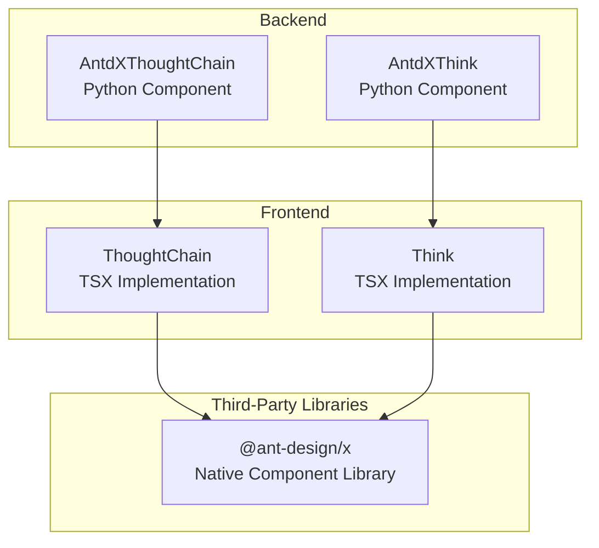
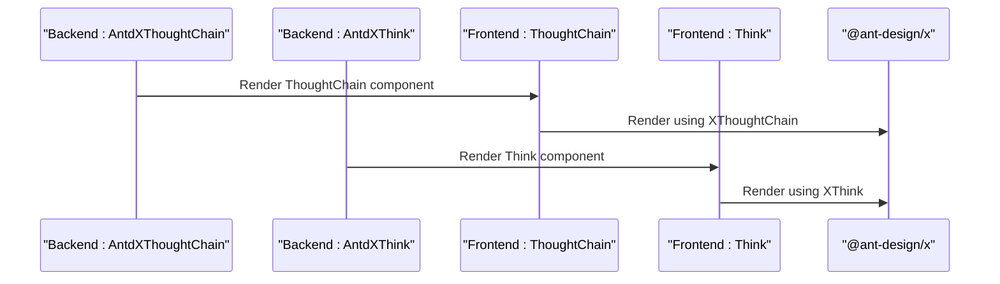
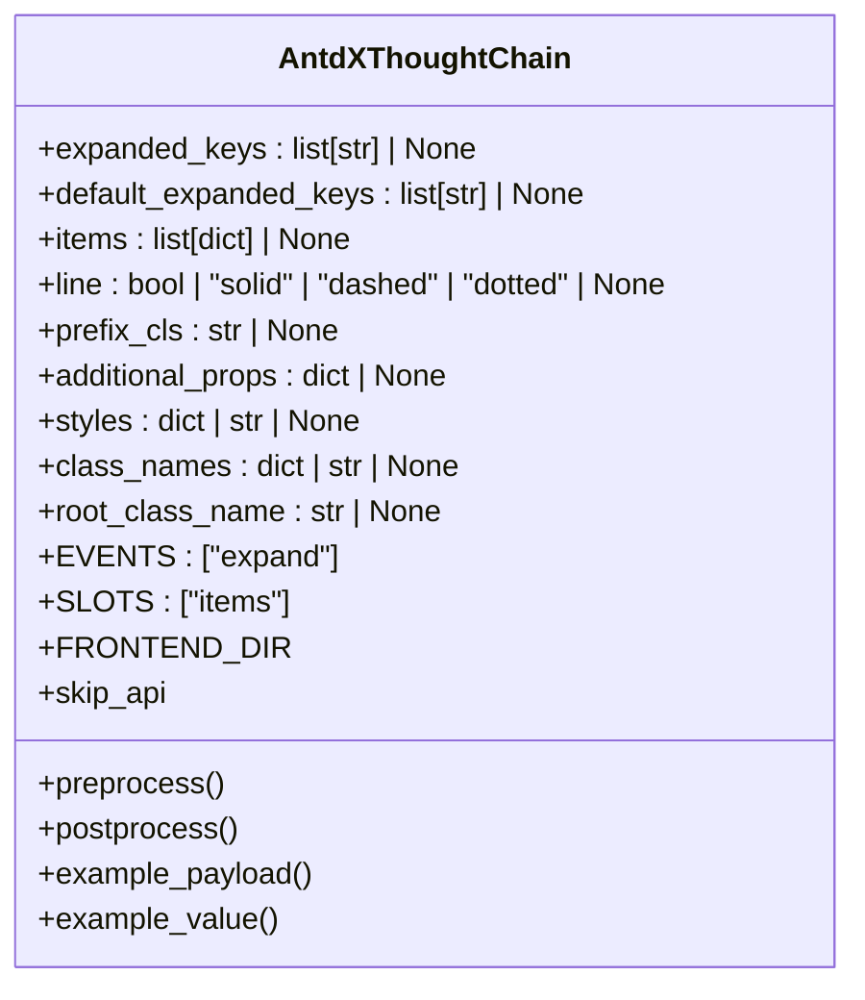
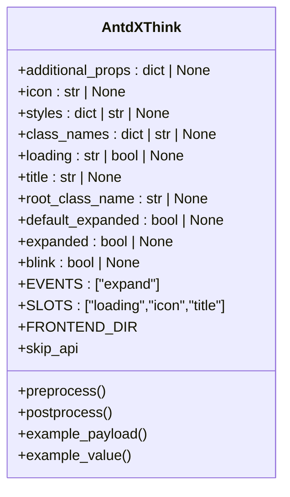
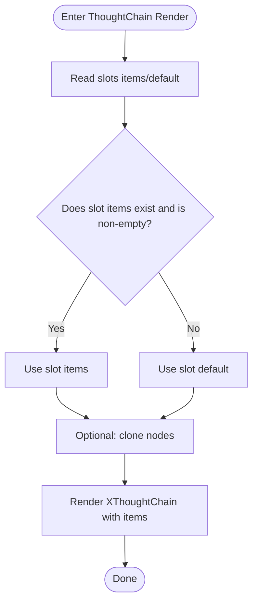
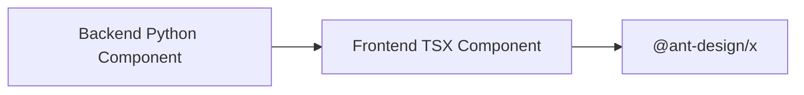

# Confirmation Components API

<cite>
**Files Referenced in This Document**
- [thought_chain/__init__.py](file://backend/modelscope_studio/components/antdx/thought_chain/__init__.py)
- [think/__init__.py](file://backend/modelscope_studio/components/antdx/think/__init__.py)
- [thought-chain.tsx](file://frontend/antdx/thought-chain/thought-chain.tsx)
- [think.tsx](file://frontend/antdx/think/think.tsx)
</cite>

## Table of Contents

1. [Introduction](#introduction)
2. [Project Structure](#project-structure)
3. [Core Components](#core-components)
4. [Architecture Overview](#architecture-overview)
5. [Detailed Component Analysis](#detailed-component-analysis)
6. [Dependency Analysis](#dependency-analysis)
7. [Performance Considerations](#performance-considerations)
8. [Troubleshooting Guide](#troubleshooting-guide)
9. [Conclusion](#conclusion)
10. [Appendix](#appendix)

## Introduction

This document is the Ant Design X Confirmation Components API reference for ModelScope Studio, focusing on the complete interface and behavioral specifications of the ThoughtChain component and the Think component. Content includes:

- Component property, event, and slot definitions
- Visualization and node management mechanisms for the thinking process
- Confirmation flow control and state management
- Integration recommendations for AI reasoning processes and decision display scenarios
- TypeScript type and interface specifications
- Best practices and common issue troubleshooting

## Project Structure

Ant Design X components are wrapped by Python component packages on the backend and bridged to the native `@ant-design/x` implementation on the frontend via Svelte/React hybrid bridging. Core file organization:

- Backend Python wrapper: Located under `backend/modelscope_studio/components/antdx`, providing Python component classes for ThoughtChain and Think respectively
- Frontend implementation: Located under `frontend/antdx`, providing TSX implementations for `thought-chain` and `think` respectively

Chart Sources

- [thought_chain/**init**.py:12-86](file://backend/modelscope_studio/components/antdx/thought_chain/__init__.py#L12-L86)
- [think/**init**.py:8-79](file://backend/modelscope_studio/components/antdx/think/__init__.py#L8-L79)
- [thought-chain.tsx:1-43](file://frontend/antdx/thought-chain/thought-chain.tsx#L1-L43)
- [think.tsx:1-24](file://frontend/antdx/think/think.tsx#L1-L24)

Section Sources

- [thought_chain/**init**.py:12-86](file://backend/modelscope_studio/components/antdx/thought_chain/__init__.py#L12-L86)
- [think/**init**.py:8-79](file://backend/modelscope_studio/components/antdx/think/__init__.py#L8-L79)
- [thought-chain.tsx:1-43](file://frontend/antdx/thought-chain/thought-chain.tsx#L1-L43)
- [think.tsx:1-24](file://frontend/antdx/think/think.tsx#L1-L24)

## Core Components

This section provides an overview of the responsibilities and capability boundaries of the two core components:

- ThoughtChain: Used to visually display a sequence of reasoning or decision-making nodes in tree/list form, supporting expand/collapse, connector styles, and node collection management
- Think: Used to encapsulate a single thought unit, supporting title, icon, loading state, and expandable state, with slot extension points

Section Sources

- [thought_chain/**init**.py:12-86](file://backend/modelscope_studio/components/antdx/thought_chain/__init__.py#L12-L86)
- [think/**init**.py:8-79](file://backend/modelscope_studio/components/antdx/think/__init__.py#L8-L79)

## Architecture Overview

The diagram below shows the call chain from backend Python components to frontend TSX implementations to `@ant-design/x` native components.

Chart Sources

- [thought_chain/**init**.py:68-86](file://backend/modelscope_studio/components/antdx/thought_chain/__init__.py#L68-L86)
- [think/**init**.py:61-79](file://backend/modelscope_studio/components/antdx/think/__init__.py#L61-L79)
- [thought-chain.tsx:11-43](file://frontend/antdx/thought-chain/thought-chain.tsx#L11-L43)
- [think.tsx:6-24](file://frontend/antdx/think/think.tsx#L6-L24)

## Detailed Component Analysis

### ThoughtChain Component

- Component Purpose: Used to present "thought chain"-style data flows or decision sequences, supporting node collections (`items`), expanded keys (`expanded_keys`), default expanded keys (`default_expanded_keys`), connector styles (`line`), etc.
- Slots: Supports `items` slot for injecting node collections
- Events: `expand` event, triggered when expanded keys change
- Property Notes:
  - `expanded_keys` / `default_expanded_keys`: Control node expand state
  - `items`: Node data collection, can be passed via slot or property
  - `line`: Connector style, supports boolean values and specific string enumerations
  - `prefix_cls` / `styles` / `class_names` / `root_class_name`: Style and class name customization
  - Other general properties: `visible`, `elem_id`, `elem_classes`, `elem_style`, `render`, etc.

Chart Sources

- [thought_chain/**init**.py:30-86](file://backend/modelscope_studio/components/antdx/thought_chain/__init__.py#L30-L86)

Section Sources

- [thought_chain/**init**.py:12-86](file://backend/modelscope_studio/components/antdx/thought_chain/__init__.py#L12-L86)
- [thought-chain.tsx:11-43](file://frontend/antdx/thought-chain/thought-chain.tsx#L11-L43)

### Think Component

- Component Purpose: Used to encapsulate a single thought unit, supporting title (`title`), icon (`icon`), loading state (`loading`), default expanded (`default_expanded`), current expanded (`expanded`), and blink (`blink`), etc.
- Slots: Supports `loading`, `icon`, and `title` slots for custom rendering
- Events: `expand` event, for expanded state change notifications
- Property Notes:
  - `icon` / `title` / `loading`: Basic display properties
  - `default_expanded` / `expanded`: Expand state control
  - `blink`: Visual indicator
  - Other general properties: `visible`, `elem_id`, `elem_classes`, `elem_style`, `render`, etc.

Chart Sources

- [think/**init**.py:21-79](file://backend/modelscope_studio/components/antdx/think/__init__.py#L21-L79)

Section Sources

- [think/**init**.py:8-79](file://backend/modelscope_studio/components/antdx/think/__init__.py#L8-L79)
- [think.tsx:6-24](file://frontend/antdx/think/think.tsx#L6-L24)

### Frontend Implementation and Slot Mechanism

- The ThoughtChain frontend implementation reads slot `items`/`default` via context and clones nodes when necessary to avoid side effects; finally passes the parsed `items` to `@ant-design/x`'s `XThoughtChain`
- The Think frontend implementation injects `slots.loading`/`icon`/`title` into `@ant-design/x`'s `XThink` via `ReactSlot`; falls back to property values if no slot is provided

Chart Sources

- [thought-chain.tsx:14-39](file://frontend/antdx/thought-chain/thought-chain.tsx#L14-L39)

Section Sources

- [thought-chain.tsx:1-43](file://frontend/antdx/thought-chain/thought-chain.tsx#L1-L43)
- [think.tsx:6-24](file://frontend/antdx/think/think.tsx#L6-L24)

## Dependency Analysis

- Backend Python components are only responsible for declaring properties, events, slots, and frontend directory mappings; they do not directly handle business logic
- Frontend TSX components are responsible for:
  - Parsing slots and properties, merging them into the props required by `@ant-design/x`
  - Bridging to the React ecosystem via `sveltify`
- Third-party library `@ant-design/x` provides the actual UI behavior and styles

Chart Sources

- [thought_chain/**init**.py:68-86](file://backend/modelscope_studio/components/antdx/thought_chain/__init__.py#L68-L86)
- [think/**init**.py:61-79](file://backend/modelscope_studio/components/antdx/think/__init__.py#L61-L79)
- [thought-chain.tsx:1-43](file://frontend/antdx/thought-chain/thought-chain.tsx#L1-L43)
- [think.tsx:1-24](file://frontend/antdx/think/think.tsx#L1-L24)

Section Sources

- [thought_chain/**init**.py:12-86](file://backend/modelscope_studio/components/antdx/thought_chain/__init__.py#L12-L86)
- [think/**init**.py:8-79](file://backend/modelscope_studio/components/antdx/think/__init__.py#L8-L79)
- [thought-chain.tsx:1-43](file://frontend/antdx/thought-chain/thought-chain.tsx#L1-L43)
- [think.tsx:1-24](file://frontend/antdx/think/think.tsx#L1-L24)

## Performance Considerations

- Node Cloning: The frontend clones slot nodes when necessary to avoid side effects from shared references, but this increases memory and computation overhead. Use with caution when the number of nodes is large
- Slot Parsing: Prioritize using the `items` slot, falling back to the `default` slot, to reduce unnecessary property passing
- Expand State: Set `expanded_keys`/`default_expanded_keys` appropriately to avoid expanding too many nodes at once, which causes rendering pressure
- Loading State: The Think component's `loading` slot/property should be enabled on demand to avoid redundant animations and DOM structure

## Troubleshooting Guide

- Slot Not Taking Effect
  - Check whether the `items`/`default` slot is used correctly; confirm slot name casing and ordering
  - If using the `items` property, ensure the type matches `@ant-design/x`'s expectations
- Expand Event Not Working
  - Confirm the `expand` event is bound; check whether `bind_expand_event` or related state is updated in the callback
- Loading State and Slot Conflict
  - When a `loading` slot is provided, the slot takes priority over the property; if no slot is provided, it falls back to the property value
- Styles and Class Names
  - To override styles, prefer using `styles`/`class_names`/`root_class_name`; watch for conflicts with the third-party library's default styles

Section Sources

- [thought-chain.tsx:14-39](file://frontend/antdx/thought-chain/thought-chain.tsx#L14-L39)
- [think.tsx:10-17](file://frontend/antdx/think/think.tsx#L10-L17)
- [thought_chain/**init**.py:20-25](file://backend/modelscope_studio/components/antdx/thought_chain/__init__.py#L20-L25)
- [think/**init**.py:12-16](file://backend/modelscope_studio/components/antdx/think/__init__.py#L12-L16)

## Conclusion

- ThoughtChain and Think components provide a stable foundation for visualizing AI reasoning and decision-making processes through their clear property, event, and slot design
- For large-scale node scenarios, it is recommended to optimize slot usage and expand strategies, combining loading states and style customization to enhance the user experience
- Through `expand` events and expand state control, interactive confirmation flows and step-by-step displays can be implemented

## Appendix

### API Specifications and Type Definitions (Based on Source Code)

- AntdXThoughtChain
  - Properties
    - `expanded_keys`: List, node expand keys
    - `default_expanded_keys`: List, initial expand keys
    - `items`: List, node data
    - `line`: Boolean or specific string, connector style
    - `prefix_cls`: String, prefix class name
    - `additional_props`/`styles`/`class_names`/`root_class_name`: Style and class name customization
    - `visible`/`elem_id`/`elem_classes`/`elem_style`/`render`: General properties
  - Events
    - `expand`: Expand key change callback
  - Slots
    - `items`: Node collection
- AntdXThink
  - Properties
    - `icon`/`title`/`loading`: Icon, title, loading state
    - `default_expanded`/`expanded`: Default/current expand state
    - `blink`: Blink effect
    - `styles`/`class_names`/`root_class_name`: Style and class name customization
    - `visible`/`elem_id`/`elem_classes`/`elem_style`/`render`: General properties
  - Events
    - `expand`: Expand state change callback
  - Slots
    - `loading`/`icon`/`title`: Slot alternatives to the corresponding properties

Section Sources

- [thought_chain/**init**.py:30-86](file://backend/modelscope_studio/components/antdx/thought_chain/__init__.py#L30-L86)
- [think/**init**.py:21-79](file://backend/modelscope_studio/components/antdx/think/__init__.py#L21-L79)

### Integration and Best Practices

- Reasoning Process Visualization
  - Use ThoughtChain to display multi-step reasoning/decision sequences; each Think represents a single thought unit
  - Control step-by-step display via `expand`, combined with the `loading` slot to indicate thinking in progress
- User Understanding Optimization
  - Use the `line` connector style and `prefix_cls` appropriately to enhance hierarchical sense
  - Use `icon`/`title` in Think to clarify roles and intent; use `blink` when attention is needed
- State Management and Flow Control
  - Manage node expansion via `expanded_keys`/`default_expanded_keys`; drive subsequent steps via `expand` events
  - For long chains, consider pagination/segmented loading to avoid rendering too many nodes at once
