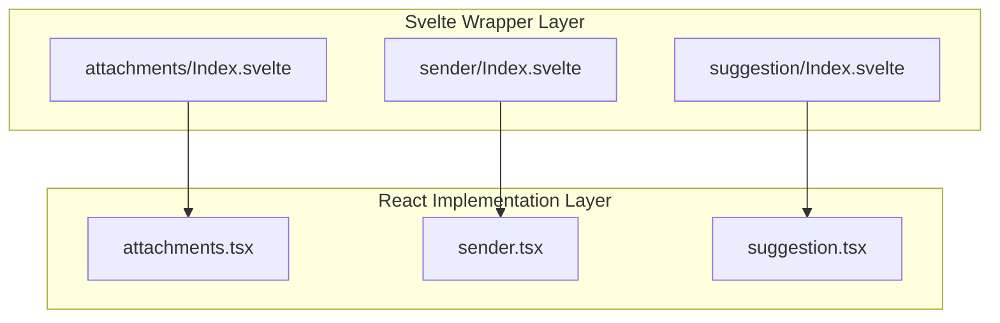
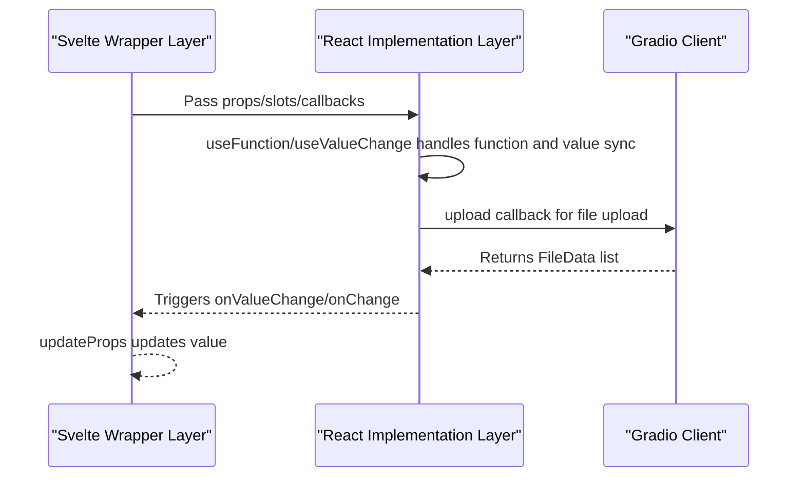
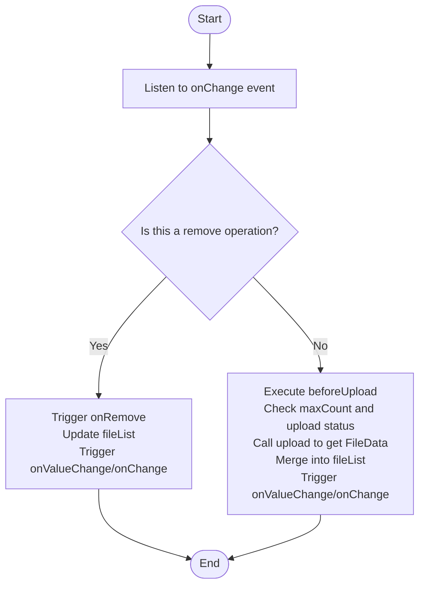
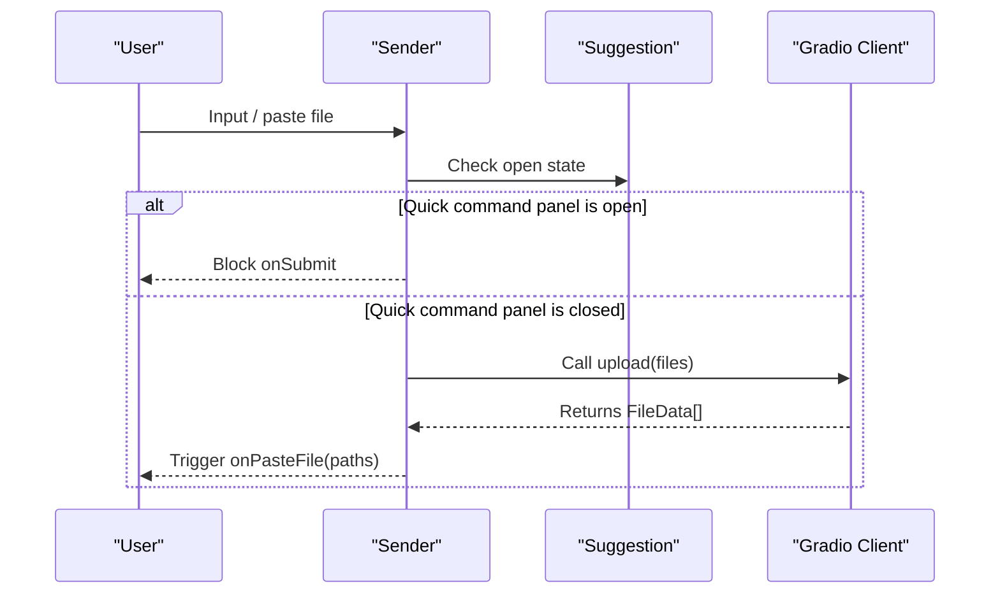
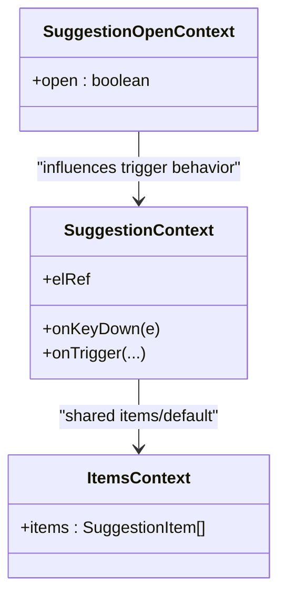
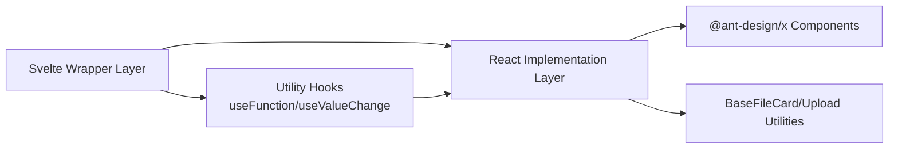

# Expression Components API

<cite>
**Files Referenced in This Document**
- [frontend/antdx/attachments/Index.svelte](file://frontend/antdx/attachments/Index.svelte)
- [frontend/antdx/attachments/attachments.tsx](file://frontend/antdx/attachments/attachments.tsx)
- [frontend/antdx/sender/Index.svelte](file://frontend/antdx/sender/Index.svelte)
- [frontend/antdx/sender/sender.tsx](file://frontend/antdx/sender/sender.tsx)
- [frontend/antdx/suggestion/Index.svelte](file://frontend/antdx/suggestion/Index.svelte)
- [frontend/antdx/suggestion/suggestion.tsx](file://frontend/antdx/suggestion/suggestion.tsx)
- [frontend/antdx/suggestion/context.ts](file://frontend/antdx/suggestion/context.ts)
- [frontend/antdx/file-card/base.tsx](file://frontend/antdx/file-card/base.tsx)
- [frontend/utils/hooks/useFunction.ts](file://frontend/utils/hooks/useFunction.ts)
- [frontend/utils/hooks/useValueChange.ts](file://frontend/utils/hooks/useValueChange.ts)
- [docs/components/antdx/attachments/README.md](file://docs/components/antdx/attachments/README.md)
- [docs/components/antdx/sender/README.md](file://docs/components/antdx/sender/README.md)
- [docs/components/antdx/suggestion/README.md](file://docs/components/antdx/suggestion/README.md)
</cite>

## Table of Contents

1. [Introduction](#introduction)
2. [Project Structure](#project-structure)
3. [Core Components](#core-components)
4. [Architecture Overview](#architecture-overview)
5. [Detailed Component Analysis](#detailed-component-analysis)
6. [Dependency Analysis](#dependency-analysis)
7. [Performance Considerations](#performance-considerations)
8. [Troubleshooting Guide](#troubleshooting-guide)
9. [Conclusion](#conclusion)
10. [Appendix](#appendix)

## Introduction

This document is the API reference for Ant Design X Expression Components in ModelScope Studio, focusing on the following three components:

- Attachments Component: For displaying and uploading files/images and other attachments in multimodal input
- Sender Component: For chat message input, quick command triggering, and paste upload
- Suggestion Component: For providing selectable suggestion items within an input field

The document covers component property interfaces, event callbacks, data binding, state synchronization, TypeScript type definitions, integration with the chat system, and best practices for multimodal data processing and user input optimization.

## Project Structure

- Components are organized with a Svelte wrapper layer (`Index.svelte`) + React implementation layer (`*.tsx`), bridging Ant Design X React components as Svelte components via `svelte-preprocess-react`.
- The Attachments component supports custom placeholder images, preview containers, icon rendering, list item rendering, and other slot extensions; the Sender component supports prefix/suffix/header/footer slots, skill panels, and paste upload; the Suggestion component supports dynamic item rendering and keyboard trigger control.

Chart Sources

- [frontend/antdx/attachments/Index.svelte:1-98](file://frontend/antdx/attachments/Index.svelte#L1-L98)
- [frontend/antdx/sender/Index.svelte:1-102](file://frontend/antdx/sender/Index.svelte#L1-L102)
- [frontend/antdx/suggestion/Index.svelte:1-75](file://frontend/antdx/suggestion/Index.svelte#L1-L75)
- [frontend/antdx/attachments/attachments.tsx:1-413](file://frontend/antdx/attachments/attachments.tsx#L1-L413)
- [frontend/antdx/sender/sender.tsx:1-174](file://frontend/antdx/sender/sender.tsx#L1-L174)
- [frontend/antdx/suggestion/suggestion.tsx:1-165](file://frontend/antdx/suggestion/suggestion.tsx#L1-L165)

Section Sources

- [frontend/antdx/attachments/Index.svelte:1-98](file://frontend/antdx/attachments/Index.svelte#L1-L98)
- [frontend/antdx/sender/Index.svelte:1-102](file://frontend/antdx/sender/Index.svelte#L1-L102)
- [frontend/antdx/suggestion/Index.svelte:1-75](file://frontend/antdx/suggestion/Index.svelte#L1-L75)

## Core Components

- Attachments Component
  - Responsibility: Display and manage attachment lists, supporting drag-and-drop/click upload, count limits, placeholder images, preview configuration, custom rendering, and icon slots.
  - Key Properties: `items`, `maxCount`, `placeholder`, `imageProps`, `showUploadList`, `beforeUpload`, `customRequest`, `isImageUrl`, `itemRender`, `iconRender`, `getDropContainer`, `progress`, `onChange`/`onValueChange`, `upload`.
  - Data Flow: Receives `items` and maintains a local `fileList`; `onChange`/`onValueChange` syncs external values; the `upload` callback handles file uploading and backfills `uid`.
- Sender Component
  - Responsibility: Chat input field supporting text input, paste upload, quick command panel, prefix/suffix and header/footer slots, submission interception, and coordination.
  - Key Properties: `value`, `onValueChange`, `onChange`, `onSubmit`, `suffix`/`header`/`prefix`/`footer`, `skill`, `slotConfig`, `onPasteFile`, `upload`.
  - Data Flow: Uses `useValueChange` to sync external `value`; when the quick command panel is open, `onSubmit` is not triggered; when pasting files, file path arrays are obtained via `upload`.
- Suggestion Component
  - Responsibility: Provides selectable suggestion items within an input field, supporting dynamic `items` rendering, slot extensions, keyboard trigger control, and popup container configuration.
  - Key Properties: `items`, `open`, `onOpenChange`, `getPopupContainer`, `shouldTrigger`, `children` slot.
  - Data Flow: Maintains `open` state internally; merges `items` from slots and props; shares state with subtree via `SuggestionOpenContext`.

Section Sources

- [frontend/antdx/attachments/attachments.tsx:36-410](file://frontend/antdx/attachments/attachments.tsx#L36-L410)
- [frontend/antdx/sender/sender.tsx:18-171](file://frontend/antdx/sender/sender.tsx#L18-L171)
- [frontend/antdx/suggestion/suggestion.tsx:64-162](file://frontend/antdx/suggestion/suggestion.tsx#L64-L162)

## Architecture Overview

The diagram below shows the bridging relationship and data flow between the three components across Svelte and React layers.

Chart Sources

- [frontend/antdx/attachments/Index.svelte:77-92](file://frontend/antdx/attachments/Index.svelte#L77-L92)
- [frontend/antdx/sender/Index.svelte:71-78](file://frontend/antdx/sender/Index.svelte#L71-L78)
- [frontend/antdx/attachments/attachments.tsx:329-348](file://frontend/antdx/attachments/attachments.tsx#L329-L348)
- [frontend/antdx/sender/sender.tsx:135-138](file://frontend/antdx/sender/sender.tsx#L135-L138)

## Detailed Component Analysis

### Attachments Component

- Types and Interfaces
  - Exported types: Based on `@ant-design/x`'s `AttachmentsProps`, with additional declarations for `onValueChange`, `onChange`, `upload`, `items`, etc.
  - Supported slot keys: `showUploadList.extra`, `showUploadList.previewIcon`, `showUploadList.removeIcon`, `showUploadList.downloadIcon`, `iconRender`, `itemRender`, `placeholder`, `placeholder.title`, `placeholder.description`, `placeholder.icon`, `imageProps.placeholder`, `imageProps.preview.mask`, `imageProps.preview.closeIcon`, `imageProps.preview.toolbarRender`, `imageProps.preview.imageRender`.
- Upload Flow
  - In `onChange`, distinguishes between add/remove operations: on add, executes `beforeUpload` first, then calls `upload` to get `FileData`, merges into `fileList`, and finally triggers `onValueChange`.
  - On remove, if not currently uploading, triggers `onRemove` and updates the value.
- Configuration Notes
  - `maxCount` controls single/multi-file upload strategy.
  - `imageProps.preview` supports custom `mask`/`closeIcon`/`toolbarRender`/`imageRender`, or completely disables preview.
  - `placeholder` supports object-based configuration combined with slots.
  - `showUploadList` supports object-based configuration combined with slots, injecting `downloadIcon`/`removeIcon`/`previewIcon`/`extra` separately.
- Events and State
  - `onValueChange`: Returns `FileData[]`, for external value binding.
  - `onChange`: Returns string path arrays, for downstream processing by path.
  - `upload`: `Promise<(FileData|null)[]>`, must preserve the original file `uid` for subsequent matching.

Chart Sources

- [frontend/antdx/attachments/attachments.tsx:275-354](file://frontend/antdx/attachments/attachments.tsx#L275-L354)

Section Sources

- [frontend/antdx/attachments/attachments.tsx:36-410](file://frontend/antdx/attachments/attachments.tsx#L36-L410)
- [frontend/antdx/attachments/Index.svelte:72-92](file://frontend/antdx/attachments/Index.svelte#L72-L92)

### Sender Component

- Types and Interfaces
  - Exported types: Based on `@ant-design/x`'s `SenderProps`, with additional declarations for `onValueChange`, `upload`, `onPasteFile`, etc.
  - Slot keys: `suffix`, `header`, `prefix`, `footer`, `skill.title`, `skill.toolTip.title`, `skill.closable.closeIcon`.
  - `slotConfig`: Supports `formatResult`/`customRender` function wrapping.
- Submission Flow
  - `onSubmit` is intercepted: when the quick command panel is open, submission is blocked to avoid accidental triggers.
  - `onChange` syncs the internal `value` and triggers the external `onChange`.
- Paste Upload
  - `onPasteFile`: Reads clipboard files, calls `upload` to get a `FileData` array, and passes the path array back to `onPasteFile`.
- Events and State
  - `onValueChange`: When the external `value` changes, `useValueChange` syncs the internal state.
  - `onChange`: Real-time change notification.
  - `upload`: `Promise<FileData[]>`, used for paste upload and external extensions.

Chart Sources

- [frontend/antdx/sender/sender.tsx:126-138](file://frontend/antdx/sender/sender.tsx#L126-L138)
- [frontend/antdx/suggestion/suggestion.tsx:135-140](file://frontend/antdx/suggestion/suggestion.tsx#L135-L140)

Section Sources

- [frontend/antdx/sender/sender.tsx:18-171](file://frontend/antdx/sender/sender.tsx#L18-L171)
- [frontend/antdx/sender/Index.svelte:71-78](file://frontend/antdx/sender/Index.svelte#L71-L78)

### Suggestion Component

- Types and Interfaces
  - Exported types: Based on `@ant-design/x`'s `SuggestionProps`, with additional `shouldTrigger` and `children` slot declarations.
  - Internal context: `SuggestionContext`/`SuggestionOpenContext`, passes trigger logic and `open` state to the subtree.
  - Context items: `withItemsContextProvider` injects `items`/`default`, supporting merging of slots and props.
- Trigger Mechanism
  - `shouldTrigger`: Allows custom keyboard event trigger logic, combined with `onTrigger`/`onKeyDown`.
  - `open`/`onOpenChange`: Controlled/uncontrolled mode switching, defaults to `false` internally.
- Slots and Rendering
  - `children` slot: Acts as the render container, rendered with `ReactSlot`.
  - `items`: Supports functional and static arrays; internally extends sub-item `extra`/`icon`/`label`, etc. via `renderItems`/`patchSlots`.

Chart Sources

- [frontend/antdx/suggestion/suggestion.tsx:22-62](file://frontend/antdx/suggestion/suggestion.tsx#L22-L62)
- [frontend/antdx/suggestion/suggestion.tsx:131-160](file://frontend/antdx/suggestion/suggestion.tsx#L131-L160)
- [frontend/antdx/suggestion/context.ts:1-7](file://frontend/antdx/suggestion/context.ts#L1-L7)

Section Sources

- [frontend/antdx/suggestion/suggestion.tsx:64-162](file://frontend/antdx/suggestion/suggestion.tsx#L64-L162)
- [frontend/antdx/suggestion/context.ts:1-7](file://frontend/antdx/suggestion/context.ts#L1-L7)

## Dependency Analysis

- Component Bridging
  - The Svelte wrapper layer dynamically loads the React implementation layer via `importComponent`, uniformly handling props, slots, and callbacks.
  - Uses `processProps` to map camelCase names to React-expected property names (e.g., `keyPress` → `keyPress`).
- Utilities and Hooks
  - `useFunction`: Converts incoming functions/slots to stable functions, avoiding re-renders.
  - `useValueChange`: Maintains value synchronization between controlled and uncontrolled modes, ensuring external `value` changes correctly reflect in internal state.
- File Processing
  - `BaseFileCard`: Uniformly parses file `src`, supporting strings and `FileData`, and automatically concatenates accessible URLs.
  - The Attachments component internally handles compatibility between `FileData` and `UploadFile`, ensuring `uid` consistency.

Chart Sources

- [frontend/antdx/attachments/Index.svelte:28-56](file://frontend/antdx/attachments/Index.svelte#L28-L56)
- [frontend/antdx/sender/Index.svelte:35-66](file://frontend/antdx/sender/Index.svelte#L35-L66)
- [frontend/antdx/suggestion/Index.svelte:26-54](file://frontend/antdx/suggestion/Index.svelte#L26-L54)
- [frontend/utils/hooks/useFunction.ts:5-12](file://frontend/utils/hooks/useFunction.ts#L5-L12)
- [frontend/utils/hooks/useValueChange.ts:9-29](file://frontend/utils/hooks/useValueChange.ts#L9-L29)
- [frontend/antdx/file-card/base.tsx:15-41](file://frontend/antdx/file-card/base.tsx#L15-L41)

Section Sources

- [frontend/antdx/attachments/Index.svelte:28-56](file://frontend/antdx/attachments/Index.svelte#L28-L56)
- [frontend/antdx/sender/Index.svelte:35-66](file://frontend/antdx/sender/Index.svelte#L35-L66)
- [frontend/antdx/suggestion/Index.svelte:26-54](file://frontend/antdx/suggestion/Index.svelte#L26-L54)
- [frontend/utils/hooks/useFunction.ts:5-12](file://frontend/utils/hooks/useFunction.ts#L5-L12)
- [frontend/utils/hooks/useValueChange.ts:9-29](file://frontend/utils/hooks/useValueChange.ts#L9-L29)
- [frontend/antdx/file-card/base.tsx:15-41](file://frontend/antdx/file-card/base.tsx#L15-L41)

## Performance Considerations

- Slot and Functionalization
  - Use `useFunction` to wrap props and slots, reducing unnecessary re-renders.
  - Use `useMemo` and `useMemoizedEqualValue` to cache results for complex computations (such as `items` rendering).
- Upload State
  - The Attachments component sets the `uploading` state during upload to prevent concurrent uploads and accidental deletions.
  - Use `maxCount` and a temporary `fileList` to avoid excess uploads and UI jitter.
- Value Synchronization
  - `useValueChange` only updates internal state when the external `value` changes, preventing circular updates.

Section Sources

- [frontend/antdx/attachments/attachments.tsx:122-132](file://frontend/antdx/attachments/attachments.tsx#L122-L132)
- [frontend/antdx/attachments/attachments.tsx:304-312](file://frontend/antdx/attachments/attachments.tsx#L304-L312)
- [frontend/antdx/sender/sender.tsx:68-72](file://frontend/antdx/sender/sender.tsx#L68-L72)
- [frontend/utils/hooks/useFunction.ts:5-12](file://frontend/utils/hooks/useFunction.ts#L5-L12)
- [frontend/utils/hooks/useValueChange.ts:9-29](file://frontend/utils/hooks/useValueChange.ts#L9-L29)

## Troubleshooting Guide

- Attachment Upload Failure
  - Check whether the `upload` callback correctly returns `FileData[]` with `uid` matching the original files.
  - Confirm the Gradio client upload path is consistent with the `rootUrl`/`apiPrefix` configuration.
- Quick Command Not Triggering
  - Confirm `shouldTrigger` is set and works in coordination with the input field's `onKeyDown`/`onTrigger`.
  - Check whether the `open` state is being overridden externally, or whether `SuggestionOpenContext` is being correctly passed.
- Sender Submission Intercepted
  - If the quick command panel is open, `onSubmit` will be intercepted; close the panel or wait for it to close before submitting.
- Preview and Icons Not Displaying
  - Check whether the slot keys for `imageProps.preview` and `showUploadList` are correctly configured.
  - Ensure slot content is correctly rendered; use `ReactSlot` wrapping if necessary.

Section Sources

- [frontend/antdx/attachments/attachments.tsx:329-348](file://frontend/antdx/attachments/attachments.tsx#L329-L348)
- [frontend/antdx/suggestion/suggestion.tsx:135-140](file://frontend/antdx/suggestion/suggestion.tsx#L135-L140)
- [frontend/antdx/sender/sender.tsx:126-130](file://frontend/antdx/sender/sender.tsx#L126-L130)

## Conclusion

- The Attachments component provides comprehensive multimodal upload capabilities and flexible slot extensions, suitable for handling image/file multimedia input in chat scenarios.
- The Sender component integrates input, paste upload, and the quick command panel, offering good interaction consistency and controllability.
- The Suggestion component achieves a highly customizable suggestion experience through the context and slot system, adapting to various triggering and rendering requirements.
- It is recommended to use the Gradio client and `BaseFileCard` together in real applications to uniformly handle file paths, ensuring cross-module consistency and maintainability.

## Appendix

- Example and Documentation Entry Points
  - Attachments component examples: see demo tab in the documentation directory
  - Sender component examples: see demo tab in the documentation directory
  - Suggestion component examples: see demo tab in the documentation directory

Section Sources

- [docs/components/antdx/attachments/README.md:1-9](file://docs/components/antdx/attachments/README.md#L1-L9)
- [docs/components/antdx/sender/README.md:1-10](file://docs/components/antdx/sender/README.md#L1-L10)
- [docs/components/antdx/suggestion/README.md:1-10](file://docs/components/antdx/suggestion/README.md#L1-L10)
