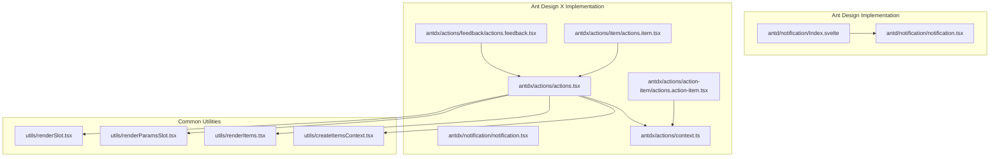
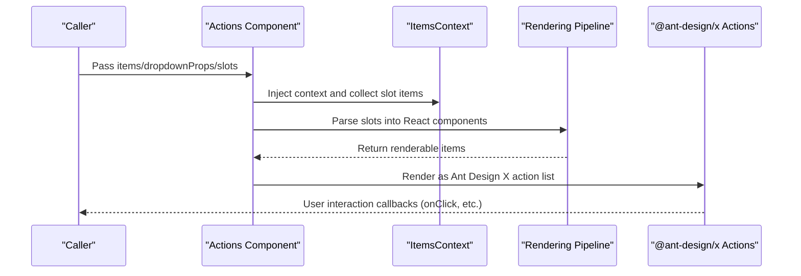
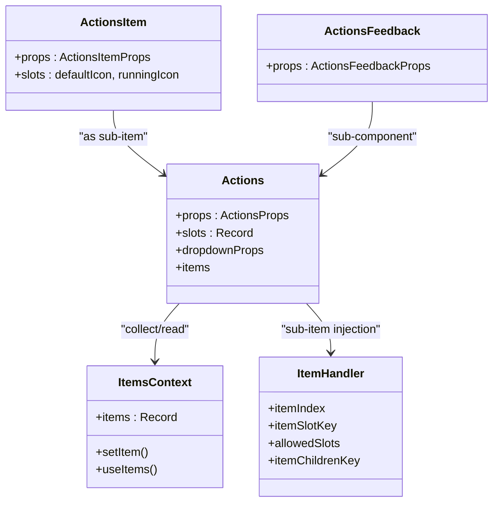
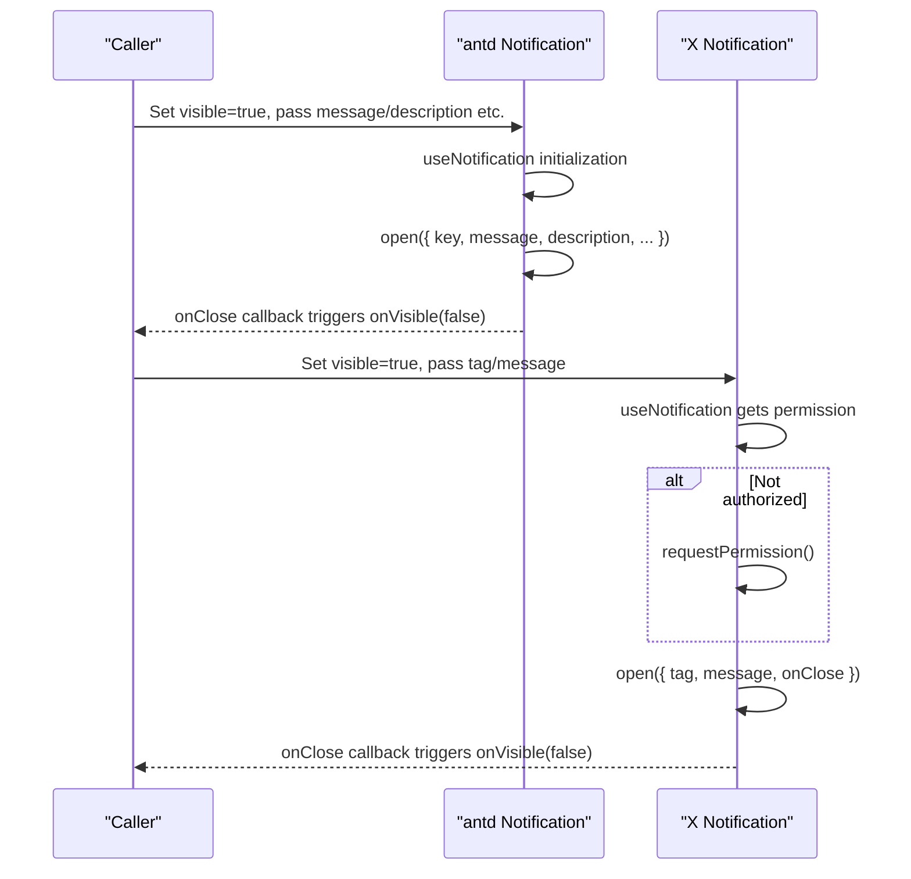
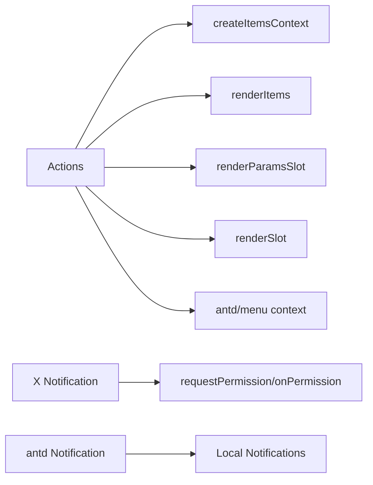

# Feedback Components API

<cite>
**Files Referenced in This Document**
- [frontend/antd/notification/notification.tsx](file://frontend/antd/notification/notification.tsx)
- [frontend/antd/notification/Index.svelte](file://frontend/antd/notification/Index.svelte)
- [frontend/antdx/notification/notification.tsx](file://frontend/antdx/notification/notification.tsx)
- [frontend/antdx/actions/actions.tsx](file://frontend/antdx/actions/actions.tsx)
- [frontend/antdx/actions/context.ts](file://frontend/antdx/actions/context.ts)
- [frontend/antdx/actions/feedback/actions.feedback.tsx](file://frontend/antdx/actions/feedback/actions.feedback.tsx)
- [frontend/antdx/actions/action-item/actions.action-item.tsx](file://frontend/antdx/actions/action-item/actions.action-item.tsx)
- [frontend/antdx/actions/item/actions.item.tsx](file://frontend/antdx/actions/item/actions.item.tsx)
- [frontend/utils/createItemsContext.tsx](file://frontend/utils/createItemsContext.tsx)
- [frontend/utils/renderItems.tsx](file://frontend/utils/renderItems.tsx)
- [frontend/utils/renderParamsSlot.tsx](file://frontend/utils/renderParamsSlot.tsx)
- [frontend/utils/renderSlot.tsx](file://frontend/utils/renderSlot.tsx)
</cite>

## Table of Contents

1. [Introduction](#introduction)
2. [Project Structure](#project-structure)
3. [Core Components](#core-components)
4. [Architecture Overview](#architecture-overview)
5. [Detailed Component Analysis](#detailed-component-analysis)
6. [Dependency Analysis](#dependency-analysis)
7. [Performance Considerations](#performance-considerations)
8. [Troubleshooting Guide](#troubleshooting-guide)
9. [Conclusion](#conclusion)
10. [Appendix](#appendix)

## Introduction

This document is the Ant Design X Feedback Components API reference for ModelScope Studio, focusing on two types of feedback capabilities:

- Actions Component: Provides a set of clickable action items in conversations or workflows, supporting dropdown menus, sub-items, icons, and other extensions.
- Notification Component: For global notification messages and browser native notification permission management, covering both Ant Design and Ant Design X implementations.

This document systematically covers interface definitions, data structures, event and state management, user interaction mechanisms, type specifications and best practices, and provides typical use cases and configuration recommendations for AI applications.

## Project Structure

Feedback components are primarily distributed in the following paths:

- Frontend Ant Design implementation: `frontend/antd/notification`
- Frontend Ant Design X implementation: `frontend/antdx/notification` and `frontend/antdx/actions`
- Common utilities: `frontend/utils` — items context and rendering utilities

Chart Sources

- [frontend/antd/notification/notification.tsx:1-106](file://frontend/antd/notification/notification.tsx#L1-L106)
- [frontend/antd/notification/Index.svelte:56-79](file://frontend/antd/notification/Index.svelte#L56-L79)
- [frontend/antdx/notification/notification.tsx:1-51](file://frontend/antdx/notification/notification.tsx#L1-L51)
- [frontend/antdx/actions/actions.tsx:1-123](file://frontend/antdx/actions/actions.tsx#L1-L123)
- [frontend/antdx/actions/context.ts:1-7](file://frontend/antdx/actions/context.ts#L1-L7)
- [frontend/antdx/actions/feedback/actions.feedback.tsx:1-16](file://frontend/antdx/actions/feedback/actions.feedback.tsx#L1-L16)
- [frontend/antdx/actions/action-item/actions.action-item.tsx:1-23](file://frontend/antdx/actions/action-item/actions.action-item.tsx#L1-L23)
- [frontend/antdx/actions/item/actions.item.tsx:1-34](file://frontend/antdx/actions/item/actions.item.tsx#L1-L34)
- [frontend/utils/createItemsContext.tsx:1-274](file://frontend/utils/createItemsContext.tsx#L1-L274)
- [frontend/utils/renderItems.tsx:1-114](file://frontend/utils/renderItems.tsx#L1-L114)
- [frontend/utils/renderParamsSlot.tsx:1-51](file://frontend/utils/renderParamsSlot.tsx#L1-L51)
- [frontend/utils/renderSlot.tsx:1-29](file://frontend/utils/renderSlot.tsx#L1-L29)

Section Sources

- [frontend/antd/notification/notification.tsx:1-106](file://frontend/antd/notification/notification.tsx#L1-L106)
- [frontend/antd/notification/Index.svelte:56-79](file://frontend/antd/notification/Index.svelte#L56-L79)
- [frontend/antdx/notification/notification.tsx:1-51](file://frontend/antdx/notification/notification.tsx#L1-L51)
- [frontend/antdx/actions/actions.tsx:1-123](file://frontend/antdx/actions/actions.tsx#L1-L123)
- [frontend/antdx/actions/context.ts:1-7](file://frontend/antdx/actions/context.ts#L1-L7)
- [frontend/antdx/actions/feedback/actions.feedback.tsx:1-16](file://frontend/antdx/actions/feedback/actions.feedback.tsx#L1-L16)
- [frontend/antdx/actions/action-item/actions.action-item.tsx:1-23](file://frontend/antdx/actions/action-item/actions.action-item.tsx#L1-L23)
- [frontend/antdx/actions/item/actions.item.tsx:1-34](file://frontend/antdx/actions/item/actions.item.tsx#L1-L34)
- [frontend/utils/createItemsContext.tsx:1-274](file://frontend/utils/createItemsContext.tsx#L1-L274)
- [frontend/utils/renderItems.tsx:1-114](file://frontend/utils/renderItems.tsx#L1-L114)
- [frontend/utils/renderParamsSlot.tsx:1-51](file://frontend/utils/renderParamsSlot.tsx#L1-L51)
- [frontend/utils/renderSlot.tsx:1-29](file://frontend/utils/renderSlot.tsx#L1-L29)

## Core Components

- Actions Component
  - Responsible for rendering a set of interactive action items, supporting dropdown menus, sub-items, icon slots, and menu item context injection.
  - Provides the `Actions.Feedback` sub-component to adapt to specific feedback scenarios.
- Notification Component
  - Ant Design version: Based on `antd.notification.useNotification`, supports visibility control and slot rendering.
  - Ant Design X version: Based on `@ant-design/x/notification`, with built-in browser notification permission requests and the ability to close by tag.

Section Sources

- [frontend/antdx/actions/actions.tsx:1-123](file://frontend/antdx/actions/actions.tsx#L1-L123)
- [frontend/antdx/actions/feedback/actions.feedback.tsx:1-16](file://frontend/antdx/actions/feedback/actions.feedback.tsx#L1-L16)
- [frontend/antd/notification/notification.tsx:1-106](file://frontend/antd/notification/notification.tsx#L1-L106)
- [frontend/antdx/notification/notification.tsx:1-51](file://frontend/antdx/notification/notification.tsx#L1-L51)

## Architecture Overview

The runtime architecture of feedback components consists of a "component bridge layer + notification/action library + rendering pipeline":

- Component Bridge Layer: Wraps Svelte components as React components via `sveltify`, uniformly exposing properties and slots externally.
- Notification/Action Library: Connects to notification and action capabilities from both `antd` and `@ant-design/x`.
- Rendering Pipeline: Uses utilities such as `createItemsContext` and `renderItems` to convert DOM nodes from slots into a React component tree, supporting parameterized slots and cloning strategies.

Chart Sources

- [frontend/antdx/actions/actions.tsx:17-120](file://frontend/antdx/actions/actions.tsx#L17-L120)
- [frontend/utils/createItemsContext.tsx:97-274](file://frontend/utils/createItemsContext.tsx#L97-L274)
- [frontend/utils/renderItems.tsx:8-114](file://frontend/utils/renderItems.tsx#L8-L114)

## Detailed Component Analysis

### Actions Component API

- Component Name: Actions
- Appearance: Ant Design X Actions component, supporting dropdown menus and multi-level sub-items.
- Key Properties (partial):
  - `items`: Action item array, supporting default slot and sub-item slots.
  - `dropdownProps`: Configuration passed through to the dropdown menu, including `dropdownRender`, `popupRender`, `menu`, etc.
  - `slots`: Slot mapping, supporting `menu.expandIcon`, `menu.overflowedIndicator`, `menu.items`, etc.
- Slots and Context:
  - Uses `createItemsContext` to maintain `default` and `items` slot item collections.
  - Writes child nodes to the context via `ItemHandler`, supporting dynamic calculation of `itemProps`, `itemChildren`, etc.
- Rendering Flow:
  - Merges external `items` with slot parsing results to generate the final menu items.
  - Performs parameterized slot rendering for `dropdownRender`/`popupRender` and menu items.
- Typical Sub-components:
  - `Actions.Feedback`: Directly forwards `@ant-design/x`'s `Actions.Feedback`.
  - `Actions.Item`: Encapsulates slots for default icon and running icon.
  - `ActionsActionItem`: A convenience wrapper for `ItemHandler`, restricting allowed slot keys.

Chart Sources

- [frontend/antdx/actions/actions.tsx:17-120](file://frontend/antdx/actions/actions.tsx#L17-L120)
- [frontend/antdx/actions/item/actions.item.tsx:6-34](file://frontend/antdx/actions/item/actions.item.tsx#L6-L34)
- [frontend/antdx/actions/feedback/actions.feedback.tsx:5-16](file://frontend/antdx/actions/feedback/actions.feedback.tsx#L5-L16)
- [frontend/antdx/actions/context.ts:3-4](file://frontend/antdx/actions/context.ts#L3-L4)
- [frontend/antdx/actions/action-item/actions.action-item.tsx:7-20](file://frontend/antdx/actions/action-item/actions.action-item.tsx#L7-L20)

Section Sources

- [frontend/antdx/actions/actions.tsx:1-123](file://frontend/antdx/actions/actions.tsx#L1-L123)
- [frontend/antdx/actions/context.ts:1-7](file://frontend/antdx/actions/context.ts#L1-L7)
- [frontend/antdx/actions/feedback/actions.feedback.tsx:1-16](file://frontend/antdx/actions/feedback/actions.feedback.tsx#L1-L16)
- [frontend/antdx/actions/action-item/actions.action-item.tsx:1-23](file://frontend/antdx/actions/action-item/actions.action-item.tsx#L1-L23)
- [frontend/antdx/actions/item/actions.item.tsx:1-34](file://frontend/antdx/actions/item/actions.item.tsx#L1-L34)
- [frontend/utils/createItemsContext.tsx:20-95](file://frontend/utils/createItemsContext.tsx#L20-L95)
- [frontend/utils/renderItems.tsx:8-114](file://frontend/utils/renderItems.tsx#L8-L114)
- [frontend/utils/renderParamsSlot.tsx:5-51](file://frontend/utils/renderParamsSlot.tsx#L5-L51)
- [frontend/utils/renderSlot.tsx:13-29](file://frontend/utils/renderSlot.tsx#L13-L29)

### Notification Component API

- Ant Design Version (antd/notification)
  - Property Notes:
    - `visible`: Whether to show the notification.
    - `onVisible`: Callback when closed, used to sync `visible` state.
    - `notificationKey`: Unique identifier, used for `destroy`/`open`.
    - Supported slots: `btn`, `actions`, `closeIcon`, `description`, `icon`, `message`.
  - Behavior Mechanism:
    - When `visible` is true, calls `open`; otherwise, `destroy`.
    - In the `onClose` callback, triggers `onVisible(false)` first, then executes the user's custom `onClose`.
- Ant Design X Version (@ant-design/x/notification)
  - Property Notes:
    - `visible`: Whether to show the notification.
    - `onVisible`: Callback when closed.
    - `onPermission`: Browser notification permission change callback.
    - `tag`: Notification tag, used for closing by tag.
  - Behavior Mechanism:
    - If not yet authorized before the first display, requests permission; only `open` when `granted`.
    - When `visible` is true, `open`; otherwise, `close(tag)`.
    - Automatically closes notifications with the corresponding `tag` when the component unmounts.

Chart Sources

- [frontend/antd/notification/notification.tsx:38-95](file://frontend/antd/notification/notification.tsx#L38-L95)
- [frontend/antdx/notification/notification.tsx:17-46](file://frontend/antdx/notification/notification.tsx#L17-L46)

Section Sources

- [frontend/antd/notification/notification.tsx:1-106](file://frontend/antd/notification/notification.tsx#L1-L106)
- [frontend/antd/notification/Index.svelte:56-79](file://frontend/antd/notification/Index.svelte#L56-L79)
- [frontend/antdx/notification/notification.tsx:1-51](file://frontend/antdx/notification/notification.tsx#L1-L51)

## Dependency Analysis

- Actions and Rendering Toolchain
  - Actions depends on `createItemsContext` to maintain the slot item collection.
  - Uses `renderItems` to convert slot items into a React component tree, supporting the `children` key and `itemPropsTransformer`.
  - `renderParamsSlot` and `renderSlot` support parameterized slots and cloning strategies.
- Actions and Menu Context
  - Works with the `antd/menu` context; prioritizes `dropdownProps.menu.items` provided by the menu context.
- Notification and Permissions
  - The X version has built-in permission requests and callbacks, avoiding duplicate requests.
  - The ANTD version does not involve browser permissions; local notifications only.

Chart Sources

- [frontend/antdx/actions/actions.tsx:10-15](file://frontend/antdx/actions/actions.tsx#L10-L15)
- [frontend/utils/createItemsContext.tsx:97-274](file://frontend/utils/createItemsContext.tsx#L97-L274)
- [frontend/utils/renderItems.tsx:8-114](file://frontend/utils/renderItems.tsx#L8-L114)
- [frontend/utils/renderParamsSlot.tsx:5-51](file://frontend/utils/renderParamsSlot.tsx#L5-L51)
- [frontend/utils/renderSlot.tsx:13-29](file://frontend/utils/renderSlot.tsx#L13-L29)
- [frontend/antdx/notification/notification.tsx:13-19](file://frontend/antdx/notification/notification.tsx#L13-L19)

Section Sources

- [frontend/antdx/actions/actions.tsx:1-123](file://frontend/antdx/actions/actions.tsx#L1-L123)
- [frontend/utils/createItemsContext.tsx:1-274](file://frontend/utils/createItemsContext.tsx#L1-L274)
- [frontend/utils/renderItems.tsx:1-114](file://frontend/utils/renderItems.tsx#L1-L114)
- [frontend/utils/renderParamsSlot.tsx:1-51](file://frontend/utils/renderParamsSlot.tsx#L1-L51)
- [frontend/utils/renderSlot.tsx:1-29](file://frontend/utils/renderSlot.tsx#L1-L29)
- [frontend/antdx/notification/notification.tsx:1-51](file://frontend/antdx/notification/notification.tsx#L1-L51)

## Performance Considerations

- Slot Rendering Optimization
  - Use `useMemo` to wrap `dropdownProps` modifications, reducing unnecessary re-renders.
  - `renderItems` supports `clone`/`forceClone` controls to avoid unnecessary React node rebuilding.
- Notification Lifecycle
  - ANTD: Destroys the corresponding key when `visible` toggles, and also destroys on unmount to avoid memory leaks.
  - X: Closes by tag when `visible=false` or on unmount, ensuring resource cleanup.
- Permission Request Debouncing
  - The X version checks permissions before first open, avoiding duplicate requests.

Section Sources

- [frontend/antdx/actions/actions.tsx:39-96](file://frontend/antdx/actions/actions.tsx#L39-L96)
- [frontend/antd/notification/notification.tsx:74-95](file://frontend/antd/notification/notification.tsx#L74-L95)
- [frontend/antdx/notification/notification.tsx:17-46](file://frontend/antdx/notification/notification.tsx#L17-L46)

## Troubleshooting Guide

- Actions Sub-items Not Displaying
  - Check slot keys: verify `default` and `subItems` match the `ItemHandler`'s `itemChildrenKey`.
  - Confirm the return value logic of `allowedSlots` and `itemChildren` is consistent.
- Slot Not Taking Effect
  - Confirm elements in `slots` have been correctly passed to `ItemHandler` or Actions's `slots`.
  - For parameterized slots, confirm `renderParamsSlot`'s `targets` and `withParams` configuration.
- Notification Not Displaying
  - ANTD: Confirm `visible` is true and `notificationKey` is unique; check whether `onVisible(false)` is called in `onClose`.
  - X: Confirm browser notification permission is `granted`; check whether `tag` is correctly passed; check whether `onVisible(false)` is called in `onClose`.
- Performance Issues
  - Check whether `dropdownProps` changes frequently; reuse object references or use `useMemo` as much as possible.
  - Reduce unnecessary cloning; only enable `forceClone` when necessary.

Section Sources

- [frontend/antdx/actions/action-item/actions.action-item.tsx:11-19](file://frontend/antdx/actions/action-item/actions.action-item.tsx#L11-L19)
- [frontend/antdx/actions/context.ts:3-4](file://frontend/antdx/actions/context.ts#L3-L4)
- [frontend/utils/renderParamsSlot.tsx:23-49](file://frontend/utils/renderParamsSlot.tsx#L23-L49)
- [frontend/antd/notification/notification.tsx:38-95](file://frontend/antd/notification/notification.tsx#L38-L95)
- [frontend/antdx/notification/notification.tsx:17-46](file://frontend/antdx/notification/notification.tsx#L17-L46)

## Conclusion

- Actions transforms complex UI structures into composable and extensible action lists through slot and context mechanisms, suitable for carrying multi-step task and multi-turn conversation action feedback in AI applications.
- Notification provides unified visibility and lifecycle management on both the ANTD and X sides; the X version additionally supports browser notification permissions, meeting richer user feedback needs.
- It is recommended to choose the appropriate implementation version based on business semantics in real applications, and to follow slot and context best practices for stable and high-performance feedback experiences.

## Appendix

### Type and Interface Summary

- Actions
  - `ActionsProps`: From `@ant-design/x`, includes `items`, `dropdownProps`, etc.
  - `ActionsItemProps`: Property collection for `Actions.Item`.
  - `ActionsFeedbackProps`: Property collection for `Actions.Feedback`.
- Notification
  - ANTD: `ArgsProps` and `NotificationConfig`, supporting `visible`, `onVisible`, slots, etc.
  - X: `XNotificationOpenArgs`, supporting `visible`, `onVisible`, `onPermission`, `tag`, etc.

Section Sources

- [frontend/antdx/actions/actions.tsx:3-8](file://frontend/antdx/actions/actions.tsx#L3-L8)
- [frontend/antd/notification/notification.tsx:8-16](file://frontend/antd/notification/notification.tsx#L8-L16)
- [frontend/antdx/notification/notification.tsx:6-11](file://frontend/antdx/notification/notification.tsx#L6-L11)

### Usage Scenarios and Best Practices

- Action Feedback in AI Applications
  - Use `Actions.Feedback` to quickly mount feedback-type actions.
  - Use `Actions.Item` to customize icons and text, combined with slots for dynamic text and status indicators.
  - For multi-level menus, use `subItems` and `allowedSlots` to manage hierarchy.
- Notification Timing Control
  - ANTD: Use `visible` for precise show/hide control; use brief notifications for critical errors or success states.
  - X: Enable for system-level alerts; note that permission requests only trigger on the first use, avoiding frequent interruptions.
- State Synchronization
  - Uniformly set `onVisible(false)` in `onClose` to ensure UI and state consistency.
  - For batch closures, use `tag` or `key` for precise targeting.
