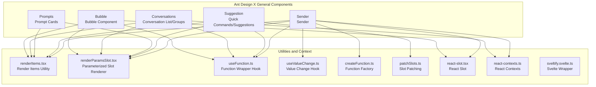
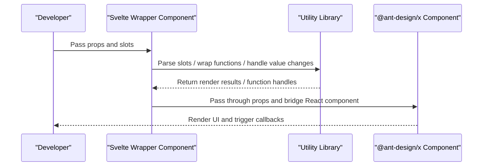
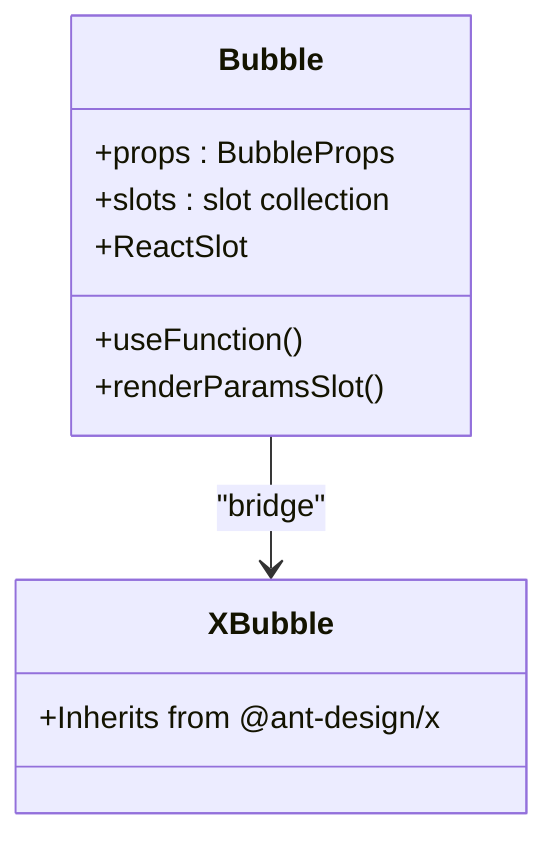
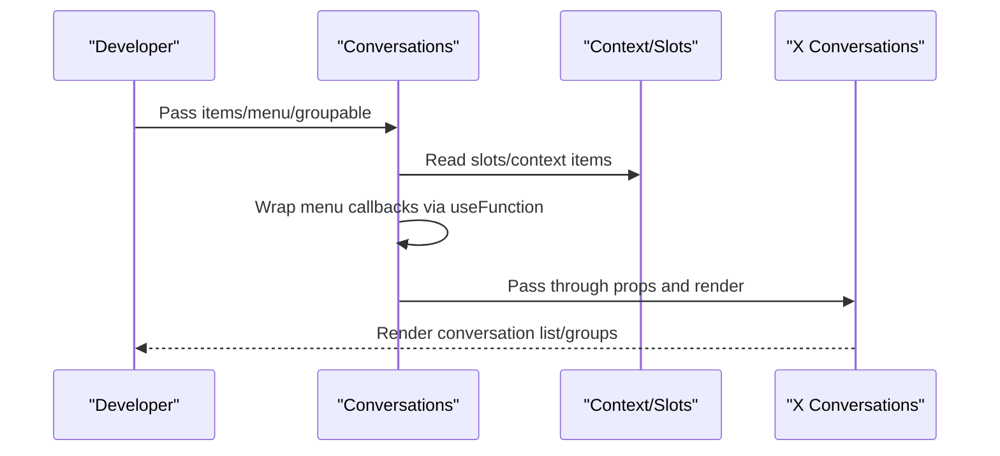
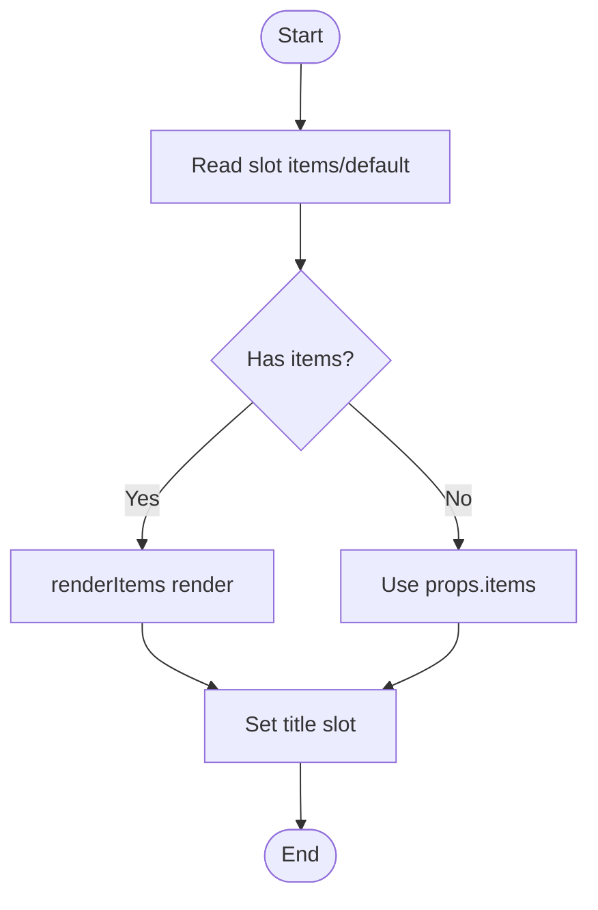
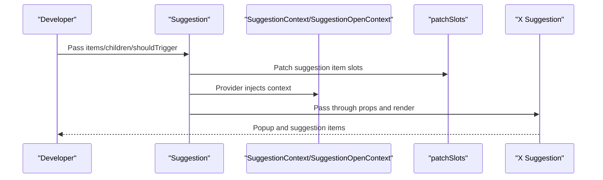
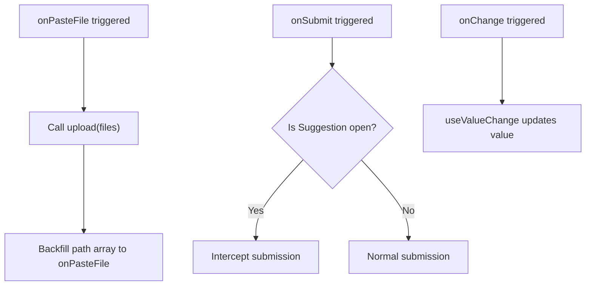
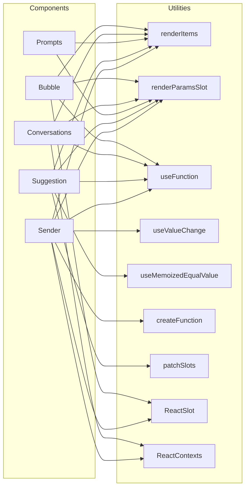

# General Components API

<cite>
**Files Referenced in This Document**
- [bubble.tsx](file://frontend/antdx/bubble/bubble.tsx)
- [conversations.tsx](file://frontend/antdx/conversations/conversations.tsx)
- [prompts.tsx](file://frontend/antdx/prompts/prompts.tsx)
- [suggestion.tsx](file://frontend/antdx/suggestion/suggestion.tsx)
- [sender.tsx](file://frontend/antdx/sender/sender.tsx)
- [context.ts (suggestion item context)](file://frontend/antdx/suggestion/context.ts)
- [context.ts (conversation item context)](file://frontend/antdx/conversations/context.ts)
- [context.ts (prompt item context)](file://frontend/antdx/prompts/context.ts)
- [renderItems.tsx](file://frontend/utils/renderItems.tsx)
- [renderParamsSlot.tsx](file://frontend/utils/renderParamsSlot.tsx)
- [useFunction.ts](file://frontend/utils/hooks/useFunction.ts)
- [useValueChange.ts](file://frontend/utils/hooks/useValueChange.ts)
- [createFunction.ts](file://frontend/utils/createFunction.ts)
- [patchSlots.ts](file://frontend/utils/patchSlots.ts)
- [useMemoizedEqualValue.ts](file://frontend/utils/hooks/useMemoizedEqualValue.ts)
- [react-slot.tsx](file://frontend/svelte-preprocess-react/react-slot.tsx)
- [react-contexts.ts](file://frontend/svelte-preprocess-react/react-contexts.ts)
- [sveltify.svelte.ts](file://frontend/svelte-preprocess-react/sveltify.svelte.ts)
</cite>

## Table of Contents

1. [Introduction](#introduction)
2. [Project Structure](#project-structure)
3. [Core Components](#core-components)
4. [Architecture Overview](#architecture-overview)
5. [Detailed Component Analysis](#detailed-component-analysis)
6. [Dependency Analysis](#dependency-analysis)
7. [Performance Considerations](#performance-considerations)
8. [Troubleshooting Guide](#troubleshooting-guide)
9. [Conclusion](#conclusion)
10. [Appendix](#appendix)

## Introduction

This document is the Ant Design X General Components API reference for ModelScope Studio. It focuses on the complete interface specifications and usage guides for the following core general components:

- Bubble: Conversation bubble component, supports avatar, content, footer, extra actions, and other slots and render functions
- Conversations: Conversation list/group management, supports menus, group labels, overflow indicators, and other extensions
- Prompts: Prompt card collection, supports title slots and dynamic item rendering
- Suggestion: Quick commands/suggestion input, supports popup containers, trigger strategies, and sub-item slot patching
- Sender: Sender component, supports paste upload, skill panel, prefix/suffix/header/footer slots

This document covers property definitions, event handling, slot systems, state management, message passing, and conversation flow control mechanisms. It also provides instantiation and configuration example paths for AI chat and conversation scenarios, TypeScript types and integration with Ant Design components, as well as performance optimization and best practices.

## Project Structure

Ant Design X general components are located in the `antdx` submodule of the frontend directory. They adopt a "Svelte wrapper + React component bridge" architecture: using `svelte-preprocess-react` to use `@ant-design/x` React components in a Svelte-compatible way, while providing a unified slot system and context injection capability.

Chart Sources

- [bubble.tsx:1-119](file://frontend/antdx/bubble/bubble.tsx#L1-L119)
- [conversations.tsx:1-178](file://frontend/antdx/conversations/conversations.tsx#L1-L178)
- [prompts.tsx:1-43](file://frontend/antdx/prompts/prompts.tsx#L1-L43)
- [suggestion.tsx:1-165](file://frontend/antdx/suggestion/suggestion.tsx#L1-L165)
- [sender.tsx:1-174](file://frontend/antdx/sender/sender.tsx#L1-L174)
- [renderItems.tsx](file://frontend/utils/renderItems.tsx)
- [renderParamsSlot.tsx](file://frontend/utils/renderParamsSlot.tsx)
- [useFunction.ts](file://frontend/utils/hooks/useFunction.ts)
- [useValueChange.ts](file://frontend/utils/hooks/useValueChange.ts)
- [createFunction.ts](file://frontend/utils/createFunction.ts)
- [patchSlots.ts](file://frontend/utils/patchSlots.ts)
- [react-slot.tsx](file://frontend/svelte-preprocess-react/react-slot.tsx)
- [react-contexts.ts](file://frontend/svelte-preprocess-react/react-contexts.ts)
- [sveltify.svelte.ts](file://frontend/svelte-preprocess-react/sveltify.svelte.ts)

Section Sources

- [bubble.tsx:1-119](file://frontend/antdx/bubble/bubble.tsx#L1-L119)
- [conversations.tsx:1-178](file://frontend/antdx/conversations/conversations.tsx#L1-L178)
- [prompts.tsx:1-43](file://frontend/antdx/prompts/prompts.tsx#L1-L43)
- [suggestion.tsx:1-165](file://frontend/antdx/suggestion/suggestion.tsx#L1-L165)
- [sender.tsx:1-174](file://frontend/antdx/sender/sender.tsx#L1-L174)

## Core Components

This section provides an overview of the five core general components, their responsibilities and typical use cases, to help quickly locate specific implementations and example paths.

- Bubble (Conversation Bubble)
  - Supports avatar, content, header, footer, extra actions, editable text, loading state, and custom content rendering
  - Slot keys: `avatar`, `content`, `header`, `footer`, `extra`, `editable.okText`, `editable.cancelText`, `loadingRender`, `contentRender`
  - Typical use cases: User/system message display, editable replies, async loading states

- Conversations (Conversation Management)
  - Supports conversation item lists, grouping, menus, overflow indicators, expand icons, and triggers
  - Slot keys: `menu.items`, `menu.trigger`, `menu.expandIcon`, `menu.overflowedIndicator`, `groupable.label`
  - Typical use cases: Historical conversation browsing, group collapsing, right-click menu operations

- Prompts (Prompt Collection)
  - Supports prompt card title slots and dynamic item rendering
  - Slot keys: `title`
  - Typical use cases: Chat guidance, quick prompts, templated input

- Suggestion (Quick Commands)
  - Supports suggestion item lists, sub-item slot patching, popup containers, open state, and keyboard trigger strategies
  - Slot keys: `children`
  - Typical use cases: @mentions, /commands, quick suggestions

- Sender (Sender)
  - Supports paste upload, skill panel, prefix/suffix/header/footer slots, value change, and submission interception
  - Slot keys: `suffix`, `header`, `prefix`, `footer`, `skill.title`, `skill.toolTip.title`, `skill.closable.closeIcon`
  - Typical use cases: Text input, file paste upload, skill toggles

Section Sources

- [bubble.tsx:14-116](file://frontend/antdx/bubble/bubble.tsx#L14-L116)
- [conversations.tsx:59-175](file://frontend/antdx/conversations/conversations.tsx#L59-L175)
- [prompts.tsx:13-40](file://frontend/antdx/prompts/prompts.tsx#L13-L40)
- [suggestion.tsx:64-162](file://frontend/antdx/suggestion/suggestion.tsx#L64-L162)
- [sender.tsx:18-171](file://frontend/antdx/sender/sender.tsx#L18-L171)

## Architecture Overview

The diagram below shows the call relationships and data flow between general components and the utility library, reflecting the overall flow of "slot parsing → function wrapping → render item generation → React component bridging".

Chart Sources

- [bubble.tsx:27-115](file://frontend/antdx/bubble/bubble.tsx#L27-L115)
- [conversations.tsx:72-171](file://frontend/antdx/conversations/conversations.tsx#L72-L171)
- [prompts.tsx:16-37](file://frontend/antdx/prompts/prompts.tsx#L16-L37)
- [suggestion.tsx:77-159](file://frontend/antdx/suggestion/suggestion.tsx#L77-L159)
- [sender.tsx:35-169](file://frontend/antdx/sender/sender.tsx#L35-L169)
- [renderItems.tsx](file://frontend/utils/renderItems.tsx)
- [renderParamsSlot.tsx](file://frontend/utils/renderParamsSlot.tsx)
- [useFunction.ts](file://frontend/utils/hooks/useFunction.ts)
- [useValueChange.ts](file://frontend/utils/hooks/useValueChange.ts)
- [createFunction.ts](file://frontend/utils/createFunction.ts)
- [patchSlots.ts](file://frontend/utils/patchSlots.ts)
- [react-slot.tsx](file://frontend/svelte-preprocess-react/react-slot.tsx)

## Detailed Component Analysis

### Bubble Component API

- Component Responsibilities
  - Wraps `@ant-design/x`'s Bubble in Svelte form, providing slot and function wrapping capabilities
  - Supports editable text, loading state, custom content rendering, and avatar/header/footer/extra action slots
- Key Properties and Slots
  - Props: Inherits from `BubbleProps`, supports `editable`, `typing`, `content`, `avatar`, `extra`, `footer`, `header`, `loadingRender`, `contentRender`, etc.
  - Slots: `avatar`, `content`, `header`, `footer`, `extra`, `editable.okText`, `editable.cancelText`, `loadingRender`, `contentRender`
- Events and State
  - Callbacks are wrapped via `useFunction` to ensure reactive updates; `editable` supports boolean or config objects
- Usage Notes
  - Edit mode is enabled when `editable` config exists or slots are present; `loadingRender`/`contentRender` support parameterized slots
- Example Path
  - [Bubble Implementation:14-116](file://frontend/antdx/bubble/bubble.tsx#L14-L116)

Chart Sources

- [bubble.tsx:14-116](file://frontend/antdx/bubble/bubble.tsx#L14-L116)

Section Sources

- [bubble.tsx:1-119](file://frontend/antdx/bubble/bubble.tsx#L1-L119)

### Conversations Component API

- Component Responsibilities
  - Wraps `@ant-design/x`'s Conversations in Svelte form, providing menu and grouping capabilities
- Key Properties and Slots
  - Props: Inherits from `ConversationsProps`, supports `items`, `menu`, `groupable`, `classNames`, etc.
  - Slots: `menu.items`, `menu.trigger`, `menu.expandIcon`, `menu.overflowedIndicator`, `groupable.label`
- Events and State
  - Menu callbacks are wrapped via `useFunction`; menu events are wrapped to pass the current conversation context
  - Group labels support both slot and function configuration
- Usage Notes
  - `menu` supports strings or objects; when `items` is not provided, they can be injected from context
  - `classNames.item` injects style class names for improved consistency
- Example Path
  - [Conversations Implementation:59-175](file://frontend/antdx/conversations/conversations.tsx#L59-L175)

Chart Sources

- [conversations.tsx:59-175](file://frontend/antdx/conversations/conversations.tsx#L59-L175)
- [context.ts (conversation item context):1-7](file://frontend/antdx/conversations/context.ts#L1-L7)

Section Sources

- [conversations.tsx:1-178](file://frontend/antdx/conversations/conversations.tsx#L1-L178)
- [context.ts (conversation item context):1-7](file://frontend/antdx/conversations/context.ts#L1-L7)

### Prompts Component API

- Component Responsibilities
  - Wraps `@ant-design/x`'s Prompts in Svelte form, providing title slots and dynamic item rendering
- Key Properties and Slots
  - Props: Inherits from `PromptsProps`, supports `items`, `title`, etc.
  - Slots: `title`
- Events and State
  - Item lists are dynamically generated via `renderItems`; slot `items`/`default` takes priority
- Usage Notes
  - Suitable for "quick prompts", "templated input", and similar scenarios
- Example Path
  - [Prompts Implementation:13-40](file://frontend/antdx/prompts/prompts.tsx#L13-L40)

Chart Sources

- [prompts.tsx:13-40](file://frontend/antdx/prompts/prompts.tsx#L13-L40)
- [context.ts (prompt item context):1-7](file://frontend/antdx/prompts/context.ts#L1-L7)

Section Sources

- [prompts.tsx:1-43](file://frontend/antdx/prompts/prompts.tsx#L1-L43)
- [context.ts (prompt item context):1-7](file://frontend/antdx/prompts/context.ts#L1-L7)

### Suggestion Component API

- Component Responsibilities
  - Wraps `@ant-design/x`'s Suggestion in Svelte form, providing suggestion item slot patching, popup containers, open state, and keyboard trigger strategies
- Key Properties and Slots
  - Props: Inherits from `SuggestionProps`, adds `children` slot and `shouldTrigger` callback
  - Slots: `children`
- Events and State
  - `SuggestionOpenContext` and `useSuggestionOpenContext` control and observe the open state
  - `patchSlots` patches suggestion item `icon`/`label`/`extra`/`children` slots
  - `useMemoizedEqualValue` optimizes rendering overhead
- Usage Notes
  - Supports injecting context into `children` render function to customize `onTrigger`/`onKeyDown`
  - Supports controlled/uncontrolled `open` state switching
- Example Path
  - [Suggestion Implementation:64-162](file://frontend/antdx/suggestion/suggestion.tsx#L64-L162)

Chart Sources

- [suggestion.tsx:64-162](file://frontend/antdx/suggestion/suggestion.tsx#L64-L162)
- [context.ts (suggestion item context):1-7](file://frontend/antdx/suggestion/context.ts#L1-L7)
- [react-contexts.ts](file://frontend/svelte-preprocess-react/react-contexts.ts)

Section Sources

- [suggestion.tsx:1-165](file://frontend/antdx/suggestion/suggestion.tsx#L1-L165)
- [context.ts (suggestion item context):1-7](file://frontend/antdx/suggestion/context.ts#L1-L7)

### Sender Component API

- Component Responsibilities
  - Wraps `@ant-design/x`'s Sender in Svelte form, providing paste upload, skill panel, slots, and value change hooks
- Key Properties and Slots
  - Props: Inherits from `SenderProps`, adds `upload`, `onPasteFile`, `onValueChange`, etc.
  - Slots: `suffix`, `header`, `prefix`, `footer`, `skill.title`, `skill.toolTip.title`, `skill.closable.closeIcon`
- Events and State
  - `useValueChange` manages controlled/uncontrolled `value`
  - `useSuggestionOpenContext` intercepts submission when Suggestion is open
  - `createFunction`/`formatResult`/`customRender` customize `slotConfig`
- Usage Notes
  - When pasting files, calls `upload` and backfills the path array
  - Skill panel supports combinations of slots and configuration for tooltip/closable
- Example Path
  - [Sender Implementation:18-171](file://frontend/antdx/sender/sender.tsx#L18-L171)

Chart Sources

- [sender.tsx:18-171](file://frontend/antdx/sender/sender.tsx#L18-L171)

Section Sources

- [sender.tsx:1-174](file://frontend/antdx/sender/sender.tsx#L1-L174)

## Dependency Analysis

There is a clear dependency relationship between general components and the utility library: components consume utility library capabilities through the context and slot systems, ultimately bridging to `@ant-design/x` React components.

Chart Sources

- [bubble.tsx:1-119](file://frontend/antdx/bubble/bubble.tsx#L1-L119)
- [conversations.tsx:1-178](file://frontend/antdx/conversations/conversations.tsx#L1-L178)
- [prompts.tsx:1-43](file://frontend/antdx/prompts/prompts.tsx#L1-L43)
- [suggestion.tsx:1-165](file://frontend/antdx/suggestion/suggestion.tsx#L1-L165)
- [sender.tsx:1-174](file://frontend/antdx/sender/sender.tsx#L1-L174)
- [renderItems.tsx](file://frontend/utils/renderItems.tsx)
- [renderParamsSlot.tsx](file://frontend/utils/renderParamsSlot.tsx)
- [useFunction.ts](file://frontend/utils/hooks/useFunction.ts)
- [useValueChange.ts](file://frontend/utils/hooks/useValueChange.ts)
- [createFunction.ts](file://frontend/utils/createFunction.ts)
- [patchSlots.ts](file://frontend/utils/patchSlots.ts)
- [react-slot.tsx](file://frontend/svelte-preprocess-react/react-slot.tsx)
- [react-contexts.ts](file://frontend/svelte-preprocess-react/react-contexts.ts)

Section Sources

- [bubble.tsx:1-119](file://frontend/antdx/bubble/bubble.tsx#L1-L119)
- [conversations.tsx:1-178](file://frontend/antdx/conversations/conversations.tsx#L1-L178)
- [prompts.tsx:1-43](file://frontend/antdx/prompts/prompts.tsx#L1-L43)
- [suggestion.tsx:1-165](file://frontend/antdx/suggestion/suggestion.tsx#L1-L165)
- [sender.tsx:1-174](file://frontend/antdx/sender/sender.tsx#L1-L174)

## Performance Considerations

- Slot and Function Wrapping
  - Use `useMemoizedEqualValue` and `useMemo` to reduce render jitter and redundant computation
  - Wrap callbacks via `useFunction` to prevent child component re-renders caused by new function instances on every render
- Render Items and Slots
  - `renderItems` and `renderParamsSlot` execute only when necessary, reducing unnecessary cloning and rendering
  - `patchSlots` patches suggestion items on demand, avoiding full replacement
- Value Change and Event Interception
  - `useValueChange` unifies value management to prevent external state inconsistencies
  - Sender intercepts submission when Suggestion is open, reducing invalid requests
- Best Practices
  - Properly split slots and functions, avoid heavy logic inside slots
  - Use stable references for high-frequency update data, combined with `useMemo`/`useCallback`
  - Reuse already-parsed `items` in Conversations/Prompts as much as possible to reduce duplicate rendering

[This section provides general performance guidance and requires no specific file sources]

## Troubleshooting Guide

- Slot Not Taking Effect
  - Check if slot key names match the component declarations (e.g., `bubble`'s `editable.okText`, `conversations`'s `menu.items`, etc.)
  - Confirm that slot content is properly wrapped in `ReactSlot` or `renderParamsSlot`
- Event Not Firing
  - Confirm that the callback wrapped by `useFunction` is correctly passed to the underlying component
  - For Conversations menu events, check if `patchMenuEvents` correctly wraps the original event
- Suggestion Item Slot Not Displaying
  - Confirm that `patchSlots` has patched `icon`/`label`/`extra`/`children`
  - Check if the Suggestion `children` render function returns the correct nodes
- Sender Submission Intercepted
  - Confirm whether `SuggestionOpenContext` state is `true`
  - Check if `shouldTrigger` correctly fires on keyboard events
- Value Not Updating
  - Confirm that `useValueChange`'s `onValueChange` is being called
  - Check the synchronization logic between `props.value` and internal state

Section Sources

- [bubble.tsx:27-115](file://frontend/antdx/bubble/bubble.tsx#L27-L115)
- [conversations.tsx:35-122](file://frontend/antdx/conversations/conversations.tsx#L35-L122)
- [suggestion.tsx:100-159](file://frontend/antdx/suggestion/suggestion.tsx#L100-L159)
- [sender.tsx:126-138](file://frontend/antdx/sender/sender.tsx#L126-L138)

## Conclusion

ModelScope Studio's Ant Design X general components achieve seamless bridging with `@ant-design/x` components through a unified slot system and function wrapping mechanism. Bubble, Conversations, Prompts, Suggestion, and Sender provide powerful extensibility and ease of use for AI chat and conversation scenarios. Following this document's property definitions, event handling, slot system, and state management recommendations, you can efficiently build high-quality conversational interfaces and interaction flows.

[This section is a summary and requires no specific file sources]

## Appendix

- TypeScript Types and Interfaces
  - All components extend or trim the corresponding `Props` types from `@ant-design/x` to ensure type safety
  - Slots and function wrapping leverage generics and utility functions to guarantee type inference
- Integration with Ant Design Components
  - Svelte-to-React bridging is achieved via `sveltify` and `ReactSlot` from `svelte-preprocess-react`
  - Property and callback functionalization is achieved via utility tools such as `createFunction`/`useFunction`
- Example Path Index
  - Bubble: [bubble.tsx:14-116](file://frontend/antdx/bubble/bubble.tsx#L14-L116)
  - Conversations: [conversations.tsx:59-175](file://frontend/antdx/conversations/conversations.tsx#L59-L175)
  - Prompts: [prompts.tsx:13-40](file://frontend/antdx/prompts/prompts.tsx#L13-L40)
  - Suggestion: [suggestion.tsx:64-162](file://frontend/antdx/suggestion/suggestion.tsx#L64-L162)
  - Sender: [sender.tsx:18-171](file://frontend/antdx/sender/sender.tsx#L18-L171)

[This section is supplementary information and requires no specific file sources]
