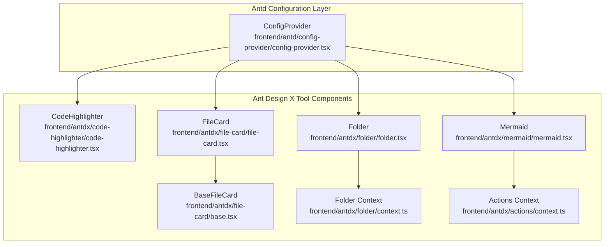
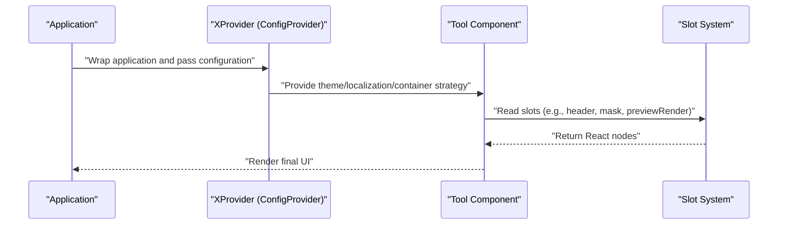
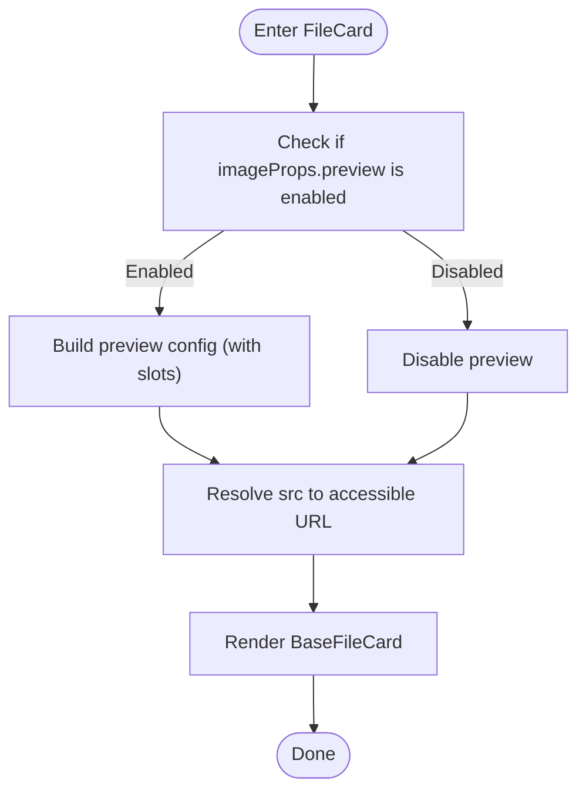
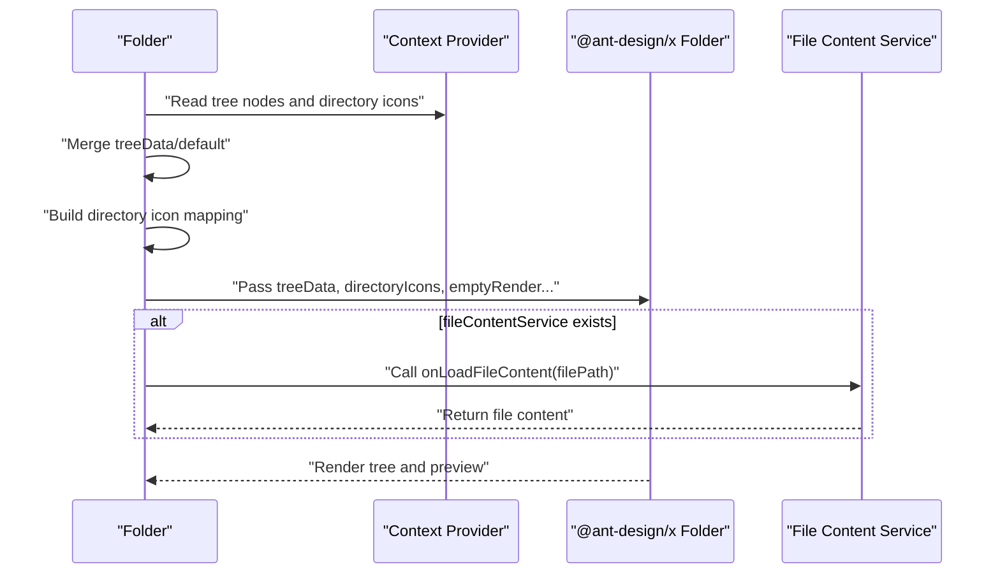
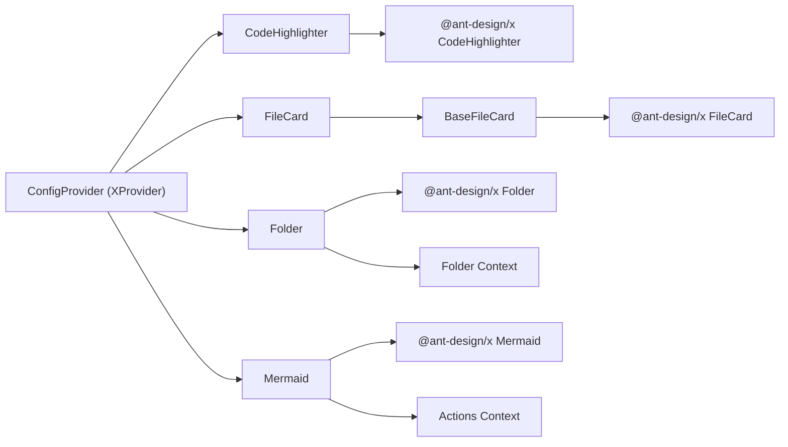

# Tool Components API

<cite>
**Files Referenced in This Document**
- [frontend/antd/config-provider/config-provider.tsx](file://frontend/antd/config-provider/config-provider.tsx)
- [frontend/antdx/code-highlighter/code-highlighter.tsx](file://frontend/antdx/code-highlighter/code-highlighter.tsx)
- [frontend/antdx/file-card/file-card.tsx](file://frontend/antdx/file-card/file-card.tsx)
- [frontend/antdx/file-card/base.tsx](file://frontend/antdx/file-card/base.tsx)
- [frontend/antdx/folder/folder.tsx](file://frontend/antdx/folder/folder.tsx)
- [frontend/antdx/folder/context.ts](file://frontend/antdx/folder/context.ts)
- [frontend/antdx/mermaid/mermaid.tsx](file://frontend/antdx/mermaid/mermaid.tsx)
- [frontend/antdx/actions/context.ts](file://frontend/antdx/actions/context.ts)
- [docs/components/antdx/x_provider/README.md](file://docs/components/antdx/x_provider/README.md)
</cite>

## Table of Contents

1. [Introduction](#introduction)
2. [Project Structure](#project-structure)
3. [Core Components](#core-components)
4. [Architecture Overview](#architecture-overview)
5. [Component Details](#component-details)
6. [Dependency Analysis](#dependency-analysis)
7. [Performance Considerations](#performance-considerations)
8. [Troubleshooting Guide](#troubleshooting-guide)
9. [Conclusion](#conclusion)
10. [Appendix](#appendix)

## Introduction

This document covers the Ant Design X Tool Components API for ModelScope Studio, focusing on the complete interface and usage of the following components:

- XProvider Global Configuration Component (based on antd's ConfigProvider extension)
- CodeHighlighter Code Highlighting Component
- FileCard File Card Component
- Folder Directory Component
- Mermaid Flowchart Component

The document covers global configuration approaches, code highlighting language and theme support, file management interactions, flowchart drawing and action integration, and integration with the Gradio ecosystem. It also provides key type definition notes, context provision and state management mechanisms, performance optimization, and best extension practices.

## Project Structure

Key directories and files around tool components:

- Frontend component implementations are in `frontend/antdx` and `frontend/antd`, corresponding to Ant Design X components and the antd configuration layer respectively
- Each component is wrapped via `sveltify` as a React component usable in Svelte, bridged through slots and parameters
- Shared context between components is provided via `createItemsContext`, used for tree nodes, directory icons, and action items, etc.

Chart Sources

- [frontend/antd/config-provider/config-provider.tsx:1-154](file://frontend/antd/config-provider/config-provider.tsx#L1-L154)
- [frontend/antdx/code-highlighter/code-highlighter.tsx:1-54](file://frontend/antdx/code-highlighter/code-highlighter.tsx#L1-L54)
- [frontend/antdx/file-card/file-card.tsx:1-127](file://frontend/antdx/file-card/file-card.tsx#L1-L127)
- [frontend/antdx/file-card/base.tsx:1-44](file://frontend/antdx/file-card/base.tsx#L1-L44)
- [frontend/antdx/folder/folder.tsx:1-123](file://frontend/antdx/folder/folder.tsx#L1-L123)
- [frontend/antdx/folder/context.ts:1-16](file://frontend/antdx/folder/context.ts#L1-L16)
- [frontend/antdx/mermaid/mermaid.tsx:1-87](file://frontend/antdx/mermaid/mermaid.tsx#L1-L87)
- [frontend/antdx/actions/context.ts:1-7](file://frontend/antdx/actions/context.ts#L1-L7)

Section Sources

- [frontend/antd/config-provider/config-provider.tsx:1-154](file://frontend/antd/config-provider/config-provider.tsx#L1-L154)
- [frontend/antdx/code-highlighter/code-highlighter.tsx:1-54](file://frontend/antdx/code-highlighter/code-highlighter.tsx#L1-L54)
- [frontend/antdx/file-card/file-card.tsx:1-127](file://frontend/antdx/file-card/file-card.tsx#L1-L127)
- [frontend/antdx/file-card/base.tsx:1-44](file://frontend/antdx/file-card/base.tsx#L1-L44)
- [frontend/antdx/folder/folder.tsx:1-123](file://frontend/antdx/folder/folder.tsx#L1-L123)
- [frontend/antdx/folder/context.ts:1-16](file://frontend/antdx/folder/context.ts#L1-L16)
- [frontend/antdx/mermaid/mermaid.tsx:1-87](file://frontend/antdx/mermaid/mermaid.tsx#L1-L87)
- [frontend/antdx/actions/context.ts:1-7](file://frontend/antdx/actions/context.ts#L1-L7)

## Core Components

This section provides an overview of each component's responsibilities and key capabilities:

- XProvider: Replaces antd's ConfigProvider in Gradio Blocks scenarios, uniformly providing global configuration for Ant Design X components (theme, localization, popup containers, etc.), and compatible with slot injection
- CodeHighlighter: Encapsulates `@ant-design/x`'s code highlighting component, supporting custom `header` slots and syntax highlighting styles in light/dark themes
- FileCard: File card component, supporting slot-based configuration for image placeholders, preview masks, close icons, toolbar rendering, indicators, and description text
- Folder: Directory tree component, supporting slot injection for tree node data, directory icon mapping, empty state rendering, and title/preview rendering, and can connect to file content services
- Mermaid: Flowchart component, supporting theme switching, highlight styles, action item context injection, and custom actions

Section Sources

- [docs/components/antdx/x_provider/README.md:1-19](file://docs/components/antdx/x_provider/README.md#L1-L19)
- [frontend/antd/config-provider/config-provider.tsx:51-151](file://frontend/antd/config-provider/config-provider.tsx#L51-L151)
- [frontend/antdx/code-highlighter/code-highlighter.tsx:29-51](file://frontend/antdx/code-highlighter/code-highlighter.tsx#L29-L51)
- [frontend/antdx/file-card/file-card.tsx:17-124](file://frontend/antdx/file-card/file-card.tsx#L17-L124)
- [frontend/antdx/folder/folder.tsx:16-120](file://frontend/antdx/folder/folder.tsx#L16-L120)
- [frontend/antdx/mermaid/mermaid.tsx:33-84](file://frontend/antdx/mermaid/mermaid.tsx#L33-L84)

## Architecture Overview

XProvider serves as the top-level configuration container, providing unified theme, localization, and popup container strategies to tool components below; tool components use slot and parameter bridging, combined with context providers for flexible slot-based and dynamic rendering.

Chart Sources

- [frontend/antd/config-provider/config-provider.tsx:108-149](file://frontend/antd/config-provider/config-provider.tsx#L108-L149)
- [frontend/antdx/code-highlighter/code-highlighter.tsx:35-49](file://frontend/antdx/code-highlighter/code-highlighter.tsx#L35-L49)
- [frontend/antdx/file-card/file-card.tsx:46-123](file://frontend/antdx/file-card/file-card.tsx#L46-L123)
- [frontend/antdx/folder/folder.tsx:48-116](file://frontend/antdx/folder/folder.tsx#L48-L116)
- [frontend/antdx/mermaid/mermaid.tsx:47-81](file://frontend/antdx/mermaid/mermaid.tsx#L47-L81)

## Component Details

### XProvider Global Configuration Component

- Role: Replaces antd's ConfigProvider, providing unified global configuration for `@ant-design/x` components
- Key Capabilities
  - Theme Mode: Supports `themeMode` to control dark/compact algorithms
  - Localization: Automatically parses and loads the corresponding `antd`/`dayjs` locale resources based on the browser language
  - Popup Containers: Supports `getPopupContainer`/`getTargetContainer` function injection
  - Slot-based: Injects slots into component properties via `combinePropsAndSlots`
  - Custom Rendering: `renderEmpty` supports both slot and function forms
- Usage Recommendations
  - Use `antdx.XProvider` instead of `antd.ConfigProvider` in Gradio Blocks
  - Switch light/dark themes via `themeMode`, avoiding re-render issues caused by duplicate keys
  - Set `getPopupContainer` appropriately to ensure floating layers render in the correct container

Section Sources

- [docs/components/antdx/x_provider/README.md:1-19](file://docs/components/antdx/x_provider/README.md#L1-L19)
- [frontend/antd/config-provider/config-provider.tsx:51-151](file://frontend/antd/config-provider/config-provider.tsx#L51-L151)

### CodeHighlighter Code Highlighting Component

- Role: Renders code with syntax highlighting, supporting `header` slots and light/dark theme styles
- Key Capabilities
  - Language Support: Relies on `react-syntax-highlighter`'s Prism style, can directly render multiple languages
  - Light/Dark Theme: Switches `materialDark`/`materialLight` styles based on `themeMode`, uniformly removing the code block outer margin
  - Slot-based: Supports `header` slot for custom header injection
  - Value Binding: Both the `value` property and child node content can serve as code input
- Usage Recommendations
  - In AI applications, prefer consistent light/dark theme styles for a better reading experience
  - Add copy, download, and other action buttons via the `header` slot

Section Sources

- [frontend/antdx/code-highlighter/code-highlighter.tsx:29-51](file://frontend/antdx/code-highlighter/code-highlighter.tsx#L29-L51)

### FileCard File Card Component

- Role: Displays file information, supporting slot-based configuration for image placeholders, preview masks, toolbars, indicators, and description text
- Key Capabilities
  - Image Processing: Supports slot-based placeholders, preview containers, close icons, toolbars, and image rendering
  - Loading State: `spinProps` supports `size`, `icon`, `description`, `indicator` slots
  - Description and Icons: `description` and `icon` slots allow custom display content
  - Resource Resolution: Resolves relative paths and `FileData` via `BaseFileCard`'s `resolveFileSrc`
- Usage Recommendations
  - For remote images, ensure `rootUrl` and `apiPrefix` are correctly concatenated for an accessible URL
  - Enable preview functionality on demand to avoid unnecessary DOM rendering

Chart Sources

- [frontend/antdx/file-card/file-card.tsx:34-123](file://frontend/antdx/file-card/file-card.tsx#L34-L123)
- [frontend/antdx/file-card/base.tsx:15-41](file://frontend/antdx/file-card/base.tsx#L15-L41)

Section Sources

- [frontend/antdx/file-card/file-card.tsx:17-124](file://frontend/antdx/file-card/file-card.tsx#L17-L124)
- [frontend/antdx/file-card/base.tsx:9-41](file://frontend/antdx/file-card/base.tsx#L9-L41)

### Folder Directory Component

- Role: Directory tree component, supporting tree node data, directory icon mapping, empty state and title rendering, preview rendering, and file content services
- Key Capabilities
  - Tree Node Context: Provides two data sources `treeData`/`default` via `withTreeNodeItemsContextProvider`
  - Directory Icon Context: Provides extension-to-icon mapping via `withDirectoryIconItemsContextProvider`
  - Preview Service: `fileContentService` can inject a callback for loading file content
  - Slot-based: `emptyRender`, `directoryTitle`, `previewTitle`, `previewRender` all support slots
- Usage Recommendations
  - When `treeData` is empty, fall back to the default node list to ensure stable initial rendering
  - Directory icon mappings are collected via slots and then converted to a dictionary for fast lookup

Chart Sources

- [frontend/antdx/folder/folder.tsx:24-120](file://frontend/antdx/folder/folder.tsx#L24-L120)
- [frontend/antdx/folder/context.ts:1-16](file://frontend/antdx/folder/context.ts#L1-L16)

Section Sources

- [frontend/antdx/folder/folder.tsx:16-120](file://frontend/antdx/folder/folder.tsx#L16-L120)
- [frontend/antdx/folder/context.ts:1-16](file://frontend/antdx/folder/context.ts#L1-L16)

### Mermaid Flowchart Component

- Role: Flowchart drawing component, supporting theme switching, highlight styles, and action item context
- Key Capabilities
  - Theme and Highlight: Switches `dark`/`base` theme based on `themeMode`, and applies Prism-style highlighting
  - Actions Context: Injects custom action items via `withActionItemsContextProvider`
  - Slot-based: `header` and `actions.customActions` support slots
  - Config Merging: `theme` in `config` will be overridden by `themeMode`
- Usage Recommendations
  - In AI applications, inject copy, download, full-screen, and other actions via `actions.customActions`
  - Maintain theme consistency to avoid visual breaks caused by light/dark switching

Section Sources

- [frontend/antdx/mermaid/mermaid.tsx:33-84](file://frontend/antdx/mermaid/mermaid.tsx#L33-L84)
- [frontend/antdx/actions/context.ts:1-7](file://frontend/antdx/actions/context.ts#L1-L7)

## Dependency Analysis

- Component Coupling
  - FileCard depends on BaseFileCard for resource resolution, reducing duplicate logic
  - Folder injects tree nodes and directory icons via context providers, decoupling external data sources
  - Mermaid injects custom actions via the actions context provider, enhancing extensibility
- External Dependencies
  - `react-syntax-highlighter`: Provides Prism-style highlighting
  - `@ant-design/x`: Provides underlying component capabilities (CodeHighlighter, Folder, Mermaid, FileCard, etc.)
  - `antd`: ConfigProvider extension and theme algorithms
- Circular Dependencies
  - No circular dependencies detected in the current structure; context providers are abstracted via `createItemsContext`, avoiding direct mutual references

Chart Sources

- [frontend/antdx/code-highlighter/code-highlighter.tsx:1-54](file://frontend/antdx/code-highlighter/code-highlighter.tsx#L1-L54)
- [frontend/antdx/file-card/file-card.tsx:1-127](file://frontend/antdx/file-card/file-card.tsx#L1-L127)
- [frontend/antdx/file-card/base.tsx:1-44](file://frontend/antdx/file-card/base.tsx#L1-L44)
- [frontend/antdx/folder/folder.tsx:1-123](file://frontend/antdx/folder/folder.tsx#L1-L123)
- [frontend/antdx/folder/context.ts:1-16](file://frontend/antdx/folder/context.ts#L1-L16)
- [frontend/antdx/mermaid/mermaid.tsx:1-87](file://frontend/antdx/mermaid/mermaid.tsx#L1-L87)
- [frontend/antdx/actions/context.ts:1-7](file://frontend/antdx/actions/context.ts#L1-L7)
- [frontend/antd/config-provider/config-provider.tsx:1-154](file://frontend/antd/config-provider/config-provider.tsx#L1-L154)

Section Sources

- [frontend/antdx/file-card/file-card.tsx:17-124](file://frontend/antdx/file-card/file-card.tsx#L17-L124)
- [frontend/antdx/folder/folder.tsx:16-120](file://frontend/antdx/folder/folder.tsx#L16-L120)
- [frontend/antdx/mermaid/mermaid.tsx:33-84](file://frontend/antdx/mermaid/mermaid.tsx#L33-L84)
- [frontend/antd/config-provider/config-provider.tsx:51-151](file://frontend/antd/config-provider/config-provider.tsx#L51-L151)

## Performance Considerations

- Rendering Strategy
  - Use `useMemo` to cache computed results like `treeData`, `directoryIcons`, `actions.customActions`, etc., to avoid duplicate renders
  - Enable preview containers and toolbars only when needed to reduce DOM structure complexity
- Theme Switching
  - When `themeMode` changes, combine light/dark algorithms and reuse style objects to avoid frequent style rebuilding
- Slot Rendering
  - When using `renderParamsSlot` and `renderItems`, pass `clone: true` as much as possible to ensure independent slot node updates
- Resource Resolution
  - `BaseFileCard`'s `resolveFileSrc` only recalculates when `src`/`rootUrl`/`apiPrefix` changes, avoiding unnecessary URL concatenation

[This section provides general guidance and requires no specific file sources]

## Troubleshooting Guide

- Localization Not Taking Effect
  - Check whether the `locale` parameter format is as expected; confirm the `locales` map has the corresponding language pack
  - Confirm `dayjs.locale` has been correctly set
- Popup Layer Position Anomaly
  - Check whether the container returned by `getPopupContainer`/`getTargetContainer` is visible and at the correct z-index level
- Preview Not Available
  - Confirm `imageProps.preview` has not been explicitly set to `false`, and at least one of the `mask`/`closeIcon`/`toolbarRender`/`imageRender` slots is available
- Files Inaccessible
  - Confirm `resolveFileSrc`'s `rootUrl` and `apiPrefix` are correctly concatenated; use `FileData.url` field if necessary
- Action Items Not Displaying
  - Confirm that action items injected via `withActionItemsContextProvider` have been correctly collected and passed to `actions.customActions`

Section Sources

- [frontend/antd/config-provider/config-provider.tsx:96-105](file://frontend/antd/config-provider/config-provider.tsx#L96-L105)
- [frontend/antdx/file-card/file-card.tsx:34-123](file://frontend/antdx/file-card/file-card.tsx#L34-L123)
- [frontend/antdx/file-card/base.tsx:15-41](file://frontend/antdx/file-card/base.tsx#L15-L41)
- [frontend/antdx/mermaid/mermaid.tsx:40-84](file://frontend/antdx/mermaid/mermaid.tsx#L40-L84)

## Conclusion

This document systematically covers the API and usage of Ant Design X Tool Components in ModelScope Studio, with a focus on the interface highlights and best practices of XProvider global configuration, CodeHighlighter, FileCard, Folder, and Mermaid. Through slot-based design and context providers, the components achieve highly customizable and extensible capabilities within the Gradio ecosystem, suitable for tool integration and content display scenarios in AI applications.

[This section is a summary and requires no specific file sources]

## Appendix

### Component API Quick Reference

- XProvider
  - Main Properties: `themeMode`, `locale`, `getPopupContainer`, `getTargetContainer`, `renderEmpty`, `component`, `className`, `style`, `id`
  - Slots: None (injected via parameters and functions)
- CodeHighlighter
  - Main Properties: `value`, `themeMode`, `highlightProps`, `header`
  - Slots: `header`
- FileCard
  - Main Properties: `rootUrl`, `apiPrefix`, `src`, `imageProps`, `spinProps`, `description`, `icon`, `mask`
  - Slots: `imageProps.placeholder`, `imageProps.preview.mask`, `imageProps.preview.closeIcon`, `imageProps.preview.toolbarRender`, `imageProps.preview.imageRender`, `description`, `icon`, `mask`, `spinProps.icon`, `spinProps.description`, `spinProps.indicator`
- Folder
  - Main Properties: `treeData`, `directoryIcons`, `emptyRender`, `directoryTitle`, `previewTitle`, `previewRender`, `fileContentService`
  - Slots: `emptyRender`, `previewRender`, `directoryTitle`, `previewTitle`
- Mermaid
  - Main Properties: `value`, `themeMode`, `config`, `actions`, `header`
  - Slots: `header`, `actions.customActions`

Section Sources

- [frontend/antd/config-provider/config-provider.tsx:51-151](file://frontend/antd/config-provider/config-provider.tsx#L51-L151)
- [frontend/antdx/code-highlighter/code-highlighter.tsx:29-51](file://frontend/antdx/code-highlighter/code-highlighter.tsx#L29-L51)
- [frontend/antdx/file-card/file-card.tsx:17-124](file://frontend/antdx/file-card/file-card.tsx#L17-L124)
- [frontend/antdx/folder/folder.tsx:16-120](file://frontend/antdx/folder/folder.tsx#L16-L120)
- [frontend/antdx/mermaid/mermaid.tsx:33-84](file://frontend/antdx/mermaid/mermaid.tsx#L33-L84)
