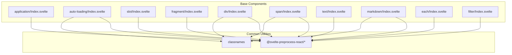
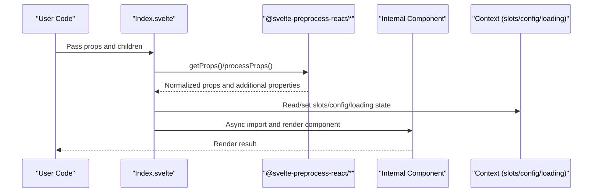
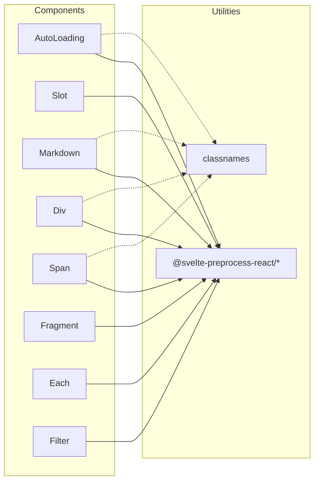

# Basic Components API

<cite>
**Files referenced in this document**
- [frontend/base/application/Index.svelte](file://frontend/base/application/Index.svelte)
- [frontend/base/auto-loading/Index.svelte](file://frontend/base/auto-loading/Index.svelte)
- [frontend/base/slot/Index.svelte](file://frontend/base/slot/Index.svelte)
- [frontend/base/fragment/Index.svelte](file://frontend/base/fragment/Index.svelte)
- [frontend/base/div/Index.svelte](file://frontend/base/div/Index.svelte)
- [frontend/base/span/Index.svelte](file://frontend/base/span/Index.svelte)
- [frontend/base/text/Index.svelte](file://frontend/base/text/Index.svelte)
- [frontend/base/markdown/Index.svelte](file://frontend/base/markdown/Index.svelte)
- [frontend/base/each/Index.svelte](file://frontend/base/each/Index.svelte)
- [frontend/base/filter/Index.svelte](file://frontend/base/filter/Index.svelte)
</cite>

## Table of Contents

1. [Introduction](#introduction)
2. [Project Structure](#project-structure)
3. [Core Components](#core-components)
4. [Architecture Overview](#architecture-overview)
5. [Detailed Component Analysis](#detailed-component-analysis)
6. [Dependency Analysis](#dependency-analysis)
7. [Performance Considerations](#performance-considerations)
8. [Troubleshooting Guide](#troubleshooting-guide)
9. [Conclusion](#conclusion)
10. [Appendix](#appendix)

## Introduction

This document is the authoritative reference for ModelScope Studio's basic Svelte components, covering the complete API specifications and usage instructions for the following components: Application, AutoLoading, Slot, Fragment, Div, Span, Text, Markdown, Each, and Filter. Content includes:

- Property definitions and default values
- Event and callback conventions
- Slot system and parameter mapping
- Lifecycle and rendering control (visibility, lazy loading)
- Inter-component communication mechanisms (contexts, slot keys, loading states)
- TypeScript type constraints and interface specifications
- Instantiation and configuration example paths
- Performance optimization and best practices

## Project Structure

Base components are located in the `base` directory of the frontend workspace, organized with a "one directory per component" structure. Each component contains an entry `Index.svelte` and corresponding implementation files (`.tsx` or `.svelte`). Components use a unified preprocessing toolchain for property extraction, additional property injection, and lazy loading.

Diagram sources

- [frontend/base/application/Index.svelte:1-17](file://frontend/base/application/Index.svelte#L1-L17)
- [frontend/base/auto-loading/Index.svelte:1-81](file://frontend/base/auto-loading/Index.svelte#L1-L81)
- [frontend/base/slot/Index.svelte:1-68](file://frontend/base/slot/Index.svelte#L1-L68)
- [frontend/base/fragment/Index.svelte:1-50](file://frontend/base/fragment/Index.svelte#L1-L50)
- [frontend/base/div/Index.svelte:1-65](file://frontend/base/div/Index.svelte#L1-L65)
- [frontend/base/span/Index.svelte:1-64](file://frontend/base/span/Index.svelte#L1-L64)
- [frontend/base/text/Index.svelte:1-42](file://frontend/base/text/Index.svelte#L1-L42)
- [frontend/base/markdown/Index.svelte:1-64](file://frontend/base/markdown/Index.svelte#L1-L64)
- [frontend/base/each/Index.svelte:1-111](file://frontend/base/each/Index.svelte#L1-L111)
- [frontend/base/filter/Index.svelte:1-52](file://frontend/base/filter/Index.svelte#L1-L52)

Section sources

- [frontend/base/application/Index.svelte:1-17](file://frontend/base/application/Index.svelte#L1-L17)
- [frontend/base/auto-loading/Index.svelte:1-81](file://frontend/base/auto-loading/Index.svelte#L1-L81)
- [frontend/base/slot/Index.svelte:1-68](file://frontend/base/slot/Index.svelte#L1-L68)
- [frontend/base/fragment/Index.svelte:1-50](file://frontend/base/fragment/Index.svelte#L1-L50)
- [frontend/base/div/Index.svelte:1-65](file://frontend/base/div/Index.svelte#L1-L65)
- [frontend/base/span/Index.svelte:1-64](file://frontend/base/span/Index.svelte#L1-L64)
- [frontend/base/text/Index.svelte:1-42](file://frontend/base/text/Index.svelte#L1-L42)
- [frontend/base/markdown/Index.svelte:1-64](file://frontend/base/markdown/Index.svelte#L1-L64)
- [frontend/base/each/Index.svelte:1-111](file://frontend/base/each/Index.svelte#L1-L111)
- [frontend/base/filter/Index.svelte:1-52](file://frontend/base/filter/Index.svelte#L1-L52)

## Core Components

This section systematically covers the key properties, events, slots, and lifecycle of each component, along with type constraints and usage notes.

- **Application**
  - Purpose: Dynamically imports and renders application-level components, with support for lazy loading and `children` rendering.
  - Key properties
    - `children`: Optional render function for passing child nodes.
    - Other properties are extracted by `getProps` and passed through to internal components.
  - Lifecycle
    - Uses `{#await}` for async rendering, ensuring the component mounts only after the import completes.
  - Example path
    - [frontend/base/application/Index.svelte:1-17](file://frontend/base/application/Index.svelte#L1-L17)

- **AutoLoading**
  - Purpose: Wraps any component, providing visibility, generating state, error state, and style passthrough capabilities.
  - Key properties
    - `visible`: Controls whether to render.
    - `generating`: Indicates the generating state, affecting the loading status.
    - `showError`: Whether to display the error state.
    - `elem_id`/`elem_classes`/`elem_style`: DOM attribute passthrough.
    - `as_item`/`_internal`: Internal flags and container identifiers.
    - Other properties are passed through after processing by `getComponentProps`/`processProps`.
  - Context
    - Reads config type, slot collection, and loading status.
  - Example path
    - [frontend/base/auto-loading/Index.svelte:1-81](file://frontend/base/auto-loading/Index.svelte#L1-L81)

- **Slot**
  - Purpose: Registers and updates named slots, supporting parameter mapping and visibility control.
  - Key properties
    - `value`: Slot key value.
    - `params_mapping`: Parameter mapping expression string, converted to a function at runtime.
    - `visible`/`as_item`/`_internal`: Controls visibility and containerization.
  - Behavior
    - Detects `value` changes in `effect` and calls `setSlot` to update the context.
    - Sets the current slot key and parameter mapping.
  - Example path
    - [frontend/base/slot/Index.svelte:1-68](file://frontend/base/slot/Index.svelte#L1-L68)

- **Fragment**
  - Purpose: Lightweight container that wraps multiple child nodes without introducing extra DOM.
  - Key properties
    - `visible`/`_internal`/`as_item`: Controls visibility and containerization.
    - Other properties are passed through to the internal Fragment.
  - Note
    - `shouldResetSlotKey`: Slot key reset is disabled in the configuration.
  - Example path
    - [frontend/base/fragment/Index.svelte:1-50](file://frontend/base/fragment/Index.svelte#L1-L50)

- **Div**
  - Purpose: Block-level container supporting styles, class names, IDs, and internal layout flags.
  - Key properties
    - `value`: Text or content value.
    - `elem_style`: Inline style object.
    - `additional_props`: Additional properties object.
    - `_internal.layout`: Marks whether this is a layout-related internal element.
    - `visible`/`as_item`/`elem_id`/`elem_classes`: Controls visibility and DOM attributes.
  - Example path
    - [frontend/base/div/Index.svelte:1-65](file://frontend/base/div/Index.svelte#L1-L65)

- **Span**
  - Purpose: Inline container; behaves similarly to Div but with inline semantics.
  - Key properties
    - `value`: Text or content value.
    - `additional_props`: Additional properties object.
    - `_internal.layout`: Marks whether this is a layout-related internal element.
    - `visible`/`as_item`/`elem_id`/`elem_classes`/`elem_style`: Controls visibility and DOM attributes.
  - Example path
    - [frontend/base/span/Index.svelte:1-64](file://frontend/base/span/Index.svelte#L1-L64)

- **Text**
  - Purpose: Text display component with value and common property passthrough.
  - Key properties
    - `value`: Text value.
    - `visible`/`as_item`/`_internal`: Controls visibility and containerization.
  - Example path
    - [frontend/base/text/Index.svelte:1-42](file://frontend/base/text/Index.svelte#L1-L42)

- **Markdown**
  - Purpose: Markdown rendering component with support for themes, root paths, and slots.
  - Key properties
    - `value`: Markdown text.
    - `elem_id`/`elem_classes`/`elem_style`: DOM attribute passthrough.
    - `visible`/`as_item`/`_internal`: Controls visibility and containerization.
  - Context
    - Reads `root` and `theme` from the shared configuration.
    - Reads the slot collection for custom component embedding.
  - Example path
    - [frontend/base/markdown/Index.svelte:1-64](file://frontend/base/markdown/Index.svelte#L1-L64)

- **Each**
  - Purpose: List rendering component supporting context merging, index calculation, and placeholders.
  - Key properties
    - `value`: Array to be rendered.
    - `context_value`: Context object.
    - `_internal.index`: Internal start index.
    - `visible`/`as_item`/`elem_id`/`elem_classes`/`elem_style`: Controls visibility and DOM attributes.
  - Behavior
    - Uses `EachPlaceholder` to merge external changes and determines whether to force-clone rendering.
    - Supports nested Each, calculating sub-indices and slot keys via `getSubIndex` and `getSlotKey`.
  - Example path
    - [frontend/base/each/Index.svelte:1-111](file://frontend/base/each/Index.svelte#L1-L111)

- **Filter**
  - Purpose: Conditional filter component that wraps `children` into a fragment filterable by parameter mapping.
  - Key properties
    - `params_mapping`: Parameter mapping expression string.
    - `visible`/`as_item`/`_internal`: Controls visibility and containerization.
  - Example path
    - [frontend/base/filter/Index.svelte:1-52](file://frontend/base/filter/Index.svelte#L1-L52)

Section sources

- [frontend/base/application/Index.svelte:1-17](file://frontend/base/application/Index.svelte#L1-L17)
- [frontend/base/auto-loading/Index.svelte:1-81](file://frontend/base/auto-loading/Index.svelte#L1-L81)
- [frontend/base/slot/Index.svelte:1-68](file://frontend/base/slot/Index.svelte#L1-L68)
- [frontend/base/fragment/Index.svelte:1-50](file://frontend/base/fragment/Index.svelte#L1-L50)
- [frontend/base/div/Index.svelte:1-65](file://frontend/base/div/Index.svelte#L1-L65)
- [frontend/base/span/Index.svelte:1-64](file://frontend/base/span/Index.svelte#L1-L64)
- [frontend/base/text/Index.svelte:1-42](file://frontend/base/text/Index.svelte#L1-L42)
- [frontend/base/markdown/Index.svelte:1-64](file://frontend/base/markdown/Index.svelte#L1-L64)
- [frontend/base/each/Index.svelte:1-111](file://frontend/base/each/Index.svelte#L1-L111)
- [frontend/base/filter/Index.svelte:1-52](file://frontend/base/filter/Index.svelte#L1-L52)

## Architecture Overview

Base components complete property resolution, additional property injection, and lazy loading through a unified preprocessing pipeline, while leveraging the context system for slot registration, loading state, and config type management. Components collaborate through props and contexts, forming clear responsibility boundaries and composability.

Diagram sources

- [frontend/base/auto-loading/Index.svelte:15-52](file://frontend/base/auto-loading/Index.svelte#L15-L52)
- [frontend/base/slot/Index.svelte:16-54](file://frontend/base/slot/Index.svelte#L16-L54)
- [frontend/base/markdown/Index.svelte:19-44](file://frontend/base/markdown/Index.svelte#L19-L44)

## Detailed Component Analysis

### Application Component

- Design highlights
  - Uses `importComponent` to dynamically import internal `Application.svelte`.
  - Renders `children` as slot content.
- API summary
  - Properties
    - `children`: Optional render function
    - Other properties are extracted by `getProps` and passed through
  - Slots
    - Default slot: `children()`
  - Lifecycle
    - `{#await}` async rendering prevents mounting before import completes

Example path

- [frontend/base/application/Index.svelte:1-17](file://frontend/base/application/Index.svelte#L1-L17)

Section sources

- [frontend/base/application/Index.svelte:1-17](file://frontend/base/application/Index.svelte#L1-L17)

### AutoLoading Component

- Design highlights
  - Wraps any component, providing visibility, generating state, error state, and style passthrough.
  - Integrates with `getLoadingStatus` and config type linkage.
- API summary
  - Properties
    - `visible`/`generating`/`showError`
    - `elem_id`/`elem_classes`/`elem_style`
    - `as_item`/`_internal`
    - Other properties processed by `processProps`
  - Context
    - Reads config type, slot collection, and loading status
  - Slots
    - Default slot: `children()`

Example path

- [frontend/base/auto-loading/Index.svelte:1-81](file://frontend/base/auto-loading/Index.svelte#L1-L81)

Section sources

- [frontend/base/auto-loading/Index.svelte:1-81](file://frontend/base/auto-loading/Index.svelte#L1-L81)

### Slot Component

- Design highlights
  - Registers named slots with support for parameter mapping and visibility control.
  - Detects `value` changes in `effect` and updates the context.
- API summary
  - Properties
    - `value`: Slot key
    - `params_mapping`: Parameter mapping expression
    - `visible`/`as_item`/`_internal`
  - Behavior
    - `setSlotKey`/`setSlotParamsMapping`
    - Obtains the host element via `svelte-slot bind:this`

Example path

- [frontend/base/slot/Index.svelte:1-68](file://frontend/base/slot/Index.svelte#L1-L68)

Section sources

- [frontend/base/slot/Index.svelte:1-68](file://frontend/base/slot/Index.svelte#L1-L68)

### Fragment Component

- Design highlights
  - Lightweight container that does not introduce extra DOM.
  - Slot key reset is disabled to maintain context stability.
- API summary
  - Properties
    - `visible`/`_internal`/`as_item`
    - Other properties are passed through
  - Slots
    - Default slot: `children()`

Example path

- [frontend/base/fragment/Index.svelte:1-50](file://frontend/base/fragment/Index.svelte#L1-L50)

Section sources

- [frontend/base/fragment/Index.svelte:1-50](file://frontend/base/fragment/Index.svelte#L1-L50)

### Div Component

- Design highlights
  - Block-level container supporting styles, class names, IDs, and internal layout flags.
- API summary
  - Properties
    - `value`/`additional_props`/`_internal.layout`
    - `elem_id`/`elem_classes`/`elem_style`
    - `visible`/`as_item`/`_internal`
  - Slots
    - Default slot: `children()`

Example path

- [frontend/base/div/Index.svelte:1-65](file://frontend/base/div/Index.svelte#L1-L65)

Section sources

- [frontend/base/div/Index.svelte:1-65](file://frontend/base/div/Index.svelte#L1-L65)

### Span Component

- Design highlights
  - Inline container; behaves similarly to Div.
- API summary
  - Properties
    - `value`/`additional_props`/`_internal.layout`
    - `elem_id`/`elem_classes`/`elem_style`
    - `visible`/`as_item`/`_internal`
  - Slots
    - Default slot: `children()`

Example path

- [frontend/base/span/Index.svelte:1-64](file://frontend/base/span/Index.svelte#L1-L64)

Section sources

- [frontend/base/span/Index.svelte:1-64](file://frontend/base/span/Index.svelte#L1-L64)

### Text Component

- Design highlights
  - Text display component with minimal overhead.
- API summary
  - Properties
    - `value`
    - `visible`/`as_item`/`_internal`

Example path

- [frontend/base/text/Index.svelte:1-42](file://frontend/base/text/Index.svelte#L1-L42)

Section sources

- [frontend/base/text/Index.svelte:1-42](file://frontend/base/text/Index.svelte#L1-L42)

### Markdown Component

- Design highlights
  - Supports themes and root paths, combining with slots for extensible rendering.
- API summary
  - Properties
    - `value`
    - `elem_id`/`elem_classes`/`elem_style`
    - `visible`/`as_item`/`_internal`
  - Context
    - Reads `shared.root` and `theme`
    - Reads the slot collection

Example path

- [frontend/base/markdown/Index.svelte:1-64](file://frontend/base/markdown/Index.svelte#L1-L64)

Section sources

- [frontend/base/markdown/Index.svelte:1-64](file://frontend/base/markdown/Index.svelte#L1-L64)

### Each Component

- Design highlights
  - List rendering with support for context merging, index calculation, and placeholders.
  - Nested Each calculates sub-indices and slot keys via `getSubIndex` and `getSlotKey`.
- API summary
  - Properties
    - `value`/`context_value`/`_internal.index`
    - `elem_id`/`elem_classes`/`elem_style`
    - `visible`/`as_item`/`_internal`
  - Slots
    - Default slot: `children()`
  - Events
    - `EachPlaceholder.onChange`: Receives merged `value` and `contextValue`

Example path

- [frontend/base/each/Index.svelte:1-111](file://frontend/base/each/Index.svelte#L1-L111)

Section sources

- [frontend/base/each/Index.svelte:1-111](file://frontend/base/each/Index.svelte#L1-L111)

### Filter Component

- Design highlights
  - Conditional filter container that wraps `children` into a fragment filterable by parameter mapping.
- API summary
  - Properties
    - `params_mapping`
    - `visible`/`as_item`/`_internal`
  - Slots
    - Default slot: `children()`

Example path

- [frontend/base/filter/Index.svelte:1-52](file://frontend/base/filter/Index.svelte#L1-L52)

Section sources

- [frontend/base/filter/Index.svelte:1-52](file://frontend/base/filter/Index.svelte#L1-L52)

## Dependency Analysis

Base components generally depend on the `@svelte-preprocess-react` toolkit and styling libraries, forming a unified property processing and lazy loading mechanism. Some components also depend on the context system for slot registration and loading state management.

Diagram sources

- [frontend/base/auto-loading/Index.svelte:1-10](file://frontend/base/auto-loading/Index.svelte#L1-L10)
- [frontend/base/slot/Index.svelte:1-8](file://frontend/base/slot/Index.svelte#L1-L8)
- [frontend/base/markdown/Index.svelte:1-8](file://frontend/base/markdown/Index.svelte#L1-L8)
- [frontend/base/div/Index.svelte:1-8](file://frontend/base/div/Index.svelte#L1-L8)
- [frontend/base/span/Index.svelte:1-7](file://frontend/base/span/Index.svelte#L1-L7)

Section sources

- [frontend/base/auto-loading/Index.svelte:1-10](file://frontend/base/auto-loading/Index.svelte#L1-L10)
- [frontend/base/slot/Index.svelte:1-8](file://frontend/base/slot/Index.svelte#L1-L8)
- [frontend/base/markdown/Index.svelte:1-8](file://frontend/base/markdown/Index.svelte#L1-L8)
- [frontend/base/div/Index.svelte:1-8](file://frontend/base/div/Index.svelte#L1-L8)
- [frontend/base/span/Index.svelte:1-7](file://frontend/base/span/Index.svelte#L1-L7)

## Performance Considerations

- Lazy loading
  - Use `importComponent` and `{#await}` to load components only when needed, reducing the initial load.
- Visibility control
  - Use the `visible` property to quickly show/hide without triggering unnecessary rendering and context updates.
- Slot keys and contexts
  - Set slot keys and parameter mappings appropriately to avoid duplicate registration and invalid updates.
- Style passthrough
  - Prefer `elem_classes` and `elem_style` to reduce frequent inline style changes.
- List rendering
  - The Each component supports placeholder and force-clone strategies; choose as needed to balance performance and consistency.
- Loading state
  - AutoLoading combines `generating` and `showError` states to avoid duplicate requests and flickering.

## Troubleshooting Guide

- Component not rendering
  - Check if the `visible` property is `true`.
  - Confirm that the `{#await}` import flow succeeded.
- Slot not taking effect
  - Confirm that `Slot`'s `value` and `params_mapping` are correctly set.
  - Check that the parent component has correctly registered the slot key.
- Each rendering abnormalities
  - Check that `value` is an array and `context_value` is an object.
  - For nested Each, confirm the index and slot key calculation logic.
- Markdown theme or resource path issues
  - Confirm that `shared.root` and `theme` configurations are correct.
- AutoLoading state out of sync
  - Check that `generating` and `showError` are consistent with the business state.

Section sources

- [frontend/base/each/Index.svelte:66-104](file://frontend/base/each/Index.svelte#L66-L104)
- [frontend/base/markdown/Index.svelte:47-63](file://frontend/base/markdown/Index.svelte#L47-L63)
- [frontend/base/auto-loading/Index.svelte:65-80](file://frontend/base/auto-loading/Index.svelte#L65-L80)
- [frontend/base/slot/Index.svelte:57-61](file://frontend/base/slot/Index.svelte#L57-L61)

## Conclusion

ModelScope Studio's base components achieve a highly cohesive, loosely coupled, and easily composable UI infrastructure through a unified preprocessing pipeline and context system. By following the property specifications, slot conventions, and performance recommendations in this document, stable runtime performance can be achieved while maintaining development efficiency.

## Appendix

- TypeScript type constraints and interface specifications
  - `getProps<T>()`: Extracts and normalizes component properties from `$props()`, where T is the component property interface.
  - `processProps(fn, ..., options)`: Performs secondary processing on component properties, returning derived values.
  - Context access: `getConfigType()`/`getSlots()`/`getLoadingStatus()`/`getSetSlot()`, etc.
  - Style handling: `classnames` for class name concatenation.
- Best practices
  - Prefer using `visible` to control rendering and avoid expensive operations in invisible states.
  - Properly separate `value` and `context_value` in Each to improve diff efficiency.
  - Use `params_mapping` to encapsulate complex logic as string expressions for easier maintenance.
  - For heavy components, combine with AutoLoading and lazy loading to optimize the initial load experience.
