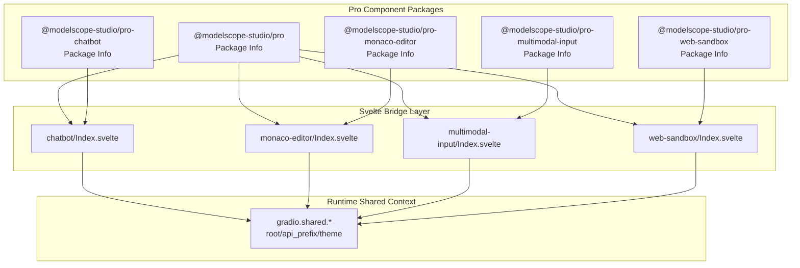
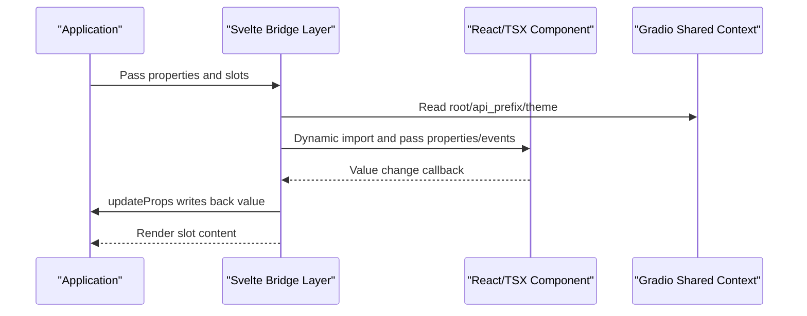
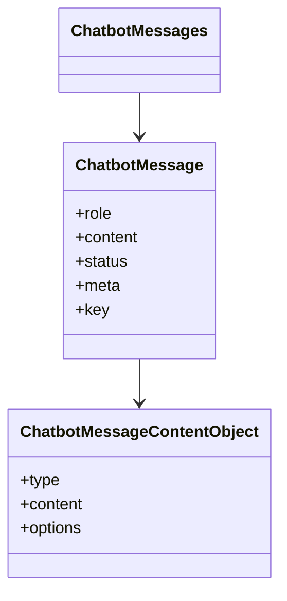
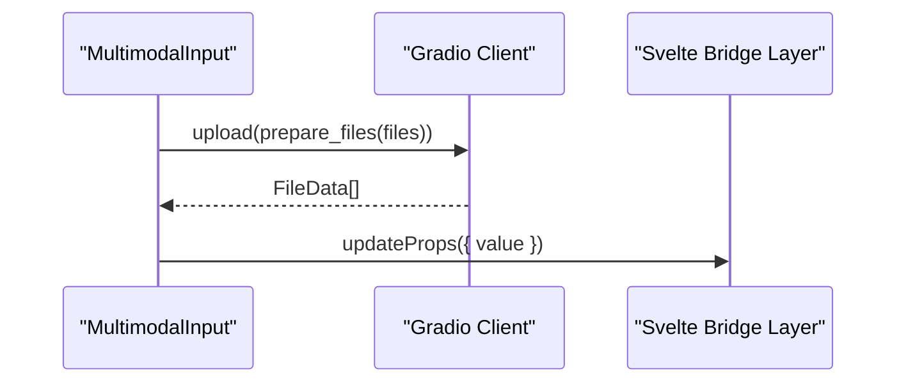
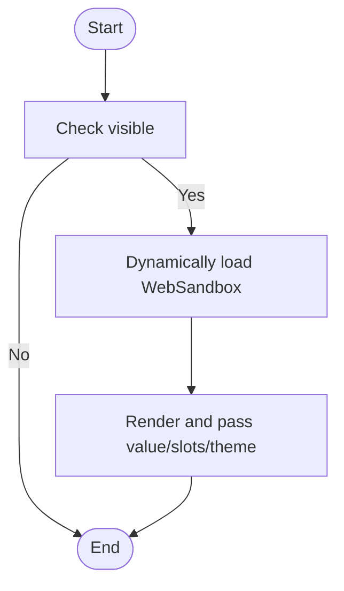
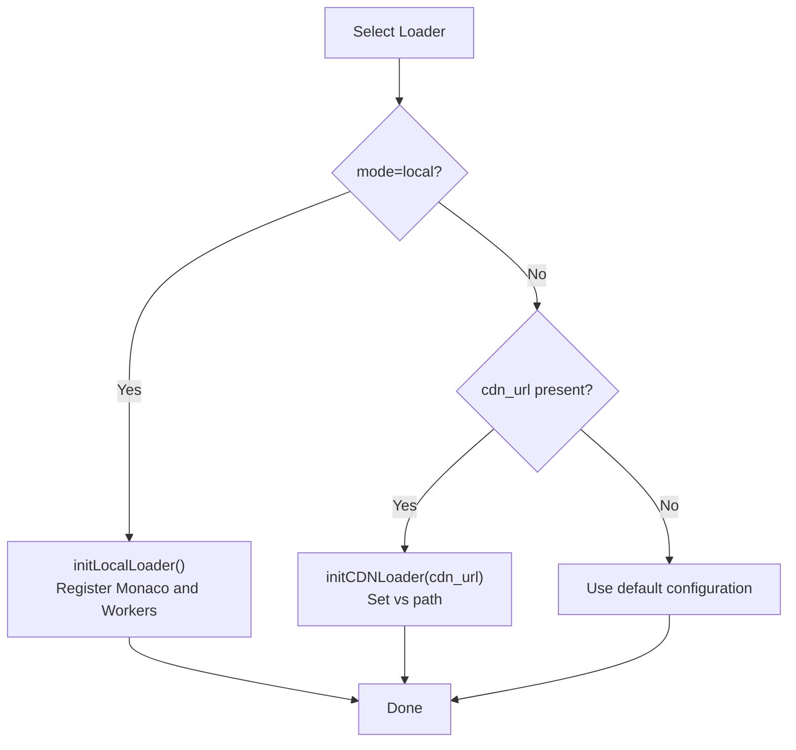
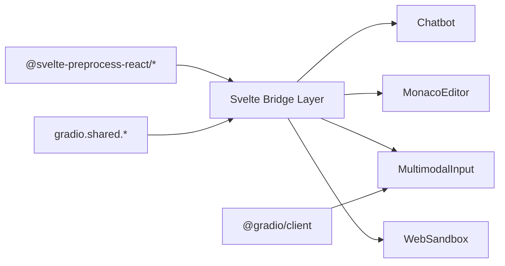

# Pro Components API

<cite>
**Files referenced in this document**
- [frontend/pro/package.json](file://frontend/pro/package.json)
- [frontend/pro/chatbot/package.json](file://frontend/pro/chatbot/package.json)
- [frontend/pro/monaco-editor/package.json](file://frontend/pro/monaco-editor/package.json)
- [frontend/pro/multimodal-input/package.json](file://frontend/pro/multimodal-input/package.json)
- [frontend/pro/web-sandbox/package.json](file://frontend/pro/web-sandbox/package.json)
- [frontend/pro/chatbot/Index.svelte](file://frontend/pro/chatbot/Index.svelte)
- [frontend/pro/monaco-editor/Index.svelte](file://frontend/pro/monaco-editor/Index.svelte)
- [frontend/pro/multimodal-input/Index.svelte](file://frontend/pro/multimodal-input/Index.svelte)
- [frontend/pro/web-sandbox/Index.svelte](file://frontend/pro/web-sandbox/Index.svelte)
- [frontend/pro/chatbot/type.ts](file://frontend/pro/chatbot/type.ts)
- [frontend/pro/monaco-editor/loader.ts](file://frontend/pro/monaco-editor/loader.ts)
</cite>

## Table of Contents

1. [Introduction](#introduction)
2. [Project Structure](#project-structure)
3. [Core Components](#core-components)
4. [Architecture Overview](#architecture-overview)
5. [Detailed Component Analysis](#detailed-component-analysis)
6. [Dependency Analysis](#dependency-analysis)
7. [Performance Considerations](#performance-considerations)
8. [Troubleshooting Guide](#troubleshooting-guide)
9. [Conclusion](#conclusion)
10. [Appendix](#appendix)

## Introduction

This document is the authoritative reference for ModelScope Studio Pro Svelte components, covering the complete API for the following professional components: Chatbot, MultimodalInput, WebSandbox, and MonacoEditor. Content includes:

- Property definitions and default behaviors
- Event handling and callbacks
- Slot system and rendering extensions
- Advanced capabilities and integration points (such as Gradio shared context)
- Real-time communication and state update mechanisms
- TypeScript types and interface specifications
- Performance optimization and best practices (especially for AI applications)

## Project Structure

Pro components are located in the `pro` directory of the frontend workspace. Each component is exported as an independent package, bridged to the underlying React/TSX implementation through Svelte components, and leverages the `getProps`/`processProps`/`importComponent` capabilities provided by `@svelte-preprocess-react` for property passthrough, event writeback, and dynamic loading.

Diagram sources

- [frontend/pro/package.json:1-6](file://frontend/pro/package.json#L1-L6)
- [frontend/pro/chatbot/package.json:1-15](file://frontend/pro/chatbot/package.json#L1-L15)
- [frontend/pro/monaco-editor/package.json:1-15](file://frontend/pro/monaco-editor/package.json#L1-L15)
- [frontend/pro/multimodal-input/package.json:1-15](file://frontend/pro/multimodal-input/package.json#L1-L15)
- [frontend/pro/web-sandbox/package.json:1-15](file://frontend/pro/web-sandbox/package.json#L1-L15)
- [frontend/pro/chatbot/Index.svelte:1-90](file://frontend/pro/chatbot/Index.svelte#L1-L90)
- [frontend/pro/monaco-editor/Index.svelte:1-101](file://frontend/pro/monaco-editor/Index.svelte#L1-L101)
- [frontend/pro/multimodal-input/Index.svelte:1-99](file://frontend/pro/multimodal-input/Index.svelte#L1-L99)
- [frontend/pro/web-sandbox/Index.svelte:1-76](file://frontend/pro/web-sandbox/Index.svelte#L1-L76)

Section sources

- [frontend/pro/package.json:1-6](file://frontend/pro/package.json#L1-L6)
- [frontend/pro/chatbot/package.json:1-15](file://frontend/pro/chatbot/package.json#L1-L15)
- [frontend/pro/monaco-editor/package.json:1-15](file://frontend/pro/monaco-editor/package.json#L1-L15)
- [frontend/pro/multimodal-input/package.json:1-15](file://frontend/pro/multimodal-input/package.json#L1-L15)
- [frontend/pro/web-sandbox/package.json:1-15](file://frontend/pro/web-sandbox/package.json#L1-L15)

## Core Components

This section provides an overview of the responsibilities and common capabilities of the four professional components:

- **Chatbot**: Displays and interacts with conversational message streams. Supports composite content including text, tool calls, files, welcome messages, and suggested prompts. Features user/assistant actions (copy, edit, delete, like/dislike, retry) and theme adaptation.
- **MultimodalInput**: Multimodal input entry supporting text and file uploads, with upload hooks and event callbacks for easy integration with Gradio clients.
- **WebSandbox**: A compilable and renderable web sandbox providing compile error/success and render error events, with support for theme mode and slot extensions.
- **MonacoEditor**: A code editor based on Monaco, supporting initialization with local or CDN loaders, with value change events and theme mode.

Section sources

- [frontend/pro/chatbot/Index.svelte:1-90](file://frontend/pro/chatbot/Index.svelte#L1-L90)
- [frontend/pro/multimodal-input/Index.svelte:1-99](file://frontend/pro/multimodal-input/Index.svelte#L1-L99)
- [frontend/pro/web-sandbox/Index.svelte:1-76](file://frontend/pro/web-sandbox/Index.svelte#L1-L76)
- [frontend/pro/monaco-editor/Index.svelte:1-101](file://frontend/pro/monaco-editor/Index.svelte#L1-L101)

## Architecture Overview

All four components adopt a unified bridging pattern: the Svelte layer handles property resolution, event writeback, dynamic imports, and slot rendering; the underlying TSX components carry the specific UI logic; the runtime shared context (`gradio.shared`) provides global configurations such as `root`, `api_prefix`, and `theme`.

Diagram sources

- [frontend/pro/chatbot/Index.svelte:14-64](file://frontend/pro/chatbot/Index.svelte#L14-L64)
- [frontend/pro/monaco-editor/Index.svelte:14-89](file://frontend/pro/monaco-editor/Index.svelte#L14-L89)
- [frontend/pro/multimodal-input/Index.svelte:17-66](file://frontend/pro/multimodal-input/Index.svelte#L17-L66)
- [frontend/pro/web-sandbox/Index.svelte:14-57](file://frontend/pro/web-sandbox/Index.svelte#L14-L57)

## Detailed Component Analysis

### Chatbot Component API

- Package exports and entry point
  - Package name and export mapping follow the standard; the main entry points to `Index.svelte`.
- Property definitions
  - `additional_props`: Additional property passthrough
  - `as_item`: Element identifier
  - `_internal`: Internal layout flag
  - `value`: Message array, type see `ChatbotMessages`
  - `suggestion_select` / `welcome_prompt_select`: Event callback alias mappings
  - Visibility and style: `visible`, `elem_id`, `elem_classes`, `elem_style`
  - Runtime shared: `gradio.shared.root`, `gradio.shared.api_prefix`, `gradio.shared.theme`
- Events and callbacks
  - `onValueChange`: Value change writeback to parent component
- Slot system
  - Supports `children` slot and `slots` mapping
- Data model and types
  - `ChatbotMessages`, `ChatbotMessage`, `ChatbotMessageContentObject`, action types (`like`/`dislike`/`retry`/`copy`/`edit`/`delete`), etc.
- Advanced features
  - Theme mode inherited from `gradio.shared.theme`
  - Built-in composite display of welcome messages, suggested prompts, files/tools/text content
- Usage examples (paths)
  - Basic usage and value binding: [frontend/pro/chatbot/Index.svelte:76-84](file://frontend/pro/chatbot/Index.svelte#L76-L84)
  - Event writeback: [frontend/pro/chatbot/Index.svelte:76-80](file://frontend/pro/chatbot/Index.svelte#L76-L80)
  - Type definition reference: [frontend/pro/chatbot/type.ts:160-197](file://frontend/pro/chatbot/type.ts#L160-L197)

Diagram sources

- [frontend/pro/chatbot/type.ts:137-158](file://frontend/pro/chatbot/type.ts#L137-L158)
- [frontend/pro/chatbot/type.ts:121-135](file://frontend/pro/chatbot/type.ts#L121-L135)

Section sources

- [frontend/pro/chatbot/package.json:1-15](file://frontend/pro/chatbot/package.json#L1-L15)
- [frontend/pro/chatbot/Index.svelte:14-64](file://frontend/pro/chatbot/Index.svelte#L14-L64)
- [frontend/pro/chatbot/Index.svelte:76-84](file://frontend/pro/chatbot/Index.svelte#L76-L84)
- [frontend/pro/chatbot/type.ts:160-197](file://frontend/pro/chatbot/type.ts#L160-L197)

### MultimodalInput Component API

- Package exports and entry point
  - Package name and export mapping follow the standard; the main entry points to `Index.svelte`.
- Property definitions
  - `additional_props`: Additional property passthrough
  - `_internal`: Internal flag
  - `value`: Multimodal input value, type from the underlying component
  - `key_press` / `paste_file` / `key_down`: Event callback alias mappings
  - Visibility and style: `visible`, `elem_id`, `elem_classes`, `elem_style`
  - Runtime shared: `gradio.shared.theme`
- Events and callbacks
  - `onValueChange`: Value change writeback
- Slot system
  - Supports `children` slot and `slots` mapping
- File upload
  - Upload hook: Uploads files via `gradio.shared.client.upload`, returns `FileData[]`
- Usage examples (paths)
  - Value binding and event writeback: [frontend/pro/multimodal-input/Index.svelte:88-92](file://frontend/pro/multimodal-input/Index.svelte#L88-L92)
  - Upload flow: [frontend/pro/multimodal-input/Index.svelte:68-75](file://frontend/pro/multimodal-input/Index.svelte#L68-L75)

Diagram sources

- [frontend/pro/multimodal-input/Index.svelte:68-75](file://frontend/pro/multimodal-input/Index.svelte#L68-L75)
- [frontend/pro/multimodal-input/Index.svelte:88-92](file://frontend/pro/multimodal-input/Index.svelte#L88-L92)

Section sources

- [frontend/pro/multimodal-input/package.json:1-15](file://frontend/pro/multimodal-input/package.json#L1-L15)
- [frontend/pro/multimodal-input/Index.svelte:17-66](file://frontend/pro/multimodal-input/Index.svelte#L17-L66)
- [frontend/pro/multimodal-input/Index.svelte:68-75](file://frontend/pro/multimodal-input/Index.svelte#L68-L75)

### WebSandbox Component API

- Package exports and entry point
  - Package name and export mapping follow the standard; the main entry points to `Index.svelte`.
- Property definitions
  - `additional_props`: Additional property passthrough
  - `_internal`: Internal flag
  - `value`: Sandbox value, type from the underlying component
  - `compile_error` / `compile_success` / `render_error`: Event callback alias mappings
  - Visibility and style: `visible`, `elem_id`, `elem_classes`, `elem_style`
  - Runtime shared: `gradio.shared.theme`
- Slot system
  - Supports `children` slot and `slots` mapping
- Usage examples (paths)
  - Value binding and theme: [frontend/pro/web-sandbox/Index.svelte:62-70](file://frontend/pro/web-sandbox/Index.svelte#L62-L70)

Diagram sources

- [frontend/pro/web-sandbox/Index.svelte:60-75](file://frontend/pro/web-sandbox/Index.svelte#L60-L75)

Section sources

- [frontend/pro/web-sandbox/package.json:1-15](file://frontend/pro/web-sandbox/package.json#L1-L15)
- [frontend/pro/web-sandbox/Index.svelte:14-57](file://frontend/pro/web-sandbox/Index.svelte#L14-L57)
- [frontend/pro/web-sandbox/Index.svelte:62-70](file://frontend/pro/web-sandbox/Index.svelte#L62-L70)

### MonacoEditor Component API

- Package exports and entry point
  - Package name and export mapping follow the standard; the main entry points to `Index.svelte`.
- Property definitions
  - `additional_props`: Additional property passthrough
  - `_internal`: Internal flag
  - `value`: Editor initial value
  - `_loader`: Loader configuration
    - `mode`: `'cdn'` | `'local'`
    - `cdn_url`: CDN path
  - Visibility and style: `visible`, `elem_id`, `elem_classes`, `elem_style`
  - Runtime shared: `gradio.shared.theme`
- Events and callbacks
  - `onValueChange`: Value change writeback
- Slot system
  - Supports `children` slot and `slots` mapping
- Loader mechanism
  - Local loading: Initializes Monaco and registers Workers by language
  - CDN loading: Sets the `vs` path
- Usage examples (paths)
  - Value binding and theme: [frontend/pro/monaco-editor/Index.svelte:79-89](file://frontend/pro/monaco-editor/Index.svelte#L79-L89)
  - Loader selection and initialization: [frontend/pro/monaco-editor/Index.svelte:61-70](file://frontend/pro/monaco-editor/Index.svelte#L61-L70)
  - Loader implementation: [frontend/pro/monaco-editor/loader.ts:27-94](file://frontend/pro/monaco-editor/loader.ts#L27-L94)

Diagram sources

- [frontend/pro/monaco-editor/Index.svelte:61-70](file://frontend/pro/monaco-editor/Index.svelte#L61-L70)
- [frontend/pro/monaco-editor/loader.ts:27-94](file://frontend/pro/monaco-editor/loader.ts#L27-L94)

Section sources

- [frontend/pro/monaco-editor/package.json:1-15](file://frontend/pro/monaco-editor/package.json#L1-L15)
- [frontend/pro/monaco-editor/Index.svelte:14-89](file://frontend/pro/monaco-editor/Index.svelte#L14-L89)
- [frontend/pro/monaco-editor/loader.ts:27-94](file://frontend/pro/monaco-editor/loader.ts#L27-L94)

## Dependency Analysis

- Unified dependency chain
  - The Svelte bridge layer depends on `getProps`/`processProps`/`importComponent` and slot utilities from `@svelte-preprocess-react`
  - Each component obtains shared configuration (`root`, `api_prefix`, `theme`) through `gradio.shared`
  - File upload capability comes from `prepare_files` and `client.upload` of `@gradio/client`
- Inter-component coupling
  - Low coupling: Each component independently maintains its own properties and events
  - High cohesion: The bridge layer handles property processing and dynamic loading; underlying components focus on UI logic

Diagram sources

- [frontend/pro/chatbot/Index.svelte:1-12](file://frontend/pro/chatbot/Index.svelte#L1-L12)
- [frontend/pro/monaco-editor/Index.svelte:1-12](file://frontend/pro/monaco-editor/Index.svelte#L1-L12)
- [frontend/pro/multimodal-input/Index.svelte:1-9](file://frontend/pro/multimodal-input/Index.svelte#L1-L9)
- [frontend/pro/web-sandbox/Index.svelte:1-8](file://frontend/pro/web-sandbox/Index.svelte#L1-L8)

Section sources

- [frontend/pro/chatbot/Index.svelte:1-12](file://frontend/pro/chatbot/Index.svelte#L1-L12)
- [frontend/pro/monaco-editor/Index.svelte:1-12](file://frontend/pro/monaco-editor/Index.svelte#L1-L12)
- [frontend/pro/multimodal-input/Index.svelte:1-9](file://frontend/pro/multimodal-input/Index.svelte#L1-L9)
- [frontend/pro/web-sandbox/Index.svelte:1-8](file://frontend/pro/web-sandbox/Index.svelte#L1-L8)

## Performance Considerations

- Dynamic imports and lazy loading
  - Use `importComponent` to dynamically import underlying components to avoid blocking the initial render
- Computed properties and derived values
  - Use `$derived` to reuse derived computations and reduce unnecessary re-renders
- Loader strategy
  - MonacoEditor supports both local and CDN loaders; choose as needed to balance bundle size and network overhead
- Event writeback
  - Trigger `updateProps` only when values change to avoid frequent writebacks
- File upload
  - Use `prepare_files` and the Gradio client for uploads to reduce manual serialization costs

## Troubleshooting Guide

- Editor not loading
  - Check that `_loader.mode` and `cdn_url` configurations are correct
  - Confirm that `initCDNLoader`/`initLocalLoader` has completed initialization
  - Reference: [frontend/pro/monaco-editor/Index.svelte:61-70](file://frontend/pro/monaco-editor/Index.svelte#L61-L70), [frontend/pro/monaco-editor/loader.ts:27-94](file://frontend/pro/monaco-editor/loader.ts#L27-L94)
- Upload failing
  - Confirm that `gradio.shared.client` is available and `root` is correct
  - Check `prepare_files` and the returned `FileData[]`
  - Reference: [frontend/pro/multimodal-input/Index.svelte:68-75](file://frontend/pro/multimodal-input/Index.svelte#L68-L75)
- Theme not applied
  - Confirm that `gradio.shared.theme` is set to `light`/`dark`
  - Reference: [frontend/pro/chatbot/Index.svelte:83](file://frontend/pro/chatbot/Index.svelte#L83), [frontend/pro/web-sandbox/Index.svelte:70](file://frontend/pro/web-sandbox/Index.svelte#L70), [frontend/pro/monaco-editor/Index.svelte:88](file://frontend/pro/monaco-editor/Index.svelte#L88)

Section sources

- [frontend/pro/monaco-editor/Index.svelte:61-70](file://frontend/pro/monaco-editor/Index.svelte#L61-L70)
- [frontend/pro/monaco-editor/loader.ts:27-94](file://frontend/pro/monaco-editor/loader.ts#L27-L94)
- [frontend/pro/multimodal-input/Index.svelte:68-75](file://frontend/pro/multimodal-input/Index.svelte#L68-L75)
- [frontend/pro/chatbot/Index.svelte:83](file://frontend/pro/chatbot/Index.svelte#L83)
- [frontend/pro/web-sandbox/Index.svelte:70](file://frontend/pro/web-sandbox/Index.svelte#L70)
- [frontend/pro/monaco-editor/Index.svelte:88](file://frontend/pro/monaco-editor/Index.svelte#L88)

## Conclusion

This reference document systematically covers the API and implementation details of ModelScope Studio's Pro Svelte components, emphasizing the unified pattern of the bridge layer, the use of the runtime shared context, and deep integration with the Gradio ecosystem. Through well-designed properties, event writeback, and dynamic loading strategies, these components efficiently support core AI application scenarios such as conversation, code editing, multimodal input, and sandbox rendering.

## Appendix

- TypeScript types and interfaces
  - Chatbot types: [frontend/pro/chatbot/type.ts:1-197](file://frontend/pro/chatbot/type.ts#L1-L197)
- Package exports and entry points
  - Chatbot: [frontend/pro/chatbot/package.json:1-15](file://frontend/pro/chatbot/package.json#L1-L15)
  - MonacoEditor: [frontend/pro/monaco-editor/package.json:1-15](file://frontend/pro/monaco-editor/package.json#L1-L15)
  - MultimodalInput: [frontend/pro/multimodal-input/package.json:1-15](file://frontend/pro/multimodal-input/package.json#L1-L15)
  - WebSandbox: [frontend/pro/web-sandbox/package.json:1-15](file://frontend/pro/web-sandbox/package.json#L1-L15)
- Component bridge implementations
  - Chatbot: [frontend/pro/chatbot/Index.svelte:1-90](file://frontend/pro/chatbot/Index.svelte#L1-L90)
  - MonacoEditor: [frontend/pro/monaco-editor/Index.svelte:1-101](file://frontend/pro/monaco-editor/Index.svelte#L1-L101)
  - MultimodalInput: [frontend/pro/multimodal-input/Index.svelte:1-99](file://frontend/pro/multimodal-input/Index.svelte#L1-L99)
  - WebSandbox: [frontend/pro/web-sandbox/Index.svelte:1-76](file://frontend/pro/web-sandbox/Index.svelte#L1-L76)
