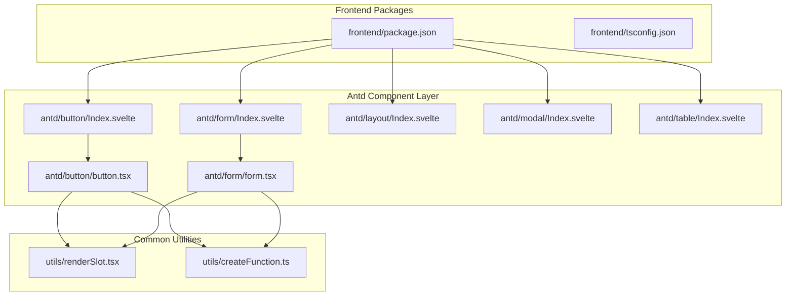
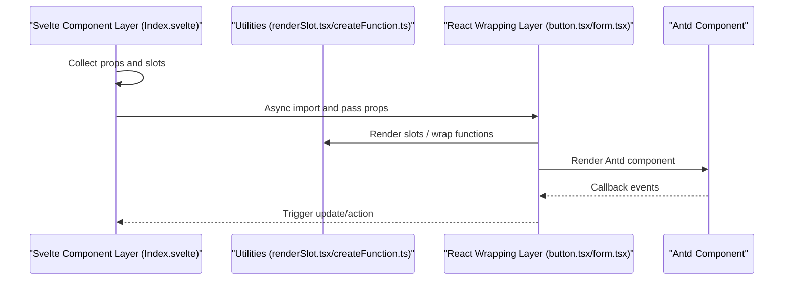
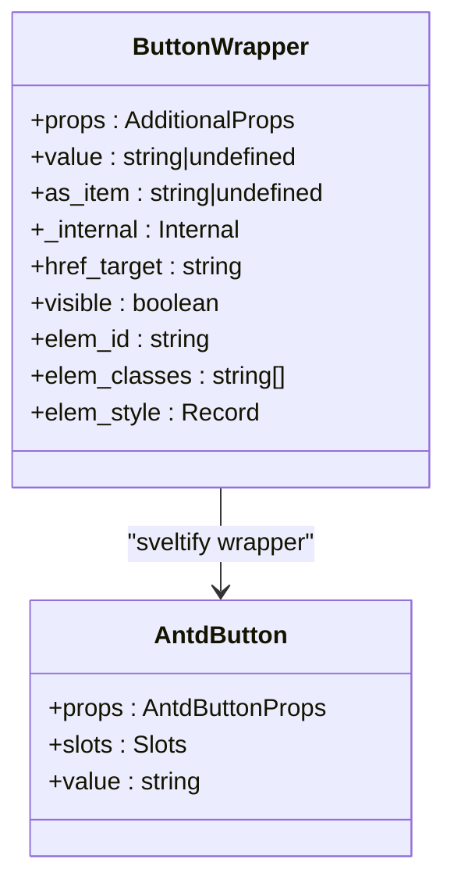
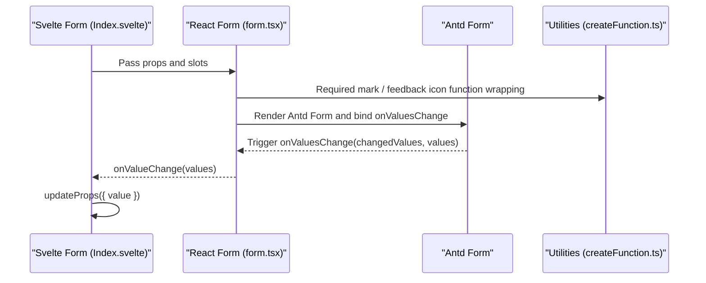
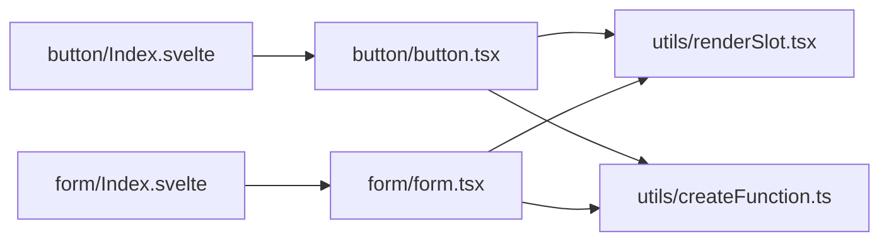

# Svelte Components API

<cite>
**Files referenced in this document**
- [frontend/package.json](file://frontend/package.json)
- [frontend/tsconfig.json](file://frontend/tsconfig.json)
- [frontend/antd/button/Index.svelte](file://frontend/antd/button/Index.svelte)
- [frontend/antd/button/button.tsx](file://frontend/antd/button/button.tsx)
- [frontend/antd/form/Index.svelte](file://frontend/antd/form/Index.svelte)
- [frontend/antd/form/form.tsx](file://frontend/antd/form/form.tsx)
- [frontend/antd/layout/Index.svelte](file://frontend/antd/layout/Index.svelte)
- [frontend/antd/modal/Index.svelte](file://frontend/antd/modal/Index.svelte)
- [frontend/antd/table/Index.svelte](file://frontend/antd/table/Index.svelte)
- [frontend/utils/renderSlot.tsx](file://frontend/utils/renderSlot.tsx)
- [frontend/utils/createFunction.ts](file://frontend/utils/createFunction.ts)
</cite>

## Table of Contents

1. [Introduction](#introduction)
2. [Project Structure](#project-structure)
3. [Core Components](#core-components)
4. [Architecture Overview](#architecture-overview)
5. [Component Details](#component-details)
6. [Dependency Analysis](#dependency-analysis)
7. [Performance and Best Practices](#performance-and-best-practices)
8. [Troubleshooting Guide](#troubleshooting-guide)
9. [Conclusion](#conclusion)
10. [Appendix](#appendix)

## Introduction

This document is the API reference for ModelScope Studio frontend Svelte components, focusing on the Svelte component encapsulation system based on the Ant Design (Antd) ecosystem. The document covers:

- Component property definitions: props interfaces, default values, and type constraints
- Event system: user interaction events, state change events, and custom events
- Slot system: usage of default slots, named slots, and scoped slots
- Lifecycle and rendering: component instantiation, async loading, and conditional rendering
- Inter-component communication: parent-child, sibling, and cross-level communication patterns
- Style customization: CSS class names, theme variables, and inline styles
- TypeScript types: interface specifications, generic usage, and type inference
- Performance optimization: on-demand loading, derived computation, and event throttling recommendations

## Project Structure

The frontend uses a multi-package organization, with core components in `frontend/antd` and `frontend/antdx`, implementing Antd components in Svelte through the Svelte 5 and React component bridging solution.

**Diagram sources**

- [frontend/package.json:1-59](file://frontend/package.json#L1-L59)
- [frontend/tsconfig.json:1-8](file://frontend/tsconfig.json#L1-L8)
- [frontend/antd/button/Index.svelte:1-74](file://frontend/antd/button/Index.svelte#L1-L74)
- [frontend/antd/button/button.tsx:1-39](file://frontend/antd/button/button.tsx#L1-L39)
- [frontend/antd/form/Index.svelte:1-99](file://frontend/antd/form/Index.svelte#L1-L99)
- [frontend/antd/form/form.tsx:1-79](file://frontend/antd/form/form.tsx#L1-L79)
- [frontend/antd/layout/Index.svelte:1-18](file://frontend/antd/layout/Index.svelte#L1-L18)
- [frontend/antd/modal/Index.svelte:1-63](file://frontend/antd/modal/Index.svelte#L1-L63)
- [frontend/antd/table/Index.svelte:1-61](file://frontend/antd/table/Index.svelte#L1-L61)
- [frontend/utils/renderSlot.tsx:1-29](file://frontend/utils/renderSlot.tsx#L1-L29)
- [frontend/utils/createFunction.ts:1-38](file://frontend/utils/createFunction.ts#L1-L38)

**Section sources**

- [frontend/package.json:1-59](file://frontend/package.json#L1-L59)
- [frontend/tsconfig.json:1-8](file://frontend/tsconfig.json#L1-L8)

## Core Components

This section provides an overview of the responsibilities and common characteristics of the main components:

- **Button**: Wraps Antd Button, supports icon and loading state slots, with visibility control and class name concatenation.
- **Form**: Wraps Antd Form, provides value synchronization, action triggers (reset/submit/validate), required mark, and feedback icon slots.
- **Layout**: Basic layout container that passes through children and component identifiers.
- **Modal**: Wraps Antd Modal, supports visibility control and slots.
- **Table**: Wraps Antd Table, supports visibility control and slots.

**Section sources**

- [frontend/antd/button/Index.svelte:1-74](file://frontend/antd/button/Index.svelte#L1-L74)
- [frontend/antd/button/button.tsx:1-39](file://frontend/antd/button/button.tsx#L1-L39)
- [frontend/antd/form/Index.svelte:1-99](file://frontend/antd/form/Index.svelte#L1-L99)
- [frontend/antd/form/form.tsx:1-79](file://frontend/antd/form/form.tsx#L1-L79)
- [frontend/antd/layout/Index.svelte:1-18](file://frontend/antd/layout/Index.svelte#L1-L18)
- [frontend/antd/modal/Index.svelte:1-63](file://frontend/antd/modal/Index.svelte#L1-L63)
- [frontend/antd/table/Index.svelte:1-61](file://frontend/antd/table/Index.svelte#L1-L61)

## Architecture Overview

Components adopt a three-layer architecture of "Svelte layer + React wrapping layer + utility functions":

- Svelte layer: Responsible for property collection, slot resolution, conditional rendering, and async loading.
- React wrapping layer: Uses `sveltify` to bridge Antd components for use in Svelte, handling slots and callbacks.
- Utility functions: Provides slot rendering, function-string-to-function conversion, and other capabilities.

**Diagram sources**

- [frontend/antd/button/Index.svelte:1-74](file://frontend/antd/button/Index.svelte#L1-L74)
- [frontend/antd/button/button.tsx:1-39](file://frontend/antd/button/button.tsx#L1-L39)
- [frontend/antd/form/Index.svelte:1-99](file://frontend/antd/form/Index.svelte#L1-L99)
- [frontend/antd/form/form.tsx:1-79](file://frontend/antd/form/form.tsx#L1-L79)
- [frontend/utils/renderSlot.tsx:1-29](file://frontend/utils/renderSlot.tsx#L1-L29)
- [frontend/utils/createFunction.ts:1-38](file://frontend/utils/createFunction.ts#L1-L38)

## Component Details

### Button

- Responsibility: Exposes Antd Button as a Svelte component, supports icon and loading state slots; conditionally renders based on visibility; concatenates style class names.
- Key props
  - `additional_props?: Record<string, any>`: Additional property passthrough
  - `value?: string | undefined`: Button text or value
  - `as_item?: string | undefined`: Used as item identifier
  - `_internal: { layout?: boolean }`: Internal layout flag
  - `href_target?: string`: Link target attribute mapping
  - Visibility and style: `visible`, `elem_id`, `elem_classes`, `elem_style`
- Event system
  - Events triggered by the underlying Antd Button are passed through via `{...props}`
- Slot system
  - `icon`: Icon slot
  - `loading.icon`: Loading state icon slot
- Lifecycle and rendering
  - Uses `importComponent` to asynchronously load the wrapper component
  - Conditional rendering: only renders when `visible` is true
- Style customization
  - Inline `style` and `className` passthrough
  - Fixed class name: `ms-gr-antd-button`
- TypeScript types
  - Wraps Antd Button's `GetProps` type via `sveltify`
  - Slot allowlist: `['icon', 'loading.icon']`

**Diagram sources**

- [frontend/antd/button/Index.svelte:12-56](file://frontend/antd/button/Index.svelte#L12-L56)
- [frontend/antd/button/button.tsx:8-36](file://frontend/antd/button/button.tsx#L8-L36)

**Section sources**

- [frontend/antd/button/Index.svelte:1-74](file://frontend/antd/button/Index.svelte#L1-L74)
- [frontend/antd/button/button.tsx:1-39](file://frontend/antd/button/button.tsx#L1-L39)

### Form

- Responsibility: Wraps Antd Form to provide value synchronization, action triggering, and slot extensions.
- Key props
  - `additional_props?: Record<string, any>`
  - `_internal: { layout?: boolean }`
  - `value?: Record<string, any>`: Form initial values
  - `form_action?: FormProps['formAction'] | null`: Action command (`reset`/`submit`/`validate`/`null`)
  - `form_name?: string`: Form name mapping
  - `fields_change?: any`, `finish_failed?: any`, `values_change?: any`: Event mapping
  - Visibility and style: `visible`, `elem_id`, `elem_classes`, `elem_style`
- Event system
  - `onValueChange(value: Record<string, any>)`: Value change callback
  - `onResetFormAction()`: Resets `form_action` after action execution
- Slot system
  - `requiredMark`: Required mark slot
- Lifecycle and rendering
  - Uses `importComponent` to asynchronously load the wrapper component
  - Conditional rendering: only renders when `visible` is true
- Style customization
  - Inline `style` and `className` passthrough
  - Fixed class name: `ms-gr-antd-form`
- TypeScript types
  - `FormProps` extends Antd Form Props, adding `value`, `onValueChange`, `formAction`, `onResetFormAction`
  - Slot allowlist: `['requiredMark']`

**Diagram sources**

- [frontend/antd/form/Index.svelte:14-98](file://frontend/antd/form/Index.svelte#L14-L98)
- [frontend/antd/form/form.tsx:8-76](file://frontend/antd/form/form.tsx#L8-L76)
- [frontend/utils/createFunction.ts:10-37](file://frontend/utils/createFunction.ts#L10-L37)

**Section sources**

- [frontend/antd/form/Index.svelte:1-99](file://frontend/antd/form/Index.svelte#L1-L99)
- [frontend/antd/form/form.tsx:1-79](file://frontend/antd/form/form.tsx#L1-L79)

### Layout

- Responsibility: Basic layout container that passes through children and component identifiers.
- Key props
  - `children: Snippet`: Default slot content
- Lifecycle and rendering
  - Directly renders the Base container component as a layout
- Style customization
  - Styles and class names are handled by the Base component

**Section sources**

- [frontend/antd/layout/Index.svelte:1-18](file://frontend/antd/layout/Index.svelte#L1-L18)

### Modal

- Responsibility: Wraps Antd Modal, supports visibility control and slots.
- Key props
  - `additional_props?: Record<string, any>`
  - `as_item?: string | undefined`
  - `_internal: { layout?: boolean }`
  - Visibility and style: `visible`, `elem_id`, `elem_classes`, `elem_style`
- Slot system
  - Default slot: Content area
- Style customization
  - Fixed class name: `ms-gr-antd-modal`

**Section sources**

- [frontend/antd/modal/Index.svelte:1-63](file://frontend/antd/modal/Index.svelte#L1-L63)

### Table

- Responsibility: Wraps Antd Table, supports visibility control and slots.
- Key props
  - `additional_props?: Record<string, any>`
  - `as_item?: string | undefined`
  - `_internal: {}`
  - Visibility and style: `visible`, `elem_id`, `elem_classes`, `elem_style`
- Slot system
  - Default slot: Content area
- Style customization
  - Fixed class name: `ms-gr-antd-table`

**Section sources**

- [frontend/antd/table/Index.svelte:1-61](file://frontend/antd/table/Index.svelte#L1-L61)

## Dependency Analysis

- Component dependencies
  - The Svelte layer depends on `getProps`/`importComponent`/`processProps`/`getSlots` provided by `@svelte-preprocess-react`
  - The React wrapping layer depends on the Ant Design component library and `sveltify`/`ReactSlot` from `@svelte-preprocess-react`
  - The utility layer provides slot rendering and function-string parsing capabilities
- External dependencies
  - Svelte 5, Antd, classnames, dayjs, immer, lodash-es, marked, mermaid, monaco-editor, etc.

**Diagram sources**

- [frontend/antd/button/Index.svelte:6-7](file://frontend/antd/button/Index.svelte#L6-L7)
- [frontend/antd/button/button.tsx:1-6](file://frontend/antd/button/button.tsx#L1-L6)
- [frontend/antd/form/Index.svelte:6-7](file://frontend/antd/form/Index.svelte#L6-L7)
- [frontend/antd/form/form.tsx:1-6](file://frontend/antd/form/form.tsx#L1-L6)
- [frontend/utils/renderSlot.tsx:1-29](file://frontend/utils/renderSlot.tsx#L1-L29)
- [frontend/utils/createFunction.ts:1-38](file://frontend/utils/createFunction.ts#L1-L38)

**Section sources**

- [frontend/package.json:8-39](file://frontend/package.json#L8-L39)

## Performance and Best Practices

- On-demand loading
  - Use `importComponent` to asynchronously import React wrapper components to avoid blocking the initial render
- Derived computation
  - Use `$derived` to derive from props and reduce redundant computation
- Event throttling and debouncing
  - For frequently-triggered callbacks (such as `onValuesChange`), throttle/debounce can be combined with utility functions
- Slot rendering optimization
  - Use `forceClone` and `params` judiciously to avoid unnecessary cloning overhead
- Styles and themes
  - Prefer combining `className` with inline styles; introduce Antd theme variables when necessary to ensure consistency

[This section provides general guidance and does not require specific file references]

## Troubleshooting Guide

- Slot not taking effect
  - Check if the slot name matches the wrapper layer allowlist (e.g., `icon`, `loading.icon`, `requiredMark`)
  - Confirm that slot elements are properly passed to `slots`
- Function string cannot execute
  - Use `createFunction` to convert the string to a function; ensure the format is valid
- Action not triggered
  - Confirm the `form_action` value matches the wrapper layer switch branch (`reset`/`submit`/`validate`/`null`)
  - Call `onResetFormAction` promptly after action execution to reset the state
- Visibility issues
  - Ensure the component is only rendered when `visible` is truthy to avoid empty rendering

**Section sources**

- [frontend/antd/button/button.tsx:10-36](file://frontend/antd/button/button.tsx#L10-L36)
- [frontend/antd/form/form.tsx:32-45](file://frontend/antd/form/form.tsx#L32-L45)
- [frontend/utils/createFunction.ts:10-37](file://frontend/utils/createFunction.ts#L10-L37)

## Conclusion

ModelScope Studio's Svelte Component API achieves stable use of Antd components in Svelte through a unified bridge layer and utility functions. Its design emphasizes:

- Clear props interfaces and type constraints
- Rich slot system and event mapping
- Controllable rendering and style strategies
- Extensible toolchain to support complex scenarios

[This section is a summary and does not require specific file references]

## Appendix

### Component Properties and Events Quick Reference (Summary)

- **Button**
  - Properties: `additional_props`, `value`, `as_item`, `_internal`, `href_target`, `visible`, `elem_id`, `elem_classes`, `elem_style`
  - Events: Passed through from Antd Button
  - Slots: `icon`, `loading.icon`
  - Class name: Fixed `ms-gr-antd-button`
- **Form**
  - Properties: `additional_props`, `_internal`, `value`, `form_action`, `form_name`, `fields_change`, `finish_failed`, `values_change`, `visible`, `elem_id`, `elem_classes`, `elem_style`
  - Events: `onValueChange`, `onResetFormAction`
  - Slots: `requiredMark`
  - Class name: Fixed `ms-gr-antd-form`
- **Layout**
  - Properties: `children` (default slot)
- **Modal**
  - Properties: `additional_props`, `as_item`, `_internal`, `visible`, `elem_id`, `elem_classes`, `elem_style`
  - Class name: Fixed `ms-gr-antd-modal`
- **Table**
  - Properties: `additional_props`, `as_item`, `_internal`, `visible`, `elem_id`, `elem_classes`, `elem_style`
  - Class name: Fixed `ms-gr-antd-table`

**Section sources**

- [frontend/antd/button/Index.svelte:12-56](file://frontend/antd/button/Index.svelte#L12-L56)
- [frontend/antd/button/button.tsx:8-36](file://frontend/antd/button/button.tsx#L8-L36)
- [frontend/antd/form/Index.svelte:14-98](file://frontend/antd/form/Index.svelte#L14-L98)
- [frontend/antd/form/form.tsx:8-76](file://frontend/antd/form/form.tsx#L8-L76)
- [frontend/antd/layout/Index.svelte:6-14](file://frontend/antd/layout/Index.svelte#L6-L14)
- [frontend/antd/modal/Index.svelte:22-44](file://frontend/antd/modal/Index.svelte#L22-L44)
- [frontend/antd/table/Index.svelte:20-42](file://frontend/antd/table/Index.svelte#L20-L42)
