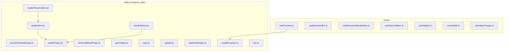
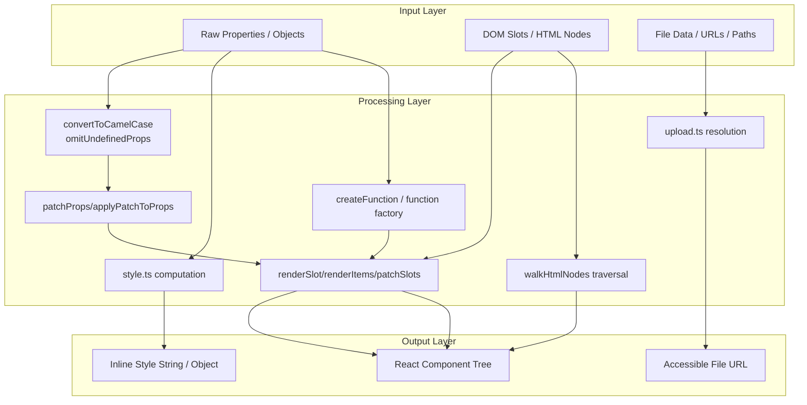
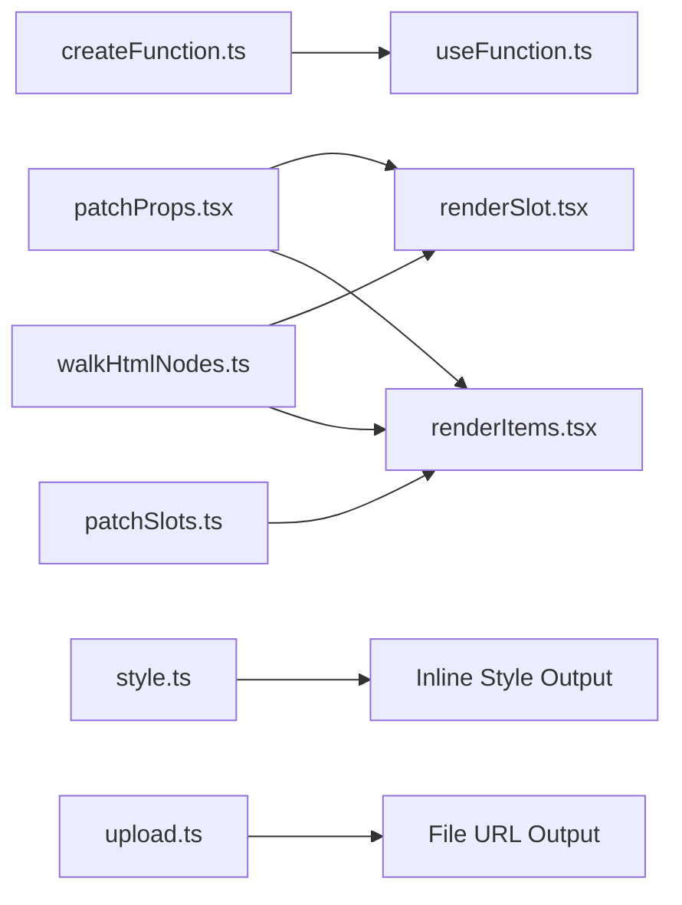
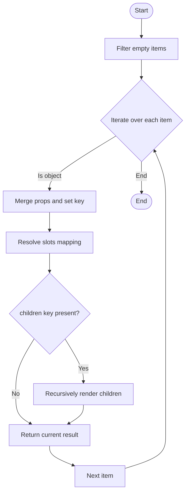
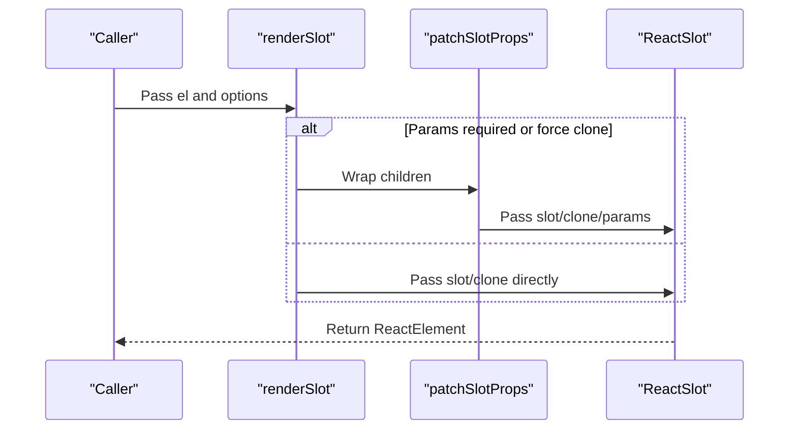

# Utility Functions API

<cite>
**Files referenced in this document**
- [convertToCamelCase.ts](file://frontend/utils/convertToCamelCase.ts)
- [patchProps.tsx](file://frontend/utils/patchProps.tsx)
- [omitUndefinedProps.ts](file://frontend/utils/omitUndefinedProps.ts)
- [renderSlot.tsx](file://frontend/utils/renderSlot.tsx)
- [renderItems.tsx](file://frontend/utils/renderItems.tsx)
- [patchSlots.ts](file://frontend/utils/patchSlots.ts)
- [style.ts](file://frontend/utils/style.ts)
- [upload.ts](file://frontend/utils/upload.ts)
- [walkHtmlNodes.ts](file://frontend/utils/walkHtmlNodes.ts)
- [createFunction.ts](file://frontend/utils/createFunction.ts)
- [tick.ts](file://frontend/utils/tick.ts)
- [renderParamsSlot.tsx](file://frontend/utils/renderParamsSlot.tsx)
- [useFunction.ts](file://frontend/utils/hooks/useFunction.ts)
- [useMemoizedEqualValue.ts](file://frontend/utils/hooks/useMemoizedEqualValue.ts)
- [useMemoizedFn.ts](file://frontend/utils/hooks/useMemoizedFn.ts)
- [useSlotsChildren.ts](file://frontend/utils/hooks/useSlotsChildren.ts)
- [useTargets.ts](file://frontend/utils/hooks/useTargets.ts)
- [useUpdate.ts](file://frontend/utils/hooks/useUpdate.ts)
- [useValueChange.ts](file://frontend/utils/hooks/useValueChange.ts)
</cite>

## Table of Contents

1. [Introduction](#introduction)
2. [Project Structure](#project-structure)
3. [Core Components](#core-components)
4. [Architecture Overview](#architecture-overview)
5. [Detailed Component Analysis](#detailed-component-analysis)
6. [Dependency Analysis](#dependency-analysis)
7. [Performance Considerations](#performance-considerations)
8. [Troubleshooting Guide](#troubleshooting-guide)
9. [Conclusion](#conclusion)
10. [Appendix](#appendix)

## Introduction

This document is the API reference and usage guide for the ModelScope Studio frontend utility function system, covering the following topics:

- Property handling: `convertToCamelCase`, `patchProps`, `omitUndefinedProps`, etc.
- Slot handling: `renderSlot`, `renderItems`, `patchSlots`, `renderParamsSlot`
- Style handling: Style computation and application in `style.ts`
- Upload handling: URL resolution and file address conversion in `upload.ts`
- HTML traversal: Node finding and callbacks in `walkHtmlNodes`
- Functions and hooks: `createFunction`, hooks series (`useFunction`, `useMemoizedFn`, `useMemoizedEqualValue`, `useSlotsChildren`, `useTargets`, `useUpdate`, `useValueChange`)
- Practical usage examples, performance characteristics and best practices, error handling and edge cases

## Project Structure

Utility functions are centralized in the `frontend/utils` directory, organized by functional layers; the `hooks` subdirectory provides React Hooks wrappers.

Diagram sources

- [renderSlot.tsx:1-29](file://frontend/utils/renderSlot.tsx#L1-L29)
- [renderItems.tsx:1-114](file://frontend/utils/renderItems.tsx#L1-L114)
- [patchProps.tsx:1-39](file://frontend/utils/patchProps.tsx#L1-L39)
- [patchSlots.ts:1-32](file://frontend/utils/patchSlots.ts#L1-L32)
- [style.ts:1-77](file://frontend/utils/style.ts#L1-L77)
- [upload.ts:1-45](file://frontend/utils/upload.ts#L1-L45)
- [walkHtmlNodes.ts:1-19](file://frontend/utils/walkHtmlNodes.ts#L1-L19)
- [createFunction.ts:1-38](file://frontend/utils/createFunction.ts#L1-L38)
- [tick.ts:1-13](file://frontend/utils/tick.ts#L1-L13)
- [renderParamsSlot.tsx:1-51](file://frontend/utils/renderParamsSlot.tsx#L1-L51)
- [useFunction.ts:1-13](file://frontend/utils/hooks/useFunction.ts#L1-L13)
- [useMemoizedFn.ts:1-11](file://frontend/utils/hooks/useMemoizedFn.ts#L1-L11)
- [useMemoizedEqualValue.ts:1-15](file://frontend/utils/hooks/useMemoizedEqualValue.ts#L1-L15)
- [useSlotsChildren.ts:1-24](file://frontend/utils/hooks/useSlotsChildren.ts#L1-L24)
- [useTargets.ts:1-52](file://frontend/utils/hooks/useTargets.ts#L1-L52)
- [useUpdate.ts:1-7](file://frontend/utils/hooks/useUpdate.ts#L1-L7)
- [useValueChange.ts:1-30](file://frontend/utils/hooks/useValueChange.ts#L1-L30)

Section sources

- [convertToCamelCase.ts:1-22](file://frontend/utils/convertToCamelCase.ts#L1-L22)
- [patchProps.tsx:1-39](file://frontend/utils/patchProps.tsx#L1-L39)
- [omitUndefinedProps.ts:1-17](file://frontend/utils/omitUndefinedProps.ts#L1-L17)
- [renderSlot.tsx:1-29](file://frontend/utils/renderSlot.tsx#L1-L29)
- [renderItems.tsx:1-114](file://frontend/utils/renderItems.tsx#L1-L114)
- [patchSlots.ts:1-32](file://frontend/utils/patchSlots.ts#L1-L32)
- [style.ts:1-77](file://frontend/utils/style.ts#L1-L77)
- [upload.ts:1-45](file://frontend/utils/upload.ts#L1-L45)
- [walkHtmlNodes.ts:1-19](file://frontend/utils/walkHtmlNodes.ts#L1-L19)
- [createFunction.ts:1-38](file://frontend/utils/createFunction.ts#L1-L38)
- [tick.ts:1-13](file://frontend/utils/tick.ts#L1-L13)
- [renderParamsSlot.tsx:1-51](file://frontend/utils/renderParamsSlot.tsx#L1-L51)
- [useFunction.ts:1-13](file://frontend/utils/hooks/useFunction.ts#L1-L13)
- [useMemoizedFn.ts:1-11](file://frontend/utils/hooks/useMemoizedFn.ts#L1-L11)
- [useMemoizedEqualValue.ts:1-15](file://frontend/utils/hooks/useMemoizedEqualValue.ts#L1-L15)
- [useSlotsChildren.ts:1-24](file://frontend/utils/hooks/useSlotsChildren.ts#L1-L24)
- [useTargets.ts:1-52](file://frontend/utils/hooks/useTargets.ts#L1-L52)
- [useUpdate.ts:1-7](file://frontend/utils/hooks/useUpdate.ts#L1-L7)
- [useValueChange.ts:1-30](file://frontend/utils/hooks/useValueChange.ts#L1-L30)

## Core Components

- Property handling
  - `convertToCamelCase`: Converts underscore-style strings to camelCase; `convertObjectKeyToCamelCase`: Batch converts object key names
  - `patchProps`/`applyPatchToProps`: Internal marking and restoration for key conflicts
  - `omitUndefinedProps`: Filters out undefined (optionally also null) properties
- Slot handling
  - `renderSlot`: Renders an HTMLElement slot as a React component, supporting cloning, force-cloning, and parameter passing
  - `renderItems`: Renders structured items as React structures, automatically injecting slots, contexts, and keys
  - `patchSlots`: Injects additional parameters (prepended or appended) into slot rendering functions
  - `renderParamsSlot`: Renders parameterized slots based on multiple target nodes
- Style handling
  - `styleObject2String`: Converts `CSSProperties` to a string
  - `styleObject2HtmlStyle`: Converts `CSSProperties` to an HTML-compatible style object (with unit handling)
  - `cssUnits`: Maps numeric values to unit-bearing strings (with no units for specific properties)
- Upload handling
  - `getFetchableUrl`: Generates a URL for fetching a file
  - `getFileUrl`: Uniformly resolves `FileData`, URL strings, and relative paths
- HTML traversal
  - `walkHtmlNodes`: Depth-first node traversal, executing callbacks on matches by name, collection, or predicate
- Functions and hooks
  - `createFunction`: Creates a callable function from a string or function
  - hooks: `useFunction`, `useMemoizedFn`, `useMemoizedEqualValue`, `useSlotsChildren`, `useTargets`, `useUpdate`, `useValueChange`

Section sources

- [convertToCamelCase.ts:1-22](file://frontend/utils/convertToCamelCase.ts#L1-L22)
- [patchProps.tsx:1-39](file://frontend/utils/patchProps.tsx#L1-L39)
- [omitUndefinedProps.ts:1-17](file://frontend/utils/omitUndefinedProps.ts#L1-L17)
- [renderSlot.tsx:1-29](file://frontend/utils/renderSlot.tsx#L1-L29)
- [renderItems.tsx:1-114](file://frontend/utils/renderItems.tsx#L1-L114)
- [patchSlots.ts:1-32](file://frontend/utils/patchSlots.ts#L1-L32)
- [style.ts:1-77](file://frontend/utils/style.ts#L1-L77)
- [upload.ts:1-45](file://frontend/utils/upload.ts#L1-L45)
- [walkHtmlNodes.ts:1-19](file://frontend/utils/walkHtmlNodes.ts#L1-L19)
- [createFunction.ts:1-38](file://frontend/utils/createFunction.ts#L1-L38)
- [useFunction.ts:1-13](file://frontend/utils/hooks/useFunction.ts#L1-L13)
- [useMemoizedFn.ts:1-11](file://frontend/utils/hooks/useMemoizedFn.ts#L1-L11)
- [useMemoizedEqualValue.ts:1-15](file://frontend/utils/hooks/useMemoizedEqualValue.ts#L1-L15)
- [useSlotsChildren.ts:1-24](file://frontend/utils/hooks/useSlotsChildren.ts#L1-L24)
- [useTargets.ts:1-52](file://frontend/utils/hooks/useTargets.ts#L1-L52)
- [useUpdate.ts:1-7](file://frontend/utils/hooks/useUpdate.ts#L1-L7)
- [useValueChange.ts:1-30](file://frontend/utils/hooks/useValueChange.ts#L1-L30)

## Architecture Overview

The utility functions work together across six major domains — "properties/slots/styles/uploads/traversal/functions & hooks" — forming a complete pipeline from data structures to React rendering.

Diagram sources

- [convertToCamelCase.ts:1-22](file://frontend/utils/convertToCamelCase.ts#L1-L22)
- [patchProps.tsx:1-39](file://frontend/utils/patchProps.tsx#L1-L39)
- [omitUndefinedProps.ts:1-17](file://frontend/utils/omitUndefinedProps.ts#L1-L17)
- [renderSlot.tsx:1-29](file://frontend/utils/renderSlot.tsx#L1-L29)
- [renderItems.tsx:1-114](file://frontend/utils/renderItems.tsx#L1-L114)
- [patchSlots.ts:1-32](file://frontend/utils/patchSlots.ts#L1-L32)
- [style.ts:1-77](file://frontend/utils/style.ts#L1-L77)
- [upload.ts:1-45](file://frontend/utils/upload.ts#L1-L45)
- [walkHtmlNodes.ts:1-19](file://frontend/utils/walkHtmlNodes.ts#L1-L19)
- [createFunction.ts:1-38](file://frontend/utils/createFunction.ts#L1-L38)

## Detailed Component Analysis

### Property Handling Functions

#### convertToCamelCase and convertObjectKeyToCamelCase

- Functionality: Converts underscore-style naming to camelCase; batch converts object key names
- Parameters and return values:
  - `convertToCamelCase(str: string): string`
  - `convertObjectKeyToCamelCase<T>(obj: T): T`
- Use case: Backend fields are often `snake_case`; use when frontend needs camelCase key names
- Complexity: O(n) character processing; O(k) key iteration for object conversion
- Edge cases: Non-objects are returned as-is

Section sources

- [convertToCamelCase.ts:1-22](file://frontend/utils/convertToCamelCase.ts#L1-L22)

#### patchProps and applyPatchToProps

- Functionality: Resolves React `key` conflicts; internally stashes `key` and restores it at the consumer side
- Parameters and return values:
  - `patchProps(props: Record<string, any>): Record<string, any>`
  - `applyPatchToProps(props: Record<string, any>): Record<string, any>`
- Use case: When incoming props contain `key` and need to be passed through to child components
- Complexity: O(n) shallow copy and conditional checks
- Edge cases: No modification when no `key` is present

Section sources

- [patchProps.tsx:1-39](file://frontend/utils/patchProps.tsx#L1-L39)

#### omitUndefinedProps

- Functionality: Filters out undefined (optionally also null) properties
- Parameters and return values:
  - `omitUndefinedProps<T>(props: T, options?: { omitNull?: boolean }): T`
- Use case: Reduces invalid property passing and avoids rendering anomalies
- Complexity: O(n) key iteration
- Edge cases: Safe with empty objects

Section sources

- [omitUndefinedProps.ts:1-17](file://frontend/utils/omitUndefinedProps.ts#L1-L17)

### Slot Handling Functions

#### renderSlot

- Functionality: Renders an `HTMLElement` slot as a React component, supporting cloning, force-cloning, and parameter passing
- Parameters and return values:
  - `renderSlot(el?: HTMLElement, options?: { clone?: boolean; forceClone?: boolean; params?: any[] }): ReactElement | null`
- Use case: Bridges Svelte/Gradio slot nodes to React
- Complexity: O(1) rendering overhead depends on slot content
- Edge cases: Returns `null` when `el` is empty; `forceClone` and `params` require context

Section sources

- [renderSlot.tsx:1-29](file://frontend/utils/renderSlot.tsx#L1-L29)

#### renderItems

- Functionality: Renders structured items as React structures, automatically injecting slots, contexts, and keys; supports recursive children
- Parameters and return values:
  - `renderItems<R>(items: Item[], options?: { children?: string; fallback?: (item) => R; clone?: boolean; forceClone?: boolean; itemPropsTransformer?: (props) => props }, key?: React.Key): R[] | undefined`
- Use case: Multi-slot and nested rendering for complex container components
- Complexity: O(m) where m is the number of valid items; slot injection is O(s) where s is the number of slots
- Edge cases: Non-object items can fall back; the `children` key is customizable

Section sources

- [renderItems.tsx:1-114](file://frontend/utils/renderItems.tsx#L1-L114)

#### patchSlots

- Functionality: Injects additional parameters (prepended or appended) into slot rendering functions to uniformly pass context to slots
- Parameters and return values:
  - `patchSlots<T>(params: any[], transform: (patch) => Record): ReturnType`
- Use case: Uniformly injecting parameters into slot functions for improved reusability
- Complexity: O(p) where p is the length of params; function wrapping is O(1)
- Edge cases: Non-function slots are not processed

Section sources

- [patchSlots.ts:1-32](file://frontend/utils/patchSlots.ts#L1-L32)

#### renderParamsSlot

- Functionality: Renders parameterized slots based on multiple target nodes, supporting force-cloning
- Parameters and return values:
  - `renderParamsSlot({ key, slots, targets }, options?: { forceClone?: boolean } & RenderSlotOptions)`
- Use case: Multiple target nodes sharing the same slot template with parameter passing
- Complexity: O(t) where t is the number of targets
- Edge cases: Returns `undefined` when no corresponding slot exists

Section sources

- [renderParamsSlot.tsx:1-51](file://frontend/utils/renderParamsSlot.tsx#L1-L51)

### Style Handling Utilities

#### style.ts

- Functionality: Bidirectional conversion between style objects and strings / HTML style objects, with numeric unit handling
- Key functions:
  - `styleObject2String(styleObj: React.CSSProperties): string`
  - `styleObject2HtmlStyle(styleObj: React.CSSProperties): Record<string, any>`
  - `cssUnits<T extends string>(prop: T, value: number | string | undefined): string | number`
- Use case: Inline style concatenation, DOM attribute setting
- Complexity: O(n) where n is the number of style keys
- Edge cases: Numeric types automatically get `px` appended; specific properties remain unitless

Section sources

- [style.ts:1-77](file://frontend/utils/style.ts#L1-L77)

### Upload Handling Functions

#### upload.ts

- Functionality: Uniformly resolves file sources and generates accessible URLs
- Key functions:
  - `getFetchableUrl(path: string, rootUrl: string, apiPrefix: string): string`
  - `getFileUrl<T>(file: T, rootUrl: string, apiPrefix: string): string | Exclude<T, FileData> | undefined`
- Use case: Uniform handling of local files, remote URLs, and `FileData`
- Complexity: O(1)
- Edge cases: Empty input returns `undefined`; non-http(s) strings are treated as relative paths

Section sources

- [upload.ts:1-45](file://frontend/utils/upload.ts#L1-L45)

### HTML Node Traversal Utilities

#### walkHtmlNodes

- Functionality: Depth-first node traversal, executing callbacks on matches by name, collection, or predicate
- Parameters and return values:
  - `walkHtmlNodes(node: Node | HTMLElement | null, test: string | string[] | ((node) => boolean), callback: (node) => void): void`
- Use case: Finding specific tags, batch node operations
- Complexity: O(n) where n is the total number of nodes
- Edge cases: Safe with null nodes; array and function forms allow flexible matching

Section sources

- [walkHtmlNodes.ts:1-19](file://frontend/utils/walkHtmlNodes.ts#L1-L19)

### Functions and Hooks

#### createFunction

- Functionality: Creates a callable function from a string or function, with support for plain-text mode validation
- Parameters and return values:
  - `createFunction<T>(target: any, plainText?: boolean): T | undefined`
- Use case: Dynamic function creation, runtime code injection
- Complexity: O(1) for creation; execution depends on the function body
- Edge cases: Invalid strings return `undefined`; exceptions are caught

Section sources

- [createFunction.ts:1-38](file://frontend/utils/createFunction.ts#L1-L38)

#### Hooks Series

- `useFunction`: Memoizes the result of `createFunction`
- `useMemoizedFn`: Stabilizes function references to avoid closure traps
- `useMemoizedEqualValue`: Equal-value caching to avoid unnecessary re-renders
- `useSlotsChildren`: Distinguishes slot children from regular children
- `useTargets`: Extracts portal target nodes sorted by `slotKey`
- `useUpdate`: Triggers a state update to force a refresh
- `useValueChange`: Synchronizes external values with internal state changes

Section sources

- [useFunction.ts:1-13](file://frontend/utils/hooks/useFunction.ts#L1-L13)
- [useMemoizedFn.ts:1-11](file://frontend/utils/hooks/useMemoizedFn.ts#L1-L11)
- [useMemoizedEqualValue.ts:1-15](file://frontend/utils/hooks/useMemoizedEqualValue.ts#L1-L15)
- [useSlotsChildren.ts:1-24](file://frontend/utils/hooks/useSlotsChildren.ts#L1-L24)
- [useTargets.ts:1-52](file://frontend/utils/hooks/useTargets.ts#L1-L52)
- [useUpdate.ts:1-7](file://frontend/utils/hooks/useUpdate.ts#L1-L7)
- [useValueChange.ts:1-30](file://frontend/utils/hooks/useValueChange.ts#L1-L30)

## Dependency Analysis

Diagram sources

- [createFunction.ts:1-38](file://frontend/utils/createFunction.ts#L1-L38)
- [useFunction.ts:1-13](file://frontend/utils/hooks/useFunction.ts#L1-L13)
- [patchProps.tsx:1-39](file://frontend/utils/patchProps.tsx#L1-L39)
- [renderSlot.tsx:1-29](file://frontend/utils/renderSlot.tsx#L1-L29)
- [renderItems.tsx:1-114](file://frontend/utils/renderItems.tsx#L1-L114)
- [patchSlots.ts:1-32](file://frontend/utils/patchSlots.ts#L1-L32)
- [style.ts:1-77](file://frontend/utils/style.ts#L1-L77)
- [upload.ts:1-45](file://frontend/utils/upload.ts#L1-L45)
- [walkHtmlNodes.ts:1-19](file://frontend/utils/walkHtmlNodes.ts#L1-L19)

## Performance Considerations

- Batch object key conversion and property filtering: O(k) and O(n); recommended to call only when necessary
- Slot rendering: `clone` and `forceClone` increase rendering cost; enable on-demand when possible
- Style conversion: Numeric-to-string and unit concatenation are O(n); cache results for large style objects
- Upload URL resolution: O(1), but involves string concatenation and regex; validate path correctness
- HTML traversal: O(n); recommended to limit traversal scope or use more precise match conditions
- Function factory: `new Function` has compilation overhead; cache results with `useFunction`

## Troubleshooting Guide

- Slot not displayed
  - Check whether `el` exists; confirm if `clone` or `forceClone` is needed
  - If using parameterized slots, ensure `params` is provided and `targets` are correct
- Key conflicts or duplicates
  - Use `patchProps`/`applyPatchToProps` for internal key mapping
- Style not applied
  - Check `cssUnits` handling for specific properties; confirm whether numeric values need units
- Uploaded file not accessible
  - Verify `rootUrl` and `apiPrefix` configuration; relative paths will be converted to fetchable URLs
- Nodes not found during traversal
  - Check the `test` type (string/array/function) and the case sensitivity of node names
- Dynamic function not available
  - In `plainText` mode, invalid strings return `undefined`; check syntax

Section sources

- [renderSlot.tsx:1-29](file://frontend/utils/renderSlot.tsx#L1-L29)
- [renderItems.tsx:1-114](file://frontend/utils/renderItems.tsx#L1-L114)
- [patchProps.tsx:1-39](file://frontend/utils/patchProps.tsx#L1-L39)
- [style.ts:1-77](file://frontend/utils/style.ts#L1-L77)
- [upload.ts:1-45](file://frontend/utils/upload.ts#L1-L45)
- [walkHtmlNodes.ts:1-19](file://frontend/utils/walkHtmlNodes.ts#L1-L19)
- [createFunction.ts:1-38](file://frontend/utils/createFunction.ts#L1-L38)

## Conclusion

This utility function system provides full-stack capabilities from properties/slots/styles/uploads/traversal to functions and hooks, bridging the Svelte/Gradio ecosystem while accommodating the flexibility and performance of React rendering. Through proper parameter configuration and edge case handling, a consistent and maintainable development experience can be achieved in complex component scenarios.

## Appendix

### API Definitions and Key Usage Points

- `convertToCamelCase`
  - Input: underscore-style string
  - Output: camelCase string
  - Example path: [convertToCamelCase.ts:3-11](file://frontend/utils/convertToCamelCase.ts#L3-L11)

- `convertObjectKeyToCamelCase`
  - Input: object
  - Output: new object with camelCase keys
  - Example path: [convertToCamelCase.ts:13-21](file://frontend/utils/convertToCamelCase.ts#L13-L21)

- `patchProps` / `applyPatchToProps`
  - Input: props (possibly containing `key`)
  - Output: props with internal `key` marked or restored
  - Example path: [patchProps.tsx:3-22](file://frontend/utils/patchProps.tsx#L3-L22)

- `omitUndefinedProps`
  - Input: props, optional `omitNull`
  - Output: filtered props
  - Example path: [omitUndefinedProps.ts:1-16](file://frontend/utils/omitUndefinedProps.ts#L1-L16)

- `renderSlot`
  - Input: `HTMLElement`, optional `clone`/`forceClone`/`params`
  - Output: `ReactElement` or `null`
  - Example path: [renderSlot.tsx:13-28](file://frontend/utils/renderSlot.tsx#L13-L28)

- `renderItems`
  - Input: `Item[]`, optional `children`/`fallback`/`clone`/`forceClone`/`itemPropsTransformer`
  - Output: `R[]` or `undefined`
  - Example path: [renderItems.tsx:8-113](file://frontend/utils/renderItems.tsx#L8-L113)

- `patchSlots`
  - Input: `params[]`, `transform` function
  - Output: enhanced return object
  - Example path: [patchSlots.ts:4-31](file://frontend/utils/patchSlots.ts#L4-L31)

- `renderParamsSlot`
  - Input: `{ key, slots, targets }`, optional `options`
  - Output: parameterized slot function or `undefined`
  - Example path: [renderParamsSlot.tsx:5-49](file://frontend/utils/renderParamsSlot.tsx#L5-L49)

- `style.ts`
  - Input: `React.CSSProperties`
  - Output: style string or HTML-compatible style object
  - Example path: [style.ts:39-76](file://frontend/utils/style.ts#L39-L76)

- `upload.ts`
  - Input: `file` (`FileData | string | any`), `rootUrl`, `apiPrefix`
  - Output: accessible URL or original value
  - Example path: [upload.ts:27-44](file://frontend/utils/upload.ts#L27-L44)

- `walkHtmlNodes`
  - Input: `node`, `test` (string/array/function), `callback`
  - Output: `void`
  - Example path: [walkHtmlNodes.ts:1-18](file://frontend/utils/walkHtmlNodes.ts#L1-L18)

- `createFunction`
  - Input: `target` (function/string), `plainText`
  - Output: callable function or `undefined`
  - Example path: [createFunction.ts:10-37](file://frontend/utils/createFunction.ts#L10-L37)

- hooks
  - `useFunction`: [useFunction.ts:5-12](file://frontend/utils/hooks/useFunction.ts#L5-L12)
  - `useMemoizedFn`: [useMemoizedFn.ts:3-10](file://frontend/utils/hooks/useMemoizedFn.ts#L3-L10)
  - `useMemoizedEqualValue`: [useMemoizedEqualValue.ts:4-14](file://frontend/utils/hooks/useMemoizedEqualValue.ts#L4-L14)
  - `useSlotsChildren`: [useSlotsChildren.ts:4-23](file://frontend/utils/hooks/useSlotsChildren.ts#L4-L23)
  - `useTargets`: [useTargets.ts:5-51](file://frontend/utils/hooks/useTargets.ts#L5-L51)
  - `useUpdate`: [useUpdate.ts:3-6](file://frontend/utils/hooks/useUpdate.ts#L3-L6)
  - `useValueChange`: [useValueChange.ts:9-29](file://frontend/utils/hooks/useValueChange.ts#L9-L29)

### Usage Flow Diagrams

#### renderItems Data Flow

Diagram sources

- [renderItems.tsx:18-113](file://frontend/utils/renderItems.tsx#L18-L113)

#### renderSlot Rendering Sequence

Diagram sources

- [renderSlot.tsx:13-28](file://frontend/utils/renderSlot.tsx#L13-L28)
- [patchProps.tsx:31-38](file://frontend/utils/patchProps.tsx#L31-L38)
