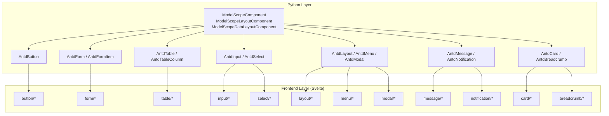
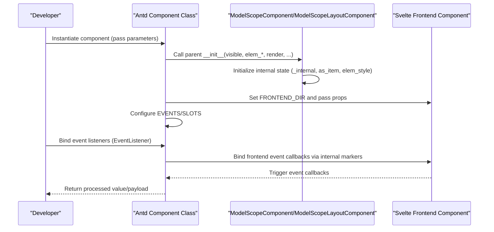
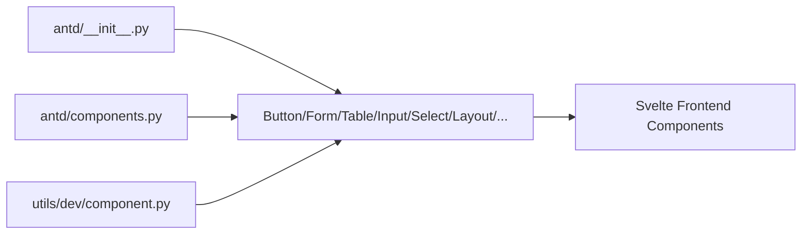

# Antd Components API

<cite>
**Files Referenced in This Document**
- [backend/modelscope_studio/components/antd/__init__.py](file://backend/modelscope_studio/components/antd/__init__.py)
- [backend/modelscope_studio/components/antd/components.py](file://backend/modelscope_studio/components/antd/components.py)
- [backend/modelscope_studio/utils/dev/component.py](file://backend/modelscope_studio/utils/dev/component.py)
- [backend/modelscope_studio/components/antd/button/__init__.py](file://backend/modelscope_studio/components/antd/button/__init__.py)
- [backend/modelscope_studio/components/antd/form/__init__.py](file://backend/modelscope_studio/components/antd/form/__init__.py)
- [backend/modelscope_studio/components/antd/table/__init__.py](file://backend/modelscope_studio/components/antd/table/__init__.py)
- [backend/modelscope_studio/components/antd/input/__init__.py](file://backend/modelscope_studio/components/antd/input/__init__.py)
- [backend/modelscope_studio/components/antd/select/__init__.py](file://backend/modelscope_studio/components/antd/select/__init__.py)
- [backend/modelscope_studio/components/antd/form/item/__init__.py](file://backend/modelscope_studio/components/antd/form/item/__init__.py)
- [backend/modelscope_studio/components/antd/table/column/__init__.py](file://backend/modelscope_studio/components/antd/table/column/__init__.py)
- [backend/modelscope_studio/components/antd/layout/__init__.py](file://backend/modelscope_studio/components/antd/layout/__init__.py)
- [backend/modelscope_studio/components/antd/menu/__init__.py](file://backend/modelscope_studio/components/antd/menu/__init__.py)
- [backend/modelscope_studio/components/antd/modal/__init__.py](file://backend/modelscope_studio/components/antd/modal/__init__.py)
- [backend/modelscope_studio/components/antd/message/__init__.py](file://backend/modelscope_studio/components/antd/message/__init__.py)
- [backend/modelscope_studio/components/antd/notification/__init__.py](file://backend/modelscope_studio/components/antd/notification/__init__.py)
- [backend/modelscope_studio/components/antd/card/__init__.py](file://backend/modelscope_studio/components/antd/card/__init__.py)
- [backend/modelscope_studio/components/antd/breadcrumb/__init__.py](file://backend/modelscope_studio/components/antd/breadcrumb/__init__.py)
</cite>

## Table of Contents

1. [Introduction](#introduction)
2. [Project Structure](#project-structure)
3. [Core Components](#core-components)
4. [Architecture Overview](#architecture-overview)
5. [Detailed Component Analysis](#detailed-component-analysis)
6. [Dependency Analysis](#dependency-analysis)
7. [Performance Considerations](#performance-considerations)
8. [Troubleshooting Guide](#troubleshooting-guide)
9. [Conclusion](#conclusion)
10. [Appendix: API Index by Category](#appendix-api-index-by-category)

## Introduction

This document is the Python API reference for the Antd component library, covering 150+ components under `modelscope_studio.components.antd.*`. The documentation is designed for both developers and non-technical readers, providing:

- Complete import paths and class names
- Constructor parameters, property definitions, method signatures, and return types
- Standard instantiation examples (given as code snippet paths)
- Event handling mechanisms, data binding patterns, and state management interfaces
- Parameter validation rules, exception handling strategies, and inter-component communication patterns
- API index organized by category (general, layout, navigation, data entry, data display, feedback, etc.)

## Project Structure

Antd components wrap frontend Svelte components as Python classes, all inheriting from base component classes, supporting event binding, slots, and Gradio data flows.

Diagram sources

- [backend/modelscope_studio/utils/dev/component.py:54-169](file://backend/modelscope_studio/utils/dev/component.py#L54-L169)
- [backend/modelscope_studio/components/antd/button/**init**.py:15-157](file://backend/modelscope_studio/components/antd/button/__init__.py#L15-L157)
- [backend/modelscope_studio/components/antd/form/**init**.py:17-133](file://backend/modelscope_studio/components/antd/form/__init__.py#L17-L133)
- [backend/modelscope_studio/components/antd/table/**init**.py:16-153](file://backend/modelscope_studio/components/antd/table/__init__.py#L16-L153)
- [backend/modelscope_studio/components/antd/input/**init**.py:16-127](file://backend/modelscope_studio/components/antd/input/__init__.py#L16-L127)
- [backend/modelscope_studio/components/antd/select/**init**.py:12-231](file://backend/modelscope_studio/components/antd/select/__init__.py#L12-L231)
- [backend/modelscope_studio/components/antd/layout/**init**.py:14-91](file://backend/modelscope_studio/components/antd/layout/__init__.py#L14-L91)
- [backend/modelscope_studio/components/antd/menu/**init**.py:12-123](file://backend/modelscope_studio/components/antd/menu/__init__.py#L12-L123)
- [backend/modelscope_studio/components/antd/modal/**init**.py:11-136](file://backend/modelscope_studio/components/antd/modal/__init__.py#L11-L136)
- [backend/modelscope_studio/components/antd/message/**init**.py:10-91](file://backend/modelscope_studio/components/antd/message/__init__.py#L10-L91)
- [backend/modelscope_studio/components/antd/notification/**init**.py:10-109](file://backend/modelscope_studio/components/antd/notification/__init__.py#L10-L109)
- [backend/modelscope_studio/components/antd/card/**init**.py:12-149](file://backend/modelscope_studio/components/antd/card/__init__.py#L12-L149)
- [backend/modelscope_studio/components/antd/breadcrumb/**init**.py:9-73](file://backend/modelscope_studio/components/antd/breadcrumb/__init__.py#L9-L73)

Section sources

- [backend/modelscope_studio/components/antd/**init**.py:1-151](file://backend/modelscope_studio/components/antd/__init__.py#L1-L151)
- [backend/modelscope_studio/components/antd/components.py:1-145](file://backend/modelscope_studio/components/antd/components.py#L1-L145)
- [backend/modelscope_studio/utils/dev/component.py:1-169](file://backend/modelscope_studio/utils/dev/component.py#L1-L169)

## Core Components

- Base component classes
  - `ModelScopeComponent`: General component base class; supports Gradio properties such as `value`, `visible`, `elem_*`, `key`, `inputs`, `load_fn`, `render`; provides `skip_api` to control API exposure.
  - `ModelScopeLayoutComponent`: Layout component base class; supports `__enter__`/`__exit__` context management for nested layouts.
  - `ModelScopeDataLayoutComponent`: Data-layout component base class; combines data component capabilities with layout capabilities.
- Events and slots
  - `EVENTS`: List of events supported by the component; binds callbacks via `EventListener`.
  - `SLOTS`: Set of slot names supported by the component; used for rendering child content or custom nodes.
- Frontend directory resolution
  - `FRONTEND_DIR`: Points to the corresponding Svelte component directory via `resolve_frontend_dir(...)`.

Section sources

- [backend/modelscope_studio/utils/dev/component.py:54-169](file://backend/modelscope_studio/utils/dev/component.py#L54-L169)
- [backend/modelscope_studio/components/antd/button/**init**.py:41-49](file://backend/modelscope_studio/components/antd/button/__init__.py#L41-L49)
- [backend/modelscope_studio/components/antd/table/**init**.py:32-53](file://backend/modelscope_studio/components/antd/table/__init__.py#L32-L53)
- [backend/modelscope_studio/components/antd/input/**init**.py:25-41](file://backend/modelscope_studio/components/antd/input/__init__.py#L25-L41)

## Architecture Overview

The following sequence diagram shows a typical component's call chain from construction to event binding:

Diagram sources

- [backend/modelscope_studio/utils/dev/component.py:54-99](file://backend/modelscope_studio/utils/dev/component.py#L54-L99)
- [backend/modelscope_studio/components/antd/button/**init**.py:51-87](file://backend/modelscope_studio/components/antd/button/__init__.py#L51-L87)
- [backend/modelscope_studio/components/antd/form/**init**.py:23-36](file://backend/modelscope_studio/components/antd/form/__init__.py#L23-L36)

## Detailed Component Analysis

### Button

- Import path: `modelscope_studio.components.antd.AntdButton` or `modelscope_studio.components.antd.Button`
- Sub-components: `Group`
- Events: `click`
- Slots: `icon`, `loading.icon`
- Key parameters (selected): `value`, `block`, `danger`, `ghost`, `disabled`, `href`, `html_type`, `icon`, `icon_position`, `loading`, `shape`, `size`, `type`, `variant`, `color`, `root_class_name`
- Methods: `preprocess`/`postprocess`/`example_payload`/`example_value`
- Code snippet path (example)
  - [basic usage:51-157](file://backend/modelscope_studio/components/antd/button/__init__.py#L51-L157)
- Event binding flow
  - Maps callbacks to frontend events via `EventListener("click", ...)` in `EVENTS`.
- Data binding
  - When used as input/output, `value` type is string; `preprocess`/`postprocess` returns string.
- Parameter validation and exceptions
  - Most parameters are nullable scalars or literal enums; no explicit validation logic seen — validation is recommended at the application layer.
- Inter-component communication
  - Interacts with forms or other components via Gradio's `inputs`/`outputs` mechanism.

Section sources

- [backend/modelscope_studio/components/antd/button/**init**.py:15-157](file://backend/modelscope_studio/components/antd/button/__init__.py#L15-L157)

### Form and Form.Item

- Import path: `modelscope_studio.components.antd.AntdForm` / `AntdFormItem`
- Sub-components: `Item`, `Provider`
- Events: `fields_change`, `finish`, `finish_failed`, `values_change`
- Slots: `requiredMark`
- Form key parameters (selected): `colon`, `disabled`, `component`, `feedback_icons`, `initial_values`, `label_align`, `label_col`, `label_wrap`, `layout`, `preserve`, `required_mark`, `scroll_to_first_error`, `size`, `validate_messages`, `validate_trigger`, `variant`, `wrapper_col`, `clear_on_destroy`, `root_class_name`, `class_names`, `styles`
- FormItem key parameters (selected): `label`, `form_name`, `colon`, `dependencies`, `extra`, `help`, `hidden`, `initial_value`, `label_align`, `label_col`, `message_variants`, `normalize`, `no_style`, `preserve`, `required`, `rules`, `should_update`, `tooltip`, `trigger`, `validate_debounce`, `validate_first`, `validate_status`, `validate_trigger`, `value_prop_name`, `wrapper_col`, `layout`, `root_class_name`
- Methods: `preprocess`/`postprocess`/`example_payload`/`example_value`
- Code snippet paths (example)
  - [form:43-133](file://backend/modelscope_studio/components/antd/form/__init__.py#L43-L133)
  - [form item:21-126](file://backend/modelscope_studio/components/antd/form/item/__init__.py#L21-L126)

Section sources

- [backend/modelscope_studio/components/antd/form/**init**.py:17-133](file://backend/modelscope_studio/components/antd/form/__init__.py#L17-L133)
- [backend/modelscope_studio/components/antd/form/item/**init**.py:9-126](file://backend/modelscope_studio/components/antd/form/item/__init__.py#L9-L126)

### Table and Table.Column

- Import path: `modelscope_studio.components.antd.AntdTable` / `AntdTableColumn`
- Sub-components: `Column`, `ColumnGroup`, `Expandable`, `RowSelection`
- Events: `change`, `scroll`
- Slots: `footer`, `title`, `summary`, `expandable`, `rowSelection`, `loading.tip`, `loading.indicator`, `pagination.showQuickJumper.goButton`, `pagination.itemRender`, `showSorterTooltip.title`
- Table key parameters (selected): `data_source`, `columns`, `bordered`, `components`, `expandable`, `footer`, `get_popup_container`, `loading`, `locale`, `pagination`, `row_class_name`, `row_key`, `row_selection`, `row_hoverable`, `scroll`, `show_header`, `show_sorter_tooltip`, `size`, `sort_directions`, `sticky`, `summary`, `table_layout`, `title`, `virtual`, `on_row`, `on_header_row`, `root_class_name`, `class_names`, `styles`
- Table.Column key parameters (selected): `built_in_column`, `align`, `col_span`, `data_index`, `default_filtered_value`, `filter_reset_to_default_filtered_value`, `default_sort_order`, `ellipsis`, `filter_dropdown`, `filter_dropdown_open`, `filtered`, `filtered_value`, `filter_icon`, `filter_on_close`, `filter_multiple`, `filter_mode`, `filter_search`, `filters`, `filter_dropdown_props`, `fixed`, `key`, `column_render`, `responsive`, `row_scope`, `should_cell_update`, `show_sorter_tooltip`, `sorter`, `sort_order`, `sort_icon`, `title`, `width`, `min_width`, `hidden`, `on_cell`, `on_header_cell`, `class_names`, `styles`
- Methods: `preprocess`/`postprocess`/`example_payload`/`example_value`
- Code snippet paths (example)
  - [table:55-153](file://backend/modelscope_studio/components/antd/table/__init__.py#L55-L153)
  - [table.column:33-150](file://backend/modelscope_studio/components/antd/table/column/__init__.py#L33-L150)

Section sources

- [backend/modelscope_studio/components/antd/table/**init**.py:16-153](file://backend/modelscope_studio/components/antd/table/__init__.py#L16-L153)
- [backend/modelscope_studio/components/antd/table/column/**init**.py:10-150](file://backend/modelscope_studio/components/antd/table/column/__init__.py#L10-L150)

### Input and Select

- Import path: `modelscope_studio.components.antd.AntdInput` / `AntdSelect`
- Sub-components: `Textarea`, `Password`, `OTP`, `Search` (Input); `Option` (Select)
- Input events: `change`, `press_enter`, `clear`
- Select events: `change`, `blur`, `focus`, `search`, `select`, `clear`, `popup_scroll`, `dropdown_visible_change`, `popup_visible_change`, `active`
- Slots (Input): `addonAfter`, `addonBefore`, `allowClear.clearIcon`, `prefix`, `suffix`, `showCount.formatter`
- Slots (Select): `allowClear.clearIcon`, `maxTagPlaceholder`, `menuItemSelectedIcon`, `dropdownRender`, `popupRender`, `optionRender`, `tagRender`, `labelRender`, `notFoundContent`, `removeIcon`, `suffixIcon`, `prefix`, `options`
- Input key parameters (selected): `addon_after`, `addon_before`, `allow_clear`, `count`, `default_value`, `read_only`, `disabled`, `max_length`, `prefix`, `show_count`, `size`, `status`, `suffix`, `type`, `placeholder`, `variant`, `root_class_name`, `class_names`, `styles`
- Select key parameters (selected): `allow_clear`, `auto_clear_search_value`, `auto_focus`, `default_active_first_option`, `default_open`, `default_value`, `disabled`, `popup_class_name`, `popup_match_select_width`, `dropdown_render`, `popup_render`, `dropdown_style`, `field_names`, `filter_option`, `filter_sort`, `get_popup_container`, `label_in_value`, `list_height`, `loading`, `max_count`, `max_tag_count`, `max_tag_placeholder`, `max_tag_text_length`, `menu_item_selected_icon`, `mode`, `not_found_content`, `open`, `option_filter_prop`, `option_label_prop`, `options`, `option_render`, `placeholder`, `placement`, `remove_icon`, `search_value`, `show_search`, `size`, `status`, `suffix_icon`, `prefix`, `tag_render`, `label_render`, `token_separators`, `variant`, `virtual`, `class_names`, `styles`, `root_class_name`
- Methods: `preprocess`/`postprocess`/`example_payload`/`example_value`
- Code snippet paths (example)
  - [input:43-127](file://backend/modelscope_studio/components/antd/input/__init__.py#L43-L127)
  - [select:59-231](file://backend/modelscope_studio/components/antd/select/__init__.py#L59-L231)

Section sources

- [backend/modelscope_studio/components/antd/input/**init**.py:16-127](file://backend/modelscope_studio/components/antd/input/__init__.py#L16-L127)
- [backend/modelscope_studio/components/antd/select/**init**.py:12-231](file://backend/modelscope_studio/components/antd/select/__init__.py#L12-L231)

### Layout, Menu, and Modal

- Import path: `modelscope_studio.components.antd.AntdLayout` / `AntdMenu` / `AntdModal`
- Sub-components: `Layout.Content`/`Footer`/`Header`/`Sider` (Layout); `Menu.Item` (Menu); `Modal.Static` (Modal)
- Events (Layout/Menu/Modal): `click`, `deselect`, `open_change`, `select`, `ok`, `cancel`, etc.
- Slots (Layout/Menu/Modal): See individual component definitions
- Code snippet paths (example)
  - [layout:39-91](file://backend/modelscope_studio/components/antd/layout/__init__.py#L39-L91)
  - [menu:36-123](file://backend/modelscope_studio/components/antd/menu/__init__.py#L36-L123)
  - [modal:34-136](file://backend/modelscope_studio/components/antd/modal/__init__.py#L34-L136)

Section sources

- [backend/modelscope_studio/components/antd/layout/**init**.py:14-91](file://backend/modelscope_studio/components/antd/layout/__init__.py#L14-L91)
- [backend/modelscope_studio/components/antd/menu/**init**.py:12-123](file://backend/modelscope_studio/components/antd/menu/__init__.py#L12-L123)
- [backend/modelscope_studio/components/antd/modal/**init**.py:11-136](file://backend/modelscope_studio/components/antd/modal/__init__.py#L11-L136)

### Message, Notification, Card, and Breadcrumb

- Import path: `modelscope_studio.components.antd.AntdMessage` / `AntdNotification` / `AntdCard` / `AntdBreadcrumb`
- Events: `click`, `close` (some components)
- Slots: `icon`/`content` (Message); `actions`/`closeIcon`/`description`/`icon`/`message`/`title` (Notification); `title`/`tabList`/`tabProps.*` (Card); `separator`/`itemRender`/`items`/`dropdownIcon` (Breadcrumb)
- Code snippet paths (example)
  - [message:26-91](file://backend/modelscope_studio/components/antd/message/__init__.py#L26-L91)
  - [notification:26-109](file://backend/modelscope_studio/components/antd/notification/__init__.py#L26-L109)
  - [card:56-149](file://backend/modelscope_studio/components/antd/card/__init__.py#L56-L149)
  - [breadcrumb:20-73](file://backend/modelscope_studio/components/antd/breadcrumb/__init__.py#L20-L73)

Section sources

- [backend/modelscope_studio/components/antd/message/**init**.py:10-91](file://backend/modelscope_studio/components/antd/message/__init__.py#L10-L91)
- [backend/modelscope_studio/components/antd/notification/**init**.py:10-109](file://backend/modelscope_studio/components/antd/notification/__init__.py#L10-L109)
- [backend/modelscope_studio/components/antd/card/**init**.py:12-149](file://backend/modelscope_studio/components/antd/card/__init__.py#L12-L149)
- [backend/modelscope_studio/components/antd/breadcrumb/**init**.py:9-73](file://backend/modelscope_studio/components/antd/breadcrumb/__init__.py#L9-L73)

## Dependency Analysis

- Component exports
  - `modelscope_studio.components.antd.__init__` and `components.py` synchronize exports of all Antd component classes for unified imports.
- Base class dependencies
  - All components depend on base component classes in `modelscope_studio.utils.dev.component`, ensuring a unified lifecycle, event, and slot mechanism.
- Frontend dependencies
  - Each component points to its corresponding Svelte component directory via `FRONTEND_DIR`, maintaining consistent directory structures between frontend and backend.

Diagram sources

- [backend/modelscope_studio/components/antd/**init**.py:1-151](file://backend/modelscope_studio/components/antd/__init__.py#L1-L151)
- [backend/modelscope_studio/components/antd/components.py:1-145](file://backend/modelscope_studio/components/antd/components.py#L1-L145)
- [backend/modelscope_studio/utils/dev/component.py:54-169](file://backend/modelscope_studio/utils/dev/component.py#L54-L169)

Section sources

- [backend/modelscope_studio/components/antd/**init**.py:1-151](file://backend/modelscope_studio/components/antd/__init__.py#L1-L151)
- [backend/modelscope_studio/components/antd/components.py:1-145](file://backend/modelscope_studio/components/antd/components.py#L1-L145)
- [backend/modelscope_studio/utils/dev/component.py:54-169](file://backend/modelscope_studio/utils/dev/component.py#L54-L169)

## Performance Considerations

- Event binding
  - Maps Python callbacks to frontend events via `EVENTS`, avoiding unnecessary re-renders; set event trigger frequency and debouncing appropriately.
- Slots and virtualization
  - Components such as Table support `virtual`, `sticky`, `scroll`, and similar parameters; it is recommended to enable virtual scrolling and fixed headers in large data scenarios to improve performance.
- Render control
  - Use `render` and `visible` to control component initial rendering and visibility, reducing first-screen pressure.
- Data flow
  - Input components (e.g., Input, Select) are recommended to work with Form for batch validation and debouncing, reducing overhead from frequent updates.

## Troubleshooting Guide

- Events not triggering
  - Check that `EVENTS` is correctly declared; confirm that `EventListener` names match frontend events.
  - Confirm that the component has `FRONTEND_DIR` set correctly and frontend event callbacks are bound.
- Slots not working
  - Verify that the corresponding slot name exists in the `SLOTS` list; ensure the slot content passed matches the expected format.
- Data type mismatch
  - The return types of `preprocess`/`postprocess` for input components must match component definitions; if type errors occur, check `value` and the return type from `api_info`.
- Form validation failure
  - Check FormItem's `rules`, `validate_trigger`, `validate_status`, and other configurations; adjust `validate_first` and `validate_debounce` as needed.
- Layout flickering or style anomalies
  - Layout components (e.g., Layout, Menu) can optimize SSR-scenario style flickering via parameters such as `has_sider`, `inline_collapsed`, and `theme_value`.

Section sources

- [backend/modelscope_studio/components/antd/button/**init**.py:41-46](file://backend/modelscope_studio/components/antd/button/__init__.py#L41-L46)
- [backend/modelscope_studio/components/antd/form/item/**init**.py:13-19](file://backend/modelscope_studio/components/antd/form/item/__init__.py#L13-L19)
- [backend/modelscope_studio/components/antd/table/**init**.py:32-53](file://backend/modelscope_studio/components/antd/table/__init__.py#L32-L53)
- [backend/modelscope_studio/components/antd/menu/**init**.py:96-103](file://backend/modelscope_studio/components/antd/menu/__init__.py#L96-L103)
- [backend/modelscope_studio/components/antd/layout/**init**.py:33-37](file://backend/modelscope_studio/components/antd/layout/__init__.py#L33-L37)

## Conclusion

This reference document systematically covers the Python API of the Antd component library, clearly defining import paths, constructor parameters, events and slots, data binding, and state management interfaces for component classes. It is recommended to use example paths to quickly locate implementation details in actual development, and to optimize component usage experience according to the performance and troubleshooting guidelines.

## Appendix: API Index by Category

- General Components
  - `Button`, `Message`, `Notification`, `Card`, `Breadcrumb`
  - Example paths: [button:51-157](file://backend/modelscope_studio/components/antd/button/__init__.py#L51-L157), [message:26-91](file://backend/modelscope_studio/components/antd/message/__init__.py#L26-L91), [notification:26-109](file://backend/modelscope_studio/components/antd/notification/__init__.py#L26-L109), [card:56-149](file://backend/modelscope_studio/components/antd/card/__init__.py#L56-L149), [breadcrumb:20-73](file://backend/modelscope_studio/components/antd/breadcrumb/__init__.py#L20-L73)
- Layout Components
  - `Layout` (including `Content`/`Footer`/`Header`/`Sider`), `Menu` (including `Item`)
  - Example paths: [layout:39-91](file://backend/modelscope_studio/components/antd/layout/__init__.py#L39-L91), [menu:36-123](file://backend/modelscope_studio/components/antd/menu/__init__.py#L36-L123)
- Navigation Components
  - `Breadcrumb` (including `Item`)
  - Example paths: [breadcrumb:20-73](file://backend/modelscope_studio/components/antd/breadcrumb/__init__.py#L20-L73)
- Data Entry Components
  - `Input` (including `Textarea`/`Password`/`OTP`/`Search`), `Select` (including `Option`)
  - Example paths: [input:43-127](file://backend/modelscope_studio/components/antd/input/__init__.py#L43-L127), [select:59-231](file://backend/modelscope_studio/components/antd/select/__init__.py#L59-L231)
- Data Display Components
  - `Table` (including `Column`/`ColumnGroup`/`Expandable`/`RowSelection`)
  - Example paths: [table:55-153](file://backend/modelscope_studio/components/antd/table/__init__.py#L55-L153), [table.column:33-150](file://backend/modelscope_studio/components/antd/table/column/__init__.py#L33-L150)
- Feedback Components
  - `Modal` (including `Static`), `Message`, `Notification`
  - Example paths: [modal:34-136](file://backend/modelscope_studio/components/antd/modal/__init__.py#L34-L136), [message:26-91](file://backend/modelscope_studio/components/antd/message/__init__.py#L26-L91), [notification:26-109](file://backend/modelscope_studio/components/antd/notification/__init__.py#L26-L109)
- Form Components
  - `Form` (including `Item`/`Provider`)
  - Example paths: [form:43-133](file://backend/modelscope_studio/components/antd/form/__init__.py#L43-L133), [form.item:21-126](file://backend/modelscope_studio/components/antd/form/item/__init__.py#L21-L126)
