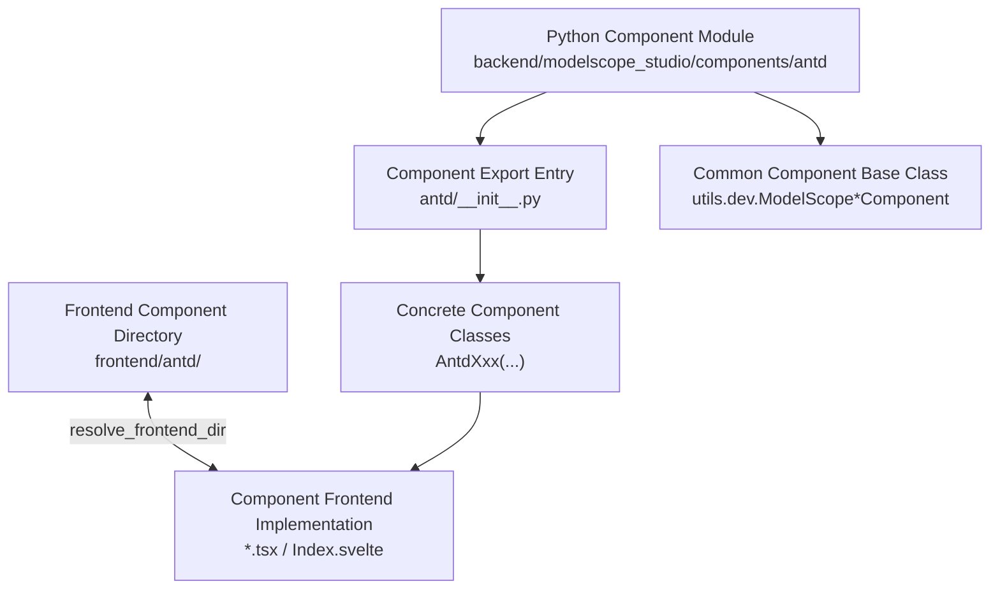
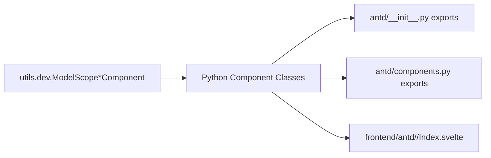

# Data Display Components API

<cite>
**Files referenced in this document**
- [backend/modelscope_studio/components/antd/__init__.py](file://backend/modelscope_studio/components/antd/__init__.py)
- [backend/modelscope_studio/components/antd/components.py](file://backend/modelscope_studio/components/antd/components.py)
- [backend/modelscope_studio/components/antd/avatar/__init__.py](file://backend/modelscope_studio/components/antd/avatar/__init__.py)
- [backend/modelscope_studio/components/antd/badge/__init__.py](file://backend/modelscope_studio/components/antd/badge/__init__.py)
- [backend/modelscope_studio/components/antd/calendar/__init__.py](file://backend/modelscope_studio/components/antd/calendar/__init__.py)
- [backend/modelscope_studio/components/antd/card/__init__.py](file://backend/modelscope_studio/components/antd/card/__init__.py)
- [backend/modelscope_studio/components/antd/carousel/__init__.py](file://backend/modelscope_studio/components/antd/carousel/__init__.py)
- [backend/modelscope_studio/components/antd/collapse/__init__.py](file://backend/modelscope_studio/components/antd/collapse/__init__.py)
- [backend/modelscope_studio/components/antd/descriptions/__init__.py](file://backend/modelscope_studio/components/antd/descriptions/__init__.py)
- [backend/modelscope_studio/components/antd/empty/__init__.py](file://backend/modelscope_studio/components/antd/empty/__init__.py)
- [backend/modelscope_studio/components/antd/image/__init__.py](file://backend/modelscope_studio/components/antd/image/__init__.py)
- [backend/modelscope_studio/components/antd/list/__init__.py](file://backend/modelscope_studio/components/antd/list/__init__.py)
- [backend/modelscope_studio/components/antd/popover/__init__.py](file://backend/modelscope_studio/components/antd/popover/__init__.py)
- [backend/modelscope_studio/components/antd/qr_code/__init__.py](file://backend/modelscope_studio/components/antd/qr_code/__init__.py)
- [backend/modelscope_studio/components/antd/segmented/__init__.py](file://backend/modelscope_studio/components/antd/segmented/__init__.py)
- [backend/modelscope_studio/components/antd/statistic/__init__.py](file://backend/modelscope_studio/components/antd/statistic/__init__.py)
- [backend/modelscope_studio/components/antd/table/__init__.py](file://backend/modelscope_studio/components/antd/table/__init__.py)
- [backend/modelscope_studio/components/antd/tabs/__init__.py](file://backend/modelscope_studio/components/antd/tabs/__init__.py)
- [backend/modelscope_studio/components/antd/tag/__init__.py](file://backend/modelscope_studio/components/antd/tag/__init__.py)
- [backend/modelscope_studio/components/antd/tag/checkable_tag/__init__.py](file://backend/modelscope_studio/components/antd/tag/checkable_tag/__init__.py)
- [backend/modelscope_studio/components/antd/tag/checkable_tag_group/__init__.py](file://backend/modelscope_studio/components/antd/tag/checkable_tag_group/__init__.py)
- [backend/modelscope_studio/components/antd/timeline/__init__.py](file://backend/modelscope_studio/components/antd/timeline/__init__.py)
- [backend/modelscope_studio/components/antd/tooltip/__init__.py](file://backend/modelscope_studio/components/antd/tooltip/__init__.py)
- [backend/modelscope_studio/components/antd/tour/__init__.py](file://backend/modelscope_studio/components/antd/tour/__init__.py)
- [backend/modelscope_studio/components/antd/tree/__init__.py](file://backend/modelscope_studio/components/antd/tree/__init__.py)
- [frontend/antd/timeline/timeline.tsx](file://frontend/antd/timeline/timeline.tsx)
- [frontend/antd/tag/checkable-tag-group/tag.checkable-tag-group.tsx](file://frontend/antd/tag/checkable-tag-group/tag.checkable-tag-group.tsx)
- [frontend/antd/tag/checkable-tag/Index.svelte](file://frontend/antd/tag/checkable-tag/Index.svelte)
- [frontend/antd/tag/tag.tsx](file://frontend/antd/tag/tag.tsx)
</cite>

## Update Summary

**Changes Made**

- Added complete API documentation for the Timeline component, including the latest feature specifications
- Added detailed documentation for the checkable tag group component, covering both CheckableTag and CheckableTagGroup
- Updated Tag component documentation, supplementing checkable tag-related functionality
- Improved documentation of inter-component relationships and usage scenarios

## Table of Contents

1. [Introduction](#introduction)
2. [Project Structure](#project-structure)
3. [Core Components](#core-components)
4. [Architecture Overview](#architecture-overview)
5. [Detailed Component Analysis](#detailed-component-analysis)
6. [Dependency Analysis](#dependency-analysis)
7. [Performance Considerations](#performance-considerations)
8. [Troubleshooting Guide](#troubleshooting-guide)
9. [Conclusion](#conclusion)
10. [Appendix](#appendix)

## Introduction

This document is a Python API reference and practical guide for Antd data display components, covering Avatar, Badge, Calendar, Card, Carousel, Collapse, Descriptions, Empty, Image, List, Popover, QRCode, Segmented, Statistic, Table, Tabs, Tag, Timeline, Tooltip, Tour, Tree, and other components. Content includes:

- Constructor parameters, event binding, slots and rendering behavior
- Preprocessing and postprocessing (preprocess/postprocess) workflows
- Usage example paths and common scenarios
- Rendering optimization, lazy loading, and responsive design recommendations
- Data formatting, internationalization, and theme customization approaches
- User experience and accessibility best practices

## Project Structure

Antd components are encapsulated as Python classes in the backend, all inheriting from a common component base class, and mapped to corresponding Svelte implementations through frontend directory mappings. Component export entries are centralized in antd/**init**.py and antd/components.py.

**Chart sources**

- [backend/modelscope_studio/components/antd/**init**.py:1-151](file://backend/modelscope_studio/components/antd/__init__.py#L1-L151)
- [backend/modelscope_studio/components/antd/components.py:1-145](file://backend/modelscope_studio/components/antd/components.py#L1-L145)

**Section sources**

- [backend/modelscope_studio/components/antd/**init**.py:1-151](file://backend/modelscope_studio/components/antd/__init__.py#L1-L151)
- [backend/modelscope_studio/components/antd/components.py:1-145](file://backend/modelscope_studio/components/antd/components.py#L1-L145)

## Core Components

The following is a list of data display components and their common characteristics covered in this document:

- Unified inheritance: most components inherit from ModelScopeLayoutComponent or ModelScopeComponent; some data-type components inherit from ModelScopeDataLayoutComponent (e.g., Avatar, Image)
- Event system: register frontend event callbacks via EVENTS list, bound to \_internal.update
- Slot system: define available slot names via SLOTS, used for passing template fragments or render functions
- Frontend directory: point to frontend component directory via resolve_frontend_dir("component-name")
- Preprocessing/postprocessing: implement preprocess and postprocess based on component type, handling strings, file paths, Gradio FileData, and other inputs/outputs

**Section sources**

- [backend/modelscope_studio/components/antd/avatar/**init**.py:18-114](file://backend/modelscope_studio/components/antd/avatar/__init__.py#L18-L114)
- [backend/modelscope_studio/components/antd/image/**init**.py:18-120](file://backend/modelscope_studio/components/antd/image/__init__.py#L18-L120)
- [backend/modelscope_studio/components/antd/calendar/**init**.py:11-102](file://backend/modelscope_studio/components/antd/calendar/__init__.py#L11-L102)
- [backend/modelscope_studio/components/antd/card/**init**.py:12-149](file://backend/modelscope_studio/components/antd/card/__init__.py#L12-L149)
- [backend/modelscope_studio/components/antd/carousel/**init**.py:8-95](file://backend/modelscope_studio/components/antd/carousel/__init__.py#L8-L95)
- [backend/modelscope_studio/components/antd/collapse/**init**.py:11-99](file://backend/modelscope_studio/components/antd/collapse/__init__.py#L11-L99)
- [backend/modelscope_studio/components/antd/descriptions/**init**.py:9-86](file://backend/modelscope_studio/components/antd/descriptions/__init__.py#L9-L86)
- [backend/modelscope_studio/components/antd/empty/**init**.py:8-71](file://backend/modelscope_studio/components/antd/empty/__init__.py#L8-L71)
- [backend/modelscope_studio/components/antd/list/**init**.py:11-101](file://backend/modelscope_studio/components/antd/list/__init__.py#L11-L101)
- [backend/modelscope_studio/components/antd/popover/**init**.py:10-124](file://backend/modelscope_studio/components/antd/popover/__init__.py#L10-L124)
- [backend/modelscope_studio/components/antd/qr_code/**init**.py:10-96](file://backend/modelscope_studio/components/antd/qr_code/__init__.py#L10-L96)
- [backend/modelscope_studio/components/antd/tabs/**init**.py:1-145](file://backend/modelscope_studio/components/antd/tabs/__init__.py#L1-L145)
- [backend/modelscope_studio/components/antd/timeline/**init**.py:1-81](file://backend/modelscope_studio/components/antd/timeline/__init__.py#L1-L81)
- [backend/modelscope_studio/components/antd/tooltip/**init**.py:1-145](file://backend/modelscope_studio/components/antd/tooltip/__init__.py#L1-L145)
- [backend/modelscope_studio/components/antd/tour/**init**.py:1-145](file://backend/modelscope_studio/components/antd/tour/__init__.py#L1-L145)
- [backend/modelscope_studio/components/antd/tree/**init**.py:1-145](file://backend/modelscope_studio/components/antd/tree/__init__.py#L1-L145)

## Architecture Overview

The following diagram shows the class relationships and event binding patterns of data display components in the Python layer:

```mermaid
classDiagram
class ModelScopeLayoutComponent
class ModelScopeComponent
class ModelScopeDataLayoutComponent
class AntdAvatar {
+EVENTS
+SLOTS
+FRONTEND_DIR
+preprocess()
+postprocess()
}
class AntdImage {
+EVENTS
+SLOTS
+FRONTEND_DIR
+preprocess()
+postprocess()
}
class AntdCalendar {
+EVENTS
+SLOTS
+FRONTEND_DIR
+api_info()
}
class AntdCard {
+EVENTS
+SLOTS
+FRONTEND_DIR
}
class AntdCarousel {
+EVENTS
+FRONTEND_DIR
}
class AntdCollapse {
+EVENTS
+SLOTS
+FRONTEND_DIR
}
class AntdDescriptions {
+EVENTS
+SLOTS
+FRONTEND_DIR
}
class AntdEmpty {
+EVENTS
+SLOTS
+FRONTEND_DIR
}
class AntdList {
+EVENTS
+SLOTS
+FRONTEND_DIR
}
class AntdPopover {
+EVENTS
+SLOTS
+FRONTEND_DIR
}
class AntdQRCode {
+EVENTS
+SLOTS
+FRONTEND_DIR
}
class AntdTag {
+EVENTS
+SLOTS
+FRONTEND_DIR
}
class AntdTagCheckableTag {
+EVENTS
+SLOTS
+FRONTEND_DIR
+api_info()
}
class AntdTagCheckableTagGroup {
+EVENTS
+SLOTS
+FRONTEND_DIR
+api_info()
}
class AntdTimeline {
+EVENTS
+SLOTS
+FRONTEND_DIR
}
ModelScopeDataLayoutComponent <|-- AntdAvatar
ModelScopeDataLayoutComponent <|-- AntdImage
ModelScopeLayoutComponent <|-- AntdCard
ModelScopeLayoutComponent <|-- AntdCarousel
ModelScopeLayoutComponent <|-- AntdCollapse
ModelScopeLayoutComponent <|-- AntdDescriptions
ModelScopeLayoutComponent <|-- AntdEmpty
ModelScopeLayoutComponent <|-- AntdList
ModelScopeLayoutComponent <|-- AntdPopover
ModelScopeComponent <|-- AntdCalendar
ModelScopeComponent <|-- AntdQRCode
ModelScopeLayoutComponent <|-- AntdTag
ModelScopeDataLayoutComponent <|-- AntdTagCheckableTag
ModelScopeDataLayoutComponent <|-- AntdTagCheckableTagGroup
ModelScopeLayoutComponent <|-- AntdTimeline
```

**Chart sources**

- [backend/modelscope_studio/components/antd/avatar/**init**.py:18-114](file://backend/modelscope_studio/components/antd/avatar/__init__.py#L18-L114)
- [backend/modelscope_studio/components/antd/image/**init**.py:18-120](file://backend/modelscope_studio/components/antd/image/__init__.py#L18-L120)
- [backend/modelscope_studio/components/antd/calendar/**init**.py:11-102](file://backend/modelscope_studio/components/antd/calendar/__init__.py#L11-L102)
- [backend/modelscope_studio/components/antd/card/**init**.py:12-149](file://backend/modelscope_studio/components/antd/card/__init__.py#L12-L149)
- [backend/modelscope_studio/components/antd/carousel/**init**.py:8-95](file://backend/modelscope_studio/components/antd/carousel/__init__.py#L8-L95)
- [backend/modelscope_studio/components/antd/collapse/**init**.py:11-99](file://backend/modelscope_studio/components/antd/collapse/__init__.py#L11-L99)
- [backend/modelscope_studio/components/antd/descriptions/**init**.py:9-86](file://backend/modelscope_studio/components/antd/descriptions/__init__.py#L9-L86)
- [backend/modelscope_studio/components/antd/empty/**init**.py:8-71](file://backend/modelscope_studio/components/antd/empty/__init__.py#L8-L71)
- [backend/modelscope_studio/components/antd/list/**init**.py:11-101](file://backend/modelscope_studio/components/antd/list/__init__.py#L11-L101)
- [backend/modelscope_studio/components/antd/popover/**init**.py:10-124](file://backend/modelscope_studio/components/antd/popover/__init__.py#L10-L124)
- [backend/modelscope_studio/components/antd/qr_code/**init**.py:10-96](file://backend/modelscope_studio/components/antd/qr_code/__init__.py#L10-L96)
- [backend/modelscope_studio/components/antd/tag/**init**.py:12-88](file://backend/modelscope_studio/components/antd/tag/__init__.py#L12-L88)
- [backend/modelscope_studio/components/antd/tag/checkable_tag/**init**.py:11-85](file://backend/modelscope_studio/components/antd/tag/checkable_tag/__init__.py#L11-L85)
- [backend/modelscope_studio/components/antd/tag/checkable_tag_group/**init**.py:12-102](file://backend/modelscope_studio/components/antd/tag/checkable_tag_group/__init__.py#L12-L102)
- [backend/modelscope_studio/components/antd/timeline/**init**.py:9-81](file://backend/modelscope_studio/components/antd/timeline/__init__.py#L9-L81)

## Detailed Component Analysis

### Avatar

- Functional purpose: Avatar display, supports icon, placeholder, and error handling events
- Key points
  - Supports slots: icon, src
  - Events: error
  - Data model: AntdAvatarData (root supports FileData or str)
  - Preprocessing/postprocessing: converts FileData to path or wraps as FileData
- Key parameters (selected)
  - value, alt, gap, icon, shape, size, src_set, draggable, cross_origin, class_names, styles, root_class_name
- Usage example path
  - [Example: Avatar with error handling:18-114](file://backend/modelscope_studio/components/antd/avatar/__init__.py#L18-L114)

**Section sources**

- [backend/modelscope_studio/components/antd/avatar/**init**.py:18-114](file://backend/modelscope_studio/components/antd/avatar/__init__.py#L18-L114)

### Badge

- Functional purpose: Information marking, supports dot, count, status, etc.
- Key points
  - Slots: count, text
  - Parameters: count, dot, overflow_count, show_zero, size, status, text, title, color, etc.
- Usage example path
  - [Example: Badge with status:9-87](file://backend/modelscope_studio/components/antd/badge/__init__.py#L9-87)

**Section sources**

- [backend/modelscope_studio/components/antd/badge/**init**.py:9-87](file://backend/modelscope_studio/components/antd/badge/__init__.py#L9-L87)

### Calendar

- Functional purpose: Date selection and panel switching
- Key points
  - Events: change, panel_change, select
  - Slots: cellRender, fullCellRender, headerRender
  - API: api_info returns a union type of number|string
- Usage example path
  - [Example: Calendar events and render hooks:11-102](file://backend/modelscope_studio/components/antd/calendar/__init__.py#L11-L102)

**Section sources**

- [backend/modelscope_studio/components/antd/calendar/**init**.py:11-102](file://backend/modelscope_studio/components/antd/calendar/__init__.py#L11-L102)

### Card

- Functional purpose: Information container, supports title, extra content, cover, action area, tabs, etc.
- Key points
  - Sub-components: Grid, Meta
  - Events: click, tab_change
  - Slots: actions, cover, extra, tabBarExtraContent, title, tabList, tabProps.\*, etc.
  - Lifecycle: checks for Grid in **exit**
- Usage example path
  - [Example: Card layout with tabs:12-149](file://backend/modelscope_studio/components/antd/card/__init__.py#L12-L149)

**Section sources**

- [backend/modelscope_studio/components/antd/card/**init**.py:12-149](file://backend/modelscope_studio/components/antd/card/__init__.py#L12-L149)

### Carousel

- Functional purpose: Carousel/slideshow container
- Key points
  - Parameters: arrows, autoplay, autoplay_speed, adaptive_height, dot_position, dots, draggable, fade, infinite, speed, effect, after_change, before_change, wait_for_animate
- Usage example path
  - [Example: Carousel configuration:8-95](file://backend/modelscope_studio/components/antd/carousel/__init__.py#L8-L95)

**Section sources**

- [backend/modelscope_studio/components/antd/carousel/**init**.py:8-95](file://backend/modelscope_studio/components/antd/carousel/__init__.py#L8-L95)

### Collapse

- Functional purpose: Content folding/expanding
- Key points
  - Sub-components: Item
  - Events: change
  - Slots: expandIcon, items
  - Parameters: accordion, active_key, bordered, collapsible, default_active_key, destroy_on_hidden, destroy_inactive_panel, expand_icon, ghost, items, size
- Usage example path
  - [Example: Collapse panel with items:11-99](file://backend/modelscope_studio/components/antd/collapse/__init__.py#L11-L99)

**Section sources**

- [backend/modelscope_studio/components/antd/collapse/**init**.py:11-99](file://backend/modelscope_studio/components/antd/collapse/__init__.py#L11-L99)

### Descriptions

- Functional purpose: Key-value pair description display
- Key points
  - Sub-components: Item
  - Slots: extra, title, items
  - Parameters: bordered, colon, column, content_style, layout, size, title, items, label_style
- Usage example path
  - [Example: Descriptions list with items:9-86](file://backend/modelscope_studio/components/antd/descriptions/__init__.py#L9-86)

**Section sources**

- [backend/modelscope_studio/components/antd/descriptions/**init**.py:9-86](file://backend/modelscope_studio/components/antd/descriptions/__init__.py#L9-L86)

### Empty

- Functional purpose: Empty state placeholder
- Key points
  - Slots: description, image
  - Parameters: description, image (including constant enums), image_style
- Usage example path
  - [Example: Empty state with image:8-71](file://backend/modelscope_studio/components/antd/empty/__init__.py#L8-71)

**Section sources**

- [backend/modelscope_studio/components/antd/empty/**init**.py:8-71](file://backend/modelscope_studio/components/antd/empty/__init__.py#L8-L71)

### Image

- Functional purpose: Image display and preview
- Key points
  - Sub-components: PreviewGroup
  - Events: error, preview_transform, preview_visible_change
  - Slots: placeholder, preview.mask, preview.closeIcon, preview.toolbarRender, preview.imageRender
  - Data model: AntdImageData (root supports FileData or str)
  - Preprocessing/postprocessing: similar to Avatar, handles FileData and local paths
- Usage example path
  - [Example: Image with preview group:18-120](file://backend/modelscope_studio/components/antd/image/__init__.py#L18-120)

**Section sources**

- [backend/modelscope_studio/components/antd/image/**init**.py:18-120](file://backend/modelscope_studio/components/antd/image/__init__.py#L18-L120)

### List

- Functional purpose: List rendering and pagination
- Key points
  - Sub-components: Item, Item.Meta
  - Events: pagination_change, pagination_show_size_change
  - Slots: footer, header, loadMore, renderItem
  - Parameters: bordered, data_source, footer, grid, header, item_layout, loading, load_more, locale, pagination, render_item, row_key, size, split
- Usage example path
  - [Example: List with pagination:11-101](file://backend/modelscope_studio/components/antd/list/__init__.py#L11-L101)

**Section sources**

- [backend/modelscope_studio/components/antd/list/**init**.py:11-101](file://backend/modelscope_studio/components/antd/list/__init__.py#L11-L101)

### Popover

- Functional purpose: Bubble card with trigger
- Key points
  - Events: open_change
  - Slots: title, content
  - Parameters: align, arrow, auto_adjust_overflow, color, default_open, destroy_tooltip_on_hide, destroy_on_hidden, fresh, get_popup_container, mouse_enter_delay, mouse_leave_delay, overlay_class_name, overlay_style, overlay_inner_style, placement, trigger, open, z_index
- Usage example path
  - [Example: Popover with trigger:10-124](file://backend/modelscope_studio/components/antd/popover/__init__.py#L10-L124)

**Section sources**

- [backend/modelscope_studio/components/antd/popover/**init**.py:10-124](file://backend/modelscope_studio/components/antd/popover/__init__.py#L10-L124)

### QRCode

- Functional purpose: Dynamic QR code generation and status management
- Key points
  - Events: refresh
  - Slots: statusRender
  - Parameters: type, bordered, color, bg_color, boost_level, error_level, icon, icon_size, margin_size, size, status, status_render
- Usage example path
  - [Example: QR code with status rendering:10-96](file://backend/modelscope_studio/components/antd/qr_code/__init__.py#L10-96)

**Section sources**

- [backend/modelscope_studio/components/antd/qr_code/**init**.py:10-96](file://backend/modelscope_studio/components/antd/qr_code/__init__.py#L10-L96)

### Segmented

- Functional purpose: Segmented selector (data display type)
- Key points
  - Sub-components: Option
  - Parameters: options, block, size, disabled, onChange, etc. (per frontend definition)
- Usage example path
  - [Example: Segmented with options](file://backend/modelscope_studio/components/antd/segmented/__init__.py)

**Section sources**

- [backend/modelscope_studio/components/antd/segmented/__init__.py]

### Statistic

- Functional purpose: Numeric display and countdown
- Key points
  - Sub-components: Countdown, Timer
  - Parameters: value, precision, prefix, suffix, formatter, groupSeparator, format, onFinish, etc.
- Usage example path
  - [Example: Statistic and countdown](file://backend/modelscope_studio/components/antd/statistic/__init__.py)

**Section sources**

- [backend/modelscope_studio/components/antd/statistic/__init__.py]

### Table

- Functional purpose: Data table rendering and interaction
- Key points
  - Sub-components: Column, ColumnGroup, Expandable, RowSelection, RowSelection.Selection
  - Parameters: dataSource, columns, pagination, scroll, size, loading, onChange, onHeaderRow, onRow, etc.
- Usage example path
  - [Example: Table with column configuration](file://backend/modelscope_studio/components/antd/table/__init__.py)

**Section sources**

- [backend/modelscope_studio/components/antd/table/__init__.py]

### Tabs

- Functional purpose: Tab container and switching
- Key points
  - Sub-components: Item
  - Parameters: activeKey, defaultActiveKey, type, tabPosition, size, hideAdd, addIcon, removeIcon, renderTabBar, onEdit, onChange, etc.
- Usage example path
  - [Example: Tabs with items](file://backend/modelscope_studio/components/antd/tabs/__init__.py)

**Section sources**

- [backend/modelscope_studio/components/antd/tabs/__init__.py]

### Tag

- Functional purpose: Tag display and checkable tags
- Key points
  - Sub-components: CheckableTag, CheckableTagGroup
  - Events: close, change, click
  - Slots: icon, closeIcon
  - Parameters: value, disabled, href, bordered, close_icon, color, icon
- Usage example path
  - [Example: Tag with checkable tags](file://backend/modelscope_studio/components/antd/tag/__init__.py)

**Update** Added checkable tag group component support, including individual checkable tags and checkable tag groups

**Section sources**

- [backend/modelscope_studio/components/antd/tag/**init**.py:12-88](file://backend/modelscope_studio/components/antd/tag/__init__.py#L12-L88)

### Timeline

- Functional purpose: Timeline display
- Key points
  - Sub-components: Item
  - Events: none
  - Slots: pending, pendingDot
  - Parameters: mode, reverse, orientation, title_span, variant, pending, pending_dot, items
- Usage example path
  - [Example: Timeline with items](file://backend/modelscope_studio/components/antd/timeline/__init__.py)

**Update** Added complete API documentation for the Timeline component, including the latest feature specifications

**Section sources**

- [backend/modelscope_studio/components/antd/timeline/**init**.py:9-81](file://backend/modelscope_studio/components/antd/timeline/__init__.py#L9-L81)

### Tooltip

- Functional purpose: Text tooltip
- Key points
  - Parameters: title, color, placement, trigger, mouseEnterDelay, mouseLeaveDelay, overlayClassName, overlayStyle, overlayInnerStyle, destroyTooltipOnHide, etc.
- Usage example path
  - [Example: Text tooltip](file://backend/modelscope_studio/components/antd/tooltip/__init__.py)

**Section sources**

- [backend/modelscope_studio/components/antd/tooltip/__init__.py]

### Tour

- Functional purpose: Guided navigation
- Key points
  - Sub-components: Step
  - Parameters: steps, current, scrollIntoViewOptions, mask, gap, indicator, prefixCls, onClose, onChange, etc.
- Usage example path
  - [Example: Tour with steps](file://backend/modelscope_studio/components/antd/tour/__init__.py)

**Section sources**

- [backend/modelscope_studio/components/antd/tour/__init__.py]

### Tree

- Functional purpose: Tree structure display and interaction
- Key points
  - Sub-components: TreeNode, DirectoryTree
  - Parameters: treeData, defaultExpandAll, defaultExpandedKeys, expandedKeys, selectedKeys, checkable, checkStrictly, multiple, fieldNames, onChange, onCheck, onSelect, etc.
- Usage example path
  - [Example: Tree with nodes](file://backend/modelscope_studio/components/antd/tree/__init__.py)

**Section sources**

- [backend/modelscope_studio/components/antd/tree/__init__.py]

### Checkable Tag Group Components

#### AntdTagCheckableTag

- Functional purpose: Tag component that supports checked state
- Key points
  - Events: change, click
  - Slots: icon
  - Parameters: label, value, icon
  - Data type: boolean, representing the checked state
- Usage example path
  - [Example: Checkable tag](file://backend/modelscope_studio/components/antd/tag/checkable_tag/__init__.py)

#### AntdTagCheckableTagGroup

- Functional purpose: Container combining multiple checkable tags
- Key points
  - Events: change
  - Slots: options
  - Parameters: options, disabled, multiple, default_value
  - Data type: string, number, or string/number array, representing the selected tag values
- Usage example path
  - [Example: Checkable tag group](file://backend/modelscope_studio/components/antd/tag/checkable_tag_group/__init__.py)

**Added** Complete documentation for the checkable tag group component, covering both individual tag and tag group usage patterns

**Section sources**

- [backend/modelscope_studio/components/antd/tag/checkable_tag/**init**.py:11-85](file://backend/modelscope_studio/components/antd/tag/checkable_tag/__init__.py#L11-L85)
- [backend/modelscope_studio/components/antd/tag/checkable_tag_group/**init**.py:12-102](file://backend/modelscope_studio/components/antd/tag/checkable_tag_group/__init__.py#L12-L102)

## Dependency Analysis

- Component exports: all Antd components are centrally exported in antd/**init**.py and antd/components.py, enabling unified imports and alias usage
- Base class dependency: each component depends on the ModelScope\*Component hierarchy in utils.dev for unified event binding and frontend directory resolution
- Frontend mapping: maps Python components to frontend/antd/<component>/Index.svelte via resolve_frontend_dir("component-name")

**Chart sources**

- [backend/modelscope_studio/components/antd/**init**.py:1-151](file://backend/modelscope_studio/components/antd/__init__.py#L1-L151)
- [backend/modelscope_studio/components/antd/components.py:1-145](file://backend/modelscope_studio/components/antd/components.py#L1-L145)

**Section sources**

- [backend/modelscope_studio/components/antd/**init**.py:1-151](file://backend/modelscope_studio/components/antd/__init__.py#L1-L151)
- [backend/modelscope_studio/components/antd/components.py:1-145](file://backend/modelscope_studio/components/antd/components.py#L1-L145)

## Performance Considerations

- Rendering optimization
  - Use `destroy_on_hidden`, `destroy_inactive_panel`, and similar parameters in collapse/drawer scenarios to reduce DOM overhead
  - List and table components should enable virtual scrolling (scroll.y) and pagination to avoid rendering large numbers of nodes at once
  - Timeline component supports the `items` parameter for direct data input, avoiding frequent re-renders
- Lazy loading
  - Image component supports `placeholder` and `fallback`, improving initial screen performance when combined with lazy loading strategies
  - List supports `loadMore` and `pagination` for on-demand data loading
- Responsive design
  - Use `size`, `responsive`, `grid`, and other parameters to adapt to different screen sizes
  - Card and Descriptions support small/default/middle sizes, adjusting to content density
  - Timeline supports both horizontal and vertical orientations, adapting to different layout requirements
- Themes and styles
  - Inject custom styles via `class_names`/`styles`/`root_class_name` to avoid global style pollution
  - Use `color`, `status`, and other semantic parameters to express state, reducing repetitive style code

## Troubleshooting Guide

- Event not triggered
  - Confirm that event names in the EVENTS list are consistent with frontend bindings
  - Check that `_internal.update` is being called correctly
- Data not displayed or displayed incorrectly
  - Avatar/Image: confirm that `value` is an http/data path or cached file path; check preprocess/postprocess workflow
  - Calendar: confirm that `value` type matches the number|string type returned by api_info
  - Timeline: confirm that `items` parameter format is correct; supports both direct data input and slot-provided data
- Slots not working
  - Confirm that slot names in SLOTS are spelled correctly and that the frontend component has implemented the corresponding slot rendering
  - Timeline supports `pending` and `pendingDot` slots; Tag component supports `icon` and `closeIcon` slots
- Performance issues
  - Large lists/tables: enable pagination and virtual scrolling; avoid frequent re-renders
  - Collapse panels: set `destroy_on_hidden`/`destroy_inactive_panel` appropriately
  - Checkable tag group: use the `multiple` parameter to control single or multi-select mode

**Section sources**

- [backend/modelscope_studio/components/antd/avatar/**init**.py:89-114](file://backend/modelscope_studio/components/antd/avatar/__init__.py#L89-L114)
- [backend/modelscope_studio/components/antd/image/**init**.py:95-120](file://backend/modelscope_studio/components/antd/image/__init__.py#L95-L120)
- [backend/modelscope_studio/components/antd/calendar/**init**.py:84-102](file://backend/modelscope_studio/components/antd/calendar/__init__.py#L84-L102)
- [backend/modelscope_studio/components/antd/collapse/**init**.py:84-99](file://backend/modelscope_studio/components/antd/collapse/__init__.py#L84-L99)
- [backend/modelscope_studio/components/antd/list/**init**.py:86-101](file://backend/modelscope_studio/components/antd/list/__init__.py#L86-L101)
- [backend/modelscope_studio/components/antd/timeline/**init**.py:65-81](file://backend/modelscope_studio/components/antd/timeline/__init__.py#L65-L81)
- [backend/modelscope_studio/components/antd/tag/**init**.py:19-27](file://backend/modelscope_studio/components/antd/tag/__init__.py#L19-L27)

## Conclusion

This document is based on the Python component implementations in the repository, providing an overview of the API characteristics, events and slots, data flow processing, and typical usage paths of data display components. This update specifically enhances documentation for the Timeline and checkable tag group components, providing users with a more complete component usage guide. In actual projects, it is recommended to use this reference in conjunction with frontend component documentation to ensure that event binding, slot rendering, and data formats meet business requirements.

## Appendix

- Internationalization support
  - Pass localized text via `locale`, `title`, `description`, and other parameters; configure locale in ConfigProvider when necessary
  - Timeline component supports customizing pending state text and icons through slots
- Theme customization
  - Inject styles via `class_names`/`styles`/`root_class_name`; use `color`/`status` and other semantic parameters to express state
  - Checkable tag group supports batch configuration of tag options via the `options` parameter
- Accessibility
  - Provide explicit `aria-label` or `title` for interactive elements; ensure keyboard accessibility and visible focus
  - Timeline component supports the `reverse` parameter for reverse timeline, improving user experience
- Example index
  - Examples for each component can be found as `example_payload`/`example_value` return values in the corresponding component files
  - Timeline component supports direct data input via the `items` parameter for simplified usage
  - Checkable tag group supports multiple data formats, including simple string arrays and complex object arrays
