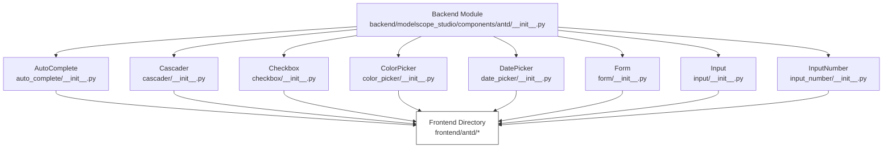
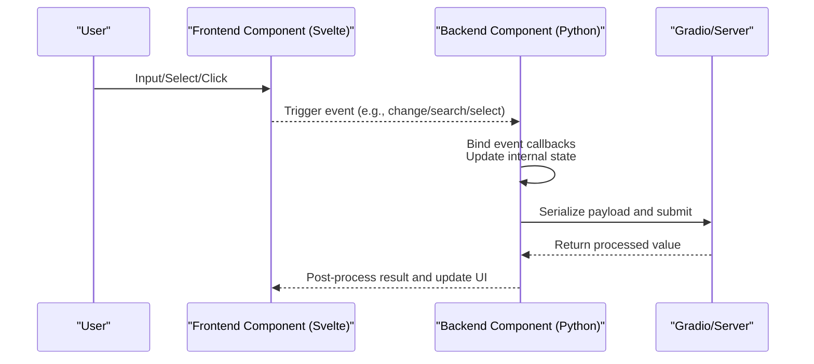
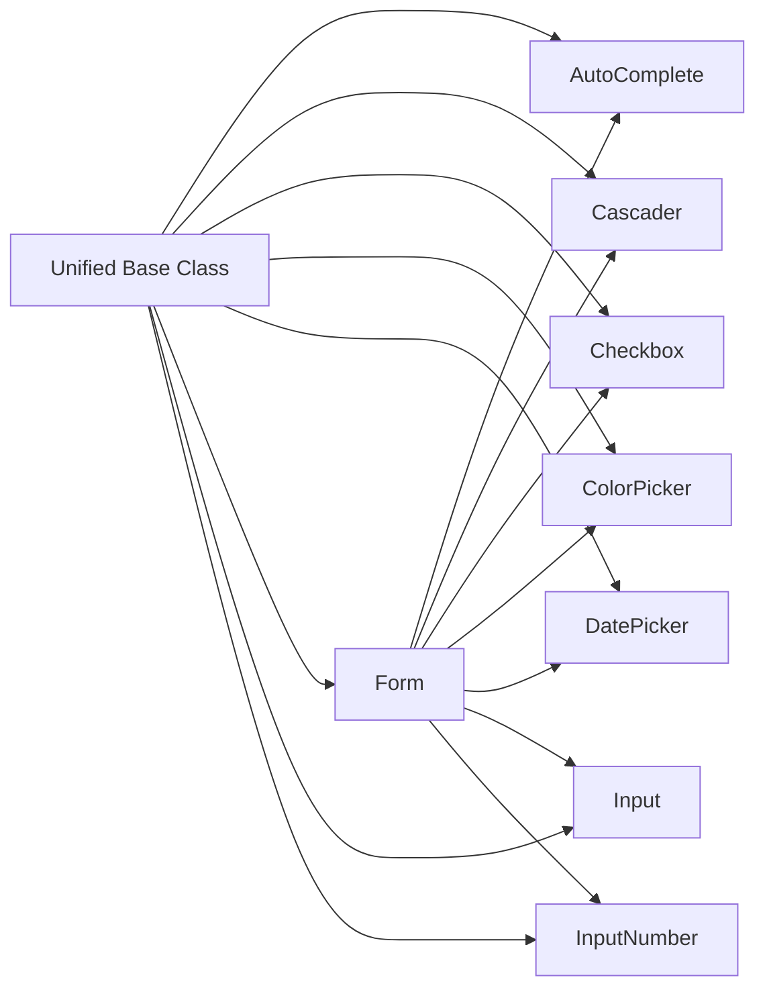

# Data Entry Components API

<cite>
**Files referenced in this document**
- [backend/modelscope_studio/components/antd/__init__.py](file://backend/modelscope_studio/components/antd/__init__.py)
- [backend/modelscope_studio/components/antd/components.py](file://backend/modelscope_studio/components/antd/components.py)
- [backend/modelscope_studio/components/antd/auto_complete/__init__.py](file://backend/modelscope_studio/components/antd/auto_complete/__init__.py)
- [backend/modelscope_studio/components/antd/cascader/__init__.py](file://backend/modelscope_studio/components/antd/cascader/__init__.py)
- [backend/modelscope_studio/components/antd/checkbox/__init__.py](file://backend/modelscope_studio/components/antd/checkbox/__init__.py)
- [backend/modelscope_studio/components/antd/color_picker/__init__.py](file://backend/modelscope_studio/components/antd/color_picker/__init__.py)
- [backend/modelscope_studio/components/antd/date_picker/__init__.py](file://backend/modelscope_studio/components/antd/date_picker/__init__.py)
- [backend/modelscope_studio/components/antd/form/__init__.py](file://backend/modelscope_studio/components/antd/form/__init__.py)
- [backend/modelscope_studio/components/antd/input/__init__.py](file://backend/modelscope_studio/components/antd/input/__init__.py)
- [backend/modelscope_studio/components/antd/input_number/__init__.py](file://backend/modelscope_studio/components/antd/input_number/__init__.py)
</cite>

## Table of Contents

1. [Introduction](#introduction)
2. [Project Structure](#project-structure)
3. [Core Components](#core-components)
4. [Architecture Overview](#architecture-overview)
5. [Detailed Component Analysis](#detailed-component-analysis)
6. [Dependency Analysis](#dependency-analysis)
7. [Performance Considerations](#performance-considerations)
8. [Troubleshooting Guide](#troubleshooting-guide)
9. [Conclusion](#conclusion)
10. [Appendix](#appendix)

## Introduction

This document is the Python API reference for Antd data entry components, covering the following components: AutoComplete, Cascader, Checkbox, ColorPicker, DatePicker, Form, Input, InputNumber, Mentions (not found in known backend files), Radio (not found in known backend files), Rate (not found in known backend files), Select (not found in known backend files), Slider (not found in known backend files), Switch (not found in known backend files), TimePicker (not found in known backend files), Transfer (not found in known backend files), TreeSelect (not found in known backend files), Upload (not found in known backend files).  
The documentation covers: constructor parameters, events and slots, property definitions, method signatures and return types, data type specifications, preprocessing/postprocessing behavior, usage examples, validation and formatting, error handling, serialization and API integration, real-time validation and UX design principles, and performance optimization recommendations.

## Project Structure

Antd components are exported centrally via on-demand imports in the backend, enabling unified usage. Each component has an independent Svelte implementation in the frontend directory, bridged by the backend through a unified base class and frontend directory mapping.

Chart sources

- [backend/modelscope_studio/components/antd/**init**.py:1-151](file://backend/modelscope_studio/components/antd/__init__.py#L1-L151)
- [backend/modelscope_studio/components/antd/auto_complete/**init**.py:1-146](file://backend/modelscope_studio/components/antd/auto_complete/__init__.py#L1-L146)
- [backend/modelscope_studio/components/antd/cascader/**init**.py:1-191](file://backend/modelscope_studio/components/antd/cascader/__init__.py#L1-L191)
- [backend/modelscope_studio/components/antd/checkbox/**init**.py:1-83](file://backend/modelscope_studio/components/antd/checkbox/__init__.py#L1-L83)
- [backend/modelscope_studio/components/antd/color_picker/**init**.py:1-148](file://backend/modelscope_studio/components/antd/color_picker/__init__.py#L1-L148)
- [backend/modelscope_studio/components/antd/date_picker/**init**.py:1-208](file://backend/modelscope_studio/components/antd/date_picker/__init__.py#L1-L208)
- [backend/modelscope_studio/components/antd/form/**init**.py:1-133](file://backend/modelscope_studio/components/antd/form/__init__.py#L1-L133)
- [backend/modelscope_studio/components/antd/input/**init**.py:1-127](file://backend/modelscope_studio/components/antd/input/__init__.py#L1-L127)
- [backend/modelscope_studio/components/antd/input_number/**init**.py:1-147](file://backend/modelscope_studio/components/antd/input_number/__init__.py#L1-L147)

Section sources

- [backend/modelscope_studio/components/antd/**init**.py:1-151](file://backend/modelscope_studio/components/antd/__init__.py#L1-L151)
- [backend/modelscope_studio/components/antd/components.py:1-145](file://backend/modelscope_studio/components/antd/components.py#L1-L145)

## Core Components

This section provides an overview of the general capabilities and differences of data entry components:

- All components inherit from a unified data layout component base class, providing consistent lifecycle and event binding mechanisms.
- Each component provides:
  - Constructor parameters: supports common properties (e.g., size, status, style, class names, etc.) and component-specific properties.
  - Event list: binds frontend callbacks via event listeners.
  - Slot list: used for custom rendering (e.g., dropdown panel, prefix/suffix, placeholder content, etc.).
  - Data type specifications: declares input/output types through API specs.
  - Preprocessing/postprocessing: type conversion or formatting of payload/value.
  - Example values and example payloads: facilitates quick integration and testing.

Section sources

- [backend/modelscope_studio/components/antd/auto_complete/**init**.py:11-146](file://backend/modelscope_studio/components/antd/auto_complete/__init__.py#L11-L146)
- [backend/modelscope_studio/components/antd/cascader/**init**.py:13-191](file://backend/modelscope_studio/components/antd/cascader/__init__.py#L13-L191)
- [backend/modelscope_studio/components/antd/checkbox/**init**.py:12-83](file://backend/modelscope_studio/components/antd/checkbox/__init__.py#L12-L83)
- [backend/modelscope_studio/components/antd/color_picker/**init**.py:12-148](file://backend/modelscope_studio/components/antd/color_picker/__init__.py#L12-L148)
- [backend/modelscope_studio/components/antd/date_picker/**init**.py:13-208](file://backend/modelscope_studio/components/antd/date_picker/__init__.py#L13-L208)
- [backend/modelscope_studio/components/antd/form/**init**.py:17-133](file://backend/modelscope_studio/components/antd/form/__init__.py#L17-L133)
- [backend/modelscope_studio/components/antd/input/**init**.py:16-127](file://backend/modelscope_studio/components/antd/input/__init__.py#L16-L127)
- [backend/modelscope_studio/components/antd/input_number/**init**.py:11-147](file://backend/modelscope_studio/components/antd/input_number/__init__.py#L11-L147)

## Architecture Overview

Backend components connect to frontend directory mappings through a unified base class. The frontend components handle UI rendering and interaction, while the backend manages data type constraints, event binding, and serialization.

Chart sources

- [backend/modelscope_studio/components/antd/auto_complete/**init**.py:18-43](file://backend/modelscope_studio/components/antd/auto_complete/__init__.py#L18-L43)
- [backend/modelscope_studio/components/antd/cascader/**init**.py:20-36](file://backend/modelscope_studio/components/antd/cascader/__init__.py#L20-L36)
- [backend/modelscope_studio/components/antd/form/**init**.py:23-36](file://backend/modelscope_studio/components/antd/form/__init__.py#L23-L36)

## Detailed Component Analysis

### AutoComplete

- Type and purpose: Auto-complete component for string input, supporting option lists and search events.
- Key properties
  - Common: size, status, variant, placeholder, disabled, class_names, styles, root_class_name, as_item, etc.
  - Specific: allow_clear, auto_focus, backfill, default_active_first_option, default_open, dropdown_render, popup_render, popup_class_name, popup_match_select_width, filter_option, get_popup_container, not_found_content, open, options, placement, options, etc.
- Events: change, blur, focus, search, select, clear, dropdown_visible_change, popup_visible_change.
- Slots: allowClear.clearIcon, dropdownRender, popupRender, children, notFoundContent, options.
- Data types
  - Input/Output: string.
  - API spec: string type.
- Preprocessing/postprocessing: pass-through.
- Usage examples
  - Use as a single input in a form, combined with validation rules.
  - Use `options` to provide candidate lists, combined with `search` event for remote search.
- Error handling
  - Customize the prompt via `not_found_content` when no match is found.
- Real-time validation
  - Trigger remote validation via `search` event, used with Form's validation trigger strategy.

Section sources

- [backend/modelscope_studio/components/antd/auto_complete/**init**.py:12-146](file://backend/modelscope_studio/components/antd/auto_complete/__init__.py#L12-L146)

### Cascader

- Type and purpose: Multi-level cascading selection, supports async loading and search.
- Key properties
  - Common: size, status, variant, placeholder, disabled, class_names, styles, root_class_name, as_item, etc.
  - Specific: allow_clear, auto_clear_search_value, auto_focus, change_on_select, display_render, tag_render, popup_class_name, dropdown_render, popup_render, expand_icon, prefix, expand_trigger, filed_names, get_popup_container, max_tag_count, max_tag_placeholder, max_tag_text_length, not_found_content, open, options, placement, show_search, multiple, show_checked_strategy, remove_icon, search_value, dropdown_menu_column_style, option_render, etc.
- Events: change, search, dropdown_visible_change, popup_visible_change, load_data.
- Slots: allowClear.clearIcon, suffixIcon, maxTagPlaceholder, notFoundContent, expandIcon, removeIcon, prefix, displayRender, tagRender, dropdownRender, popupRender, showSearch.render.
- Data types
  - Input/Output: string array or number array (path keys).
  - API spec: string array or string.
- Preprocessing/postprocessing: pass-through.
- Usage examples
  - Commonly used for province/city/district selection, category filtering, and similar scenarios.
  - Use `load_data` to implement lazy loading.
- Error handling
  - Customize empty state via `not_found_content`.
- Real-time validation
  - Combine `search` and `change` events with Form validation.

Section sources

- [backend/modelscope_studio/components/antd/cascader/**init**.py:13-191](file://backend/modelscope_studio/components/antd/cascader/__init__.py#L13-L191)

### Checkbox

- Type and purpose: Boolean value selection.
- Key properties
  - Common: class_names, styles, additional_props, root_class_name, as_item, etc.
  - Specific: auto_focus, default_checked, disabled, indeterminate.
- Events: change.
- Data types
  - Input/Output: boolean.
  - API spec: boolean type.
- Preprocessing/postprocessing: pass-through.
- Usage examples
  - Use standalone or combined into a Group.
- Error handling
  - No special error handling logic; follows boolean constraints.
- Real-time validation
  - Can participate directly in Form validation.

Section sources

- [backend/modelscope_studio/components/antd/checkbox/**init**.py:12-83](file://backend/modelscope_studio/components/antd/checkbox/__init__.py#L12-L83)

### ColorPicker

- Type and purpose: Color value selection, supports solid color and gradient modes.
- Key properties
  - Common: class_names, styles, additional_props, root_class_name, as_item, etc.
  - Specific: value_format, allow_clear, arrow, presets, disabled, disabled_alpha, disabled_format, destroy_tooltip_on_hide, destroy_on_hidden, format, mode, open, default_value, default_format, show_text, placement, trigger, panel_render, size.
- Events: change, change_complete, clear, open_change, format_change.
- Slots: presets, panelRender, showText.
- Data types
  - Input/Output: hex string or gradient color array object.
  - API spec: string or color array object.
- Preprocessing/postprocessing: pass-through.
- Usage examples
  - Used for theme color, brand color, and similar configurations.
- Error handling
  - Invalid formats are intercepted by frontend validation.
- Real-time validation
  - Combine `change` and `change_complete` events with validation.

Section sources

- [backend/modelscope_studio/components/antd/color_picker/**init**.py:12-148](file://backend/modelscope_studio/components/antd/color_picker/__init__.py#L12-L148)

### DatePicker

- Type and purpose: Date/time selection, supports multiple modes and range selection.
- Key properties
  - Common: class_names, styles, additional_props, root_class_name, as_item, etc.
  - Specific: allow_clear, auto_focus, cell_render, components, disabled, disabled_date, format, order, preserve_invalid_on_blur, input_read_only, locale, mode, need_confirm, next_icon, open, panel_render, picker, placement, placeholder, popup_class_name, popup_style, get_popup_container, min_date, max_date, prefix, prev_icon, size, presets, status, suffix_icon, super_next_icon, super_prev_icon, variant, default_picker_value, default_value, disabled_time, multiple, picker_value, render_extra_footer, show_now, show_time, show_week, preview_value.
- Events: change, ok, panel_change, open_change.
- Slots: allowClear.clearIcon, prefix, prevIcon, nextIcon, suffixIcon, superNextIcon, superPrevIcon, renderExtraFooter, cellRender, panelRender.
- Data types
  - Input/Output: string, number, or array (range).
  - API spec: string, number, or array.
- Preprocessing/postprocessing: pass-through.
- Usage examples
  - Supports date, week, month, quarter, year, and other modes; can enable time selection and confirmation button.
- Error handling
  - Restrict ranges via `disabled_date`, `min_date`, `max_date`.
- Real-time validation
  - Combine `panel_change` and `change` events with validation.

Section sources

- [backend/modelscope_studio/components/antd/date_picker/**init**.py:13-208](file://backend/modelscope_studio/components/antd/date_picker/__init__.py#L13-L208)

### Form

- Type and purpose: Data collection and validation container, supports field change, submit, reset, and validation.
- Key properties
  - Common: class_names, styles, additional_props, root_class_name, as_item, etc.
  - Specific: form_action, colon, disabled, component, feedback_icons, initial_values, label_align, label_col, label_wrap, layout, form_name, preserve, required_mark, scroll_to_first_error, size, validate_messages, validate_trigger, variant, wrapper_col, clear_on_destroy.
- Events: fields_change, finish, finish_failed, values_change.
- Slots: requiredMark.
- Data types
  - Input/Output: dict or wrapped model.
  - Preprocessing: extract wrapped model into dict.
- Preprocessing/postprocessing: unpack AntdFormData to dict.
- Usage examples
  - Place each data entry component as a child item in Form to manage validation and submission uniformly.
- Error handling
  - Control error display and positioning via `validate_messages`, `scroll_to_first_error`.
- Real-time validation
  - Control trigger timing via `validate_trigger` (e.g., onChange).

Section sources

- [backend/modelscope_studio/components/antd/form/**init**.py:17-133](file://backend/modelscope_studio/components/antd/form/__init__.py#L17-L133)

### Input

- Type and purpose: Basic text input, supports password, search, multi-line text, OTP and other variants.
- Key properties
  - Common: class_names, styles, additional_props, root_class_name, as_item, etc.
  - Specific: addon_after, addon_before, allow_clear, count, default_value, read_only, disabled, max_length, prefix, show_count, size, status, suffix, type, placeholder, variant.
- Events: change, press_enter, clear.
- Slots: addonAfter, addonBefore, allowClear.clearIcon, prefix, suffix, showCount.formatter.
- Data types
  - Input/Output: string.
  - API spec: string.
- Preprocessing/postprocessing: pass-through.
- Usage examples
  - Extend to different forms via Password, Search, Textarea, OTP subclasses.
- Error handling
  - Provide feedback via `status` and validation rules.
- Real-time validation
  - Combine `change` and `press_enter` events with validation.

Section sources

- [backend/modelscope_studio/components/antd/input/**init**.py:16-127](file://backend/modelscope_studio/components/antd/input/__init__.py#L16-L127)

### InputNumber

- Type and purpose: Numeric input, supports stepping, precision, up/down controls, etc.
- Key properties
  - Common: class_names, styles, additional_props, root_class_name, as_item, etc.
  - Specific: addon_after, addon_before, auto_focus, change_on_blur, change_on_wheel, controls, decimal_separator, placeholder, default_value, disabled, formatter, keyboard, max, min, mode, parser, precision, prefix, read_only, size, status, step, string_mode, suffix, variant.
- Events: change, press_enter, step.
- Slots: addonAfter, addonBefore, controls.upIcon, controls.downIcon, prefix, suffix.
- Data types
  - Input/Output: integer or float.
  - API spec: number.
- Preprocessing/postprocessing: parse string to integer or float.
- Usage examples
  - Suitable for price, quantity, rating, and other numeric inputs.
- Error handling
  - Constrain range and granularity via `min`/`max`, `precision`, `step`.
- Real-time validation
  - Combine `change` and `step` events with validation.

Section sources

- [backend/modelscope_studio/components/antd/input_number/**init**.py:11-147](file://backend/modelscope_studio/components/antd/input_number/__init__.py#L11-L147)

### Mentions (not found in backend)

- Status: No backend implementation file found in the current repository.
- Recommendation: If needed, refer to the Antd official documentation and frontend implementation, and add the backend adapter layer.

### Radio (not found in backend)

- Status: No backend implementation file found in the current repository.
- Recommendation: If needed, refer to the Antd official documentation and frontend implementation, and add the backend adapter layer.

### Rate (not found in backend)

- Status: No backend implementation file found in the current repository.
- Recommendation: If needed, refer to the Antd official documentation and frontend implementation, and add the backend adapter layer.

### Select (not found in backend)

- Status: No backend implementation file found in the current repository.
- Recommendation: If needed, refer to the Antd official documentation and frontend implementation, and add the backend adapter layer.

### Slider (not found in backend)

- Status: No backend implementation file found in the current repository.
- Recommendation: If needed, refer to the Antd official documentation and frontend implementation, and add the backend adapter layer.

### Switch (not found in backend)

- Status: No backend implementation file found in the current repository.
- Recommendation: If needed, refer to the Antd official documentation and frontend implementation, and add the backend adapter layer.

### TimePicker (not found in backend)

- Status: No backend implementation file found in the current repository.
- Recommendation: If needed, refer to the Antd official documentation and frontend implementation, and add the backend adapter layer.

### Transfer (not found in backend)

- Status: No backend implementation file found in the current repository.
- Recommendation: If needed, refer to the Antd official documentation and frontend implementation, and add the backend adapter layer.

### TreeSelect (not found in backend)

- Status: No backend implementation file found in the current repository.
- Recommendation: If needed, refer to the Antd official documentation and frontend implementation, and add the backend adapter layer.

### Upload (not found in backend)

- Status: No backend implementation file found in the current repository.
- Recommendation: If needed, refer to the Antd official documentation and frontend implementation, and add the backend adapter layer.

## Dependency Analysis

- Inter-component coupling
  - All components share the same base class and event system, with low coupling and high cohesion.
  - Form acts as a container, aggregating data entry components to form a loosely-coupled form ecosystem.
- External dependencies
  - The event system is based on Gradio's event listeners.
  - Frontend directory mappings are resolved via utility functions, ensuring frontend-backend consistency.
- Circular dependencies
  - No circular dependencies detected.

Chart sources

- [backend/modelscope_studio/components/antd/auto_complete/**init**.py:12](file://backend/modelscope_studio/components/antd/auto_complete/__init__.py#L12)
- [backend/modelscope_studio/components/antd/cascader/**init**.py:13](file://backend/modelscope_studio/components/antd/cascader/__init__.py#L13)
- [backend/modelscope_studio/components/antd/checkbox/**init**.py:12](file://backend/modelscope_studio/components/antd/checkbox/__init__.py#L12)
- [backend/modelscope_studio/components/antd/color_picker/**init**.py:12](file://backend/modelscope_studio/components/antd/color_picker/__init__.py#L12)
- [backend/modelscope_studio/components/antd/date_picker/**init**.py:13](file://backend/modelscope_studio/components/antd/date_picker/__init__.py#L13)
- [backend/modelscope_studio/components/antd/form/**init**.py:17](file://backend/modelscope_studio/components/antd/form/__init__.py#L17)
- [backend/modelscope_studio/components/antd/input/**init**.py:16](file://backend/modelscope_studio/components/antd/input/__init__.py#L16)
- [backend/modelscope_studio/components/antd/input_number/**init**.py:11](file://backend/modelscope_studio/components/antd/input_number/__init__.py#L11)

Section sources

- [backend/modelscope_studio/components/antd/**init**.py:1-151](file://backend/modelscope_studio/components/antd/__init__.py#L1-L151)

## Performance Considerations

- Event binding and callbacks
  - Set event bindings judiciously (e.g., only enable search/visibility change events when necessary) to avoid excessive triggering.
- Data types and serialization
  - Numeric input components perform string-to-number conversion during preprocessing, reducing overhead from frontend type inconsistencies.
- Dropdowns and popups
  - For complex dropdowns (e.g., Cascader), use lazy loading and virtual scrolling (if supported by the frontend) to reduce rendering costs.
- Styles and class names
  - Use `class_names` and `styles` to streamline styles, avoiding repeated computation and repaints.
- Form validation
  - Set `validate_trigger` appropriately to avoid performance issues from high-frequency validation.

## Troubleshooting Guide

- Event not triggered
  - Check that event listeners are correctly bound and confirm that the frontend callback is enabled.
- Data type mismatch
  - For numeric input components, preprocessing may fail when non-numeric strings are entered; ensure input format is correct.
- Validation not working
  - Confirm that Form's `validate_trigger` settings are consistent with component events; check `required_mark` and `scroll_to_first_error` configuration.
- Dropdown/popup issues
  - Check `get_popup_container` and `placement` configuration, ensuring the container is visible and the position is reasonable.
- Cascading load failure
  - Confirm that `load_data` callback logic is consistent with the `options` structure.

Section sources

- [backend/modelscope_studio/components/antd/input_number/**init**.py:128-140](file://backend/modelscope_studio/components/antd/input_number/__init__.py#L128-L140)
- [backend/modelscope_studio/components/antd/form/**init**.py:48-68](file://backend/modelscope_studio/components/antd/form/__init__.py#L48-L68)
- [backend/modelscope_studio/components/antd/cascader/**init**.py:33-36](file://backend/modelscope_studio/components/antd/cascader/__init__.py#L33-L36)

## Conclusion

This project provides a unified Antd data entry component backend adapter layer, covering core components such as AutoComplete, Cascader, Checkbox, ColorPicker, DatePicker, Form, Input, and InputNumber. Through a consistent event system, data type specifications, and preprocessing/postprocessing mechanisms, developers can efficiently build forms and data entry interfaces. For missing components (such as Mentions, Radio, Rate, Select, Slider, Switch, TimePicker, Transfer, TreeSelect, Upload), it is recommended to refer to the Antd official documentation and frontend implementations to add backend adapter layers and maintain ecosystem consistency.

## Appendix

- Usage recommendations
  - Place data entry components inside a Form container to manage initial values, validation, and submission uniformly.
  - For complex inputs (e.g., Cascader, DatePicker), prefer controlled mode with explicit API specs.
  - Use slots and variants (`variant`) to improve accessibility and consistency.
- Best practices
  - Set reasonable default values and placeholders for each input to improve user experience.
  - For wide-range inputs (e.g., numbers), set `min`/`max` and `step` to avoid invalid input.
  - For date inputs, specify `format` and `picker` mode explicitly to reduce ambiguity.
