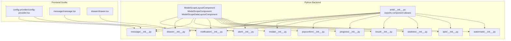
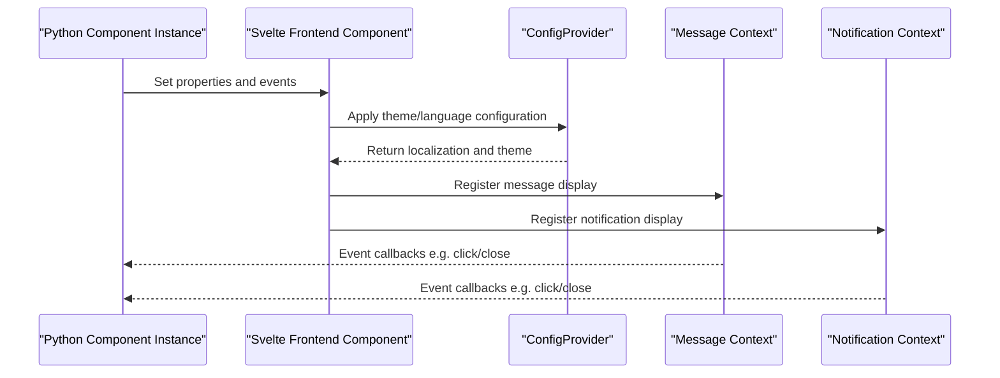
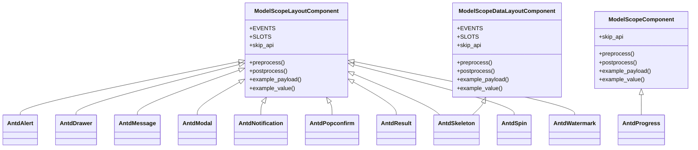

# Feedback Components API

<cite>
**Files referenced in this document**
- [backend/modelscope_studio/components/antd/alert/__init__.py](file://backend/modelscope_studio/components/antd/alert/__init__.py)
- [backend/modelscope_studio/components/antd/drawer/__init__.py](file://backend/modelscope_studio/components/antd/drawer/__init__.py)
- [backend/modelscope_studio/components/antd/message/__init__.py](file://backend/modelscope_studio/components/antd/message/__init__.py)
- [backend/modelscope_studio/components/antd/modal/__init__.py](file://backend/modelscope_studio/components/antd/modal/__init__.py)
- [backend/modelscope_studio/components/antd/notification/__init__.py](file://backend/modelscope_studio/components/antd/notification/__init__.py)
- [backend/modelscope_studio/components/antd/popconfirm/__init__.py](file://backend/modelscope_studio/components/antd/popconfirm/__init__.py)
- [backend/modelscope_studio/components/antd/progress/__init__.py](file://backend/modelscope_studio/components/antd/progress/__init__.py)
- [backend/modelscope_studio/components/antd/result/__init__.py](file://backend/modelscope_studio/components/antd/result/__init__.py)
- [backend/modelscope_studio/components/antd/skeleton/__init__.py](file://backend/modelscope_studio/components/antd/skeleton/__init__.py)
- [backend/modelscope_studio/components/antd/spin/__init__.py](file://backend/modelscope_studio/components/antd/spin/__init__.py)
- [backend/modelscope_studio/components/antd/watermark/__init__.py](file://backend/modelscope_studio/components/antd/watermark/__init__.py)
- [backend/modelscope_studio/utils/dev/component.py](file://backend/modelscope_studio/utils/dev/component.py)
- [backend/modelscope_studio/components/antd/modal/static/__init__.py](file://backend/modelscope_studio/components/antd/modal/static/__init__.py)
- [backend/modelscope_studio/components/antd/__init__.py](file://backend/modelscope_studio/components/antd/__init__.py)
- [frontend/antd/config-provider/config-provider.tsx](file://frontend/antd/config-provider/config-provider.tsx)
- [frontend/antd/config-provider/locales.ts](file://frontend/antd/config-provider/locales.ts)
- [frontend/antd/message/message.tsx](file://frontend/antd/message/message.tsx)
- [frontend/antd/drawer/drawer.tsx](file://frontend/antd/drawer/drawer.tsx)
</cite>

## Table of Contents

1. [Introduction](#introduction)
2. [Project Structure](#project-structure)
3. [Core Components](#core-components)
4. [Architecture Overview](#architecture-overview)
5. [Detailed Component Analysis](#detailed-component-analysis)
6. [Dependency Analysis](#dependency-analysis)
7. [Performance Considerations](#performance-considerations)
8. [Troubleshooting Guide](#troubleshooting-guide)
9. [Conclusion](#conclusion)
10. [Appendix](#appendix)

## Introduction

This document is the Python API reference for Antd feedback components, covering Alert, Drawer, Message, Modal, Notification, Popconfirm, Progress, Result, Skeleton, Spin, Watermark, and other feedback-related components. Content includes:

- Constructor parameters and property definitions
- Method signatures and return types
- Usage examples (provided as "example paths")
- Timing control, animation, and interaction response
- Global configuration, themes, and internationalization
- UX design principles and notification strategy best practices

## Project Structure

Feedback components are located in the antd sub-module of the backend Python package. Each component inherits from a unified component base class, with the frontend implemented by corresponding Svelte components interfaced with the Gradio event system.

Chart sources

- [backend/modelscope_studio/utils/dev/component.py:11-169](file://backend/modelscope_studio/utils/dev/component.py#L11-L169)
- [backend/modelscope_studio/components/antd/**init**.py:1-151](file://backend/modelscope_studio/components/antd/__init__.py#L1-L151)
- [frontend/antd/config-provider/config-provider.tsx:51-106](file://frontend/antd/config-provider/config-provider.tsx#L51-L106)
- [frontend/antd/message/message.tsx:55-78](file://frontend/antd/message/message.tsx#L55-L78)
- [frontend/antd/drawer/drawer.tsx:14-60](file://frontend/antd/drawer/drawer.tsx#L14-L60)

Section sources

- [backend/modelscope_studio/components/antd/**init**.py:1-151](file://backend/modelscope_studio/components/antd/__init__.py#L1-L151)
- [backend/modelscope_studio/utils/dev/component.py:11-169](file://backend/modelscope_studio/utils/dev/component.py#L11-L169)

## Core Components

The following is an overview of common constructor parameters and properties for feedback components (grouped by component):

- Common parameters
  - visible: boolean, whether to render
  - elem_id: string, element ID
  - elem_classes: list or string, CSS classes
  - elem_style: dict, inline styles
  - render: boolean, whether to render
  - as_item: string, layout item identifier
  - class_names: dict or string, additional class name mapping
  - styles: dict or string, additional style mapping
  - root_class_name: string, root node class name
  - additional_props: dict, extra properties passed through to frontend components
  - \_internal: internal parameter, reserved by the framework

- Event binding (registered via EVENTS list)
  - Event callbacks are bound to frontend components via internal updates at construction time

Section sources

- [backend/modelscope_studio/utils/dev/component.py:28-98](file://backend/modelscope_studio/utils/dev/component.py#L28-L98)
- [backend/modelscope_studio/components/antd/alert/**init**.py:16-20](file://backend/modelscope_studio/components/antd/alert/__init__.py#L16-L20)
- [backend/modelscope_studio/components/antd/drawer/**init**.py:14-18](file://backend/modelscope_studio/components/antd/drawer/__init__.py#L14-L18)
- [backend/modelscope_studio/components/antd/message/**init**.py:14-21](file://backend/modelscope_studio/components/antd/message/__init__.py#L14-L21)
- [backend/modelscope_studio/components/antd/modal/**init**.py:18-25](file://backend/modelscope_studio/components/antd/modal/__init__.py#L18-L25)
- [backend/modelscope_studio/components/antd/notification/**init**.py:14-21](file://backend/modelscope_studio/components/antd/notification/__init__.py#L14-L21)
- [backend/modelscope_studio/components/antd/popconfirm/**init**.py:14-27](file://backend/modelscope_studio/components/antd/popconfirm/__init__.py#L14-L27)
- [backend/modelscope_studio/components/antd/watermark/**init**.py:12-16](file://backend/modelscope_studio/components/antd/watermark/__init__.py#L12-L16)

## Architecture Overview

The feedback component call chain is as follows: the Python layer constructs component instances, sets properties and events; the frontend Svelte component receives props and interfaces with Ant Design components; the global ConfigProvider provides themes and internationalization; Message/Notification display globally through frontend context.

Chart sources

- [frontend/antd/config-provider/config-provider.tsx:51-106](file://frontend/antd/config-provider/config-provider.tsx#L51-L106)
- [frontend/antd/message/message.tsx:55-78](file://frontend/antd/message/message.tsx#L55-L78)
- [backend/modelscope_studio/components/antd/message/**init**.py:14-21](file://backend/modelscope_studio/components/antd/message/__init__.py#L14-L21)
- [backend/modelscope_studio/components/antd/notification/**init**.py:14-21](file://backend/modelscope_studio/components/antd/notification/__init__.py#L14-L21)

## Detailed Component Analysis

### Alert

- Constructor parameters and properties
  - action: string, action button content
  - after_close: string, callback after closing
  - banner: boolean, banner mode
  - closable: boolean or dict, closable configuration
  - description: string, description text
  - icon: string, icon
  - message: string, title
  - show_icon: boolean, whether to show icon
  - type: text enum (success/info/warning/error), type
  - slots: supports action, closable.closeIcon, description, icon, message
- Methods
  - preprocess(payload): input preprocessing
  - postprocess(value): output postprocessing
  - example_payload()/example_value(): example data
- Events
  - close: close event binding

Section sources

- [backend/modelscope_studio/components/antd/alert/**init**.py:25-89](file://backend/modelscope_studio/components/antd/alert/__init__.py#L25-L89)

### Drawer

- Constructor parameters and properties
  - after_open_change: string, callback on open state change
  - auto_focus: boolean, auto focus
  - body_style: dict, body style
  - close_icon: string, close icon
  - closable: boolean or dict, closable
  - destroy_on_close/destroy_on_hidden: boolean, destroy on close/hide
  - draggable: boolean, draggable
  - extra: string, extra content
  - footer: string, footer
  - force_render: boolean, force render
  - get_container: string, container selector
  - height/width: number or string, size
  - keyboard: boolean, keyboard support
  - mask/mask_closable: boolean, mask and click-to-close mask
  - placement: text enum (left/right/top/bottom), position
  - push: boolean or dict, push
  - resizable: boolean, resizable
  - size: text enum (default/large), size
  - title: string, title
  - loading: boolean, loading
  - open: boolean, whether open
  - z_index: integer, z-index
  - drawer_render: string, render function
  - slots: supports closeIcon, closable.closeIcon, extra, footer, title, drawerRender
- Methods
  - preprocess()/postprocess(): preprocessing/postprocessing
  - example_payload()/example_value(): example data
- Events
  - close: close event binding
  - resizable_resize_start: resize start event binding
  - resizable_resize: resize event binding
  - resizable_resize_end: resize end event binding

**Update** Drawer component added three resize-related event handlers:

- resizable_resize_start: triggered when the user starts dragging to resize the drawer
- resizable_resize: continuously triggered during the resize process
- resizable_resize_end: triggered when the resize operation is complete

These events allow developers to monitor the dynamic adjustment process of the drawer for more fine-grained interaction control.

Section sources

- [backend/modelscope_studio/components/antd/drawer/**init**.py:14-27](file://backend/modelscope_studio/components/antd/drawer/__init__.py#L14-L27)
- [backend/modelscope_studio/components/antd/drawer/**init**.py:26-126](file://backend/modelscope_studio/components/antd/drawer/__init__.py#L26-L126)
- [frontend/antd/drawer/drawer.tsx:14-60](file://frontend/antd/drawer/drawer.tsx#L14-L60)

### Message

- Constructor parameters and properties
  - content: string, message content
  - type: text enum (success/info/warning/error/loading), type
  - duration: number, duration
  - icon: string, icon
  - key: string/number/float, unique key
  - pause_on_hover: boolean, pause on hover
  - get_container: string, container selector
  - rtl: boolean, right-to-left
  - top: number, top offset
  - slots: supports icon, content
- Methods
  - preprocess(payload: str|None): str|None
  - postprocess(value: str|None): str|None
  - example_payload()/example_value(): example data
- Events
  - click/close: click and close event binding

Section sources

- [backend/modelscope_studio/components/antd/message/**init**.py:26-91](file://backend/modelscope_studio/components/antd/message/__init__.py#L26-L91)
- [frontend/antd/message/message.tsx:55-78](file://frontend/antd/message/message.tsx#L55-L78)

### Modal

- Constructor parameters and properties
  - after_close: string, callback after closing
  - cancel_button_props/cancel_text: dict/string, cancel button properties and text
  - centered: boolean, centered
  - closable/close_icon: boolean/dict/string, closable and close icon
  - confirm_loading: boolean, confirming
  - destroy_on_close/destroy_on_hidden: boolean, destroy on close/hide
  - focus_trigger_after_close: boolean, focus trigger after close
  - focusable: boolean/dict, focusable
  - footer: string or default constant, footer
  - force_render: boolean, force render
  - get_container: string, container selector
  - keyboard: boolean, keyboard support
  - mask/mask_closable: boolean, mask and click-to-close mask
  - modal_render: string, render function
  - ok_text/ok_type/ok_button_props: string/dict, OK button properties
  - loading: boolean, loading
  - title: string, title
  - open: boolean, whether open
  - width: number/string, width
  - wrap_class_name: string, wrapper class name
  - z_index: integer, z-index
  - after_open_change: string, callback on open state change
  - slots: supports closeIcon, cancelButtonProps.icon, cancelText, closable.closeIcon, closeIcon, footer, title, okButtonProps.icon, okText, modalRender
- Methods
  - preprocess()/postprocess(): preprocessing/postprocessing
  - example_payload()/example_value(): example data
- Events
  - ok/cancel: confirm and cancel event binding
- Static sub-components
  - Static: static modal component (for static scenarios)

Section sources

- [backend/modelscope_studio/components/antd/modal/**init**.py:34-136](file://backend/modelscope_studio/components/antd/modal/__init__.py#L34-L136)
- [backend/modelscope_studio/components/antd/modal/static/**init**.py:30-61](file://backend/modelscope_studio/components/antd/modal/static/__init__.py#L30-L61)

### Notification

- Constructor parameters and properties
  - message/description/title: string, message, description, title
  - type: text enum (success/info/warning/error), type
  - btn: string, button
  - close_icon: string/boolean, close icon
  - duration: number, duration
  - show_progress/pause_on_hover: boolean, progress bar and pause on hover
  - icon: string, icon
  - key: string, unique key
  - placement: text enum (top/topLeft/topRight/bottom/bottomLeft/bottomRight), position
  - role: text enum (alert/status), role
  - bottom/top: number, margins
  - rtl: boolean, right-to-left
  - get_container: string, container selector
  - stack: boolean/dict, stack configuration
  - slots: supports actions, closeIcon, description, icon, message, title
- Methods
  - preprocess()/postprocess(): preprocessing/postprocessing
  - example_payload()/example_value(): example data
- Events
  - click/close: click and close event binding

Section sources

- [backend/modelscope_studio/components/antd/notification/**init**.py:26-109](file://backend/modelscope_studio/components/antd/notification/__init__.py#L26-L109)

### Popconfirm

- Constructor parameters and properties
  - title/description: string, title and description
  - cancel_button_props/cancel_text: dict/string, cancel button
  - disabled: boolean, disabled
  - icon: string, icon
  - ok_button_props/ok_text/ok_type: dict/string/enum, OK button
  - show_cancel: boolean, show cancel
  - align/arrow/auto_adjust_overflow: dict/boolean, positioning and auto-fit
  - color: string, color
  - default_open: boolean, initially open
  - destroy_tooltip_on_hide/destroy_on_hidden: boolean, destroy strategy
  - fresh: boolean, refresh
  - get_popup_container: string, popup container
  - mouse_enter_delay/mouse_leave_delay: number, delay
  - overlay_class_name/overlay_style/overlay_inner_style: string/dict, overlay styles
  - placement: text enum (multiple directions), position
  - trigger: text enum or list (hover/focus/click/contextMenu), trigger method
  - open: boolean, whether open
  - z_index: integer, z-index
  - slots: supports title, description, cancelButtonProps.icon, cancelText, okButtonProps.icon, okText
- Methods
  - preprocess()/postprocess(): preprocessing/postprocessing
  - example_payload()/example_value(): example data
- Events
  - open_change/cancel/confirm/popup_click: open change, cancel, confirm, popup click event binding

Section sources

- [backend/modelscope_studio/components/antd/popconfirm/**init**.py:39-156](file://backend/modelscope_studio/components/antd/popconfirm/__init__.py#L39-L156)

### Progress

- Constructor parameters and properties
  - percent: integer, default 0, percentage
  - format: string, format function
  - show_info: boolean, show info
  - status: text enum (success/exception/normal/active), status
  - rounding: string, rounding
  - stroke_color: string/list/dict, stroke color
  - stroke_linecap: text enum (round/butt/square), line cap
  - success: dict, success area
  - trail_color: string, trail color
  - type: text enum (line/circle/dashboard), type
  - size: number/list/dict/enum (small/default), size
  - steps: integer/dict, steps
  - percent_position: dict, percent position
  - stroke_width: number/float, stroke width
  - gap_degree/gap_position/gap_placement: number/enum, gap degree and position
- Methods
  - preprocess()/postprocess(): preprocessing/postprocessing
  - example_payload()/example_value(): example data

Section sources

- [backend/modelscope_studio/components/antd/progress/**init**.py:15-100](file://backend/modelscope_studio/components/antd/progress/__init__.py#L15-L100)

### Result

- Constructor parameters and properties
  - extra: string, extra content
  - icon: string, icon
  - status: text enum (success/error/info/warning/404/403/500), status
  - sub_title: string, subtitle
  - title: string, title
  - slots: supports extra, icon, subTitle, title
- Methods
  - preprocess()/postprocess(): preprocessing/postprocessing
  - example_payload()/example_value(): example data

Section sources

- [backend/modelscope_studio/components/antd/result/**init**.py:17-75](file://backend/modelscope_studio/components/antd/result/__init__.py#L17-L75)

### Skeleton

- Constructor parameters and properties
  - active: boolean, animation
  - avatar: boolean/dict, avatar skeleton
  - loading: boolean, loading
  - paragraph: boolean/dict, paragraph skeleton
  - round: boolean, rounded
  - title: boolean/dict, title skeleton
- Sub-components
  - Node/Avatar/Button/Image/Input: skeleton nodes and elements
- Methods
  - preprocess()/postprocess(): preprocessing/postprocessing
  - example_payload()/example_value(): example data

Section sources

- [backend/modelscope_studio/components/antd/skeleton/**init**.py:22-80](file://backend/modelscope_studio/components/antd/skeleton/__init__.py#L22-L80)

### Spin

- Constructor parameters and properties
  - spinning: boolean, whether spinning
  - delay: number, delay
  - fullscreen: boolean, fullscreen
  - indicator: string, indicator
  - percent: number/float/enum ('auto'), percentage
  - size: text enum (small/default/large), size
  - tip: string, tip text
  - wrapper_class_name: string, wrapper class name
  - slots: supports tip, indicator
- Methods
  - preprocess()/postprocess(): preprocessing/postprocessing
  - example_payload()/example_value(): example data

Section sources

- [backend/modelscope_studio/components/antd/spin/**init**.py:17-79](file://backend/modelscope_studio/components/antd/spin/__init__.py#L17-L79)

### Watermark

- Constructor parameters and properties
  - content: string/list, content (text or array)
  - width/height: number/float, size
  - inherit: boolean, inherit
  - rotate: number/float, rotation angle
  - z_index: integer, z-index
  - image: string, image watermark
  - font: dict, font configuration
  - gap: list, gap
  - offset: list, offset
- Methods
  - preprocess()/postprocess(): preprocessing/postprocessing
  - example_payload()/example_value(): example data
- Events
  - remove: remove event binding

Section sources

- [backend/modelscope_studio/components/antd/watermark/**init**.py:18-84](file://backend/modelscope_studio/components/antd/watermark/__init__.py#L18-L84)

## Dependency Analysis

- Component base classes
  - ModelScopeLayoutComponent: layout-type component base class, supports events and slots
  - ModelScopeComponent: data-type component base class, supports values and loading
  - ModelScopeDataLayoutComponent: data+layout combined base class
- Exports and aliases
  - Components are exported as public aliases via antd/**init**.py for direct import usage

Chart sources

- [backend/modelscope_studio/utils/dev/component.py:11-169](file://backend/modelscope_studio/utils/dev/component.py#L11-L169)
- [backend/modelscope_studio/components/antd/alert/**init**.py:11-15](file://backend/modelscope_studio/components/antd/alert/__init__.py#L11-L15)
- [backend/modelscope_studio/components/antd/drawer/**init**.py:10-13](file://backend/modelscope_studio/components/antd/drawer/__init__.py#L10-L13)
- [backend/modelscope_studio/components/antd/message/**init**.py:10-13](file://backend/modelscope_studio/components/antd/message/__init__.py#L10-L13)
- [backend/modelscope_studio/components/antd/modal/**init**.py:11-16](file://backend/modelscope_studio/components/antd/modal/__init__.py#L11-L16)
- [backend/modelscope_studio/components/antd/notification/**init**.py:10-13](file://backend/modelscope_studio/components/antd/notification/__init__.py#L10-L13)
- [backend/modelscope_studio/components/antd/popconfirm/**init**.py:10-13](file://backend/modelscope_studio/components/antd/popconfirm/__init__.py#L10-L13)
- [backend/modelscope_studio/components/antd/progress/**init**.py:8-11](file://backend/modelscope_studio/components/antd/progress/__init__.py#L8-L11)
- [backend/modelscope_studio/components/antd/result/**init**.py:8-11](file://backend/modelscope_studio/components/antd/result/__init__.py#L8-L11)
- [backend/modelscope_studio/components/antd/skeleton/**init**.py:11-14](file://backend/modelscope_studio/components/antd/skeleton/__init__.py#L11-L14)
- [backend/modelscope_studio/components/antd/spin/**init**.py:8-11](file://backend/modelscope_studio/components/antd/spin/__init__.py#L8-L11)
- [backend/modelscope_studio/components/antd/watermark/**init**.py:8-11](file://backend/modelscope_studio/components/antd/watermark/__init__.py#L8-L11)

Section sources

- [backend/modelscope_studio/utils/dev/component.py:11-169](file://backend/modelscope_studio/utils/dev/component.py#L11-L169)
- [backend/modelscope_studio/components/antd/**init**.py:1-151](file://backend/modelscope_studio/components/antd/__init__.py#L1-L151)

## Performance Considerations

- Event binding and callbacks
  - Bind callbacks at construction time via the EVENTS list to avoid the overhead of repeated binding at runtime
- Rendering strategy
  - destroy_on_close/destroy_on_hidden: destroy on close or hide to reduce memory usage
  - force_render: force render on demand to avoid unnecessary re-renders
- Animation and transitions
  - Control visual feedback and performance balance through frontend component animation configurations (e.g., Spin's delay, Progress's active)
- Global components
  - Message/Notification use context management to avoid frequent creation and destruction of instances

## Troubleshooting Guide

- Events not triggered
  - Check that the EVENTS list and callback bindings are correct
  - Confirm that the frontend component has correctly received and forwarded events
- Display issues
  - Check state parameters such as visible, render, open
  - For global components (Message/Notification), confirm container selectors and mount targets
- Theme and internationalization not taking effect
  - Confirm ConfigProvider's locale and themeMode settings
  - Check that the language pack in locales.ts is available

Section sources

- [backend/modelscope_studio/components/antd/alert/**init**.py:16-20](file://backend/modelscope_studio/components/antd/alert/__init__.py#L16-L20)
- [backend/modelscope_studio/components/antd/drawer/**init**.py:14-18](file://backend/modelscope_studio/components/antd/drawer/__init__.py#L14-L18)
- [backend/modelscope_studio/components/antd/message/**init**.py:14-21](file://backend/modelscope_studio/components/antd/message/__init__.py#L14-L21)
- [backend/modelscope_studio/components/antd/modal/**init**.py:18-25](file://backend/modelscope_studio/components/antd/modal/__init__.py#L18-L25)
- [backend/modelscope_studio/components/antd/notification/**init**.py:14-21](file://backend/modelscope_studio/components/antd/notification/__init__.py#L14-L21)
- [backend/modelscope_studio/components/antd/popconfirm/**init**.py:14-27](file://backend/modelscope_studio/components/antd/popconfirm/__init__.py#L14-L27)
- [backend/modelscope_studio/components/antd/watermark/**init**.py:12-16](file://backend/modelscope_studio/components/antd/watermark/__init__.py#L12-L16)
- [frontend/antd/config-provider/config-provider.tsx:51-106](file://frontend/antd/config-provider/config-provider.tsx#L51-L106)
- [frontend/antd/config-provider/locales.ts:159-806](file://frontend/antd/config-provider/locales.ts#L159-L806)

## Conclusion

This reference document covers the Python API, frontend integration, and global configuration essentials for feedback components. In practice, it is recommended to:

- Clarify component responsibilities and applicable scenarios (alerts, dialogs, progress, skeleton, loading, watermark)
- Set event and lifecycle parameters appropriately to ensure smooth interactions
- Use ConfigProvider for unified theme and internationalization management
- Follow notification strategies and UX design principles to avoid excessive interruptions

## Appendix

- Usage examples (provided as "example paths")
  - Message: see [docs/components/antd/message/README-zh_CN.md:1-8](file://docs/components/antd/message/README-zh_CN.md#L1-L8)
  - Notification: see [docs/components/antd/notification/README-zh_CN.md:1-8](file://docs/components/antd/notification/README-zh_CN.md#L1-L8)
- Global configuration and internationalization
  - ConfigProvider: see [frontend/antd/config-provider/config-provider.tsx:51-106](file://frontend/antd/config-provider/config-provider.tsx#L51-L106)
  - Language packs: see [frontend/antd/config-provider/locales.ts:159-806](file://frontend/antd/config-provider/locales.ts#L159-L806)
