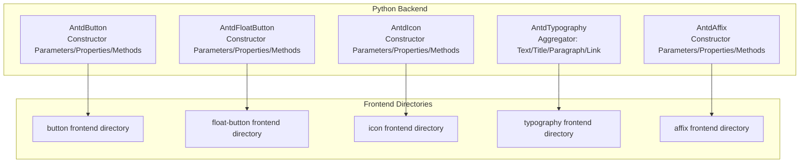
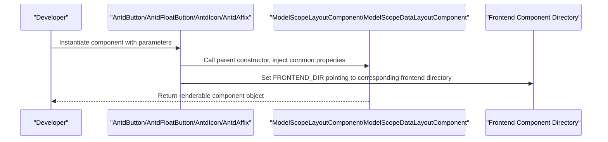
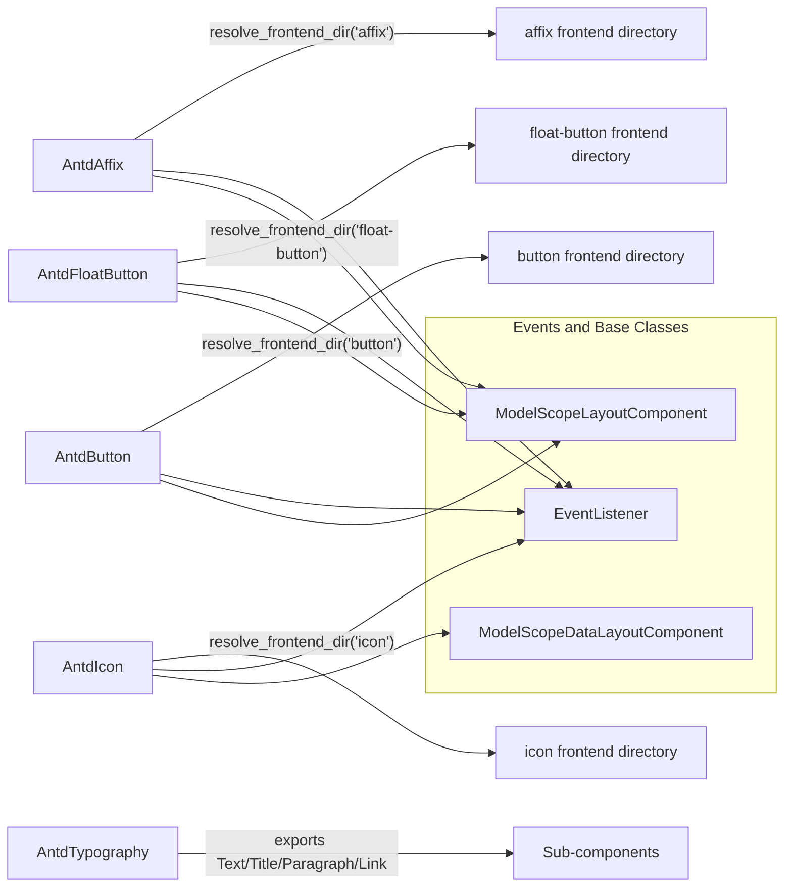

# General Components API

<cite>
**Files Referenced in This Document**
- [button/__init__.py](file://backend/modelscope_studio/components/antd/button/__init__.py)
- [float_button/__init__.py](file://backend/modelscope_studio/components/antd/float_button/__init__.py)
- [icon/__init__.py](file://backend/modelscope_studio/components/antd/icon/__init__.py)
- [typography/__init__.py](file://backend/modelscope_studio/components/antd/typography/__init__.py)
- [affix/__init__.py](file://backend/modelscope_studio/components/antd/affix/__init__.py)
</cite>

## Table of Contents

1. [Introduction](#introduction)
2. [Project Structure](#project-structure)
3. [Core Components](#core-components)
4. [Architecture Overview](#architecture-overview)
5. [Detailed Component Analysis](#detailed-component-analysis)
6. [Dependency Analysis](#dependency-analysis)
7. [Performance Considerations](#performance-considerations)
8. [Troubleshooting Guide](#troubleshooting-guide)
9. [Conclusion](#conclusion)
10. [Appendix](#appendix)

## Introduction

This document is the Python API reference for Antd general components, covering Button, FloatButton, Icon, Typography, and Affix. Contents include:

- Constructor parameters, property definitions, method signatures, and return types for each component class
- Standard instantiation examples (basic usage and advanced configuration)
- Event handling mechanisms, style customization approaches, and responsive behavior
- Parameter validation rules, exception handling strategies, and best practices
- API index organized by function for quick reference

## Project Structure

These components all reside in the backend Python package, wrapped through a unified layout component base class, pointing to corresponding frontend directories for UI rendering.

Diagram sources

- [button/**init**.py:15-157](file://backend/modelscope_studio/components/antd/button/__init__.py#L15-L157)
- [float_button/**init**.py:12-110](file://backend/modelscope_studio/components/antd/float_button/__init__.py#L12-L110)
- [icon/**init**.py:9-88](file://backend/modelscope_studio/components/antd/icon/__init__.py#L9-L88)
- [typography/**init**.py:1-12](file://backend/modelscope_studio/components/antd/typography/__init__.py#L1-L12)
- [affix/**init**.py:10-86](file://backend/modelscope_studio/components/antd/affix/__init__.py#L10-L86)

Section sources

- [button/**init**.py:15-157](file://backend/modelscope_studio/components/antd/button/__init__.py#L15-L157)
- [float_button/**init**.py:12-110](file://backend/modelscope_studio/components/antd/float_button/__init__.py#L12-L110)
- [icon/**init**.py:9-88](file://backend/modelscope_studio/components/antd/icon/__init__.py#L9-L88)
- [typography/**init**.py:1-12](file://backend/modelscope_studio/components/antd/typography/__init__.py#L1-L12)
- [affix/**init**.py:10-86](file://backend/modelscope_studio/components/antd/affix/__init__.py#L10-L86)

## Core Components

This section provides an overview of the five general components' responsibilities and typical use cases:

- **Button**: Triggers actions; supports multiple types, variants, sizes, shapes, and states (disabled, danger, ghost, loading).
- **FloatButton**: Floating global function button; can include description, tooltip, badge, and link.
- **Icon**: Semantic vector icon; supports rotation, spin animation, and dual-tone icon color settings.
- **Typography**: Text typography collection; contains Text, Title, Paragraph, and Link sub-components.
- **Affix**: Fixed position container; used to stick child elements to the top or bottom of the viewport.

Section sources

- [button/**init**.py:15-38](file://backend/modelscope_studio/components/antd/button/__init__.py#L15-L38)
- [float_button/**init**.py:12-21](file://backend/modelscope_studio/components/antd/float_button/__init__.py#L12-L21)
- [icon/**init**.py:9-14](file://backend/modelscope_studio/components/antd/icon/__init__.py#L9-L14)
- [typography/**init**.py:7-12](file://backend/modelscope_studio/components/antd/typography/__init__.py#L7-L12)
- [affix/**init**.py:10-20](file://backend/modelscope_studio/components/antd/affix/__init__.py#L10-L20)

## Architecture Overview

Components follow the "Python wrapper + frontend rendering" pattern, injecting common properties (visibility, DOM ID, class names, inline styles, render toggle, etc.) through the unified layout component base class, and pointing to the corresponding frontend directory via `resolve_frontend_dir`.

Diagram sources

- [button/**init**.py:15-157](file://backend/modelscope_studio/components/antd/button/__init__.py#L15-L157)
- [float_button/**init**.py:12-110](file://backend/modelscope_studio/components/antd/float_button/__init__.py#L12-L110)
- [icon/**init**.py:9-88](file://backend/modelscope_studio/components/antd/icon/__init__.py#L9-L88)
- [affix/**init**.py:10-86](file://backend/modelscope_studio/components/antd/affix/__init__.py#L10-L86)

## Detailed Component Analysis

### Button Component API

- Type and inheritance
  - Class name: `AntdButton`
  - Base class: `ModelScopeLayoutComponent`
  - Nested sub-component: `Group` (button group)
- Events
  - `click`: Click event; binds internal callback to enable event listening
- Slots
  - `icon`, `loading.icon`
- Key properties and meanings
  - `auto_insert_space`: Whether to automatically insert a space between Chinese characters
  - `block`: Whether to span the full width of the parent container
  - `class_names`: Semantic DOM class names
  - `danger`/`disabled`/`ghost`/`loading`: Danger/disabled/ghost/loading states
  - `href`/`html_type`: Link navigation and native HTML type
  - `icon`/`icon_position`: Icon and icon position
  - `shape`/`size`/`type`/`variant`/`color`: Shape, size, type, variant, color
  - `styles`/`root_class_name`: Semantic styles and root class name
  - Other Gradio common properties: `visible`, `elem_id`, `elem_classes`, `elem_style`, `render`
- Methods
  - `preprocess(payload)`: Accepts string or None, returns string or None
  - `postprocess(value)`: Accepts string or None, returns string or None
  - `example_payload`/`example_value`: Example payload and example value
- Instantiation notes
  - Use `type`/`variant`/`color`/`shape`/`size` to control appearance and semantics
  - `loading` can be boolean or dict (if custom loading icon is needed)
  - `href` works with `html_type='button'` or `'submit'`/`'reset'`
- Best practices
  - Use `primary` type for main actions; use `danger` for destructive actions
  - Set `loading` to prevent duplicate submissions
  - For icon buttons, use `icon_position='start'`/`'end'`

Section sources

- [button/**init**.py:15-157](file://backend/modelscope_studio/components/antd/button/__init__.py#L15-L157)

### FloatButton Component API

- Type and inheritance
  - Class name: `AntdFloatButton`
  - Base class: `ModelScopeLayoutComponent`
  - Nested sub-components: `BackTop` (back to top), `Group` (button group)
- Events
  - `click`: Click event; binds internal callback to enable event listening
- Slots
  - `icon`, `description`, `tooltip`, `tooltip.title`, `badge.count`
- Key properties and meanings
  - `icon`/`description`: Icon and description text
  - `tooltip`: Tooltip text or configuration object
  - `type`/`shape`: Type (default/primary), shape (circle/square)
  - `href`/`href_target`/`html_type`: Hyperlink target and native HTML type
  - `badge`: Badge configuration (some state-related properties not supported)
  - `class_names`/`styles`/`root_class_name`: Styles and class names
  - Other Gradio common properties: `visible`, `elem_id`, `elem_classes`, `elem_style`, `render`
- Methods
  - `preprocess(payload)`: Accepts None, returns None
  - `postprocess(value)`: Accepts None, returns None
  - `example_payload`/`example_value`: Example payload and example value
- Instantiation notes
  - Commonly used for global function entry points (e.g., back to top, quick actions)
  - `tooltip` supports strings or objects to extend title, etc.
- Best practices
  - Use `circle` shape to improve discoverability
  - Combine with `BackTop` for "back to top" experience

Section sources

- [float_button/**init**.py:12-110](file://backend/modelscope_studio/components/antd/float_button/__init__.py#L12-L110)

### Icon Component API

- Type and inheritance
  - Class name: `AntdIcon`
  - Base class: `ModelScopeDataLayoutComponent`
  - Nested sub-component: `IconfontProvider` (IconFont provider)
- Events
  - `click`: Click event; binds internal callback to enable event listening
- Slots
  - `component`: Custom root node component
- Key properties and meanings
  - `value`: Default icon name (e.g., `"GithubOutlined"`)
  - `spin`: Whether to apply spin animation
  - `rotate`: Rotation angle (degrees)
  - `two_tone_color`: Primary color for dual-tone icons
  - `component`: Root node component replacement
  - `class_names`/`styles`: Styles and class names
  - Other Gradio common properties: `visible`, `elem_id`, `elem_classes`, `elem_style`, `render`
- Methods
  - `preprocess(payload)`: Accepts string or None, returns string or None
  - `postprocess(value)`: Accepts string or None, returns string or None
  - `example_payload`/`example_value`: Example payload and example value
- Instantiation notes
  - When used as decorative elements, prefer semantic icon names
  - `spin` and `rotate` can be used in combination
- Best practices
  - Use in buttons or navigation with `icon_position`
  - Explicitly specify the primary color for dual-tone icon scenarios

Section sources

- [icon/**init**.py:9-88](file://backend/modelscope_studio/components/antd/icon/__init__.py#L9-L88)

### Typography Component API

- Type and inheritance
  - Class name: `AntdTypography`
  - Aggregator: Contains four sub-components: `Text`, `Title`, `Paragraph`, `Link`
- Notes
  - This aggregator class only exports sub-components; specific sub-component definitions are in their respective modules
- Instantiation notes
  - Access sub-components via `AntdTypography.Text`/`Title`/`Paragraph`/`Link`
- Best practices
  - Use `Title` for documents and page headings
  - Use `Paragraph` for body text
  - Use `Link` for clickable links

Section sources

- [typography/**init**.py:1-12](file://backend/modelscope_studio/components/antd/typography/__init__.py#L1-L12)

### Affix Component API

- Type and inheritance
  - Class name: `AntdAffix`
  - Base class: `ModelScopeLayoutComponent`
- Events
  - `change`: State change event (attached/detached); binds internal callback to enable event listening
- Key properties and meanings
  - `offset_bottom`: Offset from the bottom of the viewport (pixels)
  - `offset_top`: Offset from the top of the viewport (pixels)
  - `get_target`: Specifies the scroll area DOM node selector
  - `class_names`/`styles`/`root_class_name`: Styles and class names
  - Other Gradio common properties: `visible`, `elem_id`, `elem_classes`, `elem_style`, `render`
- Methods
  - `preprocess(payload)`: Accepts None, returns None
  - `postprocess(value)`: Accepts None, returns None
  - `example_payload`/`example_value`: Example payload and example value
- Instantiation notes
  - Be careful not to block other page content, especially on small-screen devices
  - `get_target` can restrict the scroll container to avoid global scroll interference
- Best practices
  - Use for menus, toolbars, and other elements that need to remain in the visible area
  - Combine with interaction feedback (e.g., `change` event) to update state

Section sources

- [affix/**init**.py:10-86](file://backend/modelscope_studio/components/antd/affix/__init__.py#L10-L86)

## Dependency Analysis

- Common dependencies
  - Base class: `ModelScopeLayoutComponent` or `ModelScopeDataLayoutComponent`
  - Event system: `gradio.events.EventListener`
  - Frontend directory resolution: `resolve_frontend_dir`
- Inter-component relationships
  - Button: Contains `ButtonGroup`
  - FloatButton: Contains `BackTop` and `FloatButtonGroup`
  - Icon: Contains `IconfontProvider`
  - Typography: Aggregates `Text`/`Title`/`Paragraph`/`Link`
- Dependency visualization

Diagram sources

- [button/**init**.py:15-157](file://backend/modelscope_studio/components/antd/button/__init__.py#L15-L157)
- [float_button/**init**.py:12-110](file://backend/modelscope_studio/components/antd/float_button/__init__.py#L12-L110)
- [icon/**init**.py:9-88](file://backend/modelscope_studio/components/antd/icon/__init__.py#L9-L88)
- [typography/**init**.py:1-12](file://backend/modelscope_studio/components/antd/typography/__init__.py#L1-L12)
- [affix/**init**.py:10-86](file://backend/modelscope_studio/components/antd/affix/__init__.py#L10-L86)

## Performance Considerations

- Rendering and events
  - Control rendering timing and visibility via Gradio common properties to reduce unnecessary redraws
  - Enable event binding only when needed (e.g., `click`/`change`) to avoid excessive monitoring
- Icons and loading
  - Use `spin`/`rotate` judiciously to avoid extra overhead on low-end devices
  - Button's `loading` state prevents duplicate submissions, indirectly reducing server load
- Containers and scrolling
  - Affix's `get_target` should be as precise as possible to avoid frequent calculations on large scroll containers
- Recommendations
  - Use heavy components (e.g., Tooltip/Popover) sparingly in large lists; use lazy loading if necessary
  - Maintain consistency when using appearance properties like `shape`/`size`/`type` to reduce style switching costs

## Troubleshooting Guide

- Events not triggering
  - Confirm `EVENTS` is correctly configured and components are in an interactive state (not `disabled`/`loading`)
  - For FloatButton/Affix, check that `click`/`change` events are bound
- Styles not taking effect
  - Check whether `class_names`/`styles` conflicts with theme variables
  - Confirm `root_class_name` is not overridden by external styles
- Icon display anomalies
  - Confirm `value` is a supported icon name
  - If using a custom `component`, ensure the component is renderable and has no circular dependencies
- Floating button blocking content
  - Adjust `offset_top`/`offset_bottom` or use `get_target` to precisely control the scroll area
- Loading state not working
  - When Button's `loading` is boolean or dict, confirm the parameter format is correct

Section sources

- [button/**init**.py:41-46](file://backend/modelscope_studio/components/antd/button/__init__.py#L41-L46)
- [float_button/**init**.py:24-29](file://backend/modelscope_studio/components/antd/float_button/__init__.py#L24-L29)
- [affix/**init**.py:21-26](file://backend/modelscope_studio/components/antd/affix/__init__.py#L21-L26)

## Conclusion

The above covers the Python API reference and best practice summary for Antd general components. Through a unified base class and event system, these components provide rich appearance and interaction capabilities while remaining simple and easy to use. It is recommended to choose component types and configuration options appropriate for the business scenario in real projects, paying attention to performance and maintainability.

## Appendix

- API index by category
  - Button components: `AntdButton` (with `Group`), `AntdFloatButton` (with `BackTop`/`Group`)
  - Icon components: `AntdIcon` (with `IconfontProvider`)
  - Text typography: `AntdTypography` (`Text`/`Title`/`Paragraph`/`Link`)
  - Positioning containers: `AntdAffix`
- Quick parameter reference
  - Appearance: `type`, `variant`, `color`, `shape`, `size`
  - State: `disabled`, `danger`, `ghost`, `loading`
  - Behavior: `href`, `html_type`, `icon`, `icon_position`, `tooltip`, `badge`
  - Style: `class_names`, `styles`, `root_class_name`
  - Events: `click`, `change`
- Example path guide (no code content)
  - Button basic usage and loading state: [button/**init**.py:88-108](file://backend/modelscope_studio/components/antd/button/__init__.py#L88-L108)
  - FloatButton floating entry with back-to-top combination: [float_button/**init**.py:59-70](file://backend/modelscope_studio/components/antd/float_button/__init__.py#L59-L70)
  - Icon animation and dual-tone: [icon/**init**.py:47-53](file://backend/modelscope_studio/components/antd/icon/__init__.py#L47-L53)
  - Affix positioning and scroll area: [affix/**init**.py:47-52](file://backend/modelscope_studio/components/antd/affix/__init__.py#L47-L52)
