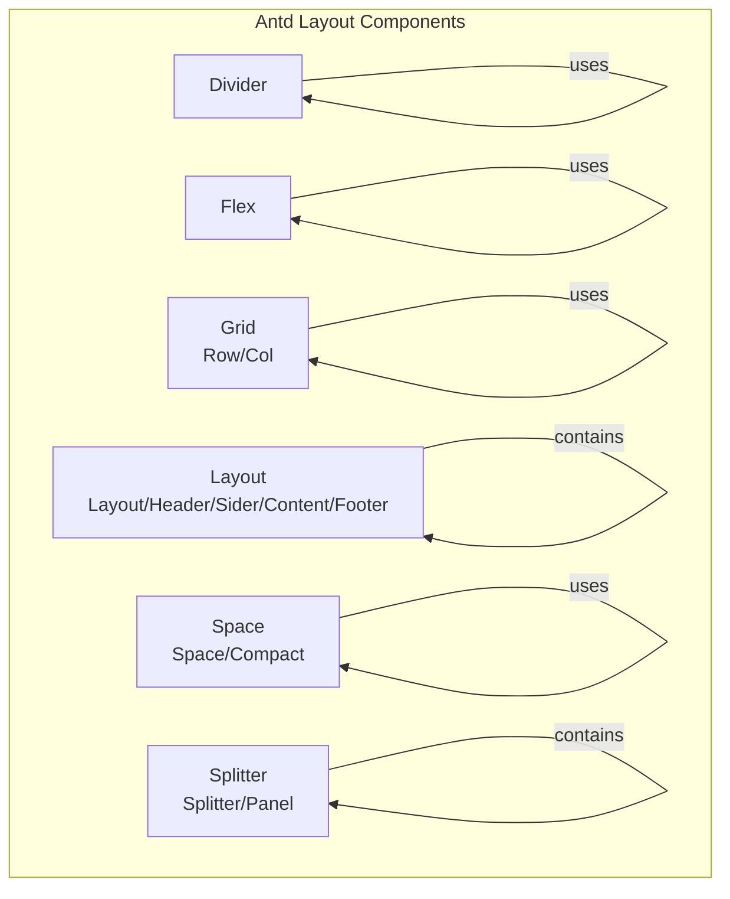
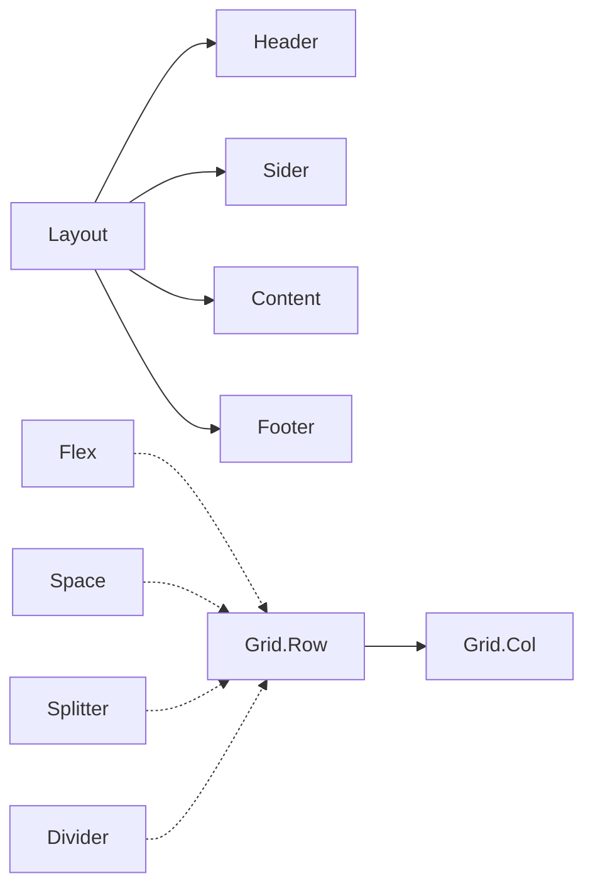

# Layout Components API

<cite>
**Files Referenced in This Document**
- [divider/__init__.py](file://backend/modelscope_studio/components/antd/divider/__init__.py)
- [flex/__init__.py](file://backend/modelscope_studio/components/antd/flex/__init__.py)
- [grid/row/__init__.py](file://backend/modelscope_studio/components/antd/grid/row/__init__.py)
- [grid/col/__init__.py](file://backend/modelscope_studio/components/antd/grid/col/__init__.py)
- [layout/__init__.py](file://backend/modelscope_studio/components/antd/layout/__init__.py)
- [layout/content/__init__.py](file://backend/modelscope_studio/components/antd/layout/content/__init__.py)
- [layout/footer/__init__.py](file://backend/modelscope_studio/components/antd/layout/footer/__init__.py)
- [layout/header/__init__.py](file://backend/modelscope_studio/components/antd/layout/header/__init__.py)
- [layout/sider/__init__.py](file://backend/modelscope_studio/components/antd/layout/sider/__init__.py)
- [space/__init__.py](file://backend/modelscope_studio/components/antd/space/__init__.py)
- [space/compact/__init__.py](file://backend/modelscope_studio/components/antd/space/compact/__init__.py)
- [splitter/__init__.py](file://backend/modelscope_studio/components/antd/splitter/__init__.py)
- [splitter/panel/__init__.py](file://backend/modelscope_studio/components/antd/splitter/panel/__init__.py)
</cite>

## Table of Contents

1. [Introduction](#introduction)
2. [Project Structure](#project-structure)
3. [Core Components](#core-components)
4. [Architecture Overview](#architecture-overview)
5. [Detailed Component Analysis](#detailed-component-analysis)
6. [Dependency Analysis](#dependency-analysis)
7. [Performance Considerations](#performance-considerations)
8. [Troubleshooting Guide](#troubleshooting-guide)
9. [Conclusion](#conclusion)
10. [Appendix](#appendix)

## Introduction

This document is the Python API reference for Antd layout components, covering Divider, Flex, Grid (Row/Col), Layout (Layout/Header/Sider/Content/Footer), Space, and Splitter (Splitter/Panel). Contents include:

- Constructor parameters, property definitions, method signatures, and return types for each component class
- Standard layout combination usage examples (responsive layout, grid system, flex layout)
- Nesting rules, spacing control, and alignment
- Layout breakpoint configuration, media query integration, and mobile adaptation
- Component collaboration patterns and performance optimization recommendations

## Project Structure

These layout components all reside in the backend Python package, using a unified base class and frontend directory resolution mechanism, allowing them to map to the corresponding frontend implementations at runtime.

**Diagram sources**

- [divider/**init**.py:1-95](file://backend/modelscope_studio/components/antd/divider/__init__.py#L1-L95)
- [flex/**init**.py:1-98](file://backend/modelscope_studio/components/antd/flex/__init__.py#L1-L98)
- [grid/row/**init**.py:1-94](file://backend/modelscope_studio/components/antd/grid/row/__init__.py#L1-L94)
- [grid/col/**init**.py:1-114](file://backend/modelscope_studio/components/antd/grid/col/__init__.py#L1-L114)
- [layout/**init**.py:1-91](file://backend/modelscope_studio/components/antd/layout/__init__.py#L1-L91)
- [layout/content/**init**.py:1-75](file://backend/modelscope_studio/components/antd/layout/content/__init__.py#L1-L75)
- [layout/footer/**init**.py:1-75](file://backend/modelscope_studio/components/antd/layout/footer/__init__.py#L1-L75)
- [layout/header/**init**.py:1-75](file://backend/modelscope_studio/components/antd/layout/header/__init__.py#L1-L75)
- [layout/sider/**init**.py:1-128](file://backend/modelscope_studio/components/antd/layout/sider/__init__.py#L1-L128)
- [space/**init**.py:1-104](file://backend/modelscope_studio/components/antd/space/__init__.py#L1-L104)
- [space/compact/**init**.py:1-81](file://backend/modelscope_studio/components/antd/space/compact/__init__.py#L1-L81)
- [splitter/**init**.py:1-97](file://backend/modelscope_studio/components/antd/splitter/__init__.py#L1-L97)
- [splitter/panel/**init**.py:1-86](file://backend/modelscope_studio/components/antd/splitter/panel/__init__.py#L1-L86)

**Section sources**

- [divider/**init**.py:1-95](file://backend/modelscope_studio/components/antd/divider/__init__.py#L1-L95)
- [flex/**init**.py:1-98](file://backend/modelscope_studio/components/antd/flex/__init__.py#L1-L98)
- [grid/row/**init**.py:1-94](file://backend/modelscope_studio/components/antd/grid/row/__init__.py#L1-L94)
- [grid/col/**init**.py:1-114](file://backend/modelscope_studio/components/antd/grid/col/__init__.py#L1-L114)
- [layout/**init**.py:1-91](file://backend/modelscope_studio/components/antd/layout/__init__.py#L1-L91)
- [space/**init**.py:1-104](file://backend/modelscope_studio/components/antd/space/__init__.py#L1-L104)
- [splitter/**init**.py:1-97](file://backend/modelscope_studio/components/antd/splitter/__init__.py#L1-L97)

## Core Components

- **Divider**: A dividing line for separating content areas; supports horizontal/vertical, title position, dashed/solid style, plain text style, etc.
- **Flex**: A flex layout container; supports main-axis/cross-axis alignment, wrapping, spacing, direction, etc.
- **Grid**: Grid system; Row provides row-level alignment, spacing, and wrapping; Col provides column span, offset, order, responsive breakpoints, etc.
- **Layout**: Overall page layout; contains Header, Sider, Content, Footer sub-components; supports responsive collapse and breakpoint events.
- **Space**: Sets spacing between child elements; supports direction, alignment, auto-wrap, separator; `Space.Compact` is used for compact form arrangements.
- **Splitter**: Draggable split panel; supports horizontal/vertical layout, panel size range, collapse, and drag events.

**Section sources**

- [divider/**init**.py:8-95](file://backend/modelscope_studio/components/antd/divider/__init__.py#L8-L95)
- [flex/**init**.py:8-98](file://backend/modelscope_studio/components/antd/flex/__init__.py#L8-L98)
- [grid/row/**init**.py:8-94](file://backend/modelscope_studio/components/antd/grid/row/__init__.py#L8-L94)
- [grid/col/**init**.py:8-114](file://backend/modelscope_studio/components/antd/grid/col/__init__.py#L8-L114)
- [layout/**init**.py:14-91](file://backend/modelscope_studio/components/antd/layout/__init__.py#L14-L91)
- [space/**init**.py:9-104](file://backend/modelscope_studio/components/antd/space/__init__.py#L9-L104)
- [splitter/**init**.py:11-97](file://backend/modelscope_studio/components/antd/splitter/__init__.py#L11-L97)

## Architecture Overview

The following class diagram shows the inheritance and composition relationships of layout components, as well as key properties and methods.

```mermaid
classDiagram
class AntdDivider {
+__init__(value, dashed, variant, orientation, orientation_margin, plain, type, size, ...)
+preprocess(payload)
+postprocess(value)
+example_payload()
+example_value()
}
class AntdFlex {
+__init__(orientation, vertical, wrap, justify, align, flex, gap, component, ...)
+preprocess(payload)
+postprocess(value)
+example_payload()
+example_value()
}
class AntdRow {
+__init__(align, gutter, justify, wrap, ...)
}
class AntdCol {
+__init__(flex, offset, order, pull, push, span, xs, sm, md, lg, xl, xxl, ...)
}
class AntdLayout {
+__init__(has_sider, ...)
+Content
+Footer
+Header
+Sider
}
class AntdLayoutContent
class AntdLayoutFooter
class AntdLayoutHeader
class AntdLayoutSider {
+__init__(breakpoint, collapsed, collapsed_width, collapsible, default_collapsed, reverse_arrow, theme_value, trigger, width, ...)
}
class AntdSpace {
+__init__(align, direction/orientation, size, split/separator, wrap, ...)
+Compact
}
class AntdSpaceCompact {
+__init__(block, direction, size, ...)
}
class AntdSplitter {
+__init__(layout/orientation, lazy, ...)
+Panel
}
class AntdSplitterPanel {
+__init__(default_size, min, max, size, collapsible, resizable, ...)
}
AntdLayout --> AntdLayoutContent : "contains"
AntdLayout --> AntdLayoutFooter : "contains"
AntdLayout --> AntdLayoutHeader : "contains"
AntdLayout --> AntdLayoutSider : "contains"
AntdSpace --> AntdSpaceCompact : "contains"
AntdSplitter --> AntdSplitterPanel : "contains"
```

**Diagram sources**

- [divider/**init**.py:8-95](file://backend/modelscope_studio/components/antd/divider/__init__.py#L8-L95)
- [flex/**init**.py:8-98](file://backend/modelscope_studio/components/antd/flex/__init__.py#L8-L98)
- [grid/row/**init**.py:8-94](file://backend/modelscope_studio/components/antd/grid/row/__init__.py#L8-L94)
- [grid/col/**init**.py:8-114](file://backend/modelscope_studio/components/antd/grid/col/__init__.py#L8-L114)
- [layout/**init**.py:14-91](file://backend/modelscope_studio/components/antd/layout/__init__.py#L14-L91)
- [layout/sider/**init**.py:11-128](file://backend/modelscope_studio/components/antd/layout/sider/__init__.py#L11-L128)
- [space/**init**.py:9-104](file://backend/modelscope_studio/components/antd/space/__init__.py#L9-L104)
- [splitter/**init**.py:11-97](file://backend/modelscope_studio/components/antd/splitter/__init__.py#L11-L97)
- [splitter/panel/**init**.py:8-86](file://backend/modelscope_studio/components/antd/splitter/panel/__init__.py#L8-L86)

## Detailed Component Analysis

### Divider

- Constructor parameters
  - `value`: Optional string as the title text inside the divider
  - `dashed`: Optional boolean, whether to use dashed line
  - `variant`: Enum value, `'dashed'` | `'dotted'` | `'solid'`
  - `orientation`: Enum value, `'left'` | `'right'` | `'center'` | `'start'` | `'end'`
  - `orientation_margin`: Optional string or number, margin between title and boundary
  - `plain`: Optional boolean, plain text style
  - `type`: Enum value, `'horizontal'` | `'vertical'`
  - `size`: Optional enum value, `'small'` | `'middle'` | `'large'` (only valid for horizontal)
  - Other common properties: `root_class_name`, `class_names`, `styles`, `as_item`, `elem_id`, `elem_classes`, `elem_style`, `visible`, `render`, etc.
- Methods
  - `preprocess(payload)`: Accepts string or None, returns string or None
  - `postprocess(value)`: Accepts string or None, returns string or None
  - `example_payload`/`example_value`: Returns None
- Use cases
  - Separating article paragraphs, table action columns, etc.

**Section sources**

- [divider/**init**.py:21-95](file://backend/modelscope_studio/components/antd/divider/__init__.py#L21-L95)

### Flex (Flex Layout)

- Constructor parameters
  - `orientation`: Enum value, `'horizontal'` | `'vertical'`
  - `vertical`: Boolean, vertical direction (equivalent to `flex-direction: column`)
  - `wrap`: Enum value or boolean, `'nowrap'` | `'wrap'` | `'wrap-reverse'` or boolean
  - `justify`: Main-axis alignment (various values)
  - `align`: Cross-axis alignment (various values)
  - `flex`: Flex shorthand property
  - `gap`: Spacing size, supports enum or number
  - `component`: Custom element type
  - Other common properties as above
- Methods
  - `preprocess`/`postprocess`: Accepts/returns None
  - `example_payload`/`example_value`: Returns None
- Use cases
  - Setting element spacing and alignment as a replacement for traditional CSS flex layout

**Section sources**

- [flex/**init**.py:21-98](file://backend/modelscope_studio/components/antd/flex/__init__.py#L21-L98)

### Grid (Grid System)

- Row
  - Constructor parameters
    - `align`: Vertical alignment, `'top'` | `'middle'` | `'bottom'` | `'stretch'` or object
    - `gutter`: Grid spacing, supports number, string, object, or array
    - `justify`: Horizontal arrangement, various values
    - `wrap`: Boolean, auto wrap
    - Other common properties as above
  - Methods
    - `preprocess`/`postprocess`: Accepts/returns None
    - `example_payload`/`example_value`: Returns None
- Col
  - Constructor parameters
    - `flex`: Flex layout style
    - `offset`: Number of grid columns to offset to the right
    - `order`: Sort order
    - `pull`/`push`: Move left/right
    - `span`: Number of grid columns to occupy (0 corresponds to `display: none`)
    - `xs`/`sm`/`md`/`lg`/`xl`/`xxl`: Span at different breakpoints or objects containing the above properties
    - Other common properties as above
  - Methods
    - `preprocess`/`postprocess`: Accepts/returns None
    - `example_payload`/`example_value`: Returns None
- Use cases
  - Responsive layout based on 24-column grid; supports horizontal/vertical alignment, spacing, and breakpoints

**Section sources**

- [grid/row/**init**.py:30-94](file://backend/modelscope_studio/components/antd/grid/row/__init__.py#L30-L94)
- [grid/col/**init**.py:30-114](file://backend/modelscope_studio/components/antd/grid/col/__init__.py#L30-L114)

### Layout (Page Layout)

- Layout
  - Nested sub-components: `Content`, `Footer`, `Header`, `Sider`
  - Constructor parameters
    - `has_sider`: Whether to include a sidebar (avoids SSR flickering)
    - Other common properties as above
  - Methods
    - `preprocess`/`postprocess`: Accepts/returns None
    - `example_payload`/`example_value`: Returns None
- Header/Footer/Content
  - Constructor parameters: `class_names`, `styles`, `additional_props`, `root_class_name`, `elem_id`, `elem_classes`, `elem_style`, `visible`, `render`, etc.
  - Methods: Same as above
- Sider
  - Constructor parameters
    - `breakpoint`: Responsive breakpoint
    - `collapsed`/`collapsible`/`default_collapsed`: Collapse state related
    - `collapsed_width`: Width when collapsed
    - `reverse_arrow`: Reverse arrow direction (expands to the right)
    - `theme_value`: Theme (light/dark); use when conflicting with Gradio preset attribute
    - `trigger`: Custom trigger
    - `width`: Width
    - `zero_width_trigger_style`: Special trigger style when `collapsed_width` is 0
    - Other common properties as above
  - Methods: Same as above
- Events
  - Layout/Sider/Header/Footer/Content: Support `click` event binding
  - Sider: Supports `collapse`, `breakpoint` events
- Use cases
  - Overall page layout; combined with Sider for sidebar navigation and responsive collapse

**Section sources**

- [layout/**init**.py:14-91](file://backend/modelscope_studio/components/antd/layout/__init__.py#L14-L91)
- [layout/content/**init**.py:10-75](file://backend/modelscope_studio/components/antd/layout/content/__init__.py#L10-L75)
- [layout/footer/**init**.py:10-75](file://backend/modelscope_studio/components/antd/layout/footer/__init__.py#L10-L75)
- [layout/header/**init**.py:10-75](file://backend/modelscope_studio/components/antd/layout/header/__init__.py#L10-L75)
- [layout/sider/**init**.py:11-128](file://backend/modelscope_studio/components/antd/layout/sider/__init__.py#L11-L128)

### Space

- Space
  - Nested sub-component: `Compact`
  - Constructor parameters
    - `align`: Child item alignment
    - `direction`/`orientation`: Direction (`orientation` is v6 alias)
    - `size`: Spacing size, supports enum, number, or array
    - `split`/`separator`: Separator (`separator` is v6 alias)
    - `wrap`: Auto wrap when horizontal
    - Other common properties as above
  - Methods
    - `preprocess`/`postprocess`: Accepts/returns None
    - `example_payload`/`example_value`: Returns None
- Space.Compact
  - Constructor parameters
    - `block`: Whether to fill parent width
    - `direction`: Direction
    - `size`: Child component size
    - Other common properties as above
  - Methods: Same as above
- Use cases
  - Equal spacing arrangement of multiple inline elements; use `Compact` for compact form connections

**Section sources**

- [space/**init**.py:9-104](file://backend/modelscope_studio/components/antd/space/__init__.py#L9-L104)
- [space/compact/**init**.py:8-81](file://backend/modelscope_studio/components/antd/space/compact/__init__.py#L8-L81)

### Splitter (Split Panel)

- Splitter
  - Nested sub-component: `Panel`
  - Constructor parameters
    - `layout`/`orientation`: Layout direction (`orientation` is v6 alias)
    - `lazy`: Whether to use lazy rendering
    - Other common properties as above
  - Events
    - `resize_start`, `resize`, `resize_end`, `collapse`
  - Methods
    - `preprocess`/`postprocess`: Accepts/returns None
    - `example_payload`/`example_value`: Returns None
- Splitter.Panel
  - Constructor parameters
    - `default_size`/`min`/`max`/`size`: Initial/minimum/maximum/controlled size (supports px or percentage)
    - `collapsible`: Quick collapse
    - `resizable`: Whether to enable drag-and-drop
    - Other common properties as above
  - Methods: Same as above
- Use cases
  - Divides the page into multiple draggable and resizable areas; supports collapse and range restrictions

**Section sources**

- [splitter/**init**.py:11-97](file://backend/modelscope_studio/components/antd/splitter/__init__.py#L11-L97)
- [splitter/panel/**init**.py:8-86](file://backend/modelscope_studio/components/antd/splitter/panel/__init__.py#L8-L86)

## Dependency Analysis

- Common component characteristics
  - All inherit from the unified layout component base class, with the same preprocessing/postprocessing interface and common properties (e.g., `visible`, `elem_id`, `elem_classes`, `elem_style`, `render`, etc.)
  - Locate corresponding frontend component implementations via the frontend directory resolution function
- Inter-component coupling
  - Layout acts as the root container, internally composing Header/Sider/Content/Footer
  - Space and Flex are semantically complementary: Space focuses on "spacing", Flex focuses on "layout"
  - Grid's Row/Col can be combined with Flex/Splitter to achieve complex layouts
  - Splitter can work with Space/Divider to implement panel separation and spacing control

**Diagram sources**

- [layout/**init**.py:28-31](file://backend/modelscope_studio/components/antd/layout/__init__.py#L28-L31)
- [grid/row/**init**.py:1-94](file://backend/modelscope_studio/components/antd/grid/row/__init__.py#L1-L94)
- [grid/col/**init**.py:1-114](file://backend/modelscope_studio/components/antd/grid/col/__init__.py#L1-L114)
- [flex/**init**.py:1-98](file://backend/modelscope_studio/components/antd/flex/__init__.py#L1-L98)
- [space/**init**.py:1-104](file://backend/modelscope_studio/components/antd/space/__init__.py#L1-L104)
- [splitter/**init**.py:1-97](file://backend/modelscope_studio/components/antd/splitter/__init__.py#L1-L97)
- [divider/**init**.py:1-95](file://backend/modelscope_studio/components/antd/divider/__init__.py#L1-L95)

## Performance Considerations

- Use lazy loading and deferred rendering appropriately: Splitter supports `lazy` to avoid unnecessary panel initialization
- Control the number of event bindings: Layout/Sider event callbacks should be enabled on demand to reduce unnecessary DOM updates
- Choose between grid and flex layout: Use Space for spacing between many inline elements, Flex for block-level layouts; avoid redundant wrapping
- Responsive breakpoints: Configure Grid's `xs`/`sm`/`md`/`lg`/`xl`/`xxl` based on actual device distribution; avoid excessive granularity causing computation overhead
- SSR optimization: Layout's `has_sider` can avoid flickering during server-side rendering

## Troubleshooting Guide

- Theme conflict hint: Sider's `theme` conflicts with Gradio preset attributes; use `theme_value` instead
- Events not working: Confirm event listeners are correctly bound (e.g., `click`, `collapse`, `breakpoint`) and the corresponding callbacks are enabled on the frontend side
- Grid overflow: When the sum of Col `span` values in a Row exceeds 24, they will wrap; check breakpoint configuration and layout logic
- Split panel anomalies: Ensure panel size units are consistent (px or percentage) and set reasonable `min`/`max` values

**Section sources**

- [layout/sider/**init**.py:101-104](file://backend/modelscope_studio/components/antd/layout/sider/__init__.py#L101-L104)

## Conclusion

This reference document covers the Python API for Antd layout components, clearly defining constructor parameters, methods, and typical usage for each component, while providing combination usage recommendations and performance optimization strategies. Through the collaboration of Layout, Grid, Flex, Space, Splitter, and Divider, a diverse range of layouts can be built from basic grids to complex interactive designs.

## Appendix

### Common Layout Combination Examples (Conceptual)

- Responsive layout
  - Use Layout + Sider with collapse/expand at different breakpoints; Sider supports `breakpoint` and `collapse` events
  - Grid's `xs`/`sm`/`md`/`lg`/`xl`/`xxl` breakpoint configuration for multi-device adaptation
- Grid system
  - Row provides `gutter`, `justify`, `align`, `wrap`; Col provides `span`, `offset`, `order`, `pull`/`push`, responsive breakpoints
- Flex layout
  - Flex provides `orientation`/`vertical`, `wrap`, `justify`, `align`, `gap`, `flex`, etc.; suitable for flexible alignment and spacing control
- Spacing and separation
  - Space for inline element spacing; `Space.Compact` for compact form arrangements; Divider for content separation

### Breakpoints and Media Queries

- Breakpoint constants: `xs` (<576px), `sm` (≥576px), `md` (≥768px), `lg` (≥992px), `xl` (≥1200px), `xxl` (≥1600px)
- Media query integration: Map to layout behavior at different screen sizes via Grid's `xs`/`sm`/`md`/`lg`/`xl`/`xxl` parameters

### Nesting Rules and Best Practices

- Layout must contain some sub-components from Header/Sider/Content/Footer, and sub-components must be placed inside Layout
- Grid's Col must be placed directly inside Row, and content elements placed inside Col
- Flex adds no extra wrapper, suitable for block-level layouts; Space adds a wrapper around each child element for inline alignment
- Splitter Panels are resized by dragging; it is recommended to set `min`/`max` and `collapsible` to improve usability
