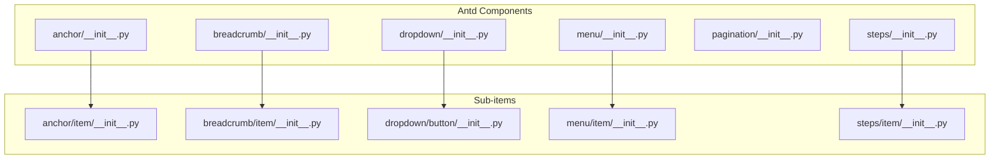
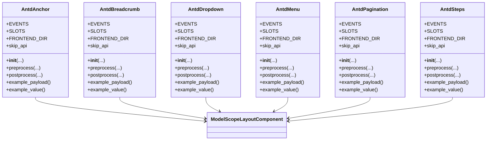
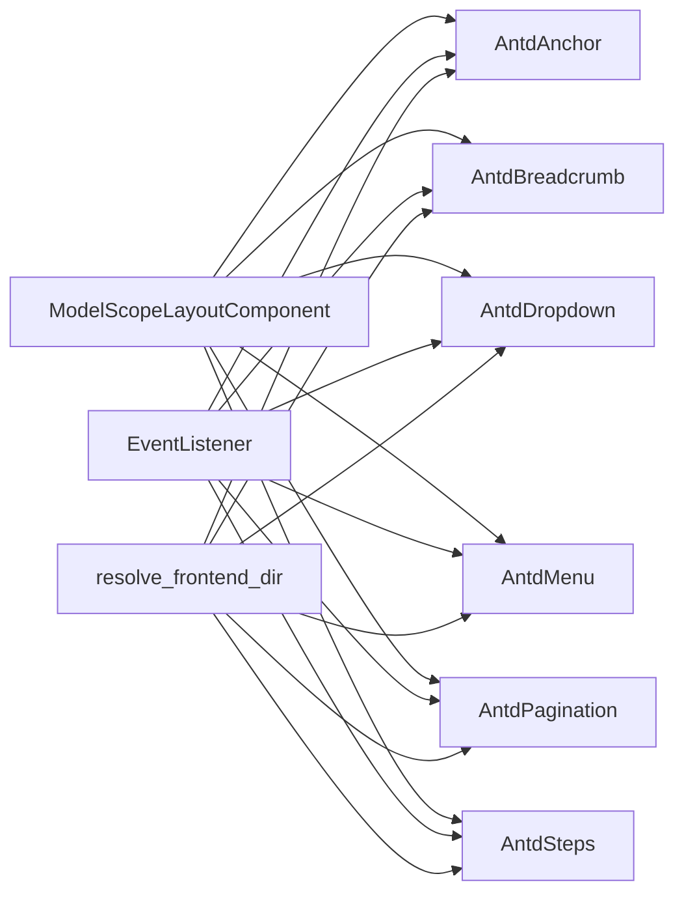

# Navigation Components API

<cite>
**Files Referenced in This Document**
- [anchor/__init__.py](file://backend/modelscope_studio/components/antd/anchor/__init__.py)
- [anchor/item/__init__.py](file://backend/modelscope_studio/components/antd/anchor/item/__init__.py)
- [breadcrumb/__init__.py](file://backend/modelscope_studio/components/antd/breadcrumb/__init__.py)
- [breadcrumb/item/__init__.py](file://backend/modelscope_studio/components/antd/breadcrumb/item/__init__.py)
- [dropdown/__init__.py](file://backend/modelscope_studio/components/antd/dropdown/__init__.py)
- [dropdown/button/__init__.py](file://backend/modelscope_studio/components/antd/dropdown/button/__init__.py)
- [menu/__init__.py](file://backend/modelscope_studio/components/antd/menu/__init__.py)
- [menu/item/__init__.py](file://backend/modelscope_studio/components/antd/menu/item/__init__.py)
- [pagination/__init__.py](file://backend/modelscope_studio/components/antd/pagination/__init__.py)
- [steps/__init__.py](file://backend/modelscope_studio/components/antd/steps/__init__.py)
- [steps/item/__init__.py](file://backend/modelscope_studio/components/antd/steps/item/__init__.py)
</cite>

## Update Summary

**Changes**

- Updated Menu component API documentation with new `popupRender` slot feature description
- Added detailed description of the `popup_render` parameter for the Menu component
- Compared the difference in `popupRender` functionality between Menu and Dropdown components

## Table of Contents

1. [Introduction](#introduction)
2. [Project Structure](#project-structure)
3. [Core Components](#core-components)
4. [Architecture Overview](#architecture-overview)
5. [Detailed Component Analysis](#detailed-component-analysis)
6. [Dependency Analysis](#dependency-analysis)
7. [Performance Considerations](#performance-considerations)
8. [Troubleshooting Guide](#troubleshooting-guide)
9. [Conclusion](#conclusion)
10. [Appendix](#appendix)

## Introduction

This document is the Python API reference and usage guide for Ant Design navigation-related components, covering the following components:

- Anchor
- Breadcrumb
- Dropdown
- Menu
- Pagination
- Steps

Contents include: constructor parameters for component and sub-item classes, event listening, slots, state management key points, routing/frontend interaction patterns, accessibility and keyboard navigation recommendations, as well as performance optimization and best practices.

## Project Structure

Navigation components reside in the backend Python package, organized in a "component-level directory + sub-item directory" pattern for easy extension and maintenance. Each component class is responsible for rendering and event binding; sub-item classes carry specific item data structures.

**Section sources**

- [anchor/**init**.py:1-117](file://backend/modelscope_studio/components/antd/anchor/__init__.py#L1-L117)
- [breadcrumb/**init**.py:1-73](file://backend/modelscope_studio/components/antd/breadcrumb/__init__.py#L1-L73)
- [dropdown/**init**.py:1-119](file://backend/modelscope_studio/components/antd/dropdown/__init__.py#L1-L119)
- [menu/**init**.py:1-125](file://backend/modelscope_studio/components/antd/menu/__init__.py#L1-L125)
- [pagination/**init**.py:1-107](file://backend/modelscope_studio/components/antd/pagination/__init__.py#L1-L107)
- [steps/**init**.py:1-95](file://backend/modelscope_studio/components/antd/steps/__init__.py#L1-L95)

## Core Components

This section provides an overview of the responsibilities, typical usage, and key parameters of each navigation component.

- **Anchor**
  - Responsibility: Provides anchor jumps within a single page; supports fixed mode and direction settings.
  - Key parameters: `affix`, `bounds`, `get_container`, `offset_top`, `direction`, `replace`, `items`, etc.
  - Events: `change`, `click`, `affix_change`.
  - Slots: `items`.
  - Use cases: Long document table of contents, section positioning.

- **Breadcrumb**
  - Responsibility: Displays the current page's position in the hierarchy.
  - Key parameters: `item_render`, `params`, `items`, `separator`.
  - Slots: `separator`, `itemRender`, `items`, `dropdownIcon`.
  - Use cases: Page path navigation, hierarchical browsing.

- **Dropdown**
  - Responsibility: Pop-up menu triggered by click/hover.
  - Key parameters: `arrow`, `auto_adjust_overflow`, `disabled`, `placement`, `trigger`, `menu`, `open`, etc.
  - Events: `open_change`, `menu_click`, `menu_select`, `menu_deselect`, `menu_open_change`.
  - Slots: `menu.expandIcon`, `menu.overflowedIndicator`, `menu.items`, `dropdownRender`, `popupRender`.
  - Use cases: Action entry points, feature set expansion.

- **Menu**
  - Responsibility: Vertical/horizontal/inline navigation menu.
  - Key parameters: `open_keys`, `selected_keys`, `mode`, `theme`/`theme_value`, `inline_indent`, `items`, `multiple`, `trigger_sub_menu_action`, `popup_render`, etc.
  - Events: `click`, `deselect`, `open_change`, `select`.
  - Slots: `expandIcon`, `overflowedIndicator`, `items`, `popupRender`.
  - Use cases: Site main navigation, sidebar navigation.

- **Pagination**
  - Responsibility: Page display and navigation for large datasets.
  - Key parameters: `current`, `default_current`, `page_size`, `default_page_size`, `total`, `pageSizeOptions`, `showQuickJumper`, `showSizeChanger`, `simple`, `size`, etc.
  - Events: `change`, `show_size_change`.
  - Slots: `showQuickJumper.goButton`, `itemRender`.
  - Use cases: List/table pagination.

- **Steps**
  - Responsibility: Guides users through multi-step processes.
  - Key parameters: `current`, `direction`, `label_placement`, `title_placement`, `percent`, `progress_dot`, `size`, `status`, `type`, `items`.
  - Events: `change`.
  - Slots: `progressDot`, `items`.
  - Use cases: Wizards, multi-step form submissions.

**Section sources**

- [anchor/**init**.py:11-117](file://backend/modelscope_studio/components/antd/anchor/__init__.py#L11-L117)
- [breadcrumb/**init**.py:9-73](file://backend/modelscope_studio/components/antd/breadcrumb/__init__.py#L9-L73)
- [dropdown/**init**.py:11-119](file://backend/modelscope_studio/components/antd/dropdown/__init__.py#L11-L119)
- [menu/**init**.py:12-125](file://backend/modelscope_studio/components/antd/menu/__init__.py#L12-L125)
- [pagination/**init**.py:10-107](file://backend/modelscope_studio/components/antd/pagination/__init__.py#L10-L107)
- [steps/**init**.py:11-95](file://backend/modelscope_studio/components/antd/steps/__init__.py#L11-L95)

## Architecture Overview

Navigation components uniformly inherit from the layout component base class, and interact with the frontend through frontend directory mapping and event binding. Components support additional property passing, style/class name injection, visibility and render control, and other common capabilities.

**Diagram sources**

- [anchor/**init**.py:11-117](file://backend/modelscope_studio/components/antd/anchor/__init__.py#L11-L117)
- [breadcrumb/**init**.py:9-73](file://backend/modelscope_studio/components/antd/breadcrumb/__init__.py#L9-L73)
- [dropdown/**init**.py:11-119](file://backend/modelscope_studio/components/antd/dropdown/__init__.py#L11-L119)
- [menu/**init**.py:12-125](file://backend/modelscope_studio/components/antd/menu/__init__.py#L12-L125)
- [pagination/**init**.py:10-107](file://backend/modelscope_studio/components/antd/pagination/__init__.py#L10-L107)
- [steps/**init**.py:11-95](file://backend/modelscope_studio/components/antd/steps/__init__.py#L11-L95)

## Detailed Component Analysis

### Anchor API

- Class: `AntdAnchor`
- Sub-item class: `AntdAnchorItem`
- Events
  - `change`: Monitors anchor link changes
  - `click`: Handles click events
  - `affix_change`: Fixed state change callback
- Slots
  - `items`: Anchor item collection
- Key parameters
  - `affix`: Whether to enable fixed mode
  - `bounds`: Boundary distance of anchor area
  - `get_container`: Scroll container selector
  - `get_current_anchor`: Custom highlighted anchor
  - `offset_top`: Top offset when calculating scroll position
  - `show_ink_in_fixed`: Whether to show ink bar in fixed mode
  - `target_offset`: Anchor scroll offset, defaults to `offsetTop`
  - `items`: Item data, supports nested `children`
  - `direction`: Vertical or horizontal direction
  - `replace`: Replace browser history instead of adding
- Methods
  - `preprocess(payload)`: Returns None
  - `postprocess(value)`: Returns None
  - `example_payload()`: Returns None
  - `example_value()`: Returns None
- Usage examples (path reference)
  - Page anchor navigation: [anchor/**init**.py:38-98](file://backend/modelscope_studio/components/antd/anchor/__init__.py#L38-L98)

**Section sources**

- [anchor/**init**.py:11-117](file://backend/modelscope_studio/components/antd/anchor/__init__.py#L11-L117)
- [anchor/item/**init**.py](file://backend/modelscope_studio/components/antd/anchor/item/__init__.py)

### Breadcrumb API

- Class: `AntdBreadcrumb`
- Sub-item class: `AntdBreadcrumbItem`
- Slots
  - `separator`: Separator
  - `itemRender`: Custom item rendering
  - `items`: Item collection
  - `dropdownIcon`: Dropdown icon
- Key parameters
  - `item_render`: Custom item rendering function
  - `params`: Rendering parameters
  - `items`: Item array
  - `separator`: Separator string
- Methods
  - `preprocess(payload)`: Returns None
  - `postprocess(value)`: Returns None
  - `example_payload()`: Returns None
  - `example_value()`: Returns None
- Usage examples (path reference)
  - Breadcrumb navigation: [breadcrumb/**init**.py:20-54](file://backend/modelscope_studio/components/antd/breadcrumb/__init__.py#L20-L54)

**Section sources**

- [breadcrumb/**init**.py:9-73](file://backend/modelscope_studio/components/antd/breadcrumb/__init__.py#L9-L73)
- [breadcrumb/item/**init**.py](file://backend/modelscope_studio/components/antd/breadcrumb/item/__init__.py)

### Dropdown API

- Class: `AntdDropdown`
- Sub-item class: `AntdDropdownButton`
- Events
  - `open_change`: Dropdown open/close state change
  - `menu_click`: Menu item click
  - `menu_select`: Menu item selected
  - `menu_deselect`: Menu item deselected
  - `menu_open_change`: Sub-menu open/close state change
- Slots
  - `menu.expandIcon`: Menu expand icon
  - `menu.overflowedIndicator`: Overflow indicator
  - `menu.items`: Menu item collection
  - `dropdownRender`: Custom dropdown rendering
  - `popupRender`: Custom popup rendering
- Key parameters
  - `arrow`: Whether to show arrow
  - `auto_adjust_overflow`: Whether to auto-adjust overflow
  - `auto_focus`: Whether to auto-focus
  - `disabled`: Whether to disable
  - `destroy_popup_on_hide`: Destroy popup when hidden
  - `destroy_on_hidden`: Destroy after hidden
  - `dropdown_render`: Dropdown rendering function
  - `popup_render`: Popup rendering function
  - `get_popup_container`: Popup mount container
  - `menu`: Menu configuration object
  - `overlay_class_name`: Overlay class name
  - `overlay_style`: Overlay style
  - `placement`: Popup placement
  - `trigger`: Trigger mode (`click`/`hover`/`contextMenu`)
  - `open`: Controlled open state
  - `inner_elem_style`: Inner element style
- Methods
  - `preprocess(payload)`: Returns None
  - `postprocess(value)`: Returns None
  - `example_payload()`: Returns None
  - `example_value()`: Returns None
- Usage examples (path reference)
  - Dropdown menu: [dropdown/**init**.py:40-100](file://backend/modelscope_studio/components/antd/dropdown/__init__.py#L40-L100)

**Section sources**

- [dropdown/**init**.py:11-119](file://backend/modelscope_studio/components/antd/dropdown/__init__.py#L11-L119)
- [dropdown/button/**init**.py](file://backend/modelscope_studio/components/antd/dropdown/button/__init__.py)

### Menu API

- Class: `AntdMenu`
- Sub-item class: `AntdMenuItem`
- Events
  - `click`: Menu item click
  - `deselect`: Menu item deselected
  - `open_change`: Sub-menu open/close state change
  - `select`: Menu item selected
- Slots
  - `expandIcon`: Expand icon
  - `overflowedIndicator`: Overflow indicator
  - `items`: Menu item collection
  - `popupRender`: Popup rendering
- Key parameters
  - `open_keys`: Controlled open sub-menu keys
  - `selected_keys`: Controlled selected menu keys
  - `selectable`: Whether selectable
  - `default_open_keys`: Default open sub-menu keys
  - `default_selected_keys`: Default selected menu keys
  - `expand_icon`: Expand icon
  - `force_sub_menu_render`: Whether to force render sub-menus
  - `inline_collapsed`: Inline collapse
  - `inline_indent`: Inline indent pixels
  - `items`: Menu item array
  - `mode`: Mode (`vertical`/`horizontal`/`inline`)
  - `multiple`: Whether multi-select
  - `overflowed_indicator`: Overflow indicator
  - `sub_menu_close_delay`: Sub-menu close delay
  - `sub_menu_open_delay`: Sub-menu open delay
  - `theme`/`theme_value`: Theme (light/dark); prefer `theme_value`
  - `trigger_sub_menu_action`: Trigger sub-menu action (`click`/`hover`)
  - `popup_render`: Popup rendering function
- Methods
  - `preprocess(payload)`: Returns None
  - `postprocess(value)`: Returns None
  - `example_payload()`: Returns None
  - `example_value()`: Returns None
- Usage examples (path reference)
  - Navigation menu: [menu/**init**.py:36-103](file://backend/modelscope_studio/components/antd/menu/__init__.py#L36-L103)

**Update** Added `popupRender` parameter for custom menu popup rendering

**Section sources**

- [menu/**init**.py:12-125](file://backend/modelscope_studio/components/antd/menu/__init__.py#L12-L125)
- [menu/item/**init**.py](file://backend/modelscope_studio/components/antd/menu/item/__init__.py)

### Pagination API

- Class: `AntdPagination`
- Events
  - `change`: Page number or page size change
  - `show_size_change`: Page size changed
- Slots
  - `showQuickJumper.goButton`: Quick jump button
  - `itemRender`: Custom page number rendering
- Key parameters
  - `align`: Alignment (`start`/`center`/`end`)
  - `current`: Current page
  - `default_current`: Default current page
  - `default_page_size`: Default page size
  - `page_size`: Current page size
  - `disabled`: Whether to disable
  - `hide_on_single_page`: Hide when single page
  - `item_render`: Page item rendering function
  - `page_size_options`: Page size options
  - `responsive`: Responsive layout
  - `show_less_items`: Show fewer page numbers
  - `show_quick_jumper`: Quick jump toggle or config
  - `show_size_changer`: Page size changer toggle or config
  - `show_title`: Whether to show title
  - `show_total`: Total count rendering template
  - `simple`: Simple mode toggle or config
  - `size`: Size (`small`/`default`)
  - `total`: Total item count
- Methods
  - `preprocess(payload)`: Returns None
  - `postprocess(value)`: Returns None
  - `example_payload()`: Returns None
  - `example_value()`: Returns None
- Usage examples (path reference)
  - Pagination control: [pagination/**init**.py:26-88](file://backend/modelscope_studio/components/antd/pagination/__init__.py#L26-L88)

**Section sources**

- [pagination/**init**.py:10-107](file://backend/modelscope_studio/components/antd/pagination/__init__.py#L10-L107)

### Steps API

- Class: `AntdSteps`
- Sub-item class: `AntdStepsItem`
- Events
  - `change`: Step change
- Slots
  - `progressDot`: Progress dot rendering
  - `items`: Step item collection
- Key parameters
  - `current`: Current step index
  - `direction`: Direction (`horizontal`/`vertical`)
  - `initial`: Initial step
  - `label_placement`: Label placement (`horizontal`/`vertical`)
  - `title_placement`: Title placement
  - `percent`: Completion percentage
  - `progress_dot`: Whether to use dot-style progress
  - `responsive`: Responsive
  - `size`: Size (`small`/`default`)
  - `status`: Status (`wait`/`process`/`finish`/`error`)
  - `type`: Type (`default`/`navigation`/`inline`)
  - `items`: Step item array
- Methods
  - `preprocess(payload)`: Returns None
  - `postprocess(value)`: Returns None
  - `example_payload()`: Returns None
  - `example_value()`: Returns None
- Usage examples (path reference)
  - Steps bar: [steps/**init**.py:25-75](file://backend/modelscope_studio/components/antd/steps/__init__.py#L25-L75)

**Section sources**

- [steps/**init**.py:11-95](file://backend/modelscope_studio/components/antd/steps/__init__.py#L11-L95)
- [steps/item/**init**.py](file://backend/modelscope_studio/components/antd/steps/item/__init__.py)

## Dependency Analysis

- Common dependencies
  - Base class: `ModelScopeLayoutComponent` (unified lifecycle and rendering)
  - Event system: `gradio.events.EventListener` (event binding)
  - Frontend directory resolution: `resolve_frontend_dir` (maps frontend directories by component name)
- Inter-component coupling
  - Components are relatively independent; each carries item data via its own sub-item class, reducing coupling
  - Unified event and slot mechanism for easy extension and reuse
- External dependencies
  - Works with frontend Svelte components through event binding and props passing for interaction

**Diagram sources**

- [anchor/**init**.py:7-99](file://backend/modelscope_studio/components/antd/anchor/__init__.py#L7-L99)
- [breadcrumb/**init**.py:5-56](file://backend/modelscope_studio/components/antd/breadcrumb/__init__.py#L5-L56)
- [dropdown/**init**.py:5-102](file://backend/modelscope_studio/components/antd/dropdown/__init__.py#L5-L102)
- [menu/**init**.py:6-105](file://backend/modelscope_studio/components/antd/menu/__init__.py#L6-L105)
- [pagination/**init**.py:5-90](file://backend/modelscope_studio/components/antd/pagination/__init__.py#L5-L90)
- [steps/**init**.py:5-77](file://backend/modelscope_studio/components/antd/steps/__init__.py#L5-L77)

## Performance Considerations

- Enable event binding on demand: Enable frontend binding only when the corresponding event listener is registered, avoiding unnecessary overhead.
- Controlled state: Use controlled properties like `open_keys`, `selected_keys`, `current` to reduce repeated renders.
- Slots and custom rendering: Use `itemRender`/`dropdownRender` and other slots appropriately; avoid overly complex logic causing re-renders.
- List rendering: Pagination and Menu `items` should be as flat as possible to reduce rendering costs from deep nesting.
- Fixed and scrolling: Anchor's `affix` and `bounds` parameters should be optimized in conjunction with page scroll performance to avoid frequent reflows.
- `popupRender` usage: Menu component's `popupRender` functionality should be used carefully; avoid heavy computations in rendering functions to avoid affecting menu performance.

## Troubleshooting Guide

- Events not triggering
  - Check if event listeners are correctly registered (e.g., `change`, `click`, `open_change`, etc.)
  - Confirm the frontend has the corresponding event binding enabled (triggered by component's internal `_internal` property update)
- Styles/class names not taking effect
  - Confirm that `class_names`/`styles`/`root_class_name` are correctly passed
  - Check for conflicts with overlay style `overlay_style`/`overlay_class_name`
- Dropdown not showing
  - Check `disabled`, `destroy_on_hidden`, `get_popup_container`, and other configurations
  - Confirm trigger mode `trigger` and `placement` are appropriate
  - Verify `popupRender` slot is correctly configured
- Pagination not working
  - Check `total`, `page_size`, `current`, and other parameters for consistency
  - Confirm event callbacks update controlled state
- Steps state anomaly
  - Check the `current`, `status`, `type`, `direction` parameter combination
  - Confirm `items` structure matches the index
- Menu component `popupRender` issues
  - Confirm the `popupRender` function or slot is correctly passed to the frontend component
  - Check if the return value format of `popupRender` meets Ant Design requirements
  - Verify `popupRender` does not cause menu rendering performance issues

**Section sources**

- [anchor/**init**.py:20-33](file://backend/modelscope_studio/components/antd/anchor/__init__.py#L20-L33)
- [dropdown/**init**.py:16-32](file://backend/modelscope_studio/components/antd/dropdown/__init__.py#L16-L32)
- [menu/**init**.py:18-31](file://backend/modelscope_studio/components/antd/menu/__init__.py#L18-L31)
- [pagination/**init**.py:14-21](file://backend/modelscope_studio/components/antd/pagination/__init__.py#L14-L21)
- [steps/**init**.py:16-20](file://backend/modelscope_studio/components/antd/steps/__init__.py#L16-L20)

## Conclusion

This guide systematically covers navigation component APIs, events, slots, and usage points, providing practical recommendations for frontend interaction, state management, accessibility, and performance optimization. It is recommended to choose the appropriate component and parameter combination for the business scenario in real projects to ensure a good user experience and development efficiency.

**Update** The new `popupRender` slot feature added to the Menu component provides developers with more flexible menu popup customization capabilities; however, performance impact and compatibility requirements must be considered when using it.

## Appendix

- Accessibility and keyboard navigation recommendations
  - Provide a clear focus order and keyboard operations for interactive elements (e.g., Enter/Space to trigger, Esc to close)
  - Provide ARIA attributes for menus and dropdowns (role, aria-expanded, aria-haspopup, etc.)
  - Provide clear semantic labels and status hints for pagination and steps
- Routing integration
  - Anchor and Steps can be linked with frontend routing, updating current state via event callbacks
  - Breadcrumb can dynamically generate items based on the routing path
  - Menu component's `popupRender` can be used to implement custom routing navigation popups
- Best practices
  - Structure `items` data and avoid heavy computations in rendering functions
  - Use controlled properties appropriately to avoid state desynchronization
  - Adapt responsive layouts and touch interactions for mobile
  - When using `popupRender`, ensure the returned React component structure conforms to Ant Design specifications
  - Avoid async operations in `popupRender` to prevent affecting menu response performance
