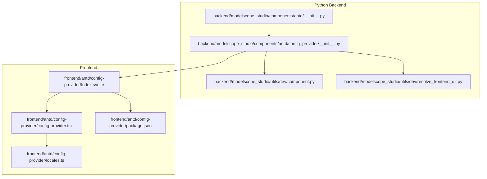
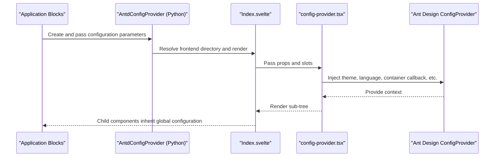
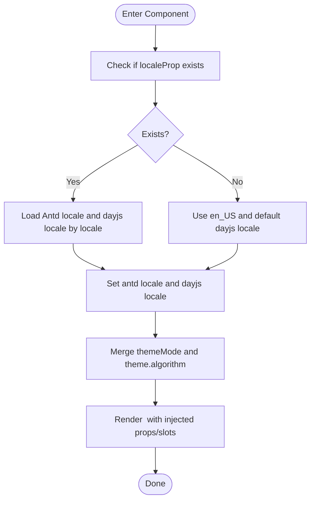
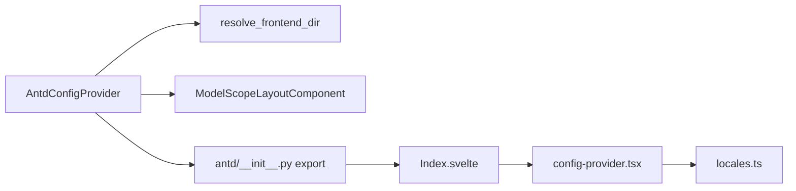

# Other Components API

<cite>
**Files referenced in this document**
- [backend/modelscope_studio/components/antd/config_provider/__init__.py](file://backend/modelscope_studio/components/antd/config_provider/__init__.py)
- [backend/modelscope_studio/components/antd/components.py](file://backend/modelscope_studio/components/antd/components.py)
- [frontend/antd/config-provider/config-provider.tsx](file://frontend/antd/config-provider/config-provider.tsx)
- [frontend/antd/config-provider/locales.ts](file://frontend/antd/config-provider/locales.ts)
- [frontend/antd/config-provider/Index.svelte](file://frontend/antd/config-provider/Index.svelte)
- [backend/modelscope_studio/utils/dev/component.py](file://backend/modelscope_studio/utils/dev/component.py)
- [backend/modelscope_studio/utils/dev/resolve_frontend_dir.py](file://backend/modelscope_studio/utils/dev/resolve_frontend_dir.py)
- [backend/modelscope_studio/components/antd/__init__.py](file://backend/modelscope_studio/components/antd/__init__.py)
- [docs/demos/example.py](file://docs/demos/example.py)
- [docs/components/antd/config_provider/README.md](file://docs/components/antd/config_provider/README.md)
- [frontend/antd/config-provider/package.json](file://frontend/antd/config-provider/package.json)
</cite>

## Table of Contents

1. [Introduction](#introduction)
2. [Project Structure](#project-structure)
3. [Core Components](#core-components)
4. [Architecture Overview](#architecture-overview)
5. [Detailed Component Analysis](#detailed-component-analysis)
6. [Dependency Analysis](#dependency-analysis)
7. [Performance Considerations](#performance-considerations)
8. [Troubleshooting Guide](#troubleshooting-guide)
9. [Conclusion](#conclusion)
10. [Appendix](#appendix)

## Introduction

This document is the Python API reference for "Other Components" in Ant Design Studio, focusing on the complete API specification and usage instructions for ConfigProvider (global configuration provider). Content covers:

- Constructor parameters, property definitions, method signatures and return types
- Standard global configuration usage: theme customization, language settings, component defaults
- Scope management, configuration inheritance, and dynamic update mechanisms
- Internationalization configuration, theme switching, and component behavior customization
- Best practices and performance optimization recommendations

## Project Structure

ConfigProvider is implemented as a Python class in the backend and wrapped in Svelte on the frontend, interfacing with Ant Design's ConfigProvider while supporting multiple languages through the localization module.

**Chart sources**

- [backend/modelscope_studio/components/antd/**init**.py:32](file://backend/modelscope_studio/components/antd/__init__.py#L32)
- [backend/modelscope_studio/components/antd/config_provider/**init**.py:22](file://backend/modelscope_studio/components/antd/config_provider/__init__.py#L22)
- [backend/modelscope_studio/utils/dev/resolve_frontend_dir.py:4](file://backend/modelscope_studio/utils/dev/resolve_frontend_dir.py#L4)
- [frontend/antd/config-provider/Index.svelte:11](file://frontend/antd/config-provider/Index.svelte#L11)
- [frontend/antd/config-provider/config-provider.tsx:51](file://frontend/antd/config-provider/config-provider.tsx#L51)
- [frontend/antd/config-provider/locales.ts:7](file://frontend/antd/config-provider/locales.ts#L7)
- [frontend/antd/config-provider/package.json:1](file://frontend/antd/config-provider/package.json#L1)

**Section sources**

- [backend/modelscope_studio/components/antd/**init**.py:32](file://backend/modelscope_studio/components/antd/__init__.py#L32)
- [backend/modelscope_studio/components/antd/config_provider/**init**.py:22](file://backend/modelscope_studio/components/antd/config_provider/__init__.py#L22)
- [backend/modelscope_studio/utils/dev/resolve_frontend_dir.py:4](file://backend/modelscope_studio/utils/dev/resolve_frontend_dir.py#L4)
- [frontend/antd/config-provider/Index.svelte:11](file://frontend/antd/config-provider/Index.svelte#L11)
- [frontend/antd/config-provider/config-provider.tsx:51](file://frontend/antd/config-provider/config-provider.tsx#L51)
- [frontend/antd/config-provider/locales.ts:7](file://frontend/antd/config-provider/locales.ts#L7)
- [frontend/antd/config-provider/package.json:1](file://frontend/antd/config-provider/package.json#L1)

## Core Components

- Component name: AntdConfigProvider
- Module: backend.modelscope_studio.components.antd.config_provider
- Base class: ModelScopeLayoutComponent
- Frontend mapping: frontend/antd/config-provider/Index.svelte → frontend/antd/config-provider/config-provider.tsx
- Purpose: Provides unified global configuration (theme, language, size, prefix, popup container, etc.) to all Ant Design components within the application, supporting slot injection and dynamic updates.

Key points:

- Supported slots: renderEmpty
- Events: none
- Frontend directory resolution: points to frontend component directory via resolve_frontend_dir("config-provider")
- Skip API export: skip_api returns True to avoid exposing this component in certain automated exports

**Section sources**

- [backend/modelscope_studio/components/antd/config_provider/**init**.py:22](file://backend/modelscope_studio/components/antd/config_provider/__init__.py#L22)
- [backend/modelscope_studio/components/antd/config_provider/**init**.py:28](file://backend/modelscope_studio/components/antd/config_provider/__init__.py#L28)
- [backend/modelscope_studio/components/antd/config_provider/**init**.py:95](file://backend/modelscope_studio/components/antd/config_provider/__init__.py#L95)
- [backend/modelscope_studio/utils/dev/component.py:20](file://backend/modelscope_studio/utils/dev/component.py#L20)

## Architecture Overview

The ConfigProvider call chain is as follows:

**Chart sources**

- [backend/modelscope_studio/components/antd/config_provider/**init**.py:95](file://backend/modelscope_studio/components/antd/config_provider/__init__.py#L95)
- [frontend/antd/config-provider/Index.svelte:11](file://frontend/antd/config-provider/Index.svelte#L11)
- [frontend/antd/config-provider/config-provider.tsx:108](file://frontend/antd/config-provider/config-provider.tsx#L108)

## Detailed Component Analysis

### Constructor and Property Definitions

- Class name: AntdConfigProvider
- Inherits: ModelScopeLayoutComponent
- Key properties (partial):
  - component_disabled: optional boolean, controls component disabled state
  - component_size: optional string, values small/middle/large or None
  - csp: optional dict, for CSP configuration
  - direction: optional string, values ltr/rtl or None
  - get_popup_container: optional string, specifies the popup mount container
  - get_target_container: optional string, specifies the target container
  - icon_prefix_cls: optional string, icon prefix class name
  - locale: optional string, value is a predefined LocaleType
  - popup_match_select_width: optional boolean or number, affects popup width strategy
  - popup_overflow: optional string, values viewport/scroll
  - prefix_cls: optional string, component prefix class name
  - render_empty: optional string, for empty state rendering
  - theme: optional dict (deprecated), warning prompts to use theme_config
  - theme_config: optional dict, theme configuration (recommended)
  - variant: optional string, values outlined/filled/borderless
  - virtual: optional boolean
  - warning: optional dict, warning configuration
  - Element-level styles and class names: class_names, styles
  - Layout and visibility: visible, elem_id, elem_classes, elem_style, render, as_item
  - Extra properties: additional_props
  - Other common properties: \_internal (internally reserved)

Note:

- Relationship between theme and theme_config: passing theme will trigger a warning; use theme_config instead
- Slots: only renderEmpty is supported

Method signatures and return types:

- preprocess(payload: None) -> None
- postprocess(value: None) -> None
- example_payload() -> Any
- example_value() -> Any

**Section sources**

- [backend/modelscope_studio/components/antd/config_provider/**init**.py:31](file://backend/modelscope_studio/components/antd/config_provider/__init__.py#L31)
- [backend/modelscope_studio/components/antd/config_provider/**init**.py:42](file://backend/modelscope_studio/components/antd/config_provider/__init__.py#L42)
- [backend/modelscope_studio/components/antd/config_provider/**init**.py:86](file://backend/modelscope_studio/components/antd/config_provider/__init__.py#L86)
- [backend/modelscope_studio/components/antd/config_provider/**init**.py:101](file://backend/modelscope_studio/components/antd/config_provider/__init__.py#L101)
- [backend/modelscope_studio/components/antd/config_provider/**init**.py:104](file://backend/modelscope_studio/components/antd/config_provider/__init__.py#L104)
- [backend/modelscope_studio/components/antd/config_provider/**init**.py:108](file://backend/modelscope_studio/components/antd/config_provider/__init__.py#L108)
- [backend/modelscope_studio/components/antd/config_provider/**init**.py:111](file://backend/modelscope_studio/components/antd/config_provider/__init__.py#L111)

### Frontend Implementation Key Points

- Types and imports: based on Ant Design's ConfigProvider types, extended with themeMode and theme.algorithm fields
- Theme algorithm: automatically selects dark/compact algorithm based on themeMode, can be merged with external theme.algorithm
- Language settings: locale is inferred from browser environment by default, with en_US as fallback; loads corresponding language packs and dayjs language asynchronously on demand
- Container callbacks: getPopupContainer, getTargetContainer, renderEmpty are wrapped via useFunction to ensure reactive updates
- Slot handling: injects dot-separated paths from slots into corresponding prop positions; renderEmpty supports ReactSlot

**Chart sources**

- [frontend/antd/config-provider/config-provider.tsx:96](file://frontend/antd/config-provider/config-provider.tsx#L96)
- [frontend/antd/config-provider/config-provider.tsx:127](file://frontend/antd/config-provider/config-provider.tsx#L127)
- [frontend/antd/config-provider/config-provider.tsx:110](file://frontend/antd/config-provider/config-provider.tsx#L110)

**Section sources**

- [frontend/antd/config-provider/config-provider.tsx:51](file://frontend/antd/config-provider/config-provider.tsx#L51)
- [frontend/antd/config-provider/config-provider.tsx:77](file://frontend/antd/config-provider/config-provider.tsx#L77)
- [frontend/antd/config-provider/config-provider.tsx:96](file://frontend/antd/config-provider/config-provider.tsx#L96)
- [frontend/antd/config-provider/config-provider.tsx:127](file://frontend/antd/config-provider/config-provider.tsx#L127)
- [frontend/antd/config-provider/config-provider.tsx:110](file://frontend/antd/config-provider/config-provider.tsx#L110)

### Internationalization Configuration

- Language enumeration: LocaleType is a string literal union type covering multiple languages and regions
- Language mapping: lang2RegionMap maps short language codes to specific region codes
- Language loading: locales maps each region code to an async loader function returning antd locale and dayjs locale
- Default language: getDefaultLocale sets dayjs language to English

Usage recommendations:

- Use enum values from LocaleType for the locale parameter
- If locale is not provided, it will be auto-inferred from the browser environment with fallback to en_US

**Section sources**

- [backend/modelscope_studio/components/antd/config_provider/**init**.py:8](file://backend/modelscope_studio/components/antd/config_provider/__init__.py#L8)
- [frontend/antd/config-provider/locales.ts:12](file://frontend/antd/config-provider/locales.ts#L12)
- [frontend/antd/config-provider/locales.ts:89](file://frontend/antd/config-provider/locales.ts#L89)
- [frontend/antd/config-provider/locales.ts:7](file://frontend/antd/config-provider/locales.ts#L7)

### Theme and Variant Configuration

- Theme entry: theme_config (recommended) or deprecated theme
- Theme algorithm: themeMode controls dark/compact, can be merged with external algorithm
- Component variant: variant supports outlined/filled/borderless

Best practices:

- Use theme_config for theme customization to avoid conflicts with Gradio presets
- Control themeMode via toggle variables to achieve dynamic switching between light/dark/compact themes

**Section sources**

- [backend/modelscope_studio/components/antd/config_provider/**init**.py:86](file://backend/modelscope_studio/components/antd/config_provider/__init__.py#L86)
- [frontend/antd/config-provider/config-provider.tsx:88](file://frontend/antd/config-provider/config-provider.tsx#L88)
- [frontend/antd/config-provider/config-provider.tsx:127](file://frontend/antd/config-provider/config-provider.tsx#L127)

### Scope Management, Inheritance, and Dynamic Updates

- Scope: ConfigProvider as a layout component means all components in its subtree inherit the global configuration
- Inheritance: child components don't need to repeatedly pass the same configuration, reading directly from context
- Dynamic updates: output to ConfigProvider via Gradio's update to change theme_config, locale, direction, etc. in real time

Reference examples:

- Documentation examples demonstrate how to dynamically update ConfigProvider's locale, direction, and theme_config during interactions

**Section sources**

- [docs/demos/example.py:6](file://docs/demos/example.py#L6)
- [docs/components/antd/config_provider/README.md:7](file://docs/components/antd/config_provider/README.md#L7)

### API Definitions and Type Summary

- Constructor parameters (selected)
  - component_disabled: bool | None
  - component_size: "small"|"middle"|"large" | None
  - csp: dict | None
  - direction: "ltr"|"rtl" | None
  - get_popup_container: str | None
  - get_target_container: str | None
  - icon_prefix_cls: str | None
  - locale: LocaleType | None
  - popup_match_select_width: bool | int | float | None
  - popup_overflow: "viewport"|"scroll" | None
  - prefix_cls: str | None
  - render_empty: str | None
  - theme: dict | None
  - theme_config: dict | None
  - variant: "outlined"|"filled"|"borderless" | None
  - virtual: bool | None
  - warning: dict | None
  - class_names: dict | str | None
  - styles: dict | str | None
  - as_item: str | None
  - \_internal: None
  - visible: bool
  - elem_id: str | None
  - elem_classes: list[str] | str | None
  - elem_style: dict | None
  - render: bool
  - additional_props: dict | None
  - Other common keyword arguments

- Methods
  - preprocess(payload: None) -> None
  - postprocess(value: None) -> None
  - example_payload() -> Any
  - example_value() -> Any

- Properties
  - skip_api: True
  - FRONTEND_DIR: resolved by resolve_frontend_dir("config-provider")

**Section sources**

- [backend/modelscope_studio/components/antd/config_provider/**init**.py:31](file://backend/modelscope_studio/components/antd/config_provider/__init__.py#L31)
- [backend/modelscope_studio/components/antd/config_provider/**init**.py:95](file://backend/modelscope_studio/components/antd/config_provider/__init__.py#L95)
- [backend/modelscope_studio/utils/dev/resolve_frontend_dir.py:4](file://backend/modelscope_studio/utils/dev/resolve_frontend_dir.py#L4)

## Dependency Analysis

- Python layer
  - Inherits from ModelScopeLayoutComponent, enabling layout context capabilities
  - Resolves frontend component directory via resolve_frontend_dir
  - Exported as ConfigProvider in antd/**init**.py

- Frontend layer
  - Index.svelte converts Python-passed props and slots into React Props
  - config-provider.tsx interfaces with Ant Design ConfigProvider, injecting themes, language, container callbacks, and slots
  - locales.ts provides language mapping and async loading

**Chart sources**

- [backend/modelscope_studio/utils/dev/resolve_frontend_dir.py:4](file://backend/modelscope_studio/utils/dev/resolve_frontend_dir.py#L4)
- [backend/modelscope_studio/utils/dev/component.py:11](file://backend/modelscope_studio/utils/dev/component.py#L11)
- [backend/modelscope_studio/components/antd/**init**.py:32](file://backend/modelscope_studio/components/antd/__init__.py#L32)
- [frontend/antd/config-provider/Index.svelte:11](file://frontend/antd/config-provider/Index.svelte#L11)
- [frontend/antd/config-provider/config-provider.tsx:51](file://frontend/antd/config-provider/config-provider.tsx#L51)
- [frontend/antd/config-provider/locales.ts:7](file://frontend/antd/config-provider/locales.ts#L7)

**Section sources**

- [backend/modelscope_studio/components/antd/**init**.py:32](file://backend/modelscope_studio/components/antd/__init__.py#L32)
- [backend/modelscope_studio/utils/dev/resolve_frontend_dir.py:4](file://backend/modelscope_studio/utils/dev/resolve_frontend_dir.py#L4)
- [frontend/antd/config-provider/Index.svelte:11](file://frontend/antd/config-provider/Index.svelte#L11)
- [frontend/antd/config-provider/config-provider.tsx:51](file://frontend/antd/config-provider/config-provider.tsx#L51)
- [frontend/antd/config-provider/locales.ts:7](file://frontend/antd/config-provider/locales.ts#L7)

## Performance Considerations

- Theme switching
  - Use the themeMode and theme.algorithm merge strategy to avoid frequent rebuilding of theme objects
  - Only trigger language pack loading when locale changes, reducing unnecessary async overhead
- Popup container and target container
  - Wrap callbacks via useFunction to reduce re-renders caused by function reference changes
- Slot rendering
  - renderEmpty is rendered via ReactSlot to avoid additional DOM operations
- Prefix and styles
  - Use prefix_cls and class_names/styles to control style scope, avoiding global pollution

[This section provides general guidance and does not directly analyze specific files]

## Troubleshooting Guide

- Theme conflicts
  - Passing theme will trigger a warning; use theme_config instead
- Language not taking effect
  - Confirm that locale is a valid value from LocaleType; if empty, it falls back to en_US
  - Check that the locales mapping contains the corresponding region code
- Popup position issues
  - Check that the container returned by get_popup_container/get_target_container exists and is correct
- Slots not displaying
  - Confirm that the slot name and path are consistent (e.g., renderEmpty), and that it is correctly injected on the frontend

**Section sources**

- [backend/modelscope_studio/components/antd/config_provider/**init**.py:86](file://backend/modelscope_studio/components/antd/config_provider/__init__.py#L86)
- [frontend/antd/config-provider/config-provider.tsx:96](file://frontend/antd/config-provider/config-provider.tsx#L96)
- [frontend/antd/config-provider/config-provider.tsx:117](file://frontend/antd/config-provider/config-provider.tsx#L117)

## Conclusion

AntdConfigProvider provides global configuration capabilities for Ant Design components, covering key dimensions such as theme, language, size, container, and empty state rendering. Through unified encapsulation on the Python side and efficient frontend integration, developers can conveniently implement configuration inheritance and dynamic updates within scope. It is recommended to use theme_config for theme customization and combine locale with direction for internationalization and layout adaptation.

[This section is a summary and does not directly analyze specific files]

## Appendix

### Usage Examples and References

- Basic usage example (documentation demo)
  - Example demonstrates nesting ConfigProvider within Application and AutoLoading scopes, with DatePicker used inside
  - Reference path: docs/demos/example.py

- Documentation page
  - README contains a basic example placeholder; actual demo is in demos/basic.py

**Section sources**

- [docs/demos/example.py:6](file://docs/demos/example.py#L6)
- [docs/components/antd/config_provider/README.md:7](file://docs/components/antd/config_provider/README.md#L7)

### Component Registration and Exports

- Exported as ConfigProvider alias in antd/**init**.py
- Imported and exported as AntdConfigProvider in components.py

**Section sources**

- [backend/modelscope_studio/components/antd/**init**.py:32](file://backend/modelscope_studio/components/antd/__init__.py#L32)
- [backend/modelscope_studio/components/antd/components.py:31](file://backend/modelscope_studio/components/antd/components.py#L31)
