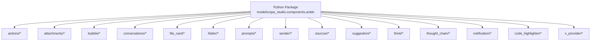
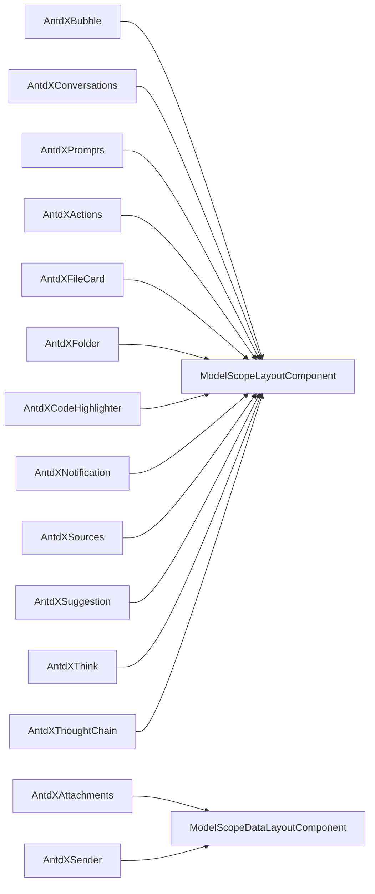

# Antdx Components API

<cite>
**Files Referenced in This Document**
- [backend/modelscope_studio/components/antdx/__init__.py](file://backend/modelscope_studio/components/antdx/__init__.py)
- [backend/modelscope_studio/components/antdx/components.py](file://backend/modelscope_studio/components/antdx/components.py)
- [backend/modelscope_studio/components/antdx/bubble/__init__.py](file://backend/modelscope_studio/components/antdx/bubble/__init__.py)
- [backend/modelscope_studio/components/antdx/conversations/__init__.py](file://backend/modelscope_studio/components/antdx/conversations/__init__.py)
- [backend/modelscope_studio/components/antdx/prompts/__init__.py](file://backend/modelscope_studio/components/antdx/prompts/__init__.py)
- [backend/modelscope_studio/components/antdx/attachments/__init__.py](file://backend/modelscope_studio/components/antdx/attachments/__init__.py)
- [backend/modelscope_studio/components/antdx/sender/__init__.py](file://backend/modelscope_studio/components/antdx/sender/__init__.py)
- [backend/modelscope_studio/components/antdx/actions/__init__.py](file://backend/modelscope_studio/components/antdx/actions/__init__.py)
- [backend/modelscope_studio/components/antdx/file_card/__init__.py](file://backend/modelscope_studio/components/antdx/file_card/__init__.py)
- [backend/modelscope_studio/components/antdx/folder/__init__.py](file://backend/modelscope_studio/components/antdx/folder/__init__.py)
- [backend/modelscope_studio/components/antdx/code_highlighter/__init__.py](file://backend/modelscope_studio/components/antdx/code_highlighter/__init__.py)
- [backend/modelscope_studio/components/antdx/notification/__init__.py](file://backend/modelscope_studio/components/antdx/notification/__init__.py)
- [backend/modelscope_studio/components/antdx/sources/__init__.py](file://backend/modelscope_studio/components/antdx/sources/__init__.py)
- [backend/modelscope_studio/components/antdx/suggestion/__init__.py](file://backend/modelscope_studio/components/antdx/suggestion/__init__.py)
- [backend/modelscope_studio/components/antdx/think/__init__.py](file://backend/modelscope_studio/components/antdx/think/__init__.py)
- [backend/modelscope_studio/components/antdx/thought_chain/__init__.py](file://backend/modelscope_studio/components/antdx/thought_chain/__init__.py)
</cite>

## Table of Contents

1. [Introduction](#introduction)
2. [Project Structure](#project-structure)
3. [Core Components](#core-components)
4. [Architecture Overview](#architecture-overview)
5. [Detailed Component Analysis](#detailed-component-analysis)
6. [Dependency Analysis](#dependency-analysis)
7. [Performance Considerations](#performance-considerations)
8. [Troubleshooting Guide](#troubleshooting-guide)
9. [Conclusion](#conclusion)
10. [Appendix](#appendix)

## Introduction

This document is the Python API reference for the Antdx component library, focusing on ML and AI application-related components under `modelscope_studio.components.antdx.*`. It covers the complete import paths, constructor parameters, property definitions, method signatures, and return type descriptions for 20+ component classes, and provides standard instantiation examples and best practices for typical scenarios such as conversational systems, file handling, and user input. It also documents the event handling mechanisms, lifecycle management, state synchronization strategies, and performance optimization recommendations.

## Project Structure

Antdx components reside in the backend Python package `modelscope_studio/components/antdx/`, organized by functional domain: each subdirectory corresponds to a component or component family (e.g., bubble, conversations, sender), and exports are unified through `__init__.py`. `components.py` and `__init__.py` provide consistent aggregated export entry points for direct import from `modelscope_studio.components.antdx.*`.

Diagram Sources

- [backend/modelscope_studio/components/antdx/**init**.py:1-42](file://backend/modelscope_studio/components/antdx/__init__.py#L1-L42)
- [backend/modelscope_studio/components/antdx/components.py:1-40](file://backend/modelscope_studio/components/antdx/components.py#L1-L40)

Section Sources

- [backend/modelscope_studio/components/antdx/**init**.py:1-42](file://backend/modelscope_studio/components/antdx/__init__.py#L1-L42)
- [backend/modelscope_studio/components/antdx/components.py:1-40](file://backend/modelscope_studio/components/antdx/components.py#L1-L40)

## Core Components

The following lists all ML and AI scenario-related component classes in `modelscope_studio.components.antdx.*` with their import paths and usage overview:

- Layout & Display
  - Bubble: For message/text display and interaction, supports editing, typing animation, variants, shapes, etc.
  - Conversations: For multi-conversation management and menu interactions.
  - Prompts: For displaying a set of clickable prompt items.
  - Suggestions: For input suggestions and selection.
  - Think: For displaying a "thinking" state and expand control.
  - ThoughtChain: For displaying reasoning processes in tree/chain form.
  - CodeHighlighter: For code block rendering and theme control.
  - Notification: For Web Notification integration and event binding.
  - Sources: For displaying source entries and expand control.
  - Welcome: For landing page or welcome message display (present in exports).
  - XProvider: For global context injection (present in exports).

- Data & Input
  - Attachments: For file upload, drag-and-drop, preview, download, and removal.
  - Sender: For user input, keyboard shortcuts, voice, paste, and submit events.
  - FileCard: For card-style display and operations on individual files.
  - Folder: For tree-style directory browsing and file/folder selection.
  - Actions: For a group of clickable action items and dropdown menus.

- Pro Extensions (Pro module)
  - Chatbot: For conversational flows and message stream management (present in exports).
  - MultimodalInput: For multimodal input including text, images, audio, and video (present in exports).
  - MonacoEditor: For code editing and highlighting (present in exports).
  - WebSandbox: For secure sandbox execution (present in exports).

Section Sources

- [backend/modelscope_studio/components/antdx/**init**.py:1-42](file://backend/modelscope_studio/components/antdx/__init__.py#L1-L42)
- [backend/modelscope_studio/components/antdx/components.py:1-40](file://backend/modelscope_studio/components/antdx/components.py#L1-L40)

## Architecture Overview

Antdx components are wrapped through a unified base class, inheriting from Gradio's component system, supporting event listeners, slots, style and class name injection, and frontend resource directory resolution. Most components are layout-type components (`skip_api=True`) that do not directly expose API schemas; a few data-type components (such as Attachments and Sender) implement `preprocess/postprocess` and expose API specifications.

```mermaid
classDiagram
class ModelScopeLayoutComponent
class ModelScopeDataLayoutComponent
class AntdXBubble
class AntdXConversations
class AntdXPrompts
class AntdXAttachments
class AntdXSender
class AntdXActions
class AntdXFileCard
class AntdXFolder
class AntdXCodeHighlighter
class AntdXNotification
class AntdXSources
class AntdXSuggestion
class AntdXThink
class AntdXThoughtChain
AntdXBubble --|> ModelScopeLayoutComponent
AntdXConversations --|> ModelScopeLayoutComponent
AntdXPrompts --|> ModelScopeLayoutComponent
AntdXFileCard --|> ModelScopeLayoutComponent
AntdXFolder --|> ModelScopeLayoutComponent
AntdXCodeHighlighter --|> ModelScopeLayoutComponent
AntdXNotification --|> ModelScopeLayoutComponent
AntdXSources --|> ModelScopeLayoutComponent
AntdXSuggestion --|> ModelScopeLayoutComponent
AntdXThink --|> ModelScopeLayoutComponent
AntdXThoughtChain --|> ModelScopeLayoutComponent
AntdXAttachments --|> ModelScopeDataLayoutComponent
AntdXSender --|> ModelScopeDataLayoutComponent
AntdXActions --|> ModelScopeLayoutComponent
```

Diagram Sources

- [backend/modelscope_studio/components/antdx/bubble/**init**.py:13-135](file://backend/modelscope_studio/components/antdx/bubble/__init__.py#L13-L135)
- [backend/modelscope_studio/components/antdx/conversations/**init**.py:11-109](file://backend/modelscope_studio/components/antdx/conversations/__init__.py#L11-L109)
- [backend/modelscope_studio/components/antdx/prompts/**init**.py:11-88](file://backend/modelscope_studio/components/antdx/prompts/__init__.py#L11-L88)
- [backend/modelscope_studio/components/antdx/attachments/**init**.py:22-227](file://backend/modelscope_studio/components/antdx/attachments/__init__.py#L22-L227)
- [backend/modelscope_studio/components/antdx/sender/**init**.py:14-149](file://backend/modelscope_studio/components/antdx/sender/__init__.py#L14-L149)
- [backend/modelscope_studio/components/antdx/actions/**init**.py:15-112](file://backend/modelscope_studio/components/antdx/actions/__init__.py#L15-L112)
- [backend/modelscope_studio/components/antdx/file_card/**init**.py:11-112](file://backend/modelscope_studio/components/antdx/file_card/__init__.py#L11-L112)
- [backend/modelscope_studio/components/antdx/folder/**init**.py:12-114](file://backend/modelscope_studio/components/antdx/folder/__init__.py#L12-L114)
- [backend/modelscope_studio/components/antdx/code_highlighter/**init**.py:6-71](file://backend/modelscope_studio/components/antdx/code_highlighter/__init__.py#L6-L71)
- [backend/modelscope_studio/components/antdx/notification/**init**.py:10-97](file://backend/modelscope_studio/components/antdx/notification/__init__.py#L10-L97)
- [backend/modelscope_studio/components/antdx/sources/**init**.py:11-92](file://backend/modelscope_studio/components/antdx/sources/__init__.py#L11-L92)
- [backend/modelscope_studio/components/antdx/suggestion/**init**.py:11-86](file://backend/modelscope_studio/components/antdx/suggestion/__init__.py#L11-L86)
- [backend/modelscope_studio/components/antdx/think/**init**.py:8-79](file://backend/modelscope_studio/components/antdx/think/__init__.py#L8-L79)
- [backend/modelscope_studio/components/antdx/thought_chain/**init**.py:12-86](file://backend/modelscope_studio/components/antdx/thought_chain/__init__.py#L12-L86)

## Detailed Component Analysis

### Bubble

- Import Path: `modelscope_studio.components.antdx.Bubble`
- Purpose: Message/text display, supports editing, typing animation, variants, shapes, etc.
- Key Parameters (selected): content, avatar, footer, header, loading, placement, editable, shape, typing, streaming, variant, footer_placement, loading_render, content_render, root_class_name, class_names, styles, additional_props, visibility and style attributes.
- Events: typing, typing_complete, edit_confirm, edit_cancel.
- Slots: avatar, editable.okText, editable.cancelText, content, footer, header, extra, loadingRender, contentRender.
- Lifecycle & API: skip*api=True, does not expose API; preprocess/postprocess/example*\* are empty implementations.

Section Sources

- [backend/modelscope_studio/components/antdx/bubble/**init**.py:13-135](file://backend/modelscope_studio/components/antdx/bubble/__init__.py#L13-L135)

### Conversations

- Import Path: `modelscope_studio.components.antdx.Conversations`
- Sub-components: Item
- Key Parameters: active_key, default_active_key, items, menu, groupable, shortcut_keys, creation, styles, class_names, root_class_name, additional_props.
- Events: active_change, menu_click, menu_deselect, menu_open_change, menu_select, groupable_expand, creation_click.
- Slots: menu.expandIcon, menu.overflowedIndicator, menu.trigger, groupable.label, items, creation.icon, creation.label.
- Lifecycle & API: skip_api=True.

Section Sources

- [backend/modelscope_studio/components/antdx/conversations/**init**.py:11-109](file://backend/modelscope_studio/components/antdx/conversations/__init__.py#L11-L109)

### Prompts

- Import Path: `modelscope_studio.components.antdx.Prompts`
- Sub-components: Item
- Key Parameters: items, prefix_cls, title, vertical, fade_in, fade_in_left, wrap, styles, class_names, root_class_name, additional_props.
- Events: item_click.
- Slots: title, items.
- Lifecycle & API: skip_api=True.

Section Sources

- [backend/modelscope_studio/components/antdx/prompts/**init**.py:11-88](file://backend/modelscope_studio/components/antdx/prompts/__init__.py#L11-L88)

### Attachments

- Import Path: `modelscope_studio.components.antdx.Attachments`
- Data Model: ListFiles
- Key Parameters: image_props, accept, action, before_upload, custom_request, data, default_file_list, directory, disabled, items, get_drop_container, overflow, placeholder, headers, icon_render, is_image_url, item_render, list_type, max_count, method, multiple, form_name, open_file_dialog_on_click, preview_file, progress, show_upload_list, with_credentials, class_names, root_style, styles, root_class_name, visibility and polling attributes.
- Events: change, drop, download, preview, remove.
- Lifecycle & API: skip_api=False; preprocess converts payload to file path list; postprocess converts file path list to ListFiles; api_info returns ListFiles JSON Schema.
- Typical Usage: As an input component receiving file lists, as an output component returning file metadata.

Section Sources

- [backend/modelscope_studio/components/antdx/attachments/**init**.py:22-227](file://backend/modelscope_studio/components/antdx/attachments/__init__.py#L22-L227)

### Sender

- Import Path: `modelscope_studio.components.antdx.Sender`
- Sub-components: Header, Switch
- Key Parameters: value, allow_speech, class_names, components, default_value, disabled, auto_size, loading, suffix, footer, header, prefix, read_only, styles, submit_type, placeholder, slot_config, skill, root_class_name, additional_props.
- Events: change, submit, cancel, allow_speech_recording_change, key_down, key_press, focus, blur, paste, paste_file, skill_closable_close.
- Slots: suffix, header, prefix, footer, skill.title, skill.toolTip.title, skill.closable.closeIcon.
- Lifecycle & API: skip*api=False; preprocess/postprocess return string; api_info returns string type description; example*\* returns None.

Section Sources

- [backend/modelscope_studio/components/antdx/sender/**init**.py:14-149](file://backend/modelscope_studio/components/antdx/sender/__init__.py#L14-L149)

### Actions

- Import Path: `modelscope_studio.components.antdx.Actions`
- Sub-components: ActionItem, Item, Feedback, Copy, Audio
- Key Parameters: additional_props, items, variant, dropdown_props, fade_in, fade_in_left, class_names, styles.
- Events: click, dropdown_open_change, dropdown_menu_click, dropdown_menu_deselect, dropdown_menu_open_change, dropdown_menu_select.
- Slots: items, dropdownProps.dropdownRender, dropdownProps.popupRender, dropdownProps.menu.expandIcon, dropdownProps.menu.overflowedIndicator, dropdownProps.menu.items.
- Lifecycle & API: skip_api=True.

Section Sources

- [backend/modelscope_studio/components/antdx/actions/**init**.py:15-112](file://backend/modelscope_studio/components/antdx/actions/__init__.py#L15-L112)

### FileCard

- Import Path: `modelscope_studio.components.antdx.FileCard`
- Sub-components: List
- Key Parameters: image_props, filename, byte, size, description, loading, type, src, mask, icon, video_props, audio_props, spin_props, class_names, styles, additional_props.
- Events: click.
- Slots: imageProps.placeholder, imageProps.preview.mask, imageProps.preview.closeIcon, imageProps.preview.toolbarRender, imageProps.preview.imageRender, description, icon, mask, spinProps.icon, spinProps.description, spinProps.indicator.
- Lifecycle & API: skip_api=True.

Section Sources

- [backend/modelscope_studio/components/antdx/file_card/**init**.py:11-112](file://backend/modelscope_studio/components/antdx/file_card/__init__.py#L11-L112)

### Folder

- Import Path: `modelscope_studio.components.antdx.Folder`
- Sub-components: TreeNode, DirectoryIcon
- Key Parameters: additional_props, tree_data, selectable, selected_file, default_selected_file, directory_tree_width, empty_render, preview_render, expanded_paths, default_expanded_paths, default_expand_all, directory_title, preview_title, directory_icons, class_names, styles, root_class_name.
- Events: file_click, folder_click, selected_file_change, expanded_paths_change, file_content_service_load_file_content.
- Slots: emptyRender, previewRender, directoryTitle, previewTitle, treeData, directoryIcons.
- Lifecycle & API: skip_api=True.

Section Sources

- [backend/modelscope_studio/components/antdx/folder/**init**.py:12-114](file://backend/modelscope_studio/components/antdx/folder/__init__.py#L12-L114)

### CodeHighlighter

- Import Path: `modelscope_studio.components.antdx.CodeHighlighter`
- Key Parameters: value, lang, header, highlight_props, prism_light_mode, styles, class_names, additional_props, root_class_name.
- Slots: header.
- Lifecycle & API: skip_api=True.

Section Sources

- [backend/modelscope_studio/components/antdx/code_highlighter/**init**.py:6-71](file://backend/modelscope_studio/components/antdx/code_highlighter/__init__.py#L6-L71)

### Notification

- Import Path: `modelscope_studio.components.antdx.Notification`
- Key Parameters: title, duration, badge, body, data, dir, icon, lang, require_interaction, silent, tag, additional_props.
- Events: permission, click, close, error, show.
- Lifecycle & API: skip_api=True.

Section Sources

- [backend/modelscope_studio/components/antdx/notification/**init**.py:10-97](file://backend/modelscope_studio/components/antdx/notification/__init__.py#L10-L97)

### Sources

- Import Path: `modelscope_studio.components.antdx.Sources`
- Sub-components: Item
- Key Parameters: title, items, expand_icon_position, default_expanded, expanded, inline, active_key, popover_overlay_width, styles, class_names, root_class_name, additional_props.
- Events: expand, click.
- Slots: items.
- Lifecycle & API: skip_api=True.

Section Sources

- [backend/modelscope_studio/components/antdx/sources/**init**.py:11-92](file://backend/modelscope_studio/components/antdx/sources/__init__.py#L11-L92)

### Suggestion

- Import Path: `modelscope_studio.components.antdx.Suggestion`
- Sub-components: Item
- Key Parameters: additional_props, items, block, open, should_trigger, class_names, styles, root_class_name.
- Events: select, open_change.
- Slots: items, children.
- Lifecycle & API: skip_api=True.

Section Sources

- [backend/modelscope_studio/components/antdx/suggestion/**init**.py:11-86](file://backend/modelscope_studio/components/antdx/suggestion/__init__.py#L11-L86)

### Think

- Import Path: `modelscope_studio.components.antdx.Think`
- Key Parameters: additional_props, icon, styles, class_names, loading, title, root_class_name, default_expanded, expanded, blink.
- Events: expand.
- Slots: loading, icon, title.
- Lifecycle & API: skip_api=True.

Section Sources

- [backend/modelscope_studio/components/antdx/think/**init**.py:8-79](file://backend/modelscope_studio/components/antdx/think/__init__.py#L8-L79)

### ThoughtChain

- Import Path: `modelscope_studio.components.antdx.ThoughtChain`
- Sub-components: Item, ThoughtChainItem
- Key Parameters: expanded_keys, default_expanded_keys, items, line, prefix_cls, styles, class_names, root_class_name, additional_props.
- Events: expand.
- Slots: items.
- Lifecycle & API: skip_api=True.

Section Sources

- [backend/modelscope_studio/components/antdx/thought_chain/**init**.py:12-86](file://backend/modelscope_studio/components/antdx/thought_chain/__init__.py#L12-L86)

## Dependency Analysis

- Components uniformly inherit from `ModelScopeLayoutComponent` or `ModelScopeDataLayoutComponent`; the latter supports `preprocess/postprocess` and API specification export for data types.
- Most components are layout-type components with `skip_api=True` that do not expose an API; a few data-type components (Attachments, Sender) implement data serialization specifications.
- Components resolve frontend resource directories via `resolve_frontend_dir("xxx", type="antdx")`, ensuring one-to-one correspondence with frontend components.

Diagram Sources

- [backend/modelscope_studio/components/antdx/bubble/**init**.py:13-135](file://backend/modelscope_studio/components/antdx/bubble/__init__.py#L13-L135)
- [backend/modelscope_studio/components/antdx/attachments/**init**.py:22-227](file://backend/modelscope_studio/components/antdx/attachments/__init__.py#L22-L227)
- [backend/modelscope_studio/components/antdx/sender/**init**.py:14-149](file://backend/modelscope_studio/components/antdx/sender/__init__.py#L14-L149)
- [backend/modelscope_studio/components/antdx/conversations/**init**.py:11-109](file://backend/modelscope_studio/components/antdx/conversations/__init__.py#L11-L109)
- [backend/modelscope_studio/components/antdx/prompts/**init**.py:11-88](file://backend/modelscope_studio/components/antdx/prompts/__init__.py#L11-L88)
- [backend/modelscope_studio/components/antdx/actions/**init**.py:15-112](file://backend/modelscope_studio/components/antdx/actions/__init__.py#L15-L112)
- [backend/modelscope_studio/components/antdx/file_card/**init**.py:11-112](file://backend/modelscope_studio/components/antdx/file_card/__init__.py#L11-L112)
- [backend/modelscope_studio/components/antdx/folder/**init**.py:12-114](file://backend/modelscope_studio/components/antdx/folder/__init__.py#L12-L114)
- [backend/modelscope_studio/components/antdx/code_highlighter/**init**.py:6-71](file://backend/modelscope_studio/components/antdx/code_highlighter/__init__.py#L6-L71)
- [backend/modelscope_studio/components/antdx/notification/**init**.py:10-97](file://backend/modelscope_studio/components/antdx/notification/__init__.py#L10-L97)
- [backend/modelscope_studio/components/antdx/sources/**init**.py:11-92](file://backend/modelscope_studio/components/antdx/sources/__init__.py#L11-L92)
- [backend/modelscope_studio/components/antdx/suggestion/**init**.py:11-86](file://backend/modelscope_studio/components/antdx/suggestion/__init__.py#L11-L86)
- [backend/modelscope_studio/components/antdx/think/**init**.py:8-79](file://backend/modelscope_studio/components/antdx/think/__init__.py#L8-L79)
- [backend/modelscope_studio/components/antdx/thought_chain/**init**.py:12-86](file://backend/modelscope_studio/components/antdx/thought_chain/__init__.py#L12-L86)

## Performance Considerations

- Event Binding: Callbacks are bound via `EventListener` at construction time, avoiding performance overhead from duplicate bindings.
- Data Component Serialization: Attachments and Sender explicitly implement `preprocess/postprocess`, reducing unnecessary data conversion overhead.
- Frontend Resources: `resolve_frontend_dir` ensures only necessary resources are loaded, avoiding redundant bundling.
- Rendering Optimization: Layout-type components with `skip_api=True` reduce additional processing at the API layer.

## Troubleshooting Guide

- Events Not Triggering: Check that callbacks in the EVENTS list are correctly bound, and confirm that the frontend component has the corresponding events enabled.
- File Upload Issues: Verify the Attachments parameters such as action, headers, with_credentials, and max_count; ensure the server is accessible and the cache directory has proper permissions.
- Input Value Not Updating: The value and default_value of Sender must maintain consistent data types; pay attention to the timing of change/submit/cancel events.
- Style and Slots: If slot content is not displayed, check whether the SLOTS definition matches the slot names passed in.

## Conclusion

The Antdx component library provides a rich set of layout, input, and data components centered around AI/ML application scenarios. It meets typical requirements for conversational systems, file handling, and user input while ensuring good extensibility and consistency through unified event and slot mechanisms. In practice, it is recommended to prioritize data-type components (such as Attachments and Sender) for clearer API behavior and data flow, while using layout-type components to build friendly interactive interfaces.

## Appendix

### API Index (by Scenario)

- General Components
  - Bubble, Conversations, Prompts, Suggestions, Think, ThoughtChain, CodeHighlighter, Notification, Sources, FileCard, Folder, Actions
- Wake/Input Components
  - Sender (with Header, Switch)
- Utility Components
  - Attachments (file upload/download/preview/removal)
- Feedback Components
  - Actions (action group and feedback)
- Expression Components
  - CodeHighlighter (code highlighting)
- State & Process Components
  - Think, ThoughtChain, Notification, Sources, Folder, FileCard

### Standard Instantiation Examples (Path References)

- Conversational System
  - Use Bubble, Conversations, Prompts, Sender, and Actions together to build a conversational interface.
  - Example path references: [Bubble constructor:56-116](file://backend/modelscope_studio/components/antdx/bubble/__init__.py#L56-L116), [Conversations constructor:49-91](file://backend/modelscope_studio/components/antdx/conversations/__init__.py#L49-L91), [Prompts constructor:28-71](file://backend/modelscope_studio/components/antdx/prompts/__init__.py#L28-L71), [Sender constructor:68-128](file://backend/modelscope_studio/components/antdx/sender/__init__.py#L68-L128), [Actions constructor:58-94](file://backend/modelscope_studio/components/antdx/actions/__init__.py#L58-L94)
- File Handling
  - Use Attachments to receive file lists, combined with Sender's paste/paste_file events for drag-and-drop and clipboard upload.
  - Example path references: [Attachments constructor:66-160](file://backend/modelscope_studio/components/antdx/attachments/__init__.py#L66-L160), [Sender events and parameters:21-59](file://backend/modelscope_studio/components/antdx/sender/__init__.py#L21-L59)
- User Input
  - Use Sender's submit/cancel events and value/default_value to control input state.
  - Example path references: [Sender events and parameters:21-99](file://backend/modelscope_studio/components/antdx/sender/__init__.py#L21-L99)

### ML Integration Interfaces and Data Formats

- Data-type Components (Attachments, Sender)
  - preprocess: Converts payload to the internal representation expected by the component (e.g., file path list).
  - postprocess: Converts internal value to the data structure for external output (e.g., ListFiles).
  - api_info: Exports JSON Schema, specifying API input/output types.
- Layout-type Components (all other components)
  - Typically skip_api=True, not exposing an API; state changes are driven by properties and events.

### Lifecycle and Event Handling Mechanism

- Event Binding: Callbacks are registered via `EventListener` in the constructor; the component internally binds to frontend events via `_internal.update`.
- Slots: Supported slot names are defined via SLOTS; the component internally parses and renders the corresponding content.
- Styles and Class Names: Uniform style injection is supported via styles, class_names, and root_class_name.
