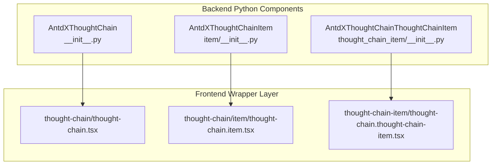
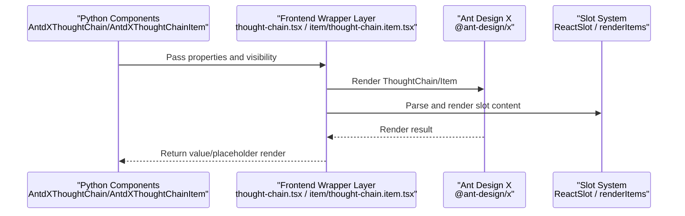
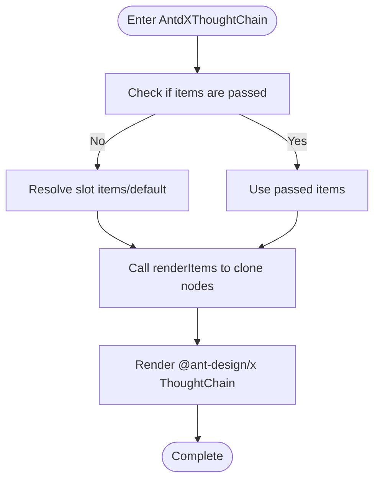
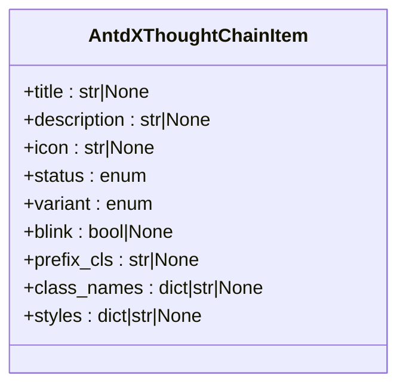
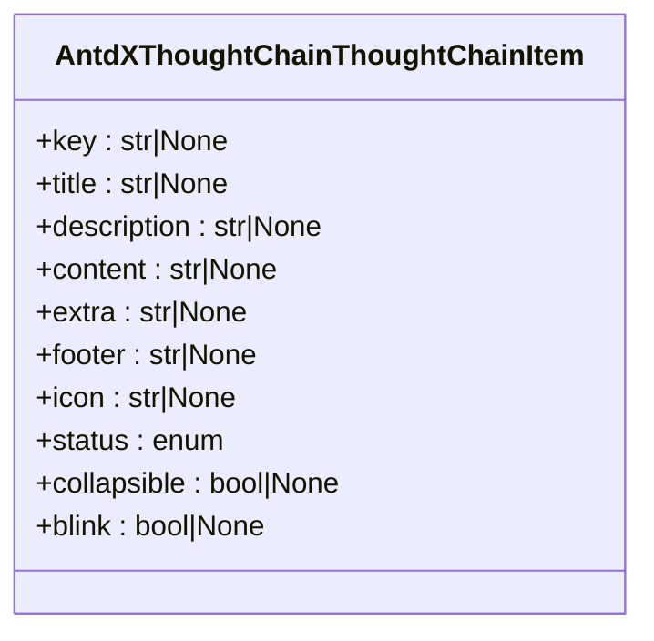
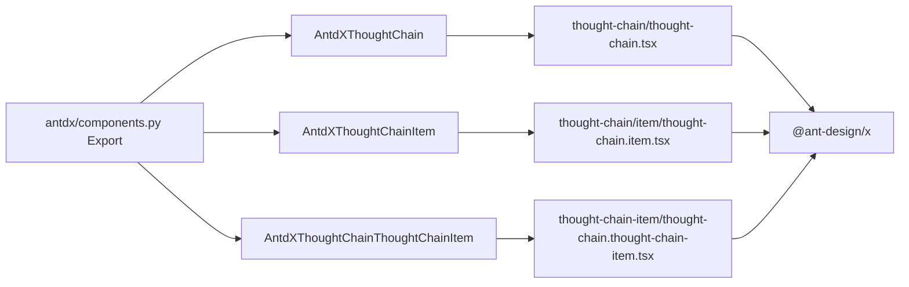

# Confirmation Components API

<cite>
**Files Referenced in This Document**
- [backend/modelscope_studio/components/antdx/thought_chain/__init__.py](file://backend/modelscope_studio/components/antdx/thought_chain/__init__.py)
- [backend/modelscope_studio/components/antdx/thought_chain/item/__init__.py](file://backend/modelscope_studio/components/antdx/thought_chain/item/__init__.py)
- [backend/modelscope_studio/components/antdx/thought_chain/thought_chain_item/__init__.py](file://backend/modelscope_studio/components/antdx/thought_chain/thought_chain_item/__init__.py)
- [frontend/antdx/thought-chain/thought-chain.tsx](file://frontend/antdx/thought-chain/thought-chain.tsx)
- [frontend/antdx/thought-chain/item/thought-chain.item.tsx](file://frontend/antdx/thought-chain/item/thought-chain.item.tsx)
- [frontend/antdx/thought-chain/thought-chain-item/thought-chain.thought-chain-item.tsx](file://frontend/antdx/thought-chain/thought-chain-item/thought-chain.thought-chain-item.tsx)
- [backend/modelscope_studio/components/antdx/components.py](file://backend/modelscope_studio/components/antdx/components.py)
- [docs/components/antdx/thought_chain/demos/basic.py](file://docs/components/antdx/thought_chain/demos/basic.py)
- [docs/components/antdx/thought_chain/demos/item_status.py](file://docs/components/antdx/thought_chain/demos/item_status.py)
- [docs/components/antdx/thought_chain/demos/nested_use.py](file://docs/components/antdx/thought_chain/demos/nested_use.py)
</cite>

## Table of Contents

1. [Introduction](#introduction)
2. [Project Structure](#project-structure)
3. [Core Components](#core-components)
4. [Architecture Overview](#architecture-overview)
5. [Detailed Component Analysis](#detailed-component-analysis)
6. [Dependency Analysis](#dependency-analysis)
7. [Performance Considerations](#performance-considerations)
8. [Troubleshooting Guide](#troubleshooting-guide)
9. [Conclusion](#conclusion)
10. [Appendix](#appendix)

## Introduction

This document is the Python API reference for Antdx confirmation components (AntdX), focusing on the ThoughtChain component's thought chain management, decision process tracking, and state visualization capabilities. Key areas covered:

- Hierarchical structure management and node state control for ThoughtChain and ThoughtChainItem
- Chain operation processing and node connection relationships
- Data structure definitions, state change listeners, and result output mechanisms
- Standard usage examples for scenarios such as AI decision process display, thought chain analysis, and action confirmation
- Component state management strategies, event propagation mechanisms, and performance monitoring configurations
- Integration approaches with chatbots (Chatbot) and reasoning process visualization

## Project Structure

The ThoughtChain-related implementation in Antdx consists of backend Python components and a frontend Svelte/React wrapper layer:

- Backend Python Components: Wrap Gradio layout components, responsible for property forwarding and frontend resource location
- Frontend Wrapper Layer: Bridges Ant Design X's ThoughtChain and ThoughtChain.Item components to the Gradio ecosystem, supporting slot rendering and context injection

**Diagram Sources**

- [backend/modelscope_studio/components/antdx/thought_chain/**init**.py:12-86](file://backend/modelscope_studio/components/antdx/thought_chain/__init__.py#L12-L86)
- [backend/modelscope_studio/components/antdx/thought_chain/item/**init**.py:8-78](file://backend/modelscope_studio/components/antdx/thought_chain/item/__init__.py#L8-L78)
- [backend/modelscope_studio/components/antdx/thought_chain/thought_chain_item/**init**.py:8-81](file://backend/modelscope_studio/components/antdx/thought_chain/thought_chain_item/__init__.py#L8-L81)
- [frontend/antdx/thought-chain/thought-chain.tsx:11-42](file://frontend/antdx/thought-chain/thought-chain.tsx#L11-L42)
- [frontend/antdx/thought-chain/item/thought-chain.item.tsx:9-32](file://frontend/antdx/thought-chain/item/thought-chain.item.tsx#L9-L32)
- [frontend/antdx/thought-chain/thought-chain-item/thought-chain.thought-chain-item.tsx:7-13](file://frontend/antdx/thought-chain/thought-chain-item/thought-chain.thought-chain-item.tsx#L7-L13)

**Section Sources**

- [backend/modelscope_studio/components/antdx/thought_chain/**init**.py:12-86](file://backend/modelscope_studio/components/antdx/thought_chain/__init__.py#L12-L86)
- [frontend/antdx/thought-chain/thought-chain.tsx:11-42](file://frontend/antdx/thought-chain/thought-chain.tsx#L11-L42)

## Core Components

- AntdXThoughtChain: Thought chain container, supports expanded keys, line styles, prefix class names, and other properties; listens for "expand" events to implement expanded key change callbacks; supports the "items" slot
- AntdXThoughtChainItem: Top-level node, supports title, description, icon, status, variant, blink, and other properties; supports "description", "icon", "title" slots
- AntdXThoughtChainThoughtChainItem: Nested node, supports content, extra, footer, icon, title, status, collapsible, blink, and other properties; supports "content", "description", "footer", "icon", "title" slots

All of the above components inherit from ModelScopeLayoutComponent, with general Gradio layout component features, and specify the frontend directory via `resolve_frontend_dir`.

**Section Sources**

- [backend/modelscope_studio/components/antdx/thought_chain/**init**.py:12-86](file://backend/modelscope_studio/components/antdx/thought_chain/__init__.py#L12-L86)
- [backend/modelscope_studio/components/antdx/thought_chain/item/**init**.py:8-78](file://backend/modelscope_studio/components/antdx/thought_chain/item/__init__.py#L8-L78)
- [backend/modelscope_studio/components/antdx/thought_chain/thought_chain_item/**init**.py:8-81](file://backend/modelscope_studio/components/antdx/thought_chain/thought_chain_item/__init__.py#L8-L81)

## Architecture Overview

The diagram below shows the complete chain from Python calls to frontend rendering, as well as the role positions of slots and context:

**Diagram Sources**

- [frontend/antdx/thought-chain/thought-chain.tsx:11-42](file://frontend/antdx/thought-chain/thought-chain.tsx#L11-L42)
- [frontend/antdx/thought-chain/item/thought-chain.item.tsx:9-32](file://frontend/antdx/thought-chain/item/thought-chain.item.tsx#L9-L32)
- [frontend/antdx/thought-chain/thought-chain-item/thought-chain.thought-chain-item.tsx:7-13](file://frontend/antdx/thought-chain/thought-chain-item/thought-chain.thought-chain-item.tsx#L7-L13)

## Detailed Component Analysis

### AntdXThoughtChain (Thought Chain Container)

- Role and Responsibility
  - Container for displaying multiple thought chain nodes
  - Supports expanded key control, default expanded keys, line styles, prefix class names, and other appearance and interaction parameters
  - Events: expand (triggered when expanded keys change)
  - Slots: items (for batch injecting nodes)
- Key Properties
  - expanded_keys: Currently expanded node key list
  - default_expanded_keys: Initial default expanded key list
  - items: Node data array (optional)
  - line: Line style (boolean or specific string)
  - prefix_cls: Prefix class name
  - styles/class_names/root_class_name: Style and class name extensions
- Processing Flow
  - Frontend parses slot items via context or directly uses the passed items
  - Uses renderItems to clone slot nodes into React structures
  - Renders the @ant-design/x ThoughtChain component

**Diagram Sources**

- [frontend/antdx/thought-chain/thought-chain.tsx:14-39](file://frontend/antdx/thought-chain/thought-chain.tsx#L14-L39)

**Section Sources**

- [backend/modelscope_studio/components/antdx/thought_chain/**init**.py:12-86](file://backend/modelscope_studio/components/antdx/thought_chain/__init__.py#L12-L86)
- [frontend/antdx/thought-chain/thought-chain.tsx:11-42](file://frontend/antdx/thought-chain/thought-chain.tsx#L11-L42)

### AntdXThoughtChainItem (Top-level Node)

- Role and Responsibility
  - Represents a top-level node in the thought chain
  - Supports title, description, icon, status, variant, blink, and other properties
  - Supports "description", "icon", "title" slots for custom rendering
- Key Properties
  - title/description/icon: Node title, description, icon
  - status: Node status (pending/success/error/abort)
  - variant: Node appearance variant (solid/outlined/text)
  - blink: Whether to blink as a prompt
  - prefix_cls/class_names/styles: Style and class name extensions
- Slots
  - description/title/icon: Replace the content of the corresponding area

**Diagram Sources**

- [backend/modelscope_studio/components/antdx/thought_chain/item/**init**.py:18-58](file://backend/modelscope_studio/components/antdx/thought_chain/item/__init__.py#L18-L58)

**Section Sources**

- [backend/modelscope_studio/components/antdx/thought_chain/item/**init**.py:8-78](file://backend/modelscope_studio/components/antdx/thought_chain/item/__init__.py#L8-L78)
- [frontend/antdx/thought-chain/item/thought-chain.item.tsx:9-32](file://frontend/antdx/thought-chain/item/thought-chain.item.tsx#L9-L32)

### AntdXThoughtChainThoughtChainItem (Nested Node)

- Role and Responsibility
  - Represents a nested node used inside a ThoughtChain
  - Supports content, extra, footer, icon, title, status, collapsible, blink, and other properties
  - Supports "content", "description", "footer", "icon", "title" slots
- Key Properties
  - key: Node unique identifier
  - title/description/content/extra/footer/icon: Content for each area of the node
  - status: Node status
  - collapsible: Whether collapsible
  - blink: Whether to blink as a prompt
- Slots
  - content/description/footer/icon/title: Replace the content of the corresponding area

**Diagram Sources**

- [backend/modelscope_studio/components/antdx/thought_chain/thought_chain_item/**init**.py:18-60](file://backend/modelscope_studio/components/antdx/thought_chain/thought_chain_item/__init__.py#L18-L60)

**Section Sources**

- [backend/modelscope_studio/components/antdx/thought_chain/thought_chain_item/**init**.py:8-81](file://backend/modelscope_studio/components/antdx/thought_chain/thought_chain_item/__init__.py#L8-L81)
- [frontend/antdx/thought-chain/thought-chain-item/thought-chain.thought-chain-item.tsx:7-13](file://frontend/antdx/thought-chain/thought-chain-item/thought-chain.thought-chain-item.tsx#L7-L13)

### Data Structures and Node Connection Relationships

- Node Data Structure
  - items array: Each element corresponds to a ThoughtChainItem or ThoughtChainThoughtChainItem
  - Fields include but are not limited to: title, description, content, icon, status, key, collapsible, etc.
- Connection Relationships
  - AntdXThoughtChain acts as the root container; multiple ThoughtChainItems can be nested inside
  - The content slot of each ThoughtChainItem can nest another ThoughtChain again, forming multi-level nesting
- State Changes and Listeners
  - expand event: Triggered when expanded keys change; can be used for dynamically updating UI or logging
  - status property: Used to intuitively reflect the execution status of nodes (success/failure/in-progress/abort)

**Section Sources**

- [frontend/antdx/thought-chain/thought-chain.tsx:14-39](file://frontend/antdx/thought-chain/thought-chain.tsx#L14-L39)
- [docs/components/antdx/thought_chain/demos/nested_use.py:10-64](file://docs/components/antdx/thought_chain/demos/nested_use.py#L10-L64)
- [docs/components/antdx/thought_chain/demos/item_status.py:9-33](file://docs/components/antdx/thought_chain/demos/item_status.py#L9-L33)

### State Management Strategy and Event Propagation

- State Management
  - Drive UI state changes via the status property (e.g., color, icon, blink)
  - Control node expansion/collapse via expanded_keys/default_expanded_keys
- Event Propagation
  - The expand event is listened to at the container level; `bind_expand_event` can be set in the callback to enable event binding
  - Event callbacks are typically used for linked updates to other components or logging
- Result Output Mechanism
  - The component does not directly produce output values; external logic (e.g., button click) can be used to update the items or state of ThoughtChain via Gradio

**Section Sources**

- [backend/modelscope_studio/components/antdx/thought_chain/**init**.py:20-25](file://backend/modelscope_studio/components/antdx/thought_chain/__init__.py#L20-L25)

### Performance Monitoring Configuration

- Recommended Practices
  - For scenarios with large numbers of nodes, prefer passing data via the items parameter at once to reduce slot parsing overhead
  - Use expanded_keys/default_expanded_keys wisely to avoid rendering too many nodes at once
  - When frequent state updates are needed, batch update items to reduce multiple re-renders
- Monitoring Metrics
  - Page rendering time, node count, expand/collapse frequency, state switch count

[This section contains general recommendations and does not require specific file references]

## Dependency Analysis

- Component Export and Aggregation
  - The antdx component module uniformly exports ThoughtChain and its sub-items for on-demand import in business code
- Frontend Dependencies
  - @ant-design/x provides core rendering capabilities
  - sveltify bridges Svelte components to React/Gradio
  - renderItems is used for cloning and rendering slot nodes

**Diagram Sources**

- [backend/modelscope_studio/components/antdx/components.py:35-40](file://backend/modelscope_studio/components/antdx/components.py#L35-L40)
- [frontend/antdx/thought-chain/thought-chain.tsx:3-6](file://frontend/antdx/thought-chain/thought-chain.tsx#L3-L6)
- [frontend/antdx/thought-chain/item/thought-chain.item.tsx:4-7](file://frontend/antdx/thought-chain/item/thought-chain.item.tsx#L4-L7)
- [frontend/antdx/thought-chain/thought-chain-item/thought-chain.thought-chain-item.tsx:3-5](file://frontend/antdx/thought-chain/thought-chain-item/thought-chain.thought-chain-item.tsx#L3-L5)

**Section Sources**

- [backend/modelscope_studio/components/antdx/components.py:35-40](file://backend/modelscope_studio/components/antdx/components.py#L35-L40)

## Performance Considerations

- Rendering Optimization
  - Use the items parameter rather than numerous slots to reduce frontend parsing costs
  - For long lists, consider pagination or lazy loading
- State Updates
  - Batch update items to avoid frequent incremental changes
  - Use the expand event wisely to avoid excessive responses causing redraws
- Styles and Class Names
  - Use styles/class_names/root_class_name to precisely control styles and avoid global pollution

[This section contains general recommendations and does not require specific file references]

## Troubleshooting Guide

- Common Issues
  - Slot not taking effect: Confirm the slot name is correct and matches the slots supported by the component
  - State not updating: Check whether status is correctly set and ensure external logic has triggered a Gradio update
  - Expanded keys not working: Confirm that the expand event is bound and expanded_keys/default_expanded_keys are set appropriately
- Troubleshooting Steps
  - Validate component behavior using a minimal example
  - Gradually add slots and state to narrow down the problem scope
  - Check the browser console and network panel to confirm that frontend resources are loading normally

**Section Sources**

- [docs/components/antdx/thought_chain/demos/basic.py:31-74](file://docs/components/antdx/thought_chain/demos/basic.py#L31-L74)
- [docs/components/antdx/thought_chain/demos/item_status.py:9-33](file://docs/components/antdx/thought_chain/demos/item_status.py#L9-L33)

## Conclusion

Antdx's ThoughtChain component provides a reliable visualization foundation for AI decision process display, thought chain analysis, and action confirmation through a clear hierarchical structure and rich state control. Combined with the slot system and event mechanism, it can be flexibly extended and customized in complex scenarios. For large-scale data scenarios, it is recommended to use item parameter passing and batch update strategies for better performance.

[This section contains summary content and does not require specific file references]

## Appendix

### Standard Usage Examples (Paths)

- Basic Usage: Display multiple ThoughtChainItems with configured states and slots
  - [docs/components/antdx/thought_chain/demos/basic.py:31-74](file://docs/components/antdx/thought_chain/demos/basic.py#L31-L74)
- State Toggle Demo: Drive node state changes via buttons
  - [docs/components/antdx/thought_chain/demos/item_status.py:46-67](file://docs/components/antdx/thought_chain/demos/item_status.py#L46-L67)
- Nested Usage: Nest another ThoughtChain within node content
  - [docs/components/antdx/thought_chain/demos/nested_use.py:19-64](file://docs/components/antdx/thought_chain/demos/nested_use.py#L19-L64)

### Quick API Reference (Paths)

- Container Component: AntdXThoughtChain
  - [backend/modelscope_studio/components/antdx/thought_chain/**init**.py:30-68](file://backend/modelscope_studio/components/antdx/thought_chain/__init__.py#L30-L68)
- Top-level Node: AntdXThoughtChainItem
  - [backend/modelscope_studio/components/antdx/thought_chain/item/**init**.py:18-60](file://backend/modelscope_studio/components/antdx/thought_chain/item/__init__.py#L18-L60)
- Nested Node: AntdXThoughtChainThoughtChainItem
  - [backend/modelscope_studio/components/antdx/thought_chain/thought_chain_item/**init**.py:18-63](file://backend/modelscope_studio/components/antdx/thought_chain/thought_chain_item/__init__.py#L18-L63)
