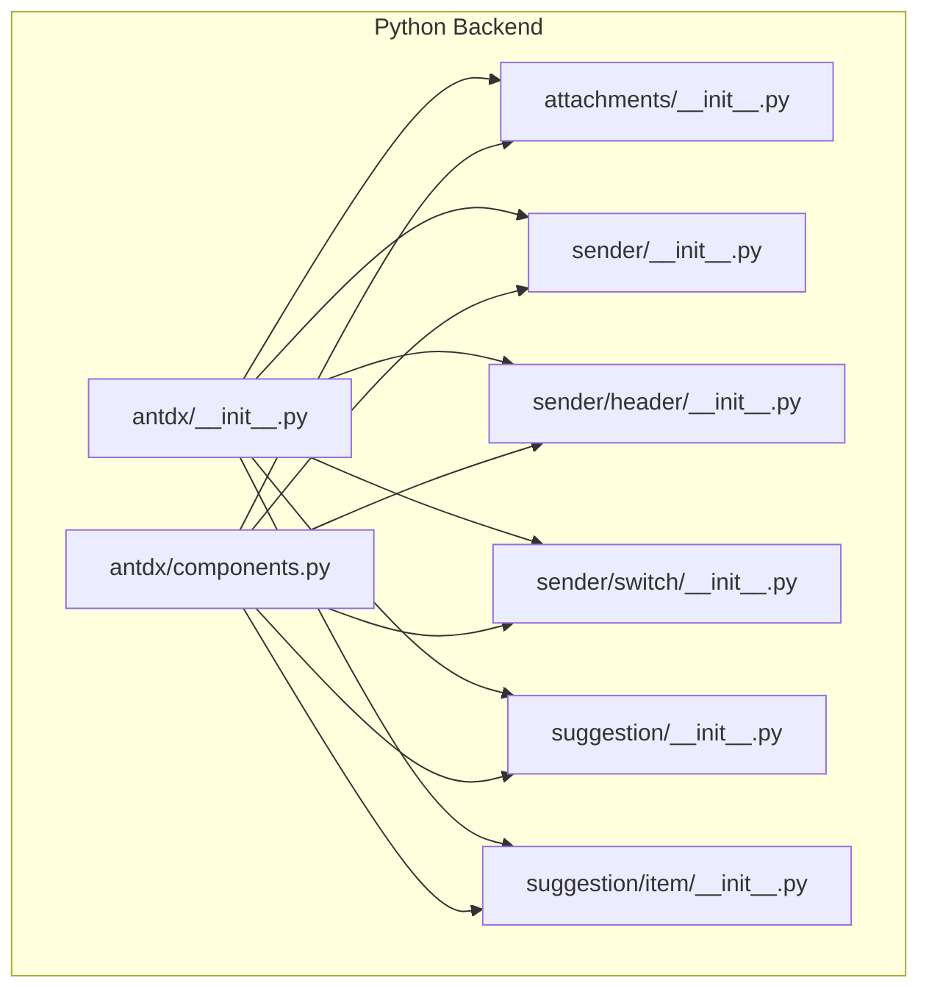
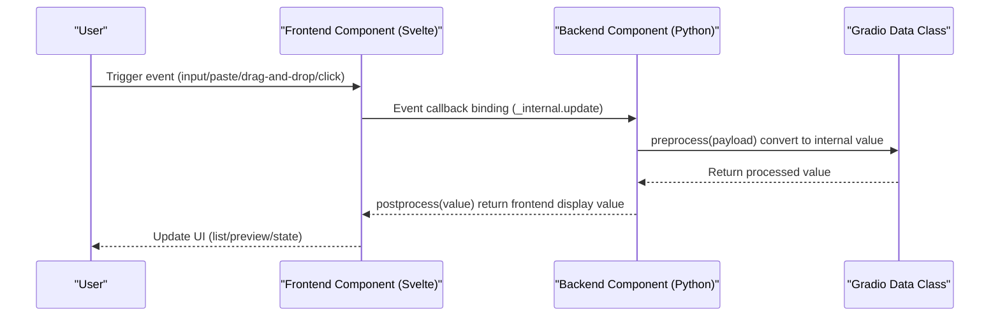
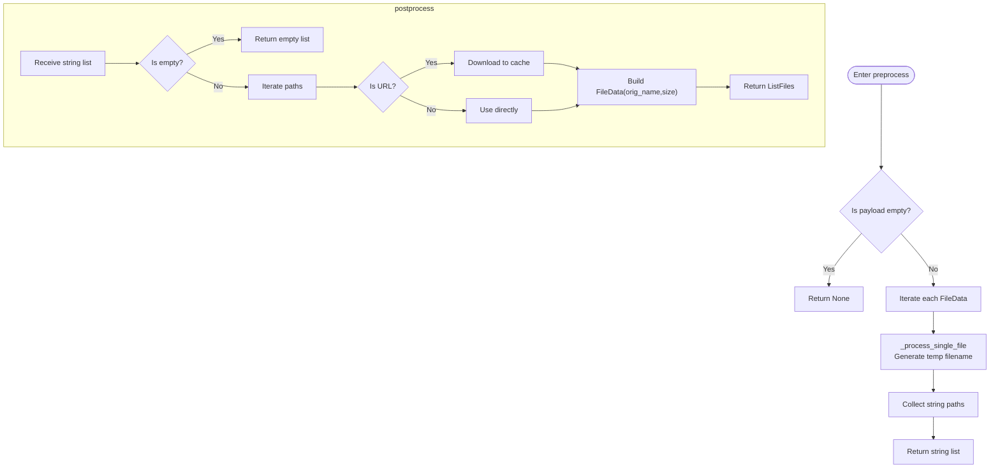
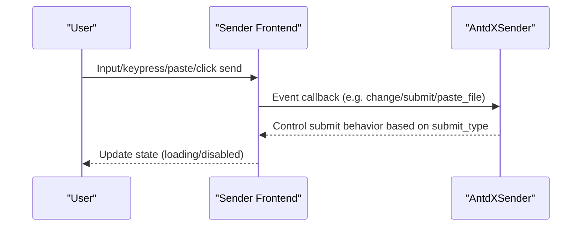
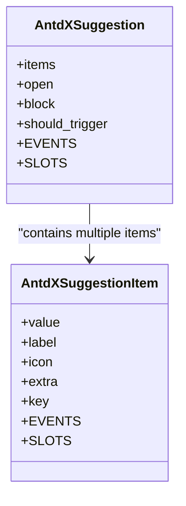
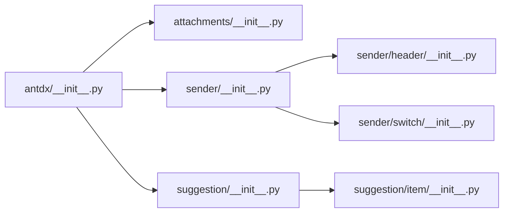

# Expression Components API

<cite>
**Files Referenced in This Document**
- [backend/modelscope_studio/components/antdx/__init__.py](file://backend/modelscope_studio/components/antdx/__init__.py)
- [backend/modelscope_studio/components/antdx/components.py](file://backend/modelscope_studio/components/antdx/components.py)
- [backend/modelscope_studio/components/antdx/attachments/__init__.py](file://backend/modelscope_studio/components/antdx/attachments/__init__.py)
- [backend/modelscope_studio/components/antdx/sender/__init__.py](file://backend/modelscope_studio/components/antdx/sender/__init__.py)
- [backend/modelscope_studio/components/antdx/sender/header/__init__.py](file://backend/modelscope_studio/components/antdx/sender/header/__init__.py)
- [backend/modelscope_studio/components/antdx/sender/switch/__init__.py](file://backend/modelscope_studio/components/antdx/sender/switch/__init__.py)
- [backend/modelscope_studio/components/antdx/suggestion/__init__.py](file://backend/modelscope_studio/components/antdx/suggestion/__init__.py)
- [backend/modelscope_studio/components/antdx/suggestion/item/__init__.py](file://backend/modelscope_studio/components/antdx/suggestion/item/__init__.py)
</cite>

## Table of Contents

1. [Introduction](#introduction)
2. [Project Structure](#project-structure)
3. [Core Components](#core-components)
4. [Architecture Overview](#architecture-overview)
5. [Component Details](#component-details)
6. [Dependency Analysis](#dependency-analysis)
7. [Performance Considerations](#performance-considerations)
8. [Troubleshooting Guide](#troubleshooting-guide)
9. [Conclusion](#conclusion)
10. [Appendix: Usage Examples and Best Practices](#appendix-usage-examples-and-best-practices)

## Introduction

This document is the Python API reference for Antdx expression components, focusing on the following capabilities:

- File attachment handling: Upload, drag-and-drop, download, preview, removal, type restrictions, and list display strategies
- Input and send control: Text input box management, submit types (Enter/Shift+Enter), paste and keyboard events, voice input toggle
- Multimodal input support: Extended header area, switch, and skill panel via Sender sub-components
- Quick commands: Suggestion component and its items' triggering, selection, and panel state management
- Chatbot integration: Data flow and interaction protocol based on Gradio data classes and event callbacks

## Project Structure

Antdx components reside in the backend Python package, exported through a unified entry point, and mapped to Svelte implementations in the frontend via corresponding directory mappings. The expression component-related modules are organized as follows:

- Top-level exports: `antdx/__init__.py` and `antdx/components.py` provide aggregated component exports
- Attachments: `antdx/attachments`
- Sender: `antdx/sender` (with header, switch sub-components)
- Suggestion: `antdx/suggestion` (with item sub-component)

Diagram Sources

- [backend/modelscope_studio/components/antdx/**init**.py:1-42](file://backend/modelscope_studio/components/antdx/__init__.py#L1-L42)
- [backend/modelscope_studio/components/antdx/components.py:1-40](file://backend/modelscope_studio/components/antdx/components.py#L1-L40)

Section Sources

- [backend/modelscope_studio/components/antdx/**init**.py:1-42](file://backend/modelscope_studio/components/antdx/__init__.py#L1-L42)
- [backend/modelscope_studio/components/antdx/components.py:1-40](file://backend/modelscope_studio/components/antdx/components.py#L1-L40)

## Core Components

- AntdXAttachments: File attachment upload and management, supports drag-and-drop, preview, download, removal, type filtering, list styles, placeholders, etc.
- AntdXSender: Input and send control, supports auto height, read-only, loading state, placeholder, submit type, voice input, file paste, keyboard events, etc.
- AntdXSenderHeader: Sender header area, supports expand/collapse, title, closable, etc.
- AntdXSenderSwitch: Built-in switch for Sender, supports checked/unchecked labels and icons
- AntdXSuggestion: Quick command suggestion panel, supports items list, open state, select event
- AntdXSuggestionItem: Suggestion item, supports label, icon, extra content, and other slots

Section Sources

- [backend/modelscope_studio/components/antdx/attachments/**init**.py:22-227](file://backend/modelscope_studio/components/antdx/attachments/__init__.py#L22-L227)
- [backend/modelscope_studio/components/antdx/sender/**init**.py:14-149](file://backend/modelscope_studio/components/antdx/sender/__init__.py#L14-L149)
- [backend/modelscope_studio/components/antdx/sender/header/**init**.py:8-74](file://backend/modelscope_studio/components/antdx/sender/header/__init__.py#L8-L74)
- [backend/modelscope_studio/components/antdx/sender/switch/**init**.py:8-81](file://backend/modelscope_studio/components/antdx/sender/switch/__init__.py#L8-L81)
- [backend/modelscope_studio/components/antdx/suggestion/**init**.py:11-86](file://backend/modelscope_studio/components/antdx/suggestion/__init__.py#L11-L86)
- [backend/modelscope_studio/components/antdx/suggestion/item/**init**.py:8-68](file://backend/modelscope_studio/components/antdx/suggestion/item/__init__.py#L8-L68)

## Architecture Overview

The frontend-backend interaction of expression components follows the Gradio data class and event model:

- Backend components define data models (e.g., ListFiles) and event listeners
- Frontend maps to the corresponding Svelte components based on FRONTEND_DIR
- Data format conversion between Python and frontend is done via preprocess/postprocess
- Event callbacks are bound to frontend events via `_internal.update`

Diagram Sources

- [backend/modelscope_studio/components/antdx/attachments/**init**.py:168-207](file://backend/modelscope_studio/components/antdx/attachments/__init__.py#L168-L207)
- [backend/modelscope_studio/components/antdx/sender/**init**.py:134-142](file://backend/modelscope_studio/components/antdx/sender/__init__.py#L134-L142)

## Component Details

### Attachments Component (AntdXAttachments)

- Key Features
  - Supports file upload, drag-and-drop upload, batch selection, maximum count limit
  - Supports file type filtering (accept), HTTP request parameters (headers, data, method)
  - Supports custom upload requests (custom_request), pre-upload hooks (before_upload)
  - List styles and overflow strategies (list_type, overflow), shows upload list by default
  - Placeholder and image preview enhancements (placeholder, imageProps.\*)
  - Events: change, drop, download, preview, remove
  - Slots: showUploadList._, iconRender, itemRender, placeholder._, imageProps.\*, etc.
- Data Flow
  - preprocess: Converts the ListFiles passed from the frontend to a local path string list
  - postprocess: Downloads local paths/URLs to the cache and packages them as ListFiles to return to the frontend
- File Handling Strategy
  - Remote URLs: Downloaded to cache directory
  - Local paths: Used directly
  - Preview: Uses Gradio FileData metadata (orig_name, size)

Diagram Sources

- [backend/modelscope_studio/components/antdx/attachments/**init**.py:162-207](file://backend/modelscope_studio/components/antdx/attachments/__init__.py#L162-L207)

Section Sources

- [backend/modelscope_studio/components/antdx/attachments/**init**.py:22-227](file://backend/modelscope_studio/components/antdx/attachments/__init__.py#L22-L227)

### Sender Component (AntdXSender)

- Key Features
  - Input box management: auto_size, placeholder, disabled, read_only, loading
  - Submit control: submit_type (enter or shiftEnter)
  - Events: change, submit, cancel, allow_speech_recording_change, key_down/key_press, focus/blur, paste/paste_file, skill_closable_close
  - Slots: suffix, header, prefix, footer, skill.\*, etc.
  - Sub-components: Header, Switch (for extending the header area and switch)
- Data Flow
  - preprocess/postprocess: Pass through string values
- Multimodal Input Support
  - allow_speech: Enable voice input (boolean or dict)
  - paste_file: File paste event
  - skill.\*: Skill panel title, tooltip, and closable icon

Diagram Sources

- [backend/modelscope_studio/components/antdx/sender/**init**.py:21-59](file://backend/modelscope_studio/components/antdx/sender/__init__.py#L21-L59)

Section Sources

- [backend/modelscope_studio/components/antdx/sender/**init**.py:14-149](file://backend/modelscope_studio/components/antdx/sender/__init__.py#L14-L149)

### Sender Header (AntdXSenderHeader)

- Key Features
  - Expand/collapse: open, closable
  - Title: title
  - Slots: title
- Usage
  - Used as a Sender sub-component for holding the header title and close button

Section Sources

- [backend/modelscope_studio/components/antdx/sender/header/**init**.py:8-74](file://backend/modelscope_studio/components/antdx/sender/header/__init__.py#L8-L74)

### Sender Switch (AntdXSenderSwitch)

- Key Features
  - Value: value (bool)
  - Labels and Icons: checked_children, un_checked_children, icon
  - States: disabled, loading
  - Slots: checkedChildren, unCheckedChildren, icon
- Usage
  - Used as a Sender sub-component for toggling certain send behaviors or modes

Section Sources

- [backend/modelscope_studio/components/antdx/sender/switch/**init**.py:8-81](file://backend/modelscope_studio/components/antdx/sender/switch/__init__.py#L8-L81)

### Suggestion Component (AntdXSuggestion) and Item (AntdXSuggestionItem)

- Suggestion Panel
  - items: Suggestion item list (string or dict)
  - Open state: open, block, should_trigger
  - Events: select, open_change
  - Slots: items, children
- Suggestion Item
  - label, icon, extra, key
  - Slots: label, icon, extra

Diagram Sources

- [backend/modelscope_studio/components/antdx/suggestion/**init**.py:11-86](file://backend/modelscope_studio/components/antdx/suggestion/__init__.py#L11-L86)
- [backend/modelscope_studio/components/antdx/suggestion/item/**init**.py:8-68](file://backend/modelscope_studio/components/antdx/suggestion/item/__init__.py#L8-L68)

Section Sources

- [backend/modelscope_studio/components/antdx/suggestion/**init**.py:11-86](file://backend/modelscope_studio/components/antdx/suggestion/__init__.py#L11-L86)
- [backend/modelscope_studio/components/antdx/suggestion/item/**init**.py:8-68](file://backend/modelscope_studio/components/antdx/suggestion/item/__init__.py#L8-L68)

## Dependency Analysis

- Component Aggregation
  - `antdx/__init__.py` and `antdx/components.py` uniformly export all sub-components for on-demand import by upper-level applications
- Component Cohesion
  - Each component independently defines EVENTS, SLOTS, FRONTEND_DIR with clear responsibilities
- Event Coupling
  - Frontend events are mapped to backend callbacks via EventListener and `_internal.update`
- Data Class Dependencies
  - The Attachments component uses Gradio ListFiles and FileData to ensure cross-platform data consistency

Diagram Sources

- [backend/modelscope_studio/components/antdx/**init**.py:1-42](file://backend/modelscope_studio/components/antdx/__init__.py#L1-L42)
- [backend/modelscope_studio/components/antdx/components.py:1-40](file://backend/modelscope_studio/components/antdx/components.py#L1-L40)

Section Sources

- [backend/modelscope_studio/components/antdx/**init**.py:1-42](file://backend/modelscope_studio/components/antdx/__init__.py#L1-L42)
- [backend/modelscope_studio/components/antdx/components.py:1-40](file://backend/modelscope_studio/components/antdx/components.py#L1-L40)

## Performance Considerations

- File Handling
  - Remote URL downloads should be combined with cache directories and async strategies to avoid blocking the main thread
  - Large file uploads should use chunked or server-side direct upload strategies
- Event Callbacks
  - Avoid heavy computations in callbacks for high-frequency events (e.g., change, key_down)
- UI Rendering
  - Enable virtualization (if applicable) during list rendering to reduce DOM nodes
  - Image preview and thumbnail generation should be done in background threads whenever possible

## Troubleshooting Guide

- Attachments Cannot Upload/Preview
  - Check that accept and headers/data/method configurations are correct
  - Confirm that custom_request and before_upload callbacks do not throw errors
- Remote Files Cannot Download
  - Check URL accessibility and with_credentials settings
  - Check cache directory permissions and disk space
- Sender Events Not Working
  - Confirm that submit_type and keyboard event bindings match
  - Check whether disabled/read_only/loading states are preventing interaction
- Suggestion Panel Not Showing
  - Check whether items is empty or the should_trigger condition is met
  - Confirm that open/open_change events are correctly bound

## Conclusion

Antdx expression components provide complete file attachment, input sending, and quick command capabilities through a clear event and slot system. Relying on Gradio data classes and the event model, flexible data conversion and interaction control can be performed on the Python side while maintaining a consistent frontend UI experience.

## Appendix: Usage Examples and Best Practices

- File Upload and Preview
  - Use AntdXAttachments' accept to restrict types; set headers and data for authentication and additional parameter passing
  - Control list styles and visibility via list_type and show_upload_list
  - Enhance image preview experience with preview_file and imageProps.\*
- Input and Send Control
  - Use submit_type to precisely control submit timing (enter/shiftEnter)
  - Extend the header area and toggle via Sender.Header and Sender.Switch
  - Handle file paste scenarios via paste/paste_file events
- Quick Commands
  - Control the suggestion panel using AntdXSuggestion's items and open
  - Enrich command display with AntdXSuggestionItem's label/icon/extra
- Integration with Chatbot
  - Use Sender's value as the message body, and the attachment list as multimodal input
  - Assemble the message body via event callbacks on the backend and call the bot API
  - Use preprocess/postprocess for message and file serialization/deserialization
