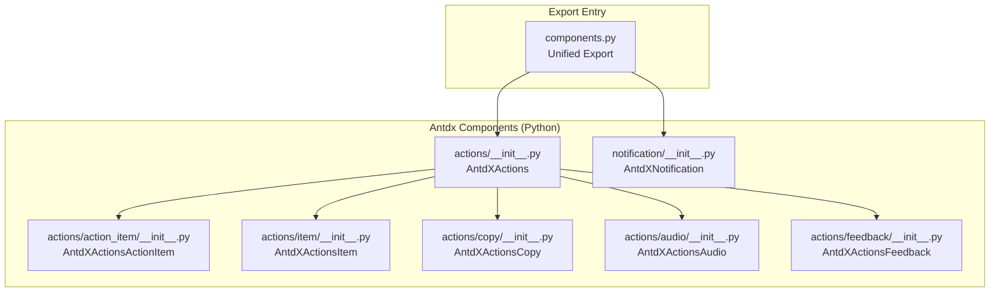
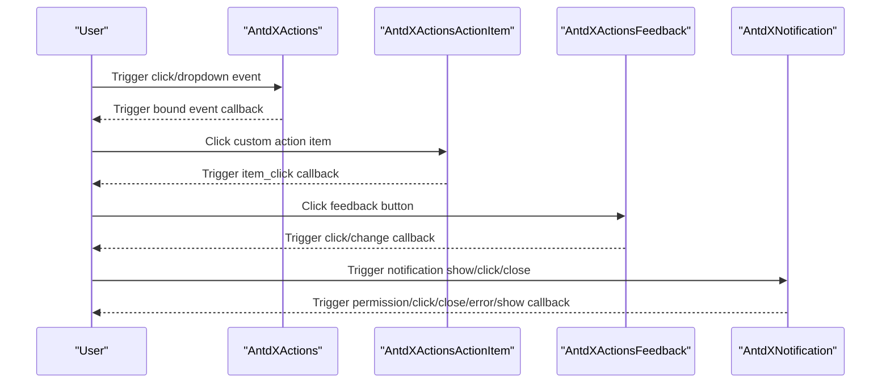
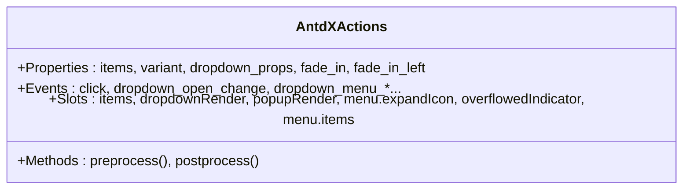
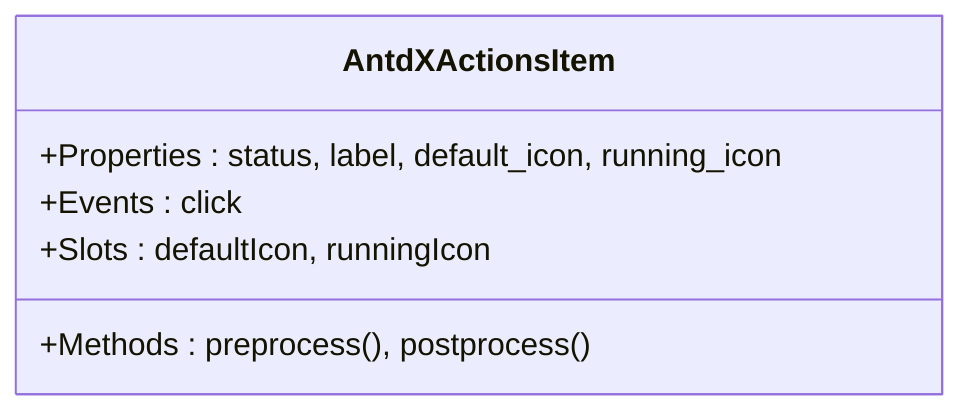
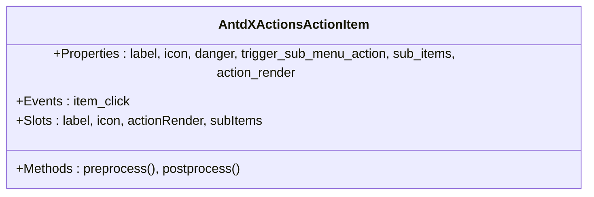
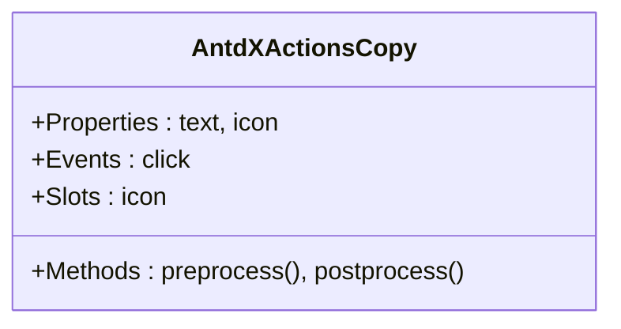
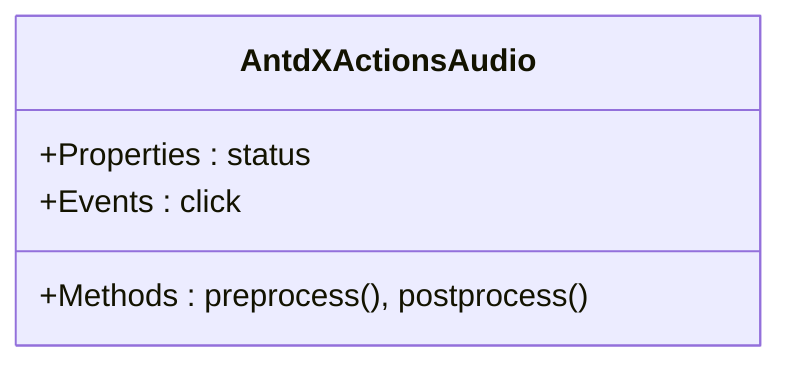
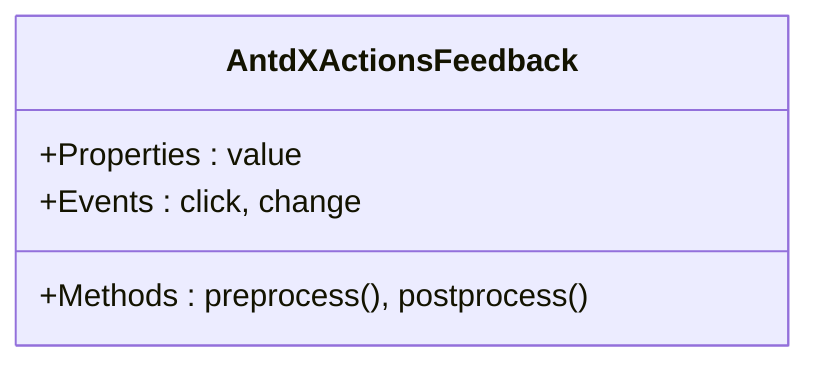
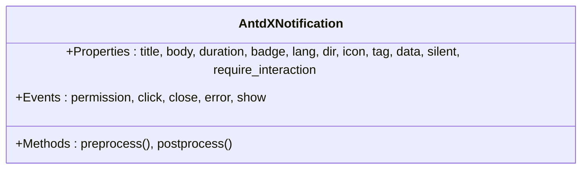
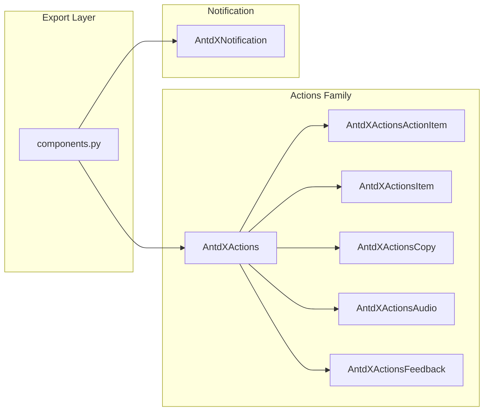

# Feedback Components API

<cite>
**Files Referenced in This Document**
- [actions/__init__.py](file://backend/modelscope_studio/components/antdx/actions/__init__.py)
- [action_item/__init__.py](file://backend/modelscope_studio/components/antdx/actions/action_item/__init__.py)
- [item/__init__.py](file://backend/modelscope_studio/components/antdx/actions/item/__init__.py)
- [copy/__init__.py](file://backend/modelscope_studio/components/antdx/actions/copy/__init__.py)
- [audio/__init__.py](file://backend/modelscope_studio/components/antdx/actions/audio/__init__.py)
- [feedback/__init__.py](file://backend/modelscope_studio/components/antdx/actions/feedback/__init__.py)
- [notification/__init__.py](file://backend/modelscope_studio/components/antdx/notification/__init__.py)
- [components.py](file://backend/modelscope_studio/components/antdx/components.py)
</cite>

## Table of Contents

1. [Introduction](#introduction)
2. [Project Structure](#project-structure)
3. [Core Components](#core-components)
4. [Architecture Overview](#architecture-overview)
5. [Detailed Component Analysis](#detailed-component-analysis)
6. [Dependency Analysis](#dependency-analysis)
7. [Performance Considerations](#performance-considerations)
8. [Troubleshooting Guide](#troubleshooting-guide)
9. [Conclusion](#conclusion)
10. [Appendix: Usage Examples and Best Practices](#appendix-usage-examples-and-best-practices)

## Introduction

This document is the Python API reference for Antdx feedback components, covering: the Actions component for action list management, action item configuration, and user interaction; ActionsItem for defining action items; ActionItem for specific action implementations; the Copy component for copy functionality; the Audio component for audio processing; the Feedback component for user feedback collection; and the Notification component for notification management, message push, and user feedback responses. The document also provides event handling strategies, state synchronization mechanisms, and user experience optimization configurations, along with reference solutions for chatbot integration and real-time user behavior feedback.

## Project Structure

Antdx feedback-related components reside in the backend Python package, organized by functional modules. Frontend resources are provided by Svelte components in the frontend directory. The Python layer exposes a unified interface to the application layer through Gradio component encapsulation and event binding.

**Diagram Sources**

- [components.py:1-40](file://backend/modelscope_studio/components/antdx/components.py#L1-L40)
- [actions/**init**.py:15-112](file://backend/modelscope_studio/components/antdx/actions/__init__.py#L15-L112)
- [action_item/**init**.py:10-80](file://backend/modelscope_studio/components/antdx/actions/action_item/__init__.py#L10-L80)
- [item/**init**.py:10-77](file://backend/modelscope_studio/components/antdx/actions/item/__init__.py#L10-L77)
- [copy/**init**.py:10-72](file://backend/modelscope_studio/components/antdx/actions/copy/__init__.py#L10-L72)
- [audio/**init**.py:10-71](file://backend/modelscope_studio/components/antdx/actions/audio/__init__.py#L10-L71)
- [feedback/**init**.py:10-74](file://backend/modelscope_studio/components/antdx/actions/feedback/__init__.py#L10-L74)
- [notification/**init**.py:10-97](file://backend/modelscope_studio/components/antdx/notification/__init__.py#L10-L97)

**Section Sources**

- [components.py:1-40](file://backend/modelscope_studio/components/antdx/components.py#L1-L40)

## Core Components

- AntdXActions: Action set container, supports event binding and slot extension, used to hold multiple action items and submenus.
- AntdXActionsActionItem: Custom action item, supports label, icon, danger style, trigger method, and sub-items.
- AntdXActionsItem: Standard action item, supports states (loading/running/error/default), icon switching, and style customization.
- AntdXActionsCopy: Copy action, bound to click event, supports custom icon and text.
- AntdXActionsAudio: Audio status indicator, supports state enumeration and style customization.
- AntdXActionsFeedback: Feedback component for like/dislike/default states, supports click and state change events.
- AntdXNotification: Notification component, supports permission, click, close, error, show events, and multilingual/direction attributes.

All of the above components inherit from a unified layout component base class, with Gradio-compatible event binding and rendering control capabilities.

**Section Sources**

- [actions/**init**.py:15-112](file://backend/modelscope_studio/components/antdx/actions/__init__.py#L15-L112)
- [action_item/**init**.py:10-80](file://backend/modelscope_studio/components/antdx/actions/action_item/__init__.py#L10-L80)
- [item/**init**.py:10-77](file://backend/modelscope_studio/components/antdx/actions/item/__init__.py#L10-L77)
- [copy/**init**.py:10-72](file://backend/modelscope_studio/components/antdx/actions/copy/__init__.py#L10-L72)
- [audio/**init**.py:10-71](file://backend/modelscope_studio/components/antdx/actions/audio/__init__.py#L10-L71)
- [feedback/**init**.py:10-74](file://backend/modelscope_studio/components/antdx/actions/feedback/__init__.py#L10-L74)
- [notification/**init**.py:10-97](file://backend/modelscope_studio/components/antdx/notification/__init__.py#L10-L97)

## Architecture Overview

Antdx feedback components are exposed at the Python layer as Gradio components; the frontend implements UI behavior and interaction through corresponding Svelte components. Components bind callbacks via event listeners to relay user operations to the backend for event delivery and state updates.

**Diagram Sources**

- [actions/**init**.py:26-46](file://backend/modelscope_studio/components/antdx/actions/__init__.py#L26-L46)
- [action_item/**init**.py:15-21](file://backend/modelscope_studio/components/antdx/actions/action_item/__init__.py#L15-L21)
- [feedback/**init**.py:15-23](file://backend/modelscope_studio/components/antdx/actions/feedback/__init__.py#L15-L23)
- [notification/**init**.py:14-30](file://backend/modelscope_studio/components/antdx/notification/__init__.py#L14-L30)

## Detailed Component Analysis

### Actions Component (AntdXActions)

- Responsibility: Serves as the action set container, managing action item lists, dropdown menu properties, and animation effects; supports event binding and slot extension.
- Key Properties
  - items: Action item array for initializing the action list.
  - variant: Appearance variant (e.g., borderless/outlined/filled).
  - dropdown_props: Dropdown menu related property object.
  - fade_in/fade_in_left: Entry animation toggles.
  - class_names/styles: Style class names and inline style mappings.
  - Slots: items, dropdownRender, popupRender, menu.expandIcon, overflowedIndicator, menu.items.
- Events
  - click: Triggered when any action item is clicked.
  - dropdown_open_change/dropdown_menu_open_change: Dropdown open/menu open state changes.
  - dropdown_menu_click/dropdown_menu_deselect/dropdown_menu_select: Menu item click/deselect/select events.
- Processing Flow
  - Internal binding flags are set at initialization so frontend events can be sent back to the backend.
  - During rendering, action items and menu structures are dynamically generated based on items and dropdown_props.
  - Custom rendering logic is extended through slots.

**Diagram Sources**

- [actions/**init**.py:58-94](file://backend/modelscope_studio/components/antdx/actions/__init__.py#L58-L94)

**Section Sources**

- [actions/**init**.py:15-112](file://backend/modelscope_studio/components/antdx/actions/__init__.py#L15-L112)

### ActionsItem (AntdXActionsItem)

- Responsibility: Standard action item, supports state switching and icon replacement.
- Key Properties
  - status: State enumeration (loading/error/running/default).
  - label: Display label.
  - default_icon/running_icon: Default icon and running icon.
  - class_names/styles: Style class names and inline style mappings.
  - Slots: defaultIcon, runningIcon.
- Events
  - click: Triggered when the item is clicked.
- Usage Recommendations
  - Use with the items field of the Actions component for batch configuration.
  - Customize icons and labels in different states through slots.

**Diagram Sources**

- [item/**init**.py:24-59](file://backend/modelscope_studio/components/antdx/actions/item/__init__.py#L24-L59)

**Section Sources**

- [item/**init**.py:10-77](file://backend/modelscope_studio/components/antdx/actions/item/__init__.py#L10-L77)

### ActionItem (AntdXActionsActionItem)

- Responsibility: Custom action item, supports label, icon, danger style, sub-items, and trigger method.
- Key Properties
  - label/icon: Label and icon.
  - danger: Whether to use danger style.
  - trigger_sub_menu_action: Sub-menu trigger method (hover/click).
  - sub_items: Sub-item array.
  - action_render: Custom rendering function identifier.
  - Slots: label, icon, actionRender, subItems.
- Events
  - item_click: Triggered when the custom action button is clicked.
- Usage Recommendations
  - Suitable for complex menus or scenarios requiring custom rendering.
  - Sub-items are injected via the subItems slot, forming a nested menu tree.

**Diagram Sources**

- [action_item/**init**.py:26-62](file://backend/modelscope_studio/components/antdx/actions/action_item/__init__.py#L26-L62)

**Section Sources**

- [action_item/**init**.py:10-80](file://backend/modelscope_studio/components/antdx/actions/action_item/__init__.py#L10-L80)

### Copy Component (AntdXActionsCopy)

- Responsibility: Provides one-click copy functionality, commonly used for copying code blocks, links, and other text.
- Key Properties
  - text: Text to be copied.
  - icon: Custom icon.
  - class_names/styles: Style class names and inline style mappings.
  - Slots: icon.
- Events
  - click: Triggered when the copy button is clicked.
- Usage Recommendations
  - Use in combination with ActionItem or ActionsItem to improve user operation efficiency.
  - Be mindful of browser permission and Clipboard API compatibility.

**Diagram Sources**

- [copy/**init**.py:24-54](file://backend/modelscope_studio/components/antdx/actions/copy/__init__.py#L24-L54)

**Section Sources**

- [copy/**init**.py:10-72](file://backend/modelscope_studio/components/antdx/actions/copy/__init__.py#L10-L72)

### Audio Component (AntdXActionsAudio)

- Responsibility: Audio status indicator for displaying recording/playback/loading/error states.
- Key Properties
  - status: State enumeration (loading/error/running/default).
  - class_names/styles: Style class names and inline style mappings.
  - Slots: None.
- Events
  - click: Triggered when the audio control is clicked.
- Usage Recommendations
  - Pair with recording/playback functionality to provide immediate status feedback.
  - Customize through styles to match the theme palette.

**Diagram Sources**

- [audio/**init**.py:24-53](file://backend/modelscope_studio/components/antdx/actions/audio/__init__.py#L24-L53)

**Section Sources**

- [audio/**init**.py:10-71](file://backend/modelscope_studio/components/antdx/actions/audio/__init__.py#L10-L71)

### Feedback Component (AntdXActionsFeedback)

- Responsibility: Collects user feedback on content/conversations, supports like/dislike/default states.
- Key Properties
  - value: Current feedback value (like/dislike/default).
  - class_names/styles: Style class names and inline style mappings.
  - Slots: None.
- Events
  - click: Triggered when the feedback button is clicked.
  - change: Triggered when the feedback state changes.
- Usage Recommendations
  - Pair with chatbot outputs or content cards to form a complete feedback loop.
  - Report data via the change event, combined with backend storage and statistics.

**Diagram Sources**

- [feedback/**init**.py:28-56](file://backend/modelscope_studio/components/antdx/actions/feedback/__init__.py#L28-L56)

**Section Sources**

- [feedback/**init**.py:10-74](file://backend/modelscope_studio/components/antdx/actions/feedback/__init__.py#L10-L74)

### Notification Component (AntdXNotification)

- Responsibility: System notification management, supports permission, click, close, error, show events, and internationalization/direction attributes.
- Key Properties
  - title/body: Title and body text.
  - duration: Display duration.
  - badge/lang/dir/icon/tag/data/silent/require_interaction: Badge, language, direction, icon, tag, data, silent mode, require interaction.
  - Slots: None.
- Events
  - permission/click/close/error/show: Permission request, click, close, error, show.
- Usage Recommendations
  - Used for system notifications, permission prompts, error alerts, and user feedback responses.
  - Combine with the Feedback component to form a "notification-feedback" closed loop.

**Diagram Sources**

- [notification/**init**.py:35-79](file://backend/modelscope_studio/components/antdx/notification/__init__.py#L35-L79)

**Section Sources**

- [notification/**init**.py:10-97](file://backend/modelscope_studio/components/antdx/notification/__init__.py#L10-L97)

## Dependency Analysis

- Unified Export: `components.py` centralizes all Antdx component exports for on-demand import by upper-level applications.
- Component Relationships: The Actions container combines ActionItem, Item, Copy, Audio, Feedback, and other sub-components; Notification exists independently and can work in conjunction with Feedback.

**Diagram Sources**

- [components.py:1-40](file://backend/modelscope_studio/components/antdx/components.py#L1-L40)
- [actions/**init**.py:15-25](file://backend/modelscope_studio/components/antdx/actions/__init__.py#L15-L25)
- [notification/**init**.py:10-13](file://backend/modelscope_studio/components/antdx/notification/__init__.py#L10-L13)

**Section Sources**

- [components.py:1-40](file://backend/modelscope_studio/components/antdx/components.py#L1-L40)

## Performance Considerations

- Minimize Event Binding: Only enable event binding when needed to avoid unnecessary callback overhead.
- Slot Rendering: Use slots wisely to reduce repeated rendering and keep the DOM structure concise.
- State Synchronization: Use component state and event linkage to avoid frequent full refreshes.
- Styles and Animation: Use entry animations and complex styles cautiously to ensure smooth performance on low-end devices.

## Troubleshooting Guide

- Events Not Triggering
  - Check that event bindings are correctly enabled (e.g., click, dropdown\_\*, item_click, change).
  - Confirm that frontend slot and property configurations match.
- State Inconsistency
  - Verify the value range and default value of value/status.
  - Check the state change logic in the change event.
- Style Issues
  - Check whether class_names/styles has overridden the default styles.
  - Confirm theme and global style conflicts.
- Notification Not Working
  - Check the handling flow for the permission event.
  - Confirm display duration and interaction requirement configurations.

**Section Sources**

- [actions/**init**.py:26-46](file://backend/modelscope_studio/components/antdx/actions/__init__.py#L26-L46)
- [action_item/**init**.py:15-21](file://backend/modelscope_studio/components/antdx/actions/action_item/__init__.py#L15-L21)
- [feedback/**init**.py:15-23](file://backend/modelscope_studio/components/antdx/actions/feedback/__init__.py#L15-L23)
- [notification/**init**.py:14-30](file://backend/modelscope_studio/components/antdx/notification/__init__.py#L14-L30)

## Conclusion

Antdx feedback components provide complete capabilities from action item management, copy and audio status indication to user feedback and notification management through a clear component layering and event binding mechanism. Combined with unified exports and slot extensions, developers can quickly build high-quality user feedback and interaction experiences across various scenarios.

## Appendix: Usage Examples and Best Practices

- User Operation Feedback
  - Add the Feedback component after content cards or conversation outputs, bind click and change events to report user preferences.
  - Example path: [feedback/**init**.py:15-23](file://backend/modelscope_studio/components/antdx/actions/feedback/__init__.py#L15-L23)
- Quick Actions
  - Use Actions to combine ActionItem and Item, configure subItems to form secondary menus; customize icons and labels through slots.
  - Example paths: [actions/**init**.py:48-56](file://backend/modelscope_studio/components/antdx/actions/__init__.py#L48-L56), [action_item/**init**.py:23-24](file://backend/modelscope_studio/components/antdx/actions/action_item/__init__.py#L23-L24)
- Audio Interaction
  - Use the Audio component to display recording/playback states, combined with the click event to control play/pause.
  - Example path: [audio/**init**.py:15-19](file://backend/modelscope_studio/components/antdx/actions/audio/__init__.py#L15-L19)
- Copy Functionality
  - Place the Copy component next to code blocks or links, bind the click event to improve copy efficiency.
  - Example path: [copy/**init**.py:15-19](file://backend/modelscope_studio/components/antdx/actions/copy/__init__.py#L15-L19)
- Notification Management
  - Use the Notification component for system prompts and permission alerts, bind permission/click/close/error/show events.
  - Example path: [notification/**init**.py:14-30](file://backend/modelscope_studio/components/antdx/notification/__init__.py#L14-L30)
- Integration with Chatbot
  - Insert the Feedback component after chat outputs, report user feedback through the change event; use Notification when needed for confirmation or error alerts.
  - Example paths: [feedback/**init**.py:15-23](file://backend/modelscope_studio/components/antdx/actions/feedback/__init__.py#L15-L23), [notification/**init**.py:14-30](file://backend/modelscope_studio/components/antdx/notification/__init__.py#L14-L30)
