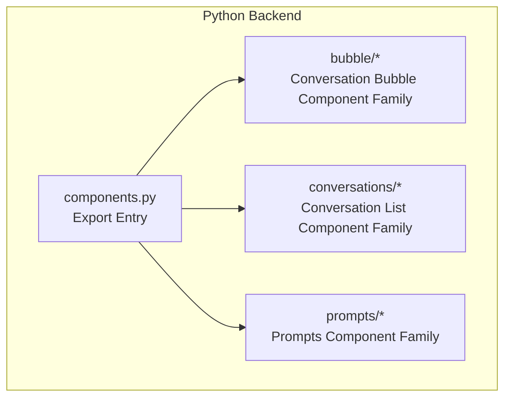
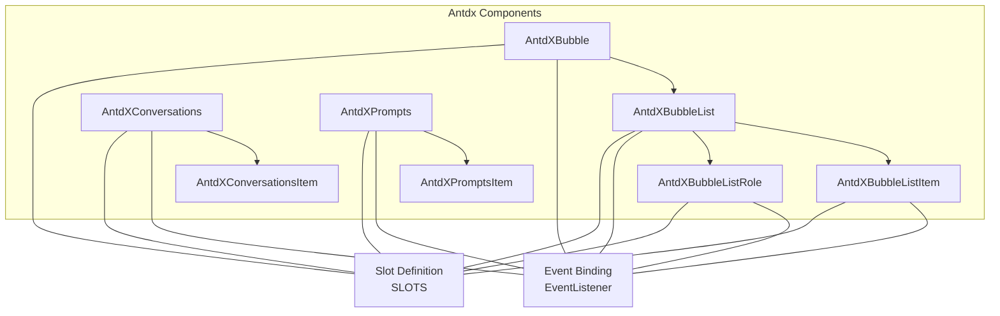
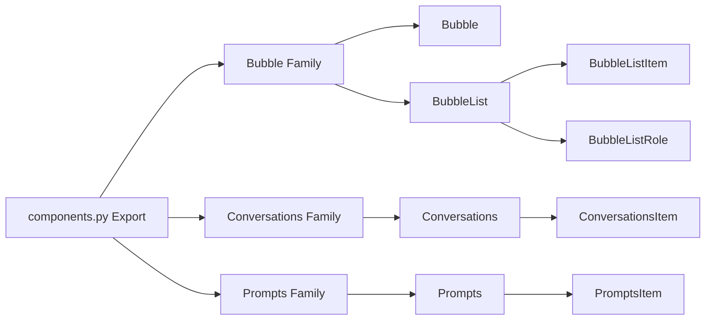

# General Components API

<cite>
**Files Referenced in This Document**
- [backend/modelscope_studio/components/antdx/components.py](file://backend/modelscope_studio/components/antdx/components.py)
- [backend/modelscope_studio/components/antdx/bubble/__init__.py](file://backend/modelscope_studio/components/antdx/bubble/__init__.py)
- [backend/modelscope_studio/components/antdx/bubble/list/__init__.py](file://backend/modelscope_studio/components/antdx/bubble/list/__init__.py)
- [backend/modelscope_studio/components/antdx/bubble/list/item/__init__.py](file://backend/modelscope_studio/components/antdx/bubble/list/item/__init__.py)
- [backend/modelscope_studio/components/antdx/bubble/list/role/__init__.py](file://backend/modelscope_studio/components/antdx/bubble/list/role/__init__.py)
- [backend/modelscope_studio/components/antdx/conversations/__init__.py](file://backend/modelscope_studio/components/antdx/conversations/__init__.py)
- [backend/modelscope_studio/components/antdx/conversations/item/__init__.py](file://backend/modelscope_studio/components/antdx/conversations/item/__init__.py)
- [backend/modelscope_studio/components/antdx/prompts/__init__.py](file://backend/modelscope_studio/components/antdx/prompts/__init__.py)
- [backend/modelscope_studio/components/antdx/prompts/item/__init__.py](file://backend/modelscope_studio/components/antdx/prompts/item/__init__.py)
- [docs/components/antdx/bubble/README-zh_CN.md](file://docs/components/antdx/bubble/README-zh_CN.md)
- [docs/components/antdx/conversations/README-zh_CN.md](file://docs/components/antdx/conversations/README-zh_CN.md)
- [docs/components/antdx/prompts/README-zh_CN.md](file://docs/components/antdx/prompts/README-zh_CN.md)
</cite>

## Table of Contents

1. [Introduction](#introduction)
2. [Project Structure](#project-structure)
3. [Core Components](#core-components)
4. [Architecture Overview](#architecture-overview)
5. [Detailed Component Analysis](#detailed-component-analysis)
6. [Dependency Analysis](#dependency-analysis)
7. [Performance Considerations](#performance-considerations)
8. [Troubleshooting Guide](#troubleshooting-guide)
9. [Conclusion](#conclusion)
10. [Appendix](#appendix)

## Introduction

This document is the Python API reference for Antdx general components, focusing on the following core components:

- Bubble: Conversation bubble rendering and interaction
- BubbleList: Message list management
- BubbleListItem: Message item processing
- BubbleListRole: Role identification
- Conversations: Conversation management, message storage, and state synchronization
- Prompts: Prompt template management, dynamic content rendering, and user interaction

The documentation provides constructor parameters, property definitions, event and slot (slots) specifications for each component, and gives standard component instantiation and composition patterns for typical AI scenarios, helping developers quickly build conversational systems, message display, and prompt management features.

## Project Structure

Antdx components reside in the backend Python package, wrapped through a unified layout component base class, and mapped to the corresponding frontend component directories. Component export entry points are centralized in `antdx/components.py` for on-demand import.

Diagram Sources

- [backend/modelscope_studio/components/antdx/components.py:1-40](file://backend/modelscope_studio/components/antdx/components.py#L1-L40)

Section Sources

- [backend/modelscope_studio/components/antdx/components.py:1-40](file://backend/modelscope_studio/components/antdx/components.py#L1-L40)

## Core Components

This section provides an overview of the three core component families and their responsibility boundaries:

- Bubble Family: Responsible for rendering and interaction of individual messages or role-level bubbles, supporting typing animation, editability, variants, shapes, etc.
- BubbleList Family: Responsible for scrolling, role grouping, and item rendering in message lists, supporting auto-scroll and role configuration.
- Conversations Family: Responsible for conversation list management, selection state toggling, menu operations, and creation buttons.
- Prompts Family: Responsible for displaying preset prompts and click interactions, supporting vertical arrangement, fade-in effects, line wrapping, etc.

Section Sources

- [backend/modelscope_studio/components/antdx/bubble/**init**.py:13-135](file://backend/modelscope_studio/components/antdx/bubble/__init__.py#L13-L135)
- [backend/modelscope_studio/components/antdx/bubble/list/**init**.py:12-84](file://backend/modelscope_studio/components/antdx/bubble/list/__init__.py#L12-L84)
- [backend/modelscope_studio/components/antdx/conversations/**init**.py:11-109](file://backend/modelscope_studio/components/antdx/conversations/__init__.py#L11-L109)
- [backend/modelscope_studio/components/antdx/prompts/**init**.py:11-88](file://backend/modelscope_studio/components/antdx/prompts/__init__.py#L11-L88)

## Architecture Overview

The diagram below shows the organization and dependency relationships of Antdx components at the Python layer:

Diagram Sources

- [backend/modelscope_studio/components/antdx/bubble/**init**.py:21-54](file://backend/modelscope_studio/components/antdx/bubble/__init__.py#L21-L54)
- [backend/modelscope_studio/components/antdx/bubble/list/**init**.py:19-30](file://backend/modelscope_studio/components/antdx/bubble/list/__init__.py#L19-L30)
- [backend/modelscope_studio/components/antdx/bubble/list/item/**init**.py:14-47](file://backend/modelscope_studio/components/antdx/bubble/list/item/__init__.py#L14-L47)
- [backend/modelscope_studio/components/antdx/bubble/list/role/**init**.py:14-46](file://backend/modelscope_studio/components/antdx/bubble/list/role/__init__.py#L14-L46)
- [backend/modelscope_studio/components/antdx/conversations/**init**.py:18-47](file://backend/modelscope_studio/components/antdx/conversations/__init__.py#L18-L47)
- [backend/modelscope_studio/components/antdx/prompts/**init**.py:18-26](file://backend/modelscope_studio/components/antdx/prompts/__init__.py#L18-L26)

## Detailed Component Analysis

### Bubble Component

- Component Purpose: Used to render a single conversation bubble, supports multiple appearance variants, shapes, typing animation, editability, avatar, header/footer, extra area, loading, and custom content rendering.
- Key Properties (constructor parameters)
  - content: Bubble content text
  - avatar: Avatar URL or placeholder
  - extra: Additional elements
  - footer/header: Footer/header content
  - loading: Whether to show loading state
  - placement: Alignment position (start/end)
  - editable: Whether editable (boolean or dict)
  - shape: Bubble shape (round/corner/default)
  - typing: Typing animation (bool/dict/string)
  - streaming: Streaming render toggle
  - variant: Appearance variant (filled/borderless/outlined/shadow)
  - footer_placement: Footer position (outside/inside-start/end)
  - loading_render/content_render: Custom loading and content rendering
  - class_names/styles/root_class_name: Style and class name control
  - Other general properties: visible, elem_id, elem_classes, elem_style, render, etc.
- Events
  - typing: Typing animation callback
  - typing_complete: Typing complete callback; triggers immediately on render if typing is not set
  - edit_confirm: Edit confirmation callback
  - edit_cancel: Edit cancellation callback
- Slots
  - avatar, editable.okText, editable.cancelText, content, footer, header, extra, loadingRender, contentRender
- Nested Sub-components
  - List: Message list container
  - System: System message bubble
  - Divider: Divider line

Section Sources

- [backend/modelscope_studio/components/antdx/bubble/**init**.py:56-116](file://backend/modelscope_studio/components/antdx/bubble/__init__.py#L56-L116)
- [backend/modelscope_studio/components/antdx/bubble/**init**.py:21-54](file://backend/modelscope_studio/components/antdx/bubble/__init__.py#L21-L54)

### BubbleList Component

- Component Purpose: Message list container, responsible for scrolling, role grouping, and item rendering, supports auto-scroll and role configuration.
- Key Properties
  - items: Message item array (dict)
  - role: Role configuration (dict)
  - auto_scroll: Whether to auto-scroll to the bottom
  - class_names/styles/root_class_name: Style and class name control
  - Other general properties: visible, elem_id, elem_classes, elem_style, render, etc.
- Events
  - scroll: List scroll callback
- Slots
  - items, role
- Nested Sub-components
  - Item: Message item
  - Role: Role identifier

Section Sources

- [backend/modelscope_studio/components/antdx/bubble/list/**init**.py:32-64](file://backend/modelscope_studio/components/antdx/bubble/list/__init__.py#L32-L64)
- [backend/modelscope_studio/components/antdx/bubble/list/**init**.py:19-30](file://backend/modelscope_studio/components/antdx/bubble/list/__init__.py#L19-L30)

### BubbleListItem Component

- Component Purpose: A single item in the message list, behaves essentially the same as Bubble but used as a list item.
- Key Properties
  - content, avatar, extra, footer, header, loading, placement, editable, shape, typing, streaming, variant, footer_placement, loading_render, content_render, class_names/styles/root_class_name, etc.
- Events
  - typing, typing_complete, edit_confirm, edit_cancel
- Slots
  - avatar, editable.okText, editable.cancelText, content, footer, header, extra, loadingRender, contentRender

Section Sources

- [backend/modelscope_studio/components/antdx/bubble/list/item/**init**.py:49-108](file://backend/modelscope_studio/components/antdx/bubble/list/item/__init__.py#L49-L108)
- [backend/modelscope_studio/components/antdx/bubble/list/item/**init**.py:14-47](file://backend/modelscope_studio/components/antdx/bubble/list/item/__init__.py#L14-L47)

### BubbleListRole Component

- Component Purpose: Used to identify roles in lists, supports role avatar, header/footer, extra area, loading, and custom content rendering.
- Key Properties
  - role: Role identifier text
  - avatar, extra, footer, header, loading, placement, editable, shape, typing, streaming, variant, footer_placement, loading_render, content_render, class_names/styles/root_class_name, etc.
- Events
  - typing, typing_complete, edit_confirm, edit_cancel
- Slots
  - avatar, editable.okText, editable.cancelText, footer, header, extra, loadingRender, contentRender

Section Sources

- [backend/modelscope_studio/components/antdx/bubble/list/role/**init**.py:48-107](file://backend/modelscope_studio/components/antdx/bubble/list/role/__init__.py#L48-L107)
- [backend/modelscope_studio/components/antdx/bubble/list/role/**init**.py:14-46](file://backend/modelscope_studio/components/antdx/bubble/list/role/__init__.py#L14-L46)

### Conversations Component

- Component Purpose: For managing and viewing conversation lists, supports selection state toggling, menu operations, grouping, keyboard shortcuts, and creation buttons.
- Key Properties
  - active_key/default_active_key: Current active item key
  - items: Conversation item array (dict)
  - menu: Menu configuration (string or dict)
  - groupable: Whether groupable (boolean or dict)
  - shortcut_keys: Keyboard shortcut mappings
  - creation: Create button configuration (dict)
  - styles/class_names/root_class_name: Style and class name control
  - Other general properties: visible, elem_id, elem_classes, elem_style, render, etc.
- Events
  - active_change: Selection change callback
  - menu_click/menu_deselect/menu_open_change/menu_select: Menu-related callbacks
  - groupable_expand: Group expand callback
  - creation_click: Create button click callback
- Slots
  - menu.expandIcon, menu.overflowedIndicator, menu.trigger, groupable.label, items, creation.icon, creation.label
- Nested Sub-components
  - Item: Conversation item

Section Sources

- [backend/modelscope_studio/components/antdx/conversations/**init**.py:49-89](file://backend/modelscope_studio/components/antdx/conversations/__init__.py#L49-L89)
- [backend/modelscope_studio/components/antdx/conversations/**init**.py:18-47](file://backend/modelscope_studio/components/antdx/conversations/__init__.py#L18-L47)

### ConversationsItem Component

- Component Purpose: A single item in the conversation list, supports label, icon, type, group, disabled, dashed, etc.
- Key Properties
  - label: Label text
  - key: Unique key
  - type: Type (e.g., divider)
  - group: Belonging group
  - icon: Icon
  - disabled: Whether disabled
  - dashed: Whether dashed
  - additional_props/as_item/\_internal: Internal and extension properties
  - Other general properties: visible, elem_id, elem_classes, elem_style, render, etc.

Section Sources

- [backend/modelscope_studio/components/antdx/conversations/item/**init**.py:21-55](file://backend/modelscope_studio/components/antdx/conversations/item/__init__.py#L21-L55)

### Prompts Component

- Component Purpose: For displaying preset prompts, supports title, vertical arrangement, fade-in effect, line wrapping, etc.
- Key Properties
  - items: Prompt item array (dict)
  - prefix_cls: Prefix class name
  - title: Title
  - vertical: Whether vertically arranged
  - fade_in/fade_in_left: Fade-in effect (left/right)
  - wrap: Whether to wrap
  - styles/class_names/root_class_name: Style and class name control
  - Other general properties: visible, elem_id, elem_classes, elem_style, render, etc.
- Events
  - item_click: Prompt item click callback
- Slots
  - title, items
- Nested Sub-components
  - Item: Prompt item

Section Sources

- [backend/modelscope_studio/components/antdx/prompts/**init**.py:28-68](file://backend/modelscope_studio/components/antdx/prompts/__init__.py#L28-L68)
- [backend/modelscope_studio/components/antdx/prompts/**init**.py:18-26](file://backend/modelscope_studio/components/antdx/prompts/__init__.py#L18-L26)

### PromptsItem Component

- Component Purpose: A single item in the prompt list, supports label, description, icon, disabled, and key.
- Key Properties
  - label: Label text
  - key: Unique key
  - description: Description text
  - icon: Icon
  - disabled: Whether disabled
  - additional_props/as_item/\_internal: Internal and extension properties
  - Other general properties: visible, elem_id, elem_classes, elem_style, render, etc.

Section Sources

- [backend/modelscope_studio/components/antdx/prompts/item/**init**.py:18-48](file://backend/modelscope_studio/components/antdx/prompts/item/__init__.py#L18-L48)

## Dependency Analysis

- Component Export: All antdx components are centrally exported through `components.py` for unified import and use.
- Component Hierarchy: The Bubble family (Bubble, BubbleList, BubbleListItem, BubbleListRole) forms a complete message rendering chain; the Conversations family and Prompts family handle conversation management and prompt management respectively.
- Events and Slots: Each component defines EVENTS and SLOTS lists to declare supported event callbacks and slot names, ensuring consistency between frontend and backend conventions.

Diagram Sources

- [backend/modelscope_studio/components/antdx/components.py:1-40](file://backend/modelscope_studio/components/antdx/components.py#L1-L40)

Section Sources

- [backend/modelscope_studio/components/antdx/components.py:1-40](file://backend/modelscope_studio/components/antdx/components.py#L1-L40)

## Performance Considerations

- Streaming Rendering and Typing Animation: Use streaming and typing parameters wisely to avoid stuttering when rendering large numbers of messages simultaneously.
- Auto-scroll: It is recommended to enable auto_scroll in BubbleList when messages are frequently updated to maintain the best user experience.
- Slots and Custom Rendering: Although loadingRender and contentRender are flexible, avoid heavy computations in rendering functions; cache results when necessary.
- Event Binding: Only enable relevant event bindings when needed (e.g., typing_complete) to reduce unnecessary callback overhead.
- Appearance and Shape: variant and shape affect rendering complexity; choose based on actual needs.

## Troubleshooting Guide

- Events Not Triggering
  - Check that the binding names in EVENTS are correct, and confirm that the frontend has the corresponding `bind_*` events enabled.
  - Confirm whether the visible and render states of the component affect event propagation.
- Slot Content Not Displaying
  - Confirm that the slot name spelling matches the SLOTS list.
  - Check whether the slot scope matches the slot content passed from the parent component.
- Style Issues
  - Use class_names/styles/root_class_name for local overrides to avoid global style conflicts.
- Scroll Problems
  - BubbleList's auto_scroll is related to the external container height setting; check container height and overflow settings.
- Typing Animation Not Working
  - Confirm the type and value range of the typing parameter; avoid passing unsupported types.

## Conclusion

Antdx general components provide complete capabilities from message rendering and list management to conversation and prompt management. Through unified event and slot conventions, developers can quickly build conversational systems and prompt panels, and achieve high-performance, maintainable frontend experiences by combining style and interaction configurations.

## Appendix

### Typical Scenarios and Instantiation Paths

- Conversation Bubble Basic Rendering and Typing Animation
  - Reference path: [docs/components/antdx/bubble/README-zh_CN.md:7-12](file://docs/components/antdx/bubble/README-zh_CN.md#L7-L12)
- Message List and Auto-scroll
  - Reference path: [docs/components/antdx/bubble/README-zh_CN.md:10-12](file://docs/components/antdx/bubble/README-zh_CN.md#L10-L12)
- Conversation List and Menu Operations
  - Reference path: [docs/components/antdx/conversations/README-zh_CN.md:7-9](file://docs/components/antdx/conversations/README-zh_CN.md#L7-L9)
- Prompt Panel and Nested Usage
  - Reference path: [docs/components/antdx/prompts/README-zh_CN.md:7-8](file://docs/components/antdx/prompts/README-zh_CN.md#L7-L8)

### Data Formats and Field Descriptions (Summary)

- Bubble/BubbleListItem/BubbleListRole
  - content, avatar, extra, footer, header, loading, placement, editable, shape, typing, streaming, variant, footer_placement, loading_render, content_render, class_names, styles, root_class_name
- BubbleList
  - items, role, auto_scroll, class_names, styles, root_class_name
- Conversations
  - active_key, default_active_key, items, menu, groupable, shortcut_keys, creation, styles, class_names, root_class_name
- ConversationsItem
  - label, key, type, group, icon, disabled, dashed, additional_props, as_item, \_internal
- Prompts
  - items, prefix_cls, title, vertical, fade_in, fade_in_left, wrap, styles, class_names, root_class_name
- PromptsItem
  - label, key, description, icon, disabled, additional_props, as_item, \_internal
