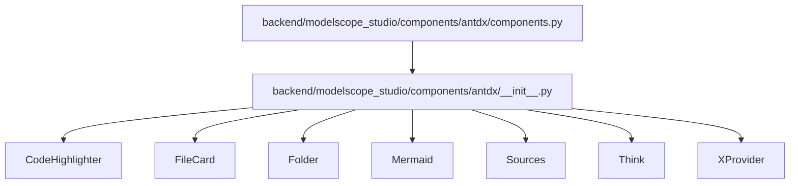
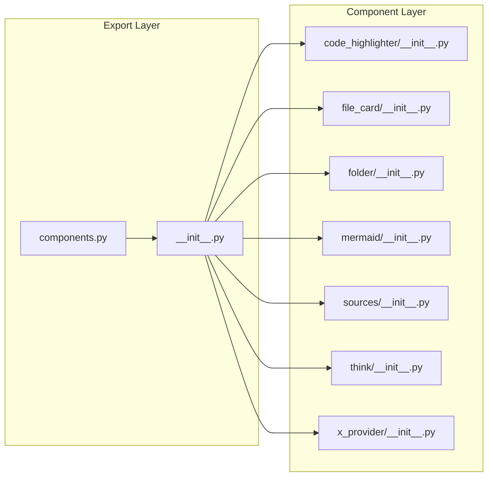

# Utility Components API

<cite>
**Files Referenced in This Document**
- [components.py](file://backend/modelscope_studio/components/antdx/components.py)
- [__init__.py](file://backend/modelscope_studio/components/antdx/__init__.py)
- [code_highlighter/__init__.py](file://backend/modelscope_studio/components/antdx/code_highlighter/__init__.py)
- [file_card/__init__.py](file://backend/modelscope_studio/components/antdx/file_card/__init__.py)
- [folder/__init__.py](file://backend/modelscope_studio/components/antdx/folder/__init__.py)
- [mermaid/__init__.py](file://backend/modelscope_studio/components/antdx/mermaid/__init__.py)
- [sources/__init__.py](file://backend/modelscope_studio/components/antdx/sources/__init__.py)
- [think/__init__.py](file://backend/modelscope_studio/components/antdx/think/__init__.py)
- [x_provider/__init__.py](file://backend/modelscope_studio/components/antdx/x_provider/__init__.py)
</cite>

## Table of Contents

1. [Introduction](#introduction)
2. [Project Structure](#project-structure)
3. [Core Components](#core-components)
4. [Architecture Overview](#architecture-overview)
5. [Detailed Component Analysis](#detailed-component-analysis)
6. [Dependency Analysis](#dependency-analysis)
7. [Performance Considerations](#performance-considerations)
8. [Troubleshooting Guide](#troubleshooting-guide)
9. [Conclusion](#conclusion)
10. [Appendix: Usage Examples and Best Practices](#appendix-usage-examples-and-best-practices)

## Introduction

This document is the Python API reference for Antdx utility components, covering the complete API specifications and usage instructions for the following components:

- CodeHighlighter: Code syntax highlighting
- FileCard: File card display (with List sub-component)
- Folder: Folder tree structure (with directory icon and tree node sub-components)
- Mermaid: Diagram rendering
- Sources: Source reference management (with item sub-component)
- Think: Thought annotation
- XProvider: Global configuration container

The document systematically covers constructor parameters, property definitions, events and slots, data processing and formatting options, style and class name customization, as well as performance and rendering strategies, and provides standard usage examples and extension recommendations.

## Project Structure

Antdx components reside in the backend Python package, wrapped through a unified layout component base class for frontend components, with exported aliases for direct use. The core entry is in antdx's `__init__.py`, and `components.py` handles aggregated exports.

Diagram Sources

- [components.py:1-40](file://backend/modelscope_studio/components/antdx/components.py#L1-L40)
- [**init**.py:14-41](file://backend/modelscope_studio/components/antdx/__init__.py#L14-L41)

Section Sources

- [components.py:1-40](file://backend/modelscope_studio/components/antdx/components.py#L1-L40)
- [**init**.py:14-41](file://backend/modelscope_studio/components/antdx/__init__.py#L14-L41)

## Core Components

This section provides an overview of the responsibilities and general features of each component:

- All inherit from the unified layout component base class, with general properties for visibility, element ID, class names, inline styles, and render toggle.
- Most components declare supported slots (SLOTS) and events (EVENTS) for frontend rendering and interaction binding.
- Most components set skip_api to True, indicating they do not participate in standard API serialization and are rendered directly by the frontend.

Section Sources

- [code_highlighter/**init**.py:6-71](file://backend/modelscope_studio/components/antdx/code_highlighter/__init__.py#L6-L71)
- [file_card/**init**.py:11-112](file://backend/modelscope_studio/components/antdx/file_card/__init__.py#L11-L112)
- [folder/**init**.py:12-114](file://backend/modelscope_studio/components/antdx/folder/__init__.py#L12-L114)
- [mermaid/**init**.py:8-77](file://backend/modelscope_studio/components/antdx/mermaid/__init__.py#L8-L77)
- [sources/**init**.py:11-92](file://backend/modelscope_studio/components/antdx/sources/__init__.py#L11-L92)
- [think/**init**.py:8-79](file://backend/modelscope_studio/components/antdx/think/__init__.py#L8-L79)
- [x_provider/**init**.py:10-101](file://backend/modelscope_studio/components/antdx/x_provider/__init__.py#L10-L101)

## Architecture Overview

The diagram below shows the encapsulation relationship and export paths of Python layer to frontend components:

```mermaid
classDiagram
class AntdXCodeHighlighter {
+Constructor Parameters : value, lang, header, highlight_props, prism_light_mode, styles, class_names, additional_props, root_class_name, as_item, visible, elem_id, elem_classes, elem_style, render
+Properties : SLOTS, EVENTS, skip_api
+Methods : preprocess(), postprocess(), example_payload(), example_value()
}
class AntdXFileCard {
+Constructor Parameters : image_props, filename, byte, size, description, loading, type, src, mask, icon, video_props, audio_props, spin_props, styles, class_names, additional_props, as_item, visible, elem_id, elem_classes, elem_style, render
+Properties : SLOTS, EVENTS(List), skip_api
+Methods : preprocess(), postprocess(), example_payload(), example_value()
}
class AntdXFolder {
+Constructor Parameters : tree_data, selectable, selected_file, default_selected_file, directory_tree_width, empty_render, preview_render, expanded_paths, default_expanded_paths, default_expand_all, directory_title, preview_title, directory_icons, styles, class_names, additional_props, as_item, visible, elem_id, elem_classes, elem_style, render
+Properties : SLOTS, EVENTS, TreeNode, DirectoryIcon, skip_api
+Methods : preprocess(), postprocess(), example_payload(), example_value()
}
class AntdXMermaid {
+Constructor Parameters : value, highlight_props, config, actions, prefix_cls, styles, class_names, additional_props, root_class_name, as_item, visible, elem_id, elem_classes, elem_style, render
+Properties : SLOTS, EVENTS, skip_api
+Methods : preprocess(), postprocess(), example_payload(), example_value()
}
class AntdXSources {
+Constructor Parameters : title, items, expand_icon_position, default_expanded, expanded, inline, active_key, popover_overlay_width, styles, class_names, additional_props, as_item, visible, elem_id, elem_classes, elem_style, render
+Properties : SLOTS, EVENTS(Item), skip_api
+Methods : preprocess(), postprocess(), example_payload(), example_value()
}
class AntdXThink {
+Constructor Parameters : icon, styles, class_names, loading, title, root_class_name, default_expanded, expanded, blink, as_item, visible, elem_id, elem_classes, elem_style, render
+Properties : SLOTS, EVENTS, skip_api
+Methods : preprocess(), postprocess(), example_payload(), example_value()
}
class AntdXXProvider {
+Constructor Parameters : component_disabled, component_size, csp, direction, get_popup_container, get_target_container, icon_prefix_cls, locale, popup_match_select_width, popup_overflow, prefix_cls, render_empty, theme, theme_config, variant, virtual, warning, styles, class_names, additional_props, as_item, visible, elem_id, elem_classes, elem_style, render
+Properties : SLOTS, EVENTS, skip_api
+Methods : preprocess(), postprocess(), example_payload(), example_value()
}
```

Diagram Sources

- [code_highlighter/**init**.py:6-71](file://backend/modelscope_studio/components/antdx/code_highlighter/__init__.py#L6-L71)
- [file_card/**init**.py:11-112](file://backend/modelscope_studio/components/antdx/file_card/__init__.py#L11-L112)
- [folder/**init**.py:12-114](file://backend/modelscope_studio/components/antdx/folder/__init__.py#L12-L114)
- [mermaid/**init**.py:8-77](file://backend/modelscope_studio/components/antdx/mermaid/__init__.py#L8-L77)
- [sources/**init**.py:11-92](file://backend/modelscope_studio/components/antdx/sources/__init__.py#L11-L92)
- [think/**init**.py:8-79](file://backend/modelscope_studio/components/antdx/think/__init__.py#L8-L79)
- [x_provider/**init**.py:10-101](file://backend/modelscope_studio/components/antdx/x_provider/__init__.py#L10-L101)

## Detailed Component Analysis

### CodeHighlighter (Code Syntax Highlighting)

- Component Purpose: For highlighting code snippets, supports language and theme mode configurations.
- Key Parameters
  - value: Code string to highlight
  - lang: Language identifier
  - header: Title or boolean control
  - highlight_props: Highlight-related configuration
  - prism_light_mode: Light mode toggle
  - styles/class_names/additional_props/root_class_name/as_item: Style and class names, additional properties, root class name, as item
  - visible/elem_id/elem_classes/elem_style/render: General layout properties
- Slots: header
- Events: None
- Data Processing: skip_api is True, not participating in standard API; preprocess/postprocess return original value
- Performance: Direct frontend rendering, avoids extra serialization overhead

Section Sources

- [code_highlighter/**init**.py:6-71](file://backend/modelscope_studio/components/antdx/code_highlighter/__init__.py#L6-L71)

### FileCard (File Card)

- Component Purpose: Displays file information, supports multiple types including image, audio, video, and ordinary files, configurable size, loading state, mask, and media properties.
- Key Parameters
  - image_props: Image preview related properties
  - filename: File name
  - byte: Byte count
  - size: Size small/default
  - description: Description text
  - loading: Whether to show loading state
  - type: Type image/file/audio/video or custom string
  - src: Resource URL (supports string or dict containing path/url)
  - mask: Mask text
  - icon: Built-in icon category or custom string
  - video_props/audio_props/spin_props: Video/audio/loading indicator configurations
  - styles/class_names/additional_props/as_item/visible/elem_id/elem_classes/elem_style/render: General layout properties
- Slots: imageProps.placeholder, imageProps.preview.mask, imageProps.preview.closeIcon, imageProps.preview.toolbarRender, imageProps.preview.imageRender, description, icon, mask, spinProps.icon, spinProps.description, spinProps.indicator
- Events: click (bound to internal event)
- Data Processing: skip_api is True; preprocess/postprocess return original value; src supports static file service wrapping
- Performance: Direct frontend rendering; src field automatically handles static resource paths

Section Sources

- [file_card/**init**.py:11-112](file://backend/modelscope_studio/components/antdx/file_card/__init__.py#L11-L112)

### Folder (Folder Tree Structure)

- Component Purpose: Displays folder tree and selection/expansion behavior, supports preview rendering, empty state rendering, directory icons, etc.
- Key Parameters
  - tree_data: Tree data
  - selectable: Whether selectable
  - selected_file/default_selected_file: Selected file list
  - directory_tree_width: Directory tree width
  - empty_render/preview_render: Empty state and preview rendering
  - expanded_paths/default_expanded_paths/default_expand_all: Expansion path control
  - directory_title/preview_title: Titles
  - directory_icons: Directory icon mappings
  - styles/class_names/additional_props/root_class_name/as_item/visible/elem_id/elem_classes/elem_style/render: General layout properties
- Sub-components: TreeNode, DirectoryIcon
- Slots: emptyRender, previewRender, directoryTitle, previewTitle, treeData, directoryIcons
- Events: file_click, folder_click, selected_file_change, expanded_paths_change, file_content_service_load_file_content (bound to internal events)
- Data Processing: skip_api is True; preprocess/postprocess return original value
- Performance: Direct frontend rendering; supports default expand all

Section Sources

- [folder/**init**.py:12-114](file://backend/modelscope_studio/components/antdx/folder/__init__.py#L12-L114)

### Mermaid (Diagram Rendering)

- Component Purpose: Renders diagrams based on Mermaid syntax, supports highlight configuration, theme configuration, and custom actions.
- Key Parameters
  - value: Mermaid text
  - highlight_props: Highlight configuration
  - config: Global configuration
  - actions: Custom actions
  - prefix_cls: Prefix class name
  - styles/class_names/additional_props/root_class_name/as_item/visible/elem_id/elem_classes/elem_style/render: General layout properties
- Slots: header, actions.customActions
- Events: render_type_change (bound to internal event)
- Data Processing: skip_api is True; preprocess/postprocess return original value
- Performance: Direct frontend rendering

Section Sources

- [mermaid/**init**.py:8-77](file://backend/modelscope_studio/components/antdx/mermaid/__init__.py#L8-L77)

### Sources (Source Reference Management)

- Component Purpose: Manages source reference entries in a collapsible panel form, supports expansion position, active key, popover width, etc.
- Key Parameters
  - title: Title
  - items: Entry list
  - expand_icon_position: Expansion icon position start/end
  - default_expanded/expanded: Default/current expanded state
  - inline: Whether inline
  - active_key: Active key
  - popover_overlay_width: Popover width
  - styles/class_names/additional_props/root_class_name/as_item/visible/elem_id/elem_classes/elem_style/render: General layout properties
- Sub-components: Item
- Slots: items
- Events: expand, click (bound to internal events)
- Data Processing: skip_api is True; preprocess/postprocess return original value
- Performance: Direct frontend rendering

Section Sources

- [sources/**init**.py:11-92](file://backend/modelscope_studio/components/antdx/sources/__init__.py#L11-L92)

### Think (Thought Annotation)

- Component Purpose: Used to display thought processes or prompt information, supports loading state, title, blink, etc.
- Key Parameters
  - icon: Icon
  - styles/class_names/additional_props/root_class_name/as_item/visible/elem_id/elem_classes/elem_style/render: General layout properties
  - loading: Loading state (string or boolean)
  - title: Title
  - default_expanded/expanded: Default/current expanded state
  - blink: Blink toggle
- Slots: loading, icon, title
- Events: expand (bound to internal event)
- Data Processing: skip_api is True; preprocess/postprocess return original value
- Performance: Direct frontend rendering

Section Sources

- [think/**init**.py:8-79](file://backend/modelscope_studio/components/antdx/think/__init__.py#L8-L79)

### XProvider (Global Configuration)

- Component Purpose: Global configuration container, passes theme, language, direction, variant, and other configurations to the sub-component tree.
- Key Parameters
  - component_disabled: Disable component
  - component_size: Component size small/middle/large
  - csp: Content Security Policy
  - direction: Direction ltr/rtl
  - get_popup_container/get_target_container: Popup container selector
  - icon_prefix_cls: Icon prefix class name
  - locale: Locale environment
  - popup_match_select_width: Popup matches select width
  - popup_overflow: Popup overflow strategy viewport/scroll
  - prefix_cls: Component prefix class name
  - render_empty: Empty state rendering
  - theme/theme_config: Theme and theme configuration (conflict warning exists)
  - variant: Appearance outlined/filled/borderless
  - virtual: Virtualization
  - warning: Warning configuration
  - styles/class_names/additional_props/as_item/visible/elem_id/elem_classes/elem_style/render: General layout properties
- Slots: renderEmpty
- Events: None
- Data Processing: skip_api is True; preprocess/postprocess return original value
- Performance: Direct frontend rendering; note the conflict warning between theme and theme_config

Section Sources

- [x_provider/**init**.py:10-101](file://backend/modelscope_studio/components/antdx/x_provider/__init__.py#L10-L101)

## Dependency Analysis

- Export Relationships: `components.py` aggregates imports from all component modules under antdx; `__init__.py` exports component classes as user-friendly aliases.
- Component Relationships: Some components provide sub-components (e.g., FileCard.List, Folder.TreeNode/Folder.DirectoryIcon, Sources.Item, Think, etc.) for composing complex UIs.
- Event Binding: Most components update internal state flags through event listener callbacks, thereby triggering frontend event binding.

Diagram Sources

- [components.py:1-40](file://backend/modelscope_studio/components/antdx/components.py#L1-L40)
- [**init**.py:14-41](file://backend/modelscope_studio/components/antdx/__init__.py#L14-L41)

Section Sources

- [components.py:1-40](file://backend/modelscope_studio/components/antdx/components.py#L1-L40)
- [**init**.py:14-41](file://backend/modelscope_studio/components/antdx/__init__.py#L14-L41)

## Performance Considerations

- Skip API Serialization: All components set skip_api to True, avoiding unnecessary Python-to-frontend data round trips and improving rendering efficiency.
- Direct Frontend Connection: Components point to frontend component directories via `resolve_frontend_dir`, reducing intermediate layer conversion costs.
- Static Resources: FileCard wraps src with static file service, reducing resource access latency.
- Default Expand All: Folder supports `default_expand_all`, which can expand everything at initialization to reduce user interaction steps.
- Theme and Variants: XProvider provides unified theme and appearance configuration, avoiding repeated computations and style switching overhead.

## Troubleshooting Guide

- Component Not Working
  - Check whether visible and render are True
  - Confirm that elem_id/elem_classes/elem_style are correctly passed in
- File Resources Cannot Load
  - When FileCard's src is a dict, ensure it contains path or url; use static file service wrapping if necessary
- Events Not Triggering
  - Confirm that event listener names match the EVENTS definitions of the component
  - Check whether the frontend correctly binds the internal event flag
- Theme Conflicts
  - The theme property in XProvider conflicts with Gradio presets; use theme_config instead
- Rendering Issues
  - Slot content for Mermaid/CodeHighlighter/Sources/Think must be provided according to specifications to avoid frontend parsing errors

Section Sources

- [file_card/**init**.py:87-93](file://backend/modelscope_studio/components/antdx/file_card/__init__.py#L87-L93)
- [x_provider/**init**.py:74-78](file://backend/modelscope_studio/components/antdx/x_provider/__init__.py#L74-L78)

## Conclusion

Antdx utility components provide a concise and powerful Python API through the unified layout component base class and direct frontend rendering strategy. Each component is organized around the pattern of "parameter-driven + slots + event binding", meeting common scenarios (code highlighting, file display, tree navigation, diagrams, source references, thought annotation, global configuration) while leaving ample room for extension and customization. In practice, it is recommended to prioritize using the sub-components and slots provided by each component, use XProvider for global style and theme management, and follow the best practices for static resources and event binding.

## Appendix: Usage Examples and Best Practices

- Code Highlighting
  - Scenario: Display code snippets in conversations or documents
  - Recommendations: Specify lang and highlight_props; enable prism_light_mode if necessary
  - Reference path: [code_highlighter/**init**.py:15-52](file://backend/modelscope_studio/components/antdx/code_highlighter/__init__.py#L15-L52)
- File Card
  - Scenario: Upload or browse file lists
  - Recommendations: Set icon based on type; wrap src with static file service; set size and loading appropriately
  - Reference path: [file_card/**init**.py:32-94](file://backend/modelscope_studio/components/antdx/file_card/__init__.py#L32-L94)
- Folder Tree
  - Scenario: File browsing and selection
  - Recommendations: Keep tree_data structure clear; enable default_expand_all only with manageable data volume; use directory_icons for custom icons
  - Reference path: [folder/**init**.py:43-96](file://backend/modelscope_studio/components/antdx/folder/__init__.py#L43-L96)
- Diagram
  - Scenario: Visualize algorithms or business processes
  - Recommendations: Use standard Mermaid syntax for value; configure config and actions as needed
  - Reference path: [mermaid/**init**.py:21-58](file://backend/modelscope_studio/components/antdx/mermaid/__init__.py#L21-L58)
- Source References
  - Scenario: Display reference sources and entries
  - Recommendations: Standardize items structure; choose inline and expand_icon_position based on interface style
  - Reference path: [sources/**init**.py:30-73](file://backend/modelscope_studio/components/antdx/sources/__init__.py#L30-L73)
- Thought Annotation
  - Scenario: Prompt users to focus on key points or loading state
  - Recommendations: Express intent clearly with title and icon; use blink only for emphasis
  - Reference path: [think/**init**.py:21-60](file://backend/modelscope_studio/components/antdx/think/__init__.py#L21-L60)
- Global Configuration
  - Scenario: Unify theme, language, direction, and appearance
  - Recommendations: Prefer theme_config; configure locale and direction by region; maintain consistency between prefix_cls and icon_prefix_cls
  - Reference path: [x_provider/**init**.py:19-82](file://backend/modelscope_studio/components/antdx/x_provider/__init__.py#L19-L82)
