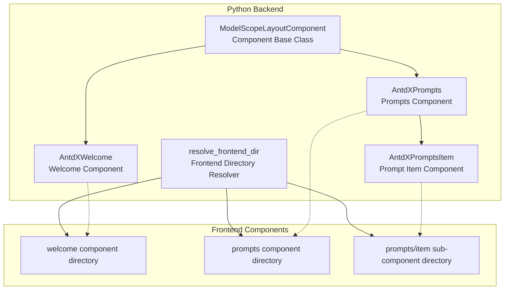
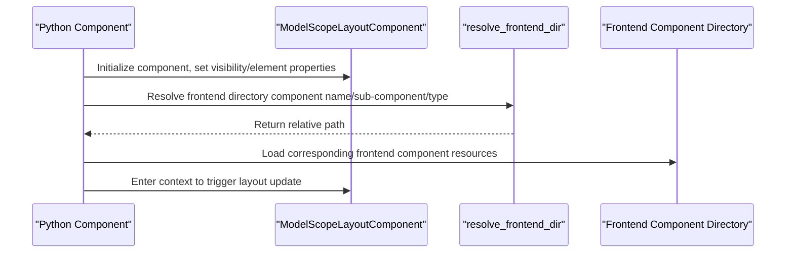
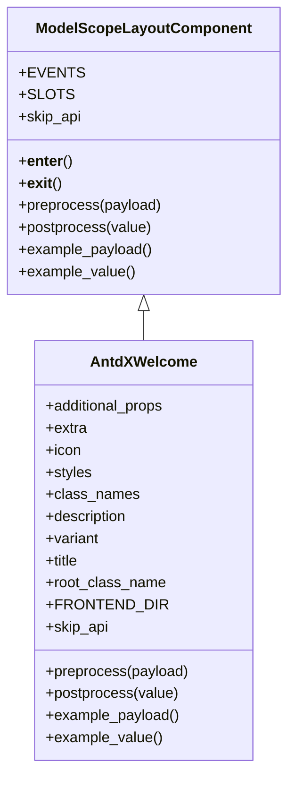
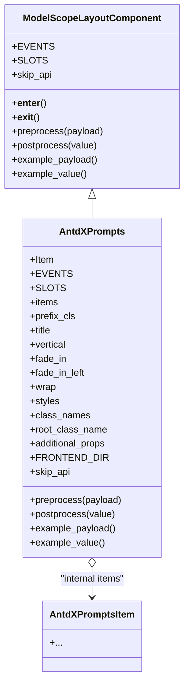
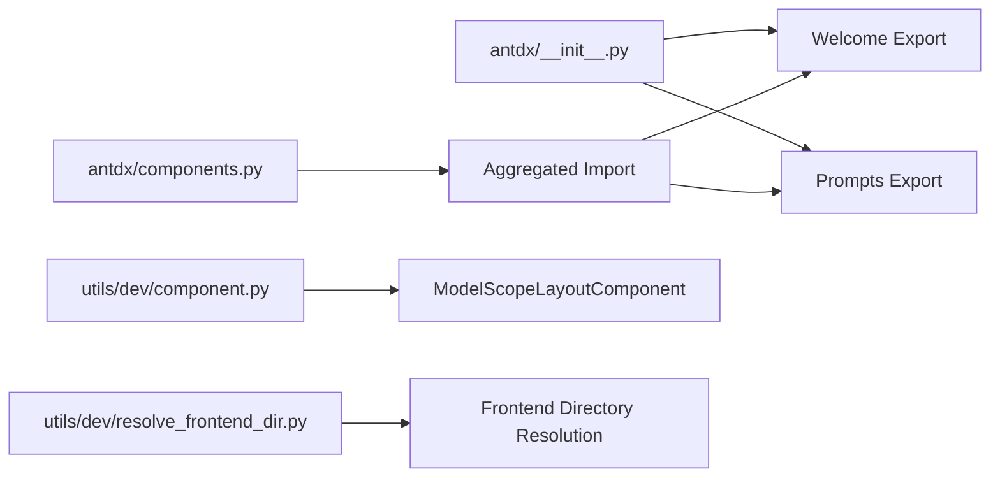

# Wake Components API

<cite>
**Files Referenced in This Document**
- [backend/modelscope_studio/components/antdx/welcome/__init__.py](file://backend/modelscope_studio/components/antdx/welcome/__init__.py)
- [backend/modelscope_studio/components/antdx/prompts/__init__.py](file://backend/modelscope_studio/components/antdx/prompts/__init__.py)
- [backend/modelscope_studio/components/antdx/components.py](file://backend/modelscope_studio/components/antdx/components.py)
- [backend/modelscope_studio/components/antdx/__init__.py](file://backend/modelscope_studio/components/antdx/__init__.py)
- [backend/modelscope_studio/utils/dev/component.py](file://backend/modelscope_studio/utils/dev/component.py)
- [backend/modelscope_studio/utils/dev/resolve_frontend_dir.py](file://backend/modelscope_studio/utils/dev/resolve_frontend_dir.py)
- [docs/components/antdx/welcome/app.py](file://docs/components/antdx/welcome/app.py)
- [docs/components/antdx/prompts/app.py](file://docs/components/antdx/prompts/app.py)
</cite>

## Table of Contents

1. [Introduction](#introduction)
2. [Project Structure](#project-structure)
3. [Core Components](#core-components)
4. [Architecture Overview](#architecture-overview)
5. [Detailed Component Analysis](#detailed-component-analysis)
6. [Dependency Analysis](#dependency-analysis)
7. [Performance Considerations](#performance-considerations)
8. [Troubleshooting Guide](#troubleshooting-guide)
9. [Conclusion](#conclusion)
10. [Appendix](#appendix)

## Introduction

This document is the Python API reference for Antdx wake components, focusing on the following goals:

- Document the welcome interface display, welcome message configuration, and user guidance flow of the Welcome component
- Explain the prompt set management, prompt template definition, and dynamic prompt generation mechanisms of the Prompts component
- Provide the message format, personalization configuration options, and multilingual support descriptions for the Welcome component
- Give standard usage examples for AI assistant startup, user guidance, and prompt activation scenarios
- Explain initialization parameters, callback function configurations, and user experience optimization strategies
- Describe integration approaches with conversational systems and state synchronization mechanisms

## Project Structure

Antdx components reside in the backend Python package, bridged through a unified layout component base class and frontend directory resolution mechanism. Both Welcome and Prompts components inherit from the general layout component base class and point to the corresponding frontend component directory via `resolve_frontend_dir`.

Diagram Sources

- [backend/modelscope_studio/utils/dev/component.py:11-50](file://backend/modelscope_studio/utils/dev/component.py#L11-L50)
- [backend/modelscope_studio/components/antdx/welcome/**init**.py:55-55](file://backend/modelscope_studio/components/antdx/welcome/__init__.py#L55-L55)
- [backend/modelscope_studio/components/antdx/prompts/**init**.py:70-70](file://backend/modelscope_studio/components/antdx/prompts/__init__.py#L70-L70)
- [backend/modelscope_studio/utils/dev/resolve_frontend_dir.py:4-16](file://backend/modelscope_studio/utils/dev/resolve_frontend_dir.py#L4-L16)

Section Sources

- [backend/modelscope_studio/components/antdx/components.py:24-39](file://backend/modelscope_studio/components/antdx/components.py#L24-L39)
- [backend/modelscope_studio/components/antdx/**init**.py:1-42](file://backend/modelscope_studio/components/antdx/__init__.py#L1-L42)

## Core Components

- AntdXWelcome: For rendering a welcome interface, supports slot-based configuration for title, description, icon, extra content, and style and variant control.
- AntdXPrompts: For displaying a set of prompt word cards, supports title, vertical arrangement, fade-in animation, line wrapping, and other configurations; includes an item_click callback event to respond to click behavior.

Section Sources

- [backend/modelscope_studio/components/antdx/welcome/**init**.py:8-73](file://backend/modelscope_studio/components/antdx/welcome/__init__.py#L8-L73)
- [backend/modelscope_studio/components/antdx/prompts/**init**.py:11-88](file://backend/modelscope_studio/components/antdx/prompts/__init__.py#L11-L88)

## Architecture Overview

Antdx components connect to the corresponding frontend component directory through a unified layout component base class and frontend directory resolver. Components set the frontend directory path during initialization and participate in layout updates and internal state passing through Gradio's BlockContext mechanism.

Diagram Sources

- [backend/modelscope_studio/utils/dev/component.py:24-26](file://backend/modelscope_studio/utils/dev/component.py#L24-L26)
- [backend/modelscope_studio/utils/dev/resolve_frontend_dir.py:4-16](file://backend/modelscope_studio/utils/dev/resolve_frontend_dir.py#L4-L16)
- [backend/modelscope_studio/components/antdx/welcome/**init**.py:55-55](file://backend/modelscope_studio/components/antdx/welcome/__init__.py#L55-L55)
- [backend/modelscope_studio/components/antdx/prompts/**init**.py:70-70](file://backend/modelscope_studio/components/antdx/prompts/__init__.py#L70-L70)

## Detailed Component Analysis

### Welcome Component API

- Component: AntdXWelcome
- Inheritance: ModelScopeLayoutComponent
- Slot Support: extra, icon, description, title
- Key Parameters
  - extra: Extra content (string or None)
  - icon: Icon resource path (processed through static file service)
  - description: Description text
  - title: Title text
  - variant: Appearance variant (filled or borderless)
  - styles/class_names/root_class_name: Style and class name configuration
  - Element properties: elem_id, elem_classes, elem_style, visible, render, etc.
- Lifecycle and Preprocessing
  - preprocess/postprocess/example_payload/example_value all return empty values, indicating this component does not perform data conversion or example value generation
- Events
  - No public event bindings (EVENTS is empty)

Diagram Sources

- [backend/modelscope_studio/utils/dev/component.py:11-50](file://backend/modelscope_studio/utils/dev/component.py#L11-L50)
- [backend/modelscope_studio/components/antdx/welcome/**init**.py:8-73](file://backend/modelscope_studio/components/antdx/welcome/__init__.py#L8-L73)

Section Sources

- [backend/modelscope_studio/components/antdx/welcome/**init**.py:17-54](file://backend/modelscope_studio/components/antdx/welcome/__init__.py#L17-L54)
- [backend/modelscope_studio/components/antdx/welcome/**init**.py:57-73](file://backend/modelscope_studio/components/antdx/welcome/__init__.py#L57-L73)

### Prompts Component API

- Component: AntdXPrompts
- Inheritance: ModelScopeLayoutComponent
- Internal Items: AntdXPromptsItem (exposed via the Item property)
- Slot Support: title, items
- Key Parameters
  - items: Prompt item list (list of dicts; specific fields are defined by the frontend convention)
  - prefix_cls: Prefix class name (for style isolation)
  - title: Prompt set title
  - vertical: Whether to arrange vertically
  - fade_in/fade_in_left: Fade-in animation toggles
  - wrap: Whether to wrap
  - styles/class_names/root_class_name/additional_props: Style and extension properties
  - Element properties: elem_id, elem_classes, elem_style, visible, render, etc.
- Events
  - item_click: Triggered when a prompt item is clicked; internally configured via `_internal.update(bind_itemClick_event=True)` for frontend event binding
- Lifecycle and Preprocessing
  - preprocess/postprocess/example_payload/example_value all return empty values, indicating this component does not perform data conversion or example value generation

Diagram Sources

- [backend/modelscope_studio/utils/dev/component.py:11-50](file://backend/modelscope_studio/utils/dev/component.py#L11-L50)
- [backend/modelscope_studio/components/antdx/prompts/**init**.py:11-88](file://backend/modelscope_studio/components/antdx/prompts/__init__.py#L11-L88)

Section Sources

- [backend/modelscope_studio/components/antdx/prompts/**init**.py:18-23](file://backend/modelscope_studio/components/antdx/prompts/__init__.py#L18-L23)
- [backend/modelscope_studio/components/antdx/prompts/**init**.py:28-68](file://backend/modelscope_studio/components/antdx/prompts/__init__.py#L28-L68)
- [backend/modelscope_studio/components/antdx/prompts/**init**.py:72-88](file://backend/modelscope_studio/components/antdx/prompts/__init__.py#L72-L88)

### Usage Examples and Best Practices

- AI Assistant Startup and Welcome Page Display
  - Render the Welcome component at application startup, set the title, description, and icon; add guidance buttons or action areas via the extra slot as needed
  - Control appearance style via variant; achieve theme adaptation via styles/class_names/root_class_name
- User Guidance and Prompt Activation
  - Use the Prompts component to display a set of prompt word cards, set title and items, and enable fade_in/fade_in_left for enhanced visual experience
  - Monitor user selections via the item_click event; combined with the conversational system, inject the selected prompt into the input box or directly initiate a conversation
- Multilingual Support
  - Title, description, and prompt text should come from localization resources; the text parameters of both Welcome and Prompts support string types, making it easy to replace with different language versions
- State Synchronization and Integration
  - Components participate in layout updates via Gradio BlockContext; to integrate with a conversational system, trigger business logic in the item_click callback (e.g., write prompt content to the input field or send a request) and complete state rendering on the frontend

Section Sources

- [docs/components/antdx/welcome/app.py:1-7](file://docs/components/antdx/welcome/app.py#L1-L7)
- [docs/components/antdx/prompts/app.py:1-7](file://docs/components/antdx/prompts/app.py#L1-L7)

## Dependency Analysis

- Component Exports
  - `antdx/__init__.py` exports Welcome and Prompts as aliases for easy named imports from outside
  - `antdx/components.py` aggregates all sub-modules to ensure the complete import chain
- Base Class and Utilities
  - ModelScopeLayoutComponent provides unified layout component capabilities and lifecycle hooks
  - `resolve_frontend_dir` maps component names to frontend directories, supporting sub-components and multi-level directory concatenation

Diagram Sources

- [backend/modelscope_studio/components/antdx/**init**.py:1-42](file://backend/modelscope_studio/components/antdx/__init__.py#L1-L42)
- [backend/modelscope_studio/components/antdx/components.py:24-39](file://backend/modelscope_studio/components/antdx/components.py#L24-L39)
- [backend/modelscope_studio/utils/dev/component.py:11-50](file://backend/modelscope_studio/utils/dev/component.py#L11-L50)
- [backend/modelscope_studio/utils/dev/resolve_frontend_dir.py:4-16](file://backend/modelscope_studio/utils/dev/resolve_frontend_dir.py#L4-L16)

Section Sources

- [backend/modelscope_studio/components/antdx/**init**.py:1-42](file://backend/modelscope_studio/components/antdx/__init__.py#L1-L42)
- [backend/modelscope_studio/components/antdx/components.py:24-39](file://backend/modelscope_studio/components/antdx/components.py#L24-L39)

## Performance Considerations

- Component Skips API: Both components have skip_api returning True, meaning no additional API interface layer will be generated, reducing server-side overhead
- Preprocessing and Postprocessing: preprocess/postprocess return empty values, avoiding unnecessary data conversions and contributing to low-latency rendering
- Animation and Layout: Prompts' fade-in and line-wrap options only affect frontend rendering; exercise caution when enabling animations with large numbers of prompt items to balance smoothness and performance

## Troubleshooting Guide

- Component Not Displaying
  - Check whether visible and render parameters are correctly set
  - Confirm that elem_id/elem_classes/elem_style are not causing style overrides
- Icon or Resource Cannot Load
  - Confirm that the icon path has been processed via the static file service (serve_static_file)
- Events Not Triggering
  - Confirm that the item_click event was bound during initialization (internally triggered via `_internal.update(bind_itemClick_event=True)`)
- Frontend Directory Resolution Failed
  - Check whether the component name and type in `resolve_frontend_dir` match the actual frontend directory structure

Section Sources

- [backend/modelscope_studio/components/antdx/welcome/**init**.py:47-47](file://backend/modelscope_studio/components/antdx/welcome/__init__.py#L47-L47)
- [backend/modelscope_studio/components/antdx/prompts/**init**.py:20-22](file://backend/modelscope_studio/components/antdx/prompts/__init__.py#L20-L22)
- [backend/modelscope_studio/utils/dev/resolve_frontend_dir.py:4-16](file://backend/modelscope_studio/utils/dev/resolve_frontend_dir.py#L4-L16)

## Conclusion

AntdXWelcome and AntdXPrompts achieve seamless connection with frontend components through the unified layout component base class and frontend directory resolution mechanism. Welcome focuses on the copywriting and style configuration of the welcome page, while Prompts specializes in the display and interaction of prompt sets. Both can integrate with conversational systems through Gradio's layout and event mechanisms to realize a complete user experience loop from "welcome guidance" to "prompt activation".

## Appendix

- Initialization Parameter Quick Reference
  - Welcome: extra, icon, description, title, variant, styles, class_names, root_class_name, elem_id, elem_classes, elem_style, visible, render
  - Prompts: items, prefix_cls, title, vertical, fade_in, fade_in_left, wrap, styles, class_names, root_class_name, additional_props, elem_id, elem_classes, elem_style, visible, render
- Event Quick Reference
  - Prompts: item_click (triggered when a prompt item is clicked)
