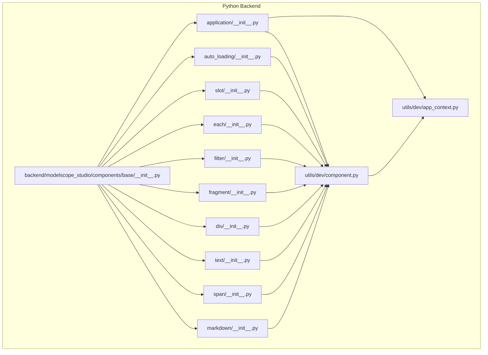
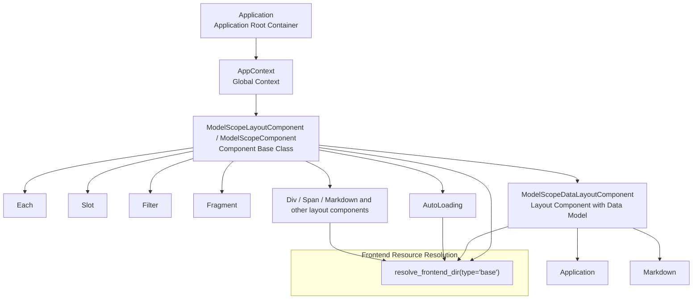
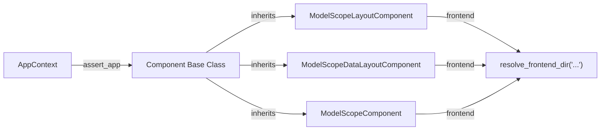

# Basic Components API

<cite>
**Files Referenced in This Document**
- [backend/modelscope_studio/components/base/__init__.py](file://backend/modelscope_studio/components/base/__init__.py)
- [backend/modelscope_studio/components/base/application/__init__.py](file://backend/modelscope_studio/components/base/application/__init__.py)
- [backend/modelscope_studio/components/base/auto_loading/__init__.py](file://backend/modelscope_studio/components/base/auto_loading/__init__.py)
- [backend/modelscope_studio/components/base/slot/__init__.py](file://backend/modelscope_studio/components/base/slot/__init__.py)
- [backend/modelscope_studio/components/base/each/__init__.py](file://backend/modelscope_studio/components/base/each/__init__.py)
- [backend/modelscope_studio/components/base/filter/__init__.py](file://backend/modelscope_studio/components/base/filter/__init__.py)
- [backend/modelscope_studio/components/base/fragment/__init__.py](file://backend/modelscope_studio/components/base/fragment/__init__.py)
- [backend/modelscope_studio/components/base/div/__init__.py](file://backend/modelscope_studio/components/base/div/__init__.py)
- [backend/modelscope_studio/components/base/text/__init__.py](file://backend/modelscope_studio/components/base/text/__init__.py)
- [backend/modelscope_studio/components/base/span/__init__.py](file://backend/modelscope_studio/components/base/span/__init__.py)
- [backend/modelscope_studio/components/base/markdown/__init__.py](file://backend/modelscope_studio/components/base/markdown/__init__.py)
- [backend/modelscope_studio/utils/dev/component.py](file://backend/modelscope_studio/utils/dev/component.py)
- [backend/modelscope_studio/utils/dev/app_context.py](file://backend/modelscope_studio/utils/dev/app_context.py)
- [docs/components/base/application/README.md](file://docs/components/base/application/README.md)
- [docs/components/base/each/README.md](file://docs/components/base/each/README.md)
- [docs/components/base/slot/README.md](file://docs/components/base/slot/README.md)
</cite>

## Table of Contents

1. [Introduction](#introduction)
2. [Project Structure](#project-structure)
3. [Core Components](#core-components)
4. [Architecture Overview](#architecture-overview)
5. [Detailed Component Analysis](#detailed-component-analysis)
6. [Dependency Analysis](#dependency-analysis)
7. [Performance Considerations](#performance-considerations)
8. [Troubleshooting Guide](#troubleshooting-guide)
9. [Conclusion](#conclusion)
10. [Appendix: Usage Examples and Best Practices](#appendix-usage-examples-and-best-practices)

## Introduction

This document is the Python API reference for the base component library, covering core components under `modelscope_studio.components.base.*`, including Application, AutoLoading, Slot, Each, Filter, Fragment, Layout components (represented by common layout components such as Div/Span/Markdown), Text, and others. The documentation is organized based on the repository source code and accompanying docs, focusing on:

- Complete import paths and usage patterns
- Constructor parameters, property definitions, method signatures, and return types
- Component composition patterns (application containers, conditional rendering, list iteration)
- Lifecycle management, context passing, and slot system interfaces
- Performance optimization strategies, memory management, and error handling mechanisms
- Component inheritance patterns, extension development, and best practices

## Project Structure

Base components reside in the backend Python package `modelscope_studio/components/base`, aggregated through a unified export entry point; frontend resources are resolved by utility modules and bound to corresponding frontend directories.

Diagram sources

- [backend/modelscope_studio/components/base/**init**.py:1-11](file://backend/modelscope_studio/components/base/__init__.py#L1-L11)
- [backend/modelscope_studio/components/base/application/**init**.py:26-115](file://backend/modelscope_studio/components/base/application/__init__.py#L26-L115)
- [backend/modelscope_studio/components/base/auto_loading/**init**.py:8-65](file://backend/modelscope_studio/components/base/auto_loading/__init__.py#L8-L65)
- [backend/modelscope_studio/components/base/slot/**init**.py:8-50](file://backend/modelscope_studio/components/base/slot/__init__.py#L8-L50)
- [backend/modelscope_studio/components/base/each/**init**.py:17-73](file://backend/modelscope_studio/components/base/each/__init__.py#L17-L73)
- [backend/modelscope_studio/components/base/filter/**init**.py:8-45](file://backend/modelscope_studio/components/base/filter/__init__.py#L8-L45)
- [backend/modelscope_studio/components/base/fragment/**init**.py:8-49](file://backend/modelscope_studio/components/base/fragment/__init__.py#L8-L49)
- [backend/modelscope_studio/components/base/div/**init**.py:10-86](file://backend/modelscope_studio/components/base/div/__init__.py#L10-L86)
- [backend/modelscope_studio/components/base/text/**init**.py:8-57](file://backend/modelscope_studio/components/base/text/__init__.py#L8-L57)
- [backend/modelscope_studio/components/base/span/**init**.py:10-87](file://backend/modelscope_studio/components/base/span/__init__.py#L10-L87)
- [backend/modelscope_studio/components/base/markdown/**init**.py:11-174](file://backend/modelscope_studio/components/base/markdown/__init__.py#L11-L174)
- [backend/modelscope_studio/utils/dev/component.py:11-169](file://backend/modelscope_studio/utils/dev/component.py#L11-L169)
- [backend/modelscope_studio/utils/dev/app_context.py:4-25](file://backend/modelscope_studio/utils/dev/app_context.py#L4-L25)

Section sources

- [backend/modelscope_studio/components/base/**init**.py:1-11](file://backend/modelscope_studio/components/base/__init__.py#L1-L11)

## Core Components

The following is an overview of import paths and key capabilities for each core base component (sorted alphabetically):

- Application
  - Import path: `from modelscope_studio.components.base import Application`
  - Capabilities: Application root container; listens to page lifecycle events (mount, resize, unmount, custom); provides page environment data (screen size, language, theme, userAgent).
  - Key notes: Must be used as the root container for all components; supports custom event bridging (`window.ms_globals.dispatch` → Python-side events).

- AutoLoading
  - Import path: `from modelscope_studio.components.base import AutoLoading`
  - Capabilities: Auto-loading state wrapper; supports slots (render, errorRender, loadingText); controllable mask, timer, and error display.

- Slot
  - Import path: `from modelscope_studio.components.base import Slot`
  - Capabilities: Slot placeholder component; used together with the target component's `SLOTS`; supports `params_mapping` for parameter mapping.

- Each
  - Import path: `from modelscope_studio.components.base import Each`
  - Capabilities: List iteration rendering; injects context; supports `as_item` filtering and deep merge via `context_value`.

- Filter
  - Import path: `from modelscope_studio.components.base import Filter`
  - Capabilities: Conditional filter component; determines whether to render a subtree based on parameter mapping.

- Fragment
  - Import path: `from modelscope_studio.components.base import Fragment`
  - Capabilities: Grouping container; produces no additional DOM; suitable for logical grouping and slot mounting.

- Div/Text/Span/Markdown
  - Import path: `from modelscope_studio.components.base import Div, Text, Span, Markdown`
  - Capabilities: Basic layout and text components; support additional properties, event binding, copy button, and other features.

Section sources

- [backend/modelscope_studio/components/base/**init**.py:1-11](file://backend/modelscope_studio/components/base/__init__.py#L1-L11)
- [docs/components/base/application/README.md:1-56](file://docs/components/base/application/README.md#L1-L56)
- [docs/components/base/each/README.md:1-32](file://docs/components/base/each/README.md#L1-L32)
- [docs/components/base/slot/README.md:1-17](file://docs/components/base/slot/README.md#L1-L17)

## Architecture Overview

The runtime architecture of base components revolves around "application context + component base classes + frontend resource resolution". Components assert the existence of an Application context during construction, and pass layout and index information to the frontend via the internal `_internal` dictionary; some components support slots and event binding, which are ultimately consumed by the frontend rendering engine.

Diagram sources

- [backend/modelscope_studio/utils/dev/app_context.py:4-25](file://backend/modelscope_studio/utils/dev/app_context.py#L4-L25)
- [backend/modelscope_studio/utils/dev/component.py:11-169](file://backend/modelscope_studio/utils/dev/component.py#L11-L169)
- [backend/modelscope_studio/components/base/application/**init**.py:26-115](file://backend/modelscope_studio/components/base/application/__init__.py#L26-L115)
- [backend/modelscope_studio/components/base/markdown/**init**.py:11-174](file://backend/modelscope_studio/components/base/markdown/__init__.py#L11-L174)
- [backend/modelscope_studio/components/base/auto_loading/**init**.py:8-65](file://backend/modelscope_studio/components/base/auto_loading/__init__.py#L8-L65)
- [backend/modelscope_studio/components/base/div/**init**.py:10-86](file://backend/modelscope_studio/components/base/div/__init__.py#L10-L86)
- [backend/modelscope_studio/components/base/slot/**init**.py:8-50](file://backend/modelscope_studio/components/base/slot/__init__.py#L8-L50)
- [backend/modelscope_studio/components/base/each/**init**.py:17-73](file://backend/modelscope_studio/components/base/each/__init__.py#L17-L73)
- [backend/modelscope_studio/components/base/filter/**init**.py:8-45](file://backend/modelscope_studio/components/base/filter/__init__.py#L8-L45)
- [backend/modelscope_studio/components/base/fragment/**init**.py:8-49](file://backend/modelscope_studio/components/base/fragment/__init__.py#L8-L49)

## Detailed Component Analysis

### Application

- Import path: `from modelscope_studio.components.base import Application`
- Inheritance: `ModelScopeDataLayoutComponent`
- Events:
  - `mount`: Page mounted
  - `resize`: Window size changed
  - `unmount`: Page unmounted
  - `custom`: Custom event triggered via `window.ms_globals.dispatch`
- Data models:
  - `ApplicationPageScreenData`: width, height, scrollX, scrollY
  - `ApplicationPageData`: screen, language, theme, userAgent
- Key behavior:
  - Sets `AppContext` during construction
  - Supports `preprocess`/`postprocess` pass-through
  - Provides `example_payload`/`example_value`

Section sources

- [backend/modelscope_studio/components/base/application/**init**.py:26-115](file://backend/modelscope_studio/components/base/application/__init__.py#L26-L115)
- [docs/components/base/application/README.md:1-56](file://docs/components/base/application/README.md#L1-L56)

### AutoLoading

- Import path: `from modelscope_studio.components.base import AutoLoading`
- Inheritance: `ModelScopeLayoutComponent`
- Slots: `render`, `errorRender`, `loadingText`
- Key properties:
  - `generating`, `show_error`, `show_mask`, `show_timer`, `loading_text`
- Key behavior:
  - `skip_api=True`, does not participate in the standard API flow
  - `preprocess`/`postprocess` handles strings as pass-through

Section sources

- [backend/modelscope_studio/components/base/auto_loading/**init**.py:8-65](file://backend/modelscope_studio/components/base/auto_loading/__init__.py#L8-L65)

### Slot

- Import path: `from modelscope_studio.components.base import Slot`
- Inheritance: `ModelScopeLayoutComponent`
- Key properties:
  - `value`: Slot name
  - `params_mapping`: JavaScript function string for parameter mapping
- Key behavior:
  - When the parent is also a Slot, `value` is concatenated to form a hierarchical path
  - `skip_api=True`

Section sources

- [backend/modelscope_studio/components/base/slot/**init**.py:8-50](file://backend/modelscope_studio/components/base/slot/__init__.py#L8-L50)
- [docs/components/base/slot/README.md:1-17](file://docs/components/base/slot/README.md#L1-L17)

### Each

- Import path: `from modelscope_studio.components.base import Each`
- Inheritance: `ModelScopeDataLayoutComponent`
- Data model: `ModelScopeEachData` (root: list)
- Key properties:
  - `value`: `list[dict]` or `Callable`
  - `context_value`: `dict`, used for deep merge into context
  - `as_item`: string, for filtering context fields
- Key behavior:
  - `preprocess` unpacks `ModelScopeEachData` into a list
  - `postprocess` returns a list
  - `skip_api=False`, participates in the API flow

Section sources

- [backend/modelscope_studio/components/base/each/**init**.py:17-73](file://backend/modelscope_studio/components/base/each/__init__.py#L17-L73)
- [docs/components/base/each/README.md:1-32](file://docs/components/base/each/README.md#L1-L32)

### Filter

- Import path: `from modelscope_studio.components.base import Filter`
- Inheritance: `ModelScopeLayoutComponent`
- Key properties:
  - `params_mapping`: Parameter mapping string
- Key behavior:
  - `skip_api=True`, does not participate in the API flow

Section sources

- [backend/modelscope_studio/components/base/filter/**init**.py:8-45](file://backend/modelscope_studio/components/base/filter/__init__.py#L8-L45)

### Fragment

- Import path: `from modelscope_studio.components.base import Fragment`
- Inheritance: `ModelScopeLayoutComponent`
- Key behavior:
  - `skip_api=True`, does not participate in the API flow
  - Suitable for logical grouping and slot mounting

Section sources

- [backend/modelscope_studio/components/base/fragment/**init**.py:8-49](file://backend/modelscope_studio/components/base/fragment/__init__.py#L8-L49)

### Div

- Import path: `from modelscope_studio.components.base import Div`
- Inheritance: `ModelScopeLayoutComponent`
- Events: `click`, `dblclick`, `mousedown`, `mouseup`, `mouseover`, `mouseout`, `mousemove`, `scroll`
- Key properties:
  - `value`: string
  - `additional_props`: dict, additional properties
- Key behavior:
  - `skip_api=True`

Section sources

- [backend/modelscope_studio/components/base/div/**init**.py:10-86](file://backend/modelscope_studio/components/base/div/__init__.py#L10-L86)

### Text

- Import path: `from modelscope_studio.components.base import Text`
- Inheritance: `ModelScopeComponent`
- Key behavior:
  - `skip_api=True`

Section sources

- [backend/modelscope_studio/components/base/text/**init**.py:8-57](file://backend/modelscope_studio/components/base/text/__init__.py#L8-L57)

### Span

- Import path: `from modelscope_studio.components.base import Span`
- Inheritance: `ModelScopeLayoutComponent`
- Events: `click`, `dblclick`, `mousedown`, `mouseup`, `mouseover`, `mouseout`, `mousemove`, `scroll`
- Key properties:
  - `value`: string
  - `additional_props`: dict, additional properties
- Key behavior:
  - `skip_api=True`

Section sources

- [backend/modelscope_studio/components/base/span/**init**.py:10-87](file://backend/modelscope_studio/components/base/span/__init__.py#L10-L87)

### Markdown

- Import path: `from modelscope_studio.components.base import Markdown`
- Inheritance: `ModelScopeDataLayoutComponent`
- Events: `change`, `copy`, `click`, `dblclick`, `mousedown`, `mouseup`, `mouseover`, `mouseout`, `mousemove`, `scroll`
- Slots: `copyButtons`
- Key properties:
  - `value`: string
  - `rtl`, `latex_delimiters`, `sanitize_html`, `line_breaks`, `header_links`, `allow_tags`, `show_copy_button`, `copy_buttons`, `additional_props`
- Key behavior:
  - `preprocess` returns as-is
  - `postprocess` strips indentation and returns a string
  - `api_info` returns `{"type": "string"}`

Section sources

- [backend/modelscope_studio/components/base/markdown/**init**.py:11-174](file://backend/modelscope_studio/components/base/markdown/__init__.py#L11-L174)

## Dependency Analysis

- Component base classes and context
  - All base components depend on the base classes (`ModelScopeLayoutComponent`, `ModelScopeComponent`, `ModelScopeDataLayoutComponent`) defined in `utils/dev/component.py`, and assert the existence of `AppContext` during construction.
  - `utils/dev/app_context.py` provides `set_app`/`assert_app`/`get_app` to ensure components are used within an Application root container.

- Frontend resource resolution
  - Each component resolves its frontend directory via `resolve_frontend_dir("xxx", type="base")`, ensuring consistency between frontend and backend resources.

Diagram sources

- [backend/modelscope_studio/utils/dev/app_context.py:4-25](file://backend/modelscope_studio/utils/dev/app_context.py#L4-L25)
- [backend/modelscope_studio/utils/dev/component.py:11-169](file://backend/modelscope_studio/utils/dev/component.py#L11-L169)

Section sources

- [backend/modelscope_studio/utils/dev/component.py:11-169](file://backend/modelscope_studio/utils/dev/component.py#L11-L169)
- [backend/modelscope_studio/utils/dev/app_context.py:4-25](file://backend/modelscope_studio/utils/dev/app_context.py#L4-L25)

## Performance Considerations

- Avoiding unnecessary API interactions
  - Most base components have `skip_api=True` (e.g., AutoLoading, Slot, Filter, Fragment, Div/Span/Text/Markdown), meaning they do not participate in the standard API flow, reducing frontend-backend round-trip overhead.
- List rendering optimization
  - `Each`'s `value` supports `Callable` for lazy evaluation in complex scenarios; combining `as_item`/`context_value` reduces redundant attribute passing and conflicts.
- Event binding
  - Bind events only when necessary (e.g., mouse and scroll events for Div/Markdown) to avoid excessive bindings that could increase frontend pressure.
- Memory management
  - Components uniformly mark `layout=True` in `__exit__`, ensuring the frontend correctly releases and rebuilds; avoid holding long-lived references within the component tree.
- HTML sanitization
  - `Markdown`'s `postprocess` sanitizes content, reducing rendering jitter and abnormal character issues.

## Troubleshooting Guide

- Missing Application root container
  - Symptom: Warning indicating no Application component found.
  - Resolution: Ensure all components are wrapped inside an Application.
  - Reference: Warning message from `AppContext.assert_app`.

- Slot not taking effect
  - Symptom: Slot fails to be inserted into the target component.
  - Resolution: Confirm the target component's `SLOTS` supports the slot name; verify that `params_mapping` is correctly configured.

- Each context conflict
  - Symptom: Attribute conflicts or overrides when iterating multiple components.
  - Resolution: Use `as_item` for field filtering; use `context_value` for deep merge to inject uniformly if necessary.

- AutoLoading not displaying
  - Symptom: loading/error/render slots not showing.
  - Resolution: Confirm that `generating`/`show_error`/`show_mask` state matches the slot naming.

Section sources

- [backend/modelscope_studio/utils/dev/app_context.py:16-20](file://backend/modelscope_studio/utils/dev/app_context.py#L16-L20)
- [docs/components/base/slot/README.md:1-17](file://docs/components/base/slot/README.md#L1-L17)
- [docs/components/base/each/README.md:16-22](file://docs/components/base/each/README.md#L16-L22)
- [backend/modelscope_studio/components/base/auto_loading/**init**.py:15-46](file://backend/modelscope_studio/components/base/auto_loading/__init__.py#L15-L46)

## Conclusion

The base component library provides a unified application root container, layout and text components, conditional and loop rendering helper components, and a slot system. Through strict context constraints and frontend resource resolution mechanisms, it ensures stable operation of components within the Gradio ecosystem. It is recommended to use `Each`'s `as_item` and `context_value` for context management, choose `skip_api` components appropriately to reduce API overhead, and leverage Application's lifecycle events and custom events for page behavior control when needed.

## Appendix: Usage Examples and Best Practices

### Application Container and Page Environment

- Wrap the outermost layer of the application with Application, and listen to page lifecycle events.
- Obtain user language, theme, screen information, and UA from Application's `value`.

Section sources

- [docs/components/base/application/README.md:12-20](file://docs/components/base/application/README.md#L12-L20)
- [backend/modelscope_studio/components/base/application/**init**.py:30-54](file://backend/modelscope_studio/components/base/application/__init__.py#L30-L54)

### Conditional Rendering (Filter)

- Use Filter with `params_mapping` to determine whether to render a subtree.
- Suitable for dynamically hiding/showing parts of the content based on context parameters.

Section sources

- [backend/modelscope_studio/components/base/filter/**init**.py:13-25](file://backend/modelscope_studio/components/base/filter/__init__.py#L13-L25)

### List Iteration (Each)

- Each accepts a list or callable, injects context; supports `as_item` and `context_value`.
- Suitable for rendering lists of unknown length and injecting uniform attributes.

Section sources

- [docs/components/base/each/README.md:7-22](file://docs/components/base/each/README.md#L7-L22)
- [backend/modelscope_studio/components/base/each/**init**.py:23-52](file://backend/modelscope_studio/components/base/each/__init__.py#L23-L52)

### Slot System (Slot)

- Slot works with the target component's `SLOTS`; `params_mapping` supports parameter mapping.
- Suitable for complex layouts and pluggable content areas.

Section sources

- [docs/components/base/slot/README.md:1-17](file://docs/components/base/slot/README.md#L1-L17)
- [backend/modelscope_studio/components/base/slot/**init**.py:13-30](file://backend/modelscope_studio/components/base/slot/__init__.py#L13-L30)

### Auto Loading (AutoLoading)

- Wrap areas that may take time to load; use render/errorRender/loadingText slots.
- Control mask, timer, and error display to improve user experience.

Section sources

- [backend/modelscope_studio/components/base/auto_loading/**init**.py:17-46](file://backend/modelscope_studio/components/base/auto_loading/__init__.py#L17-L46)

### Layout and Text Components

- Div/Span: For basic block-level/inline layout; support various mouse and scroll events.
- Text/Markdown: Text rendering; Markdown supports copy buttons and LaTeX expression configuration.

Section sources

- [backend/modelscope_studio/components/base/div/**init**.py:44-67](file://backend/modelscope_studio/components/base/div/__init__.py#L44-L67)
- [backend/modelscope_studio/components/base/span/**init**.py:44-67](file://backend/modelscope_studio/components/base/span/__init__.py#L44-L67)
- [backend/modelscope_studio/components/base/text/**init**.py:17-37](file://backend/modelscope_studio/components/base/text/__init__.py#L17-L37)
- [backend/modelscope_studio/components/base/markdown/**init**.py:54-141](file://backend/modelscope_studio/components/base/markdown/__init__.py#L54-L141)

### Component Inheritance and Extension Development

- New components are recommended to inherit the appropriate base class:
  - Requires data model and layout: `ModelScopeDataLayoutComponent`
  - Layout only: `ModelScopeLayoutComponent`
  - Pure component: `ModelScopeComponent`
- Set `FRONTEND_DIR` in the constructor to ensure frontend resources are correctly resolved.
- If slots are needed, define `SLOTS` and document the supported slot names and their purposes.

Section sources

- [backend/modelscope_studio/utils/dev/component.py:11-169](file://backend/modelscope_studio/utils/dev/component.py#L11-L169)
