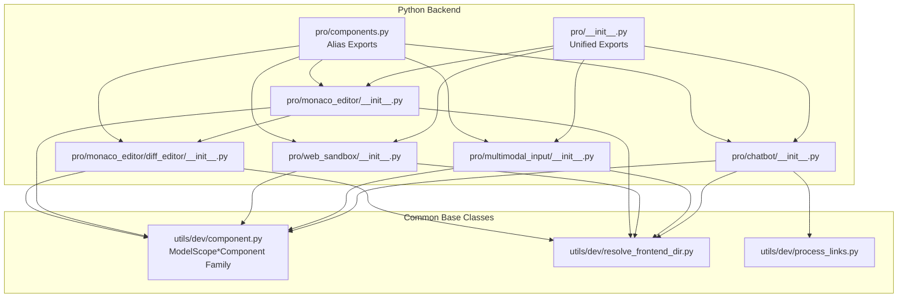
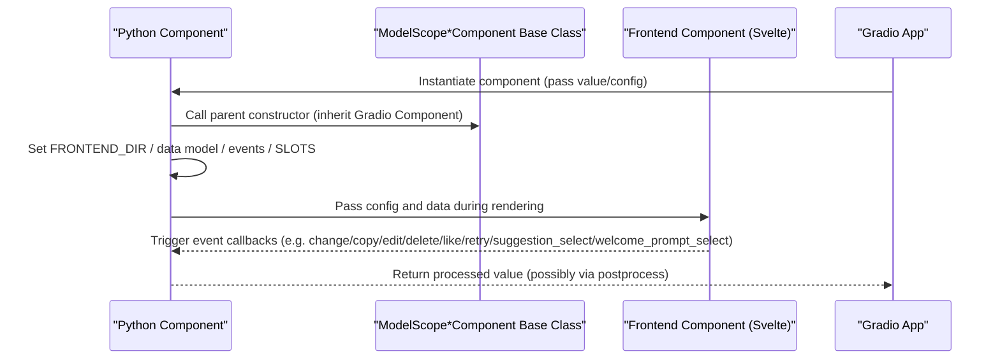
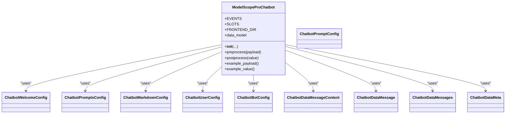
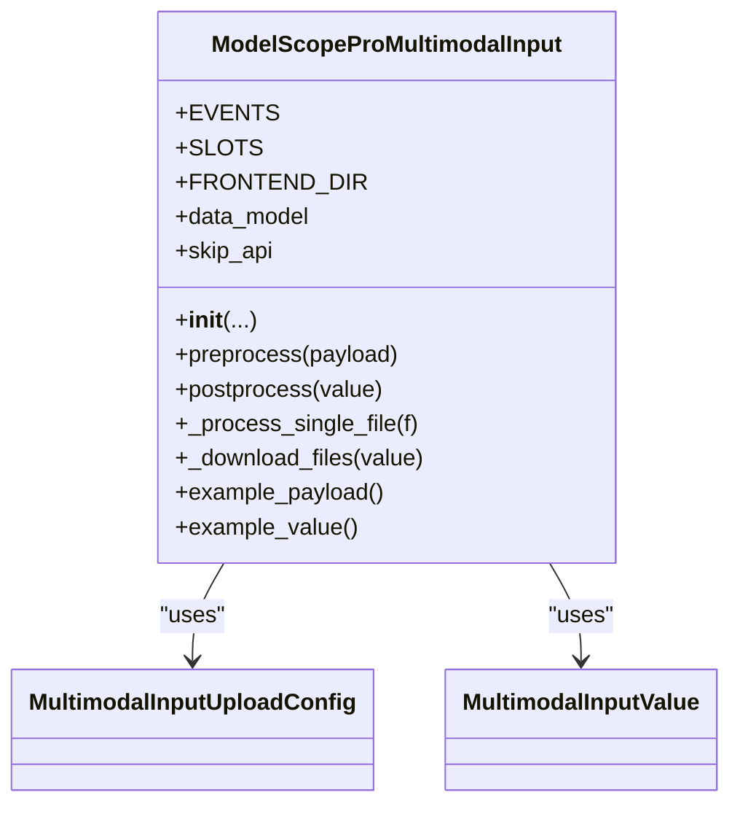
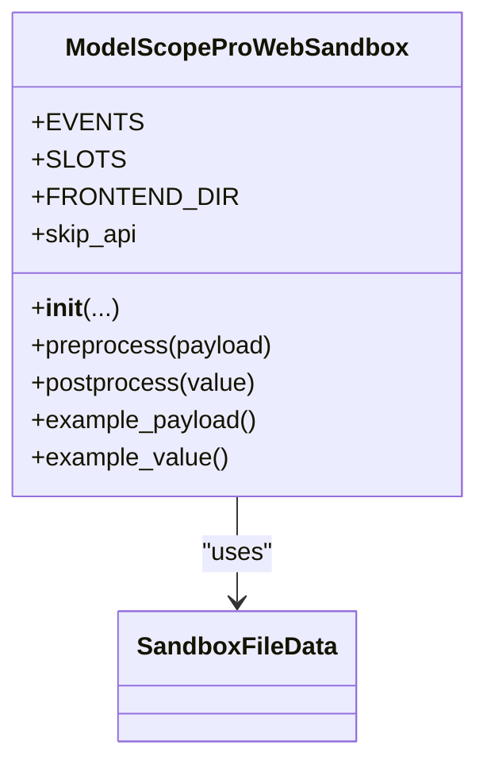
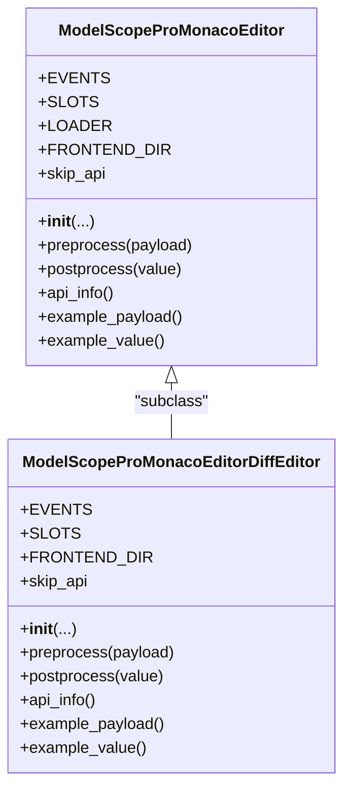
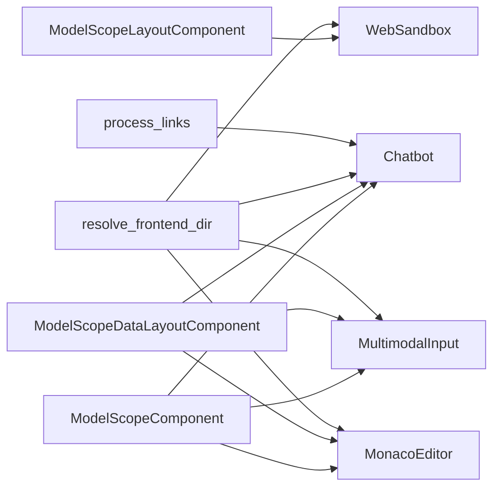

# Pro Components API

<cite>
**Files Referenced in This Document**
- [backend/modelscope_studio/components/pro/__init__.py](file://backend/modelscope_studio/components/pro/__init__.py)
- [backend/modelscope_studio/components/pro/components.py](file://backend/modelscope_studio/components/pro/components.py)
- [backend/modelscope_studio/components/pro/chatbot/__init__.py](file://backend/modelscope_studio/components/pro/chatbot/__init__.py)
- [backend/modelscope_studio/components/pro/multimodal_input/__init__.py](file://backend/modelscope_studio/components/pro/multimodal_input/__init__.py)
- [backend/modelscope_studio/components/pro/web_sandbox/__init__.py](file://backend/modelscope_studio/components/pro/web_sandbox/__init__.py)
- [backend/modelscope_studio/components/pro/monaco_editor/__init__.py](file://backend/modelscope_studio/components/pro/monaco_editor/__init__.py)
- [backend/modelscope_studio/components/pro/monaco_editor/diff_editor/__init__.py](file://backend/modelscope_studio/components/pro/monaco_editor/diff_editor/__init__.py)
- [backend/modelscope_studio/utils/dev/component.py](file://backend/modelscope_studio/utils/dev/component.py)
- [backend/modelscope_studio/utils/dev/resolve_frontend_dir.py](file://backend/modelscope_studio/utils/dev/resolve_frontend_dir.py)
- [backend/modelscope_studio/utils/dev/process_links.py](file://backend/modelscope_studio/utils/dev/process_links.py)
- [docs/demos/example.py](file://docs/demos/example.py)
- [docs/layout_templates/chatbot/app.py](file://docs/layout_templates/chatbot/app.py)
- [docs/layout_templates/chatbot/demos/basic.py](file://docs/layout_templates/chatbot/demos/basic.py)
- [docs/components/pro/chatbot/demos/chatbot_config.py](file://docs/components/pro/chatbot/demos/chatbot_config.py)
</cite>

## Table of Contents

1. [Introduction](#introduction)
2. [Project Structure](#project-structure)
3. [Core Components](#core-components)
4. [Architecture Overview](#architecture-overview)
5. [Detailed Component Analysis](#detailed-component-analysis)
6. [Dependency Analysis](#dependency-analysis)
7. [Performance Considerations](#performance-considerations)
8. [Troubleshooting Guide](#troubleshooting-guide)
9. [Conclusion](#conclusion)
10. [Appendix](#appendix)

## Introduction

This document is the Python API reference for the pro component library (`modelscope_studio.components.pro`), covering the following AI application-specific components:

- **Chatbot**: Conversational message container and rendering component; supports user/assistant messages, welcome prompts, suggested prompts, tool calls, file content, and other rich capabilities.
- **MultimodalInput**: Multimodal input component; supports text and attachment uploads, paste, drag-and-drop, voice, and other input modalities.
- **WebSandbox**: Web sandbox component; renders React/HTML templates in an isolated environment; supports compile and render error events.
- **MonacoEditor**: Code editor component; supports language highlighting, read-only mode, option configuration, mount/change/validate events; provides a DiffEditor subclass.

This document records import paths, constructor parameters, property definitions, method signatures, and return types for each component. It provides standard instantiation and usage examples for complex AI applications, covering advanced use cases such as chatbot integration, multimodal input handling, and web sandbox isolation. It also explains event binding, data flow processing strategies, frontend/backend data conversion logic, and performance and concurrency considerations.

## Project Structure

Pro components reside in the backend Python package `modelscope_studio/components/pro`, divided into four submodules by function: chatbot, multimodal_input, web_sandbox, and monaco_editor, with a unified export entry and alias exports.

Diagram sources

- [backend/modelscope_studio/components/pro/**init**.py:1-7](file://backend/modelscope_studio/components/pro/__init__.py#L1-L7)
- [backend/modelscope_studio/components/pro/components.py:1-8](file://backend/modelscope_studio/components/pro/components.py#L1-L8)
- [backend/modelscope_studio/components/pro/chatbot/**init**.py:286-495](file://backend/modelscope_studio/components/pro/chatbot/__init__.py#L286-L495)
- [backend/modelscope_studio/components/pro/multimodal_input/**init**.py:82-259](file://backend/modelscope_studio/components/pro/multimodal_input/__init__.py#L82-L259)
- [backend/modelscope_studio/components/pro/web_sandbox/**init**.py:15-86](file://backend/modelscope_studio/components/pro/web_sandbox/__init__.py#L15-L86)
- [backend/modelscope_studio/components/pro/monaco_editor/**init**.py:16-107](file://backend/modelscope_studio/components/pro/monaco_editor/__init__.py#L16-L107)
- [backend/modelscope_studio/components/pro/monaco_editor/diff_editor/**init**.py:10-106](file://backend/modelscope_studio/components/pro/monaco_editor/diff_editor/__init__.py#L10-L106)
- [backend/modelscope_studio/utils/dev/component.py:11-169](file://backend/modelscope_studio/utils/dev/component.py#L11-L169)
- [backend/modelscope_studio/utils/dev/resolve_frontend_dir.py:4-17](file://backend/modelscope_studio/utils/dev/resolve_frontend_dir.py#L4-L17)
- [backend/modelscope_studio/utils/dev/process_links.py:9-61](file://backend/modelscope_studio/utils/dev/process_links.py#L9-L61)

Section sources

- [backend/modelscope_studio/components/pro/**init**.py:1-7](file://backend/modelscope_studio/components/pro/__init__.py#L1-L7)
- [backend/modelscope_studio/components/pro/components.py:1-8](file://backend/modelscope_studio/components/pro/components.py#L1-L8)

## Core Components

This section provides an overview of the responsibilities and typical use cases for the four pro components:

- **Chatbot**: Used to build conversational interfaces; manages message lists, welcome prompts, suggested prompts, action buttons, Markdown rendering, file/tool content, and more.
- **MultimodalInput**: Used to receive multimodal input with text and attachments; supports upload, paste, drag-and-drop, preview, download, and other workflows.
- **WebSandbox**: Used to render templates (React/HTML) in an isolated environment; captures compile and render error events.
- **MonacoEditor**: Used to embed a code editor in the browser; supports language, read-only, options, mount/change/validate events; provides DiffEditor for diff view.

Section sources

- [backend/modelscope_studio/components/pro/chatbot/**init**.py:286-495](file://backend/modelscope_studio/components/pro/chatbot/__init__.py#L286-L495)
- [backend/modelscope_studio/components/pro/multimodal_input/**init**.py:82-259](file://backend/modelscope_studio/components/pro/multimodal_input/__init__.py#L82-L259)
- [backend/modelscope_studio/components/pro/web_sandbox/**init**.py:15-86](file://backend/modelscope_studio/components/pro/web_sandbox/__init__.py#L15-L86)
- [backend/modelscope_studio/components/pro/monaco_editor/**init**.py:16-107](file://backend/modelscope_studio/components/pro/monaco_editor/__init__.py#L16-L107)

## Architecture Overview

Pro components extend the Gradio component system through unified base classes and frontend directory resolution to bridge frontend and backend. Components set `FRONTEND_DIR` during initialization, pointing to the corresponding frontend Svelte component directory; `preprocess`/`postprocess` handles frontend/backend data conversion; `EVENTS`/`SLOTS` provide event and slot extension points.

Diagram sources

- [backend/modelscope_studio/utils/dev/component.py:11-169](file://backend/modelscope_studio/utils/dev/component.py#L11-L169)
- [backend/modelscope_studio/utils/dev/resolve_frontend_dir.py:4-17](file://backend/modelscope_studio/utils/dev/resolve_frontend_dir.py#L4-L17)
- [backend/modelscope_studio/components/pro/chatbot/**init**.py:286-495](file://backend/modelscope_studio/components/pro/chatbot/__init__.py#L286-L495)
- [backend/modelscope_studio/components/pro/multimodal_input/**init**.py:82-259](file://backend/modelscope_studio/components/pro/multimodal_input/__init__.py#L82-L259)
- [backend/modelscope_studio/components/pro/web_sandbox/**init**.py:15-86](file://backend/modelscope_studio/components/pro/web_sandbox/__init__.py#L15-L86)
- [backend/modelscope_studio/components/pro/monaco_editor/**init**.py:16-107](file://backend/modelscope_studio/components/pro/monaco_editor/__init__.py#L16-L107)

## Detailed Component Analysis

### Chatbot Component

- Import paths
  - Main class: `modelscope_studio.components.pro.Chatbot`
  - Alias: `modelscope_studio.components.pro.ProChatbot`
- Purpose
  - Manages conversational message lists; supports user/assistant messages, welcome prompts, suggested prompts, action buttons, Markdown rendering, file/tool content, and more.
- Key data models
  - `ChatbotWelcomeConfig`, `ChatbotPromptsConfig`, `ChatbotPromptConfig`, `ChatbotMarkdownConfig`, `ChatbotUserConfig`, `ChatbotBotConfig`, `ChatbotDataMessageContent`, `ChatbotDataMessage`, `ChatbotDataMessages`, `ChatbotDataMeta`
- Constructor parameter highlights
  - `value`: Can be a callback or message list/dict; supports message status `pending`/`done`, separators, metadata feedback, etc.
  - Height and scrolling: `height`, `min_height`, `max_height`, `auto_scroll`, `show_scroll_to_bottom_button`, `scroll_to_bottom_button_offset`
  - Welcome and Markdown: `welcome_config`, `markdown_config`
  - User/assistant styles and actions: `user_config`, `bot_config` (includes `actions`/`disabled_actions`, `avatar`, `typing`, etc.)
  - Others: `elem_id`, `elem_classes`, `elem_style`, `visible`, `render`, etc.
- Methods and behavior
  - `preprocess`: Normalizes file paths in message content for frontend display
  - `postprocess`: Converts file paths to `FileData` structures; supports local and remote URLs
  - Events: `change`, `copy`, `edit`, `delete`, `like`, `retry`, `suggestion_select`, `welcome_prompt_select`
  - Slots: `role`
- Usage examples (reference)
  - Basic chat template app entry: [docs/layout_templates/chatbot/app.py:1-7](file://docs/layout_templates/chatbot/app.py#L1-L7)
  - Chat config and event demo: [docs/components/pro/chatbot/demos/chatbot_config.py:1-40](file://docs/components/pro/chatbot/demos/chatbot_config.py#L1-L40)

Diagram sources

- [backend/modelscope_studio/components/pro/chatbot/**init**.py:14-285](file://backend/modelscope_studio/components/pro/chatbot/__init__.py#L14-L285)
- [backend/modelscope_studio/components/pro/chatbot/**init**.py:286-495](file://backend/modelscope_studio/components/pro/chatbot/__init__.py#L286-L495)

Section sources

- [backend/modelscope_studio/components/pro/chatbot/**init**.py:14-285](file://backend/modelscope_studio/components/pro/chatbot/__init__.py#L14-L285)
- [backend/modelscope_studio/components/pro/chatbot/**init**.py:286-495](file://backend/modelscope_studio/components/pro/chatbot/__init__.py#L286-L495)
- [docs/layout_templates/chatbot/app.py:1-7](file://docs/layout_templates/chatbot/app.py#L1-L7)
- [docs/components/pro/chatbot/demos/chatbot_config.py:1-40](file://docs/components/pro/chatbot/demos/chatbot_config.py#L1-L40)

### MultimodalInput Component

- Import paths
  - Main class: `modelscope_studio.components.pro.MultimodalInput`
  - Alias: `modelscope_studio.components.pro.ProMultimodalInput`
- Purpose
  - Accepts multimodal input with text and attachments; supports upload, paste, drag-and-drop, preview, download, and other workflows.
- Key data models
  - `MultimodalInputUploadConfig`: Upload behavior and UI configuration
  - `MultimodalInputValue`: Input value containing `files` and `text`
- Constructor parameter highlights
  - `value`: `MultimodalInputValue` or its dict form
  - Mode and size: `mode`, `auto_size`, `footer`/`header`/`prefix`/`suffix`, `placeholder`, `submit_type`
  - Upload config: `upload_config` (includes `fullscreen_drop`, `allow_upload`, `allow_paste_file`, `allow_speech`, `max_count`, `directory`, `multiple`, `overflow`, `title`, `image_props`, `placeholder`, etc.)
  - Style and state: `disabled`, `read_only`, `loading`, `class_names`, `styles`, `root_class_name`
  - Others: `elem_id`, `elem_classes`, `elem_style`, `visible`, `render`, etc.
- Methods and behavior
  - `preprocess`: Converts uploaded files to cacheable named strings for subsequent processing
  - `postprocess`: Downloads remote URLs to local cache and wraps them as `FileData` lists
  - Events: `change`, `submit`, `cancel`, `key_down`/`key_press`, `focus`, `blur`, `upload`, `paste`, `paste_file`, `skill_closable_close`, `drop`, `download`, `preview`, `remove`
  - Slots: `suffix`, `header`, `prefix`, `footer`, `skill.title`, `skill.toolTip.title`, `skill.closable.closeIcon`
- Usage examples (reference)
  - Example app entry: [docs/demos/example.py:1-11](file://docs/demos/example.py#L1-L11)

Diagram sources

- [backend/modelscope_studio/components/pro/multimodal_input/**init**.py:18-259](file://backend/modelscope_studio/components/pro/multimodal_input/__init__.py#L18-L259)
- [backend/modelscope_studio/components/pro/multimodal_input/**init**.py:82-259](file://backend/modelscope_studio/components/pro/multimodal_input/__init__.py#L82-L259)

Section sources

- [backend/modelscope_studio/components/pro/multimodal_input/**init**.py:18-259](file://backend/modelscope_studio/components/pro/multimodal_input/__init__.py#L18-L259)
- [backend/modelscope_studio/components/pro/multimodal_input/**init**.py:82-259](file://backend/modelscope_studio/components/pro/multimodal_input/__init__.py#L82-L259)
- [docs/demos/example.py:1-11](file://docs/demos/example.py#L1-L11)

### WebSandbox Component

- Import paths
  - Main class: `modelscope_studio.components.pro.WebSandbox`
  - Alias: `modelscope_studio.components.pro.ProWebSandbox`
- Purpose
  - Renders React/HTML templates in an isolated environment; supports compile and render error event monitoring.
- Key data models
  - `SandboxFileData`: Template file structure (code, is_entry)
- Constructor parameter highlights
  - `value`: dict where keys are file names and values are strings or `SandboxFileData`
  - Template type: `template` (`'react'` | `'html'`)
  - Error display: `show_render_error`, `show_compile_error`, `compile_error_render`
  - External dependencies: `imports` (module mapping)
  - Size: `height`
  - Others: `elem_id`, `elem_classes`, `elem_style`, `visible`, `render`, etc.
- Methods and behavior
  - `preprocess`/`postprocess`: Direct pass-through (`skip_api=True`)
  - Events: `compile_success`, `compile_error`, `render_error`, `custom`
  - Slots: `compileErrorRender`
- Usage examples (reference)
  - Example app entry: [docs/demos/example.py:1-11](file://docs/demos/example.py#L1-L11)

Diagram sources

- [backend/modelscope_studio/components/pro/web_sandbox/**init**.py:10-86](file://backend/modelscope_studio/components/pro/web_sandbox/__init__.py#L10-L86)
- [backend/modelscope_studio/components/pro/web_sandbox/**init**.py:15-86](file://backend/modelscope_studio/components/pro/web_sandbox/__init__.py#L15-L86)

Section sources

- [backend/modelscope_studio/components/pro/web_sandbox/**init**.py:10-86](file://backend/modelscope_studio/components/pro/web_sandbox/__init__.py#L10-L86)
- [backend/modelscope_studio/components/pro/web_sandbox/**init**.py:15-86](file://backend/modelscope_studio/components/pro/web_sandbox/__init__.py#L15-L86)
- [docs/demos/example.py:1-11](file://docs/demos/example.py#L1-L11)

### MonacoEditor Component

- Import paths
  - Main class: `modelscope_studio.components.pro.MonacoEditor`
  - Alias: `modelscope_studio.components.pro.ProMonacoEditor`
  - DiffEditor: `modelscope_studio.components.pro.MonacoEditorDiffEditor` (as a subclass)
- Purpose
  - Provides a code editor with language, read-only, options, mount/change/validate events; DiffEditor provides a diff view.
- Constructor parameter highlights
  - `value`: Initial editing content
  - Language and read-only: `language`, `read_only`
  - Lifecycle hooks: `before_mount`, `after_mount`
  - Service overrides: `override_services`
  - Loading text: `loading`
  - Editor options: `options`
  - Line positioning: `line`
  - Size: `height`
  - Others: `elem_id`, `elem_classes`, `elem_style`, `visible`, `render`, etc.
- Methods and behavior
  - `preprocess`/`postprocess`: Direct pass-through (`skip_api=False`)
  - Events: `mount`, `change`, `validate`
  - Slots: `loading`
  - DiffEditor: Shares loader configuration with the main editor; supports `original`/`original_language`/`modified_language`
- Usage examples (reference)
  - Example app entry: [docs/demos/example.py:1-11](file://docs/demos/example.py#L1-L11)

Diagram sources

- [backend/modelscope_studio/components/pro/monaco_editor/**init**.py:16-107](file://backend/modelscope_studio/components/pro/monaco_editor/__init__.py#L16-L107)
- [backend/modelscope_studio/components/pro/monaco_editor/diff_editor/**init**.py:10-106](file://backend/modelscope_studio/components/pro/monaco_editor/diff_editor/__init__.py#L10-L106)

Section sources

- [backend/modelscope_studio/components/pro/monaco_editor/**init**.py:16-107](file://backend/modelscope_studio/components/pro/monaco_editor/__init__.py#L16-L107)
- [backend/modelscope_studio/components/pro/monaco_editor/diff_editor/**init**.py:10-106](file://backend/modelscope_studio/components/pro/monaco_editor/diff_editor/__init__.py#L10-L106)
- [docs/demos/example.py:1-11](file://docs/demos/example.py#L1-L11)

## Dependency Analysis

- Component base classes
  - `ModelScopeLayoutComponent`: Layout component base class; suitable for container components that do not need data transfer (e.g., WebSandbox)
  - `ModelScopeComponent`: Basic component base class; suitable for data-driven components (e.g., Chatbot/MultimodalInput/MonacoEditor)
  - `ModelScopeDataLayoutComponent`: Combines data and layout capabilities; suitable for components that require frontend/backend data exchange (e.g., Chatbot/MultimodalInput/MonacoEditor)
- Frontend directory resolution
  - `resolve_frontend_dir`: Generates relative paths based on component name and type (pro/antd/antdx/base) to ensure frontend resources load correctly
- Data link processing
  - `process_links`: Converts links in HTML/Markdown, transforming local files into accessible cache URLs

Diagram sources

- [backend/modelscope_studio/utils/dev/component.py:11-169](file://backend/modelscope_studio/utils/dev/component.py#L11-L169)
- [backend/modelscope_studio/utils/dev/resolve_frontend_dir.py:4-17](file://backend/modelscope_studio/utils/dev/resolve_frontend_dir.py#L4-L17)
- [backend/modelscope_studio/utils/dev/process_links.py:9-61](file://backend/modelscope_studio/utils/dev/process_links.py#L9-L61)

Section sources

- [backend/modelscope_studio/utils/dev/component.py:11-169](file://backend/modelscope_studio/utils/dev/component.py#L11-L169)
- [backend/modelscope_studio/utils/dev/resolve_frontend_dir.py:4-17](file://backend/modelscope_studio/utils/dev/resolve_frontend_dir.py#L4-L17)
- [backend/modelscope_studio/utils/dev/process_links.py:9-61](file://backend/modelscope_studio/utils/dev/process_links.py#L9-L61)

## Performance Considerations

- Data serialization and transmission
  - Chatbot/MultimodalInput/MonacoEditor are data-driven components; `preprocess`/`postprocess` handles file path and `FileData` conversions, avoiding memory pressure from processing large files directly in the frontend.
- Frontend resource loading
  - MonacoEditor supports local or CDN loader configuration; choosing appropriately can reduce initial load time; DiffEditor reuses the main editor's loader configuration.
- Event binding and updates
  - Components dynamically bind events via `_internal.update`, avoiding unnecessary re-renders; WebSandbox's `skip_api=True` reduces API layer overhead.
- File processing
  - MultimodalInput downloads remote URLs to the cache directory in `postprocess`, avoiding repeated network requests; `process_links` converts local resources to cache URLs, improving stability and performance.

## Troubleshooting Guide

- Editor loading failure
  - Check MonacoEditor's `LOADER` configuration (mode/local/cdn); verify CDN reachability or switch to local loading.
  - Check whether mount/change/validate events are triggered to locate the problem stage.
- Files cannot be displayed or download anomalies
  - Chatbot's file content is converted to `FileData` in `postprocess`; check whether the path is a local file or a valid URL.
  - MultimodalInput's `postprocess` downloads remote URLs to cache; verify cache directory permissions and network reachability.
- Sandbox compile/render errors
  - WebSandbox provides `compile_error`/`render_error` events; combine with the `compileErrorRender` slot to locate errors.
- Broken links
  - Use `process_links` to convert links in HTML/Markdown, ensuring local resources are correctly cached and accessible.

Section sources

- [backend/modelscope_studio/components/pro/monaco_editor/**init**.py:44-107](file://backend/modelscope_studio/components/pro/monaco_editor/__init__.py#L44-L107)
- [backend/modelscope_studio/components/pro/chatbot/**init**.py:475-495](file://backend/modelscope_studio/components/pro/chatbot/__init__.py#L475-L495)
- [backend/modelscope_studio/components/pro/multimodal_input/**init**.py:233-259](file://backend/modelscope_studio/components/pro/multimodal_input/__init__.py#L233-L259)
- [backend/modelscope_studio/components/pro/web_sandbox/**init**.py:19-86](file://backend/modelscope_studio/components/pro/web_sandbox/__init__.py#L19-L86)
- [backend/modelscope_studio/utils/dev/process_links.py:9-61](file://backend/modelscope_studio/utils/dev/process_links.py#L9-L61)

## Conclusion

The pro component library, centered around conversation, multimodal input, web sandbox, and code editing, provides a complete Python API and frontend integration solution. Through a unified base class system, flexible event and slot mechanisms, and comprehensive frontend/backend data conversion, it meets the development requirements of complex AI applications. It is recommended to combine examples and best practices in real projects, and to configure loaders, events, and data flows appropriately for a stable and high-performance user experience.

## Appendix

- Unified exports and aliases
  - Main module exports: `Chatbot`, `MonacoEditor`, `MonacoEditorDiffEditor`, `MultimodalInput`, `WebSandbox`
  - Alias exports: `ProChatbot`, `ProMonacoEditor`, `ProMonacoEditorDiffEditor`, `ProMultimodalInput`, `ProWebSandbox`
- Example entries
  - Basic example: [docs/demos/example.py:1-11](file://docs/demos/example.py#L1-L11)
  - Chat template app: [docs/layout_templates/chatbot/app.py:1-7](file://docs/layout_templates/chatbot/app.py#L1-L7)
  - Chat config and event demo: [docs/components/pro/chatbot/demos/chatbot_config.py:1-40](file://docs/components/pro/chatbot/demos/chatbot_config.py#L1-L40)

Section sources

- [backend/modelscope_studio/components/pro/**init**.py:1-7](file://backend/modelscope_studio/components/pro/__init__.py#L1-L7)
- [backend/modelscope_studio/components/pro/components.py:1-8](file://backend/modelscope_studio/components/pro/components.py#L1-L8)
- [docs/demos/example.py:1-11](file://docs/demos/example.py#L1-L11)
- [docs/layout_templates/chatbot/app.py:1-7](file://docs/layout_templates/chatbot/app.py#L1-L7)
- [docs/components/pro/chatbot/demos/chatbot_config.py:1-40](file://docs/components/pro/chatbot/demos/chatbot_config.py#L1-L40)
