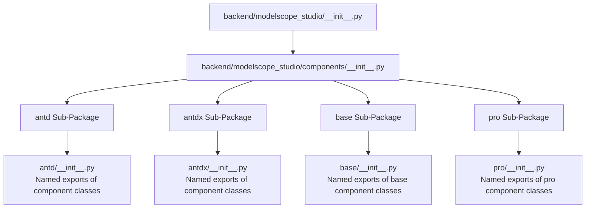
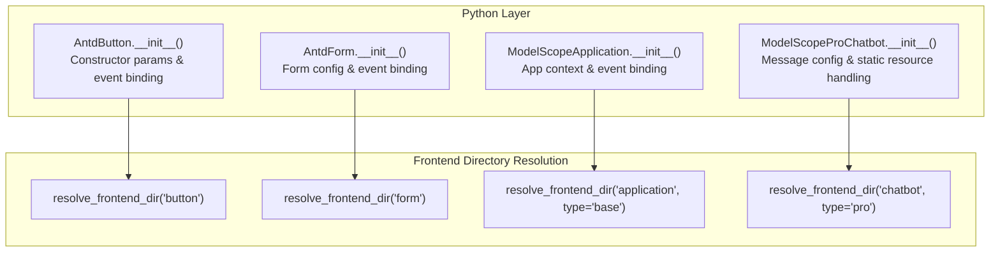
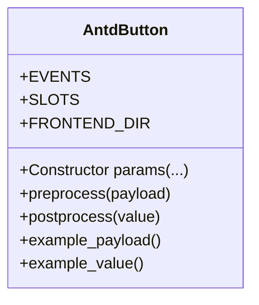
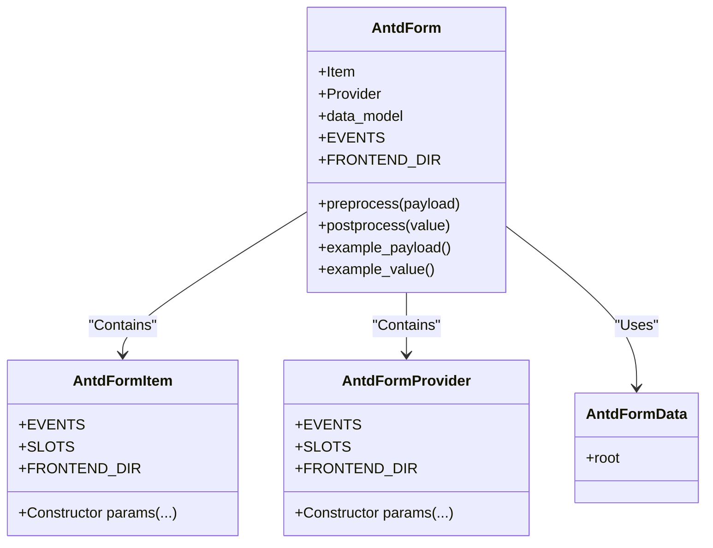
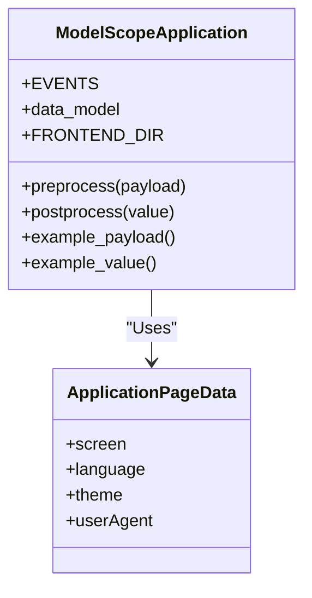
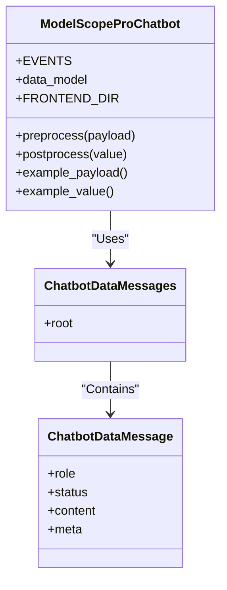
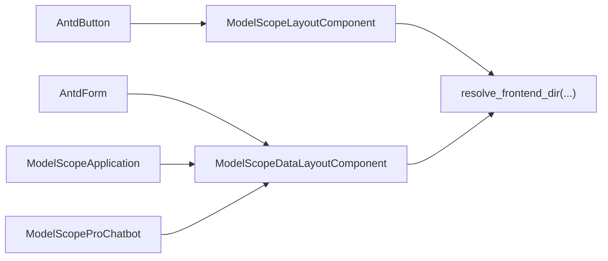

# Python API

<cite>
**Files Referenced in This Document**
- [backend/modelscope_studio/__init__.py](file://backend/modelscope_studio/__init__.py)
- [backend/modelscope_studio/components/__init__.py](file://backend/modelscope_studio/components/__init__.py)
- [backend/modelscope_studio/version.py](file://backend/modelscope_studio/version.py)
- [backend/modelscope_studio/components/antd/__init__.py](file://backend/modelscope_studio/components/antd/__init__.py)
- [backend/modelscope_studio/components/antd/components.py](file://backend/modelscope_studio/components/antd/components.py)
- [backend/modelscope_studio/components/antdx/__init__.py](file://backend/modelscope_studio/components/antdx/__init__.py)
- [backend/modelscope_studio/components/antdx/components.py](file://backend/modelscope_studio/components/antdx/components.py)
- [backend/modelscope_studio/components/base/__init__.py](file://backend/modelscope_studio/components/base/__init__.py)
- [backend/modelscope_studio/components/pro/__init__.py](file://backend/modelscope_studio/components/pro/__init__.py)
- [backend/modelscope_studio/components/pro/components.py](file://backend/modelscope_studio/components/pro/components.py)
- [backend/modelscope_studio/components/antd/button/__init__.py](file://backend/modelscope_studio/components/antd/button/__init__.py)
- [backend/modelscope_studio/components/antd/form/__init__.py](file://backend/modelscope_studio/components/antd/form/__init__.py)
- [backend/modelscope_studio/components/base/application/__init__.py](file://backend/modelscope_studio/components/base/application/__init__.py)
- [backend/modelscope_studio/components/pro/chatbot/__init__.py](file://backend/modelscope_studio/components/pro/chatbot/__init__.py)
</cite>

## Table of Contents

1. [Introduction](#introduction)
2. [Project Structure](#project-structure)
3. [Core Components](#core-components)
4. [Architecture Overview](#architecture-overview)
5. [Detailed Component Analysis](#detailed-component-analysis)
6. [Dependency Analysis](#dependency-analysis)
7. [Performance Considerations](#performance-considerations)
8. [Troubleshooting Guide](#troubleshooting-guide)
9. [Conclusion](#conclusion)
10. [Appendix: API Index and Usage Examples](#appendix-api-index-and-usage-examples)

## Introduction

This document is the Python API reference for ModelScope Studio, focusing on the component system and calling conventions of the backend Python package `modelscope_studio`. The document covers:

- Component import paths and named export conventions (`modelscope_studio.components.antd.*`, `modelscope_studio.components.antdx.*`, `modelscope_studio.components.base.*`, `modelscope_studio.components.pro.*`)
- Constructor parameters, supported events, slots, data models, and preprocess/postprocess flows for key component classes
- Standard instantiation examples (basic usage and advanced configuration), and lifecycle and state management essentials
- Parameter validation and exception handling mechanism notes
- Version compatibility information and common issue troubleshooting

## Project Structure

The Python package is located at `backend/modelscope_studio`; the top level aggregates sub-modules via `__all__` exports; components are organized hierarchically in four sub-packages: `antd`, `antdx`, `base`, and `pro`. Each sub-package provides both `__init__.py` and `components.py` entries for different aggregation strategies.

**Diagram Sources**

- [backend/modelscope_studio/**init**.py:1-3](file://backend/modelscope_studio/__init__.py#L1-L3)
- [backend/modelscope_studio/components/**init**.py:1-5](file://backend/modelscope_studio/components/__init__.py#L1-L5)

**Section Sources**

- [backend/modelscope_studio/**init**.py:1-3](file://backend/modelscope_studio/__init__.py#L1-L3)
- [backend/modelscope_studio/components/**init**.py:1-5](file://backend/modelscope_studio/components/__init__.py#L1-L5)

## Core Components

This section provides an overview of import paths and named exports for the four component families, and explains the responsibility boundaries and typical use cases of each family.

- `modelscope_studio.components.antd.*`
  - Responsibility: Python wrappers for the Ant Design component ecosystem, covering common UI components for layout, forms, feedback, navigation, and data entry.
  - Typical components: Button, Form, Input, Select, Table, Modal, Message, Notification, etc.
  - Import: `from modelscope_studio.components.antd import Button, Form, ...`
  - Named exports: See [backend/modelscope_studio/components/antd/**init**.py:1-150](file://backend/modelscope_studio/components/antd/__init__.py#L1-L150) and [backend/modelscope_studio/components/antd/components.py:1-144](file://backend/modelscope_studio/components/antd/components.py#L1-L144)

- `modelscope_studio.components.antdx.*`
  - Responsibility: Ant Design X extended component set, designed for conversational interaction and knowledge work scenarios (e.g., message bubbles, conversation lists, prompt panels, etc.).
  - Typical components: Bubble, Conversations, Prompts, Sender, ThoughtChain, Welcome, etc.
  - Import: `from modelscope_studio.components.antdx import Bubble, Conversations, ...`
  - Named exports: See [backend/modelscope_studio/components/antdx/**init**.py:1-42](file://backend/modelscope_studio/components/antdx/__init__.py#L1-L42) and [backend/modelscope_studio/components/antdx/components.py:1-40](file://backend/modelscope_studio/components/antdx/components.py#L1-L40)

- `modelscope_studio.components.base.*`
  - Responsibility: Base layout and container components providing general capabilities such as application-level containers, loop rendering, conditional filtering, placeholder text, etc.
  - Typical components: Application, Each, Filter, Fragment, Markdown, Slot, Text, Div, etc.
  - Import: `from modelscope_studio.components.base import Application, Each, ...`
  - Named exports: See [backend/modelscope_studio/components/base/**init**.py:1-11](file://backend/modelscope_studio/components/base/__init__.py#L1-L11)

- `modelscope_studio.components.pro.*`
  - Responsibility: Professional domain components designed for specific business scenarios (e.g., chatbot, code editor, multimodal input, web sandbox, etc.).
  - Typical components: Chatbot, MonacoEditor, MultimodalInput, WebSandbox.
  - Import: `from modelscope_studio.components.pro import Chatbot, MonacoEditor, ...`
  - Named exports: See [backend/modelscope_studio/components/pro/**init**.py:1-7](file://backend/modelscope_studio/components/pro/__init__.py#L1-L7) and [backend/modelscope_studio/components/pro/components.py:1-8](file://backend/modelscope_studio/components/pro/components.py#L1-L8)

**Section Sources**

- [backend/modelscope_studio/components/antd/**init**.py:1-150](file://backend/modelscope_studio/components/antd/__init__.py#L1-L150)
- [backend/modelscope_studio/components/antd/components.py:1-144](file://backend/modelscope_studio/components/antd/components.py#L1-L144)
- [backend/modelscope_studio/components/antdx/**init**.py:1-42](file://backend/modelscope_studio/components/antdx/__init__.py#L1-L42)
- [backend/modelscope_studio/components/antdx/components.py:1-40](file://backend/modelscope_studio/components/antdx/components.py#L1-L40)
- [backend/modelscope_studio/components/base/**init**.py:1-11](file://backend/modelscope_studio/components/base/__init__.py#L1-L11)
- [backend/modelscope_studio/components/pro/**init**.py:1-7](file://backend/modelscope_studio/components/pro/__init__.py#L1-L7)
- [backend/modelscope_studio/components/pro/components.py:1-8](file://backend/modelscope_studio/components/pro/components.py#L1-L8)

## Architecture Overview

The diagram below shows the relationship between Python layer component classes and frontend directory resolution, and the key nodes of event binding and data flow.

**Diagram Sources**

- [backend/modelscope_studio/components/antd/button/**init**.py:15-157](file://backend/modelscope_studio/components/antd/button/__init__.py#L15-L157)
- [backend/modelscope_studio/components/antd/form/**init**.py:17-133](file://backend/modelscope_studio/components/antd/form/__init__.py#L17-L133)
- [backend/modelscope_studio/components/base/application/**init**.py:26-115](file://backend/modelscope_studio/components/base/application/__init__.py#L26-L115)
- [backend/modelscope_studio/components/pro/chatbot/**init**.py:286-495](file://backend/modelscope_studio/components/pro/chatbot/__init__.py#L286-L495)

## Detailed Component Analysis

### Component: AntdButton

- Import Path: `from modelscope_studio.components.antd import Button`
- Purpose: Wraps the Ant Design button, supporting multiple types, sizes, shapes, loading state, danger state, ghost state, etc.
- Key Points:
  - Supported events: `click`
  - Slots: `icon`, `loading.icon`
  - Preprocess/postprocess: Simple string-to-string conversion
  - Frontend directory: `resolve_frontend_dir("button")`

**Diagram Sources**

- [backend/modelscope_studio/components/antd/button/**init**.py:15-157](file://backend/modelscope_studio/components/antd/button/__init__.py#L15-L157)

**Section Sources**

- [backend/modelscope_studio/components/antd/button/**init**.py:15-157](file://backend/modelscope_studio/components/antd/button/__init__.py#L15-L157)

### Component: AntdForm and AntdFormItem

- Import Path: `from modelscope_studio.components.antd import Form, Form.Item`
- Purpose: Wraps the Ant Design form, supporting events for field changes, submit, failure, value changes, etc., as well as form item rules and providers.
- Key Points:
  - Supported events: `fields_change`, `finish`, `finish_failed`, `values_change`
  - Data model: `AntdFormData`
  - Preprocess/postprocess: Extracts the `root` field from the data model or passes through as-is
  - Frontend directory: `resolve_frontend_dir("form")`

**Diagram Sources**

- [backend/modelscope_studio/components/antd/form/**init**.py:17-133](file://backend/modelscope_studio/components/antd/form/__init__.py#L17-L133)

**Section Sources**

- [backend/modelscope_studio/components/antd/form/**init**.py:17-133](file://backend/modelscope_studio/components/antd/form/__init__.py#L17-L133)

### Component: ModelScopeApplication

- Import Path: `from modelscope_studio.components.base import Application`
- Purpose: Application-level container providing page environment data (screen size, theme, language, etc.) and lifecycle events (mount, resize, unmount, custom).
- Key Points:
  - Supported events: `custom`, `mount`, `resize`, `unmount`
  - Data model: `ApplicationPageData`
  - Preprocess/postprocess: Pass-through
  - Frontend directory: `resolve_frontend_dir("application", type="base")`

**Diagram Sources**

- [backend/modelscope_studio/components/base/application/**init**.py:26-115](file://backend/modelscope_studio/components/base/application/__init__.py#L26-L115)

**Section Sources**

- [backend/modelscope_studio/components/base/application/**init**.py:26-115](file://backend/modelscope_studio/components/base/application/__init__.py#L26-L115)

### Component: ModelScopeProChatbot

- Import Path: `from modelscope_studio.components.pro import Chatbot`
- Purpose: Professional chatbot component supporting rich configurations including welcome messages, prompts, user/assistant messages, action buttons, file/tool/suggestion content, etc.
- Key Points:
  - Supported events: `change`, `copy`, `edit`, `delete`, `like`, `retry`, `suggestion_select`, `welcome_prompt_select`
  - Data model: `ChatbotDataMessages` (root is a message list)
  - Preprocess/postprocess: Typed processing of message content (file to FileData, static resource path handling)
  - Frontend directory: `resolve_frontend_dir("chatbot", type="pro")`

**Diagram Sources**

- [backend/modelscope_studio/components/pro/chatbot/**init**.py:286-495](file://backend/modelscope_studio/components/pro/chatbot/__init__.py#L286-L495)

**Section Sources**

- [backend/modelscope_studio/components/pro/chatbot/**init**.py:286-495](file://backend/modelscope_studio/components/pro/chatbot/__init__.py#L286-L495)

## Dependency Analysis

- Component classes generally inherit from `ModelScopeDataLayoutComponent` or `ModelScopeLayoutComponent`, unifying the frontend directory resolution and event binding mechanism.
- The event system is based on `gradio.events.EventListener`, injecting event binding flags into the internal update logic via callbacks.
- Data models mostly adopt `GradioRootModel`/`GradioModel` for consistent data structures and serialization between frontend and backend.

**Diagram Sources**

- [backend/modelscope_studio/components/antd/button/**init**.py:7-8](file://backend/modelscope_studio/components/antd/button/__init__.py#L7-L8)
- [backend/modelscope_studio/components/antd/form/**init**.py:8-9](file://backend/modelscope_studio/components/antd/form/__init__.py#L8-L9)
- [backend/modelscope_studio/components/base/application/**init**.py:8-9](file://backend/modelscope_studio/components/base/application/__init__.py#L8-L9)
- [backend/modelscope_studio/components/pro/chatbot/**init**.py:11](file://backend/modelscope_studio/components/pro/chatbot/__init__.py#L11)

**Section Sources**

- [backend/modelscope_studio/components/antd/button/**init**.py:7-8](file://backend/modelscope_studio/components/antd/button/__init__.py#L7-L8)
- [backend/modelscope_studio/components/antd/form/**init**.py:8-9](file://backend/modelscope_studio/components/antd/form/__init__.py#L8-L9)
- [backend/modelscope_studio/components/base/application/**init**.py:8-9](file://backend/modelscope_studio/components/base/application/__init__.py#L8-L9)
- [backend/modelscope_studio/components/pro/chatbot/**init**.py:11](file://backend/modelscope_studio/components/pro/chatbot/__init__.py#L11)

## Performance Considerations

- Keep component preprocess/postprocess lightweight; avoid heavy computations in the Python layer.
- For large file content (e.g., file messages in the chatbot), it is recommended to perform minimal wrapping during postprocessing (e.g., retaining only necessary metadata) to reduce transmission overhead.
- Set component height and scrolling behavior appropriately to avoid unnecessary reflow and repaints.

## Troubleshooting Guide

- Event Not Triggered
  - Check that event listeners are correctly registered (e.g., Button's `click`, Form's `finish`), and confirm that the callback has injected the binding flag.
  - Reference: [backend/modelscope_studio/components/antd/button/**init**.py:41-46](file://backend/modelscope_studio/components/antd/button/__init__.py#L41-L46), [backend/modelscope_studio/components/antd/form/**init**.py:23-36](file://backend/modelscope_studio/components/antd/form/__init__.py#L23-L36)
- Frontend Directory Resolution Failure
  - Confirm that the path returned by `resolve_frontend_dir` exists and is accessible.
  - Reference: [backend/modelscope_studio/components/antd/button/**init**.py:139](file://backend/modelscope_studio/components/antd/button/__init__.py#L139), [backend/modelscope_studio/components/antd/form/**init**.py:114](file://backend/modelscope_studio/components/antd/form/__init__.py#L114)
- Data Model Mismatch
  - Use `data_model` for preprocess/postprocess to ensure the payload/value structure is consistent with the model.
  - Reference: [backend/modelscope_studio/components/antd/form/**init**.py:13-14](file://backend/modelscope_studio/components/antd/form/__init__.py#L13-L14), [backend/modelscope_studio/components/pro/chatbot/**init**.py:388](file://backend/modelscope_studio/components/pro/chatbot/__init__.py#L388)

**Section Sources**

- [backend/modelscope_studio/components/antd/button/**init**.py:41-46](file://backend/modelscope_studio/components/antd/button/__init__.py#L41-L46)
- [backend/modelscope_studio/components/antd/form/**init**.py:13-14](file://backend/modelscope_studio/components/antd/form/__init__.py#L13-L14)
- [backend/modelscope_studio/components/antd/form/**init**.py:23-36](file://backend/modelscope_studio/components/antd/form/__init__.py#L23-L36)
- [backend/modelscope_studio/components/antd/button/**init**.py:139](file://backend/modelscope_studio/components/antd/button/__init__.py#L139)
- [backend/modelscope_studio/components/antd/form/**init**.py:114](file://backend/modelscope_studio/components/antd/form/__init__.py#L114)
- [backend/modelscope_studio/components/pro/chatbot/**init**.py:388](file://backend/modelscope_studio/components/pro/chatbot/__init__.py#L388)

## Conclusion

ModelScope Studio's Python API, with its clear component family divisions and unified event/data model design, provides a complete component system from basic layout to professional domains. Through clearly defined import paths and named exports, developers can quickly locate and use the components they need; meanwhile, the event binding and data preprocess/postprocess mechanisms ensure consistency and extensibility of frontend-backend collaboration.

## Appendix: API Index and Usage Examples

### API Index (by Component Family)

- `modelscope_studio.components.antd.*`
  - Button: `from modelscope_studio.components.antd import Button`
  - Form: `from modelscope_studio.components.antd import Form`
  - Form.Item: `from modelscope_studio.components.antd import Form.Item`
  - More components: See [backend/modelscope_studio/components/antd/**init**.py:1-150](file://backend/modelscope_studio/components/antd/__init__.py#L1-L150)

- `modelscope_studio.components.antdx.*`
  - Actions, Bubble, Conversations, Prompts, Sender, ThoughtChain, Welcome, etc.
  - Import example: `from modelscope_studio.components.antdx import Bubble, Conversations`
  - See [backend/modelscope_studio/components/antdx/**init**.py:1-42](file://backend/modelscope_studio/components/antdx/__init__.py#L1-L42)

- `modelscope_studio.components.base.*`
  - Application, Each, Filter, Fragment, Markdown, Slot, Text, Div, etc.
  - Import example: `from modelscope_studio.components.base import Application`
  - See [backend/modelscope_studio/components/base/**init**.py:1-11](file://backend/modelscope_studio/components/base/__init__.py#L1-L11)

- `modelscope_studio.components.pro.*`
  - Chatbot, MonacoEditor, MultimodalInput, WebSandbox, etc.
  - Import example: `from modelscope_studio.components.pro import Chatbot`
  - See [backend/modelscope_studio/components/pro/**init**.py:1-7](file://backend/modelscope_studio/components/pro/__init__.py#L1-L7)

### Usage Examples (Path References)

- Basic Button (AntdButton)
  - Example path: [backend/modelscope_studio/components/antd/button/**init**.py:51-87](file://backend/modelscope_studio/components/antd/button/__init__.py#L51-L87)
- Form (AntdForm) and Form Item (AntdFormItem)
  - Example path: [backend/modelscope_studio/components/antd/form/**init**.py:43-80](file://backend/modelscope_studio/components/antd/form/__init__.py#L43-L80)
- Application Container (ModelScopeApplication)
  - Example path: [backend/modelscope_studio/components/base/application/**init**.py:59-71](file://backend/modelscope_studio/components/base/application/__init__.py#L59-L71)
- Chatbot (ModelScopeProChatbot)
  - Example path: [backend/modelscope_studio/components/pro/chatbot/**init**.py:319-343](file://backend/modelscope_studio/components/pro/chatbot/__init__.py#L319-L343)

### Lifecycle and Event Callbacks

- AntdButton
  - Events: `click`
  - Slots: `icon`, `loading.icon`
  - Reference: [backend/modelscope_studio/components/antd/button/**init**.py:41-49](file://backend/modelscope_studio/components/antd/button/__init__.py#L41-L49)
- AntdForm
  - Events: `fields_change`, `finish`, `finish_failed`, `values_change`
  - Data model: `AntdFormData`
  - Reference: [backend/modelscope_studio/components/antd/form/**init**.py:23-36](file://backend/modelscope_studio/components/antd/form/__init__.py#L23-L36)
- ModelScopeApplication
  - Events: `custom`, `mount`, `resize`, `unmount`
  - Data model: `ApplicationPageData`
  - Reference: [backend/modelscope_studio/components/base/application/**init**.py:30-54](file://backend/modelscope_studio/components/base/application/__init__.py#L30-L54)
- ModelScopeProChatbot
  - Events: `change`, `copy`, `edit`, `delete`, `like`, `retry`, `suggestion_select`, `welcome_prompt_select`
  - Data model: `ChatbotDataMessages`
  - Reference: [backend/modelscope_studio/components/pro/chatbot/**init**.py:289-314](file://backend/modelscope_studio/components/pro/chatbot/__init__.py#L289-L314)

### Parameter Validation and Exception Handling

- Parameter Validation
  - Constructor parameters are mostly optional or have default values; type annotations cover common enums and dictionary structures.
  - Reference: [backend/modelscope_studio/components/antd/button/**init**.py:51-87](file://backend/modelscope_studio/components/antd/button/__init__.py#L51-L87), [backend/modelscope_studio/components/antd/form/**init**.py:43-80](file://backend/modelscope_studio/components/antd/form/__init__.py#L43-L80)
- Exception Handling
  - It is recommended to catch exceptions in event callbacks at the business layer and log the error context.
  - When frontend directory resolution fails, check whether the path returned by `resolve_frontend_dir` exists.

### Version Compatibility

- Current version: 2.0.0
  - Reference: [backend/modelscope_studio/version.py:1-2](file://backend/modelscope_studio/version.py#L1-L2)
