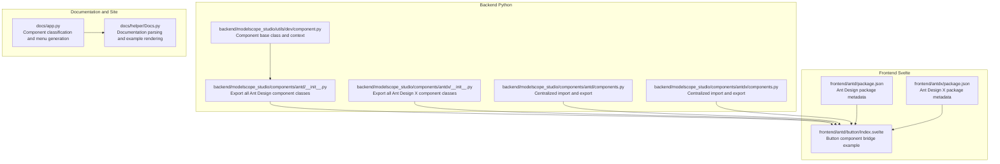
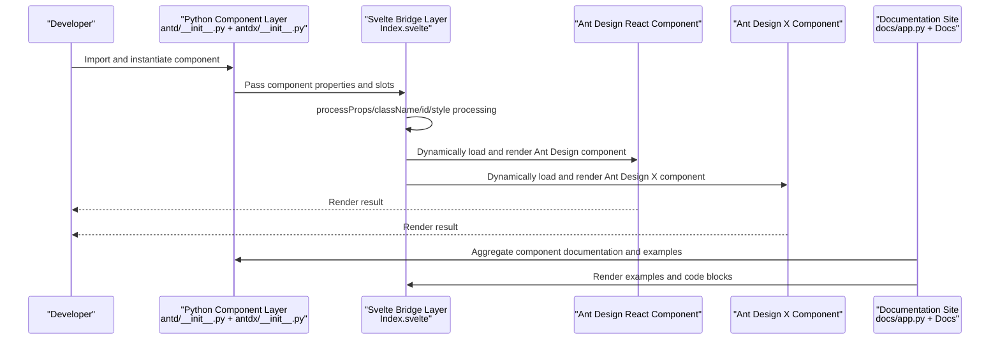
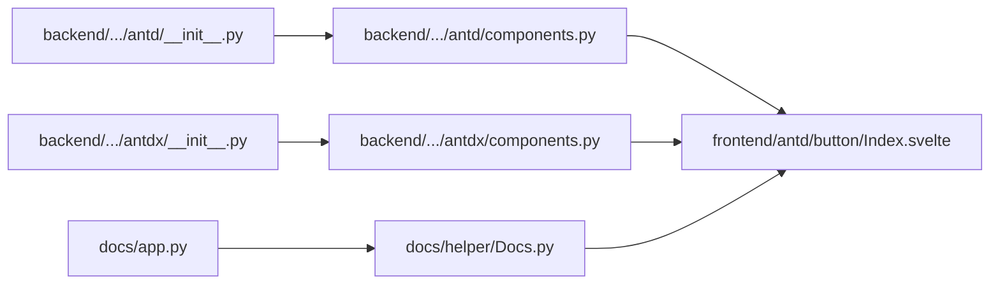

# Ant Design Components

<cite>
**Files referenced in this document**
- [backend/modelscope_studio/components/antd/__init__.py](file://backend/modelscope_studio/components/antd/__init__.py)
- [backend/modelscope_studio/components/antd/components.py](file://backend/modelscope_studio/components/antd/components.py)
- [backend/modelscope_studio/components/antdx/__init__.py](file://backend/modelscope_studio/components/antdx/__init__.py)
- [backend/modelscope_studio/components/antdx/components.py](file://backend/modelscope_studio/components/antdx/components.py)
- [frontend/antd/package.json](file://frontend/antd/package.json)
- [frontend/antdx/package.json](file://frontend/antdx/package.json)
- [docs/app.py](file://docs/app.py)
- [docs/helper/Docs.py](file://docs/helper/Docs.py)
- [backend/modelscope_studio/utils/dev/component.py](file://backend/modelscope_studio/utils/dev/component.py)
- [frontend/antd/button/Index.svelte](file://frontend/antd/button/Index.svelte)
- [README-zh_CN.md](file://README-zh_CN.md)
- [.changeset/pink-sails-itch.md](file://.changeset/pink-sails-itch.md)
- [.changeset/eleven-aliens-sell.md](file://.changeset/eleven-aliens-sell.md)
- [backend/modelscope_studio/components/antdx/thought_chain/thought_chain_item/__init__.py](file://backend/modelscope_studio/components/antdx/thought_chain/thought_chain_item/__init__.py)
- [backend/modelscope_studio/components/antdx/folder/directory_icon/__init__.py](file://backend/modelscope_studio/components/antdx/folder/directory_icon/__init__.py)
- [backend/modelscope_studio/components/antdx/sender/header/__init__.py](file://backend/modelscope_studio/components/antdx/sender/header/__init__.py)
</cite>

## Update Summary

**Changes made**

- Updated version information reflecting major upgrades from Gradio 5.x to 6.0, Ant Design 5.x to 6.0, and Ant Design X 1.x to 2.0
- Added complete feature introduction for Ant Design X component library, including new components like ThoughtChain, Folder, Sender, etc.
- Expanded component classification with new component groups and feature descriptions
- Updated architecture documentation to reflect the new component organization structure

## Table of Contents

1. [Introduction](#introduction)
2. [Project Structure](#project-structure)
3. [Core Components](#core-components)
4. [Architecture Overview](#architecture-overview)
5. [Component Details](#component-details)
6. [Ant Design X Component Library](#ant-design-x-component-library)
7. [Dependency Analysis](#dependency-analysis)
8. [Performance Considerations](#performance-considerations)
9. [Troubleshooting Guide](#troubleshooting-guide)
10. [Conclusion](#conclusion)
11. [Appendix](#appendix)

## Introduction

This document covers the Ant Design component library in ModelScope Studio, systematically organizing component classifications, features, and usage methods across six major categories: General Components, Layout Components, Navigation Components, Data Entry Components, Data Display Components, and Feedback Components. With the major upgrades to Gradio 6.0, Ant Design 6.0, and Ant Design X 2.0, the component library now supports richer interaction capabilities and a more modern design system. The documentation also provides property descriptions, event handling, style customization, responsive and internationalization support, performance optimization, and best practices, along with rich examples and scenario-based explanations to help developers get started quickly and achieve high-quality implementations.

## Project Structure

ModelScope Studio exports Ant Design components as a Python package and bridges them to Ant Design React components through frontend Svelte packages, forming a dual-layer architecture of "Python layer component definition + frontend rendering bridge". It now also integrates the Ant Design X component library, providing richer interactive components. The documentation site aggregates documentation and examples for each component through a unified entry point for easy browsing and comparison.

**Diagram Source**

- [backend/modelscope_studio/components/antd/**init**.py:1-150](file://backend/modelscope_studio/components/antd/__init__.py#L1-L150)
- [backend/modelscope_studio/components/antd/components.py:1-147](file://backend/modelscope_studio/components/antd/components.py#L1-L147)
- [backend/modelscope_studio/components/antdx/**init**.py:1-42](file://backend/modelscope_studio/components/antdx/__init__.py#L1-L42)
- [backend/modelscope_studio/components/antdx/components.py:1-40](file://backend/modelscope_studio/components/antdx/components.py#L1-L40)
- [backend/modelscope_studio/utils/dev/component.py:1-169](file://backend/modelscope_studio/utils/dev/component.py#L1-L169)
- [frontend/antd/package.json:1-6](file://frontend/antd/package.json#L1-L6)
- [frontend/antdx/package.json:1-6](file://frontend/antdx/package.json#L1-L6)
- [frontend/antd/button/Index.svelte:1-74](file://frontend/antd/button/Index.svelte#L1-L74)
- [docs/app.py:19-438](file://docs/app.py#L19-L438)
- [docs/helper/Docs.py:12-178](file://docs/helper/Docs.py#L12-L178)

**Section Source**

- [docs/app.py:19-438](file://docs/app.py#L19-L438)
- [docs/helper/Docs.py:12-178](file://docs/helper/Docs.py#L12-L178)
- [backend/modelscope_studio/components/antd/**init**.py:1-150](file://backend/modelscope_studio/components/antd/__init__.py#L1-L150)
- [backend/modelscope_studio/components/antd/components.py:1-147](file://backend/modelscope_studio/components/antd/components.py#L1-L147)
- [backend/modelscope_studio/components/antdx/**init**.py:1-42](file://backend/modelscope_studio/components/antdx/__init__.py#L1-L42)
- [backend/modelscope_studio/components/antdx/components.py:1-40](file://backend/modelscope_studio/components/antdx/components.py#L1-L40)
- [backend/modelscope_studio/utils/dev/component.py:1-169](file://backend/modelscope_studio/utils/dev/component.py#L1-L169)
- [frontend/antd/package.json:1-6](file://frontend/antd/package.json#L1-L6)
- [frontend/antdx/package.json:1-6](file://frontend/antdx/package.json#L1-L6)
- [frontend/antd/button/Index.svelte:1-74](file://frontend/antd/button/Index.svelte#L1-L74)

## Core Components

- Component Export and Naming: The backend uniformly exports Ant Design component classes through **init**.py and components.py, now including Ant Design X components, facilitating on-demand import and batch usage.
- Component Base Classes: ModelScopeComponent/ModelScopeLayoutComponent/ModelScopeDataLayoutComponent provide unified visibility, element ID, class name, inline style, slot, and lifecycle behaviors.
- Frontend Bridge: Svelte components dynamically load Ant Design React components through importComponent, uniformly handling props, slots, and style injection.
- Version Upgrade: Upgraded from Gradio 5.x to 6.0, supporting a more powerful event system and component lifecycle management.

**Section Source**

- [backend/modelscope_studio/components/antd/**init**.py:1-150](file://backend/modelscope_studio/components/antd/__init__.py#L1-L150)
- [backend/modelscope_studio/components/antd/components.py:1-147](file://backend/modelscope_studio/components/antd/components.py#L1-L147)
- [backend/modelscope_studio/components/antdx/**init**.py:1-42](file://backend/modelscope_studio/components/antdx/__init__.py#L1-L42)
- [backend/modelscope_studio/components/antdx/components.py:1-40](file://backend/modelscope_studio/components/antdx/components.py#L1-L40)
- [backend/modelscope_studio/utils/dev/component.py:54-169](file://backend/modelscope_studio/utils/dev/component.py#L54-L169)
- [frontend/antd/button/Index.svelte:10-74](file://frontend/antd/button/Index.svelte#L10-L74)

## Architecture Overview

The diagram below shows the key flow from Python component invocation to frontend rendering, and how the documentation site organizes and presents component examples. It now includes support for Ant Design X components.

**Diagram Source**

- [docs/app.py:19-438](file://docs/app.py#L19-L438)
- [docs/helper/Docs.py:82-178](file://docs/helper/Docs.py#L82-L178)
- [frontend/antd/button/Index.svelte:24-74](file://frontend/antd/button/Index.svelte#L24-L74)

## Component Details

### General Components

- Button: Supports link navigation, icons, sizes, and theme variants; controls target behavior through href_target; supports slots and style customization.
- FloatButton: Supports back-to-top, grouping, and icons; can combine multiple floating actions.
- Icon: Supports icon font providers; can be used with other components.
- Typography: Supports semantic typography elements like headings, text, paragraphs, and links.

Usage Tips

- Property Mapping: The frontend uniformly passes through visible, elem_id, elem_classes, elem_style, value, etc. through processProps.
- Slots: The Svelte side gets the default slot through getSlots for rendering child nodes.
- Example: The button component bridge example demonstrates dynamic loading and style concatenation.

**Section Source**

- [frontend/antd/button/Index.svelte:24-74](file://frontend/antd/button/Index.svelte#L24-L74)
- [docs/app.py:198-209](file://docs/app.py#L198-L209)

### Layout Components

- Divider: Supports horizontal/vertical and dashed styles.
- Flex: Provides flexible flex container capabilities.
- Grid: Row and Col support responsive breakpoints and gutters.
- Layout: Contains Header, Sider, Content, Footer subcomponents, suitable for building page skeletons.
- Space: Supports compact mode and wrapping child items.
- Splitter: Supports panels and drag splitting.
- Masonry: Supports responsive column count and automatic item height adjustment.

Usage Tips

- Responsive: Grid and Flex provide multi-breakpoint configurations for mobile and desktop adaptation.
- Styling: elem_style can be applied directly to containers for positioning, dimensions, and margin control.

**Section Source**

- [docs/app.py:216-233](file://docs/app.py#L216-L233)

### Navigation Components

- Anchor: Supports scroll positioning and anchor items.
- Breadcrumb: Supports custom separators and route items.
- Dropdown: Supports button dropdowns and menu items.
- Menu: Supports multi-level menus and selected state.
- Pagination: Supports page switching and sizes.
- Steps: Supports step status and descriptions.

Usage Tips

- Events: Navigation components typically trigger page transitions or content updates through callbacks or state changes.
- Internationalization: Language environment can be set uniformly through ConfigProvider (see "Internationalization Support").

**Section Source**

- [docs/app.py:240-257](file://docs/app.py#L240-L257)

### Data Entry Components

- AutoComplete: Supports options and backfill.
- Cascader: Supports multi-level linkage and lazy loading.
- Checkbox: Supports groups and options.
- ColorPicker: Supports presets and formatting.
- DatePicker: Supports range selection and preset shortcuts.
- Form: Supports field validation rules, dynamic add/remove, and Provider.
- Input: Supports password, search, textarea, and OTP.
- InputNumber: Supports step and precision.
- Mentions: Supports keyword mentions and options.
- Radio: Supports buttons and groups.
- Rate: Supports readonly and half-star.
- Select: Supports multi-select and search.
- Slider: Supports marks and range.
- Switch: Supports disabled and loading.
- TimePicker: Supports range selection.
- Transfer: Supports source and target lists.
- TreeSelect: Supports directory tree and nodes.
- Upload: Supports drag and drop and custom requests.

Usage Tips

- Validation: FormItemRule provides validation rule definitions; dynamic forms support conditional rendering and field add/remove.
- Events: Common events like onChange/onFocus/onBlur can be used for linkage and state management.
- Styling: elem_style/elem_classes are used for fine-tuning appearance and layout.

**Section Source**

- [docs/app.py:264-317](file://docs/app.py#L264-L317)

### Data Display Components

- Avatar: Supports avatar groups and badges.
- Badge: Supports ribbons and badges.
- Calendar: Supports month view and event markers.
- Card: Supports grid and meta information.
- Carousel: Supports auto-play and indicators.
- Collapse: Supports accordion and panel items.
- Descriptions: Supports key-value pair display.
- Empty: Supports custom images and actions.
- Image: Supports preview groups and lazy loading.
- List: Supports items and meta information.
- Popover: Supports triggers and content.
- QRCode: Supports colors and sizes.
- Segmented: Supports options and disabled.
- Statistic: Supports countdown and timer.
- Table: Supports columns, expansion, selection, and sorting.
- Tabs: Supports tab items and types.
- Tag: Supports checkable tags.
- Timeline: Supports nodes and directions.
- Tooltip: Supports triggers and positions.
- Tour: Supports steps and highlights.
- Tree: Supports directory tree and nodes.

Usage Tips

- Table: Supports fixed columns, sorting, filtering, and pagination; can combine with Segmented for dimension switching.
- Image: ImagePreviewGroup provides multi-image preview capability.
- Interaction: Popover/Tooltip/Tour improve information density and guidance efficiency.

**Section Source**

- [docs/app.py:324-386](file://docs/app.py#L324-L386)

### Feedback Components

- Alert: Supports multiple types and closable.
- Drawer: Supports positions and nested content.
- Message: Supports global messages and duration.
- Modal: Supports static dialogs and mask layers.
- Notification: Supports multiple notifications and closable.
- Popconfirm: Supports confirm and cancel callbacks.
- Progress: Supports circle and percentage.
- Result: Supports success/error/waiting status pages.
- Skeleton: Supports avatar, button, input, and image.
- Spin: Supports fullscreen and inline.
- Watermark: Supports text and image watermarks.

Usage Tips

- Global Components: Message/Notification/Modal/Drawer are typically invoked through APIs rather than direct rendering.
- Animation and Transitions: Progress/Spin/Skeleton improve loading experience and placeholder effects.
- Accessibility: It is recommended to provide keyboard-accessible and screen-reader-friendly cues for interactive components.

**Section Source**

- [docs/app.py:393-425](file://docs/app.py#L393-L425)

### Other Components

- Affix: Supports pinning and offset.
- ConfigProvider: Provides theme, language, and global style overrides.

Usage Tips

- Internationalization: ConfigProvider supports locales injection for Chinese/English switching.
- Theme: Override global theme variables through ConfigProvider for consistent style.

**Section Source**

- [docs/app.py:432-437](file://docs/app.py#L432-L437)

## Ant Design X Component Library

### New Component Overview

Ant Design X is an extension component library of Ant Design, providing richer interactive components and solutions for professional application scenarios. This upgrade includes the following main components:

#### Thought Chain Component

- ThoughtChain: Thought chain container component, supports multi-step thought process display
- ThoughtChainItem: Thought chain item component, supports state management, collapsible, and blinking effects
- Supports pending, success, error, abort states
- Configurable content, description, footer, icon, and title

#### File Management Components

- Folder: Folder component, supports directory tree and file management
- FolderDirectoryIcon: Directory icon component, supports different file type icon display
- FileCard: File card component, supports file list display
- FileCardList: File list component, supports file item management

#### Conversation Interaction Components

- Bubble: Message bubble component, supports user and system message display
- BubbleList: Message list component, supports message items and role management
- Conversations: Conversation component, supports history conversation management
- Sender: Sender component, supports message sending and header management
- SenderHeader: Sender header component, supports expand state control

#### Content Display Components

- CodeHighlighter: Code highlighting component, supports multiple programming language syntax highlighting
- Mermaid: Chart component, supports Mermaid syntax chart rendering
- Prompts: Prompt component, supports prompt management and display
- Sources: Source component, supports content source display
- Suggestion: Suggestion component, supports smart suggestion display

#### Interaction Tool Components

- Actions: Action component, supports multiple action buttons
- Attachments: Attachment component, supports file attachment management
- Notification: Notification component, supports system notification display
- Welcome: Welcome component, supports welcome page display
- XProvider: Provider component, supports context provision

Usage Tips

- Slot System: Most components support named slots like content, description, footer, icon, title, etc.
- Event System: Supports event listening like open_change
- State Management: Supports state properties like open, closable, collapsible, etc.
- Style Customization: Supports styles and class_names properties for style customization

**Section Source**

- [backend/modelscope_studio/components/antdx/thought_chain/thought_chain_item/**init**.py:1-81](file://backend/modelscope_studio/components/antdx/thought_chain/thought_chain_item/__init__.py#L1-L81)
- [backend/modelscope_studio/components/antdx/folder/directory_icon/**init**.py:1-61](file://backend/modelscope_studio/components/antdx/folder/directory_icon/__init__.py#L1-L61)
- [backend/modelscope_studio/components/antdx/sender/header/**init**.py:1-74](file://backend/modelscope_studio/components/antdx/sender/header/__init__.py#L1-L74)
- [backend/modelscope_studio/components/antdx/**init**.py:1-42](file://backend/modelscope_studio/components/antdx/__init__.py#L1-L42)
- [backend/modelscope_studio/components/antdx/components.py:1-40](file://backend/modelscope_studio/components/antdx/components.py#L1-L40)

## Dependency Analysis

- Python Layer Export: **init**.py and components.py centrally export Ant Design and Ant Design X component classes for unified import.
- Frontend Bridge: Svelte components dynamically load Ant Design React and Ant Design X components through importComponent, with processProps uniformly handling properties and styles.
- Documentation Site: docs/app.py aggregates component documentation and examples, Docs.py parses Markdown and renders examples and code blocks.

**Diagram Source**

- [backend/modelscope_studio/components/antd/**init**.py:1-150](file://backend/modelscope_studio/components/antd/__init__.py#L1-L150)
- [backend/modelscope_studio/components/antd/components.py:1-147](file://backend/modelscope_studio/components/antd/components.py#L1-L147)
- [backend/modelscope_studio/components/antdx/**init**.py:1-42](file://backend/modelscope_studio/components/antdx/__init__.py#L1-L42)
- [backend/modelscope_studio/components/antdx/components.py:1-40](file://backend/modelscope_studio/components/antdx/components.py#L1-L40)
- [frontend/antd/button/Index.svelte:10-74](file://frontend/antd/button/Index.svelte#L10-L74)
- [docs/app.py:19-438](file://docs/app.py#L19-L438)
- [docs/helper/Docs.py:12-178](file://docs/helper/Docs.py#L12-L178)

**Section Source**

- [backend/modelscope_studio/components/antd/**init**.py:1-150](file://backend/modelscope_studio/components/antd/__init__.py#L1-L150)
- [backend/modelscope_studio/components/antd/components.py:1-147](file://backend/modelscope_studio/components/antd/components.py#L1-L147)
- [backend/modelscope_studio/components/antdx/**init**.py:1-42](file://backend/modelscope_studio/components/antdx/__init__.py#L1-L42)
- [backend/modelscope_studio/components/antdx/components.py:1-40](file://backend/modelscope_studio/components/antdx/components.py#L1-L40)
- [frontend/antd/button/Index.svelte:10-74](file://frontend/antd/button/Index.svelte#L10-L74)
- [docs/app.py:19-438](file://docs/app.py#L19-L438)
- [docs/helper/Docs.py:12-178](file://docs/helper/Docs.py#L12-L178)

## Performance Considerations

- Dynamic Loading: The frontend implements on-demand loading through importComponent, reducing initial bundle size and first-screen blocking.
- Property Pass-through: processProps uniformly handles properties and styles, avoiding repeated calculations and redundant rendering.
- Tables and Lists: Use virtualization and pagination reasonably to avoid rendering large numbers of nodes at once.
- Images and Skeleton: Use Skeleton and Image.lazy to reduce resource pressure and blank screen time.
- Global Components: Message/Notification/Modal etc. should limit concurrent quantity to avoid lag caused by frequent popups.
- Styling: elem_style/elem_classes should be reused as much as possible to avoid excessive inline styles causing repaints.
- Component Lazy Loading: Ant Design X components support lazy loading to improve application startup performance.

## Troubleshooting Guide

- Blank page or component not displaying
  - Confirm that Application and ConfigProvider are wrapped in the outer layer.
  - Enable ssr_mode=False when starting in Hugging Face Space.
  - Check dependency version compatibility of Ant Design X components.
- Abnormal component styles
  - Use elem_style/elem_classes to adjust container styles; avoid conflicts with global styles.
  - Check whether theme and font resources are correctly imported.
  - Confirm that Ant Design X component style files are correctly loaded.
- Internationalization not taking effect
  - Inject locales through ConfigProvider; ensure language keys match Ant Design language packs.
- Examples not running
  - Confirm that component documentation paths and example files exist in docs/app.py; check Docs.py example module loading logic.
  - Check whether import paths for new components are correct.
- Version compatibility issues
  - Ensure Gradio, Ant Design, and Ant Design X versions match.
  - Check whether component properties are compatible with new versions.

**Section Source**

- [README-zh_CN.md:32-32](file://README-zh_CN.md#L32-L32)
- [docs/app.py:577-595](file://docs/app.py#L577-L595)
- [docs/helper/Docs.py:58-75](file://docs/helper/Docs.py#L58-L75)

## Conclusion

ModelScope Studio's Ant Design component library achieves seamless integration of Ant Design components in the Gradio ecosystem through a clear Python export layer and frontend bridge layer. With the major upgrades to Gradio 6.0, Ant Design 6.0, and Ant Design X 2.0, the component library now provides richer interaction capabilities and a more modern design system. With a unified base class system, slot mechanism, event system, and documentation site, developers can efficiently build beautiful and maintainable interfaces. It is recommended to combine responsive and internationalization strategies in actual projects, follow performance optimization and best practices to achieve a better user experience.

## Appendix

### Component Properties and Events Common Notes

- Common Properties
  - visible: Controls component visibility
  - elem_id: Element ID
  - elem_classes: Class name array or string
  - elem_style: Inline style object
  - value: Component value (if applicable)
- Events
  - onChange/onFocus/onBlur: Common for input components
  - onClick/onContextMenu: Common for button and interactive components
  - onConfirm/onCancel: Common for confirmation components
  - open_change: For state changes in expandable components
- Slots
  - Default slot is used to render child nodes; some components support named slots like content, description, footer, icon, title, etc.

**Section Source**

- [backend/modelscope_studio/utils/dev/component.py:54-169](file://backend/modelscope_studio/utils/dev/component.py#L54-L169)
- [frontend/antd/button/Index.svelte:24-74](file://frontend/antd/button/Index.svelte#L24-L74)

### Responsive Design and Internationalization Support

- Responsive
  - Grid and Flex provide multi-breakpoint configurations; it is recommended to set breakpoints and spacing separately for mobile and desktop.
- Internationalization
  - Inject locales through ConfigProvider to achieve Chinese/English switching; note the correspondence between language packs and component text.

**Section Source**

- [docs/app.py:435-437](file://docs/app.py#L435-L437)

### Code Examples and Scenario-based Applications

- Example Organization
  - The documentation site automatically scans the demos directory through Docs.py, rendering examples and code blocks; supports collapsible display and title annotation.
- Scenario Suggestions
  - Forms: Use Form + FormItem + validation rules, combined with dynamic forms for conditional rendering.
  - Data Tables: Combine Pagination and virtual scrolling to improve interaction smoothness with large data volumes.
  - Navigation: Use Menu + Breadcrumb + Steps to build clear hierarchy and process guidance.
  - Feedback: Use Message/Notification/Modal/Drawer to provide timely user feedback and operation confirmation.
  - Thought Chain: Use ThoughtChain + ThoughtChainItem to build AI application thought process display.
  - File Management: Use Folder + FileCard + Attachments to implement file management system.

**Section Source**

- [docs/helper/Docs.py:82-178](file://docs/helper/Docs.py#L82-L178)
- [docs/app.py:19-438](file://docs/app.py#L19-L438)

### Parameter Mapping Supplementary Notes

- Collapse Component Properties
  - active_key: Currently expanded panel key
  - default_active_key: Default expanded panel key
  - accordion: Accordion mode
  - bordered: Whether to have border
  - collapsible: Collapsible trigger area
  - destroy_inactive_panel: Destroy collapsed hidden panels
  - expand_icon: Custom expand icon
  - expand_icon_placement: Expand icon position, options are `start` or `end`
  - ghost: Transparent borderless
  - size: Size

### Version Upgrade Notes

- Gradio 6.0 Upgrade
  - Supports new event system and component lifecycle management
  - Improved component state management and data flow
- Ant Design 6.0 Upgrade
  - More modern design system and visual specifications
  - Enhanced accessibility support
  - Improved theme customization capabilities
- Ant Design X 2.0 Upgrade
  - Added rich interactive components
  - Improved component API and slot system
  - Enhanced TypeScript type support

**Section Source**

- [.changeset/pink-sails-itch.md:12-12](file://.changeset/pink-sails-itch.md#L12-L12)
- [.changeset/eleven-aliens-sell.md:12-12](file://.changeset/eleven-aliens-sell.md#L12-L12)
- [frontend/antd/package.json:1-6](file://frontend/antd/package.json#L1-L6)
- [frontend/antdx/package.json:1-6](file://frontend/antdx/package.json#L1-L6)
