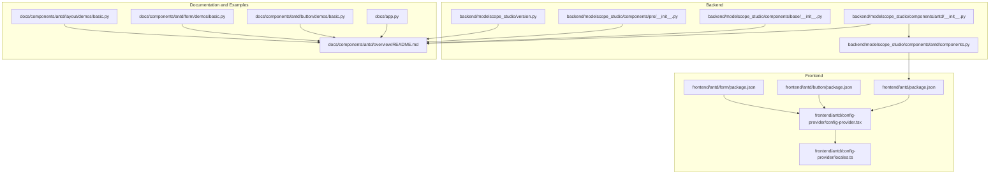
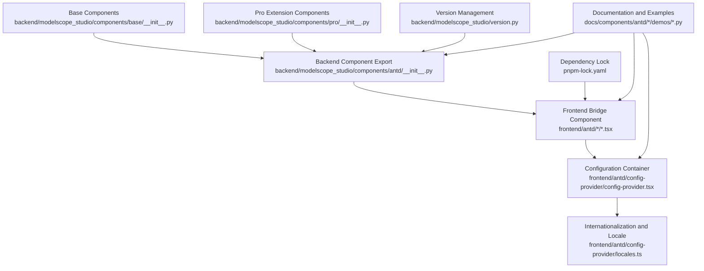
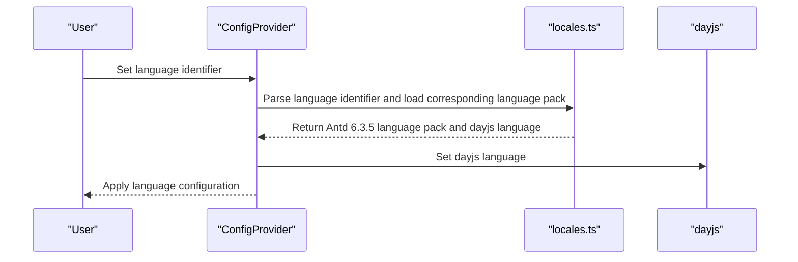
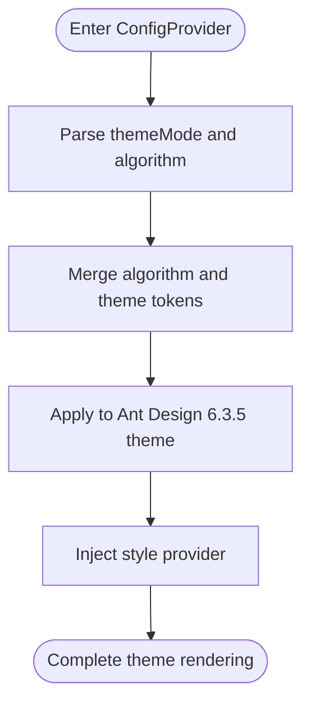
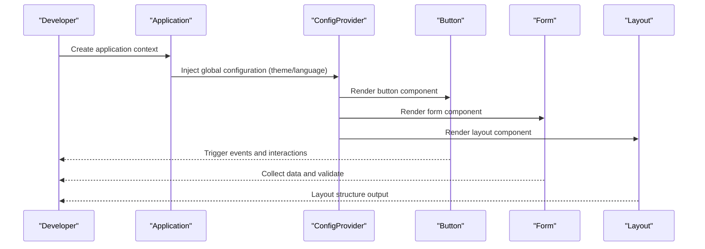
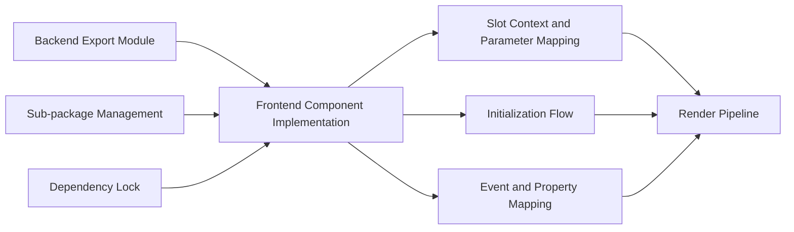

# Components Overview

<cite>
**Files referenced in this document**
- [backend/modelscope_studio/components/antd/__init__.py](file://backend/modelscope_studio/components/antd/__init__.py)
- [backend/modelscope_studio/components/antd/components.py](file://backend/modelscope_studio/components/antd/components.py)
- [frontend/antd/package.json](file://frontend/antd/package.json)
- [docs/components/antd/overview/README.md](file://docs/components/antd/overview/README.md)
- [docs/README.md](file://docs/README.md)
- [backend/modelscope_studio/components/base/__init__.py](file://backend/modelscope_studio/components/base/__init__.py)
- [backend/modelscope_studio/components/pro/__init__.py](file://backend/modelscope_studio/components/pro/__init__.py)
- [docs/app.py](file://docs/app.py)
- [frontend/antd/config-provider/config-provider.tsx](file://frontend/antd/config-provider/config-provider.tsx)
- [frontend/antd/config-provider/locales.ts](file://frontend/antd/config-provider/locales.ts)
- [docs/components/antd/button/demos/basic.py](file://docs/components/antd/button/demos/basic.py)
- [docs/components/antd/form/demos/basic.py](file://docs/components/antd/form/demos/basic.py)
- [docs/components/antd/layout/demos/basic.py](file://docs/components/antd/layout/demos/basic.py)
- [frontend/svelte-preprocess-react/svelte-contexts/slot.svelte.ts](file://frontend/svelte-preprocess-react/svelte-contexts/slot.svelte.ts)
- [frontend/svelte-preprocess-react/component/import.ts](file://frontend/svelte-preprocess-react/component/import.ts)
- [frontend/svelte-preprocess-react/component/props.svelte.ts](file://frontend/svelte-preprocess-react/component/props.svelte.ts)
- [docs/components/base/fragment/README-zh_CN.md](file://docs/components/base/fragment/README-zh_CN.md)
- [CHANGELOG.md](file://CHANGELOG.md)
- [pnpm-lock.yaml](file://pnpm-lock.yaml)
- [package.json](file://package.json)
- [backend/modelscope_studio/version.py](file://backend/modelscope_studio/version.py)
</cite>

## Update Summary

**Changes made**

- Updated version information to reflect the upgrade from Ant Design 5.x to 6.3.5
- Updated migration information from Gradio 5.x to 6.0
- Updated component version compatibility notes
- Updated version-related information for theme customization and internationalization mechanisms

## Table of Contents

1. [Introduction](#introduction)
2. [Project Structure](#project-structure)
3. [Core Components](#core-components)
4. [Architecture Overview](#architecture-overview)
5. [Component Classification and Organization](#component-classification-and-organization)
6. [Usage Principles and Best Practices](#usage-principles-and-best-practices)
7. [Responsive Design and Internationalization](#responsive-design-and-internationalization)
8. [Theme Customization and Style System](#theme-customization-and-style-system)
9. [Typical Scenarios and Combined Usage](#typical-scenarios-and-combined-usage)
10. [Component Dependencies and Integration Patterns](#component-dependencies-and-integration-patterns)
11. [Performance Considerations](#performance-considerations)
12. [Troubleshooting Guide](#troubleshooting-guide)
13. [Conclusion](#conclusion)

## Introduction

This overview covers the overall presentation of the Ant Design component library in modelscope_studio, including features, design philosophy, overall architecture, component classification system, usage principles, responsive design and internationalization, theme customization, typical scenarios and combination methods, and inter-component dependencies and integration patterns. The component library is built on Gradio 6.0, providing richer page layouts and interaction capabilities, and adapts to Ant Design 6.3.5 styles and behaviors through a unified configuration container.

**Update** The project has been upgraded from Gradio 5.x to 6.0, and Ant Design from 5.x to 6.3.5, bringing better performance and compatibility.

**Version**: This document applies to ModelScope Studio 2.0+, supporting Gradio 6.0, Ant Design 6.3.5, and Ant Design X 2.0

## Project Structure

- Backend Module Export: The Python layer exports all Ant Design components through module aggregation, facilitating direct on-demand import and usage.
- Frontend Implementation: Each Ant Design component is implemented in Svelte/React form, with typed properties and slot mechanism, achieving bridge with Gradio 6.0.
- Documentation and Examples: Accompanying documentation and demo scripts covering quick start, property constraints, event binding, slot rendering, function parameter passing, internationalization, and theme customization topics.

**Diagram Source**

- [backend/modelscope_studio/components/antd/**init**.py:1-150](file://backend/modelscope_studio/components/antd/__init__.py#L1-L150)
- [backend/modelscope_studio/components/antd/components.py:1-144](file://backend/modelscope_studio/components/antd/components.py#L1-L144)
- [frontend/antd/package.json:1-6](file://frontend/antd/package.json#L1-L6)
- [frontend/antd/config-provider/config-provider.tsx:1-154](file://frontend/antd/config-provider/config-provider.tsx#L1-L154)
- [frontend/antd/config-provider/locales.ts:313-465](file://frontend/antd/config-provider/locales.ts#L313-L465)
- [docs/components/antd/overview/README.md:1-75](file://docs/components/antd/overview/README.md#L1-L75)
- [docs/app.py:200-399](file://docs/app.py#L200-L399)
- [docs/components/antd/button/demos/basic.py:1-26](file://docs/components/antd/button/demos/basic.py#L1-L26)
- [docs/components/antd/form/demos/basic.py:1-94](file://docs/components/antd/form/demos/basic.py#L1-L94)
- [docs/components/antd/layout/demos/basic.py:1-88](file://docs/components/antd/layout/demos/basic.py#L1-L88)
- [backend/modelscope_studio/version.py:1-2](file://backend/modelscope_studio/version.py#L1-L2)
- [frontend/antd/button/package.json:1-15](file://frontend/antd/button/package.json#L1-L15)
- [frontend/antd/form/package.json:1-15](file://frontend/antd/form/package.json#L1-L15)

**Section Source**

- [docs/README.md:19-75](file://docs/README.md#L19-L75)
- [docs/components/antd/overview/README.md:1-75](file://docs/components/antd/overview/README.md#L1-L75)
- [docs/app.py:200-399](file://docs/app.py#L200-L399)
- [CHANGELOG.md:13](file://CHANGELOG.md#L13)

## Core Components

- Component Export: The backend exports all Ant Design components through module aggregation, forming a unified namespace for direct import and usage.
- Configuration Container: ConfigProvider provides global configuration for theme, language, popup container, etc., compatible with Ant Design 6.3.5 and injecting Gradio 6.0 style adaptation.
- Base Components: Application, AutoLoading, Fragment, and other base capabilities ensure correct component tree rendering and loading state feedback.
- Pro Components: Extended components for advanced scenarios (such as chatbot, editor, Web Sandbox, etc.).

**Update** All components are now compatible with Ant Design 6.3.5 and Gradio 6.0 new features.

**Section Source**

- [backend/modelscope_studio/components/antd/**init**.py:1-150](file://backend/modelscope_studio/components/antd/__init__.py#L1-L150)
- [backend/modelscope_studio/components/antd/components.py:1-144](file://backend/modelscope_studio/components/antd/components.py#L1-L144)
- [backend/modelscope_studio/components/base/**init**.py:1-11](file://backend/modelscope_studio/components/base/__init__.py#L1-L11)
- [backend/modelscope_studio/components/pro/**init**.py:1-7](file://backend/modelscope_studio/components/pro/__init__.py#L1-L7)
- [frontend/antd/config-provider/config-provider.tsx:1-154](file://frontend/antd/config-provider/config-provider.tsx#L1-L154)
- [pnpm-lock.yaml:2830](file://pnpm-lock.yaml#L2830-L2835)

## Architecture Overview

The overall architecture revolves around the closed loop of "backend component export + frontend bridge rendering + documentation and examples". The backend is responsible for component classes and property mapping, the frontend is responsible for converting properties and slots to React/JSX rendering, and injecting themes and internationalization through ConfigProvider; documentation and examples provide usage patterns and constraint explanations.

**Update** The architecture is now fully adapted to Gradio 6.0's new event system and component lifecycle.

**Diagram Source**

- [backend/modelscope_studio/components/antd/**init**.py:1-150](file://backend/modelscope_studio/components/antd/__init__.py#L1-L150)
- [frontend/antd/config-provider/config-provider.tsx:1-154](file://frontend/antd/config-provider/config-provider.tsx#L1-L154)
- [frontend/antd/config-provider/locales.ts:313-465](file://frontend/antd/config-provider/locales.ts#L313-L465)
- [backend/modelscope_studio/components/base/**init**.py:1-11](file://backend/modelscope_studio/components/base/__init__.py#L1-L11)
- [backend/modelscope_studio/components/pro/**init**.py:1-7](file://backend/modelscope_studio/components/pro/__init__.py#L1-L7)
- [docs/components/antd/button/demos/basic.py:1-26](file://docs/components/antd/button/demos/basic.py#L1-L26)
- [backend/modelscope_studio/version.py:1-2](file://backend/modelscope_studio/version.py#L1-L2)
- [pnpm-lock.yaml:2830](file://pnpm-lock.yaml#L2830-L2835)

## Component Classification and Organization

According to the navigation structure in the documentation, Ant Design components are divided into six major categories for easy retrieval and usage by functional domain:

- General Components
  - Includes: Button, Icon, Typography, etc.
  - Examples: Button, Icon, Typography
- Layout Components
  - Includes: Divider, Flex, Grid, Layout, Space, Splitter, etc.
  - Examples: Grid, Flex, Splitter, Page Layout
- Navigation Components
  - Includes: Anchor, Breadcrumb, Dropdown, Menu, Pagination, Steps, etc.
  - Examples: Anchor, Breadcrumb, Dropdown, Navigation Menu, Pagination, Steps
- Data Entry Components
  - Includes: AutoComplete, Cascader, Checkbox, ColorPicker, DatePicker, Form, Input, InputNumber, Mentions, Radio, Rate, Select, Slider, Switch, TimePicker, Transfer, TreeSelect, Upload, etc.
  - Examples: Form, Input, Select, Time/Date, Switch, Slider, Upload
- Data Display Components
  - Includes: Avatar, Badge, Calendar, Card, Carousel, Collapse, Descriptions, Empty, Image, List, Popover, QRCode, Segmented, Statistic, Table, Tabs, Tag, Timeline, Tooltip, Tour, Tree, etc.
  - Examples: Card, Table, Tag, Timeline, Tree, Statistic
- Feedback Components
  - Includes: Alert, Drawer, Message, Modal, Notification, etc.
  - Examples: Alert, Drawer, Message, Modal, Notification

**Update** All components have been adapted to Ant Design 6.3.5's new API and style specifications.

The above classification and examples are from the documentation's navigation and example scripts, making it easy for developers to quickly locate components and reference usage.

**Section Source**

- [docs/app.py:200-399](file://docs/app.py#L200-L399)
- [docs/components/antd/button/demos/basic.py:1-26](file://docs/components/antd/button/demos/basic.py#L1-L26)
- [docs/components/antd/form/demos/basic.py:1-94](file://docs/components/antd/form/demos/basic.py#L1-L94)
- [docs/components/antd/layout/demos/basic.py:1-88](file://docs/components/antd/layout/demos/basic.py#L1-L88)

## Usage Principles and Best Practices

- Unified Entry: Import all components through the antd module to avoid scattered imports.
- Wrapper Container: All antd components must be placed between Application and ConfigProvider to ensure dependencies and styles work properly.
- Loading State Feedback: It is recommended to use AutoLoading to automatically display loading animations during requests to improve user experience.
- Event Binding: Events use Gradio 6.0's event binding form, with parameters stored in specific fields as arrays, note the destructure and handling.
- Slot Mechanism: Python cannot directly pass components as parameters; use Slot to wrap modules; if only strings or numbers, they can be passed directly as properties.
- Function Parameter Passing: Pass JS functions as strings, the frontend will automatically compile them into functions; functions returning ReactNode can be handled in two ways: rendered as regular nodes or generated through the global React object.
- Slot Compatibility: Some component slots only support modelscope_studio components; if you need to insert other Gradio components, wrap them with Fragment.

**Update** The event system is fully adapted to Gradio 6.0's new event model, and the slot mechanism has been optimized accordingly.

**Section Source**

- [docs/components/antd/overview/README.md:13-75](file://docs/components/antd/overview/README.md#L13-L75)
- [docs/components/base/fragment/README-zh_CN.md:1-10](file://docs/components/base/fragment/README-zh_CN.md#L1-L10)

## Responsive Design and Internationalization

- Responsive Design: Components follow Ant Design 6.3.5's responsive specifications, combining Flex, Grid, and other layout components to achieve adaptive layouts.
- Internationalization: ConfigProvider supports multi-language switching, with built-in extensive language and region mapping, automatically loading corresponding language packs and date library languages to meet multi-language site requirements.

**Diagram Source**

- [frontend/antd/config-provider/config-provider.tsx:85-105](file://frontend/antd/config-provider/config-provider.tsx#L85-L105)
- [frontend/antd/config-provider/locales.ts:313-465](file://frontend/antd/config-provider/locales.ts#L313-L465)

**Section Source**

- [frontend/antd/config-provider/config-provider.tsx:15-27](file://frontend/antd/config-provider/config-provider.tsx#L15-L27)
- [frontend/antd/config-provider/locales.ts:313-465](file://frontend/antd/config-provider/locales.ts#L313-L465)

## Theme Customization and Style System

- Theme Mode: Control dark/compact algorithms through ConfigProvider's themeMode, supporting dynamic switching.
- Theme Tokens: Support setting primary color and other tokens, combining with algorithms to achieve unified theme style.
- Style Injection: Use style provider to ensure component prefix and style isolation, avoiding conflicts.

**Diagram Source**

- [frontend/antd/config-provider/config-provider.tsx:88-143](file://frontend/antd/config-provider/config-provider.tsx#L88-L143)

**Section Source**

- [frontend/antd/config-provider/config-provider.tsx:53-151](file://frontend/antd/config-provider/config-provider.tsx#L53-L151)

## Typical Scenarios and Combined Usage

- Quick Start: Under Application and ConfigProvider wrapper, use Button, Icon, Typography, and other general components to build basic interfaces.
- Form Scenarios: Use Form and Form.Item combined with Input, Select, DatePicker, Upload, and other data entry components, combined with validation rules and submit callbacks.
- Page Layout: Use Layout, Grid, Flex, Space, and other layout components to build page skeletons, combined with Sider, Header, Content, Footer to achieve complex page structures.

**Diagram Source**

- [docs/components/antd/button/demos/basic.py:5-26](file://docs/components/antd/button/demos/basic.py#L5-L26)
- [docs/components/antd/form/demos/basic.py:16-94](file://docs/components/antd/form/demos/basic.py#L16-L94)
- [docs/components/antd/layout/demos/basic.py:42-88](file://docs/components/antd/layout/demos/basic.py#L42-L88)

**Section Source**

- [docs/components/antd/button/demos/basic.py:1-26](file://docs/components/antd/button/demos/basic.py#L1-L26)
- [docs/components/antd/form/demos/basic.py:1-94](file://docs/components/antd/form/demos/basic.py#L1-L94)
- [docs/components/antd/layout/demos/basic.py:1-88](file://docs/components/antd/layout/demos/basic.py#L1-L88)

## Component Dependencies and Integration Patterns

- Component Dependencies: Each component is exposed through backend export modules, with frontend managing versions and types as independent packages.
- Slots and Context: The frontend supports complex nesting and dynamic rendering through slot context and parameter mapping mechanisms.
- Initialization Flow: Before component loading, wait for initialization to complete to ensure global objects are available.
- Event and Property Mapping: The frontend uniformly maps properties and events to ensure consistency with Gradio 6.0's event model.

**Update** Dependency relationships have been updated to reflect new version requirements for Gradio 6.0 and Ant Design 6.3.5.

**Diagram Source**

- [backend/modelscope_studio/components/antd/**init**.py:1-150](file://backend/modelscope_studio/components/antd/__init__.py#L1-L150)
- [frontend/svelte-preprocess-react/svelte-contexts/slot.svelte.ts:55-102](file://frontend/svelte-preprocess-react/svelte-contexts/slot.svelte.ts#L55-L102)
- [frontend/svelte-preprocess-react/component/import.ts:1-20](file://frontend/svelte-preprocess-react/component/import.ts#L1-L20)
- [frontend/svelte-preprocess-react/component/props.svelte.ts:258-312](file://frontend/svelte-preprocess-react/component/props.svelte.ts#L258-L312)
- [frontend/antd/button/package.json:1-15](file://frontend/antd/button/package.json#L1-L15)
- [pnpm-lock.yaml:2830](file://pnpm-lock.yaml#L2830-L2835)

**Section Source**

- [frontend/antd/package.json:1-6](file://frontend/antd/package.json#L1-L6)
- [frontend/svelte-preprocess-react/svelte-contexts/slot.svelte.ts:55-102](file://frontend/svelte-preprocess-react/svelte-contexts/slot.svelte.ts#L55-L102)
- [frontend/svelte-preprocess-react/component/import.ts:1-20](file://frontend/svelte-preprocess-react/component/import.ts#L1-L20)
- [frontend/svelte-preprocess-react/component/props.svelte.ts:258-312](file://frontend/svelte-preprocess-react/component/props.svelte.ts#L258-L312)

## Performance Considerations

- On-demand Rendering: Reduce unnecessary component instantiation through slots and conditional rendering.
- Theme and Internationalization Lazy Loading: Language packs and theme algorithms are loaded on-demand, reducing initial overhead.
- Event and Property Mapping: Unified mapping reduces repeated calculations and DOM operations.
- Layout Component Optimization: Prefer modern layouts like Flex and Grid to reduce reflow and repaint.

**Update** Performance optimization has been adjusted for Gradio 6.0's new architecture, providing better rendering performance.

[This section is general guidance, no specific file references needed]

## Troubleshooting Guide

- Page preview unsuccessful: Confirm all components are wrapped in Application.
- Abnormal styles: Confirm ConfigProvider is correctly wrapped, and themeMode, locale settings are as expected.
- Events not responding: Check whether event binding uses Gradio 6.0 form, and whether parameters are correctly destructured.
- Slots not working: Confirm using Slot to wrap modules, or directly passing strings/numbers; if you need to insert other Gradio components, wrap with Fragment.
- Function parameter issues: Pass functions as strings, the frontend will automatically compile; functions returning ReactNode can choose slots or generate through global React object.

**Update** Troubleshooting guide has been updated to reflect Gradio 6.0's new event system and component lifecycle changes.

**Section Source**

- [docs/components/antd/overview/README.md:13-75](file://docs/components/antd/overview/README.md#L13-L75)
- [docs/components/base/fragment/README-zh_CN.md:1-10](file://docs/components/base/fragment/README-zh_CN.md#L1-L10)

## Conclusion

modelscope_studio deeply integrates Ant Design 6.3.5 components with the Gradio 6.0 ecosystem, providing unified component export, configuration container, and documentation examples to help developers quickly build beautiful and maintainable interfaces. Through clear classification system, strict usage principles, and complete internationalization, theme, and slot mechanisms, the component library achieves a good balance between usability and extensibility. It is recommended to follow the "Application + ConfigProvider" wrapper principle in actual projects, make good use of slots and event mapping, and combine with layout components to achieve responsive and accessibility-friendly interfaces.

**Update** The version upgrade brings better performance, more stable event system, and more modern theme support, providing developers with a better development experience.
