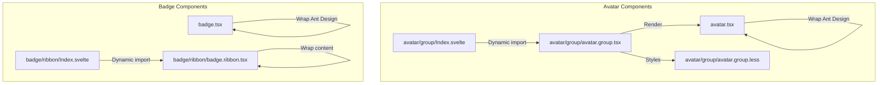
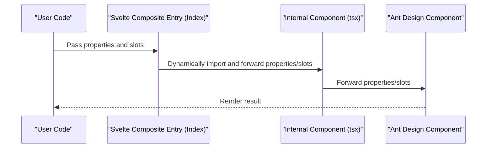
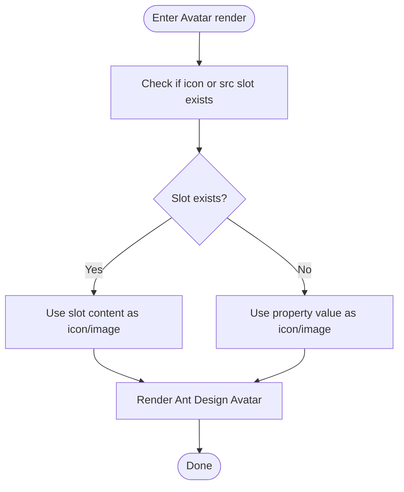
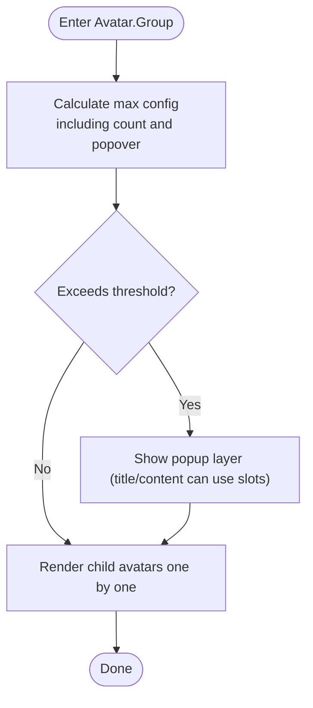
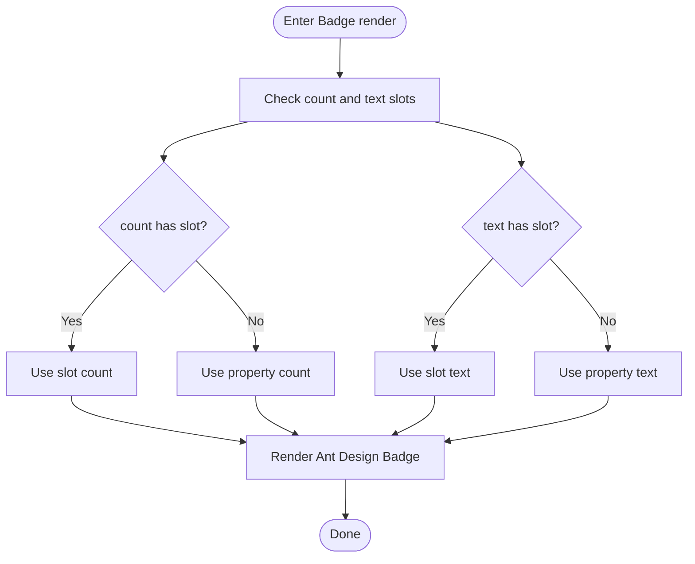
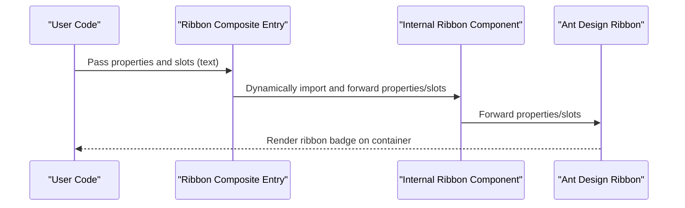
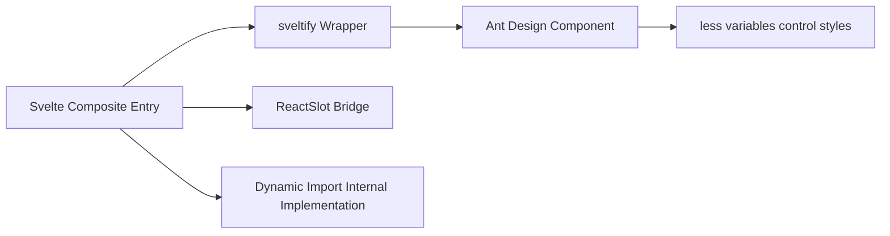

# Avatar and Badge

<cite>
**Files referenced in this document**
- [avatar.tsx](file://frontend/antd/avatar/avatar.tsx)
- [avatar group entry Index.svelte](file://frontend/antd/avatar/group/Index.svelte)
- [avatar.group.tsx](file://frontend/antd/avatar/group/avatar.group.tsx)
- [avatar.group.less](file://frontend/antd/avatar/group/avatar.group.less)
- [badge.tsx](file://frontend/antd/badge/badge.tsx)
- [badge ribbon entry Index.svelte](file://frontend/antd/badge/ribbon/Index.svelte)
- [ribbon.badge.tsx](file://frontend/antd/badge/ribbon/badge.ribbon.tsx)
- [avatar docs README.md](file://docs/components/antd/avatar/README.md)
- [badge docs README.md](file://docs/components/antd/badge/README.md)
</cite>

## Table of Contents

1. [Introduction](#introduction)
2. [Project Structure](#project-structure)
3. [Core Components](#core-components)
4. [Architecture Overview](#architecture-overview)
5. [Detailed Component Analysis](#detailed-component-analysis)
6. [Dependency Analysis](#dependency-analysis)
7. [Performance Considerations](#performance-considerations)
8. [Troubleshooting Guide](#troubleshooting-guide)
9. [Conclusion](#conclusion)
10. [Appendix](#appendix)

## Introduction

This document focuses on the Avatar and Badge component families, systematically covering size control, shape settings, Avatar.Group stacking and masking, Badge count display and dot marking, Badge.Ribbon ribbon effects, and other capabilities. It also provides placeholder handling, threshold settings, custom style solutions, as well as responsive and multi-layout adaptation recommendations. The document is based on actual implementations in the repository, with visual diagrams to help readers quickly understand and correctly use the components.

## Project Structure

- Avatar components are located in frontend/antd/avatar, containing two sub-modules: single avatar and avatar group. The avatar group dynamically imports its internal implementation via a composite Svelte entry file.
- Badge components are located in frontend/antd/badge, containing two sub-modules: basic badge and ribbon badge. The ribbon badge is also dynamically imported via a composite Svelte entry file.
- Documentation examples are in docs/components/antd/avatar and docs/components/antd/badge, providing demo entries for basic and combined usage.

**Diagram Source**

- [avatar.tsx:1-28](file://frontend/antd/avatar/avatar.tsx#L1-L28)
- [avatar group entry Index.svelte:1-62](file://frontend/antd/avatar/group/Index.svelte#L1-L62)
- [avatar.group.tsx:1-52](file://frontend/antd/avatar/group/avatar.group.tsx#L1-L52)
- [avatar.group.less:1-12](file://frontend/antd/avatar/group/avatar.group.less#L1-L12)
- [badge.tsx:1-21](file://frontend/antd/badge/badge.tsx#L1-L21)
- [badge ribbon entry Index.svelte:1-62](file://frontend/antd/badge/ribbon/Index.svelte#L1-L62)
- [ribbon.badge.tsx:1-22](file://frontend/antd/badge/ribbon/badge.ribbon.tsx#L1-L22)

**Section Source**

- [avatar docs README.md:1-9](file://docs/components/antd/avatar/README.md#L1-L9)
- [badge docs README.md:1-9](file://docs/components/antd/badge/README.md#L1-L9)

## Core Components

- Avatar
  - Supports icon, image and character display, with size and shape configuration; supports dynamic injection of icon and src via slot mechanism.
  - Provides placeholder handling: when no icon or image is provided, child nodes can serve as fallback content.
- Avatar.Group
  - Implements avatar stacking and masking effects; supports maximum count threshold and popup tooltip; controls overlap spacing via less variables.
  - Supports slot-based customization of the popup layer title and content for "overflowed count".
- Badge
  - Supports numeric count and text marking; both count and text can inject custom content via slots.
  - Supports dot marking and overflow threshold (shows n+ when exceeding the threshold).
- Badge.Ribbon
  - Overlays a "ribbon"-style badge on a target element, supporting text slots; typically used to emphasize status or identify features.

**Section Source**

- [avatar.tsx:1-28](file://frontend/antd/avatar/avatar.tsx#L1-L28)
- [avatar.group.tsx:1-52](file://frontend/antd/avatar/group/avatar.group.tsx#L1-L52)
- [avatar.group.less:1-12](file://frontend/antd/avatar/group/avatar.group.less#L1-L12)
- [badge.tsx:1-21](file://frontend/antd/badge/badge.tsx#L1-L21)
- [ribbon.badge.tsx:1-22](file://frontend/antd/badge/ribbon/badge.ribbon.tsx#L1-L22)

## Architecture Overview

The diagram below shows the call chain from the Svelte entry to specific Ant Design components, as well as key paths for slot and property forwarding.

**Diagram Source**

- [avatar group entry Index.svelte:48-61](file://frontend/antd/avatar/group/Index.svelte#L48-L61)
- [avatar.group.tsx:12-49](file://frontend/antd/avatar/group/avatar.group.tsx#L12-L49)
- [badge ribbon entry Index.svelte:48-61](file://frontend/antd/badge/ribbon/Index.svelte#L48-L61)
- [ribbon.badge.tsx:6-18](file://frontend/antd/badge/ribbon/badge.ribbon.tsx#L6-L18)

## Detailed Component Analysis

### Avatar

- Wrapping approach
  - Uses sveltify to wrap Ant Design's Avatar as a Svelte component, while preserving slot capabilities for icon and src.
  - When slots exist, slot content takes priority; otherwise falls back to property values; child nodes serve as default content when no slots are provided.
- Placeholder handling
  - Through hidden containers and conditional rendering, ensures child nodes can still be rendered as placeholder content when no icon or image is provided.
- Shape and size
  - Shape (e.g., circle/square) and size (e.g., small/medium/large) are controlled via Ant Design native properties, following Antd specifications.

**Diagram Source**

- [avatar.tsx:6-25](file://frontend/antd/avatar/avatar.tsx#L6-L25)

**Section Source**

- [avatar.tsx:1-28](file://frontend/antd/avatar/avatar.tsx#L1-L28)

### Avatar.Group

- Stacking and masking
  - Internally uses Ant Design's Group capability for avatar stacking; controls the starting margin of adjacent avatars via less variables to create visual overlap and layering.
- Threshold and popup layer
  - Supports setting max.count as the threshold; when exceeded, shows hints like "n more".
  - The popup layer title and content can be overridden via slots; if no slots are provided, falls back to property configuration.
- Sub-item rendering
  - Maps child items to ReactSlot via useTargets and ReactSlot, ensuring each child avatar renders in order.

**Diagram Source**

- [avatar.group.tsx:12-49](file://frontend/antd/avatar/group/avatar.group.tsx#L12-L49)
- [avatar.group.less:1-12](file://frontend/antd/avatar/group/avatar.group.less#L1-L12)

**Section Source**

- [avatar group entry Index.svelte:1-62](file://frontend/antd/avatar/group/Index.svelte#L1-L62)
- [avatar.group.tsx:1-52](file://frontend/antd/avatar/group/avatar.group.tsx#L1-L52)
- [avatar.group.less:1-12](file://frontend/antd/avatar/group/avatar.group.less#L1-L12)

### Badge

- Count and text
  - Both count and text support slot injection, enabling placement of complex content (such as icons, custom text) inside the badge.
- Dot marking
  - Implements dot marking via Ant Design native capability; displays a pure dot when count is 0 and numbers are not shown.
- Threshold setting
  - Supports setting a maximum value; displays n+ when exceeding the threshold. This capability is provided by the underlying Antd component and the component layer directly forwards the property.

**Diagram Source**

- [badge.tsx:6-17](file://frontend/antd/badge/badge.tsx#L6-L17)

**Section Source**

- [badge.tsx:1-21](file://frontend/antd/badge/badge.tsx#L1-L21)

### Badge.Ribbon

- Special effect
  - Ribbon draws a "ribbon"-style badge on the parent container, commonly used to highlight status or mark new features; text content can be customized via slots.
- Use cases
  - Suitable for adding prominent markings on cards, buttons, list items, and other containers; be careful to avoid conflicts with existing decorations.

**Diagram Source**

- [badge ribbon entry Index.svelte:48-61](file://frontend/antd/badge/ribbon/Index.svelte#L48-L61)
- [ribbon.badge.tsx:6-18](file://frontend/antd/badge/ribbon/badge.ribbon.tsx#L6-L18)

**Section Source**

- [badge ribbon entry Index.svelte:1-62](file://frontend/antd/badge/ribbon/Index.svelte#L1-L62)
- [ribbon.badge.tsx:1-22](file://frontend/antd/badge/ribbon/badge.ribbon.tsx#L1-L22)

## Dependency Analysis

- Component wrapping
  - All components bridge Ant Design counterparts as Svelte components via sveltify, maintaining consistent property and event forwarding.
- Slot mechanism
  - Converts Svelte slots to React Slot via ReactSlot, ensuring compatibility with Antd component slot conventions.
- Dynamic import
  - Composite entries use importComponent and import to dynamically import internal implementations, reducing initial bundle size and improving on-demand loading efficiency.
- Style coupling
  - Avatar group controls overlap spacing and other style details via less variables, avoiding hardcoding and facilitating unified theme management.

**Diagram Source**

- [avatar.tsx:1-28](file://frontend/antd/avatar/avatar.tsx#L1-L28)
- [avatar.group.tsx:1-52](file://frontend/antd/avatar/group/avatar.group.tsx#L1-L52)
- [badge.tsx:1-21](file://frontend/antd/badge/badge.tsx#L1-L21)
- [ribbon.badge.tsx:1-22](file://frontend/antd/badge/ribbon/badge.ribbon.tsx#L1-L22)

**Section Source**

- [avatar group entry Index.svelte:1-62](file://frontend/antd/avatar/group/Index.svelte#L1-L62)
- [avatar.group.tsx:1-52](file://frontend/antd/avatar/group/avatar.group.tsx#L1-L52)
- [badge ribbon entry Index.svelte:1-62](file://frontend/antd/badge/ribbon/Index.svelte#L1-L62)
- [ribbon.badge.tsx:1-22](file://frontend/antd/badge/ribbon/badge.ribbon.tsx#L1-L22)

## Performance Considerations

- On-demand loading
  - Composite entries use dynamic import strategy, loading internal implementations only when needed, reducing initial bundle size and first-screen rendering pressure.
- Slot rendering
  - Slot content is injected at the rendering stage, avoiding unnecessary pre-processing overhead.
- Style variables
  - Manage style details such as overlap spacing centrally via less variables, reducing repeated computation and style jitter.

[This section provides general performance recommendations and does not require specific file references]

## Troubleshooting Guide

- Avatar not showing icon or image
  - Check whether the icon or src property is correctly passed in; if using slots, confirm that the slot name and type match.
  - If no icon/image is provided, the component falls back to child nodes as placeholder content; confirm that the child nodes are visible.
- Avatar group threshold invalid or popup layer not showing
  - Confirm that max.count is a numeric type; when count is a number, the internal code automatically adds one to compensate for its own occupation.
  - The popup layer title and content can be overridden via slots; if no slots are provided, falls back to property configuration.
- Badge threshold not working
  - Confirm whether the threshold property is correctly forwarded to the underlying component; Antd natively supports n+ display logic.
- Ribbon badge position incorrect
  - Confirm that Ribbon's parent container has a positioning context; if necessary, manually set relative positioning on the container to ensure stable overlay effect.

**Section Source**

- [avatar.tsx:6-25](file://frontend/antd/avatar/avatar.tsx#L6-L25)
- [avatar.group.tsx:18-40](file://frontend/antd/avatar/group/avatar.group.tsx#L18-L40)
- [badge.tsx:6-17](file://frontend/antd/badge/badge.tsx#L6-L17)
- [ribbon.badge.tsx:6-18](file://frontend/antd/badge/ribbon/badge.ribbon.tsx#L6-L18)

## Conclusion

This component system is built on Ant Design, with Svelte wrapping and slot bridging providing flexible avatar and badge capabilities. Avatar group stacking/masking, badge count and threshold, and ribbon badge highlighting effects can all be highly customized without breaking semantics. It is recommended to manage sizes, spacing, and colors uniformly via theme variables and layout specifications in actual projects to achieve a consistent user experience.

[This section is a summary and does not require specific file references]

## Appendix

- Example entries
  - Avatar component examples can be found under the demo tab in the docs directory.
  - Badge component examples can be found under the demo tab in the docs directory.
- Related documentation
  - Avatar component documentation overview: [avatar docs README.md:1-9](file://docs/components/antd/avatar/README.md#L1-L9)
  - Badge component documentation overview: [badge docs README.md:1-9](file://docs/components/antd/badge/README.md#L1-L9)

**Section Source**

- [avatar docs README.md:1-9](file://docs/components/antd/avatar/README.md#L1-L9)
- [badge docs README.md:1-9](file://docs/components/antd/badge/README.md#L1-L9)
