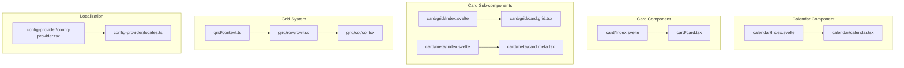
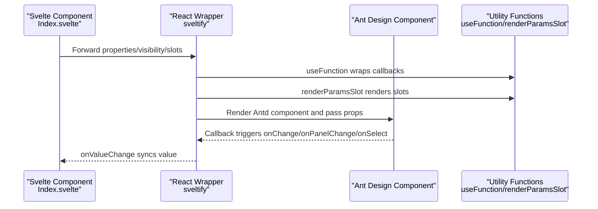
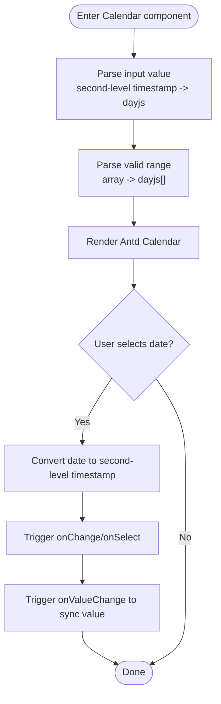
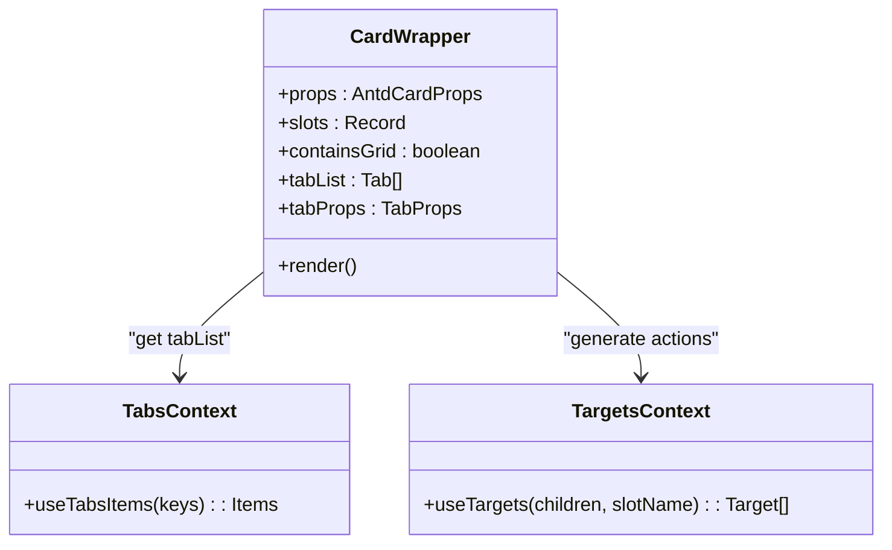
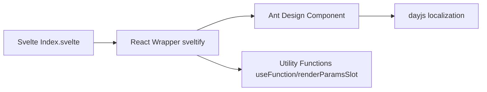

# Calendar and Card

<cite>
**Files referenced in this document**
- [frontend/antd/calendar/Index.svelte](file://frontend/antd/calendar/Index.svelte)
- [frontend/antd/calendar/calendar.tsx](file://frontend/antd/calendar/calendar.tsx)
- [frontend/antd/card/Index.svelte](file://frontend/antd/card/Index.svelte)
- [frontend/antd/card/card.tsx](file://frontend/antd/card/card.tsx)
- [frontend/antd/card/grid/Index.svelte](file://frontend/antd/card/grid/Index.svelte)
- [frontend/antd/card/grid/card.grid.tsx](file://frontend/antd/card/grid/card.grid.tsx)
- [frontend/antd/card/meta/Index.svelte](file://frontend/antd/card/meta/Index.svelte)
- [frontend/antd/card/meta/card.meta.tsx](file://frontend/antd/card/meta/card.meta.tsx)
- [frontend/antd/grid/col/col.tsx](file://frontend/antd/grid/col/col.tsx)
- [frontend/antd/grid/row/row.tsx](file://frontend/antd/grid/row/row.tsx)
- [frontend/antd/grid/context.ts](file://frontend/antd/grid/context.ts)
- [frontend/antd/config-provider/config-provider.tsx](file://frontend/antd/config-provider/config-provider.tsx)
- [frontend/antd/config-provider/locales.ts](file://frontend/antd/config-provider/locales.ts)
</cite>

## Table of Contents

1. [Introduction](#introduction)
2. [Project Structure](#project-structure)
3. [Core Components](#core-components)
4. [Architecture Overview](#architecture-overview)
5. [Detailed Component Analysis](#detailed-component-analysis)
6. [Dependency Analysis](#dependency-analysis)
7. [Performance Considerations](#performance-considerations)
8. [Troubleshooting Guide](#troubleshooting-guide)
9. [Conclusion](#conclusion)

## Introduction

This document covers Calendar and Card components, providing complete instructions from architecture to implementation details. Key topics include:

- Calendar component: scheduling, event marking, date selection, panel switching, special features of notification calendars (extended via slots and callbacks)
- Card component: basic structure, responsive layout with Card.Grid, content organization with Card.Meta, implementation methods for custom card content
- Localization: multilingual support and date localization based on ConfigProvider
- Interactions and callbacks: event callback handling, value change propagation
- Adaptability: adaptation strategies for different screen sizes and dynamic update mechanisms

## Project Structure

Calendar and Card components are located in the frontend Ant Design ecosystem, using Svelte + React wrappers (sveltify) to bridge Svelte components with Ant Design's React implementation. Each component provides:

- Svelte entry file (Index.svelte): responsible for property forwarding, visibility control, slot collection, and async loading of React implementation
- React wrapper (\*.tsx): uses sveltify to wrap Ant Design components for Svelte use, handling function-type callbacks, slot rendering, and value formatting

**Diagram Source**

- [frontend/antd/calendar/Index.svelte:1-85](file://frontend/antd/calendar/Index.svelte#L1-L85)
- [frontend/antd/calendar/calendar.tsx:1-102](file://frontend/antd/calendar/calendar.tsx#L1-L102)
- [frontend/antd/card/Index.svelte:1-68](file://frontend/antd/card/Index.svelte#L1-L68)
- [frontend/antd/card/card.tsx:1-150](file://frontend/antd/card/card.tsx#L1-L150)
- [frontend/antd/card/grid/Index.svelte:1-63](file://frontend/antd/card/grid/Index.svelte#L1-L63)
- [frontend/antd/card/grid/card.grid.tsx:1-7](file://frontend/antd/card/grid/card.grid.tsx#L1-L7)
- [frontend/antd/card/meta/Index.svelte:1-60](file://frontend/antd/card/meta/Index.svelte#L1-L60)
- [frontend/antd/card/meta/card.meta.tsx:1-32](file://frontend/antd/card/meta/card.meta.tsx#L1-L32)
- [frontend/antd/grid/row/row.tsx:1-34](file://frontend/antd/grid/row/row.tsx#L1-L34)
- [frontend/antd/grid/col/col.tsx:1-14](file://frontend/antd/grid/col/col.tsx#L1-L14)
- [frontend/antd/grid/context.ts:1-7](file://frontend/antd/grid/context.ts#L1-L7)
- [frontend/antd/config-provider/config-provider.tsx](file://frontend/antd/config-provider/config-provider.tsx)
- [frontend/antd/config-provider/locales.ts:1-800](file://frontend/antd/config-provider/locales.ts#L1-L800)

**Section Source**

- [frontend/antd/calendar/Index.svelte:1-85](file://frontend/antd/calendar/Index.svelte#L1-L85)
- [frontend/antd/calendar/calendar.tsx:1-102](file://frontend/antd/calendar/calendar.tsx#L1-L102)
- [frontend/antd/card/Index.svelte:1-68](file://frontend/antd/card/Index.svelte#L1-L68)
- [frontend/antd/card/card.tsx:1-150](file://frontend/antd/card/card.tsx#L1-L150)
- [frontend/antd/card/grid/Index.svelte:1-63](file://frontend/antd/card/grid/Index.svelte#L1-L63)
- [frontend/antd/card/grid/card.grid.tsx:1-7](file://frontend/antd/card/grid/card.grid.tsx#L1-L7)
- [frontend/antd/card/meta/Index.svelte:1-60](file://frontend/antd/card/meta/Index.svelte#L1-L60)
- [frontend/antd/card/meta/card.meta.tsx:1-32](file://frontend/antd/card/meta/card.meta.tsx#L1-L32)
- [frontend/antd/grid/row/row.tsx:1-34](file://frontend/antd/grid/row/row.tsx#L1-L34)
- [frontend/antd/grid/col/col.tsx:1-14](file://frontend/antd/grid/col/col.tsx#L1-L14)
- [frontend/antd/grid/context.ts:1-7](file://frontend/antd/grid/context.ts#L1-L7)
- [frontend/antd/config-provider/config-provider.tsx](file://frontend/antd/config-provider/config-provider.tsx)
- [frontend/antd/config-provider/locales.ts:1-800](file://frontend/antd/config-provider/locales.ts#L1-L800)

## Core Components

- Calendar
  - Supports date value formatting (second-level timestamp and dayjs conversion), disabled date filtering, cell render slots (cellRender/fullCellRender/headerRender), panel switching and selection event callbacks
  - Value changes are synced upward via onValueChange for easy integration with Gradio and similar frameworks
- Card
  - Provides slot-based rendering for title, extra content, cover image, action area and other regions; supports tab list and tab bar extension (tabProps.\* slots)
  - Internally collects child items via context and dynamically composes them into Ant Design's Card component
- Card.Grid
  - Serves as a grid container inside the card for holding child content and participating in responsive layout
- Card.Meta
  - Provides slot-based rendering for title, description, and avatar, enabling flexible customization of card metadata
- Grid System (Row/Col)
  - Row collects column items via context and maps children to Ant Design's Row/Col structure for responsive layout

**Section Source**

- [frontend/antd/calendar/calendar.tsx:10-15](file://frontend/antd/calendar/calendar.tsx#L10-L15)
- [frontend/antd/calendar/calendar.tsx:58-98](file://frontend/antd/calendar/calendar.tsx#L58-L98)
- [frontend/antd/card/card.tsx:36-146](file://frontend/antd/card/card.tsx#L36-L146)
- [frontend/antd/card/grid/card.grid.tsx:1-7](file://frontend/antd/card/grid/card.grid.tsx#L1-L7)
- [frontend/antd/card/meta/card.meta.tsx:5-29](file://frontend/antd/card/meta/card.meta.tsx#L5-L29)
- [frontend/antd/grid/row/row.tsx:7-31](file://frontend/antd/grid/row/row.tsx#L7-L31)
- [frontend/antd/grid/col/col.tsx:7-11](file://frontend/antd/grid/col/col.tsx#L7-L11)

## Architecture Overview

The diagram below shows the bridging relationship between Calendar and Card components in Svelte and Ant Design, as well as key flows for slots and callbacks.

**Diagram Source**

- [frontend/antd/calendar/Index.svelte:65-84](file://frontend/antd/calendar/Index.svelte#L65-L84)
- [frontend/antd/calendar/calendar.tsx:43-98](file://frontend/antd/calendar/calendar.tsx#L43-L98)
- [frontend/antd/card/Index.svelte:53-67](file://frontend/antd/card/Index.svelte#L53-L67)
- [frontend/antd/card/card.tsx:39-146](file://frontend/antd/card/card.tsx#L39-L146)

## Detailed Component Analysis

### Calendar

- Properties and callbacks
  - Input value and default value: supports second-level timestamps and dayjs objects, internally unified to dayjs
  - Valid range: validRange is also formatted
  - Callbacks: onChange/onPanelChange/onSelect convert dates to second-level timestamps before returning
  - Slots: cellRender/fullCellRender/headerRender can inject custom rendering via slots
- Event marking and notification calendar
  - Inject custom marks or badges via cellRender/fullCellRender slots
  - onPanelChange can monitor month/year switching, combined with business logic to implement "notification calendar" scenarios (e.g., highlighting specific dates)
- Date selection and value sync
  - onValueChange returns the currently selected date as a second-level timestamp to the parent for state management and persistence

**Diagram Source**

- [frontend/antd/calendar/calendar.tsx:47-98](file://frontend/antd/calendar/calendar.tsx#L47-L98)

**Section Source**

- [frontend/antd/calendar/Index.svelte:13-84](file://frontend/antd/calendar/Index.svelte#L13-L84)
- [frontend/antd/calendar/calendar.tsx:10-15](file://frontend/antd/calendar/calendar.tsx#L10-L15)
- [frontend/antd/calendar/calendar.tsx:47-98](file://frontend/antd/calendar/calendar.tsx#L47-L98)

### Card

- Basic structure
  - Title, extra content, cover image, and action area can all be injected via slots
  - Supports tab list tabList and tab bar extension (tabProps.\* slots), including indicator size, more menu, and left/right extra content
- Dynamic content and context
  - Collects child items via useTabsItems and useTargets, dynamically injecting tabList and actions
  - When Grid child items exist, controls placeholder grid visibility via containsGrid to ensure correct layout
- Custom content implementation
  - Uses ReactSlot to render slot content, supporting complex nesting and conditional rendering
  - The actions area preferentially uses collected targets, falling back to native props.actions

**Diagram Source**

- [frontend/antd/card/card.tsx:36-146](file://frontend/antd/card/card.tsx#L36-L146)

**Section Source**

- [frontend/antd/card/Index.svelte:12-67](file://frontend/antd/card/Index.svelte#L12-L67)
- [frontend/antd/card/card.tsx:36-146](file://frontend/antd/card/card.tsx#L36-L146)

### Card.Grid

- Role
  - Acts as a grid container inside the card, holding child content and participating in responsive layout
- Implementation
  - Directly wraps Ant Design's Card.Grid, maintaining consistent behavior with Antd

**Section Source**

- [frontend/antd/card/grid/Index.svelte:19-59](file://frontend/antd/card/grid/Index.svelte#L19-L59)
- [frontend/antd/card/grid/card.grid.tsx:1-7](file://frontend/antd/card/grid/card.grid.tsx#L1-L7)

### Card.Meta

- Content organization
  - Title, description, and avatar can all be injected via slots for flexible content organization
- Rendering mechanism
  - Renders slots via ReactSlot; falls back to native props if not provided

**Section Source**

- [frontend/antd/card/meta/Index.svelte:19-59](file://frontend/antd/card/meta/Index.svelte#L19-L59)
- [frontend/antd/card/meta/card.meta.tsx:5-29](file://frontend/antd/card/meta/card.meta.tsx#L5-L29)

### Grid System (Row/Col)

- Responsive layout
  - Row collects Col column items via context and maps children to Ant Design's Row/Col structure
  - Col acts as ItemHandler, receiving properties from context and rendering
- Context mechanism
  - Uses createItemsContext to create items context; Row/Col cooperate via useItems and withItemsContextProvider

**Section Source**

- [frontend/antd/grid/row/row.tsx:7-31](file://frontend/antd/grid/row/row.tsx#L7-L31)
- [frontend/antd/grid/col/col.tsx:7-11](file://frontend/antd/grid/col/col.tsx#L7-L11)
- [frontend/antd/grid/context.ts:1-7](file://frontend/antd/grid/context.ts#L1-L7)

## Dependency Analysis

- Component coupling
  - Both Calendar and Card bridge Ant Design components to Svelte via sveltify, reducing direct coupling
  - Slots and callbacks are decoupled via useFunction and renderParamsSlot for easy extension
- External dependencies
  - dayjs for date formatting and localization
  - Ant Design provides UI capabilities and theme/localization resources
- Circular dependencies
  - No obvious circular dependencies between components; context is passed in one direction only

**Diagram Source**

- [frontend/antd/calendar/Index.svelte:65-84](file://frontend/antd/calendar/Index.svelte#L65-L84)
- [frontend/antd/calendar/calendar.tsx:3-6](file://frontend/antd/calendar/calendar.tsx#L3-L6)
- [frontend/antd/card/Index.svelte:53-67](file://frontend/antd/card/Index.svelte#L53-L67)
- [frontend/antd/card/card.tsx:2-8](file://frontend/antd/card/card.tsx#L2-L8)

**Section Source**

- [frontend/antd/calendar/calendar.tsx:1-102](file://frontend/antd/calendar/calendar.tsx#L1-L102)
- [frontend/antd/card/card.tsx:1-150](file://frontend/antd/card/card.tsx#L1-L150)

## Performance Considerations

- Async loading and lazy rendering
  - Svelte Index.svelte asynchronously imports the React implementation to reduce initial bundle size and first-screen blocking
- Callback function optimization
  - Use useFunction to wrap callbacks to avoid unnecessary re-renders
- Value computation caching
  - Use useMemo to cache dayjs values and valid ranges, reducing repeated computation costs
- Slot rendering
  - renderParamsSlot only renders slot content when needed, avoiding unnecessary DOM updates

**Section Source**

- [frontend/antd/calendar/Index.svelte:65-84](file://frontend/antd/calendar/Index.svelte#L65-L84)
- [frontend/antd/calendar/calendar.tsx:43-57](file://frontend/antd/calendar/calendar.tsx#L43-L57)
- [frontend/antd/card/card.tsx:105-112](file://frontend/antd/card/card.tsx#L105-L112)

## Troubleshooting Guide

- Date not displayed or displayed incorrectly
  - Check whether the input value is a second-level timestamp or an object parseable by dayjs
  - Confirm whether validRange is a valid dayjs array
- Event callback not triggered
  - Confirm whether onChange/onPanelChange/onSelect are correctly bound
  - If using slot rendering, ensure slots do not override default behavior
- Slot content not working
  - Confirm that slot key names are consistent with the slots supported by the component (e.g., cellRender/fullCellRender/headerRender/title/extra/cover, etc.)
- Localization not working
  - Check ConfigProvider's locale settings and browser language environment
  - Confirm whether the corresponding language pack exists in locales.ts

**Section Source**

- [frontend/antd/calendar/calendar.tsx:47-98](file://frontend/antd/calendar/calendar.tsx#L47-L98)
- [frontend/antd/card/card.tsx:113-132](file://frontend/antd/card/card.tsx#L113-L132)
- [frontend/antd/config-provider/config-provider.tsx](file://frontend/antd/config-provider/config-provider.tsx)
- [frontend/antd/config-provider/locales.ts:1-800](file://frontend/antd/config-provider/locales.ts#L1-L800)

## Conclusion

Calendar and Card components achieve highly extensible UI capabilities through a unified bridging pattern and slot system:

- Calendar supports date formatting, event callbacks, and slot extension for scheduling and notification calendar scenarios
- Card provides flexible content organization and dynamic layout capabilities, combined with the grid system for responsive design
- Localization and utility functions further improve internationalization and performance

It is recommended to make full use of slot and callback mechanisms in actual projects, combined with context and utility functions, to build stable and maintainable interfaces.
