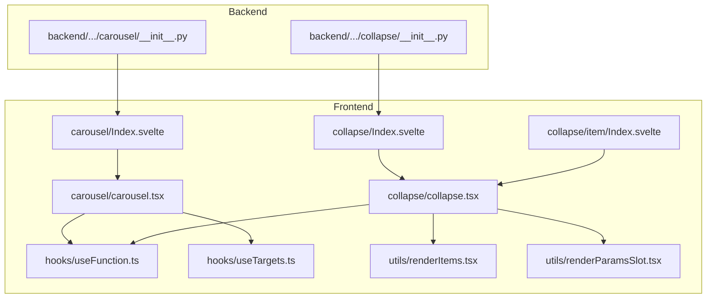
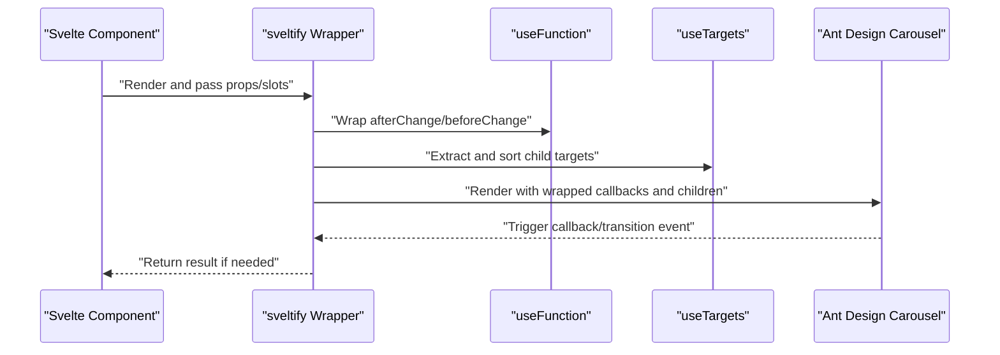
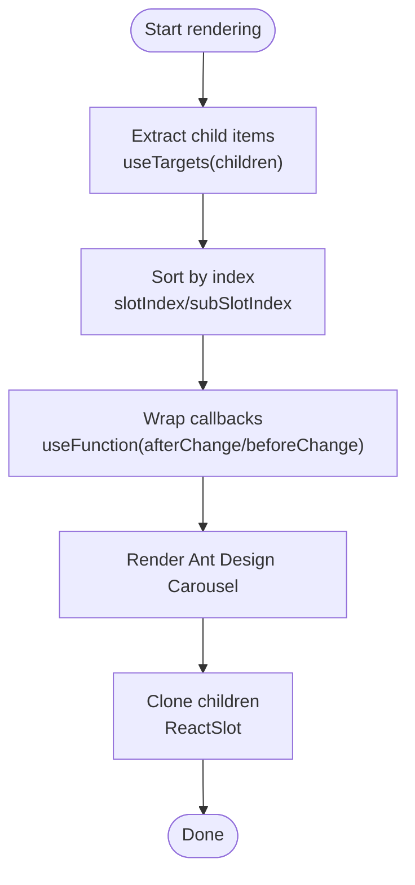
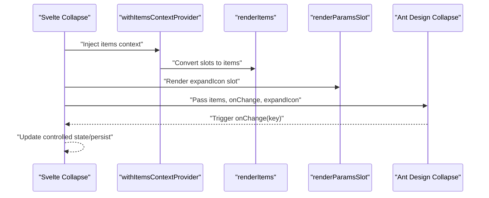
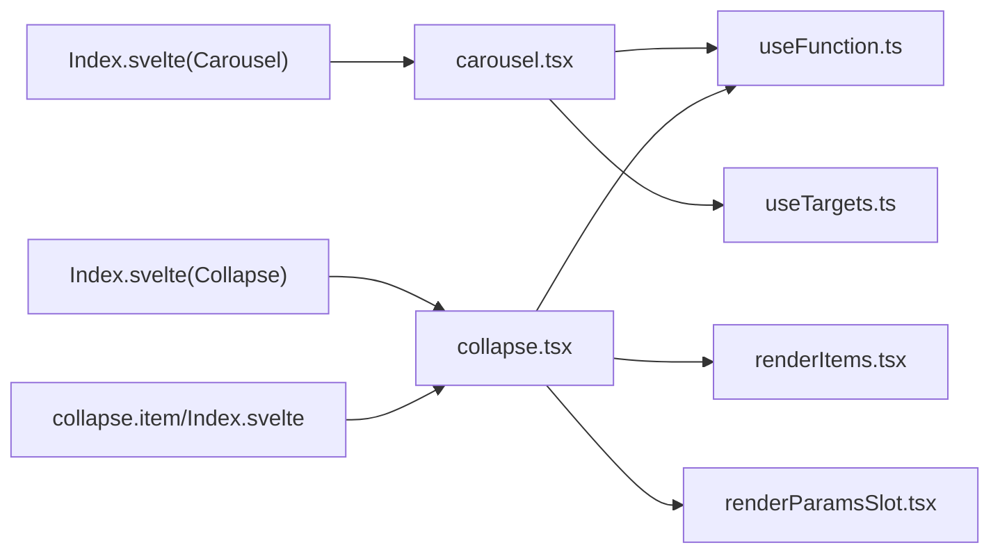

# Carousel and Collapse

<cite>
**Files Referenced in This Document**
- [carousel.tsx](file://frontend/antd/carousel/carousel.tsx)
- [Index.svelte](file://frontend/antd/carousel/Index.svelte)
- [useFunction.ts](file://frontend/utils/hooks/useFunction.ts)
- [useTargets.ts](file://frontend/utils/hooks/useTargets.ts)
- [renderItems.tsx](file://frontend/utils/renderItems.tsx)
- [renderParamsSlot.tsx](file://frontend/utils/renderParamsSlot.tsx)
- [collapse.tsx](file://frontend/antd/collapse/collapse.tsx)
- [Index.svelte](file://frontend/antd/collapse/Index.svelte)
- [context.ts](file://frontend/antd/collapse/context.ts)
- [collapse.item/Index.svelte](file://frontend/antd/collapse/item/Index.svelte)
- [__init__.py (carousel backend)](file://backend/modelscope_studio/components/antd/carousel/__init__.py)
- [__init__.py (collapse backend)](file://backend/modelscope_studio/components/antd/collapse/__init__.py)
- [basic.py (carousel demo)](file://docs/components/antd/carousel/demos/basic.py)
</cite>

## Table of Contents

1. [Introduction](#introduction)
2. [Project Structure](#project-structure)
3. [Core Components](#core-components)
4. [Architecture Overview](#architecture-overview)
5. [Detailed Component Analysis](#detailed-component-analysis)
6. [Dependency Analysis](#dependency-analysis)
7. [Performance Considerations](#performance-considerations)
8. [Troubleshooting Guide](#troubleshooting-guide)
9. [Conclusion](#conclusion)
10. [Appendix](#appendix)

## Introduction

This document provides a systematic explanation of the Ant Design **Carousel** and **Collapse** components, covering architecture and implementation details. Key topics include:

- Carousel: autoplay, transition animations, indicator controls, vertical carousel configuration; recommended approaches for touch swipe, keyboard navigation, and accessibility; and backend parameter mapping.
- Collapse: expand/collapse for individual panels, accordion effect, dynamic loading of panel content, and state persistence; controlled vs. uncontrolled modes, custom panel headers, and animation configuration.

## Project Structure

- The frontend Svelte wrapper handles prop processing, slot rendering, and conditional display.
- The React layer bridges Ant Design components to Svelte via sveltify.
- The utility layer provides general capabilities such as function wrapping, target node extraction, and slot rendering.
- The backend Python component handles parameter forwarding and frontend directory resolution.

**Diagram Source**

- [Index.svelte:1-66](file://frontend/antd/carousel/Index.svelte#L1-L66)
- [carousel.tsx:1-32](file://frontend/antd/carousel/carousel.tsx#L1-L32)
- [Index.svelte:1-66](file://frontend/antd/collapse/Index.svelte#L1-L66)
- [collapse.tsx:1-53](file://frontend/antd/collapse/collapse.tsx#L1-L53)
- [collapse.item/Index.svelte:1-95](file://frontend/antd/collapse/item/Index.svelte#L1-L95)
- [useFunction.ts:1-13](file://frontend/utils/hooks/useFunction.ts#L1-L13)
- [useTargets.ts:1-52](file://frontend/utils/hooks/useTargets.ts#L1-L52)
- [renderItems.tsx:1-114](file://frontend/utils/renderItems.tsx#L1-L114)
- [renderParamsSlot.tsx:1-51](file://frontend/utils/renderParamsSlot.tsx#L1-L51)
- [**init**.py (carousel backend):45-94](file://backend/modelscope_studio/components/antd/carousel/__init__.py#L45-L94)
- [**init**.py (collapse backend):54-98](file://backend/modelscope_studio/components/antd/collapse/__init__.py#L54-L98)

**Section Source**

- [Index.svelte:1-66](file://frontend/antd/carousel/Index.svelte#L1-L66)
- [carousel.tsx:1-32](file://frontend/antd/carousel/carousel.tsx#L1-L32)
- [Index.svelte:1-66](file://frontend/antd/collapse/Index.svelte#L1-L66)
- [collapse.tsx:1-53](file://frontend/antd/collapse/collapse.tsx#L1-L53)
- [collapse.item/Index.svelte:1-95](file://frontend/antd/collapse/item/Index.svelte#L1-L95)
- [useFunction.ts:1-13](file://frontend/utils/hooks/useFunction.ts#L1-L13)
- [useTargets.ts:1-52](file://frontend/utils/hooks/useTargets.ts#L1-L52)
- [renderItems.tsx:1-114](file://frontend/utils/renderItems.tsx#L1-L114)
- [renderParamsSlot.tsx:1-51](file://frontend/utils/renderParamsSlot.tsx#L1-L51)
- [**init**.py (carousel backend):45-94](file://backend/modelscope_studio/components/antd/carousel/__init__.py#L45-L94)
- [**init**.py (collapse backend):54-98](file://backend/modelscope_studio/components/antd/collapse/__init__.py#L54-L98)

## Core Components

- Carousel
  - Frontend wrapper: receives props and slots, invokes Ant Design's Carousel, and renders child items via ReactSlot.
  - Key points: afterChange/beforeChange are wrapped with useFunction; child item order is extracted and sorted by useTargets.
- Collapse
  - Frontend wrapper: injects the items context via withItemsContextProvider, uses renderItems to convert slots into Ant Design's items structure; supports expandIcon as a slot or function.
  - Collapse.Item: responsible for cloning and forwarding label/extra/children slots to the underlying component.

**Section Source**

- [carousel.tsx:8-29](file://frontend/antd/carousel/carousel.tsx#L8-L29)
- [Index.svelte:48-61](file://frontend/antd/carousel/Index.svelte#L48-L61)
- [collapse.tsx:10-50](file://frontend/antd/collapse/collapse.tsx#L10-L50)
- [collapse.item/Index.svelte:60-88](file://frontend/antd/collapse/item/Index.svelte#L60-L88)

## Architecture Overview

The following diagram shows the call chain from the frontend Svelte layer to the React Ant Design component, and the role of key utility functions.

**Diagram Source**

- [carousel.tsx:9-25](file://frontend/antd/carousel/carousel.tsx#L9-L25)
- [useFunction.ts:5-12](file://frontend/utils/hooks/useFunction.ts#L5-L12)
- [useTargets.ts:5-51](file://frontend/utils/hooks/useTargets.ts#L5-L51)

## Detailed Component Analysis

### Carousel Component

- Autoplay and Transition Animation
  - Supports autoplay, autoplaySpeed, speed, easing, effect (e.g., fade), wait_for_animate, and other parameters; see backend initialization parameters for the corresponding backend mappings.
  - The afterChange and beforeChange callbacks are wrapped with useFunction to ensure stable execution in the React environment.
- Indicator Controls
  - Supports dots, dotPosition, dotPlacement, and other configurations; indicator styles can be controlled via root_class_name or additional class names.
- Vertical Carousel
  - Vertical scrolling can be achieved via effect or related layout configurations (depending on Ant Design support and styles).
- Touch Swipe, Keyboard Navigation, and Accessibility
  - It is recommended to enable draggable for touch swipe support; keyboard navigation and accessibility labels can be implemented using Ant Design's default behavior combined with custom aria-\* attributes.
- Child Item Rendering
  - Child items are extracted by useTargets and sorted by slotIndex/subSlotIndex, then cloned and rendered as ReactSlot, ensuring correct order and visibility.

**Diagram Source**

- [carousel.tsx:9-25](file://frontend/antd/carousel/carousel.tsx#L9-L25)
- [useTargets.ts:5-51](file://frontend/utils/hooks/useTargets.ts#L5-L51)

**Section Source**

- [carousel.tsx:8-29](file://frontend/antd/carousel/carousel.tsx#L8-L29)
- [Index.svelte:48-61](file://frontend/antd/carousel/Index.svelte#L48-L61)
- [**init**.py (carousel backend):45-94](file://backend/modelscope_studio/components/antd/carousel/__init__.py#L45-L94)
- [basic.py (carousel demo):40-73](file://docs/components/antd/carousel/demos/basic.py#L40-L73)

### Collapse Component

- Single Panel and Accordion
  - Use accordion to enable/disable accordion mode; activeKey/defaultActiveKey controls currently expanded panels (supports multiple or single selection).
- Dynamic Panel Content Loading
  - Use the items context and renderItems to convert slots into items; destroy_on_hidden/destroy_inactive_panel can control panel destruction when hidden to save resources.
- Collapse State Persistence
  - State persistence is implemented via the controlled prop activeKey; the onChange callback can be used to record state changes.
- Controlled and Uncontrolled Modes
  - Uncontrolled: use defaultActiveKey; controlled: use activeKey and listen to onChange for updates.
- Custom Panel Header
  - The label slot is used for custom headers; the extra slot is used for additional actions on the right; the expandIcon slot or function can customize the expand icon.
- Animation Configuration
  - Appearance props such as size, bordered, and ghost can be combined with animation and transition effects; specific animation behavior follows Ant Design's default implementation.

**Diagram Source**

- [collapse.tsx:11-49](file://frontend/antd/collapse/collapse.tsx#L11-L49)
- [context.ts:1-7](file://frontend/antd/collapse/context.ts#L1-L7)
- [renderItems.tsx:8-113](file://frontend/utils/renderItems.tsx#L8-L113)
- [renderParamsSlot.tsx:5-49](file://frontend/utils/renderParamsSlot.tsx#L5-L49)

**Section Source**

- [collapse.tsx:10-50](file://frontend/antd/collapse/collapse.tsx#L10-L50)
- [collapse.item/Index.svelte:60-88](file://frontend/antd/collapse/item/Index.svelte#L60-L88)
- [context.ts:1-7](file://frontend/antd/collapse/context.ts#L1-L7)
- [**init**.py (collapse backend):54-98](file://backend/modelscope_studio/components/antd/collapse/__init__.py#L54-L98)

## Dependency Analysis

- Carousel
  - carousel.tsx depends on useFunction and useTargets; Index.svelte handles props and visibility.
- Collapse
  - collapse.tsx depends on useFunction, renderItems, renderParamsSlot, and the items context; collapse.item/Index.svelte handles slot cloning and forwarding.
- Backend Mapping
  - The backend Python components map parameters to frontend components, avoiding duplicated API definitions.

**Diagram Source**

- [carousel.tsx:1-32](file://frontend/antd/carousel/carousel.tsx#L1-L32)
- [useFunction.ts:1-13](file://frontend/utils/hooks/useFunction.ts#L1-L13)
- [useTargets.ts:1-52](file://frontend/utils/hooks/useTargets.ts#L1-L52)
- [collapse.tsx:1-53](file://frontend/antd/collapse/collapse.tsx#L1-L53)
- [renderItems.tsx:1-114](file://frontend/utils/renderItems.tsx#L1-L114)
- [renderParamsSlot.tsx:1-51](file://frontend/utils/renderParamsSlot.tsx#L1-L51)
- [Index.svelte:1-66](file://frontend/antd/carousel/Index.svelte#L1-L66)
- [Index.svelte:1-66](file://frontend/antd/collapse/Index.svelte#L1-L66)
- [collapse.item/Index.svelte:1-95](file://frontend/antd/collapse/item/Index.svelte#L1-L95)

**Section Source**

- [carousel.tsx:1-32](file://frontend/antd/carousel/carousel.tsx#L1-L32)
- [collapse.tsx:1-53](file://frontend/antd/collapse/collapse.tsx#L1-L53)
- [Index.svelte:1-66](file://frontend/antd/carousel/Index.svelte#L1-L66)
- [Index.svelte:1-66](file://frontend/antd/collapse/Index.svelte#L1-L66)
- [collapse.item/Index.svelte:1-95](file://frontend/antd/collapse/item/Index.svelte#L1-L95)

## Performance Considerations

- Carousel
  - Child item sorting and target extraction are performed inside useMemo to avoid unnecessary re-renders.
  - ReactSlot is used for cloning and rendering; be mindful of the number and complexity of child items.
- Collapse
  - Use destroy_on_hidden/destroy_inactive_panel to control panel destruction and reduce memory usage.
  - renderItems performs recursive rendering of nested slots; avoid excessively deep nesting.
- General
  - useFunction wraps callbacks to ensure stable function references and reduce side effects.

[This section provides general guidance and does not directly analyze specific files; therefore no "Section Source" is included.]

## Troubleshooting Guide

- Carousel children not displayed
  - Check that children are passed correctly; verify the useTargets filter logic and slotIndex configuration.
- Carousel callbacks not triggered
  - Confirm that afterChange/beforeChange are wrapped with useFunction; check Ant Design version compatibility.
- Collapse items not taking effect
  - Confirm that items are injected via slots or passed explicitly; check renderItems key generation and slot key names.
- Expand icon not displayed
  - If using the expandIcon slot, ensure the slot exists and renderParamsSlot renders correctly; otherwise check that the expandIcon function is passed in.

**Section Source**

- [useTargets.ts:5-51](file://frontend/utils/hooks/useTargets.ts#L5-L51)
- [useFunction.ts:5-12](file://frontend/utils/hooks/useFunction.ts#L5-L12)
- [renderItems.tsx:8-113](file://frontend/utils/renderItems.tsx#L8-L113)
- [renderParamsSlot.tsx:5-49](file://frontend/utils/renderParamsSlot.tsx#L5-L49)

## Conclusion

- Both Carousel and Collapse follow a unified architecture of "Svelte wrapper + Ant Design component + utility functions", offering good extensibility and maintainability.
- Carousel focuses on autoplay, transition animations, and indicator configuration; Collapse emphasizes controlled/uncontrolled modes, dynamic loading, and state persistence.
- It is recommended to combine demo scripts and backend parameter mappings to quickly implement feature requirements in real projects.

[This section is a summary and does not directly analyze specific files; therefore no "Section Source" is included.]

## Appendix

- Parameter Reference
  - Carousel: autoplay, autoplaySpeed, adaptiveHeight, dotPosition, dotPlacement, dots, draggable, fade, infinite, speed, easing, effect, afterChange, beforeChange, wait_for_animate, root_class_name.
  - Collapse: accordion, activeKey/defaultActiveKey, bordered, collapsible, destroy_on_hidden, destroy_inactive_panel, expand_icon, expand_icon_position, expand_icon_placement, ghost, items, size, root_class_name.

**Section Source**

- [**init**.py (carousel backend):45-94](file://backend/modelscope_studio/components/antd/carousel/__init__.py#L45-L94)
- [**init**.py (collapse backend):54-98](file://backend/modelscope_studio/components/antd/collapse/__init__.py#L54-L98)
- [basic.py (carousel demo):40-73](file://docs/components/antd/carousel/demos/basic.py#L40-L73)
