# Data Display Components

<cite>
**Files referenced in this document**
- [backend/modelscope_studio/components/antd/__init__.py](file://backend/modelscope_studio/components/antd/__init__.py)
- [backend/modelscope_studio/components/antd/components.py](file://backend/modelscope_studio/components/antd/components.py)
- [frontend/antd/package.json](file://frontend/antd/package.json)
- [frontend/antd/avatar/avatar.tsx](file://frontend/antd/avatar/avatar.tsx)
- [frontend/antd/badge/badge.tsx](file://frontend/antd/badge/badge.tsx)
- [frontend/antd/calendar/calendar.tsx](file://frontend/antd/calendar/calendar.tsx)
- [frontend/antd/card/card.tsx](file://frontend/antd/card/card.tsx)
- [frontend/antd/carousel/carousel.tsx](file://frontend/antd/carousel/carousel.tsx)
- [frontend/antd/collapse/collapse.tsx](file://frontend/antd/collapse/collapse.tsx)
- [frontend/antd/descriptions/descriptions.tsx](file://frontend/antd/descriptions/descriptions.tsx)
- [frontend/antd/empty/empty.tsx](file://frontend/antd/empty/empty.tsx)
- [frontend/antd/image/image.tsx](file://frontend/antd/image/image.tsx)
- [frontend/antd/list/list.tsx](file://frontend/antd/list/list.tsx)
- [frontend/antd/popover/popover.tsx](file://frontend/antd/popover/popover.tsx)
- [frontend/antd/qr_code/qr-code.tsx](file://frontend/antd/qr_code/qr-code.tsx)
- [frontend/antd/segmented/segmented.tsx](file://frontend/antd/segmented/segmented.tsx)
- [frontend/antd/statistic/statistic.tsx](file://frontend/antd/statistic/statistic.tsx)
- [frontend/antd/table/table.tsx](file://frontend/antd/table/table.tsx)
- [frontend/antd/tabs/tabs.tsx](file://frontend/antd/tabs/tabs.tsx)
- [frontend/antd/tag/tag.tsx](file://frontend/antd/tag/tag.tsx)
- [frontend/antd/timeline/timeline.tsx](file://frontend/antd/timeline/timeline.tsx)
- [frontend/antd/tooltip/tooltip.tsx](file://frontend/antd/tooltip/tooltip.tsx)
- [frontend/antd/tour/tour.tsx](file://frontend/antd/tour/tour.tsx)
- [frontend/antd/tree/tree.tsx](file://frontend/antd/tree/tree.tsx)
</cite>

## Table of Contents

1. [Introduction](#introduction)
2. [Project Structure](#project-structure)
3. [Core Components](#core-components)
4. [Architecture Overview](#architecture-overview)
5. [Detailed Component Analysis](#detailed-component-analysis)
6. [Dependency Analysis](#dependency-analysis)
7. [Performance Considerations](#performance-considerations)
8. [Troubleshooting Guide](#troubleshooting-guide)
9. [Conclusion](#conclusion)
10. [Appendix](#appendix)

## Introduction

This document covers Ant Design data display components, systematically covering Avatar, Badge, Calendar, Card, Carousel, Collapse, Descriptions, Empty, Image, List, Popover, QRCode, Segmented, Statistic, Table, Tabs, Tag, Timeline, Tooltip, Tour, and Tree components and their implementation and usage in this repository. Key topics include:

- Data rendering: how to map child nodes to Ant Design component children/items via slots and items.
- Interaction behavior: unified handling of event callbacks (such as onChange/onSelect) and function wrapping (useFunction).
- Animation effects: provided by Ant Design natively; the component layer does not add additional animation wrapping.
- Large data optimization: recommended to adopt virtual scrolling, pagination, lazy loading, and other strategies, combined with component extensibility for secondary wrapping.
- Theme customization and style overrides: achieved through Ant Design's theme variable and CSS variable system.
- Responsive and mobile adaptation: follows Ant Design's grid and breakpoint strategies, combined with Svelte component size control.

## Project Structure

This repository uses a dual-layer wrapping pattern of "backend Python module + frontend Svelte package":

- The backend module is responsible for exporting each component class for unified reference in a Python environment.
- The frontend Svelte package bridges Ant Design React components as Svelte components via sveltify, supporting declarative rendering of slots and items.

```mermaid
graph TB
subgraph "Backend"
PY_API["Python Export Module<br/>__init__.py / components.py"]
end
subgraph "Frontend"
PKG["Svelte Package<br/>package.json"]
AVATAR["Avatar<br/>avatar.tsx"]
BADGE["Badge<br/>badge.tsx"]
CALENDAR["Calendar<br/>calendar.tsx"]
CARD["Card<br/>card.tsx"]
CAROUSEL["Carousel<br/>carousel.tsx"]
COLLAPSE["Collapse<br/>collapse.tsx"]
DESC["Descriptions<br/>descriptions.tsx"]
EMPTY["Empty<br/>empty.tsx"]
IMAGE["Image<br/>image.tsx"]
LIST["List<br/>list.tsx"]
POPOVER["Popover<br/>popover.tsx"]
QRCODE["QRCode<br/>qr-code.tsx"]
SEG["Segmented<br/>segmented.tsx"]
STAT["Statistic<br/>statistic.tsx"]
TABLE["Table<br/>table.tsx"]
TABS["Tabs<br/>tabs.tsx"]
TAG["Tag<br/>tag.tsx"]
TIME["Timeline<br/>timeline.tsx"]
TT["Tooltip<br/>tooltip.tsx"]
TOUR["Tour<br/>tour.tsx"]
TREE["Tree<br/>tree.tsx"]
end
PY_API --> AVATAR
PY_API --> BADGE
PY_API --> CALENDAR
PY_API --> CARD
PY_API --> CAROUSEL
PY_API --> COLLAPSE
PY_API --> DESC
PY_API --> EMPTY
PY_API --> IMAGE
PY_API --> LIST
PY_API --> POPOVER
PY_API --> QRCODE
PY_API --> SEG
PY_API --> STAT
PY_API --> TABLE
PY_API --> TABS
PY_API --> TAG
PY_API --> TIME
PY_API --> TT
PY_API --> TOUR
PY_API --> TREE
PKG --> AVATAR
PKG --> BADGE
PKG --> CALENDAR
PKG --> CARD
PKG --> CAROUSEL
PKG --> COLLAPSE
PKG --> DESC
PKG --> EMPTY
PKG --> IMAGE
PKG --> LIST
PKG --> POPOVER
PKG --> QRCODE
PKG --> SEG
PKG --> STAT
PKG --> TABLE
PKG --> TABS
PKG --> TAG
PKG --> TIME
PKG --> TT
PKG --> TOUR
PKG --> TREE
```

Diagram Source

- [backend/modelscope_studio/components/antd/**init**.py:1-150](file://backend/modelscope_studio/components/antd/__init__.py#L1-L150)
- [backend/modelscope_studio/components/antd/components.py:1-144](file://backend/modelscope_studio/components/antd/components.py#L1-L144)
- [frontend/antd/package.json:1-6](file://frontend/antd/package.json#L1-L6)

Section Source

- [backend/modelscope_studio/components/antd/**init**.py:1-150](file://backend/modelscope_studio/components/antd/__init__.py#L1-L150)
- [backend/modelscope_studio/components/antd/components.py:1-144](file://backend/modelscope_studio/components/antd/components.py#L1-L144)
- [frontend/antd/package.json:1-6](file://frontend/antd/package.json#L1-L6)

## Core Components

This section outlines the bridging approach and key features of each component on the frontend:

- Unified bridging: all components wrap Ant Design React components as Svelte components via sveltify, supporting declarative rendering of slots and items.
- Function callbacks: use useFunction to wrap callbacks such as onChange/onSelect to ensure correct execution in the Svelte context.
- Date and range: format and convert date-type props to ensure consistency with timestamps passed in from the parent.
- Sub-item rendering: achieve unified mapping of items and children via renderItems and useTargets.

Section Source

- [frontend/antd/avatar/avatar.tsx:1-28](file://frontend/antd/avatar/avatar.tsx#L1-L28)
- [frontend/antd/badge/badge.tsx:1-21](file://frontend/antd/badge/badge.tsx#L1-L21)
- [frontend/antd/calendar/calendar.tsx:1-102](file://frontend/antd/calendar/calendar.tsx#L1-L102)
- [frontend/antd/card/card.tsx:1-150](file://frontend/antd/card/card.tsx#L1-L150)
- [frontend/antd/carousel/carousel.tsx:1-32](file://frontend/antd/carousel/carousel.tsx#L1-L32)
- [frontend/antd/collapse/collapse.tsx:1-53](file://frontend/antd/collapse/collapse.tsx#L1-L53)
- [frontend/antd/descriptions/descriptions.tsx:1-41](file://frontend/antd/descriptions/descriptions.tsx#L1-L41)
- [frontend/antd/empty/empty.tsx:1-52](file://frontend/antd/empty/empty.tsx#L1-L52)

## Architecture Overview

The diagram below shows the overall flow from backend export to frontend component bridging, as well as utility functions and contexts shared between components.

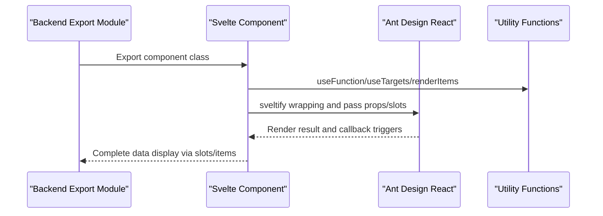

Diagram Source

- [backend/modelscope_studio/components/antd/**init**.py:1-150](file://backend/modelscope_studio/components/antd/__init__.py#L1-L150)
- [frontend/antd/avatar/avatar.tsx:1-28](file://frontend/antd/avatar/avatar.tsx#L1-L28)
- [frontend/antd/calendar/calendar.tsx:1-102](file://frontend/antd/calendar/calendar.tsx#L1-L102)
- [frontend/antd/card/card.tsx:1-150](file://frontend/antd/card/card.tsx#L1-L150)
- [frontend/antd/carousel/carousel.tsx:1-32](file://frontend/antd/carousel/carousel.tsx#L1-L32)
- [frontend/antd/collapse/collapse.tsx:1-53](file://frontend/antd/collapse/collapse.tsx#L1-L53)
- [frontend/antd/descriptions/descriptions.tsx:1-41](file://frontend/antd/descriptions/descriptions.tsx#L1-L41)
- [frontend/antd/empty/empty.tsx:1-52](file://frontend/antd/empty/empty.tsx#L1-L52)

## Detailed Component Analysis

### Avatar

- Data rendering: supports rendering icon and src via slots; if not provided, falls back to children.
- Interaction behavior: no interaction events.
- Animation effects: provided by Ant Design; component layer does not add additional wrapping.

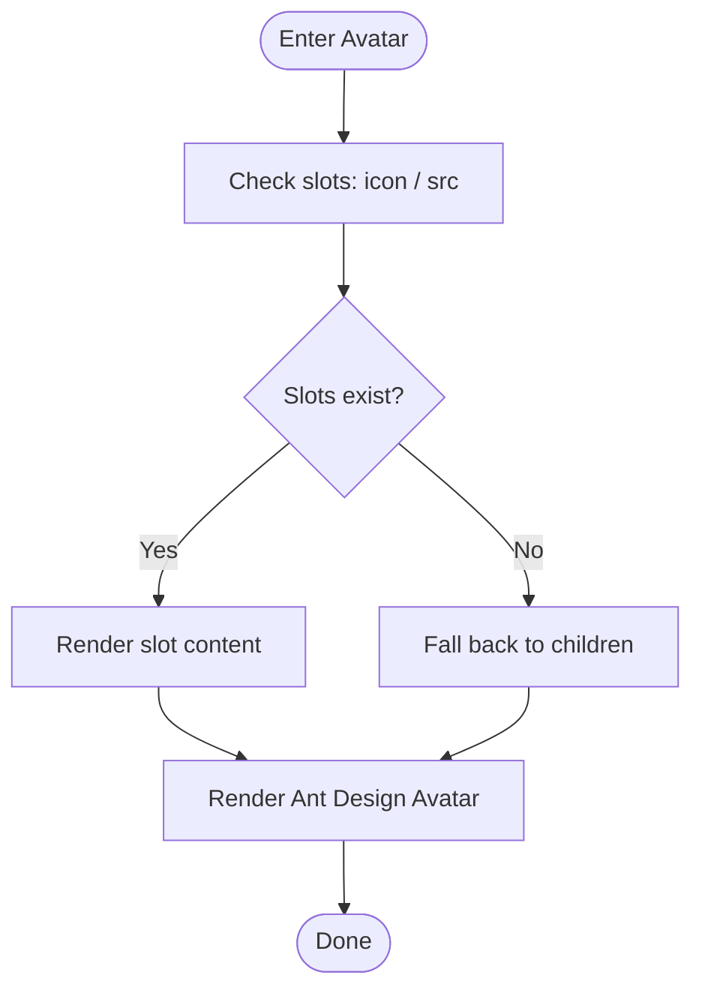

Diagram Source

- [frontend/antd/avatar/avatar.tsx:6-25](file://frontend/antd/avatar/avatar.tsx#L6-L25)

Section Source

- [frontend/antd/avatar/avatar.tsx:1-28](file://frontend/antd/avatar/avatar.tsx#L1-L28)

### Badge

- Data rendering: count and text support custom slots.
- Interaction behavior: no interaction events.
- Animation effects: provided by Ant Design.

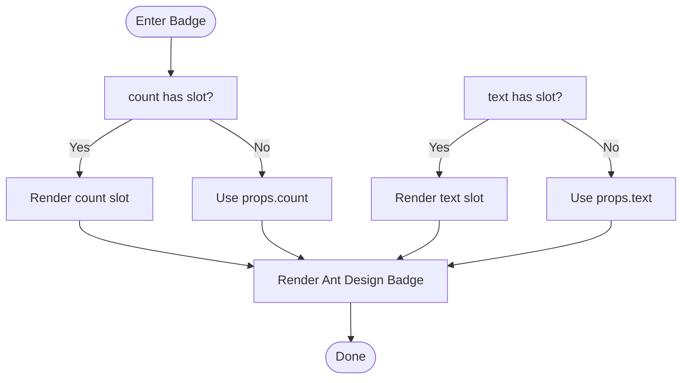

Diagram Source

- [frontend/antd/badge/badge.tsx:6-18](file://frontend/antd/badge/badge.tsx#L6-L18)

Section Source

- [frontend/antd/badge/badge.tsx:1-21](file://frontend/antd/badge/badge.tsx#L1-L21)

### Calendar

- Data rendering: value/defaultValue/validRange are formatted with dayjs; cellRender/fullCellRender/headerRender support slots.
- Interaction behavior: onChange/onPanelChange/onSelect callbacks are uniformly wrapped via useFunction; internally converts dates to second-level timestamps before returning to the parent.
- Animation effects: provided by Ant Design.

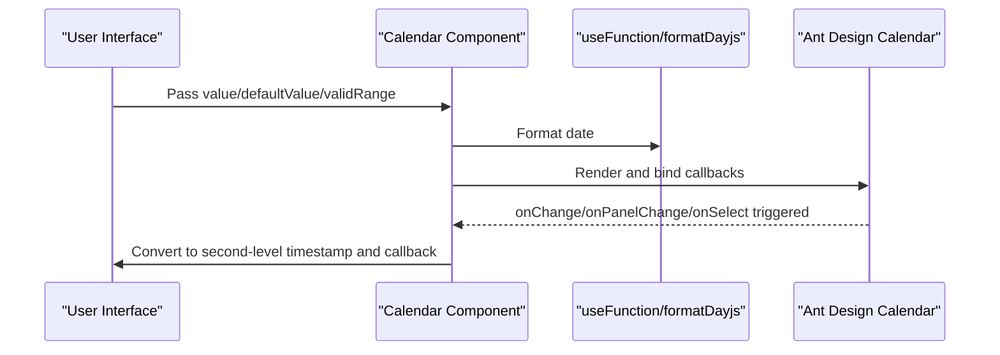

Diagram Source

- [frontend/antd/calendar/calendar.tsx:17-99](file://frontend/antd/calendar/calendar.tsx#L17-L99)

Section Source

- [frontend/antd/calendar/calendar.tsx:1-102](file://frontend/antd/calendar/calendar.tsx#L1-L102)

### Card

- Data rendering: title/extra/cover/tabBarExtraContent support slots; actions are auto-collected via useTargets; tabList is rendered via renderItems.
- Interaction behavior: no interaction events.
- Animation effects: provided by Ant Design.

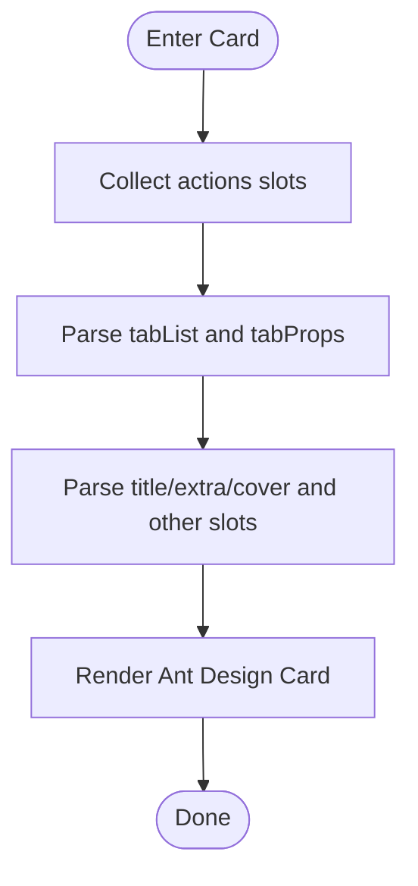

Diagram Source

- [frontend/antd/card/card.tsx:37-147](file://frontend/antd/card/card.tsx#L37-L147)

Section Source

- [frontend/antd/card/card.tsx:1-150](file://frontend/antd/card/card.tsx#L1-L150)

### Carousel

- Data rendering: children are collected via useTargets, then cloned and rendered as ReactSlot.
- Interaction behavior: afterChange/beforeChange are wrapped via useFunction.
- Animation effects: provided by Ant Design.

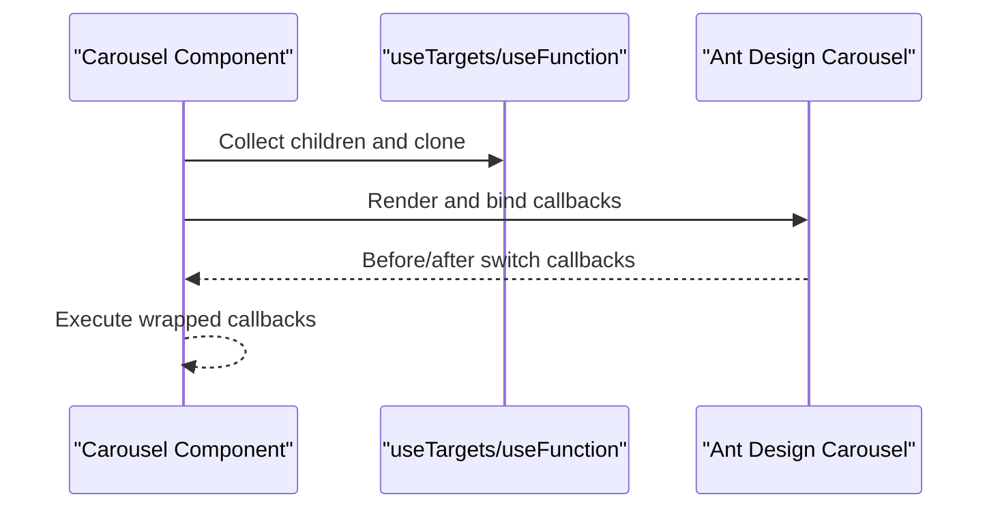

Diagram Source

- [frontend/antd/carousel/carousel.tsx:8-29](file://frontend/antd/carousel/carousel.tsx#L8-L29)

Section Source

- [frontend/antd/carousel/carousel.tsx:1-32](file://frontend/antd/carousel/carousel.tsx#L1-L32)

### Collapse

- Data rendering: items are rendered via renderItems; expandIcon supports slots.
- Interaction behavior: onChange is wrapped via useFunction.
- Animation effects: provided by Ant Design.

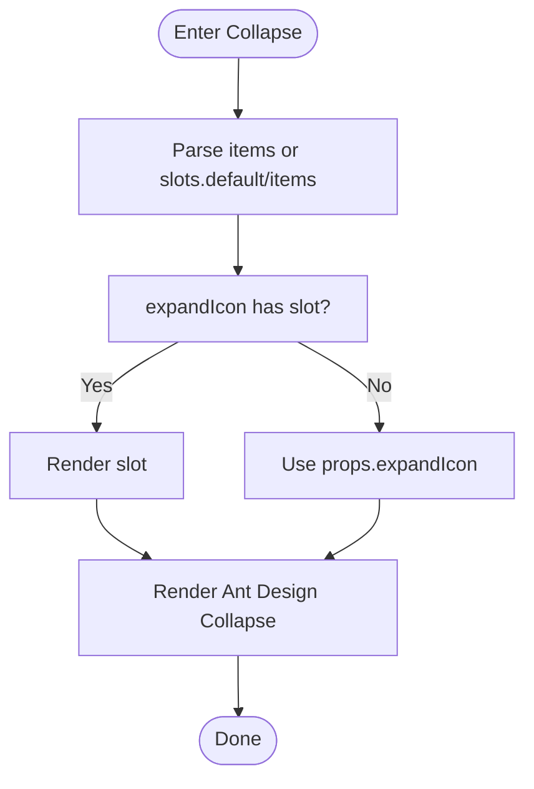

Diagram Source

- [frontend/antd/collapse/collapse.tsx:11-50](file://frontend/antd/collapse/collapse.tsx#L11-L50)

Section Source

- [frontend/antd/collapse/collapse.tsx:1-53](file://frontend/antd/collapse/collapse.tsx#L1-L53)

### Descriptions

- Data rendering: title/extra support slots; items are rendered via renderItems.
- Interaction behavior: no interaction events.
- Animation effects: provided by Ant Design.

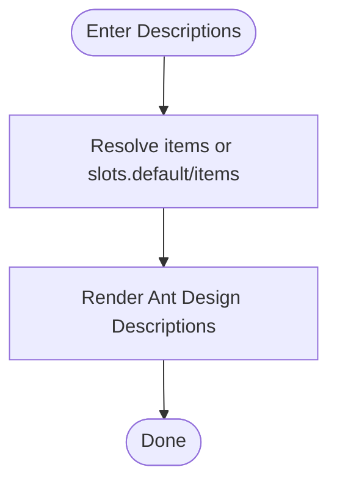

Diagram Source

- [frontend/antd/descriptions/descriptions.tsx:10-38](file://frontend/antd/descriptions/descriptions.tsx#L10-L38)

Section Source

- [frontend/antd/descriptions/descriptions.tsx:1-41](file://frontend/antd/descriptions/descriptions.tsx#L1-L41)

### Empty

- Data rendering: description/image support slots; image supports default value and custom.
- Interaction behavior: no interaction events.
- Animation effects: provided by Ant Design.

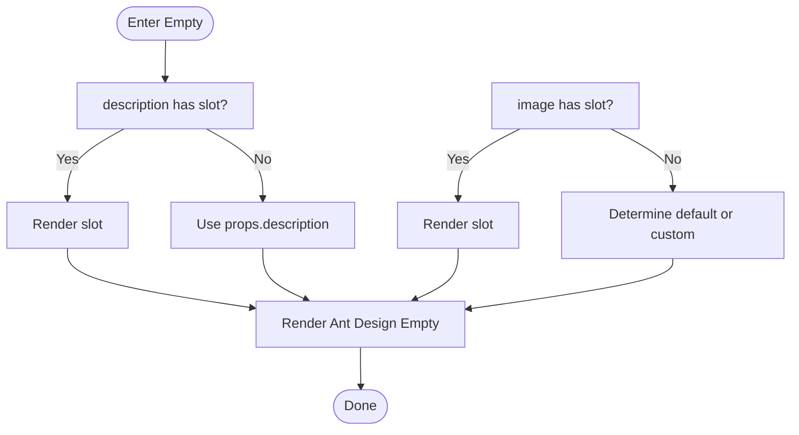

Diagram Source

- [frontend/antd/empty/empty.tsx:6-49](file://frontend/antd/empty/empty.tsx#L6-L49)

Section Source

- [frontend/antd/empty/empty.tsx:1-52](file://frontend/antd/empty/empty.tsx#L1-L52)

### Image

- Data rendering: supports preview group and slots.
- Interaction behavior: no interaction events.
- Animation effects: provided by Ant Design.

Section Source

- [frontend/antd/image/image.tsx:1-200](file://frontend/antd/image/image.tsx#L1-L200)

### List

- Data rendering: supports custom item rendering and action areas.
- Interaction behavior: no interaction events.
- Animation effects: provided by Ant Design.

Section Source

- [frontend/antd/list/list.tsx:1-200](file://frontend/antd/list/list.tsx#L1-L200)

### Popover

- Data rendering: supports slots for trigger and content areas.
- Interaction behavior: no interaction events.
- Animation effects: provided by Ant Design.

Section Source

- [frontend/antd/popover/popover.tsx:1-200](file://frontend/antd/popover/popover.tsx#L1-L200)

### QRCode

- Data rendering: supports content and style configuration.
- Interaction behavior: no interaction events.
- Animation effects: provided by Ant Design.

Section Source

- [frontend/antd/qr_code/qr-code.tsx:1-200](file://frontend/antd/qr_code/qr-code.tsx#L1-L200)

### Segmented

- Data rendering: supports options and slots.
- Interaction behavior: no interaction events.
- Animation effects: provided by Ant Design.

Section Source

- [frontend/antd/segmented/segmented.tsx:1-200](file://frontend/antd/segmented/segmented.tsx#L1-L200)

### Statistic

- Data rendering: supports custom titles and values.
- Interaction behavior: no interaction events.
- Animation effects: provided by Ant Design.

Section Source

- [frontend/antd/statistic/statistic.tsx:1-200](file://frontend/antd/statistic/statistic.tsx#L1-L200)

### Table

- Data rendering: supports complex structures including column definitions, expandable rows, and row selection.
- Interaction behavior: no interaction events.
- Animation effects: provided by Ant Design.

Section Source

- [frontend/antd/table/table.tsx:1-200](file://frontend/antd/table/table.tsx#L1-L200)

### Tabs

- Data rendering: supports slots for tab items and extra content.
- Interaction behavior: no interaction events.
- Animation effects: provided by Ant Design.

Section Source

- [frontend/antd/tabs/tabs.tsx:1-200](file://frontend/antd/tabs/tabs.tsx#L1-L200)

### Tag

- Data rendering: supports checkable tags and slots.
- Interaction behavior: no interaction events.
- Animation effects: provided by Ant Design.

Section Source

- [frontend/antd/tag/tag.tsx:1-200](file://frontend/antd/tag/tag.tsx#L1-L200)

### Timeline

- Data rendering: supports timeline items and slots.
- Interaction behavior: no interaction events.
- Animation effects: provided by Ant Design.

Section Source

- [frontend/antd/timeline/timeline.tsx:1-200](file://frontend/antd/timeline/timeline.tsx#L1-L200)

### Tooltip

- Data rendering: supports slots for trigger and content areas.
- Interaction behavior: no interaction events.
- Animation effects: provided by Ant Design.

Section Source

- [frontend/antd/tooltip/tooltip.tsx:1-200](file://frontend/antd/tooltip/tooltip.tsx#L1-L200)

### Tour

- Data rendering: supports steps and slots.
- Interaction behavior: no interaction events.
- Animation effects: provided by Ant Design.

Section Source

- [frontend/antd/tour/tour.tsx:1-200](file://frontend/antd/tour/tour.tsx#L1-L200)

### Tree

- Data rendering: supports directory tree and node rendering.
- Interaction behavior: no interaction events.
- Animation effects: provided by Ant Design.

Section Source

- [frontend/antd/tree/tree.tsx:1-200](file://frontend/antd/tree/tree.tsx#L1-L200)

## Dependency Analysis

- Component coupling: all components depend on Ant Design React version; unified wrapping via sveltify reduces the complexity of directly using React.
- Utility functions: tools such as useFunction/useTargets/renderItems/renderParamsSlot run throughout multiple components, improving reusability and consistency.
- Context: some components (such as Collapse/Descriptions/Tabs) introduce an items context for unified declaration and rendering of items.

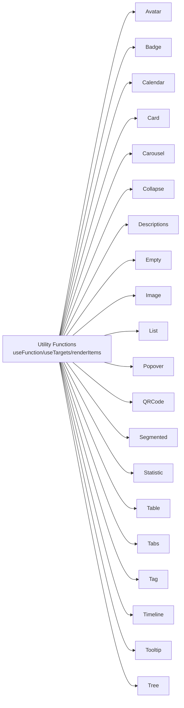

Diagram Source

- [frontend/antd/avatar/avatar.tsx:1-28](file://frontend/antd/avatar/avatar.tsx#L1-L28)
- [frontend/antd/badge/badge.tsx:1-21](file://frontend/antd/badge/badge.tsx#L1-L21)
- [frontend/antd/calendar/calendar.tsx:1-102](file://frontend/antd/calendar/calendar.tsx#L1-L102)
- [frontend/antd/card/card.tsx:1-150](file://frontend/antd/card/card.tsx#L1-L150)
- [frontend/antd/carousel/carousel.tsx:1-32](file://frontend/antd/carousel/carousel.tsx#L1-L32)
- [frontend/antd/collapse/collapse.tsx:1-53](file://frontend/antd/collapse/collapse.tsx#L1-L53)
- [frontend/antd/descriptions/descriptions.tsx:1-41](file://frontend/antd/descriptions/descriptions.tsx#L1-L41)
- [frontend/antd/empty/empty.tsx:1-52](file://frontend/antd/empty/empty.tsx#L1-L52)
- [frontend/antd/image/image.tsx:1-200](file://frontend/antd/image/image.tsx#L1-L200)
- [frontend/antd/list/list.tsx:1-200](file://frontend/antd/list/list.tsx#L1-L200)
- [frontend/antd/popover/popover.tsx:1-200](file://frontend/antd/popover/popover.tsx#L1-L200)
- [frontend/antd/qr_code/qr-code.tsx:1-200](file://frontend/antd/qr_code/qr-code.tsx#L1-L200)
- [frontend/antd/segmented/segmented.tsx:1-200](file://frontend/antd/segmented/segmented.tsx#L1-L200)
- [frontend/antd/statistic/statistic.tsx:1-200](file://frontend/antd/statistic/statistic.tsx#L1-L200)
- [frontend/antd/table/table.tsx:1-200](file://frontend/antd/table/table.tsx#L1-L200)
- [frontend/antd/tabs/tabs.tsx:1-200](file://frontend/antd/tabs/tabs.tsx#L1-L200)
- [frontend/antd/tag/tag.tsx:1-200](file://frontend/antd/tag/tag.tsx#L1-L200)
- [frontend/antd/timeline/timeline.tsx:1-200](file://frontend/antd/timeline/timeline.tsx#L1-L200)
- [frontend/antd/tooltip/tooltip.tsx:1-200](file://frontend/antd/tooltip/tooltip.tsx#L1-L200)
- [frontend/antd/tree/tree.tsx:1-200](file://frontend/antd/tree/tree.tsx#L1-L200)

Section Source

- [frontend/antd/package.json:1-6](file://frontend/antd/package.json#L1-L6)

## Performance Considerations

- Large data display recommendations
  - Virtual scrolling: prioritize container components with virtual scrolling capabilities (such as List/Table), rendering only visible area elements.
  - Pagination and lazy loading: use pagination or scroll-to-bottom loading for long lists to reduce one-time rendering pressure.
  - Event throttling: use throttle/debounce for high-frequency interactions (such as scrolling, zooming) to avoid frequent re-renders.
  - Rendering optimization: move complex computations to the backend or cache them; the frontend only does lightweight rendering.
- Animation and transitions
  - Ant Design components have built-in smooth transitions; the component layer does not add additional animations to avoid performance degradation from overlapping.
- Theming and styles
  - Use Ant Design's theme variables and CSS variable system to reduce repeated style computations.
  - Avoid dynamically generating large amounts of inline styles within components; prefer class names and CSS Modules.

## Troubleshooting Guide

- Date parameter anomaly
  - Symptom: calendar component date display or callback timestamp is inconsistent.
  - Diagnosis: confirm whether value/defaultValue/validRange passed in are valid timestamps or values parseable by dayjs; check whether the formatting logic is effective.
- Callback not triggered
  - Symptom: callbacks such as onChange/onSelect are not executed.
  - Diagnosis: confirm whether useFunction correctly wraps the callback; check the priority relationship between slots and props.
- Slots not working
  - Symptom: title/extra/actions, etc. are not rendered as expected.
  - Diagnosis: confirm that slot names are consistent with component conventions; check whether renderItems and useTargets are used correctly.
- Style override not working
  - Symptom: custom styles do not take effect.
  - Diagnosis: confirm CSS scope and !important usage; prefer theme variables and controlled style objects.

Section Source

- [frontend/antd/calendar/calendar.tsx:17-99](file://frontend/antd/calendar/calendar.tsx#L17-L99)
- [frontend/antd/card/card.tsx:37-147](file://frontend/antd/card/card.tsx#L37-L147)
- [frontend/antd/carousel/carousel.tsx:8-29](file://frontend/antd/carousel/carousel.tsx#L8-L29)
- [frontend/antd/collapse/collapse.tsx:11-50](file://frontend/antd/collapse/collapse.tsx#L11-L50)
- [frontend/antd/descriptions/descriptions.tsx:10-38](file://frontend/antd/descriptions/descriptions.tsx#L10-L38)
- [frontend/antd/empty/empty.tsx:6-49](file://frontend/antd/empty/empty.tsx#L6-L49)

## Conclusion

This repository seamlessly integrates Ant Design React components into the Svelte ecosystem through unified sveltify bridging and utility functions, achieving:

- Declarative data rendering (slots/items)
- Consistent interaction callbacks (useFunction)
- Easy-to-extend theming and style overrides
- Good performance and maintainability

For large data scenarios, it is recommended to combine virtual scrolling, pagination, and lazy loading strategies to further improve user experience and performance.

## Appendix

- Component list and corresponding file paths
  - Avatar: [frontend/antd/avatar/avatar.tsx](file://frontend/antd/avatar/avatar.tsx)
  - Badge: [frontend/antd/badge/badge.tsx](file://frontend/antd/badge/badge.tsx)
  - Calendar: [frontend/antd/calendar/calendar.tsx](file://frontend/antd/calendar/calendar.tsx)
  - Card: [frontend/antd/card/card.tsx](file://frontend/antd/card/card.tsx)
  - Carousel: [frontend/antd/carousel/carousel.tsx](file://frontend/antd/carousel/carousel.tsx)
  - Collapse: [frontend/antd/collapse/collapse.tsx](file://frontend/antd/collapse/collapse.tsx)
  - Descriptions: [frontend/antd/descriptions/descriptions.tsx](file://frontend/antd/descriptions/descriptions.tsx)
  - Empty: [frontend/antd/empty/empty.tsx](file://frontend/antd/empty/empty.tsx)
  - Image: [frontend/antd/image/image.tsx](file://frontend/antd/image/image.tsx)
  - List: [frontend/antd/list/list.tsx](file://frontend/antd/list/list.tsx)
  - Popover: [frontend/antd/popover/popover.tsx](file://frontend/antd/popover/popover.tsx)
  - QRCode: [frontend/antd/qr_code/qr-code.tsx](file://frontend/antd/qr_code/qr-code.tsx)
  - Segmented: [frontend/antd/segmented/segmented.tsx](file://frontend/antd/segmented/segmented.tsx)
  - Statistic: [frontend/antd/statistic/statistic.tsx](file://frontend/antd/statistic/statistic.tsx)
  - Table: [frontend/antd/table/table.tsx](file://frontend/antd/table/table.tsx)
  - Tabs: [frontend/antd/tabs/tabs.tsx](file://frontend/antd/tabs/tabs.tsx)
  - Tag: [frontend/antd/tag/tag.tsx](file://frontend/antd/tag/tag.tsx)
  - Timeline: [frontend/antd/timeline/timeline.tsx](file://frontend/antd/timeline/timeline.tsx)
  - Tooltip: [frontend/antd/tooltip/tooltip.tsx](file://frontend/antd/tooltip/tooltip.tsx)
  - Tour: [frontend/antd/tour/tour.tsx](file://frontend/antd/tour/tour.tsx)
  - Tree: [frontend/antd/tree/tree.tsx](file://frontend/antd/tree/tree.tsx)
- Backend exports
  - [backend/modelscope_studio/components/antd/**init**.py](file://backend/modelscope_studio/components/antd/__init__.py)
  - [backend/modelscope_studio/components/antd/components.py](file://backend/modelscope_studio/components/antd/components.py)
- Frontend package info
  - [frontend/antd/package.json](file://frontend/antd/package.json)
