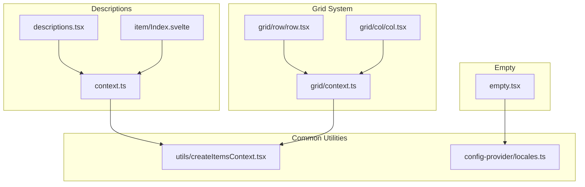
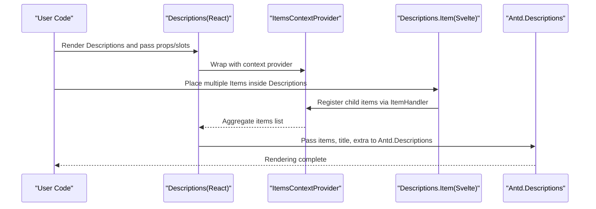
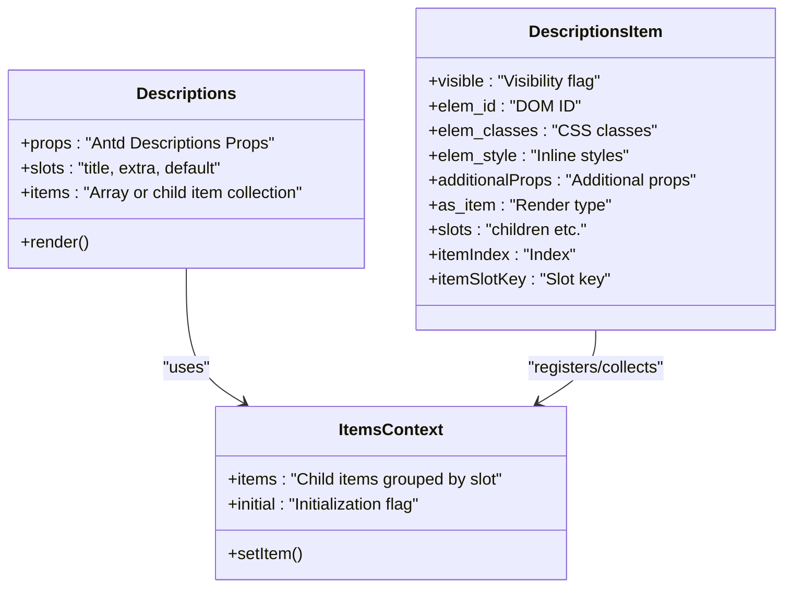
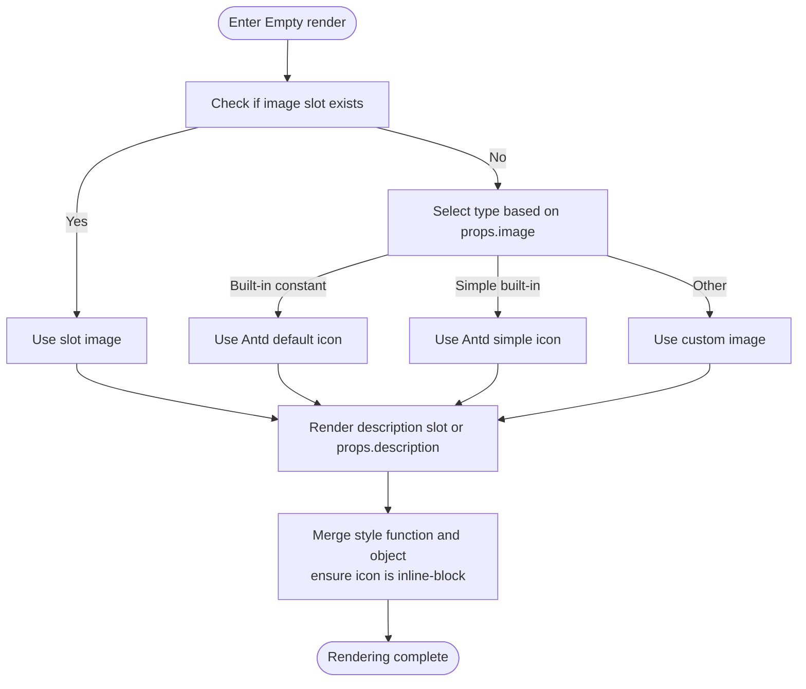
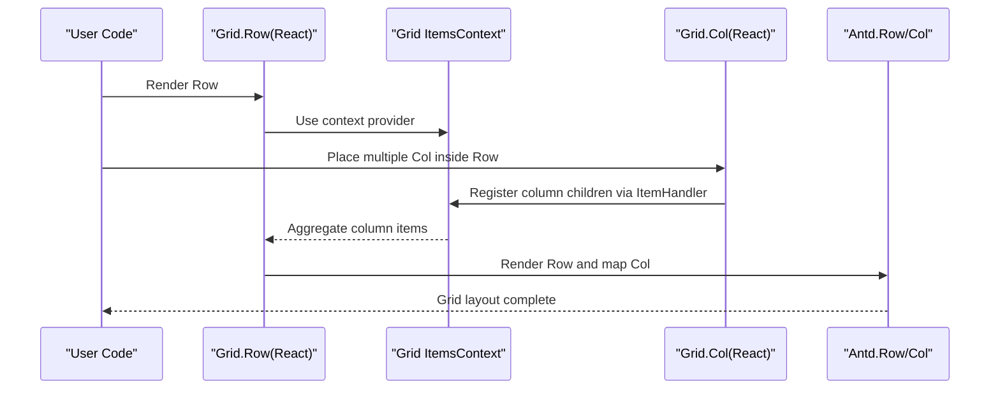
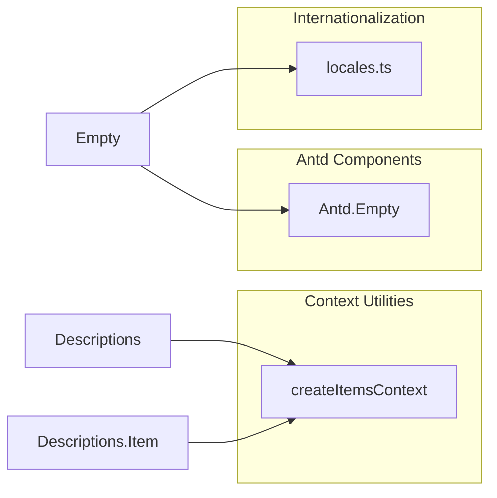

# Descriptions and Empty

<cite>
**Files Referenced in This Document**
- [frontend/antd/descriptions/descriptions.tsx](file://frontend/antd/descriptions/descriptions.tsx)
- [frontend/antd/descriptions/item/Index.svelte](file://frontend/antd/descriptions/item/Index.svelte)
- [frontend/antd/descriptions/context.ts](file://frontend/antd/descriptions/context.ts)
- [frontend/antd/empty/empty.tsx](file://frontend/antd/empty/empty.tsx)
- [frontend/antd/grid/row/row.tsx](file://frontend/antd/grid/row/row.tsx)
- [frontend/antd/grid/col/col.tsx](file://frontend/antd/grid/col/col.tsx)
- [frontend/antd/grid/context.ts](file://frontend/antd/grid/context.ts)
- [frontend/utils/createItemsContext.tsx](file://frontend/utils/createItemsContext.tsx)
- [frontend/antd/config-provider/locales.ts](file://frontend/antd/config-provider/locales.ts)
- [docs/components/antd/descriptions/README.md](file://docs/components/antd/descriptions/README.md)
</cite>

## Table of Contents

1. [Introduction](#introduction)
2. [Project Structure](#project-structure)
3. [Core Components](#core-components)
4. [Architecture Overview](#architecture-overview)
5. [Detailed Component Analysis](#detailed-component-analysis)
6. [Dependency Analysis](#dependency-analysis)
7. [Performance Considerations](#performance-considerations)
8. [Troubleshooting Guide](#troubleshooting-guide)
9. [Conclusion](#conclusion)
10. [Appendix](#appendix)

## Introduction

This document focuses on two commonly used UI components: **Descriptions** and **Empty**. It provides an in-depth analysis from the perspectives of system architecture, component relationships, data flow and processing logic, integration points and error handling, and performance characteristics. Based on the existing implementation in the repository, it also provides actionable usage recommendations and best practices. Topics covered include:

- Descriptions: key-value pair display, responsive layout, label alignment, and custom configuration of description items
- Empty: default icons, custom icons, helper text, and combining action buttons
- Descriptions in form detail pages, multi-language support for labels, and internationalization of empty state
- Grid-based layout for Descriptions and user experience optimization with Empty during data load failures

## Project Structure

This project uses a layered and component-based frontend structure. Descriptions and Empty are located under the antd frontend component directory, and use common utilities and context mechanisms to enable flexible slot and child item management.

Diagram Source

- [frontend/antd/descriptions/descriptions.tsx:1-41](file://frontend/antd/descriptions/descriptions.tsx#L1-L41)
- [frontend/antd/descriptions/item/Index.svelte:1-83](file://frontend/antd/descriptions/item/Index.svelte#L1-L83)
- [frontend/antd/descriptions/context.ts:1-7](file://frontend/antd/descriptions/context.ts#L1-L7)
- [frontend/antd/empty/empty.tsx:1-52](file://frontend/antd/empty/empty.tsx#L1-L52)
- [frontend/antd/grid/row/row.tsx:1-34](file://frontend/antd/grid/row/row.tsx#L1-L34)
- [frontend/antd/grid/col/col.tsx:1-14](file://frontend/antd/grid/col/col.tsx#L1-L14)
- [frontend/antd/grid/context.ts:1-7](file://frontend/antd/grid/context.ts#L1-L7)
- [frontend/utils/createItemsContext.tsx:1-274](file://frontend/utils/createItemsContext.tsx#L1-L274)
- [frontend/antd/config-provider/locales.ts:1-863](file://frontend/antd/config-provider/locales.ts#L1-L863)

Section Source

- [docs/components/antd/descriptions/README.md:1-9](file://docs/components/antd/descriptions/README.md#L1-L9)

## Core Components

- Descriptions
  - Responsible for displaying a set of key-value pairs in a read-only grouped format, with support for titles, extra areas, and slot-based content injection.
  - Collects internal description items via context and item handlers, and ultimately renders them as an Ant Design Descriptions component.
- Descriptions.Item
  - A child item of Descriptions, responsible for receiving visibility, style, ID, class name, and other props, and passing child content to the underlying component via slots.
- Empty
  - Provides an empty state placeholder with default, simple, or custom icons; supports custom description text and style functions to improve the experience when data is empty or fails to load.
- Grid System (Grid.Row/Col)
  - Uses a context mechanism to collect column children and map them to Ant Design's Row/Col, enabling a grid-based layout for Descriptions.

Section Source

- [frontend/antd/descriptions/descriptions.tsx:1-41](file://frontend/antd/descriptions/descriptions.tsx#L1-L41)
- [frontend/antd/descriptions/item/Index.svelte:1-83](file://frontend/antd/descriptions/item/Index.svelte#L1-L83)
- [frontend/antd/empty/empty.tsx:1-52](file://frontend/antd/empty/empty.tsx#L1-L52)
- [frontend/antd/grid/row/row.tsx:1-34](file://frontend/antd/grid/row/row.tsx#L1-L34)
- [frontend/antd/grid/col/col.tsx:1-14](file://frontend/antd/grid/col/col.tsx#L1-L14)

## Architecture Overview

Both Descriptions and Empty work based on a unified "slot and child item context" mechanism:

- The context provider is responsible for collecting structured information (props, slots, elements, etc.) from child items and transforming them into the data structures required by Ant Design during the rendering phase.
- Slots allow users to inject custom content in the form of ReactSlot or Svelte Slot, such as titles, extra areas, and description item content.
- When rendering, the Empty component selects the appropriate icon based on the passed image type or slot, and merges style functions with inline styles.

Diagram Source

- [frontend/antd/descriptions/descriptions.tsx:10-38](file://frontend/antd/descriptions/descriptions.tsx#L10-L38)
- [frontend/antd/descriptions/context.ts:1-7](file://frontend/antd/descriptions/context.ts#L1-L7)
- [frontend/antd/descriptions/item/Index.svelte:56-76](file://frontend/antd/descriptions/item/Index.svelte#L56-L76)
- [frontend/utils/createItemsContext.tsx:171-184](file://frontend/utils/createItemsContext.tsx#L171-L184)

## Detailed Component Analysis

### Descriptions Component

- Key-Value Pair Display
  - Child items are collected via context and ultimately generate the items array required by Ant Design Descriptions; supports directly passing items or auto-aggregating from child items.
- Responsive Layout
  - Can be combined with the Grid System (Grid.Row/Col) for responsive layout; column children inside a Row are mapped to Antd Col for adaptive arrangement at breakpoints.
- Label Alignment
  - The component itself does not directly control label alignment, but can pass through props for Antd Descriptions to handle; alignment is transparently forwarded at the Svelte layer.
- Custom Configuration of Description Items
  - Supports visible for controlling display, elem_id/elem_classes/elem_style for setting DOM attributes and styles, additionalProps for additional attributes, and as_item for custom render types.
- Slots, Title, and Extra Area
  - Supports title and extra slots for injecting custom titles and extra action areas; falls back to props if not provided.

Diagram Source

- [frontend/antd/descriptions/descriptions.tsx:10-38](file://frontend/antd/descriptions/descriptions.tsx#L10-L38)
- [frontend/antd/descriptions/item/Index.svelte:18-76](file://frontend/antd/descriptions/item/Index.svelte#L18-L76)
- [frontend/antd/descriptions/context.ts:1-7](file://frontend/antd/descriptions/context.ts#L1-L7)
- [frontend/utils/createItemsContext.tsx:40-95](file://frontend/utils/createItemsContext.tsx#L40-L95)

Section Source

- [frontend/antd/descriptions/descriptions.tsx:1-41](file://frontend/antd/descriptions/descriptions.tsx#L1-L41)
- [frontend/antd/descriptions/item/Index.svelte:1-83](file://frontend/antd/descriptions/item/Index.svelte#L1-L83)
- [frontend/antd/descriptions/context.ts:1-7](file://frontend/antd/descriptions/context.ts#L1-L7)
- [frontend/utils/createItemsContext.tsx:1-274](file://frontend/utils/createItemsContext.tsx#L1-L274)

### Empty Component

- Default and Custom Icons
  - Supports three built-in icon types as well as custom images; the image slot takes priority when present.
- Helper Text
  - The description slot has higher priority than props.description, making it easy to dynamically render localized text or complex content.
- Style and Layout
  - Supports passing style functions or objects; internally sets the image style to inline-block to ensure consistent alignment of icons and text.
- Combining Action Buttons
  - Interactive elements such as buttons can be combined within the description slot to create a complete "empty state + action" flow.

Diagram Source

- [frontend/antd/empty/empty.tsx:9-49](file://frontend/antd/empty/empty.tsx#L9-L49)

Section Source

- [frontend/antd/empty/empty.tsx:1-52](file://frontend/antd/empty/empty.tsx#L1-L52)

### Grid-Based Layout (Grid.Row/Col)

- Row maps collected column children to Antd Col and renders them inside the Row to achieve responsive grid layout.
- Col receives column props and slots via ItemHandler and forwards them to Antd Col.
- When combined with Descriptions, description items can be nested inside Row/Col to form a "grid-based Descriptions".

Diagram Source

- [frontend/antd/grid/row/row.tsx:7-31](file://frontend/antd/grid/row/row.tsx#L7-L31)
- [frontend/antd/grid/col/col.tsx:7-11](file://frontend/antd/grid/col/col.tsx#L7-L11)
- [frontend/antd/grid/context.ts:1-7](file://frontend/antd/grid/context.ts#L1-L7)
- [frontend/utils/createItemsContext.tsx:171-184](file://frontend/utils/createItemsContext.tsx#L171-L184)

Section Source

- [frontend/antd/grid/row/row.tsx:1-34](file://frontend/antd/grid/row/row.tsx#L1-L34)
- [frontend/antd/grid/col/col.tsx:1-14](file://frontend/antd/grid/col/col.tsx#L1-L14)
- [frontend/antd/grid/context.ts:1-7](file://frontend/antd/grid/context.ts#L1-L7)

## Dependency Analysis

- Descriptions Dependencies
  - Uses the context capability provided by createItemsContext to bridge Svelte slots and React components, enabling items collection and rendering.
  - Wraps the component with withItemsContextProvider to ensure child item registration and updates.
- Empty Dependencies
  - Depends on Ant Design's Empty component and built-in icon constants; style function and object merging ensures consistent alignment of icons and text.
- Internationalization Dependencies
  - Provides multi-language environments through the config-provider's locales, supporting localization switching for both Antd and dayjs.

Diagram Source

- [frontend/antd/descriptions/descriptions.tsx:1-10](file://frontend/antd/descriptions/descriptions.tsx#L1-L10)
- [frontend/antd/descriptions/item/Index.svelte:1-15](file://frontend/antd/descriptions/item/Index.svelte#L1-L15)
- [frontend/antd/empty/empty.tsx:1-9](file://frontend/antd/empty/empty.tsx#L1-L9)
- [frontend/antd/config-provider/locales.ts:1-10](file://frontend/antd/config-provider/locales.ts#L1-L10)

Section Source

- [frontend/antd/descriptions/descriptions.tsx:1-41](file://frontend/antd/descriptions/descriptions.tsx#L1-L41)
- [frontend/antd/empty/empty.tsx:1-52](file://frontend/antd/empty/empty.tsx#L1-L52)
- [frontend/antd/config-provider/locales.ts:1-863](file://frontend/antd/config-provider/locales.ts#L1-L863)

## Performance Considerations

- Child Item Collection and Rendering
  - Both Descriptions and the Grid System collect child items via context, avoiding unnecessary re-renders; only the corresponding component's recalculation is triggered when items update.
- Slots and Styles
  - Slot content is rendered lazily, mounting only when visible; style function and object merging occurs at render time — it is recommended to reuse style objects as much as possible to reduce overhead.
- Icons and Descriptions
  - Icon selection and style merging logic for the Empty component is simple with low performance overhead; it is recommended to use built-in icons in scenarios with many empty states to reduce resource loading.

## Troubleshooting Guide

- Descriptions shows no content
  - Check whether withItemsContextProvider is correctly wrapping Descriptions, and that Descriptions.Item is placed inside it.
  - Confirm that child items have been registered via ItemHandler and that the items list is not empty.
- Description items not taking effect
  - Check whether visible, elem_id, elem_classes, elem_style, additionalProps, and other props are passed correctly.
  - Confirm that the children slot is correctly bound and rendered.
- Empty state icon not displayed
  - If passing an image slot, ensure the slot content is valid; otherwise check whether props.image is a built-in constant or a valid custom value.
  - Confirm that the object returned by the style function contains the correct image styles.
- Grid layout issues
  - Check whether Grid.Row/Col children are correctly registered; confirm that column props and slots are properly forwarded.

Section Source

- [frontend/antd/descriptions/descriptions.tsx:10-38](file://frontend/antd/descriptions/descriptions.tsx#L10-L38)
- [frontend/antd/descriptions/item/Index.svelte:56-76](file://frontend/antd/descriptions/item/Index.svelte#L56-L76)
- [frontend/antd/empty/empty.tsx:9-49](file://frontend/antd/empty/empty.tsx#L9-L49)
- [frontend/antd/grid/row/row.tsx:7-31](file://frontend/antd/grid/row/row.tsx#L7-L31)
- [frontend/antd/grid/col/col.tsx:7-11](file://frontend/antd/grid/col/col.tsx#L7-L11)

## Conclusion

The Descriptions and Empty components achieve flexible content injection and rendering through a unified context and slot mechanism. Descriptions supports key-value pair display and grid-based layout; Empty provides placeholder solutions with both default and custom icons, and can be combined with action buttons to optimize user experience. Combined with internationalization tools, both can operate stably in multi-language environments. It is recommended to prioritize using Descriptions for displaying read-only information in form detail pages, and to use the Empty component to improve usability when data is empty or fails to load.

## Appendix

- Usage Scenario Recommendations
  - Form detail pages: Use Descriptions to display read-only fields, optionally combined with the Grid System for responsive layout.
  - Data load failures: Use the Empty component to display prompts and retry buttons to improve user confidence.
- Multi-language Support
  - Switch Antd and dayjs localization through the config-provider's locales to ensure text and formatting in Descriptions and Empty match the target language.
- Best Practices
  - Use slots and props appropriately; avoid creating new objects frequently in render functions.
  - For scenarios with many empty states, prefer built-in icons to reduce resource overhead.
  - In grid-based layouts, divide column widths and breakpoints carefully to ensure readability across different devices.
