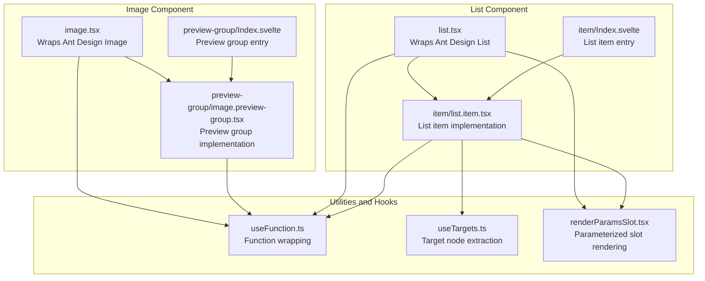
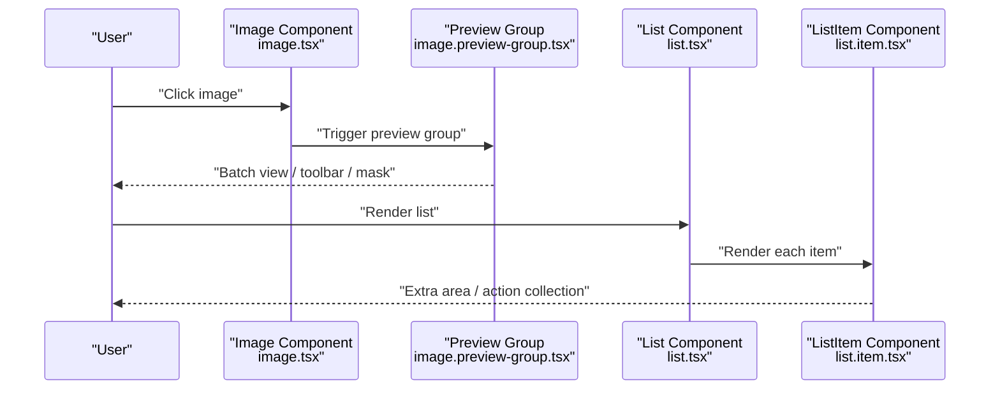
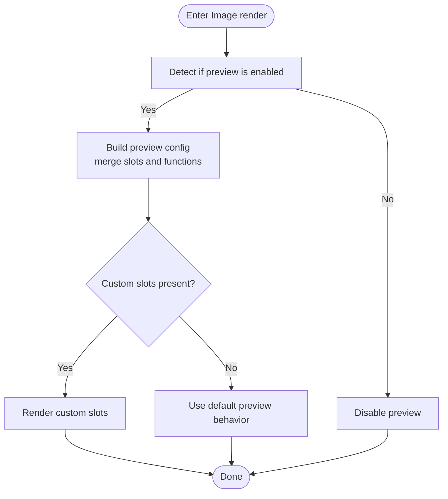
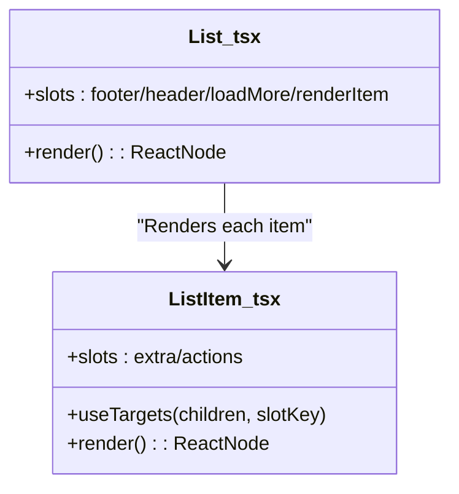
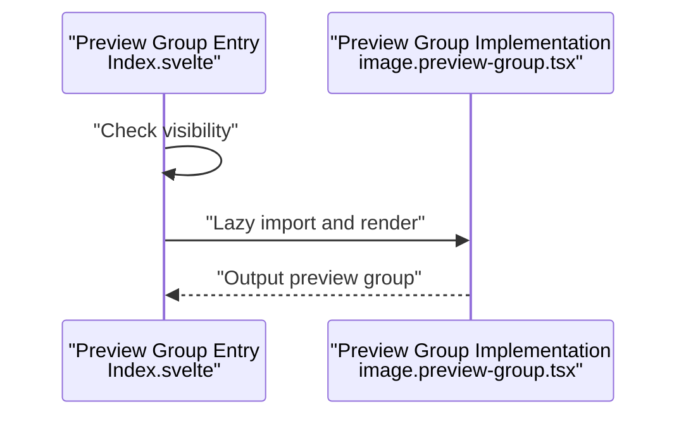
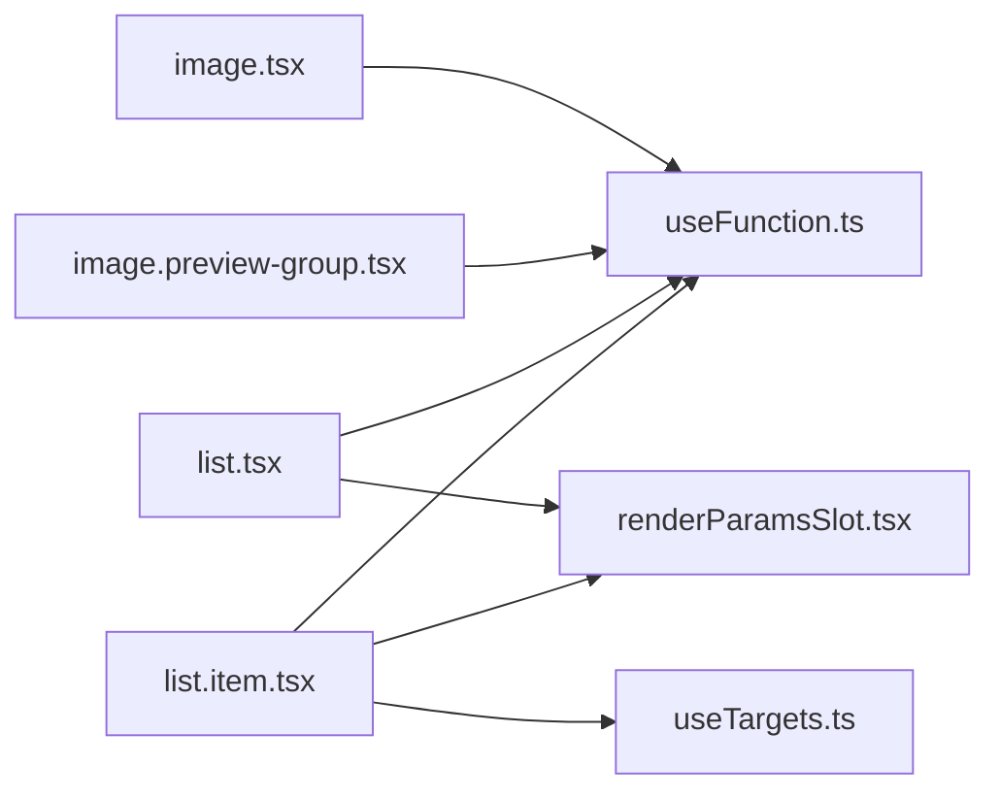

# Image and List

<cite>
**Files Referenced in This Document**
- [frontend/antd/image/image.tsx](file://frontend/antd/image/image.tsx)
- [frontend/antd/image/preview-group/image.preview-group.tsx](file://frontend/antd/image/preview-group/image.preview-group.tsx)
- [frontend/antd/image/preview-group/Index.svelte](file://frontend/antd/image/preview-group/Index.svelte)
- [frontend/antd/list/list.tsx](file://frontend/antd/list/list.tsx)
- [frontend/antd/list/item/list.item.tsx](file://frontend/antd/list/item/list.item.tsx)
- [frontend/antd/list/item/Index.svelte](file://frontend/antd/list/item/Index.svelte)
- [frontend/utils/hooks/useFunction.ts](file://frontend/utils/hooks/useFunction.ts)
- [frontend/utils/hooks/useTargets.ts](file://frontend/utils/hooks/useTargets.ts)
- [frontend/utils/renderParamsSlot.tsx](file://frontend/utils/renderParamsSlot.tsx)
</cite>

## Table of Contents

1. [Introduction](#introduction)
2. [Project Structure](#project-structure)
3. [Core Components](#core-components)
4. [Architecture Overview](#architecture-overview)
5. [Detailed Component Analysis](#detailed-component-analysis)
6. [Dependency Analysis](#dependency-analysis)
7. [Performance Considerations](#performance-considerations)
8. [Troubleshooting Guide](#troubleshooting-guide)
9. [Conclusion](#conclusion)
10. [Appendix](#appendix)

## Introduction

This document focuses on the **Image** and **List** component families, systematically reviewing their encapsulation approach at the frontend layer, capability boundaries, and extension points. Based on the existing repository implementation, it provides actionable usage recommendations and best practices. Key topics include:

- Image component: batch viewing via preview groups, lazy loading, error handling, and the availability and limitations of image cropping; current state and extension paths for zoom controls, rotation, and download support.
- List component: basic list structure, list item metadata (meta), vertical list layout, and dynamic data binding; current state and extension paths for virtual scrolling, infinite loading, and data filtering; adaptive display and responsive layout design across different devices.

## Project Structure

The frontend uses a Svelte + Ant Design combination pattern for Image and List components:

- Component entry points are exported via Svelte files, with sveltify internally bridging Ant Design's React components into a Svelte-compatible form.
- Preview groups and list items are lazy-loaded via importComponent, combined with the slots mechanism for flexible rendering extensions.
- Utility functions and hooks provide general capabilities: function wrapping, parameterized slot rendering, and target node extraction.

**Diagram Source**

- [frontend/antd/image/image.tsx:1-89](file://frontend/antd/image/image.tsx#L1-L89)
- [frontend/antd/image/preview-group/Index.svelte:1-72](file://frontend/antd/image/preview-group/Index.svelte#L1-L72)
- [frontend/antd/image/preview-group/image.preview-group.tsx:1-55](file://frontend/antd/image/preview-group/image.preview-group.tsx#L1-L55)
- [frontend/antd/list/list.tsx:1-36](file://frontend/antd/list/list.tsx#L1-L36)
- [frontend/antd/list/item/Index.svelte:1-60](file://frontend/antd/list/item/Index.svelte#L1-L60)
- [frontend/antd/list/item/list.item.tsx:1-29](file://frontend/antd/list/item/list.item.tsx#L1-L29)
- [frontend/utils/hooks/useFunction.ts:1-13](file://frontend/utils/hooks/useFunction.ts#L1-L13)
- [frontend/utils/hooks/useTargets.ts:1-52](file://frontend/utils/hooks/useTargets.ts#L1-L52)
- [frontend/utils/renderParamsSlot.tsx:1-51](file://frontend/utils/renderParamsSlot.tsx#L1-L51)

**Section Source**

- [frontend/antd/image/image.tsx:1-89](file://frontend/antd/image/image.tsx#L1-L89)
- [frontend/antd/image/preview-group/Index.svelte:1-72](file://frontend/antd/image/preview-group/Index.svelte#L1-L72)
- [frontend/antd/image/preview-group/image.preview-group.tsx:1-55](file://frontend/antd/image/preview-group/image.preview-group.tsx#L1-L55)
- [frontend/antd/list/list.tsx:1-36](file://frontend/antd/list/list.tsx#L1-L36)
- [frontend/antd/list/item/Index.svelte:1-60](file://frontend/antd/list/item/Index.svelte#L1-L60)
- [frontend/antd/list/item/list.item.tsx:1-29](file://frontend/antd/list/item/list.item.tsx#L1-L29)

## Core Components

- Image: Wraps Ant Design's Image component via sveltify, supporting placeholders, preview configuration, and slot extensions. The preview group provides batch viewing capability, with support for custom masks, close icons, and toolbars.
- List: Wraps Ant Design's List component via sveltify, supporting headers/footers, load-more, and custom render items. List items support extra areas and action collections, with useTargets automatically extracting child nodes carrying specific slotKeys.

**Section Source**

- [frontend/antd/image/image.tsx:14-86](file://frontend/antd/image/image.tsx#L14-L86)
- [frontend/antd/image/preview-group/image.preview-group.tsx:13-52](file://frontend/antd/image/preview-group/image.preview-group.tsx#L13-L52)
- [frontend/antd/list/list.tsx:8-33](file://frontend/antd/list/list.tsx#L8-L33)
- [frontend/antd/list/item/list.item.tsx:6-26](file://frontend/antd/list/item/list.item.tsx#L6-L26)

## Architecture Overview

The following diagram shows the call chain and slot extension points of the Image and List components at the frontend layer:

**Diagram Source**

- [frontend/antd/image/image.tsx:24-85](file://frontend/antd/image/image.tsx#L24-L85)
- [frontend/antd/image/preview-group/image.preview-group.tsx:18-51](file://frontend/antd/image/preview-group/image.preview-group.tsx#L18-L51)
- [frontend/antd/list/list.tsx:11-32](file://frontend/antd/list/list.tsx#L11-L32)
- [frontend/antd/list/item/list.item.tsx:9-25](file://frontend/antd/list/item/list.item.tsx#L9-L25)

## Detailed Component Analysis

### Image Component

- Batch Viewing (Preview Group)
  - The preview group achieves on-demand loading via lazy imports and conditional rendering, reducing the initial load burden.
  - Supports custom masks, close icons, and toolbars; toolbar and image rendering can be injected via slots or function callbacks.
  - The mount location of the preview container can be customized via getContainer, making it easy to embed in a specific DOM container.
- Lazy Loading and Error Handling
  - The current implementation does not explicitly declare lazy loading and error handling logic; if needed, these can be enhanced at the business layer using native browser attributes or third-party libraries.
- Image Cropping
  - This implementation does not expose cropping-related parameters; if cropping is needed, resources can be pre-processed at the business layer or a dedicated cropping library can be introduced.
- Zoom Controls, Rotation, and Download Support
  - The current implementation does not have built-in zoom, rotation, or download buttons; corresponding controls can be added via the custom toolbar slot in combination with external libraries.
- Slots and Function Wrapping
  - useFunction is used to stabilize passed-in functions; renderParamsSlot supports passing parameters to slot render functions, improving flexibility.

**Diagram Source**

- [frontend/antd/image/image.tsx:24-85](file://frontend/antd/image/image.tsx#L24-L85)
- [frontend/antd/image/preview-group/image.preview-group.tsx:18-51](file://frontend/antd/image/preview-group/image.preview-group.tsx#L18-L51)
- [frontend/utils/hooks/useFunction.ts:5-12](file://frontend/utils/hooks/useFunction.ts#L5-L12)
- [frontend/utils/renderParamsSlot.tsx:5-50](file://frontend/utils/renderParamsSlot.tsx#L5-L50)

**Section Source**

- [frontend/antd/image/image.tsx:14-86](file://frontend/antd/image/image.tsx#L14-L86)
- [frontend/antd/image/preview-group/image.preview-group.tsx:13-52](file://frontend/antd/image/preview-group/image.preview-group.tsx#L13-L52)
- [frontend/utils/hooks/useFunction.ts:1-13](file://frontend/utils/hooks/useFunction.ts#L1-L13)
- [frontend/utils/renderParamsSlot.tsx:1-51](file://frontend/utils/renderParamsSlot.tsx#L1-L51)

### List Component

- Basic List Structure and Dynamic Data Binding
  - Wraps Ant Design List via sveltify, supporting headers/footers, load-more, and custom render items.
  - Render items can be passed via slots or injected as functions, enabling flexible data binding and view rendering.
- List Item and Metadata (meta)
  - List items support "extra areas" and "action collections"; action collections are automatically extracted from child nodes carrying specific slotKeys using useTargets, ensuring controllable order and indexing.
- Vertical List Layout
  - Uses Ant Design's default vertical layout strategy, suitable for most scenarios; for horizontal or grid layouts, use styles or layout components at the business layer.

**Diagram Source**

- [frontend/antd/list/list.tsx:8-33](file://frontend/antd/list/list.tsx#L8-L33)
- [frontend/antd/list/item/list.item.tsx:6-26](file://frontend/antd/list/item/list.item.tsx#L6-L26)
- [frontend/utils/hooks/useTargets.ts:5-51](file://frontend/utils/hooks/useTargets.ts#L5-L51)

**Section Source**

- [frontend/antd/list/list.tsx:8-33](file://frontend/antd/list/list.tsx#L8-L33)
- [frontend/antd/list/item/list.item.tsx:6-26](file://frontend/antd/list/item/list.item.tsx#L6-L26)
- [frontend/utils/hooks/useTargets.ts:1-52](file://frontend/utils/hooks/useTargets.ts#L1-L52)

### Preview Group

- Batch Viewing and Visibility Control
  - The preview group entry uses Svelte lazy imports and visibility checks to render the actual component only when needed, reducing initial overhead.
  - Supports controlling preview visibility change events via props, enabling synchronization with parent state.
- Slots and Container Mounting
  - Supports custom masks and close icons; container mounting location is customized via getContainer, making it easy to embed in a specified container.

**Diagram Source**

- [frontend/antd/image/preview-group/Index.svelte:55-71](file://frontend/antd/image/preview-group/Index.svelte#L55-L71)
- [frontend/antd/image/preview-group/image.preview-group.tsx:18-51](file://frontend/antd/image/preview-group/image.preview-group.tsx#L18-L51)

**Section Source**

- [frontend/antd/image/preview-group/Index.svelte:14-71](file://frontend/antd/image/preview-group/Index.svelte#L14-L71)
- [frontend/antd/image/preview-group/image.preview-group.tsx:18-52](file://frontend/antd/image/preview-group/image.preview-group.tsx#L18-L52)

## Dependency Analysis

- Components and Utility Functions
  - Both Image and List components depend on useFunction for function stabilization, ensuring callbacks are not recreated when props change.
  - List items depend on useTargets to extract child nodes with specific slotKeys, enabling automatic assembly of action collections.
  - renderParamsSlot provides parameterized slot rendering, supporting parameter passing to slots with forced cloning to ensure rendering consistency across multiple renders.
- Inter-Component Coupling
  - Image preview group and Image component are decoupled: the preview group exists as an independent component and collaborates with the Image component via props and slots.
  - List items and the List component are decoupled: list items use lazy imports and slots for independent rendering, reducing coupling.

**Diagram Source**

- [frontend/antd/image/image.tsx:3-4](file://frontend/antd/image/image.tsx#L3-L4)
- [frontend/antd/image/preview-group/image.preview-group.tsx:3-4](file://frontend/antd/image/preview-group/image.preview-group.tsx#L3-L4)
- [frontend/antd/list/list.tsx:4-5](file://frontend/antd/list/list.tsx#L4-L5)
- [frontend/antd/list/item/list.item.tsx:3-4](file://frontend/antd/list/item/list.item.tsx#L3-L4)
- [frontend/utils/hooks/useFunction.ts:1-13](file://frontend/utils/hooks/useFunction.ts#L1-L13)
- [frontend/utils/hooks/useTargets.ts:1-52](file://frontend/utils/hooks/useTargets.ts#L1-L52)
- [frontend/utils/renderParamsSlot.tsx:1-51](file://frontend/utils/renderParamsSlot.tsx#L1-L51)

**Section Source**

- [frontend/utils/hooks/useFunction.ts:1-13](file://frontend/utils/hooks/useFunction.ts#L1-L13)
- [frontend/utils/hooks/useTargets.ts:1-52](file://frontend/utils/hooks/useTargets.ts#L1-L52)
- [frontend/utils/renderParamsSlot.tsx:1-51](file://frontend/utils/renderParamsSlot.tsx#L1-L51)

## Performance Considerations

- On-Demand Loading and Lazy Imports
  - Both preview groups and list items use lazy import strategies, rendering only when visible, which helps reduce initial load and memory usage.
- Function Stabilization
  - useFunction memoizes callbacks to avoid recreation due to prop changes, reducing re-render costs.
- Slot Rendering Optimization
  - renderParamsSlot enforces cloning and parameter forwarding, ensuring deterministic and reusable slot rendering while reducing unnecessary repeated computation.

**Section Source**

- [frontend/antd/image/preview-group/Index.svelte:55-71](file://frontend/antd/image/preview-group/Index.svelte#L55-L71)
- [frontend/antd/list/item/Index.svelte:46-59](file://frontend/antd/list/item/Index.svelte#L46-L59)
- [frontend/utils/hooks/useFunction.ts:5-12](file://frontend/utils/hooks/useFunction.ts#L5-L12)
- [frontend/utils/renderParamsSlot.tsx:23-49](file://frontend/utils/renderParamsSlot.tsx#L23-L49)

## Troubleshooting Guide

- Preview group not displayed
  - Check the visibility props and the entry component's visibility logic to confirm that the preview group has been lazy-loaded and rendered.
  - If using a custom mask or close icon, confirm that the slot is correctly passed in and has not been overridden.
- Toolbar/image rendering not working
  - Confirm that passed-in functions are wrapped with useFunction to prevent failures due to function reference changes.
  - If using slots, confirm that parameter passing to renderParamsSlot is correct.
- List item action collection is empty
  - Check whether child nodes carry the correct slotKey and index information to ensure useTargets can extract them correctly.
- Performance issues
  - If frequent re-renders occur, check whether callbacks or slot content are being changed frequently in the parent component; it is recommended to use useFunction or stabilization strategies.

**Section Source**

- [frontend/antd/image/preview-group/Index.svelte:55-71](file://frontend/antd/image/preview-group/Index.svelte#L55-L71)
- [frontend/antd/image/preview-group/image.preview-group.tsx:18-51](file://frontend/antd/image/preview-group/image.preview-group.tsx#L18-L51)
- [frontend/antd/list/item/list.item.tsx:10-21](file://frontend/antd/list/item/list.item.tsx#L10-L21)
- [frontend/utils/hooks/useFunction.ts:5-12](file://frontend/utils/hooks/useFunction.ts#L5-L12)
- [frontend/utils/renderParamsSlot.tsx:23-49](file://frontend/utils/renderParamsSlot.tsx#L23-L49)

## Conclusion

- The Image component achieves batch viewing and flexible slot extensions via the preview group; the current implementation does not have built-in lazy loading, error handling, cropping, zoom, rotation, or download features, but offers good extensibility.
- The List component provides basic structure and dynamic binding capabilities; list item action collections are automatically assembled via useTargets, making it suitable for combining with styles and layout at the business layer to achieve responsive and adaptive display.
- In terms of performance, components generally adopt lazy import and function stabilization strategies, helping to maintain good runtime efficiency in complex scenarios.

## Appendix

- Extension Recommendations
  - Image: Introduce lazy loading and error handling strategies at the business layer; for cropping, zoom, rotation, and download, combine external libraries with custom toolbar slots.
  - List: Introduce virtual scrolling and infinite loading at the business layer; data filtering can be achieved through external state and render conditions; responsive layout can be adapted for multiple devices via style and breakpoint strategies.
