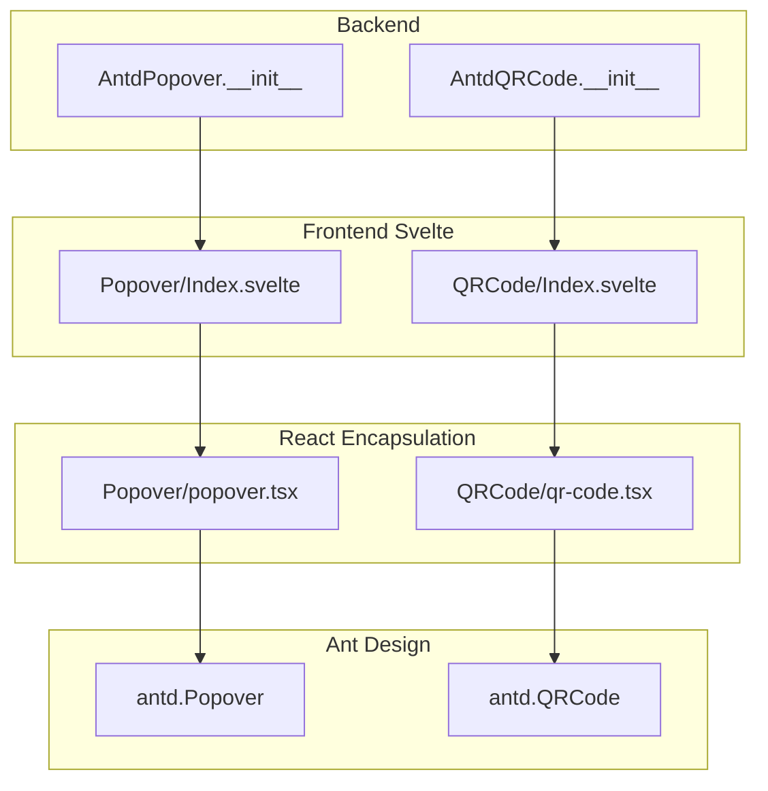
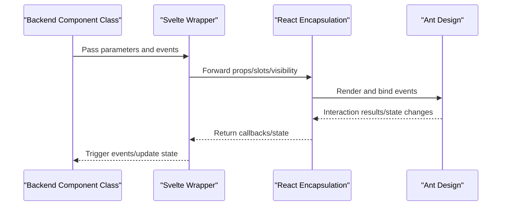
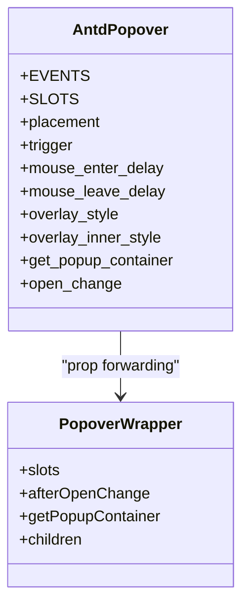
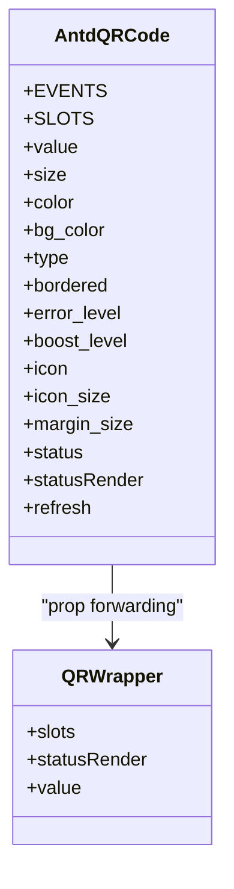
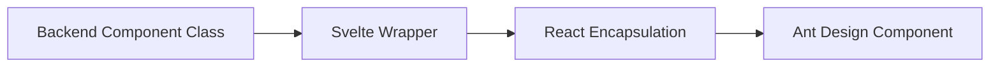

# Popover and QRCode

<cite>
**Files Referenced in This Document**
- [popover.tsx](file://frontend/antd/popover/popover.tsx)
- [Index.svelte (Popover)](file://frontend/antd/popover/Index.svelte)
- [__init__.py (AntdPopover)](file://backend/modelscope_studio/components/antd/popover/__init__.py)
- [README-zh_CN.md (Popover docs)](file://docs/components/antd/popover/README-zh_CN.md)
- [README.md (Popover docs)](file://docs/components/antd/popover/README.md)
- [qr-code.tsx](file://frontend/antd/qr-code/qr-code.tsx)
- [Index.svelte (QRCode)](file://frontend/antd/qr-code/Index.svelte)
- [__init__.py (AntdQRCode)](file://backend/modelscope_studio/components/antd/qr_code/__init__.py)
- [README-zh_CN.md (QRCode docs)](file://docs/components/antd/qr_code/README-zh_CN.md)
- [README.md (QRCode docs)](file://docs/components/antd/qr_code/README.md)
</cite>

## Table of Contents

1. [Introduction](#introduction)
2. [Project Structure](#project-structure)
3. [Core Components](#core-components)
4. [Architecture Overview](#architecture-overview)
5. [Detailed Component Analysis](#detailed-component-analysis)
6. [Dependency Analysis](#dependency-analysis)
7. [Performance Considerations](#performance-considerations)
8. [Troubleshooting Guide](#troubleshooting-guide)
9. [Conclusion](#conclusion)
10. [Appendix](#appendix)

## Introduction

This document provides a comprehensive explanation of the **Popover** and **QRCode** components, from underlying implementation to usage at the application layer. Topics covered include:

- Popover: trigger modes, position control, content customization, animation integration, nested usage, delayed display, accessibility support, and more
- QRCode: encoded content, size and margin, color and background, error correction level, icon overlay, dynamic refresh, custom styles, and print optimization
- Complex layout positioning strategies and mobile scanning experience recommendations

## Project Structure

Both components follow a unified layered design of "backend component class + frontend Svelte wrapper + React encapsulation":

- The backend component class handles parameter validation, event binding, example values, and render switches
- The frontend Svelte layer handles prop forwarding, slot processing, and visibility control
- The React encapsulation layer bridges with Ant Design components and supports slot and function callback conversion

Diagram Source

- [**init**.py (AntdPopover):10-124](file://backend/modelscope_studio/components/antd/popover/__init__.py#L10-L124)
- [Index.svelte (Popover):10-72](file://frontend/antd/popover/Index.svelte#L10-L72)
- [popover.tsx:7-34](file://frontend/antd/popover/popover.tsx#L7-L34)
- [**init**.py (AntdQRCode):10-96](file://backend/modelscope_studio/components/antd/qr_code/__init__.py#L10-L96)
- [Index.svelte (QRCode):10-63](file://frontend/antd/qr-code/Index.svelte#L10-L63)
- [qr-code.tsx:6-20](file://frontend/antd/qr-code/qr-code.tsx#L6-L20)

Section Source

- [**init**.py (AntdPopover):10-124](file://backend/modelscope_studio/components/antd/popover/__init__.py#L10-L124)
- [Index.svelte (Popover):10-72](file://frontend/antd/popover/Index.svelte#L10-L72)
- [popover.tsx:7-34](file://frontend/antd/popover/popover.tsx#L7-L34)
- [**init**.py (AntdQRCode):10-96](file://backend/modelscope_studio/components/antd/qr_code/__init__.py#L10-L96)
- [Index.svelte (QRCode):10-63](file://frontend/antd/qr-code/Index.svelte#L10-L63)
- [qr-code.tsx:6-20](file://frontend/antd/qr-code/qr-code.tsx#L6-L20)

## Core Components

- Popover
  - Supports multiple trigger modes: hover, focus, click, context menu
  - Supports 12 placement positions: top/bottom/left/right and four corners
  - Supports title and content slots for injecting arbitrary content
  - Supports open state change event binding
  - Supports custom container mount point and delayed display control
- QRCode
  - Supports canvas/svg output types
  - Supports foreground color, background color, border, icon overlay, and margin
  - Supports four error correction levels: L/M/Q/H
  - Supports status render slot and refresh event binding

Section Source

- [**init**.py (AntdPopover):43-59](file://backend/modelscope_studio/components/antd/popover/__init__.py#L43-L59)
- [**init**.py (AntdQRCode):29-40](file://backend/modelscope_studio/components/antd/qr_code/__init__.py#L29-L40)

## Architecture Overview

The following diagram shows the call chain from the backend component class to the frontend Svelte wrapper, then to the React encapsulation layer and Ant Design.

Diagram Source

- [**init**.py (AntdPopover):14-18](file://backend/modelscope_studio/components/antd/popover/__init__.py#L14-L18)
- [Index.svelte (Popover):24-52](file://frontend/antd/popover/Index.svelte#L24-L52)
- [popover.tsx:10-34](file://frontend/antd/popover/popover.tsx#L10-L34)
- [**init**.py (AntdQRCode):15-19](file://backend/modelscope_studio/components/antd/qr_code/__init__.py#L15-L19)
- [Index.svelte (QRCode):22-45](file://frontend/antd/qr-code/Index.svelte#L22-L45)
- [qr-code.tsx:6-20](file://frontend/antd/qr-code/qr-code.tsx#L6-L20)

## Detailed Component Analysis

### Popover Component

- Trigger Modes
  - Supports hover/focus/click/contextMenu and their combinations
  - Entry/leave delays can be controlled via delay parameters
- Position Control
  - Supports top/left/right/bottom and all nine grid positions
  - Supports overflow auto-adjustment and arrow configuration
- Content Customization
  - Supports title/content slots for rendering arbitrary content
  - Supports overlay style and inner style
- Animation and Events
  - Provides the open_change event for listening to open state changes
  - Supports custom container mount points for precise positioning in complex layouts
- Nested Usage
  - Avoid z-index conflicts by customizing the container mount point
  - Be careful to avoid focus issues caused by multiple layered popovers activating simultaneously
- Delayed Display
  - Control the display timing using entry/leave delay parameters
- Accessibility Support
  - Recommended to combine with aria-\* attributes and keyboard navigation
  - Pay attention to semantic labels and description text in nested scenarios

Diagram Source

- [**init**.py (AntdPopover):14-105](file://backend/modelscope_studio/components/antd/popover/__init__.py#L14-L105)
- [popover.tsx:10-34](file://frontend/antd/popover/popover.tsx#L10-L34)

Section Source

- [**init**.py (AntdPopover):23-105](file://backend/modelscope_studio/components/antd/popover/__init__.py#L23-L105)
- [Index.svelte (Popover):24-52](file://frontend/antd/popover/Index.svelte#L24-L52)
- [popover.tsx:10-34](file://frontend/antd/popover/popover.tsx#L10-L34)
- [README-zh_CN.md (Popover docs):1-8](file://docs/components/antd/popover/README-zh_CN.md#L1-L8)
- [README.md (Popover docs):1-8](file://docs/components/antd/popover/README.md#L1-L8)

### QRCode Component

- Encoded Content and Size
  - value: the encoded content of the QR code
  - size: overall size; margin_size: outer margin; bordered: whether to show a border
- Color and Style
  - color: foreground color; bg_color: background color; type: canvas/svg output
- Error Correction and Enhancement
  - error_level: four correction levels L/M/Q/H
  - boost_level: enhance recognition capability (boolean)
- Icon Overlay and Status
  - icon: center icon URL; icon_size: icon size or size configuration
  - status: active/expired/loading/scanned states
  - statusRender: status render slot
- Dynamic Updates and Events
  - refresh event: used to trigger QR code regeneration
- Custom Styles and Print Optimization
  - Theme adaptation via styles and class names
  - For print scenarios, it is recommended to use fixed sizes and high-contrast colors

Diagram Source

- [**init**.py (AntdQRCode):15-77](file://backend/modelscope_studio/components/antd/qr_code/__init__.py#L15-L77)
- [qr-code.tsx:6-20](file://frontend/antd/qr-code/qr-code.tsx#L6-L20)

Section Source

- [**init**.py (AntdQRCode):24-77](file://backend/modelscope_studio/components/antd/qr_code/__init__.py#L24-L77)
- [Index.svelte (QRCode):22-45](file://frontend/antd/qr-code/Index.svelte#L22-L45)
- [qr-code.tsx:6-20](file://frontend/antd/qr-code/qr-code.tsx#L6-L20)
- [README-zh_CN.md (QRCode docs):1-8](file://docs/components/antd/qr_code/README-zh_CN.md#L1-L8)
- [README.md (QRCode docs):1-8](file://docs/components/antd/qr_code/README.md#L1-L8)

## Dependency Analysis

- Backend Component Class and Frontend Wrapper
  - The backend class defines parameters and events; the frontend Svelte layer is responsible for the final assembly of props and slots
- React Encapsulation and Ant Design
  - The React encapsulation layer converts slots into renderable nodes and safely passes callback functions to Ant Design components
- Event Binding
  - Popover: open_change
  - QRCode: refresh

Diagram Source

- [**init**.py (AntdPopover):14-18](file://backend/modelscope_studio/components/antd/popover/__init__.py#L14-L18)
- [Index.svelte (Popover):24-52](file://frontend/antd/popover/Index.svelte#L24-L52)
- [popover.tsx:10-34](file://frontend/antd/popover/popover.tsx#L10-L34)
- [**init**.py (AntdQRCode):15-19](file://backend/modelscope_studio/components/antd/qr_code/__init__.py#L15-L19)
- [Index.svelte (QRCode):22-45](file://frontend/antd/qr-code/Index.svelte#L22-L45)
- [qr-code.tsx:6-20](file://frontend/antd/qr-code/qr-code.tsx#L6-L20)

Section Source

- [**init**.py (AntdPopover):14-18](file://backend/modelscope_studio/components/antd/popover/__init__.py#L14-L18)
- [Index.svelte (Popover):24-52](file://frontend/antd/popover/Index.svelte#L24-L52)
- [popover.tsx:10-34](file://frontend/antd/popover/popover.tsx#L10-L34)
- [**init**.py (AntdQRCode):15-19](file://backend/modelscope_studio/components/antd/qr_code/__init__.py#L15-L19)
- [Index.svelte (QRCode):22-45](file://frontend/antd/qr-code/Index.svelte#L22-L45)
- [qr-code.tsx:6-20](file://frontend/antd/qr-code/qr-code.tsx#L6-L20)

## Performance Considerations

- Popover
  - Set trigger modes and delays appropriately to avoid frequent re-renders
  - For complex content, consider lazy loading or on-demand rendering
  - The container mount point should be as close to the target element as possible to reduce DOM nesting depth
- QRCode
  - Canvas output may create memory pressure at large sizes; consider using svg or reducing the size if necessary
  - Icon overlay increases rendering overhead; lightweight icons are recommended
  - The status render slot should only be enabled when needed to avoid unnecessary computation

## Troubleshooting Guide

- Popover
  - Open state not taking effect: check open_change event binding and the open parameter
  - Content not displayed: confirm that the title/content slots are correctly passed
  - Positioning issues: check whether get_popup_container returns a valid container
- QRCode
  - Cannot refresh: confirm that the refresh event is successfully bound
  - Styles not taking effect: check whether color/bg_color and type settings are correct
  - Scanning difficulties: increase error_level or enable boost_level

Section Source

- [**init**.py (AntdPopover):14-18](file://backend/modelscope_studio/components/antd/popover/__init__.py#L14-L18)
- [Index.svelte (Popover):24-52](file://frontend/antd/popover/Index.svelte#L24-L52)
- [**init**.py (AntdQRCode):15-19](file://backend/modelscope_studio/components/antd/qr_code/__init__.py#L15-L19)
- [Index.svelte (QRCode):22-45](file://frontend/antd/qr-code/Index.svelte#L22-L45)

## Conclusion

- Both Popover and QRCode follow a consistent three-layer encapsulation pattern, offering good extensibility and controllability
- Popover focuses on interaction and layout; QRCode focuses on data encoding and visual presentation
- It is recommended to combine the strategies and notes in this document when optimizing for complex layouts and mobile scenarios

## Appendix

- Demo Entry References
  - Popover demo: [README-zh_CN.md (Popover docs)](file://docs/components/antd/popover/README-zh_CN.md#L7)
  - QRCode demo: [README-zh_CN.md (QRCode docs)](file://docs/components/antd/qr_code/README-zh_CN.md#L7)
